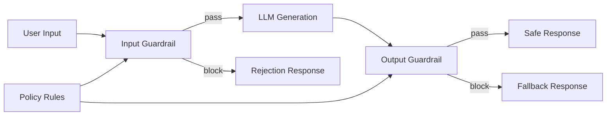

# AI Guardrails — A 2-Day Crash Course

Guardrails are runtime safety layers for LLM applications — they validate inputs, filter outputs, detect PII, block harmful content, and enforce business rules before responses reach users.




---

## Part 0 — Why Guardrails Exist

LLMs are probabilistic — you can't guarantee safe output without runtime checks, especially in BFSI and other regulated environments.

A fine-tuned model can still leak a customer's account number in the wrong context. A well-prompted model can still be manipulated into generating harmful content through injection attacks. RLHF and system prompts help, but they are training-time and configuration-time constraints. They do not constitute a runtime safety net.

In production, several failure modes converge at once:

- **Prompt injection** — users craft inputs that override your system prompt
- **Data leakage** — the model regurgitates PII from its context window or training data
- **Off-topic drift** — the model answers questions it was never supposed to handle
- **Hallucinated facts** — confident, wrong answers in domains where accuracy is non-negotiable (loan rates, medical dosages, legal clauses)
- **Regulatory exposure** — unfiltered outputs can violate GDPR, DPDP, SEBI guidelines, HIPAA, or your own compliance policy

Guardrails are your last line of defense between the model and the user. They are not optional in production.

---

## Vocabulary

| Term | What it means |
|---|---|
| **Input Guard** | A check run against the user's message before it reaches the model |
| **Output Guard** | A check run against the model's response before it reaches the user |
| **PII Detection** | Identifying personally identifiable information (names, phone numbers, Aadhaar, PAN, account numbers) in text |
| **PII Redaction** | Replacing detected PII with a placeholder (e.g., `[PHONE_NUMBER]`) before logging or passing downstream |
| **Content Filter** | A classifier that flags or blocks messages based on category (hate speech, violence, sexual content, self-harm) |
| **Toxicity Detector** | A model or rule system that scores text for offensive, abusive, or harmful language |
| **Topic Restriction** | A guardrail that blocks the model from answering questions outside a defined domain |
| **Hallucination Detector** | A post-hoc check that compares the model's claims against a grounding source (retrieved documents, structured data) |
| **NeMo Guardrails** | NVIDIA's open-source framework for adding programmable guardrails to LLM apps using a custom language called Colang |
| **Guardrails AI** | An open-source Python library for defining output validators and structured output constraints using a RAIL spec |
| **Llama Guard** | Meta's open-source safety classifier fine-tuned on the MLCommons taxonomy — classifies input/output pairs as safe or unsafe across 11 hazard categories |

---

## Day 1 — Guardrail Types, Validation, PII, Content Filtering, NeMo Setup

### 1.1 The Guardrail Pipeline

```
User Input
    │
    ▼
[Input Guard]          ← topic restriction, injection detection, PII scan
    │
    ▼
LLM (your model)
    │
    ▼
[Output Guard]         ← content filter, toxicity, PII redaction, hallucination check
    │
    ▼
User Response
```

Input guards protect the model. Output guards protect the user and your organisation.

Both matter. A system that only filters outputs still exposes your model to adversarial inputs, jailbreaks, and injected instructions. A system that only filters inputs can still surface harmful, incorrect, or leaky responses.

### 1.2 Implementing Basic Input Validation

The simplest input guard is a topic classifier. Before calling your LLM, you run a smaller, faster model (or a regex/keyword list) to determine whether the question is in scope.

```python
from openai import OpenAI

client = OpenAI()

ALLOWED_TOPICS = ["account balance", "loan status", "credit card", "fund transfer", "branch locator"]

def is_in_scope(user_message: str) -> bool:
    response = client.chat.completions.create(
        model="gpt-4o-mini",
        messages=[
            {
                "role": "system",
                "content": (
                    "You are a topic classifier for a bank chatbot. "
                    "Reply with only 'yes' if the user's question is about: "
                    f"{', '.join(ALLOWED_TOPICS)}. "
                    "Reply with only 'no' otherwise."
                ),
            },
            {"role": "user", "content": user_message},
        ],
        max_tokens=5,
        temperature=0,
    )
    return response.choices[0].message.content.strip().lower() == "yes"
```

This is a simple but effective first layer. Combine it with a blocklist for known injection patterns.

### 1.3 Implementing Basic Output Validation

Output guards intercept the model's response before delivery. At minimum, you want to:

1. Strip or redact PII
2. Check for toxicity
3. Enforce response format constraints

```python
import re

PII_PATTERNS = {
    "PHONE": r"\b[6-9]\d{9}\b",
    "PAN": r"\b[A-Z]{5}[0-9]{4}[A-Z]\b",
    "AADHAAR": r"\b\d{4}\s?\d{4}\s?\d{4}\b",
    "EMAIL": r"\b[A-Za-z0-9._%+-]+@[A-Za-z0-9.-]+\.[A-Z|a-z]{2,}\b",
}

def redact_pii(text: str) -> str:
    for label, pattern in PII_PATTERNS.items():
        text = re.sub(pattern, f"[{label}]", text)
    return text
```

Regex is a baseline — it misses contextual PII like "my account ending in 4821" or a customer's name embedded in a sentence. You need a named-entity recognition (NER) model for higher recall.

### 1.4 PII Detection with a NER Model

```python
import spacy

nlp = spacy.load("en_core_web_trf")

def detect_pii_entities(text: str) -> list[dict]:
    doc = nlp(text)
    entities = []
    for ent in doc.ents:
        if ent.label_ in ("PERSON", "ORG", "GPE", "MONEY", "CARDINAL"):
            entities.append({"text": ent.text, "label": ent.label_, "start": ent.start_char, "end": ent.end_char})
    return entities
```

For production BFSI use, look at:
- **Microsoft Presidio** — open-source PII detection and anonymization, supports custom recognizers
- **AWS Comprehend** — managed PII detection API
- **Google Cloud DLP** — managed data loss prevention with templated info types

Presidio is the most commonly used in self-hosted environments because you can add domain-specific recognizers (IFSC codes, policy numbers, CIN).

### 1.5 Content Filtering

Content filtering classifies text across harm categories: hate speech, violence, sexual content, self-harm, and others.

OpenAI's Moderation API is a quick option if you are already in that ecosystem:

```python
def is_safe_content(text: str) -> bool:
    response = client.moderations.create(input=text)
    result = response.results[0]
    return not result.flagged
```

For self-hosted or provider-agnostic setups, use a local classifier:

```python
from transformers import pipeline

toxicity = pipeline(
    "text-classification",
    model="unitary/toxic-bert",
    top_k=None,
)

def check_toxicity(text: str, threshold: float = 0.7) -> bool:
    scores = toxicity(text)[0]
    for score in scores:
        if score["label"] == "toxic" and score["score"] > threshold:
            return True
    return False
```

Tune the threshold based on your tolerance. In a bank chatbot, 0.7 is aggressive — a complaint about a "terrible" experience would not be toxic, but some classifiers flag strong negative sentiment.

### 1.6 NeMo Guardrails Setup

NeMo Guardrails gives you a declarative way to define conversation flows and safety rails using Colang, a purpose-built language.

Install:

```bash
pip install nemoguardrails
```

Project structure:

```
my_guardrails/
├── config.yml
├── main.co        # Colang flows
└── prompts.yml    # Optional prompt overrides
```

`config.yml`:

```yaml
models:
  - type: main
    engine: openai
    model: gpt-4o

rails:
  input:
    flows:
      - check user input
  output:
    flows:
      - check bot response
```

`main.co`:

```colang
define user ask about investments
  "What stocks should I buy?"
  "Give me investment advice"
  "Which mutual fund is best?"

define bot decline investment advice
  "I can only assist with your account, loans, and banking services. For investment advice, please speak with our wealth management team."

define flow check user input
  user ask about investments
  bot decline investment advice

define flow check bot response
  bot ...
  $allowed = execute check_response(response=$bot_message)
  if not $allowed
    bot say "I'm unable to share that information. Please contact our support team."
```

Register and run:

```python
from nemoguardrails import RailsConfig, LLMRails

config = RailsConfig.from_path("./my_guardrails")
rails = LLMRails(config)

response = await rails.generate_async(
    messages=[{"role": "user", "content": "What is my account balance?"}]
)
```

NeMo Guardrails is well-suited for dialogue flow control — it shines when you want to enforce conversation patterns, not just filter text.

---

## Day 2 — Guardrails AI, Llama Guard, Business Rules, Hallucination Detection, Production

### 2.1 Guardrails AI — Structured Output Validation

Guardrails AI focuses on validating that LLM outputs conform to a schema and pass custom validators. This is critical when your downstream system consumes structured data — a loan decision, a JSON payload, a classification label.

Install:

```bash
pip install guardrails-ai
```

Define a guard with validators:

```python
from guardrails import Guard
from guardrails.hub import ValidLength, ValidChoices
import openai

guard = Guard().use_many(
    ValidLength(min=10, max=500, on_fail="reask"),
    ValidChoices(choices=["approved", "rejected", "review_required"], on_fail="exception"),
)

response = guard(
    openai.chat.completions.create,
    prompt="Given this loan application summary, classify the outcome.",
    model="gpt-4o",
)

print(response.validated_output)
```

The `on_fail` strategy controls what happens when a validator fails:
- `reask` — send the failed output back to the model with instructions to fix it (incurs an extra LLM call)
- `exception` — raise an exception, let your application handle it
- `fix` — attempt automatic correction where possible
- `filter` — remove the offending value

Use `reask` sparingly — it adds latency and cost. Reserve it for situations where a corrected response is genuinely recoverable.

### 2.2 Llama Guard — Safety Classification

Llama Guard is a fine-tuned Llama model that acts as a safety classifier. It takes a conversation (prompt + response) and outputs a `safe` or `unsafe` label, along with the hazard category if unsafe.

The MLCommons AI Safety taxonomy it covers:
- S1: Violent crimes
- S2: Non-violent crimes
- S3: Sex-related crimes
- S4: Child sexual exploitation
- S5: Defamation
- S6: Specialised advice (financial, medical, legal)
- S7: Privacy violations
- S8: Intellectual property
- S9: Indiscriminate weapons
- S10: Hate speech
- S11: Suicide and self-harm

```python
from transformers import AutoTokenizer, AutoModelForCausalLM
import torch

model_id = "meta-llama/Llama-Guard-3-8B"
tokenizer = AutoTokenizer.from_pretrained(model_id)
model = AutoModelForCausalLM.from_pretrained(
    model_id, torch_dtype=torch.bfloat16, device_map="auto"
)

def check_with_llama_guard(user_message: str, assistant_response: str) -> dict:
    conversation = [
        {"role": "user", "content": user_message},
        {"role": "assistant", "content": assistant_response},
    ]
    input_ids = tokenizer.apply_chat_template(
        conversation, return_tensors="pt"
    ).to(model.device)
    output = model.generate(input_ids, max_new_tokens=100, pad_token_id=0)
    result = tokenizer.decode(output[0][input_ids.shape[-1]:], skip_special_tokens=True)
    is_safe = result.strip().startswith("safe")
    return {"safe": is_safe, "detail": result.strip()}
```

Llama Guard 3 is the current generation. Run it on a GPU — it is an 8B parameter model and inference on CPU is impractical at production latency targets.

For BFSI, category S6 (specialised financial advice) is your primary concern alongside S7 (privacy). You can customize the taxonomy to add domain-specific categories.

### 2.3 Custom Business Rules

Your compliance team will give you requirements that no off-the-shelf guard covers. You build these as custom validators.

Examples in banking:
- The bot must never quote a specific interest rate without a disclaimer
- The bot must never promise a loan approval timeline
- The bot must redirect suicide/self-harm mentions to a helpline (S11 handling)
- The bot must not discuss competitor products

```python
import re
from typing import Callable

BusinessRule = Callable[[str], tuple[bool, str]]

def no_rate_commitment(text: str) -> tuple[bool, str]:
    pattern = r"\b(\d+(\.\d+)?%?\s*(per\s*annum|p\.a\.|interest\s*rate))\b"
    if re.search(pattern, text, re.IGNORECASE):
        return False, "Response contains a rate commitment without disclaimer"
    return True, ""

def no_loan_timeline_promise(text: str) -> tuple[bool, str]:
    patterns = [
        r"\bwithin\s+\d+\s+(business\s+)?days\b",
        r"\byou\s+will\s+receive\s+.*\s+by\b",
        r"\bapproved\s+within\b",
    ]
    for p in patterns:
        if re.search(p, text, re.IGNORECASE):
            return False, "Response contains a timeline commitment"
    return True, ""

BUSINESS_RULES: list[BusinessRule] = [
    no_rate_commitment,
    no_loan_timeline_promise,
]

def apply_business_rules(response: str) -> tuple[bool, list[str]]:
    failures = []
    for rule in BUSINESS_RULES:
        passed, reason = rule(response)
        if not passed:
            failures.append(reason)
    return len(failures) == 0, failures
```

Keep business rules in a separate module. They change frequently as compliance policies evolve.

### 2.4 Hallucination Detection

Hallucination detection is the hardest guardrail to implement reliably. The approaches, in order of complexity:

**Grounding check (RAG scenarios):** If your system retrieved documents to answer the question, verify that the response only makes claims supported by the retrieved context.

```python
from openai import OpenAI

client = OpenAI()

def check_grounding(response: str, context: str) -> dict:
    check_prompt = f"""
You are a fact-checker. Given a context and a response, determine whether every factual claim in the response is supported by the context.

Context:
{context}

Response:
{response}

Reply with JSON: {{"grounded": true/false, "unsupported_claims": ["..."]}}
"""
    result = client.chat.completions.create(
        model="gpt-4o-mini",
        messages=[{"role": "user", "content": check_prompt}],
        response_format={"type": "json_object"},
        temperature=0,
    )
    import json
    return json.loads(result.choices[0].message.content)
```

**Self-consistency check:** Generate the same response multiple times with temperature > 0 and check for agreement. High variance in factual claims signals low confidence.

**External tools:** RAGAS, TruLens, and DeepEval provide hallucination scoring as part of a broader evaluation framework. Use them in offline evaluation pipelines, not synchronous request paths.

⚠️ Grounding checks that call an LLM add 300–800ms to your response time. Make this async or batch it for offline monitoring rather than blocking the user.

### 2.5 Latency Impact

Every guardrail adds latency. You need to know the cost before you add it.

| Guardrail | Typical Latency | Notes |
|---|---|---|
| Regex PII scan | <5ms | Negligible |
| NER-based PII (CPU) | 50–200ms | Depends on text length |
| Topic classifier (small model) | 30–100ms | Distilbert-class |
| OpenAI Moderation API | 100–300ms | Network call |
| Llama Guard (GPU) | 200–600ms | 8B model, batching helps |
| LLM-based grounding check | 400–1200ms | Full LLM call |
| NeMo Guardrails (full pipeline) | 200–800ms | Includes flow evaluation |

Aim for total guardrail overhead under 500ms for interactive use cases. This means you cannot stack every guard synchronously.

### 2.6 Async vs Sync Guardrails

Structure your pipeline by risk level:

**Synchronous (blocking):** Only the checks that, if failed, should prevent the response from reaching the user at all.
- Input topic restriction
- Critical content filter (violence, self-harm)
- PII redaction from output

**Asynchronous (non-blocking, logged):** Checks where a failure triggers an alert or audit trail but does not need to block the user experience.
- Grounding/hallucination scoring
- Business rule compliance logging
- Llama Guard classification (used to flag for human review)

```python
import asyncio

async def process_request(user_message: str, context: str) -> dict:
    # Synchronous input guard — block if it fails
    if not is_in_scope(user_message):
        return {"response": "I can only assist with banking queries.", "blocked": True}

    # Call LLM
    raw_response = await call_llm_async(user_message, context)

    # Synchronous output guard — redact before delivery
    safe_response = redact_pii(raw_response)

    # Async guards — fire and forget, log results
    asyncio.create_task(
        log_guardrail_checks(user_message, safe_response, context)
    )

    return {"response": safe_response, "blocked": False}


async def log_guardrail_checks(user_input: str, response: str, context: str):
    grounding = check_grounding(response, context)
    safety = check_with_llama_guard(user_input, response)
    await write_audit_log({"grounding": grounding, "safety": safety})
```

### 2.7 Monitoring Guardrail Triggers

Guardrail trigger rates are a leading indicator of system health. Track them as metrics.

Metrics to emit:

```
guardrail_triggered_total{type="input_topic_restriction", app="bank_chatbot"}
guardrail_triggered_total{type="pii_detected", entity_type="PHONE"}
guardrail_triggered_total{type="content_filter", category="toxicity"}
guardrail_triggered_total{type="business_rule", rule="no_rate_commitment"}
guardrail_triggered_total{type="hallucination_detected"}
```

Alerts to set:

- Input topic restriction trigger rate > 15% — possible prompt injection campaign
- PII detection rate spike — model may be leaking context from other users (check for context poisoning)
- Business rule trigger rate > 5% — model may be drifting off-policy, consider retuning system prompt

Push these metrics to Prometheus. Build a Grafana dashboard. Treat guardrail trigger rates the same way you treat error rates in a microservice.

### 2.8 BFSI-Specific Requirements

Banking, financial services, and insurance have requirements beyond generic content safety.

**Regulatory compliance:**
- RBI guidelines prohibit promising guaranteed returns in any communication
- SEBI LODR requires that investor communications include prescribed risk disclosures
- IRDAI mandates that insurance product descriptions include policy exclusions
- GDPR/DPDP requires that PII not be retained in logs beyond prescribed periods

**Audit trail:** Every LLM interaction — input, output, guardrail decisions — must be logged with a timestamp, user ID, session ID, and retention metadata. This is a hard requirement for RBI-regulated entities.

**Human escalation path:** Your guardrail architecture must include a fallback to human agents. When a guardrail blocks a response, the user needs a clear path forward. Dropping them into a dead end is a compliance and UX failure.

**Model cards and explainability:** For guardrail models you deploy internally (Llama Guard, a custom classifier), maintain a model card that documents training data, known failure modes, and evaluation benchmarks. Regulators will ask for this.

---

## Worked Example — Guardrailed Customer Service Chatbot for a Bank

This brings together the Day 1 and Day 2 concepts into a single coherent pipeline.

```python
import asyncio
import json
import re
from dataclasses import dataclass
from datetime import datetime
from typing import Optional
from openai import AsyncOpenAI

client = AsyncOpenAI()

ALLOWED_TOPICS = [
    "account balance", "transaction history", "fund transfer",
    "loan status", "credit card", "branch locator", "cheque book",
    "fixed deposit", "customer support",
]

PII_PATTERNS = {
    "PHONE": r"\b[6-9]\d{9}\b",
    "PAN": r"\b[A-Z]{5}[0-9]{4}[A-Z]\b",
    "AADHAAR": r"\b\d{4}\s?\d{4}\s?\d{4}\b",
    "EMAIL": r"\b[A-Za-z0-9._%+-]+@[A-Za-z0-9.-]+\.[A-Z|a-z]{2,}\b",
    "ACCOUNT": r"\b\d{9,18}\b",
}

SYSTEM_PROMPT = """
You are a customer service assistant for Sunrise Bank. You help customers with:
- Account balances and transaction history
- Fund transfers and payment queries
- Loan and credit card status
- Branch and ATM locator
- General banking queries

You must not:
- Give specific financial or investment advice
- Promise specific interest rates without noting they are subject to change
- Promise loan approval timelines
- Discuss competitor banks
Always be accurate, brief, and escalate complex issues to human agents.
"""


@dataclass
class GuardrailResult:
    passed: bool
    block_reason: Optional[str]
    warnings: list[str]


def redact_pii(text: str) -> str:
    for label, pattern in PII_PATTERNS.items():
        text = re.sub(pattern, f"[{label}]", text, flags=re.IGNORECASE)
    return text


async def check_topic(message: str) -> bool:
    response = await client.chat.completions.create(
        model="gpt-4o-mini",
        messages=[
            {
                "role": "system",
                "content": (
                    "Reply only 'yes' if the message is about: "
                    f"{', '.join(ALLOWED_TOPICS)}. Reply 'no' otherwise."
                ),
            },
            {"role": "user", "content": message},
        ],
        max_tokens=5,
        temperature=0,
    )
    return response.choices[0].message.content.strip().lower() == "yes"


async def run_input_guards(user_message: str) -> GuardrailResult:
    in_scope = await check_topic(user_message)
    if not in_scope:
        return GuardrailResult(passed=False, block_reason="out_of_scope", warnings=[])
    return GuardrailResult(passed=True, block_reason=None, warnings=[])


def run_output_guards(response: str) -> tuple[str, GuardrailResult]:
    warnings = []
    redacted = redact_pii(response)
    if redacted != response:
        warnings.append("pii_redacted")

    rate_pattern = r"\b\d+(\.\d+)?%\s*(p\.a\.|per\s*annum|interest\s*rate)?\b"
    if re.search(rate_pattern, redacted, re.IGNORECASE):
        warnings.append("rate_mentioned_without_disclaimer")
        redacted += (
            "\n\n*Interest rates are indicative and subject to change. "
            "Please visit your nearest branch or call us for current applicable rates.*"
        )

    return redacted, GuardrailResult(passed=True, block_reason=None, warnings=warnings)


async def generate_response(user_message: str, conversation_history: list) -> str:
    messages = [{"role": "system", "content": SYSTEM_PROMPT}]
    messages.extend(conversation_history)
    messages.append({"role": "user", "content": user_message})
    response = await client.chat.completions.create(
        model="gpt-4o", messages=messages, temperature=0.3, max_tokens=500,
    )
    return response.choices[0].message.content


async def write_audit_log(entry: dict):
    # In production: write to your SIEM/audit store (Splunk, CloudWatch, etc.)
    print(f"[AUDIT] {json.dumps(entry)}")


async def handle_message(
    user_message: str,
    conversation_history: list,
    session_id: str,
    user_id: str,
) -> dict:
    audit_entry = {
        "timestamp": datetime.utcnow().isoformat(),
        "session_id": session_id,
        "user_id": user_id,
        "input": redact_pii(user_message),
    }

    input_result = await run_input_guards(user_message)
    if not input_result.passed:
        response = (
            "I can help you with account queries, transfers, loans, and general banking. "
            "For other queries, please call our helpline at 1800-XXX-XXXX or visit a branch."
        )
        audit_entry.update({"blocked": True, "block_reason": input_result.block_reason, "response": response})
        asyncio.create_task(write_audit_log(audit_entry))
        return {"response": response, "blocked": True}

    raw_response = await generate_response(user_message, conversation_history)
    final_response, output_result = run_output_guards(raw_response)

    audit_entry.update({
        "blocked": False,
        "output_warnings": output_result.warnings,
        "response": final_response,
    })
    asyncio.create_task(write_audit_log(audit_entry))
    return {"response": final_response, "blocked": False}
```

This handles the core BFSI requirements: topic scoping, PII redaction, rate disclaimer injection, and async audit logging — all in a single coherent flow.

---

## Pitfalls

**Stacking too many synchronous guards.** Each LLM-based guard call adds 200–800ms. Four synchronous LLM guards on a 1-second primary response gives you a 2–4 second total latency. Users leave. Move anything that does not need to block the response to async.

**Regex-only PII detection.** Regex catches structured PII like phone numbers and PANs. It misses unstructured PII: "my son Rahul transferred money to his account." Use NER alongside regex, not instead of it.

**Treating guardrails as a one-time configuration.** Your model will be updated. Your system prompt will change. New topics will emerge. Guardrails need the same versioning, testing, and release process as application code.

**Binary safe/unsafe without escalation.** A guardrail that just says "I can't help with that" and ends the conversation is a dead end. Always give the user a next step — a phone number, a branch, a form.

**Not testing adversarial inputs.** Before you go live, run a red-team exercise. Try prompt injection, jailbreaks, and edge cases. Your QA test cases for guardrails should look very different from your standard functional tests.

**Logging raw PII in your audit trail.** Your audit trail needs to capture enough to reconstruct what happened, but it must not store raw PII beyond what regulation requires. Redact before logging, not after.

**Over-blocking.** A guardrail that triggers too aggressively degrades user experience and erodes trust. Track false positive rates — cases where a legitimate query was blocked — and tune your thresholds accordingly.

---

## Quick Reference

```
Guardrail stack (production minimum):
  Input:   topic classifier → PII scan → injection pattern check
  Output:  PII redaction → content filter → business rule check
  Async:   grounding check → Llama Guard → audit log

Tools:
  PII:        Microsoft Presidio, spaCy NER, AWS Comprehend
  Content:    OpenAI Moderation API, toxic-bert, Llama Guard
  Structured: Guardrails AI (RAIL spec + validators)
  Dialogue:   NeMo Guardrails (Colang flows)
  Eval:       RAGAS, TruLens, DeepEval

Key env vars:
  GUARDRAILS_LOG_LEVEL=info
  GUARDRAILS_REASK_MAX=2
  NEMO_GUARDRAILS_CONFIG_PATH=./config

Latency budget (interactive):
  Total guardrail overhead < 500ms
  Synchronous path: regex + small classifier only
  All LLM-based checks: async

BFSI non-negotiables:
  - Immutable audit log for every interaction
  - PII redacted before logging
  - Human escalation path on every block
  - Model card for every deployed classifier
```

---


## Top 10 Interview Questions

<details>
<summary><strong>Q: What is AI Guardrails and what problem does it solve?</strong></summary>

AI Guardrails addresses a specific need in modern engineering workflows. Understanding the core problem it solves — and the alternatives it replaced — is the foundation for every subsequent interview question. Frame your answer around the pain point first, then the solution.

</details>

<details>
<summary><strong>Q: How does AI Guardrails compare to its main alternatives?</strong></summary>

Every tool exists in an ecosystem of alternatives. Be prepared to articulate the specific tradeoffs: when AI Guardrails is the right choice, when an alternative is better, and what factors drive the decision (scale, team expertise, existing infrastructure, compliance requirements).

</details>

<details>
<summary><strong>Q: What are the most common production pitfalls with AI Guardrails?</strong></summary>

Production experience is what separates senior from junior engineers. Common pitfalls include: misconfiguration that works in dev but fails at scale, security oversights, inadequate monitoring, and operational procedures that are untested until an incident occurs. Cite specific examples from your experience.

</details>

<details>
<summary><strong>Q: How do you monitor and observe AI Guardrails in production?</strong></summary>

Key metrics to track, alerting thresholds to set, dashboards to build, and log patterns to watch. Production monitoring should cover: health/liveness, performance (latency, throughput), capacity (resource utilisation), and business impact (error rates affecting users). Explain which metrics are leading indicators versus lagging.

</details>

<details>
<summary><strong>Q: How do you scale AI Guardrails as load increases?</strong></summary>

Scaling strategies depend on the bottleneck: horizontal scaling (add more instances), vertical scaling (bigger instances), caching (reduce load), sharding (distribute data), and async processing (decouple components). Explain which approach applies to AI Guardrails and at what scale each strategy becomes necessary.

</details>

<details>
<summary><strong>Q: How do you handle security and access control with AI Guardrails?</strong></summary>

Security is non-negotiable in production. Cover: authentication and authorization mechanisms, secrets management (never in code), encryption (at rest and in transit), network security (firewalls, private networks), audit logging, and compliance requirements relevant to your industry.

</details>

<details>
<summary><strong>Q: How do you implement disaster recovery for AI Guardrails?</strong></summary>

DR planning requires defining RTO (recovery time objective) and RPO (recovery point objective), implementing backup strategies, testing restore procedures, and documenting runbooks. Explain your backup strategy, how you test restores, and what your recovery procedure looks like.

</details>

<details>
<summary><strong>Q: How do you automate AI Guardrails deployment and configuration management?</strong></summary>

Infrastructure as code, CI/CD pipelines, configuration management, and GitOps workflows. Explain how you version, test, deploy, and roll back changes. Cover: what is automated, what requires manual approval, and how you handle configuration drift.

</details>

<details>
<summary><strong>Q: How do you troubleshoot issues with AI Guardrails in production?</strong></summary>

A systematic debugging approach: check health endpoints, review recent changes (deploys, config changes), examine logs and metrics, reproduce the issue, identify root cause, fix, verify, and write a postmortem. Explain your actual debugging workflow with concrete examples.

</details>

<details>
<summary><strong>Q: What are the best practices for AI Guardrails that you have learned from experience?</strong></summary>

Best practices that go beyond documentation: lessons learned from production incidents, configuration patterns that prevent common issues, testing strategies that catch bugs before production, and operational procedures that reduce toil. Share specific examples where following (or not following) a best practice had measurable impact.

</details>

---


## Quick Quiz

Test your understanding with these rapid-fire questions (answers hidden):

<details>
<summary>1. What is the ONE core problem that AI Guardrails solves?</summary>
Re-read Part 0 — the mental model section. If you can explain the "why" in one sentence, you understand the foundation.
</details>

<details>
<summary>2. Name the 3 most important terms from the vocabulary section.</summary>
Review Part 1. These are the building blocks every conversation about AI Guardrails uses.
</details>

<details>
<summary>3. What is the first thing you would set up on Day 1?</summary>
Check the Day 1 section — the very first hands-on step that gets you a working result.
</details>

<details>
<summary>4. What is the most common production pitfall with AI Guardrails?</summary>
Review the Common Pitfalls section. The first item listed is typically the most frequently encountered.
</details>

<details>
<summary>5. How does AI Guardrails compare to its closest alternative?</summary>
Check the Comparison Matrix below — focus on the key differentiating row.
</details>


## Comparison Matrix

| Dimension | NeMo Guardrails | Guardrails AI | Custom Rules |
|-----------|-----------------|---------------|--------------|
| **Primary use case** | Core strength of NeMo Guardrails | Core strength of Guardrails AI | Core strength of Custom Rules |
| **Learning curve** | Moderate | Varies | Varies |
| **Community/ecosystem** | Active | Active | Growing |
| **Operational complexity** | Medium | Varies | Varies |
| **Best for** | See Part 0 | Different tradeoffs | Different tradeoffs |

> **How to read this matrix:** no tool wins on every dimension. Pick based on your specific constraints — team expertise, existing infrastructure, scale requirements, and compliance needs. The right choice is the one that fits your context, not the one with the most checkmarks.

## Next Steps

- `LLM-Security.md` — prompt injection, jailbreaks, model supply chain attacks
- `LLMOps.md` — model versioning, evaluation pipelines, A/B testing in production
- `Prompt-Engineering.md` — writing system prompts that reduce the guardrail burden upstream

---

## Recommended learning resources

**YouTube channels & playlists:**
- [DeepLearning.AI — Building Safe AI Systems](https://www.youtube.com/@Deeplearningai) — short courses on content filtering, output validation, and guardrail architecture for LLMs
- [AI Engineer — Guardrail Architecture Talks](https://www.youtube.com/@aiaboratories) — conference talks on input/output validation, policy enforcement, and safety layers
- [Anthropic Official — Safe AI Deployment](https://www.youtube.com/@AnthropicAI) — Claude's built-in safety features, usage policies, and content filtering patterns
- [Sam Witteveen — LLM Guardrails](https://www.youtube.com/@samwitteveen) — practical implementations of input validators, topic classifiers, and output filters

**Official docs & blogs:**
- [Guardrails AI Documentation](https://www.guardrailsai.com/docs) — the open-source guardrails framework: validators, structured output enforcement, and retry logic
- [OWASP Top 10 for LLM Applications](https://owasp.org/www-project-top-10-for-large-language-model-applications/) — threat taxonomy that guardrails are designed to mitigate
- [Anthropic Documentation — Safety Best Practices](https://docs.anthropic.com) — Claude-specific guidance on content policies, system prompts for safety, and usage limits

---

## The Mantra

> Guardrails are not a constraint on your LLM — they are the contract between your LLM and your users. Build them first, not last.
