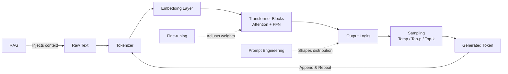

# LLM Fundamentals — A 2-Day Crash Course

> **In one sentence:** Large Language Models are neural networks trained on massive text corpora that predict the next token — understanding how they work (tokens, context windows, temperature, embeddings) is the foundation for every AI application you'll build or operate.

---

## Part 0 — Why this matters for engineers

Most engineers encounter LLMs one of two ways: through a chat interface or through an API call that returns a string. Both feel like magic. That's fine for demos — it's a liability in production.

When your LLM-powered feature starts hallucinating, costs 10x what you budgeted, or degrades under load, "it's a magic box" gets you nowhere. Understanding the fundamentals lets you:

- Diagnose why a model produces bad output (and fix it without guessing)
- Choose the right model for cost vs. quality tradeoffs
- Design prompts that consistently produce structured, reliable output
- Know when to use RAG vs. fine-tuning vs. prompt engineering
- Set realistic expectations with stakeholders about what LLMs can and cannot do

You don't need to implement a transformer from scratch. You need a working mental model.

**Mental model:** An LLM is an extremely sophisticated autocomplete. Given the sequence of tokens before a blank, it assigns a probability distribution over every token in its vocabulary for what comes next. It samples from that distribution and repeats. The quality of your input — the prompt — directly shapes that distribution. Good prompts concentrate probability mass on useful outputs. Bad prompts spread it across garbage.



---

## Part 1 — The vocabulary

| Term | What it means |
|---|---|
| **Token** | The atomic unit a model operates on — roughly 0.75 words in English. "tokenization" is 4 tokens. Numbers, punctuation, and non-Latin scripts tokenize differently. |
| **Context Window** | The maximum number of tokens the model can "see" at once — both your input and its output. Exceeding this truncates history silently. |
| **Temperature** | Controls randomness in sampling. 0 = deterministic (always pick the highest-probability token). 1 = sample proportionally. Above 1 = increasingly chaotic. |
| **Top-p** | Nucleus sampling — only sample from the smallest set of tokens whose cumulative probability exceeds p. Reduces low-probability nonsense without eliminating all diversity. |
| **Embedding** | A dense numeric vector representing text meaning. Semantically similar text produces geometrically nearby vectors. The basis for semantic search and RAG. |
| **Transformer** | The neural network architecture underlying every modern LLM. Introduced in "Attention Is All You Need" (2017). Uses self-attention to relate every token to every other token. |
| **Attention** | The mechanism that lets the model weigh how relevant each earlier token is when predicting the next one. "The dog chased its tail" — "its" attends strongly to "dog". |
| **Fine-tuning** | Continued training of a pre-trained model on a smaller, task-specific dataset to steer its behavior. Changes the weights. Expensive but powerful. |
| **Inference** | Running a trained model to generate output. This is what you pay for in production — not training. |
| **Hallucination** | The model generating confident, plausible-sounding text that is factually wrong. A structural property of next-token prediction, not a bug to be patched. |
| **Prompt** | The input you send to the model — system instructions, conversation history, user query, and any injected context. |
| **Completion** | The model's output — the tokens it generates in response to your prompt. |

---

## DAY 1 — How LLMs actually work

### 1. Tokenization

Before a model processes text, every character sequence gets converted to integers via a tokenizer. The most common algorithm is **Byte Pair Encoding (BPE)**: start with individual bytes, then iteratively merge the most frequent adjacent pairs until you reach a target vocabulary size (typically 50k–100k tokens).

What this means in practice:

- Common English words are usually one token: `"the"`, `"model"`, `"return"`
- Rare words split: `"tokenization"` → `["token", "ization"]`
- Numbers are unpredictable: `"1234"` might be 1 token or 4
- Code has its own tokenization behavior — indentation counts toward your token budget
- Non-English text is token-expensive: Japanese, Arabic, and Chinese use significantly more tokens per word than English

You can inspect tokenization with the OpenAI tokenizer playground or `tiktoken` library:

```python
import tiktoken

enc = tiktoken.encoding_for_model("gpt-4o")
tokens = enc.encode("The transformer architecture uses self-attention.")
print(tokens)         # list of integers
print(len(tokens))    # token count
```

Token count directly equals cost and context window consumption. Build an intuition for this early.

### 2. The transformer architecture (simplified)

The transformer processes your entire token sequence in parallel — not character by character. Each token is converted to an embedding vector, then passed through multiple **attention layers**.

In each attention layer, every token computes three vectors: Query, Key, and Value. The attention score between two tokens is the dot product of their Query and Key vectors — high dot product means "pay close attention here." The output for each token is a weighted sum of all Value vectors, weighted by those scores.

This is what "Attention Is All You Need" means: this single mechanism, stacked repeatedly, is sufficient to learn complex language structure. After each attention layer, a feedforward network transforms the result. Stack 96 of these layers, train on a trillion tokens, and you have GPT-4.

Three things to carry forward:
- The model sees all tokens simultaneously — position is encoded separately
- Each layer refines meaning in context — early layers capture syntax, later layers capture semantics
- The final layer's output gets mapped back to a probability distribution over vocabulary tokens

### 3. Context windows and why they matter

The context window is the total token budget for a single inference call — input plus output. Common limits:

| Model | Context Window |
|---|---|
| GPT-4o | 128k tokens |
| Claude Sonnet 4 | 200k tokens |
| Llama 3.1 70B | 128k tokens |
| Gemini 1.5 Pro | 1M tokens |

Key behaviors to understand:

- **Attention is quadratic** — doubling context roughly quadruples compute. Long-context calls are expensive.
- **Lost in the middle** — empirically, models perform worse on information buried in the middle of a long context versus information at the start or end. Place critical instructions at the beginning and end.
- **Context overflow is silent** — most APIs truncate oldest tokens when you exceed the limit. You lose history without an error.
- **Output counts too** — if you set `max_tokens=4096` and your context is 100k, your total is 104k. Plan accordingly.

### 4. Temperature, top-p, and top-k sampling

After the model generates logits (raw scores for every token in vocabulary), sampling parameters control how you pick from them:

**Temperature** scales the logits before softmax. Lower temperature sharpens the distribution — the highest-probability tokens get even higher probability. Use:
- `0.0–0.3` for factual extraction, classification, structured output
- `0.5–0.7` for conversational responses, summaries
- `0.8–1.2` for creative writing, brainstorming

**Top-p (nucleus sampling)** at `0.9` means: sort tokens by probability, sum them until you hit 0.9, sample only from that set. This eliminates the long tail of improbable tokens while preserving diversity.

**Top-k** simply limits sampling to the k highest-probability tokens. Less popular than top-p in practice — use top-p unless the API only offers top-k.

These parameters compose — most production calls set temperature and top-p together. For deterministic output (JSON parsing, classification), set temperature to 0.

### 5. Embeddings and vector space

Embeddings are what let you do math on meaning. When you embed two sentences, similar sentences produce vectors that are close by cosine similarity. This enables:

- Semantic search (find the most relevant documents for a query)
- Clustering (group similar content)
- The retrieval step in RAG

```python
from openai import OpenAI
import numpy as np

client = OpenAI()

def embed(text):
    response = client.embeddings.create(
        model="text-embedding-3-small",
        input=text
    )
    return np.array(response.data[0].embedding)

def cosine_similarity(a, b):
    return np.dot(a, b) / (np.linalg.norm(a) * np.linalg.norm(b))

v1 = embed("The server is out of memory")
v2 = embed("OOM error on the database host")
v3 = embed("The team won the championship")

print(cosine_similarity(v1, v2))  # ~0.85 — semantically close
print(cosine_similarity(v1, v3))  # ~0.15 — semantically distant
```

Embeddings are separate from generation — you call a different endpoint, pay different rates, and the vectors don't expire. See `RAG.md` for how to wire this into a retrieval pipeline.

### 6. Calling an API

The OpenAI and Anthropic APIs share the same basic pattern — a list of messages with roles:

```bash
# OpenAI
curl https://api.openai.com/v1/chat/completions \
  -H "Authorization: Bearer $OPENAI_API_KEY" \
  -H "Content-Type: application/json" \
  -d '{
    "model": "gpt-4o",
    "messages": [
      {"role": "system", "content": "You are a helpful SRE assistant."},
      {"role": "user", "content": "What causes high p99 latency in Redis?"}
    ],
    "temperature": 0.3,
    "max_tokens": 512
  }'
```

```bash
# Anthropic
curl https://api.anthropic.com/v1/messages \
  -H "x-api-key: $ANTHROPIC_API_KEY" \
  -H "anthropic-version: 2023-06-01" \
  -H "Content-Type: application/json" \
  -d '{
    "model": "claude-sonnet-4-5",
    "max_tokens": 512,
    "system": "You are a helpful SRE assistant.",
    "messages": [
      {"role": "user", "content": "What causes high p99 latency in Redis?"}
    ]
  }'
```

The response includes `usage.prompt_tokens` and `usage.completion_tokens` — log these in production. They are your cost and latency signal.

---

**By end of Day 1 you can:**
- Explain how text becomes tokens and why token count matters
- Describe what attention does without needing matrix math
- Set temperature appropriately for your use case
- Call the OpenAI and Anthropic APIs and read the response
- Compute embeddings and measure semantic similarity

---

## DAY 2 — Make it real

### 1. Prompt engineering basics

A prompt has up to three roles in the chat API:

- **system** — sets the model's persona, constraints, and output format. Processed first. Place your most critical instructions here.
- **user** — the human turn. What you'd type into a chat interface.
- **assistant** — the model's previous responses. Include these to maintain conversation state.

Three high-leverage techniques:

**Few-shot prompting** — show examples of the input/output pattern you want before the real input. Models generalize from 2–5 examples remarkably well.

**Chain-of-thought** — instruct the model to reason step by step before giving a final answer. Append "Think step by step." or use `"reasoning"` in structured output. This measurably improves accuracy on multi-step problems.

**Output format control** — tell the model exactly what format to return. "Respond with a JSON object containing fields: severity (critical|high|medium|low), component (string), message (string). No prose." Then parse `response.choices[0].message.content` as JSON. Set temperature to 0 for this.

See `Prompt-Engineering.md` for the full pattern library.

### 2. Fine-tuning vs RAG vs prompting — decision tree

Start here before reaching for fine-tuning:

```
Does the model already know the domain?
  YES → Can you get good output with a well-crafted prompt?
          YES → Use prompting. Done.
          NO  → Do you have labeled examples of ideal input/output pairs?
                  YES → Consider fine-tuning.
                  NO  → Collect examples first.
  NO  → Is the knowledge in documents you can retrieve at inference time?
          YES → Use RAG. (See RAG.md)
          NO  → Do you have labeled input/output pairs at scale (>500)?
                  YES → Fine-tune.
                  NO  → Improve your prompt or collect data.
```

Fine-tuning is often the wrong first move. It requires labeled data, costs money to train, requires retraining when the model updates, and doesn't help with knowledge that wasn't in the training data. RAG is cheaper, more maintainable, and lets you update the knowledge base without retraining.

### 3. Cost and latency optimization

**Token counting** — the single most impactful optimization. Count tokens before you send. Trim context aggressively. Use `tiktoken` for OpenAI models. Anthropic provides `anthropic.count_tokens()`.

**Model selection** — smaller models are dramatically cheaper for simpler tasks:

| Task | Recommended model |
|---|---|
| Classify a log line (yes/no) | GPT-4o-mini or Haiku |
| Summarize a paragraph | GPT-4o-mini or Haiku |
| Multi-step reasoning | GPT-4o or Sonnet |
| Complex code generation | GPT-4o or Sonnet |
| Novel research synthesis | GPT-4o or Opus |

Using GPT-4o for tasks that GPT-4o-mini handles equally well is a 10–20x cost multiple you're paying for nothing.

**Caching** — identical prompts return identical completions when temperature is 0. Use semantic caching (embed the query, find nearest cached result above a similarity threshold) for near-duplicate queries. Anthropic and OpenAI both offer prompt caching for repeated system prompts — prefix caching cuts cost by up to 90% on long system prompts.

**Streaming** — use streaming responses (`stream=True`) for user-facing applications. Time-to-first-token is what users perceive, not total latency.

### 4. Evaluation

⚠️ The single most-skipped step in LLM development. Without evaluation, you cannot ship reliably.

Build an eval set before you ship:

1. **Golden set** — 50–200 examples of input + expected output. Real examples from your use case, not synthetic ones.
2. **Metrics** — pick the right one for your task:
   - Classification: accuracy, F1
   - Extraction: exact match, field-level precision/recall
   - Generation: human preference, G-Eval (LLM-as-judge), ROUGE for summaries
3. **Regression gate** — run evals on every prompt change. A prompt that improves one case often breaks another.
4. **LLM-as-judge** — for open-ended generation, use a strong model (GPT-4o, Sonnet) to score outputs against a rubric. Cheaper than human annotation, correlates well with human judgment.

Track your eval scores in a spreadsheet or tool like LangSmith, Braintrust, or Weights & Biases. Without a baseline, you can't tell if a change helped.

### 5. Safety — hallucination detection and guardrails

Hallucination is not random noise. It follows predictable patterns:

- The model fills in gaps with plausible-sounding content — especially for proper nouns, statistics, and citations
- It is more likely on topics underrepresented in training data
- It is more likely at higher temperatures
- It is more likely when you ask it to recall specific facts rather than reason from provided context

Mitigations:

- **Ground in context** — provide the relevant source material in the prompt. "Based only on the following logs..." The model then cites rather than invents.
- **Ask for uncertainty** — instruct the model to say "I don't know" rather than guess. It will comply with this surprisingly well.
- **Structured output** — constrain the output space. A model that can only return JSON with valid enum values cannot hallucinate outside that space.
- **Input/output guardrails** — use a classifier (can be another LLM call) to detect prompt injection, off-topic requests, or policy violations before passing to your main model.

⚠️ Prompt injection is the SQL injection of LLM applications. If you interpolate user-controlled text into your system prompt, an attacker can override your instructions. Treat user input as untrusted data — never inject it directly into the system role.

### 6. Deploying in production

**Rate limits** — every API has per-minute token limits and request limits. Implement exponential backoff with jitter. Use a queue (Redis, SQS) to smooth bursts rather than hammering the API and eating 429s.

```python
import time
import random

def call_with_retry(fn, max_retries=5):
    for attempt in range(max_retries):
        try:
            return fn()
        except RateLimitError:
            wait = (2 ** attempt) + random.uniform(0, 1)
            time.sleep(wait)
    raise Exception("Max retries exceeded")
```

**Fallbacks** — have a plan when your primary model is unavailable. Anthropic goes down; OpenAI goes down. A degraded response (smaller model, cached result, graceful error) beats a 500.

**Timeouts** — LLM calls can take 30–120 seconds for long completions. Set explicit timeouts and handle them. Never let an unbounded LLM call block a web request.

**Observability** — log every call: model, token counts, latency, cost, user ID, prompt hash. You will need this when something goes wrong. See `LLMOps.md` for a full observability setup.

---

## Worked example — Building a log summarizer

You have a service that generates 10k log lines per hour. Ops wants a human-readable summary of any 15-minute window on demand.

**Step 1 — Chunk the logs**

A 15-minute window might be 2,500 lines — roughly 100k tokens. That fits in a 128k context window, but it's expensive and slow. Instead, chunk into 50-line blocks:

```python
def chunk_logs(lines, chunk_size=50):
    return [lines[i:i+chunk_size] for i in range(0, len(lines), chunk_size)]
```

**Step 2 — Summarize each chunk**

```python
def summarize_chunk(lines):
    log_text = "\n".join(lines)
    response = client.chat.completions.create(
        model="gpt-4o-mini",
        temperature=0,
        messages=[
            {
                "role": "system",
                "content": (
                    "You are an SRE analyzing service logs. "
                    "Summarize the following log chunk in 2-3 sentences. "
                    "Focus on: errors, warnings, anomalies, and patterns. "
                    "If nothing notable occurred, say so in one sentence."
                )
            },
            {"role": "user", "content": log_text}
        ],
        max_tokens=150
    )
    return response.choices[0].message.content
```

**Step 3 — Roll up chunk summaries**

```python
def rollup_summaries(summaries):
    combined = "\n\n".join(f"Window {i+1}: {s}" for i, s in enumerate(summaries))
    response = client.chat.completions.create(
        model="gpt-4o-mini",
        temperature=0,
        messages=[
            {
                "role": "system",
                "content": (
                    "You are an SRE. Given summaries of log windows, "
                    "produce a final structured summary as JSON: "
                    '{"overall_status": "healthy|degraded|critical", '
                    '"key_events": [...], "recommendations": [...]}'
                )
            },
            {"role": "user", "content": combined}
        ],
        max_tokens=400
    )
    import json
    return json.loads(response.choices[0].message.content)
```

**Step 4 — Wire it together**

```python
def summarize_window(log_lines):
    chunks = chunk_logs(log_lines)
    chunk_summaries = [summarize_chunk(c) for c in chunks]
    return rollup_summaries(chunk_summaries)
```

Cost estimate: 2,500 lines at ~10 tokens each = 25k tokens of input across 50 chunks. At gpt-4o-mini rates (~$0.15/1M input tokens), that's under $0.01 per 15-minute window.

This two-level summarization pattern — chunk → summarize → rollup — is reusable for any large-document task.

---


## Terminal Demo

```terminal-demo
# llm@fundamentals ~ %

$ python3 -c "from anthropic import Anthropic; c=Anthropic(); r=c.messages.create(model='claude-sonnet-4-20250514',max_tokens=100,messages=[{'role':'user','content':'What is an LLM in one sentence?'}]); print(r.content[0].text)"
An LLM is a neural network trained on massive text corpora that predicts the next token in a sequence, enabling it to generate human-like text.

$ python3 -c "import tiktoken; enc=tiktoken.encoding_for_model('gpt-4'); tokens=enc.encode('Hello, world!'); print(f'Tokens: {tokens}\nCount: {len(tokens)}')"
Tokens: [9906, 11, 1917, 0]
Count: 4

$ echo "Model Size vs Performance"
| Model    | Params | Typical Use            |
|----------|--------|------------------------|
| 7B       | 7B     | Simple tasks, edge     |
| 13B      | 13B    | Good quality, local    |
| 70B      | 70B    | Near-frontier quality  |
| Frontier | 200B+  | Best reasoning/coding  |
```

---

## Common pitfalls

- **Treating LLMs as databases.** LLMs do not reliably recall specific facts, dates, or figures. They interpolate and confabulate. If you need accurate lookup, store data in an actual database and use RAG to inject it into the prompt.

- **Ignoring token costs.** "It works in testing" at 100 calls/day becomes an invoice shock at 100k calls/day. Measure tokens per call early. Set `max_tokens` explicitly. Use cheaper models for simpler subtasks.

- **No evaluation strategy.** Shipping without a golden set means you have no idea if a prompt change improved or degraded output. Build evals before you ship, not after you get a production incident.

- **Prompt injection.** Any user-controlled text in your system prompt is an attack surface. Separate system context from user input structurally. Validate that model output is within expected bounds before acting on it.

- **Context window overflow.** Silently truncating history causes the model to lose context mid-conversation or mid-document. Always count tokens before sending. Implement explicit truncation strategies — summarize old turns, drop least-relevant chunks — rather than relying on the API to truncate arbitrarily.

- **Underestimating latency.** A 2,000-token completion at GPT-4o can take 10–15 seconds. This is not a network timeout — it's generation time. Design your UX and architecture accordingly. Stream where possible.

---

## Quick reference

**Token estimation rules:**
- 1 token ≈ 4 characters of English text
- 1 token ≈ 0.75 words
- 1 page of text ≈ 500–750 tokens
- 1,000 lines of code ≈ 3,000–8,000 tokens (varies by language)
- A 10MB log file is likely 2–3M tokens — never send raw

**Model comparison:**

| Model | Context | Strength | Cost (input/1M) |
|---|---|---|---|
| GPT-4o | 128k | Versatile, strong reasoning | ~$2.50 |
| GPT-4o-mini | 128k | Fast, cheap, good for simple tasks | ~$0.15 |
| Claude Sonnet 4 | 200k | Excellent coding, long context | ~$3.00 |
| Claude Haiku 3.5 | 200k | Fast, cheap, reliable instruction following | ~$0.80 |
| Llama 3.1 70B | 128k | Open-source, self-hostable | Infra cost only |

*Prices approximate as of mid-2025 — check provider pricing pages for current rates.*

**API call pattern (Python):**

```python
from openai import OpenAI

client = OpenAI()

response = client.chat.completions.create(
    model="gpt-4o-mini",
    temperature=0,
    max_tokens=512,
    messages=[
        {"role": "system", "content": "Your instructions here."},
        {"role": "user", "content": user_input}
    ]
)

output = response.choices[0].message.content
prompt_tokens = response.usage.prompt_tokens
completion_tokens = response.usage.completion_tokens
cost = (prompt_tokens * 0.00000015) + (completion_tokens * 0.0000006)
```

**Cost formula:**
```
cost = (prompt_tokens / 1_000_000 * input_price) + (completion_tokens / 1_000_000 * output_price)
```

Output tokens are typically 3–4x more expensive than input tokens per provider.

**Temperature guidelines:**

| Use case | Temperature |
|---|---|
| JSON extraction, classification | 0 |
| Factual Q&A, code generation | 0.1–0.3 |
| Summarization, chat | 0.5–0.7 |
| Creative writing, brainstorming | 0.8–1.0 |
| Never use in production | > 1.2 |

---

## Top 10 Interview Questions

<details>
<summary><strong>Q: What is a token and why does tokenization matter for cost and performance?</strong></summary>

A token is the atomic unit an LLM operates on — roughly 0.75 words in English. Tokenization matters because every API call is billed per token, context windows are measured in tokens, and non-English or code-heavy inputs tokenize less efficiently, consuming more budget for the same semantic content. In production, counting tokens before sending is the single most impactful cost optimization.

</details>

<details>
<summary><strong>Q: Explain the transformer attention mechanism in plain terms.</strong></summary>

Each token computes a Query, Key, and Value vector. The attention score between two tokens is the dot product of their Query and Key — high scores mean "pay close attention here." The output for each token is a weighted sum of all Value vectors. This mechanism, stacked across many layers, lets the model relate every token to every other token in the context, capturing both syntax and semantics.

</details>

<details>
<summary><strong>Q: What is the difference between temperature and top-p, and when would you use each?</strong></summary>

Temperature scales the logits before sampling — lower values sharpen the distribution toward high-probability tokens (more deterministic), higher values flatten it (more creative). Top-p (nucleus sampling) restricts sampling to the smallest set of tokens whose cumulative probability exceeds p. In production, use temperature near 0 for classification and extraction, 0.5-0.7 for chat, and top-p around 0.9 as a complementary control. Most practitioners set one or both.

</details>

<details>
<summary><strong>Q: How do embeddings enable semantic search?</strong></summary>

Embeddings convert text into dense numeric vectors where semantically similar text produces geometrically nearby vectors. By computing cosine similarity between a query embedding and document embeddings, you can find the most relevant content regardless of exact keyword overlap. This is the foundation of RAG — you embed your knowledge base, embed the query, and retrieve the closest chunks.

</details>

<details>
<summary><strong>Q: What is hallucination and how do you mitigate it in production?</strong></summary>

Hallucination is the model generating confident, plausible-sounding text that is factually wrong — a structural property of next-token prediction. Mitigations include grounding the model in provided context ("based only on these documents"), using structured output to constrain the output space, instructing the model to say "I don't know," adding retrieval (RAG) so the model cites rather than invents, and running output validation with a second model or rule-based checks.

</details>

<details>
<summary><strong>Q: When would you choose RAG over fine-tuning?</strong></summary>

Choose RAG when the knowledge changes frequently, is domain-specific but documentable, and needs to be traceable to a source. Fine-tuning is better when you need to change the model's behavior or output style and have hundreds of labeled input-output pairs. RAG is cheaper, more maintainable, and lets you update knowledge without retraining. Fine-tuning requires retraining on every model update and doesn't solve knowledge freshness.

</details>

<details>
<summary><strong>Q: How do you handle context window overflow in a production application?</strong></summary>

Always count tokens before sending using libraries like tiktoken. Implement explicit truncation strategies — summarize older conversation turns, drop least-relevant chunks in RAG, or use a sliding window. Never rely on the API to truncate silently, as it drops the oldest tokens which may include critical system instructions. For long documents, use chunked summarization (summarize chunks, then summarize summaries).

</details>

<details>
<summary><strong>Q: What metrics should you log for every LLM API call in production?</strong></summary>

At minimum: model name, prompt_tokens, completion_tokens, total cost, latency (time-to-first-token and total), request ID, user/session ID, and a prompt hash for caching and debugging. These metrics are your cost signal, latency signal, and audit trail. Without them, diagnosing production issues or explaining a cost spike is guesswork.

</details>

<details>
<summary><strong>Q: How does prompt caching work and when is it valuable?</strong></summary>

Prompt caching reuses computed key-value states for identical prompt prefixes across requests. If your system prompt is 2,000 tokens and every request shares it, the provider computes it once and caches it — subsequent requests only pay for the variable portion. This can cut costs by 60-90% for high-volume features with long, stable system prompts. Both Anthropic and OpenAI offer this natively.

</details>

<details>
<summary><strong>Q: How would you evaluate an LLM-powered feature before shipping it?</strong></summary>

Build a golden dataset of 50-200 real input/expected-output pairs covering happy paths and edge cases. Define metrics appropriate to the task — accuracy and F1 for classification, faithfulness and relevance for generation (using LLM-as-judge). Run evals on every prompt change as a regression gate. Track scores over time in a tool like LangSmith or Langfuse. Without a baseline, you cannot tell if a change helped or hurt.

</details>

---


## Quick Quiz

Test your understanding with these rapid-fire questions (answers hidden):

<details>
<summary>1. What is the ONE core problem that LLM Fundamentals solves?</summary>
Re-read Part 0 — the mental model section. If you can explain the "why" in one sentence, you understand the foundation.
</details>

<details>
<summary>2. Name the 3 most important terms from the vocabulary section.</summary>
Review Part 1. These are the building blocks every conversation about LLM Fundamentals uses.
</details>

<details>
<summary>3. What is the first thing you would set up on Day 1?</summary>
Check the Day 1 section — the very first hands-on step that gets you a working result.
</details>

<details>
<summary>4. What is the most common production pitfall with LLM Fundamentals?</summary>
Review the Common Pitfalls section. The first item listed is typically the most frequently encountered.
</details>

<details>
<summary>5. How does LLM Fundamentals compare to its closest alternative?</summary>
Check the Comparison Matrix below — focus on the key differentiating row.
</details>


## Comparison Matrix

| Dimension | GPT-4/Claude | Open-Weight (Llama) | Fine-Tuned Models |
|-----------|--------------|---------------------|-------------------|
| **Primary use case** | Core strength of GPT-4/Claude | Core strength of Open-Weight (Llama) | Core strength of Fine-Tuned Models |
| **Learning curve** | Moderate | Varies | Varies |
| **Community/ecosystem** | Active | Active | Growing |
| **Operational complexity** | Medium | Varies | Varies |
| **Best for** | See Part 0 | Different tradeoffs | Different tradeoffs |

> **How to read this matrix:** no tool wins on every dimension. Pick based on your specific constraints — team expertise, existing infrastructure, scale requirements, and compliance needs. The right choice is the one that fits your context, not the one with the most checkmarks.

## Next steps after Day 2

- `Prompt-Engineering.md` — system prompt patterns, few-shot templates, chain-of-thought, output format control, and prompt versioning
- `RAG.md` — retrieval-augmented generation: chunking strategies, embedding models, vector databases, reranking, and evaluation
- `Ollama.md` — running open-source models locally: setup, model selection, API compatibility, and when self-hosting makes economic sense
- `LLMOps.md` — production operations: observability, cost tracking, prompt management, A/B testing prompts, and incident response for LLM features
- `LLM-Security.md` — prompt injection, jailbreaks, data exfiltration via LLMs, and guardrail architecture

---

## Recommended learning resources

**YouTube channels & playlists:**
- [Andrej Karpathy — Intro to Large Language Models](https://www.youtube.com/@AndrejKarpathy) — the single best one-hour overview of how LLMs work, from tokenization to RLHF
- [3Blue1Brown — Neural Networks](https://www.youtube.com/@3blue1brown) — visual, intuition-first explanations of neural networks, attention, and transformers
- [Yannic Kilcher — Paper Reviews](https://www.youtube.com/@YannicKilcher) — deep dives into transformer architecture papers (GPT, LLaMA, Mistral) with practical commentary
- [DeepLearning.AI — Short Courses](https://www.youtube.com/@Deeplearningai) — Andrew Ng's short courses on LLM fundamentals, tokenization, and how models generate text
- [AI Engineer — Summit Talks](https://www.youtube.com/@aiaboratories) — conference talks on LLM internals, scaling laws, and inference optimization

**Official docs & blogs:**
- [Anthropic Documentation](https://docs.anthropic.com) — Claude model cards, context window specs, and API usage patterns
- [Hugging Face Blog](https://huggingface.co/blog) — model architecture deep dives, tokenizer internals, and open-source model releases
- [Chip Huyen — Building LLM Applications](https://huyenchip.com/blog/) — practical writing on evaluation, latency, cost management, and production LLM patterns

---

**The mantra:** Understand the token, respect the window, measure before you ship.
