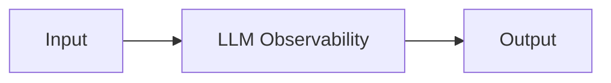

# LLM Observability — A 2-Day Crash Course

**One sentence:** LLM observability is the practice of tracing, monitoring, and debugging AI application behavior — from prompt to response, including token costs, latency, quality, and safety.

**Prerequisites:** [`LLMOps.md`](./LLMOps.md), [`OpenTelemetry.md`](../observability/OpenTelemetry.md)

---

## Part 0 — Why

You can't improve what you can't measure — and LLM apps fail silently.

A broken REST API returns a 500. A broken LLM app returns a confident, plausible-sounding wrong answer. No alarm fires. No dashboard turns red. Your users just quietly lose trust, switch to a competitor, or make a bad decision based on your output.

Traditional observability was built around metrics, logs, and traces for deterministic systems. LLMs introduce new failure modes:

- **Hallucination** — the model asserts something false with confidence
- **Context drift** — the model stops following the system prompt mid-session
- **Retrieval failure** — the RAG pipeline returns irrelevant chunks
- **Prompt injection** — user input hijacks the model's behavior
- **Cost blowout** — a single agentic loop runs 200 tool calls instead of 5
- **Latency degradation** — time-to-first-token doubles after a model upgrade

None of these are detectable with HTTP status codes or CPU graphs alone. You need observability that understands the structure of LLM interactions — prompts, completions, token counts, retrieval steps, and evaluation scores.

That's what LLM observability gives you.

---

## Vocabulary

**Trace (LLM)** — A complete record of one end-to-end request through your AI system: the user input, all intermediate steps (retrieval, tool calls, reranking), and the final output. Similar to a distributed trace, but the spans carry semantic meaning around prompts and completions.

**Span** — One unit of work within a trace. In LLM observability, a span might represent a single model call, a vector search, a tool invocation, or a reranking step. Spans nest to show the full call tree.

**LangSmith** — Observability and evaluation platform from LangChain. Tight integration with LangChain and LangGraph apps. Gives you trace viewing, dataset management, and human annotation workflows. Commercial, with a free tier.

**Langfuse** — Open-source LLM observability platform (Apache 2.0). Self-hostable or cloud. Supports tracing, prompt versioning, evaluation scoring, and cost tracking. Works with any LLM framework through its SDKs or OpenTelemetry.

**Phoenix / Arize** — Arize's open-source observability tool focused on LLM and ML model evaluation. Strong on embedding visualization, retrieval quality analysis, and offline evaluation. Can ingest OTel traces.

**Token Usage** — The count of input tokens (prompt) and output tokens (completion) consumed by a model call. Token usage drives cost and is a proxy for latency. You track it per span and roll it up per trace.

**Cost Tracking** — Calculating the dollar cost of model calls from token counts and per-model pricing. `cost = (input_tokens * input_price_per_1k) + (output_tokens * output_price_per_1k)`. Track by user, feature, environment, and time.

**Evaluation Score** — A numeric signal on trace quality. Can be automated (LLM-as-judge, rule-based checks) or human (thumbs up/down, 1–5 ratings). Stored as metadata on a trace or span so you can filter and aggregate.

**Feedback** — Explicit signal from users or annotators attached to a trace. Differs from automated eval scores in that it captures human judgment — useful for dataset curation and catching failure modes your evals miss.

**OTel GenAI Semantic Conventions (`gen_ai.*`)** — The OpenTelemetry working group's standardized attribute names for LLM spans. Covers the model system (`gen_ai.system`), the model name (`gen_ai.request.model`), token counts (`gen_ai.usage.input_tokens`, `gen_ai.usage.output_tokens`), finish reason, and more. Using these conventions makes your traces portable across tools.

---




## Day 1 — Tracing LLM Calls

### Goal

By end of Day 1, you can instrument an LLM app, view traces in a UI, and see token costs and latency per call.

---

### 1.1 Pick a Tool

Start with **Langfuse** if you want self-hosted and framework-agnostic.
Start with **LangSmith** if your app is already on LangChain/LangGraph.

Both give you the same core primitives. The concepts transfer.

---

### 1.2 Langfuse Setup (Python)

```bash
pip install langfuse openai
```

Set environment variables:

```bash
export LANGFUSE_PUBLIC_KEY=pk-lf-...
export LANGFUSE_SECRET_KEY=sk-lf-...
export LANGFUSE_HOST=https://cloud.langfuse.com  # or your self-hosted URL
```

Wrap your OpenAI calls with the Langfuse decorator:

```python
from langfuse.decorators import observe, langfuse_context
from openai import OpenAI

client = OpenAI()

@observe()
def answer_question(question: str) -> str:
    response = client.chat.completions.create(
        model="gpt-4o",
        messages=[
            {"role": "system", "content": "You are a helpful assistant."},
            {"role": "user", "content": question},
        ],
    )
    return response.choices[0].message.content

answer_question("What is the capital of France?")
```

The `@observe()` decorator automatically creates a trace and span, captures the model, messages, token counts, and latency, then flushes to Langfuse.

---

### 1.3 LangSmith Setup

```bash
pip install langsmith langchain-openai
export LANGCHAIN_TRACING_V2=true
export LANGCHAIN_API_KEY=ls__...
export LANGCHAIN_PROJECT=my-project
```

If you're using LangChain, tracing activates automatically once those env vars are set. Every chain run, LLM call, and tool invocation is captured without code changes.

---

### 1.4 Viewing Traces

Open the Langfuse or LangSmith UI. Find the trace for your call. You'll see:

- The full input (system prompt + user message)
- The full output (completion)
- Token counts: input, output, total
- Latency: time-to-first-token and total duration
- Model name and version
- A cost estimate (Langfuse computes this from a price table)

Click into nested spans if your app calls multiple models or tools. The timeline view shows where time is actually spent — is retrieval slow? Is the model itself slow? Are you making redundant calls?

---

### 1.5 Token and Cost Tracking

Token costs compound quickly in agentic apps. A 10-turn agent loop with tool calls can cost 50x more than a single-turn call. You won't know until you measure.

Langfuse aggregates cost by:
- Project (total spend)
- Trace (cost of one user request)
- Model (breakdown by gpt-4o vs claude-3-5-sonnet vs gemini-2.0-flash)
- User (cost per user if you pass a `user_id`)

Pass user context when creating a trace:

```python
@observe()
def answer_question(question: str, user_id: str) -> str:
    langfuse_context.update_current_trace(user_id=user_id)
    # ... rest of function
```

Set up cost alerts: if daily spend exceeds a threshold, fire a Slack notification or PagerDuty alert. Langfuse supports this natively via webhooks.

---

### 1.6 Latency Monitoring

Track these latency metrics per model call:

- **Time-to-first-token (TTFT)** — how long before streaming starts. This is what users feel.
- **Time-to-last-token (TTLT)** — total generation time.
- **End-to-end trace latency** — total time from user request to response, including retrieval and tool calls.

In Langfuse, the spans timeline gives you a waterfall view. You'll immediately see if your vector search is taking 2 seconds while model inference takes 800ms — the obvious optimization target shifts.

---

### 1.7 Basic Evaluation Scoring

An evaluation score is a number attached to a trace. The simplest version is automated:

```python
from langfuse import Langfuse

langfuse = Langfuse()

# After getting your trace_id from the @observe decorator
langfuse.score(
    trace_id=trace_id,
    name="answer_relevance",
    value=0.87,  # 0.0 to 1.0
    comment="LLM-as-judge evaluation",
)
```

Day 1 evaluation options:

- **Rule-based** — does the output contain a required phrase? Is it under 500 characters? Did it refuse when it should have?
- **LLM-as-judge** — ask a second model to rate the output. Use a structured prompt with criteria. Noisy but fast.
- **User thumbs up/down** — wire your UI's feedback button to a Langfuse score API call.

Don't try to build a perfect eval framework on Day 1. Pick one signal, get it flowing, and iterate.

---

## Day 2 — Production-Grade Observability

### Goal

By end of Day 2, you have OTel-native instrumentation, production dashboards, quality regression alerts, feedback loops, run comparisons, and a cost budget.

---

### 2.1 OTel GenAI Semantic Conventions

The OpenTelemetry GenAI working group defines standard span attributes for LLM calls. Using them means your traces are readable by any OTel-compatible backend — Grafana Tempo, Jaeger, Honeycomb, Datadog, and others.

Key attributes:

| Attribute | Description | Example |
|---|---|---|
| `gen_ai.system` | The AI provider | `openai`, `anthropic`, `google_vertex_ai` |
| `gen_ai.request.model` | Model requested | `gpt-4o`, `claude-3-5-sonnet-20241022` |
| `gen_ai.response.model` | Model that actually responded | May differ from requested |
| `gen_ai.usage.input_tokens` | Prompt token count | `342` |
| `gen_ai.usage.output_tokens` | Completion token count | `128` |
| `gen_ai.request.max_tokens` | Max tokens requested | `1024` |
| `gen_ai.request.temperature` | Temperature setting | `0.7` |
| `gen_ai.response.finish_reasons` | Why generation stopped | `["stop"]`, `["length"]` |

Use the `opentelemetry-instrumentation-openai` package to get these automatically:

```bash
pip install opentelemetry-instrumentation-openai
```

```python
from opentelemetry.instrumentation.openai import OpenAIInstrumentor

OpenAIInstrumentor().instrument()
```

From this point, every OpenAI call emits an OTel span with `gen_ai.*` attributes. Export to any OTel-compatible backend.

---

### 2.2 Custom Spans for RAG Pipelines

A RAG pipeline has multiple steps that each deserve their own span: query rewriting, embedding, vector search, reranking, and generation. Without custom spans, you see one big black box.

```python
from opentelemetry import trace
from langfuse.decorators import observe

tracer = trace.get_tracer(__name__)

@observe(name="rag_pipeline")
def rag_answer(query: str) -> str:

    with tracer.start_as_current_span("rewrite_query") as span:
        rewritten = rewrite_query(query)
        span.set_attribute("original_query", query)
        span.set_attribute("rewritten_query", rewritten)

    with tracer.start_as_current_span("vector_search") as span:
        chunks = search_index(rewritten, top_k=5)
        span.set_attribute("num_chunks_retrieved", len(chunks))
        span.set_attribute("retrieval_scores", str([c.score for c in chunks]))

    with tracer.start_as_current_span("generate") as span:
        answer = generate_with_context(rewritten, chunks)
        span.set_attribute("gen_ai.system", "openai")
        span.set_attribute("gen_ai.request.model", "gpt-4o")

    return answer
```

Now in your trace UI you see: did retrieval return high-scoring chunks? Did the rewrite help or hurt? Is generation the bottleneck?

---

### 2.3 Production Dashboards in Grafana

Export OTel spans to Grafana Tempo (for trace storage) and derive Prometheus metrics for dashboards.

Metrics to track in Grafana:

- `llm_request_duration_seconds` — latency histogram, broken down by model
- `llm_token_usage_total` — counter for input/output tokens, by model and feature
- `llm_cost_usd_total` — accumulated cost counter
- `llm_evaluation_score` — gauge per eval name (answer_relevance, groundedness, etc.)
- `llm_error_rate` — ratio of failed or refused generations

Key Grafana panels:

1. **Cost over time** — daily/hourly spend by model and team
2. **P50/P95/P99 latency** — broken down by pipeline stage
3. **Eval score trends** — are quality scores drifting down after a prompt change?
4. **Token usage heatmap** — which requests are consuming disproportionate tokens?
5. **Error rate** — refusals, timeouts, and API errors

---

### 2.4 Alerting on Quality Regression

Eval scores are metrics. Alert on them the same way you alert on error rates.

Define a quality SLO: "answer_relevance score must stay above 0.75, measured as a 1-hour rolling average."

In Grafana, create an alert rule:

```
avg_over_time(llm_evaluation_score{eval_name="answer_relevance"}[1h]) < 0.75
```

Fire this to your incident channel. When it triggers, you pull recent traces, filter by low score, and look for the pattern — a prompt regression, a retrieval failure, a model degradation.

⚠️ Quality alerts have high false-positive rates early on. Start with a conservative threshold and tighten it as you calibrate your eval. An alert that fires daily is noise; one that fires when something actually broke is signal.

---

### 2.5 Feedback Loops

Closing the loop between production behavior and improvement requires structured feedback collection.

**Implicit feedback** — attach a session ID to each trace. When a user rephrases and asks the same question again, that's an implicit negative signal. When they click a "copy" button on the answer, that's implicit positive.

**Explicit feedback** — thumbs up/down buttons in your UI. Wire them to:

```python
langfuse.score(
    trace_id=trace_id,
    name="user_feedback",
    value=1.0,  # 1 = thumbs up, 0 = thumbs down
    data_type="BOOLEAN",
)
```

**Annotation queues** — in Langfuse, flag low-scoring traces for human review. Annotators see the trace, add a corrected answer, and that pair goes into your fine-tuning or few-shot dataset.

The feedback loop closes when annotations improve your prompts or retrieval, which improves eval scores, which reduces the alert fire rate.

---

### 2.6 Comparing Runs

When you change a prompt, swap a model, or update your retrieval logic, you need to know whether the change helped.

Langfuse datasets let you do this:

1. Capture a set of production traces with diverse inputs as a dataset.
2. Run your new configuration against the same inputs.
3. Compare eval scores across the two runs side by side.

```python
from langfuse import Langfuse

langfuse = Langfuse()

dataset = langfuse.get_dataset("my-eval-set")

for item in dataset.items:
    with item.observe(run_name="gpt-4o-new-prompt") as trace_id:
        output = my_pipeline(item.input)
        langfuse.score(trace_id=trace_id, name="answer_relevance", value=evaluate(output))
```

Now in the Langfuse UI you compare "gpt-4o-old-prompt" vs "gpt-4o-new-prompt" on the same dataset. If the new prompt scores higher with acceptable cost increase, ship it.

This is the closest thing LLMOps has to A/B testing with ground truth.

---

### 2.7 Cost Budgeting

Set hard and soft limits before cost runs away.

**Per-user limits** — cap how many tokens a free-tier user can consume per day. Track usage in Redis or your database, check before each call.

**Per-feature budgets** — if your "document summarization" feature has a $500/month budget, track it as a separate Langfuse project. Alert at 80%, cut off at 100%.

**Model routing for cost control** — route simple queries to a cheaper model. Use `gen_ai.request.model` in your traces to see which model is handling what. If gpt-4o is answering "what's today's date," that's a routing failure.

```python
def route_model(query: str) -> str:
    if is_simple_query(query):
        return "gpt-4o-mini"
    return "gpt-4o"
```

Track cost savings from routing in your dashboard. This pays for itself quickly.

---

### 2.8 LangSmith vs Langfuse vs Phoenix

| | LangSmith | Langfuse | Phoenix (Arize) |
|---|---|---|---|
| **License** | Commercial (free tier) | Open-source (Apache 2.0) | Open-source (Apache 2.0) |
| **Self-host** | No | Yes | Yes |
| **LangChain integration** | Native, automatic | SDK + OTel | OTel |
| **Prompt management** | Yes | Yes | Limited |
| **Dataset / eval workflow** | Strong | Strong | Strong |
| **Embedding visualization** | No | No | Yes |
| **OTel native** | Partial | Yes | Yes |
| **Best for** | LangChain teams | Framework-agnostic teams | Retrieval quality analysis |

If you're already deep in the LangChain ecosystem, LangSmith is the path of least resistance. If you want vendor independence or self-hosting, Langfuse is the default choice. If your primary concern is retrieval quality — inspecting embedding spaces, chunk relevance scores, and hallucination at the retrieval level — Phoenix adds unique value.

None of them are mutually exclusive. You can trace to Langfuse and export OTel spans to Grafana simultaneously.

---

## Worked Example — Instrumenting a RAG Pipeline with Langfuse + OTel

This is a minimal but production-relevant pattern: a RAG pipeline instrumented at every stage, with OTel-native spans and Langfuse for trace storage and eval scoring.

```python
import os
from openai import OpenAI
from langfuse.decorators import observe, langfuse_context
from langfuse import Langfuse
from opentelemetry import trace
from opentelemetry.sdk.trace import TracerProvider
from opentelemetry.sdk.trace.export import BatchSpanProcessor
from opentelemetry.exporter.otlp.proto.http.trace_exporter import OTLPSpanExporter

# --- OTel setup ---
provider = TracerProvider()
provider.add_span_processor(
    BatchSpanProcessor(OTLPSpanExporter(endpoint="http://localhost:4318/v1/traces"))
)
trace.set_tracer_provider(provider)
tracer = trace.get_tracer(__name__)

# --- Clients ---
client = OpenAI()
langfuse = Langfuse()

# --- Stub functions for illustration ---
def embed(text: str) -> list[float]:
    return [0.1, 0.2]  # call your embedding model here

def search_vector_store(embedding: list[float], top_k: int = 5) -> list[dict]:
    return [{"text": "Paris is the capital of France.", "score": 0.95}]

def score_relevance(query: str, answer: str) -> float:
    return 0.9  # LLM-as-judge or rule-based eval

# --- Main pipeline ---
@observe(name="rag_pipeline")
def rag_pipeline(user_query: str, user_id: str) -> str:
    langfuse_context.update_current_trace(
        user_id=user_id,
        tags=["rag", "production"],
    )

    # Step 1: embed the query
    with tracer.start_as_current_span("embed_query") as span:
        span.set_attribute("gen_ai.system", "openai")
        span.set_attribute("gen_ai.request.model", "text-embedding-3-small")
        query_embedding = embed(user_query)
        span.set_attribute("embedding_dim", len(query_embedding))

    # Step 2: retrieve chunks
    with tracer.start_as_current_span("vector_search") as span:
        chunks = search_vector_store(query_embedding, top_k=5)
        span.set_attribute("num_chunks", len(chunks))
        span.set_attribute("top_score", chunks[0]["score"] if chunks else 0.0)

    # Step 3: generate with context
    context = "\n".join(c["text"] for c in chunks)
    with tracer.start_as_current_span("generate") as span:
        span.set_attribute("gen_ai.system", "openai")
        span.set_attribute("gen_ai.request.model", "gpt-4o")

        response = client.chat.completions.create(
            model="gpt-4o",
            messages=[
                {
                    "role": "system",
                    "content": f"Answer using only the context provided.\n\nContext:\n{context}",
                },
                {"role": "user", "content": user_query},
            ],
        )
        answer = response.choices[0].message.content
        span.set_attribute("gen_ai.usage.input_tokens", response.usage.prompt_tokens)
        span.set_attribute("gen_ai.usage.output_tokens", response.usage.completion_tokens)

    # Step 4: score and attach eval
    relevance_score = score_relevance(user_query, answer)
    langfuse_context.score_current_trace(
        name="answer_relevance",
        value=relevance_score,
    )

    return answer


if __name__ == "__main__":
    result = rag_pipeline("What is the capital of France?", user_id="user-123")
    print(result)
    langfuse.flush()
```

What this gives you:

- A Langfuse trace with nested spans for embedding, retrieval, and generation
- OTel spans exported to your collector (and from there to Tempo/Jaeger/Grafana)
- `gen_ai.*` attributes on the generation span
- An automated `answer_relevance` eval score on the trace
- User attribution for cost tracking

---

## Pitfalls

**Tracing everything but reading nothing.** You instrument, traces flow in, and no one checks the dashboard. Observability is only useful if it informs decisions. Schedule a weekly trace review until the habit forms.

**Storing raw PII in traces.** User messages often contain personal information. Before you ship to a hosted platform, scrub PII from trace inputs, or use a self-hosted deployment with appropriate access controls. This is not optional if you're in a regulated industry.

**Eval scores you don't trust.** An LLM-as-judge eval using a weak prompt gives you a number that looks like signal but is noise. Before you alert on an eval score, manually validate it on 50 traces. Does high score actually mean good? Does low score actually mean bad? Calibrate before you automate.

**Ignoring token count variance.** Your P99 token usage is far more important than P50 for cost and latency. A prompt that occasionally triggers a 10,000-token response will blow your budget in edge cases you never tested. Track the distribution, not just the average.

**Treating latency as a model problem.** In most RAG apps, the bottleneck is retrieval, reranking, or serial tool calls — not the model itself. Before you switch to a faster model, check the span waterfall. You might just need to parallelize two retrieval calls.

**Cost attribution gaps.** If you don't tag traces by feature, user, or team, your cost dashboard is one big pile. You can't tell what's driving spend. Add metadata before you need it — retrofitting tagging is painful.

**Prompt version drift.** You changed the system prompt three weeks ago and scores dipped, but you can't correlate because you didn't version your prompts. Store prompt versions in Langfuse Prompt Management or as metadata on every trace from day one.

---

## Quick Reference

```bash
# Langfuse Python SDK
pip install langfuse

# LangSmith
pip install langsmith
export LANGCHAIN_TRACING_V2=true
export LANGCHAIN_API_KEY=...

# OTel GenAI instrumentation (OpenAI)
pip install opentelemetry-instrumentation-openai

# OTel OTLP exporter
pip install opentelemetry-exporter-otlp-proto-http
```

**Essential `gen_ai.*` attributes:**

```
gen_ai.system                    # "openai" | "anthropic" | "google_vertex_ai"
gen_ai.request.model             # "gpt-4o"
gen_ai.response.model            # actual model used
gen_ai.usage.input_tokens        # prompt token count
gen_ai.usage.output_tokens       # completion token count
gen_ai.request.temperature       # temperature setting
gen_ai.response.finish_reasons   # ["stop"] | ["length"] | ["content_filter"]
```

**Langfuse key operations:**

```python
from langfuse.decorators import observe, langfuse_context

@observe()                                    # auto-trace a function
langfuse_context.update_current_trace(...)    # add metadata mid-function
langfuse_context.score_current_trace(...)     # attach eval score inline
langfuse.flush()                              # force flush in scripts
```

**Cost formula:**

```
cost = (input_tokens / 1000 * input_price) + (output_tokens / 1000 * output_price)
```

**Eval threshold alert (Grafana / PromQL):**

```promql
avg_over_time(llm_evaluation_score{eval_name="answer_relevance"}[1h]) < 0.75
```

---


## Top 10 Interview Questions

<details>
<summary><strong>Q: What is LLM Observability and what problem does it solve?</strong></summary>

LLM Observability addresses a specific need in modern engineering workflows. Understanding the core problem it solves — and the alternatives it replaced — is the foundation for every subsequent interview question. Frame your answer around the pain point first, then the solution.

</details>

<details>
<summary><strong>Q: How does LLM Observability compare to its main alternatives?</strong></summary>

Every tool exists in an ecosystem of alternatives. Be prepared to articulate the specific tradeoffs: when LLM Observability is the right choice, when an alternative is better, and what factors drive the decision (scale, team expertise, existing infrastructure, compliance requirements).

</details>

<details>
<summary><strong>Q: What are the most common production pitfalls with LLM Observability?</strong></summary>

Production experience is what separates senior from junior engineers. Common pitfalls include: misconfiguration that works in dev but fails at scale, security oversights, inadequate monitoring, and operational procedures that are untested until an incident occurs. Cite specific examples from your experience.

</details>

<details>
<summary><strong>Q: How do you monitor and observe LLM Observability in production?</strong></summary>

Key metrics to track, alerting thresholds to set, dashboards to build, and log patterns to watch. Production monitoring should cover: health/liveness, performance (latency, throughput), capacity (resource utilisation), and business impact (error rates affecting users). Explain which metrics are leading indicators versus lagging.

</details>

<details>
<summary><strong>Q: How do you scale LLM Observability as load increases?</strong></summary>

Scaling strategies depend on the bottleneck: horizontal scaling (add more instances), vertical scaling (bigger instances), caching (reduce load), sharding (distribute data), and async processing (decouple components). Explain which approach applies to LLM Observability and at what scale each strategy becomes necessary.

</details>

<details>
<summary><strong>Q: How do you handle security and access control with LLM Observability?</strong></summary>

Security is non-negotiable in production. Cover: authentication and authorization mechanisms, secrets management (never in code), encryption (at rest and in transit), network security (firewalls, private networks), audit logging, and compliance requirements relevant to your industry.

</details>

<details>
<summary><strong>Q: How do you implement disaster recovery for LLM Observability?</strong></summary>

DR planning requires defining RTO (recovery time objective) and RPO (recovery point objective), implementing backup strategies, testing restore procedures, and documenting runbooks. Explain your backup strategy, how you test restores, and what your recovery procedure looks like.

</details>

<details>
<summary><strong>Q: How do you automate LLM Observability deployment and configuration management?</strong></summary>

Infrastructure as code, CI/CD pipelines, configuration management, and GitOps workflows. Explain how you version, test, deploy, and roll back changes. Cover: what is automated, what requires manual approval, and how you handle configuration drift.

</details>

<details>
<summary><strong>Q: How do you troubleshoot issues with LLM Observability in production?</strong></summary>

A systematic debugging approach: check health endpoints, review recent changes (deploys, config changes), examine logs and metrics, reproduce the issue, identify root cause, fix, verify, and write a postmortem. Explain your actual debugging workflow with concrete examples.

</details>

<details>
<summary><strong>Q: What are the best practices for LLM Observability that you have learned from experience?</strong></summary>

Best practices that go beyond documentation: lessons learned from production incidents, configuration patterns that prevent common issues, testing strategies that catch bugs before production, and operational procedures that reduce toil. Share specific examples where following (or not following) a best practice had measurable impact.

</details>

---

## Next Steps

- [`LLMOps.md`](./LLMOps.md) — deployment, model versioning, and the full MLOps lifecycle for LLMs
- [`OpenTelemetry.md`](../observability/OpenTelemetry.md) — the underlying observability standard powering the GenAI conventions
- [`Prometheus.md`](../observability/Prometheus.md) — metrics storage and alerting for cost and quality dashboards
- [`Grafana.md`](../observability/Grafana.md) — dashboard patterns for LLM observability panels

---

## Recommended learning resources

**YouTube channels & playlists:**
- [DeepLearning.AI — LLM Evaluation & Monitoring](https://www.youtube.com/@Deeplearningai) — short courses on building evaluation pipelines and monitoring LLM quality in production
- [AI Engineer — Observability Talks](https://www.youtube.com/@aiaboratories) — conference talks on tracing LLM calls, cost dashboards, and quality scoring at scale
- [Sam Witteveen — LLM Monitoring](https://www.youtube.com/@samwitteveen) — practical guides on LangSmith tracing, evaluation metrics, and drift detection
- [Yannic Kilcher — Evaluation Papers](https://www.youtube.com/@YannicKilcher) — research on LLM evaluation benchmarks, automated scoring, and quality measurement

**Official docs & blogs:**
- [OpenTelemetry GenAI Semantic Conventions](https://opentelemetry.io/docs/specs/semconv/gen-ai/) — the standard for instrumenting LLM calls with traces, metrics, and token-level spans
- [LangSmith Documentation](https://docs.smith.langchain.com/) — tracing, evaluation datasets, online scoring, and production monitoring for LLM applications
- [Anthropic Documentation — Usage & Monitoring](https://docs.anthropic.com) — rate limits, token counting, streaming, and API observability patterns

---

## The Mantra

You ship a model. It answers confidently. Users are happy — until they're not. The difference between finding out in a Slack message from a frustrated user and finding out in your dashboard before it reaches most users is instrumentation. Trace every call. Score every response. Watch the scores over time. When they drift, investigate before users complain. LLM observability is not a nice-to-have — it's how you run an AI product with any degree of confidence.
