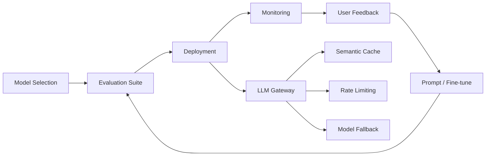

# LLMOps — A 2-Day Crash Course

> **In one sentence:** LLMOps is the discipline of deploying, monitoring, evaluating, and iterating on LLM-powered applications in production — it's DevOps for AI, where the "code" includes prompts, models, and retrieval pipelines. Prerequisite: see `LLM-Fundamentals.md`.

---

## Part 0 — Why LLMOps exists

Traditional software has deterministic outputs. You push a bug fix and the behavior changes in exactly the way you intended. LLM applications don't work that way.

The problems you'll run into in production:

- **Prompt drift** — a system prompt that worked in March starts degrading in July, not because you changed it, but because the underlying model was silently updated.
- **Non-determinism** — the same input produces different outputs across calls. You can't unit-test your way to confidence; you need statistical evaluation over distributions.
- **Subjective quality** — "Is this response good?" can't be reduced to a Boolean. You need rubrics, judges, and human feedback loops.
- **Cost at scale** — a feature that costs $0.002 per call feels free at 100 calls/day and ruins your margins at 1,000,000 calls/day.
- **Regulatory and safety exposure** — outputs that pass QA in staging can generate PII leaks, hallucinations, or toxic content in production edge cases.
- **Dependency on third parties** — OpenAI, Anthropic, and Google can deprecate models, change rate limits, or have outages. You need fallback paths.

None of these problems exist in pure software engineering. All of them require new tooling, new processes, and new mental models.

**Mental model:** LLMOps is the CI/CD pipeline for AI — version your prompts like code, evaluate outputs like tests, monitor costs like infrastructure, and iterate like sprints.

---




## Part 1 — The vocabulary

| Term | What it means |
|---|---|
| **Prompt Versioning** | Treating prompt templates as first-class artifacts — stored in version control, tagged, and deployed through a release process rather than edited inline. |
| **Evaluation (Eval)** | The process of measuring LLM output quality, either automatically (metric-based, LLM-as-judge) or manually (human review). |
| **Golden Dataset** | A curated set of input/expected-output pairs that serves as your regression test suite for prompts and models. |
| **LLM-as-Judge** | Using a second LLM (often a more capable model) to score or critique the output of your application LLM against a rubric. |
| **Trace** | The full end-to-end record of a single request — spans, inputs, outputs, latency, tokens, and metadata — used for debugging and auditing. |
| **Span** | A single unit of work within a trace. For LLM calls: the model invocation, including prompt, response, token counts, and duration. For RAG: the retrieval step. |
| **Guardrail** | A validation layer that intercepts LLM inputs or outputs to enforce rules — block PII, reject off-topic queries, filter toxic content, enforce output schema. |
| **A/B Test** | Running two prompt variants (or models) against live traffic and comparing quality/cost metrics to determine which to promote. |
| **Token Budget** | An explicit constraint on how many tokens a request or conversation is allowed to consume — enforced programmatically to control cost and latency. |
| **Model Registry** | A catalog of models (with versions, capabilities, cost per token, and approval status) used to route requests and manage model lifecycle. |
| **Drift** | Gradual, often invisible degradation in output quality — caused by model updates, data distribution shift, or prompt staleness — detected through continuous evaluation. |

---

## DAY 1 — The LLMOps lifecycle

### 1. Prompt versioning and management

Prompts are source code. Treat them that way.

Store prompts in a dedicated directory in your repo — `prompts/` or `src/prompts/`. Each prompt is a template file, not a string buried in application code. Use a naming convention: `{feature}-{version}.txt` or use a prompt management platform.

A minimal prompt manifest in YAML:

```yaml
# prompts/summarize-v2.yaml
id: summarize
version: "2.1.0"
model: gpt-4o
temperature: 0.3
max_tokens: 512
system: |
  You are a concise technical summarizer. Return a summary in 3 bullet points.
user_template: |
  Summarize the following document:
  {{ document }}
```

Tag releases. When you deploy prompt `summarize-v2.1.0` to production, create a git tag. This makes rollback trivial: `git checkout prompts/summarize-v2.0.0.yaml`.

Platforms like **LangSmith**, **Langfuse**, and **PromptLayer** give you a UI for this — but git-native versioning is the minimum viable baseline.

### 2. Basic evaluation — golden datasets and automated scoring

Your golden dataset is the cornerstone of prompt regression testing. Build it before you need it.

Seed it with:
- Representative happy-path examples
- Known edge cases (short inputs, empty inputs, multilingual)
- Examples that previously caused failures

For each example, store: `input`, `expected_output` (or rubric), `tags`, `source`.

Automated scoring approaches, in increasing sophistication:

**Exact match** — only works for classification/extraction tasks where outputs are enumerable.

**Semantic similarity** — embed both expected and actual output, compute cosine similarity. Useful for summarization. Fragile for complex reasoning.

**Regex/schema validation** — verify structured outputs (JSON, code, dates) match expected format. Fast, reliable, limited.

**LLM-as-judge** — send both the output and a scoring rubric to a judge model. Returns a score (1–5) and a rationale. Most flexible, adds latency and cost.

Run your eval suite on every prompt change, just like you run unit tests on every code change.

### 3. Tracing and observability

You cannot debug what you cannot see. Tracing gives you the full picture of every LLM call.

The three primary tools:

**LangSmith** — native to the LangChain ecosystem. Auto-instruments chains, agents, and tools. Strong UI for trace inspection and dataset management.

**Langfuse** — open source, self-hostable, framework-agnostic. Instruments via SDK or OpenTelemetry. Good for teams that want control over data residency.

**Phoenix (Arize)** — open source, focused on eval and observability. Integrates with LlamaIndex and LangChain. Strong for RAG-specific tracing.

Minimal tracing with Langfuse:

```python
from langfuse import Langfuse
from langfuse.decorators import observe

langfuse = Langfuse()

@observe()
def summarize(document: str) -> str:
    response = client.chat.completions.create(
        model="gpt-4o",
        messages=[
            {"role": "system", "content": SYSTEM_PROMPT},
            {"role": "user", "content": document},
        ],
    )
    return response.choices[0].message.content
```

Every call to `summarize()` now emits a trace: inputs, outputs, latency, token counts, model, and cost estimate. You can search, filter, and replay any trace from the Langfuse UI.

For OpenTelemetry-native setups (see `OpenTelemetry.md`), use the `opentelemetry-instrumentation-openai` package. It emits `gen_ai.*` spans per the OTel GenAI semantic conventions — covered in Day 2.

### 4. Cost tracking

Token cost compounds fast. Model a naive system: 500 input tokens + 300 output tokens per call, GPT-4o at $5/1M input + $15/1M output = $0.0025 per call. At 10,000 calls/day, that's $750/month for one feature.

Track at three levels:

**Per-call** — log `prompt_tokens`, `completion_tokens`, `total_tokens`, and the model name. Compute cost in your tracing layer.

**Per-feature** — aggregate daily token spend by `feature_name` tag. Identify which features are consuming budget disproportionately.

**Per-user or per-tenant** — for SaaS products, track token spend per customer. Essential for billing, abuse detection, and capacity planning.

Enforce token budgets programmatically:

```python
MAX_INPUT_TOKENS = 4096

def build_prompt(context: str, query: str) -> str:
    # Trim context if it would exceed budget
    encoded = tokenizer.encode(context)
    if len(encoded) > MAX_INPUT_TOKENS - 512:  # reserve 512 for query + system
        context = tokenizer.decode(encoded[:MAX_INPUT_TOKENS - 512])
    return f"{context}\n\nQuestion: {query}"
```

Set budget alerts in your cloud provider or observability platform. A spike in token spend is often the first signal of a prompt injection attack, a runaway agent loop, or a retrieval pipeline regression.

**By end of Day 1 you can:**
- Store and version prompts as code artifacts
- Build a golden dataset and run automated eval on prompt changes
- Instrument LLM calls with traces using Langfuse or LangSmith
- Track token cost per call, per feature, and per user

---

## DAY 2 — Make it real

### 1. Evaluation frameworks — LLM-as-judge, human-in-the-loop, regression testing

LLM-as-judge is the most scalable path to quality assessment at production volume.

A judge prompt has three components: the rubric (what makes a good response), the candidate output, and optionally a reference answer. Return a structured score.

```python
JUDGE_PROMPT = """
You are an expert evaluator. Score the following response on a 1–5 scale.

Rubric:
- 5: Accurate, complete, well-structured, no hallucination
- 3: Mostly correct, minor omissions or awkward phrasing
- 1: Inaccurate, incomplete, or harmful

Question: {question}
Response: {response}
Reference: {reference}

Return JSON: {{"score": <int>, "rationale": "<string>"}}
"""
```

⚠️ Judge models are biased toward verbosity and toward responses that sound confident. Calibrate your judge by comparing its scores against human labels on a sample. If correlation is below 0.7, your judge rubric needs work.

**Human-in-the-loop** — for high-stakes outputs (legal, medical, financial), route a sample of production responses to a review queue. Use a simple thumbs-up/thumbs-down plus a free-text notes field. Feed these annotations back into your golden dataset.

**Regression testing** — run your full golden dataset before every prompt deployment. A deployment that improves average score but regresses on a known edge case is not a safe deployment.

### 2. A/B testing prompts in production

The goal: compare two prompt variants on live traffic without degrading user experience.

Traffic splitting pattern:

```python
import hashlib

def get_prompt_variant(user_id: str) -> str:
    # Deterministic split: same user always gets same variant
    digest = int(hashlib.md5(user_id.encode()).hexdigest(), 16)
    return "variant_b" if digest % 100 < 10 else "control"  # 10% to variant B
```

Log `variant` as a tag on every trace. After a statistically significant sample (typically 1,000+ responses per variant for high-variance outputs), compare:
- LLM-as-judge score distribution
- User feedback signals (if available)
- Token cost per response
- Latency (p50, p95)

Don't ship a variant that's cheaper but lower quality. Don't ship one that's higher quality but 2x the cost without a business case.

### 3. Guardrails — input/output validation, PII detection, toxicity

Guardrails are defensive layers. They run before the LLM call (input guardrails) and after (output guardrails).

**Input guardrails:**
- Token budget enforcement (truncate or reject oversized inputs)
- Topic filtering (reject off-topic queries in scoped assistants)
- PII detection (flag or redact SSNs, emails, credit card numbers before they enter the model)
- Prompt injection detection (heuristic or model-based)

**Output guardrails:**
- Schema validation (is the JSON output parseable? does it match the expected schema?)
- Hallucination detection (does the response contradict source documents in a RAG pipeline?)
- Toxicity filtering (block harmful content before delivery)
- PII leakage detection (ensure the model hasn't surfaced PII from the retrieval context)

**NeMo Guardrails** (NVIDIA) and **Guardrails AI** are dedicated frameworks. For simpler cases, a regex-based PII scanner plus a schema validator covers most production needs.

```python
import re

PII_PATTERNS = [
    r"\b\d{3}-\d{2}-\d{4}\b",           # SSN
    r"\b4[0-9]{12}(?:[0-9]{3})?\b",     # Visa card
    r"[a-zA-Z0-9_.+-]+@[a-zA-Z0-9-]+\.[a-zA-Z0-9-.]+",  # Email
]

def scrub_pii(text: str) -> str:
    for pattern in PII_PATTERNS:
        text = re.sub(pattern, "[REDACTED]", text)
    return text
```

### 4. Model routing and fallbacks

Don't hardcode a single model. Build a routing layer that selects the right model for each request based on complexity, cost, and availability.

A simple routing strategy:

```python
def route_model(task_type: str, input_length: int) -> str:
    if task_type == "classification" and input_length < 500:
        return "gpt-4o-mini"  # fast, cheap
    if task_type == "code_generation":
        return "claude-sonnet-4-5"  # best for code
    return "gpt-4o"  # default

def call_with_fallback(prompt: str, model: str) -> str:
    try:
        return call_model(prompt, model)
    except RateLimitError:
        return call_model(prompt, FALLBACK_MODEL)
    except ModelUnavailableError:
        return call_model(prompt, FALLBACK_MODEL)
```

Maintain a model registry that tracks which models are approved for production, their cost tiers, and their capability profiles. When a provider deprecates a model version, you want one config change to update your entire fleet, not a grep-and-replace across the codebase.

### 5. Caching strategies — semantic cache

LLM calls are expensive and slow. Cache aggressively where it's safe to do so.

**Exact cache** — hash the full prompt string. On a match, return the cached response. Useful for FAQ bots, code explanation tools, and any feature where inputs repeat exactly.

**Semantic cache** — embed the query, find the nearest cached embedding within a cosine similarity threshold (e.g., 0.95). Return the cached response for semantically equivalent queries. Implemented in **GPTCache** and **Redis** with vector similarity.

```python
from gptcache import cache
from gptcache.embedding import OpenAI
from gptcache.similarity_evaluation import SearchDistanceEvaluation

cache.init(
    embedding_func=OpenAI().to_embeddings,
    similarity_evaluation=SearchDistanceEvaluation(),
)
```

Semantic cache hit rates of 30–60% are common for support bots and documentation assistants. That's real cost reduction.

⚠️ Don't cache personalized responses or outputs that depend on real-time data. Cache poisoning — where a stale cached response is served for a subtly different query — is a silent quality killer.

### 6. CI/CD for prompts — test, stage, prod

The deployment pipeline for a prompt change mirrors software deployment:

```
[feature branch] → PR with eval report → [staging] → A/B test → [production]
```

In your CI pipeline (GitHub Actions, GitLab CI — see `GitHub-Actions.md` or `GitLab-CI.md`):

```yaml
# .github/workflows/prompt-eval.yml
name: Prompt Evaluation
on:
  pull_request:
    paths:
      - "prompts/**"

jobs:
  eval:
    runs-on: ubuntu-latest
    steps:
      - uses: actions/checkout@v4
      - name: Run eval suite
        run: python scripts/run_eval.py --dataset golden_dataset.json --prompt prompts/
      - name: Compare against baseline
        run: python scripts/compare_eval.py --baseline main --candidate HEAD --threshold 0.02
      - name: Post eval report
        uses: actions/github-script@v7
        with:
          script: |
            const report = require('./eval_report.json');
            github.rest.issues.createComment({
              issue_number: context.issue.number,
              body: `## Eval Report\nScore: ${report.mean_score} (baseline: ${report.baseline_score})`
            });
```

A PR that regresses the golden dataset mean score by more than 2% fails CI. This is the same contract as "a PR that breaks a test fails CI" — just applied to prompts.

### 7. Monitoring dashboards

In production, you want four dashboards. Build them in Grafana (see `Grafana.md`) backed by metrics from Prometheus (see `Prometheus.md`) or your tracing platform's metrics export.

**Latency dashboard** — p50/p95/p99 response time per model, per feature, per day. Set SLO alerts at p95 > 5s.

**Cost dashboard** — daily token spend by model, by feature, by tenant. Week-over-week delta. Alert on >20% day-over-day spike.

**Quality dashboard** — mean LLM-as-judge score per feature, rolling 7-day window. Alert on score dropping below baseline by 5%.

**Error dashboard** — rate of guardrail triggers (input rejections, output blocks), model errors, fallback activations. A spike in prompt injection detections means investigate immediately.

Key metrics to expose as Prometheus gauges/counters:

```
llmops_request_total{model, feature, status}
llmops_tokens_total{model, feature, token_type}   # token_type: input|output
llmops_latency_seconds{model, feature}            # histogram
llmops_eval_score{feature, prompt_version}        # gauge
llmops_guardrail_triggered_total{type, action}    # type: pii|toxicity|schema
llmops_cache_hit_total{cache_type}                # exact|semantic
```

### 8. OTel semantic conventions for GenAI

The OpenTelemetry GenAI semantic conventions (`gen_ai.*` attributes) give you a standard schema for LLM spans. Use them — they make traces portable across tools and avoid reinventing attribute names. See `OpenTelemetry.md` for OTel fundamentals.

Core span attributes (OTel GenAI spec v1.27):

| Attribute | Type | Example |
|---|---|---|
| `gen_ai.system` | string | `openai`, `anthropic`, `aws.bedrock` |
| `gen_ai.request.model` | string | `gpt-4o`, `claude-sonnet-4-5` |
| `gen_ai.request.max_tokens` | int | `512` |
| `gen_ai.request.temperature` | float | `0.3` |
| `gen_ai.response.model` | string | actual model used (may differ from requested) |
| `gen_ai.response.finish_reasons` | string[] | `["stop"]`, `["length"]` |
| `gen_ai.usage.input_tokens` | int | `823` |
| `gen_ai.usage.output_tokens` | int | `247` |

Span name convention: `{gen_ai.system} {operation}` — e.g., `openai chat`. Span kind: `CLIENT`.

For RAG pipelines, wrap the retrieval step in its own span with:
- `db.system`: your vector store (`pinecone`, `weaviate`, `pgvector`)
- `db.operation.name`: `query`
- custom attribute `rag.retrieved_docs_count` for the number of chunks returned

This lets you correlate retrieval quality with answer quality in the same trace.

---

## Worked example — Production prompt deployment pipeline

Scenario: your team maintains a customer support summarization feature. The current prompt is `summarize-v1.3.0`. A product change requires the summary to include a sentiment label. You need to deploy this safely.

**Step 1 — Version the prompt in git**

Create `prompts/summarize-v1.4.0.yaml` with the updated template. Commit to a feature branch. The diff is reviewable, auditable, and reversible.

**Step 2 — Run the eval suite**

Your golden dataset has 200 examples with expected summaries. Run:

```bash
python scripts/run_eval.py \
  --prompt prompts/summarize-v1.4.0.yaml \
  --dataset datasets/summarize_golden.json \
  --judge gpt-4o \
  --output eval_reports/summarize-v1.4.0.json
```

Result: mean score 4.1 (baseline v1.3.0: 3.9). No regressions on edge cases. CI passes.

**Step 3 — Compare against baseline**

```bash
python scripts/compare_eval.py \
  --baseline eval_reports/summarize-v1.3.0.json \
  --candidate eval_reports/summarize-v1.4.0.json
```

Output: `+0.2 mean score, +3% on edge cases, +8% token cost (sentiment label adds ~15 tokens/call)`. Present this in the PR. The cost increase is justified.

**Step 4 — Deploy to staging**

Merge to `staging` branch. Your CD pipeline deploys `summarize-v1.4.0.yaml` to the staging environment. Run integration tests against staging. Verify traces in Langfuse show the new sentiment label appearing in outputs.

**Step 5 — A/B test in production**

Route 10% of production traffic to v1.4.0. Instrument both variants with `prompt_version` tag on all traces.

After 48 hours and ~5,000 calls per variant:
- v1.4.0 LLM-as-judge score: 4.1 ± 0.3
- v1.3.0 LLM-as-judge score: 3.9 ± 0.3
- Cost delta: +$12/day at current volume — acceptable

**Step 6 — Promote and monitor**

Merge to `main`. CD pipeline promotes v1.4.0 to 100% of production traffic. Monitor the quality dashboard for 24 hours. No anomalies. Checkpoint the new baseline score.

If a regression appears — cost spike, score drop, guardrail trigger surge — roll back by repointing the config to `summarize-v1.3.0.yaml`. No code change required.

---


## Terminal Demo

```terminal-demo
# llmops@platform ~ %

$ echo "Prompt Registry"
curl -s localhost:8080/api/prompts | jq ".[:3][] | {name,version,active}"
{"name":"summarize-incident","version":"v3","active":true}
{"name":"classify-ticket","version":"v5","active":true}
{"name":"generate-runbook","version":"v2","active":true}

$ echo "Model Gateway Stats"
curl -s localhost:8080/api/gateway/stats | jq
{"requests_today":45678,"avg_latency_ms":234,"cache_hit_rate":0.32,"total_tokens":12345678,"estimated_cost_usd":45.67}

$ echo "A/B Test: Prompt v4 vs v5"
curl -s localhost:8080/api/experiments/classify-ticket | jq
{"variant_a":"v4","variant_b":"v5","traffic_split":"50/50","accuracy_a":0.89,"accuracy_b":0.93,"p_value":0.023,"winner":"v5"}
```

---

## Common pitfalls

- **Editing prompts directly in production code** — no audit trail, no rollback path, no way to run evals before the change is live. Always go through version control.
- **Treating golden datasets as static** — a dataset that doesn't grow becomes stale. Add new examples from production failures every sprint.
- **LLM-as-judge without calibration** — a judge model you've never validated against human labels is giving you false confidence. Spot-check 50 judgments against human labels before relying on it.
- **Ignoring token cost until it's a crisis** — instrument cost tracking on day one. You will regret discovering a $10,000/month feature in a quarterly review.
- **Over-engineering guardrails at launch** — start with schema validation and basic PII scrubbing. Add more guardrails based on observed failure modes, not anticipated ones.
- **No fallback model** — a single model dependency means your application is down when the provider has an outage. Define a fallback before you need it.
- **Semantic cache with low similarity threshold** — a threshold of 0.85 will serve cached responses for queries that are meaningfully different. Start at 0.95 and lower carefully.
- **Skipping staging A/B test** — deploying a prompt change that looks good on golden data directly to 100% production is the LLMOps equivalent of shipping without tests. Always run a traffic split first.
- **No human review loop** — automated evals catch regressions but miss novel failure modes. Route 1–5% of production traffic to human review, even at scale.
- **Conflating latency and quality** — faster is not better if it's cheaper because you're using a weaker model. Always measure quality alongside latency and cost.

---

## Quick reference

### LLMOps tool comparison

| Tool | Type | Strengths | Self-hostable | Best for |
|---|---|---|---|---|
| **LangSmith** | Managed SaaS | Deep LangChain integration, dataset management, prompt hub | No | LangChain-heavy stacks |
| **Langfuse** | Open source / SaaS | Framework-agnostic, OTel native, strong EU data residency | Yes | Teams needing data control |
| **Phoenix (Arize)** | Open source | RAG-specific tracing, eval-focused, LlamaIndex integration | Yes | RAG pipelines, offline eval |
| **Arize AI** | Managed SaaS | Enterprise monitoring, drift detection, large-scale eval | No | Enterprise production monitoring |

### Eval checklist

Before promoting any prompt to production:

- [ ] Golden dataset run passes (no regressions on edge cases)
- [ ] Mean LLM-as-judge score meets or exceeds baseline
- [ ] Token cost delta is understood and accepted
- [ ] Schema/format validation passes on all outputs
- [ ] Guardrails tested against known adversarial inputs
- [ ] Staging deployment verified with integration tests
- [ ] A/B test plan defined (traffic split %, success criteria, duration)

### Monitoring metrics

| Metric | Type | Alert threshold |
|---|---|---|
| `llmops_latency_seconds` p95 | Histogram | > 5s |
| `llmops_tokens_total` daily delta | Counter | > 20% day-over-day |
| `llmops_eval_score` rolling 7d | Gauge | < baseline − 5% |
| `llmops_guardrail_triggered_total` | Counter | Spike > 3σ from baseline |
| `llmops_cache_hit_total` rate | Counter | Drop below expected hit rate |
| Model error rate | Counter | > 1% of requests |
| Fallback activation rate | Counter | > 5% of requests |

### OTel GenAI span attributes

```
gen_ai.system               # Provider: openai | anthropic | aws.bedrock | vertex_ai
gen_ai.request.model        # Requested model ID
gen_ai.request.temperature  # Sampling temperature
gen_ai.request.max_tokens   # Token limit
gen_ai.response.model       # Actual model used
gen_ai.response.finish_reasons  # stop | length | content_filter | tool_calls
gen_ai.usage.input_tokens   # Prompt tokens consumed
gen_ai.usage.output_tokens  # Completion tokens consumed
```

Span naming: `{gen_ai.system} {operation}` — e.g., `anthropic chat`, `openai embeddings`.
Span kind: `CLIENT` for all LLM API calls.

---


## Top 10 Interview Questions

<details>
<summary><strong>Q: What is LLMOps and how does it differ from MLOps?</strong></summary>

LLMOps adapts MLOps principles for LLM-specific workflows. Key differences: LLMs often use pre-trained models (no training pipeline — prompt engineering and fine-tuning instead), evaluation is harder (no simple accuracy metric — need LLM-as-judge, human eval), deployment involves managing inference infrastructure (GPU scheduling, KV cache, batching), and cost management is critical (per-token pricing or GPU hours). The lifecycle is: select model → design prompts → evaluate → deploy → monitor → iterate.

</details>

<details>
<summary><strong>Q: How do you build an evaluation suite for an LLM application?</strong></summary>

Create a dataset of 50-200 representative examples covering common cases, edge cases, and adversarial inputs. Define metrics per task: accuracy for classification, faithfulness + relevance for RAG, helpfulness for chat. Use automated evaluators (LLM-as-judge for subjective quality, exact match for factual tasks, code execution for coding tasks). Run the eval suite on every prompt change, model upgrade, or config change. Track scores over time to catch regressions. Include a human eval component for periodic calibration.

</details>

<details>
<summary><strong>Q: What is an LLM gateway and why do production systems need one?</strong></summary>

An LLM gateway sits between your application and LLM providers, providing: request routing (send to the best model for each task), fallback (switch providers on failure), rate limiting, caching (semantic cache for repeated queries), cost tracking (per-request cost attribution), logging and observability, and API key management. Without a gateway, each service manages its own LLM integration, creating inconsistent behaviour, no cost visibility, and no centralised control. Tools: LiteLLM, Portkey, Kong AI Gateway.

</details>

<details>
<summary><strong>Q: How do you manage prompt versions in production?</strong></summary>

Treat prompts as code: store in version control, review changes in PRs, and run the eval suite before merging. Use a prompt registry (database or config system) that maps prompt IDs to versions, allowing rollback without code deploys. A/B test prompt changes by routing a percentage of traffic to the new version and comparing metrics. Include the prompt version in every log entry so you can correlate quality changes with prompt changes. Never edit prompts directly in production.

</details>

<details>
<summary><strong>Q: How do you optimise LLM inference cost in production?</strong></summary>

Model routing (80% of queries to a cheap small model, 20% to an expensive large model), semantic caching (cache responses for semantically similar queries), prompt optimisation (shorter system prompts, fewer examples), output token limits (set max_tokens appropriately), batching (batch multiple requests for throughput), and quantisation (4-bit models for self-hosted inference). Monitor cost per request and per user. Set budget alerts. A well-optimised system can cut costs 60-80% versus naive deployment.

</details>

<details>
<summary><strong>Q: How do you handle model upgrades and deprecations in production?</strong></summary>

Maintain a model abstraction layer so your application is not tightly coupled to a specific model version. When a new version is released: run your eval suite against it, compare scores to the current version, shadow-deploy (run both in parallel, compare outputs), then gradually shift traffic. Keep the previous version as a fallback for 2-4 weeks. For deprecations, start migration early — provider deprecation timelines are firm. Pin model versions explicitly; never use 'latest' in production.

</details>

<details>
<summary><strong>Q: What observability do you need for production LLM applications?</strong></summary>

Track: latency (time to first token, total response time), token usage (input and output per request), cost (per request, per user, per feature), error rates (API failures, timeouts, rate limits), quality metrics (user feedback scores, automated eval scores), and safety metrics (guardrail block rates, flagged content). Correlate these with prompt versions and model versions. Alert on latency spikes, cost anomalies, and quality drops. Tools: LangSmith, Langfuse, Helicone, or custom Prometheus/Grafana dashboards.

</details>

<details>
<summary><strong>Q: How do you implement A/B testing for LLM features?</strong></summary>

Route traffic by user segment or percentage to different configurations (model, prompt, temperature). Measure both system metrics (latency, cost) and quality metrics (task completion rate, user satisfaction, automated eval scores). Run tests for sufficient duration to account for variability — LLM outputs are stochastic, so you need larger sample sizes than deterministic A/B tests. Use statistical tests appropriate for high-variance distributions. Consider using interleaving (show both outputs, let users choose) for faster signal.

</details>

<details>
<summary><strong>Q: What is fine-tuning versus prompt engineering and when do you choose each?</strong></summary>

Prompt engineering is faster, cheaper, and more flexible — iterate in minutes, no training data needed, works with any model. Fine-tuning requires labelled data and compute but produces more consistent outputs, can teach domain-specific behaviour, and reduces prompt length (saving input tokens). Choose prompt engineering first for 90% of use cases. Fine-tune when: you need consistent format/style that prompting cannot achieve, you have domain-specific knowledge the base model lacks, or you need to reduce latency by encoding behaviour into weights instead of long prompts.

</details>

<details>
<summary><strong>Q: How do you handle rate limits and failures from LLM providers?</strong></summary>

Implement retry with exponential backoff for transient errors (429, 500, 503). Use a circuit breaker that stops calling a failing provider after N consecutive failures. Configure fallback providers (if OpenAI is down, route to Anthropic or a self-hosted model). Use request queuing to smooth traffic spikes. Pre-calculate your rate limit budget and implement client-side throttling to avoid hitting limits. Monitor provider status pages and set up alerts for degraded service. Cache aggressively to reduce the number of API calls.

</details>

---


## Quick Quiz

Test your understanding with these rapid-fire questions (answers hidden):

<details>
<summary>1. What is the ONE core problem that LLMOps solves?</summary>
Re-read Part 0 — the mental model section. If you can explain the "why" in one sentence, you understand the foundation.
</details>

<details>
<summary>2. Name the 3 most important terms from the vocabulary section.</summary>
Review Part 1. These are the building blocks every conversation about LLMOps uses.
</details>

<details>
<summary>3. What is the first thing you would set up on Day 1?</summary>
Check the Day 1 section — the very first hands-on step that gets you a working result.
</details>

<details>
<summary>4. What is the most common production pitfall with LLMOps?</summary>
Review the Common Pitfalls section. The first item listed is typically the most frequently encountered.
</details>

<details>
<summary>5. How does LLMOps compare to its closest alternative?</summary>
Check the Comparison Matrix below — focus on the key differentiating row.
</details>


## Comparison Matrix

| Dimension | LLMOps | Traditional MLOps | Manual Deployment |
|-----------|--------|-------------------|-------------------|
| **Primary use case** | Core strength of LLMOps | Core strength of Traditional MLOps | Core strength of Manual Deployment |
| **Learning curve** | Moderate | Varies | Varies |
| **Community/ecosystem** | Active | Active | Growing |
| **Operational complexity** | Medium | Varies | Varies |
| **Best for** | See Part 0 | Different tradeoffs | Different tradeoffs |

> **How to read this matrix:** no tool wins on every dimension. Pick based on your specific constraints — team expertise, existing infrastructure, scale requirements, and compliance needs. The right choice is the one that fits your context, not the one with the most checkmarks.

## Next steps after Day 2

- `LLM-Fundamentals.md` — tokens, context windows, temperature, model families
- `Prompt-Engineering.md` — few-shot, chain-of-thought, structured output, system prompt design
- `RAG.md` — retrieval-augmented generation, chunking, embedding, re-ranking
- `LLM-Security.md` — prompt injection, jailbreaks, data exfiltration, model supply chain
- `OpenTelemetry.md` — OTel SDK, spans, traces, semantic conventions
- `Prometheus.md` — metric types, scrape config, alerting rules

---

## Recommended learning resources

**YouTube channels & playlists:**
- [DeepLearning.AI — LLMOps Short Courses](https://www.youtube.com/@Deeplearningai) — Andrew Ng's courses on evaluation pipelines, model deployment, and A/B testing for LLMs
- [AI Engineer — Production LLM Talks](https://www.youtube.com/@aiaboratories) — conference talks on LLM serving infrastructure, cost management, and operational patterns
- [Sam Witteveen — LLM Deployment](https://www.youtube.com/@samwitteveen) — practical guides on model versioning, prompt management, and production monitoring
- [Yannic Kilcher — MLOps & LLMOps](https://www.youtube.com/@YannicKilcher) — research-informed takes on evaluation, fine-tuning pipelines, and model lifecycle management

**Official docs & blogs:**
- [LangSmith Documentation](https://docs.smith.langchain.com/) — tracing, evaluation, prompt versioning, and production monitoring for LLM applications
- [Chip Huyen — LLMOps](https://huyenchip.com/blog/) — comprehensive writing on evaluation strategies, model serving, cost optimization, and the LLMOps lifecycle
- [Anthropic Cookbook](https://github.com/anthropics/anthropic-cookbook) — production patterns for Claude: batching, streaming, error handling, and evaluation

---

**The mantra:** Treat every prompt as a deployment — version it, test it, monitor it, and roll it back when it breaks.
