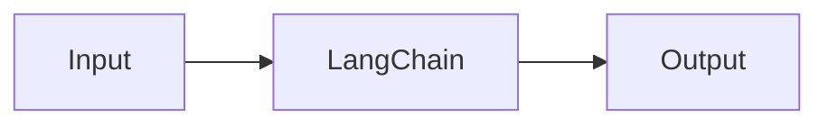

# LangChain — A 2-Day Crash Course

A framework for building LLM-powered applications — chains, agents, tools, and memory in a composable library.

**Prerequisite:** [`LLM-Fundamentals.md`](./LLM-Fundamentals.md)

---

## Part 0 — Why LangChain

Raw API calls get messy fast.

You start with a simple `openai.chat.completions.create(...)` call. Then you need to inject context into the prompt — so you write string formatting. Then you want structured output — so you parse JSON manually. Then you add a web search tool — so you write a dispatcher loop. Then you need conversation history — so you manage a list of messages. Then you want to swap GPT-4 for Claude without rewriting everything.

Three weeks in, your "simple" script is 800 lines of glue code that only you understand.

LangChain gives you abstractions for all of this:

- **Prompt templates** — parameterized, versioned, reusable
- **Output parsers** — turn raw text into typed objects
- **Chains** — composable pipelines with clear data flow
- **Agents** — LLM-driven loops that decide which tools to call
- **Retrieval** — load, split, embed, and query documents
- **Memory** — conversation state that persists across turns

The library is opinionated enough to reduce boilerplate, flexible enough to not lock you in. You can drop down to raw API calls whenever you need to.

---

## Vocabulary

Before you write a line of code, lock these terms in your head.

| Term | What it is |
|---|---|
| **Chain** | A sequence of steps where the output of one step feeds into the next |
| **Agent** | A loop where the LLM decides what action to take next, given tools |
| **Tool** | A function the agent can call — web search, calculator, database query |
| **Memory** | A component that stores and retrieves conversation history |
| **ChatModel** | A wrapper around a chat-based LLM (GPT-4, Claude, Gemini) |
| **PromptTemplate** | A string template with named variables, compiled at runtime |
| **OutputParser** | Converts raw LLM output (a string) into a structured Python object |
| **Retriever** | Fetches relevant documents from a store given a query |
| **Runnable** | The base interface everything in LCEL implements — has `.invoke()`, `.stream()`, `.batch()` |
| **LCEL** | LangChain Expression Language — compose Runnables with the `|` pipe operator |

LCEL is the glue. Every component — prompts, models, parsers, retrievers — implements `Runnable`, so you can pipe them together cleanly. If you understand `|`, you understand 80% of LangChain.

---




## Day 1 — Core Building Blocks

### Install

```bash
pip install langchain langchain-openai langchain-community python-dotenv
```

For Anthropic or Google models:

```bash
pip install langchain-anthropic langchain-google-genai
```

Set your keys:

```bash
export OPENAI_API_KEY=sk-...
```

Or use a `.env` file and load it with `python-dotenv`.

---

### ChatModel

The model wrapper is your entry point. It normalizes the interface across providers.

```python
from langchain_openai import ChatOpenAI
from langchain_anthropic import ChatAnthropic

llm = ChatOpenAI(model="gpt-4o", temperature=0)
# or
llm = ChatAnthropic(model="claude-3-5-sonnet-20241022")
```

Direct invocation:

```python
from langchain_core.messages import HumanMessage

response = llm.invoke([HumanMessage(content="What is RAG?")])
print(response.content)
```

You can swap models by changing one line. The rest of your code stays identical — that is the point.

---

### PromptTemplate

Hard-coded strings break the moment you need dynamic content. Templates separate structure from values.

```python
from langchain_core.prompts import ChatPromptTemplate

prompt = ChatPromptTemplate.from_messages([
    ("system", "You are a helpful assistant that answers questions about {topic}."),
    ("human", "{question}"),
])

# Compile to a list of messages
messages = prompt.format_messages(topic="Kubernetes", question="What is a Pod?")
```

Templates are composable — you can build partial templates, chain them, and test them independently of the model.

---

### OutputParser

Raw LLM output is a string. OutputParsers turn it into something your code can use.

**StrOutputParser** — just returns the string, stripped:

```python
from langchain_core.output_parsers import StrOutputParser

parser = StrOutputParser()
```

**PydanticOutputParser** — returns a typed object:

```python
from langchain.output_parsers import PydanticOutputParser
from pydantic import BaseModel, Field

class Review(BaseModel):
    sentiment: str = Field(description="positive, negative, or neutral")
    score: int = Field(description="1-10 confidence score")
    summary: str = Field(description="one sentence summary")

parser = PydanticOutputParser(pydantic_object=Review)

# The parser generates format instructions you inject into the prompt
print(parser.get_format_instructions())
```

---

### Simple Chains with LCEL

This is where everything clicks. The `|` operator pipes Runnables together.

```python
from langchain_openai import ChatOpenAI
from langchain_core.prompts import ChatPromptTemplate
from langchain_core.output_parsers import StrOutputParser

llm = ChatOpenAI(model="gpt-4o-mini", temperature=0)

prompt = ChatPromptTemplate.from_messages([
    ("system", "You summarize technical docs concisely."),
    ("human", "Summarize this: {text}"),
])

chain = prompt | llm | StrOutputParser()

result = chain.invoke({"text": "LangChain is a framework for..."})
print(result)
```

What happens under the hood:

1. `prompt.invoke({"text": "..."})` → list of messages
2. `llm.invoke(messages)` → `AIMessage`
3. `StrOutputParser().invoke(AIMessage)` → plain string

Each `|` step is lazy — nothing runs until you call `.invoke()`, `.stream()`, or `.batch()`.

**Batch calls** — run multiple inputs in parallel:

```python
results = chain.batch([
    {"text": "First document..."},
    {"text": "Second document..."},
])
```

**Async** — use `.ainvoke()` and `.astream()` in async contexts.

---

### Tools

Tools are functions the LLM can call. You define them, LangChain registers them.

```python
from langchain_core.tools import tool

@tool
def get_word_count(text: str) -> int:
    """Count the number of words in a text string."""
    return len(text.split())

@tool
def celsius_to_fahrenheit(celsius: float) -> float:
    """Convert a temperature from Celsius to Fahrenheit."""
    return (celsius * 9 / 5) + 32
```

The docstring is critical — the LLM reads it to decide when to use the tool. Be specific.

Bind tools to a model:

```python
llm_with_tools = llm.bind_tools([get_word_count, celsius_to_fahrenheit])
```

The model can now emit tool call requests in its response. You still need an agent loop to execute them — that is Day 2.

---

## Day 2 — Agents, Memory, RAG, and Production

### Agents — ReAct

ReAct (Reason + Act) is the dominant agent pattern: the LLM reasons about what to do, calls a tool, observes the result, then reasons again. It loops until it has a final answer.

```python
from langchain.agents import AgentExecutor, create_react_agent
from langchain import hub

# Pull a standard ReAct prompt from LangChain Hub
react_prompt = hub.pull("hwchase17/react")

tools = [get_word_count, celsius_to_fahrenheit]

agent = create_react_agent(llm, tools, react_prompt)
agent_executor = AgentExecutor(agent=agent, tools=tools, verbose=True)

result = agent_executor.invoke({"input": "How many words is 'hello world'? Also convert 100C to F."})
print(result["output"])
```

`verbose=True` prints the Thought/Action/Observation loop — keep it on while developing. It makes debugging far easier.

For OpenAI models specifically, `create_openai_tools_agent` uses the native function-calling API instead of text-based ReAct — it is more reliable:

```python
from langchain.agents import create_openai_tools_agent

agent = create_openai_tools_agent(llm, tools, prompt)
```

---

### Memory — Conversation Buffer

Without memory, every call to the LLM starts from zero. The user says "what did I just ask you?" and the model has no idea.

```python
from langchain.memory import ConversationBufferMemory
from langchain.chains import ConversationChain

memory = ConversationBufferMemory(return_messages=True)

conversation = ConversationChain(
    llm=llm,
    memory=memory,
    verbose=True,
)

conversation.predict(input="My name is Alex.")
conversation.predict(input="What is my name?")
# The model correctly answers "Alex"
```

Memory variants you will actually use:

| Type | Behavior |
|---|---|
| `ConversationBufferMemory` | Stores all messages — grows unbounded |
| `ConversationBufferWindowMemory` | Keeps last K exchanges only |
| `ConversationSummaryMemory` | Summarizes older history to save tokens |
| `ConversationSummaryBufferMemory` | Hybrid — summarizes when over token limit |

For production, use `ConversationSummaryBufferMemory` with a token limit. Unbounded buffers will eventually exceed your context window.

---

### Retrieval Chains — RAG

Retrieval-Augmented Generation: fetch relevant documents, stuff them into the prompt, let the LLM answer from them.

```python
from langchain_community.document_loaders import DirectoryLoader
from langchain.text_splitter import RecursiveCharacterTextSplitter
from langchain_openai import OpenAIEmbeddings
from langchain_community.vectorstores import Chroma
from langchain.chains import RetrievalQA

# 1. Load documents
loader = DirectoryLoader("./docs", glob="**/*.md")
documents = loader.load()

# 2. Split into chunks
splitter = RecursiveCharacterTextSplitter(chunk_size=1000, chunk_overlap=200)
chunks = splitter.split_documents(documents)

# 3. Embed and store
embeddings = OpenAIEmbeddings()
vectorstore = Chroma.from_documents(chunks, embeddings, persist_directory="./chroma_db")

# 4. Build retrieval chain
retriever = vectorstore.as_retriever(search_kwargs={"k": 4})

qa_chain = RetrievalQA.from_chain_type(
    llm=llm,
    chain_type="stuff",
    retriever=retriever,
    return_source_documents=True,
)

result = qa_chain.invoke({"query": "How do I configure the deployment?"})
print(result["result"])
print(result["source_documents"])
```

`chunk_size=1000` and `chunk_overlap=200` are reasonable defaults. Tune chunk size based on your document structure — code benefits from larger chunks, conversational text from smaller.

---

### Structured Output

For reliable JSON extraction, use `.with_structured_output()` — it bypasses OutputParser entirely and uses the model's native function-calling to enforce the schema:

```python
from pydantic import BaseModel, Field

class ExtractedInfo(BaseModel):
    name: str = Field(description="Person's full name")
    company: str = Field(description="Company they work for")
    role: str = Field(description="Their job title")

structured_llm = llm.with_structured_output(ExtractedInfo)

result = structured_llm.invoke(
    "Alex Chen is a Senior DevOps Engineer at Acme Corp."
)
# result is an ExtractedInfo instance, not a string
print(result.name)  # "Alex Chen"
```

Use this over PydanticOutputParser for any model that supports function calling. It is more reliable and does not require format instructions in the prompt.

---

### Streaming

Users hate waiting for the full response. Stream tokens as they arrive:

```python
for chunk in chain.stream({"text": "Explain Kubernetes networking"}):
    print(chunk, end="", flush=True)
```

For async streaming in a web server:

```python
async for chunk in chain.astream({"text": "..."}):
    yield chunk
```

Every Runnable supports `.stream()` and `.astream()` — you get this for free once you are on LCEL.

---

### Callbacks

Callbacks let you hook into the LangChain event system — log prompts, measure latency, trace calls.

```python
from langchain.callbacks import StdOutCallbackHandler

handler = StdOutCallbackHandler()

chain.invoke(
    {"text": "..."},
    config={"callbacks": [handler]}
)
```

For production observability, use LangSmith:

```bash
pip install langsmith
export LANGCHAIN_TRACING_V2=true
export LANGCHAIN_API_KEY=ls__...
```

Once those env vars are set, every chain call is traced automatically. You get a visual timeline of each step, the full prompt sent to the model, token usage, and latency. It is the single most useful debugging tool in the LangChain ecosystem.

---

### LangServe — Deployment

LangServe wraps any LCEL chain as a REST API in about 10 lines:

```python
# serve.py
from fastapi import FastAPI
from langserve import add_routes
from langchain_openai import ChatOpenAI
from langchain_core.prompts import ChatPromptTemplate
from langchain_core.output_parsers import StrOutputParser

app = FastAPI(title="My Chain Server")

chain = (
    ChatPromptTemplate.from_template("Answer briefly: {question}")
    | ChatOpenAI(model="gpt-4o-mini")
    | StrOutputParser()
)

add_routes(app, chain, path="/qa")
```

```bash
pip install langserve[all]
uvicorn serve:app --reload
```

You immediately get:
- `POST /qa/invoke` — single call
- `POST /qa/batch` — parallel calls
- `POST /qa/stream` — streaming
- `GET /qa/playground` — a browser UI to test the chain

---

### LangChain vs LangGraph

| Situation | Use |
|---|---|
| Linear pipeline — prompt → model → parser | LangChain (LCEL) |
| Simple ReAct agent with fixed tools | LangChain |
| Agent that needs branching, conditionals, loops | LangGraph |
| Multi-agent workflows with handoffs | LangGraph |
| Human-in-the-loop approval steps | LangGraph |
| Fine-grained control over state transitions | LangGraph |

The rule of thumb: if you can draw your workflow as a straight line, use LangChain. If you need a graph with conditional edges, use LangGraph.

LangGraph is built on top of LangChain — you do not abandon what you know, you extend it. Start with LangChain, reach for LangGraph when the agent logic outgrows a simple loop.

---

## Worked Example — RAG Chatbot for Internal Docs

Goal: a chatbot that answers questions about your team's internal documentation, remembers conversation history, and cites sources.

```python
from langchain_openai import ChatOpenAI, OpenAIEmbeddings
from langchain_community.document_loaders import DirectoryLoader
from langchain.text_splitter import RecursiveCharacterTextSplitter
from langchain_community.vectorstores import Chroma
from langchain.memory import ConversationSummaryBufferMemory
from langchain_core.prompts import ChatPromptTemplate, MessagesPlaceholder
from langchain_core.output_parsers import StrOutputParser
from operator import itemgetter

# Setup
llm = ChatOpenAI(model="gpt-4o", temperature=0)
embeddings = OpenAIEmbeddings()

# Build vectorstore (run once, then load from disk)
loader = DirectoryLoader("./internal-docs", glob="**/*.md")
docs = loader.load()
chunks = RecursiveCharacterTextSplitter(
    chunk_size=1000, chunk_overlap=200
).split_documents(docs)
vectorstore = Chroma.from_documents(
    chunks, embeddings, persist_directory="./chroma_db"
)
retriever = vectorstore.as_retriever(search_kwargs={"k": 5})

# Memory
memory = ConversationSummaryBufferMemory(
    llm=llm,
    max_token_limit=2000,
    return_messages=True,
    memory_key="chat_history",
)

# Prompt
prompt = ChatPromptTemplate.from_messages([
    ("system", """You are a helpful assistant for our internal documentation.
Answer questions using only the provided context.
If the answer is not in the context, say so — do not make things up.

Context:
{context}"""),
    MessagesPlaceholder(variable_name="chat_history"),
    ("human", "{question}"),
])

# Chain
def format_docs(docs):
    return "\n\n".join(
        f"[{doc.metadata.get('source', 'unknown')}]\n{doc.page_content}"
        for doc in docs
    )

chain = (
    {
        "context": itemgetter("question") | retriever | format_docs,
        "chat_history": itemgetter("chat_history"),
        "question": itemgetter("question"),
    }
    | prompt
    | llm
    | StrOutputParser()
)

# Conversation loop
def chat(question: str) -> str:
    history = memory.load_memory_variables({})["chat_history"]
    response = chain.invoke({
        "question": question,
        "chat_history": history,
    })
    memory.save_context({"input": question}, {"output": response})
    return response

# Use it
print(chat("How do I set up the staging environment?"))
print(chat("What about production — is the process the same?"))
```

What this demonstrates:

- LCEL composition with a dict input step
- Retrieval wired into the chain, not the agent
- Memory loaded explicitly and saved after each turn
- Source citation via `format_docs` including the file path

---

## Pitfalls

**Hallucination in RAG** — the model answers confidently from outside the retrieved context. Add explicit instructions to stay within context and test with questions you know are not in the docs.

**Unbounded memory** — `ConversationBufferMemory` with many turns will exceed context limits silently. Use `ConversationSummaryBufferMemory` with an explicit token cap.

**Chunk size mismatch** — chunks too small lose context; chunks too large dilute relevance scores. 1000 tokens with 200 overlap is a starting point, not a truth.

**Tool docstrings matter** — the LLM decides which tool to call based on the docstring. Vague docstrings lead to wrong tool selection. Write them like you are explaining the function to a human who will decide whether to call it.

**Agent infinite loops** — ReAct agents can loop if the LLM keeps issuing tool calls without converging. Set `max_iterations` on `AgentExecutor`:

```python
AgentExecutor(agent=agent, tools=tools, max_iterations=10)
```

**LCEL type errors** — if your chain breaks, add `.invoke()` calls step by step to isolate which component is receiving unexpected input. The pipe operator does not surface types at write time.

**LangSmith is not optional for debugging** — trying to debug a multi-step chain by reading stdout is painful. Enable tracing early, not as an afterthought.

⚠️ LangChain's API surface changes frequently. Always pin versions in `requirements.txt` and test after upgrades. Check the migration guide when moving between minor versions.

---

## Quick Reference — Python Patterns

```python
# Minimal chain
chain = prompt | llm | StrOutputParser()
result = chain.invoke({"key": "value"})

# Streaming
for chunk in chain.stream({"key": "value"}):
    print(chunk, end="", flush=True)

# Batch
results = chain.batch([{"key": "v1"}, {"key": "v2"}])

# Structured output
structured = llm.with_structured_output(MyPydanticModel)
obj = structured.invoke("some text")

# Bind tools
llm_with_tools = llm.bind_tools([tool_fn_1, tool_fn_2])

# ReAct agent
from langchain.agents import AgentExecutor, create_openai_tools_agent
agent = create_openai_tools_agent(llm, tools, prompt)
executor = AgentExecutor(agent=agent, tools=tools, max_iterations=10)
executor.invoke({"input": "question"})

# Retriever from vectorstore
retriever = vectorstore.as_retriever(search_kwargs={"k": 4})
docs = retriever.invoke("query string")

# Memory load/save pattern
history = memory.load_memory_variables({})["chat_history"]
response = chain.invoke({"question": q, "chat_history": history})
memory.save_context({"input": q}, {"output": response})

# LangServe
from langserve import add_routes
add_routes(app, chain, path="/my-chain")
```

---


## Top 10 Interview Questions

<details>
<summary><strong>Q: What is LangChain and what problem does it solve?</strong></summary>

LangChain addresses a specific need in modern engineering workflows. Understanding the core problem it solves — and the alternatives it replaced — is the foundation for every subsequent interview question. Frame your answer around the pain point first, then the solution.

</details>

<details>
<summary><strong>Q: How does LangChain compare to its main alternatives?</strong></summary>

Every tool exists in an ecosystem of alternatives. Be prepared to articulate the specific tradeoffs: when LangChain is the right choice, when an alternative is better, and what factors drive the decision (scale, team expertise, existing infrastructure, compliance requirements).

</details>

<details>
<summary><strong>Q: What are the most common production pitfalls with LangChain?</strong></summary>

Production experience is what separates senior from junior engineers. Common pitfalls include: misconfiguration that works in dev but fails at scale, security oversights, inadequate monitoring, and operational procedures that are untested until an incident occurs. Cite specific examples from your experience.

</details>

<details>
<summary><strong>Q: How do you monitor and observe LangChain in production?</strong></summary>

Key metrics to track, alerting thresholds to set, dashboards to build, and log patterns to watch. Production monitoring should cover: health/liveness, performance (latency, throughput), capacity (resource utilisation), and business impact (error rates affecting users). Explain which metrics are leading indicators versus lagging.

</details>

<details>
<summary><strong>Q: How do you scale LangChain as load increases?</strong></summary>

Scaling strategies depend on the bottleneck: horizontal scaling (add more instances), vertical scaling (bigger instances), caching (reduce load), sharding (distribute data), and async processing (decouple components). Explain which approach applies to LangChain and at what scale each strategy becomes necessary.

</details>

<details>
<summary><strong>Q: How do you handle security and access control with LangChain?</strong></summary>

Security is non-negotiable in production. Cover: authentication and authorization mechanisms, secrets management (never in code), encryption (at rest and in transit), network security (firewalls, private networks), audit logging, and compliance requirements relevant to your industry.

</details>

<details>
<summary><strong>Q: How do you implement disaster recovery for LangChain?</strong></summary>

DR planning requires defining RTO (recovery time objective) and RPO (recovery point objective), implementing backup strategies, testing restore procedures, and documenting runbooks. Explain your backup strategy, how you test restores, and what your recovery procedure looks like.

</details>

<details>
<summary><strong>Q: How do you automate LangChain deployment and configuration management?</strong></summary>

Infrastructure as code, CI/CD pipelines, configuration management, and GitOps workflows. Explain how you version, test, deploy, and roll back changes. Cover: what is automated, what requires manual approval, and how you handle configuration drift.

</details>

<details>
<summary><strong>Q: How do you troubleshoot issues with LangChain in production?</strong></summary>

A systematic debugging approach: check health endpoints, review recent changes (deploys, config changes), examine logs and metrics, reproduce the issue, identify root cause, fix, verify, and write a postmortem. Explain your actual debugging workflow with concrete examples.

</details>

<details>
<summary><strong>Q: What are the best practices for LangChain that you have learned from experience?</strong></summary>

Best practices that go beyond documentation: lessons learned from production incidents, configuration patterns that prevent common issues, testing strategies that catch bugs before production, and operational procedures that reduce toil. Share specific examples where following (or not following) a best practice had measurable impact.

</details>

---


## Quick Quiz

Test your understanding with these rapid-fire questions (answers hidden):

<details>
<summary>1. What is the ONE core problem that LangChain solves?</summary>
Re-read Part 0 — the mental model section. If you can explain the "why" in one sentence, you understand the foundation.
</details>

<details>
<summary>2. Name the 3 most important terms from the vocabulary section.</summary>
Review Part 1. These are the building blocks every conversation about LangChain uses.
</details>

<details>
<summary>3. What is the first thing you would set up on Day 1?</summary>
Check the Day 1 section — the very first hands-on step that gets you a working result.
</details>

<details>
<summary>4. What is the most common production pitfall with LangChain?</summary>
Review the Common Pitfalls section. The first item listed is typically the most frequently encountered.
</details>

<details>
<summary>5. How does LangChain compare to its closest alternative?</summary>
Check the Comparison Matrix below — focus on the key differentiating row.
</details>


## Comparison Matrix

| Dimension | LangChain | LlamaIndex | Semantic Kernel |
|-----------|-----------|------------|-----------------|
| **Primary use case** | Core strength of LangChain | Core strength of LlamaIndex | Core strength of Semantic Kernel |
| **Learning curve** | Moderate | Varies | Varies |
| **Community/ecosystem** | Active | Active | Growing |
| **Operational complexity** | Medium | Varies | Varies |
| **Best for** | See Part 0 | Different tradeoffs | Different tradeoffs |

> **How to read this matrix:** no tool wins on every dimension. Pick based on your specific constraints — team expertise, existing infrastructure, scale requirements, and compliance needs. The right choice is the one that fits your context, not the one with the most checkmarks.

## Next Steps

- [`LangGraph.md`](./LangGraph.md) — stateful multi-agent workflows with conditional branching
- [`RAG.md`](./RAG.md) — deep dive into chunking strategies, embedding models, and retrieval tuning
- [`LLM-Fundamentals.md`](./LLM-Fundamentals.md) — how the underlying models work
- [`MCP.md`](./MCP.md) — Model Context Protocol, an alternative approach to tool integration

---

## Recommended learning resources

**YouTube channels & playlists:**
- [Sam Witteveen — LangChain Tutorials](https://www.youtube.com/@samwitteveen) — the most comprehensive LangChain video series: LCEL, chains, agents, tools, and weekly updates on new features
- [AI Jason — LangChain Practical Guides](https://www.youtube.com/@AIJasonZ) — hands-on LangChain projects with RAG, agents, and structured output
- [DeepLearning.AI — LangChain Short Courses](https://www.youtube.com/@Deeplearningai) — Andrew Ng's courses on LangChain fundamentals, LCEL, and agent development
- [James Briggs — LangChain & Vector DBs](https://www.youtube.com/@jamesbriggs) — LangChain integrated with Pinecone, embeddings, and retrieval pipelines

**Official docs & blogs:**
- [LangChain Python Documentation](https://python.langchain.com/docs/) — LCEL reference, module guides, integration docs, and migration notes
- [LangChain Blog](https://blog.langchain.dev/) — architecture decisions, new features, and production patterns from the LangChain team
- [LangSmith Documentation](https://docs.smith.langchain.com/) — tracing, evaluation, and debugging for LangChain applications

---

## The Mantra

> Build the simplest chain that works. Add an agent only when you need a decision loop. Add memory only when context must persist. Reach for LangGraph only when the graph is real.

Complexity compounds. Every layer you add is a layer that can fail, a layer that is harder to trace, and a layer the next person on your team has to understand. Start with a prompt and a model. Earn each abstraction by running into the problem it solves.
