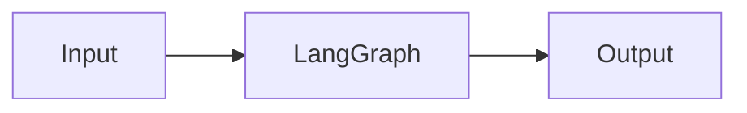

# LangGraph — A 2-Day Crash Course

> LangGraph turns LLM calls into a stateful, executable graph — prerequisite: `LLM-Fundamentals.md`.

---

## Part 0 — Why LangGraph

A chain is a straight line. Real work is a loop with branches and memory.

LangGraph models your agent as a **flowchart that executes**:

```
[Start]
   │
   ▼
[Classify intent]──────────────────────┐
   │                                   │
   ▼ (tool needed)                     ▼ (answer ready)
[Call tool]                        [Respond]
   │                                   │
   ▼                                   ▼
[Parse result]                      [End]
   │
   ▼
[Classify intent]  ← loop back
```

Each box is a **node** — a Python function that receives state and returns a partial state update.
Each arrow is an **edge** — either unconditional (always go there) or conditional (look at state, decide where to go).
State flows through every node, accumulating context across iterations.

That design gives you four things plain chains cannot:

- Cycles — re-enter a node after a tool call
- Branching — route to different nodes based on LLM output
- Persistence — pause the graph, store state, resume later
- Human-in-the-loop — interrupt before a sensitive action, wait for approval

---

## Vocabulary

| Term | What it means |
|---|---|
| **StateGraph** | The graph object you build your workflow on; parameterized by a state schema |
| **Node** | A Python function (or runnable) that reads state and returns a state delta |
| **Edge** | An unconditional connection between two nodes |
| **Conditional Edge** | A router function that inspects state and returns the name of the next node |
| **State** | A typed dict (or dataclass) that is the single source of truth flowing through every node |
| **Reducer** | A function attached to a state key that controls how new values are merged (e.g., append vs. overwrite) |
| **Checkpoint** | A serialized snapshot of state at a specific point — enables pause/resume and time-travel |
| **Thread** | One logical execution of the graph; multiple threads can run the same graph in parallel |
| **Tool Node** | A pre-built node that executes a list of LangChain tools and appends their results to state |
| **Human-in-the-loop** | An interrupt that halts the graph and surfaces state for a human to inspect or modify before continuing |
| **Subgraph** | A compiled graph embedded as a single node inside a parent graph — encapsulates a workflow |

---




## DAY 1 — Build your first working agent

### 1.1 Install

```bash
pip install langgraph langchain-openai langchain-core
```

LangGraph has no mandatory cloud dependency for local development. You need a model provider — OpenAI is used below, but any LangChain-compatible LLM works.

### 1.2 Define state

State is the shared memory that every node reads from and writes to. Use `TypedDict` with Python's `Annotated` to attach reducers.

```python
from typing import Annotated
from typing_extensions import TypedDict
from langgraph.graph.message import add_messages

class AgentState(TypedDict):
    # add_messages is a reducer: new messages are appended, not overwritten
    messages: Annotated[list, add_messages]
```

`add_messages` is LangGraph's built-in reducer for chat history. It handles the append-only pattern that most agents need.

### 1.3 Build, connect, and run

```python
from langchain_openai import ChatOpenAI
from langgraph.graph import StateGraph, START, END

model = ChatOpenAI(model="gpt-4o-mini")

def call_model(state: AgentState) -> dict:
    return {"messages": [model.invoke(state["messages"])]}

builder = StateGraph(AgentState)
builder.add_node("model", call_model)
builder.add_edge(START, "model")
builder.add_edge("model", END)

graph = builder.compile()
result = graph.invoke({"messages": [("user", "What is 2 + 2?")]})
print(result["messages"][-1].content)
```

### 1.6 Add a Tool Node

Tools give the model the ability to take actions. LangGraph's `ToolNode` handles the plumbing.

```python
from langchain_core.tools import tool
from langgraph.prebuilt import ToolNode

@tool
def get_weather(city: str) -> str:
    """Return current weather for a city."""
    return f"Sunny, 22C in {city}"  # stub

tools = [get_weather]
tool_node = ToolNode(tools)

# Bind tools to the model so it knows what's available
model_with_tools = model.bind_tools(tools)
```

### 1.7 ReAct pattern

ReAct (Reason + Act) is the backbone of most tool-using agents: the model reasons, optionally calls a tool, observes the result, reasons again, repeat.

```python
from langgraph.prebuilt import tools_condition

def call_model(state: AgentState) -> dict:
    response = model_with_tools.invoke(state["messages"])
    return {"messages": [response]}

builder = StateGraph(AgentState)
builder.add_node("model", call_model)
builder.add_node("tools", tool_node)

builder.add_edge(START, "model")

# tools_condition checks if the last message has tool_calls
# returns "tools" or END
builder.add_conditional_edges("model", tools_condition)

builder.add_edge("tools", "model")  # after tools, reason again

graph = builder.compile()
```

The graph now loops: model → tools → model → tools → ... until the model stops calling tools.

---

## DAY 2 — Production patterns

### 2.1 Conditional edges (your own router)

`tools_condition` is a convenience. You write your own router by returning a node name from a function:

```python
def route_after_model(state: AgentState) -> str:
    last = state["messages"][-1]
    if hasattr(last, "tool_calls") and last.tool_calls:
        return "tools"
    return END

builder.add_conditional_edges(
    "model",
    route_after_model,
    {"tools": "tools", END: END},  # mapping from return value to node name
)
```

The mapping is optional but makes the graph more readable and enables LangGraph to draw an accurate diagram.

### 2.2 Human-in-the-loop

Interrupt the graph before a node runs. The graph pauses, saves a checkpoint, and waits.

```python
graph = builder.compile(interrupt_before=["tools"])

# First run — graph pauses before executing tools
config = {"configurable": {"thread_id": "incident-001"}}
state = graph.invoke({"messages": [("user", "restart the database")]}, config)

# Inspect what the model wants to do
pending_tool_calls = state["messages"][-1].tool_calls
print(pending_tool_calls)

# Approve — resume with None to continue from checkpoint
result = graph.invoke(None, config)
```

You can also modify state before resuming:

```python
graph.update_state(config, {"messages": [("human", "actually, just check status first")]})
result = graph.invoke(None, config)
```

### 2.3 Persistence with checkpointers

Without a checkpointer, state is gone when the process exits. With one, every state transition is saved.

```python
from langgraph.checkpoint.memory import MemorySaver
from langgraph.checkpoint.sqlite import SqliteSaver  # for disk persistence

# In-memory (dev/test)
memory = MemorySaver()
graph = builder.compile(checkpointer=memory)

# SQLite (local persistence)
with SqliteSaver.from_conn_string("checkpoints.db") as checkpointer:
    graph = builder.compile(checkpointer=checkpointer)
```

For production, use `langgraph-checkpoint-postgres` backed by PostgreSQL.

### 2.4 Subgraphs

Subgraphs let you compose large workflows from smaller ones. Each subgraph is a compiled graph embedded as a node.

```python
# Build the sub-workflow
sub_builder = StateGraph(AgentState)
sub_builder.add_node("fetch", fetch_logs)
sub_builder.add_node("analyze", analyze_logs)
sub_builder.add_edge(START, "fetch")
sub_builder.add_edge("fetch", "analyze")
sub_builder.add_edge("analyze", END)
sub_graph = sub_builder.compile()

# Embed it in the parent
parent_builder = StateGraph(AgentState)
parent_builder.add_node("log_analysis", sub_graph)  # subgraph as a node
parent_builder.add_node("report", generate_report)
parent_builder.add_edge(START, "log_analysis")
parent_builder.add_edge("log_analysis", "report")
parent_builder.add_edge("report", END)
```

State schema compatibility: the subgraph's state schema must be a subset of (or map cleanly from) the parent's schema.

### 2.5 Streaming

LangGraph can stream individual tokens or node-level updates — you do not have to wait for the full result.

```python
# Stream node outputs
for chunk in graph.stream({"messages": [("user", "summarize the incident")]}, config):
    for node_name, update in chunk.items():
        print(f"[{node_name}] {update}")

# Stream tokens (requires LLM streaming support)
async for event in graph.astream_events(input, config, version="v2"):
    if event["event"] == "on_chat_model_stream":
        print(event["data"]["chunk"].content, end="", flush=True)
```

### 2.6 Multi-agent systems

In a multi-agent setup, each agent is a compiled subgraph. A supervisor agent routes work between them.

```python
def supervisor(state):
    # model decides which specialist agent to call
    response = supervisor_model.invoke(state["messages"])
    return {"next": response.next_agent}  # custom state field

def route_to_agent(state):
    return state["next"]  # "sre_agent", "security_agent", or END

builder.add_conditional_edges("supervisor", route_to_agent)
```

Each specialist agent handles its domain, then returns control to the supervisor. The supervisor sees accumulated state and decides whether to delegate further or terminate.

### 2.7 LangGraph Platform

LangGraph Platform is the managed hosting layer for production deployments:

- **LangGraph Server** — a REST + WebSocket API in front of your graph; handles auth, queuing, streaming, and thread management
- **LangGraph Studio** — a visual debugger; shows the graph topology, lets you step through executions, and edit state mid-run
- Deploy with `langgraph deploy` using a `langgraph.json` config file

```json
{
  "dependencies": ["."],
  "graphs": {
    "agent": "./agent.py:graph"
  },
  "env": ".env"
}
```

Self-hosted option: run `langgraph up` locally with Docker to get the full server stack without a cloud account.

### 2.8 LangSmith integration

LangSmith is LangChain's observability platform. Every LangGraph execution can be traced automatically.

```bash
export LANGCHAIN_TRACING_V2=true
export LANGCHAIN_API_KEY=your_key
export LANGCHAIN_PROJECT=my-agent
```

With those vars set, every `graph.invoke` call sends a trace to LangSmith. You see the full node-by-node execution, every LLM call with its token counts, and any tool invocations — without changing a line of application code.

---

## Worked Example — Incident Investigation Agent

You are an SRE on call. An alert fires: high error rate on the payments service. You want an agent that investigates automatically but asks before it takes any action.

```python
from typing import Annotated
from typing_extensions import TypedDict
from langgraph.graph import StateGraph, START, END
from langgraph.graph.message import add_messages
from langgraph.prebuilt import ToolNode, tools_condition
from langgraph.checkpoint.memory import MemorySaver
from langchain_openai import ChatOpenAI
from langchain_core.tools import tool

class IncidentState(TypedDict):
    messages: Annotated[list, add_messages]
    service: str

@tool
def query_metrics(service: str) -> str:
    """Query Prometheus p99 latency for the service."""
    return f"p99 latency for {service}: 4200ms"

@tool
def fetch_recent_logs(service: str) -> str:
    """Fetch recent error logs."""
    return f"ERROR: connection pool exhausted (x47 in last 5m) — {service}"

@tool
def list_recent_deploys(service: str) -> str:
    """List recent deployments."""
    return f"{service} v2.3.1 deployed 38 minutes ago by ci-bot"

@tool
def page_oncall(message: str) -> str:
    """Page on-call. Use only when escalation is needed."""
    return f"Paged on-call: {message}"

tools = [query_metrics, fetch_recent_logs, list_recent_deploys, page_oncall]
model = ChatOpenAI(model="gpt-4o").bind_tools(tools)

def investigate(state: IncidentState) -> dict:
    sys_msg = ("system",
        f"You are an SRE agent. Investigate high error rate on {state['service']}. "
        "Use tools to gather evidence. Only call page_oncall if escalation is needed.")
    return {"messages": [model.invoke([sys_msg] + state["messages"])]}

builder = StateGraph(IncidentState)
builder.add_node("investigate", investigate)
builder.add_node("tools", ToolNode(tools))
builder.add_edge(START, "investigate")
builder.add_conditional_edges("investigate", tools_condition)
builder.add_edge("tools", "investigate")

graph = builder.compile(checkpointer=MemorySaver(), interrupt_before=["tools"])

config = {"configurable": {"thread_id": "inc-20260531-001"}}
graph.invoke({"messages": [("user", "Investigate payments")], "service": "payments"}, config)

# Inspect and approve
snapshot = graph.get_state(config)
print([c["name"] for c in snapshot.values["messages"][-1].tool_calls])
graph.invoke(None, config)  # resume
```

The agent queries metrics, fetches logs, checks deploys, correlates the evidence, and either produces a summary or — only if confident escalation is warranted — pages on-call. You approved the tool calls before they ran.

---

## Pitfalls

**Unbounded loops.** If your conditional edge never returns `END`, the graph runs forever. Add a `max_iterations` counter in state and route to `END` when it is exceeded.

**State schema drift.** Adding a field to your state class after checkpoints exist will cause deserialization failures on resume. Version your state schema and migrate checkpoints explicitly.

**Reducer mismatch.** If you forget `add_messages` and use a plain list, each node overwrites the previous messages — your agent loses history silently.

**Interrupt semantics.** `interrupt_before=["tools"]` halts before *every* call to the `tools` node, including harmless read operations. Consider a custom node that separates read-only tools from write tools, and only interrupt before the write node.

**Thread ID collisions.** If two parallel runs share a thread ID, they share a checkpoint. Use unique, collision-resistant thread IDs in production — UUIDs, not sequential integers.

**LLM non-determinism.** The same state can produce different tool calls on repeated runs. If you need reproducible behavior for tests, seed your model or mock it at the boundary.

**Checkpoint storage growth.** Long-running threads with many tool calls accumulate large checkpoints. Prune old threads periodically using the checkpointer's thread deletion API.

---

## Quick Reference

```python
# Minimal ReAct agent — copy-paste starter
from typing import Annotated
from typing_extensions import TypedDict
from langgraph.graph import StateGraph, START, END
from langgraph.graph.message import add_messages
from langgraph.prebuilt import ToolNode, tools_condition
from langgraph.checkpoint.memory import MemorySaver

class State(TypedDict):
    messages: Annotated[list, add_messages]

def build_react_agent(model_with_tools, tools):
    def call_model(state):
        return {"messages": [model_with_tools.invoke(state["messages"])]}
    g = StateGraph(State)
    g.add_node("model", call_model)
    g.add_node("tools", ToolNode(tools))
    g.add_edge(START, "model")
    g.add_conditional_edges("model", tools_condition)
    g.add_edge("tools", "model")
    return g.compile(checkpointer=MemorySaver())

# Human-in-the-loop
graph = builder.compile(checkpointer=memory, interrupt_before=["tools"])
config = {"configurable": {"thread_id": "t1"}}
graph.invoke(initial_input, config)   # pauses before tools
graph.get_state(config)               # inspect
graph.invoke(None, config)            # resume

# Subgraph + async streaming
sub = sub_builder.compile()
parent_builder.add_node("step_name", sub)

async def stream_tokens(graph, input, config):
    async for event in graph.astream_events(input, config, version="v2"):
        if event["event"] == "on_chat_model_stream":
            print(event["data"]["chunk"].content, end="", flush=True)
```

---

## The Mantra

> State flows in. Nodes transform it. Edges decide what's next. Checkpoints make it recoverable. Everything in LangGraph is one of those four things — when you are confused, ask which one you are dealing with.

---

## Recommended learning resources

**YouTube channels & playlists:**
- [Sam Witteveen — LangGraph Tutorials](https://www.youtube.com/@samwitteveen) — the most thorough LangGraph video series: state graphs, checkpointing, human-in-the-loop, and multi-agent patterns
- [AI Jason — LangGraph Agent Builds](https://www.youtube.com/@AIJasonZ) — practical agent implementations using LangGraph with tool calling and conditional edges
- [DeepLearning.AI — AI Agents with LangGraph](https://www.youtube.com/@Deeplearningai) — short courses on building stateful agents, persistence, and streaming with LangGraph
- [AI Engineer — Agent Architecture Talks](https://www.youtube.com/@aiaboratories) — conference talks on graph-based agent design and multi-agent orchestration

**Official docs & blogs:**
- [LangGraph Documentation](https://langchain-ai.github.io/langgraph/) — state graph API, checkpointers, human-in-the-loop patterns, and deployment guides
- [LangChain Blog — LangGraph Posts](https://blog.langchain.dev/) — design philosophy, architecture patterns, and production deployment guides for LangGraph

---


## Top 10 Interview Questions

<details>
<summary><strong>Q: What is LangGraph and what problem does it solve?</strong></summary>

LangGraph addresses a specific need in modern engineering workflows. Understanding the core problem it solves — and the alternatives it replaced — is the foundation for every subsequent interview question. Frame your answer around the pain point first, then the solution.

</details>

<details>
<summary><strong>Q: How does LangGraph compare to its main alternatives?</strong></summary>

Every tool exists in an ecosystem of alternatives. Be prepared to articulate the specific tradeoffs: when LangGraph is the right choice, when an alternative is better, and what factors drive the decision (scale, team expertise, existing infrastructure, compliance requirements).

</details>

<details>
<summary><strong>Q: What are the most common production pitfalls with LangGraph?</strong></summary>

Production experience is what separates senior from junior engineers. Common pitfalls include: misconfiguration that works in dev but fails at scale, security oversights, inadequate monitoring, and operational procedures that are untested until an incident occurs. Cite specific examples from your experience.

</details>

<details>
<summary><strong>Q: How do you monitor and observe LangGraph in production?</strong></summary>

Key metrics to track, alerting thresholds to set, dashboards to build, and log patterns to watch. Production monitoring should cover: health/liveness, performance (latency, throughput), capacity (resource utilisation), and business impact (error rates affecting users). Explain which metrics are leading indicators versus lagging.

</details>

<details>
<summary><strong>Q: How do you scale LangGraph as load increases?</strong></summary>

Scaling strategies depend on the bottleneck: horizontal scaling (add more instances), vertical scaling (bigger instances), caching (reduce load), sharding (distribute data), and async processing (decouple components). Explain which approach applies to LangGraph and at what scale each strategy becomes necessary.

</details>

<details>
<summary><strong>Q: How do you handle security and access control with LangGraph?</strong></summary>

Security is non-negotiable in production. Cover: authentication and authorization mechanisms, secrets management (never in code), encryption (at rest and in transit), network security (firewalls, private networks), audit logging, and compliance requirements relevant to your industry.

</details>

<details>
<summary><strong>Q: How do you implement disaster recovery for LangGraph?</strong></summary>

DR planning requires defining RTO (recovery time objective) and RPO (recovery point objective), implementing backup strategies, testing restore procedures, and documenting runbooks. Explain your backup strategy, how you test restores, and what your recovery procedure looks like.

</details>

<details>
<summary><strong>Q: How do you automate LangGraph deployment and configuration management?</strong></summary>

Infrastructure as code, CI/CD pipelines, configuration management, and GitOps workflows. Explain how you version, test, deploy, and roll back changes. Cover: what is automated, what requires manual approval, and how you handle configuration drift.

</details>

<details>
<summary><strong>Q: How do you troubleshoot issues with LangGraph in production?</strong></summary>

A systematic debugging approach: check health endpoints, review recent changes (deploys, config changes), examine logs and metrics, reproduce the issue, identify root cause, fix, verify, and write a postmortem. Explain your actual debugging workflow with concrete examples.

</details>

<details>
<summary><strong>Q: What are the best practices for LangGraph that you have learned from experience?</strong></summary>

Best practices that go beyond documentation: lessons learned from production incidents, configuration patterns that prevent common issues, testing strategies that catch bugs before production, and operational procedures that reduce toil. Share specific examples where following (or not following) a best practice had measurable impact.

</details>

---


## Quick Quiz

Test your understanding with these rapid-fire questions (answers hidden):

<details>
<summary>1. What is the ONE core problem that LangGraph solves?</summary>
Re-read Part 0 — the mental model section. If you can explain the "why" in one sentence, you understand the foundation.
</details>

<details>
<summary>2. Name the 3 most important terms from the vocabulary section.</summary>
Review Part 1. These are the building blocks every conversation about LangGraph uses.
</details>

<details>
<summary>3. What is the first thing you would set up on Day 1?</summary>
Check the Day 1 section — the very first hands-on step that gets you a working result.
</details>

<details>
<summary>4. What is the most common production pitfall with LangGraph?</summary>
Review the Common Pitfalls section. The first item listed is typically the most frequently encountered.
</details>

<details>
<summary>5. How does LangGraph compare to its closest alternative?</summary>
Check the Comparison Matrix below — focus on the key differentiating row.
</details>


## Comparison Matrix

| Dimension | LangGraph | AutoGen | CrewAI |
|-----------|-----------|---------|--------|
| **Primary use case** | Core strength of LangGraph | Core strength of AutoGen | Core strength of CrewAI |
| **Learning curve** | Moderate | Varies | Varies |
| **Community/ecosystem** | Active | Active | Growing |
| **Operational complexity** | Medium | Varies | Varies |
| **Best for** | See Part 0 | Different tradeoffs | Different tradeoffs |

> **How to read this matrix:** no tool wins on every dimension. Pick based on your specific constraints — team expertise, existing infrastructure, scale requirements, and compliance needs. The right choice is the one that fits your context, not the one with the most checkmarks.

## Next Steps

- `LLM-Fundamentals.md` — revisit if nodes that call models feel opaque
- `RAG.md` — embed a retrieval step as a node; give your agent long-term memory
- `MCP.md` — expose tools via the Model Context Protocol so any MCP-compatible client can drive your graph
- `LLMOps.md` — trace, evaluate, and monitor your graph in production with LangSmith and CI evals
