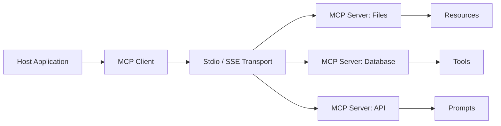

# Model Context Protocol (MCP) — A 2-Day Crash Course

> **In one sentence:** MCP is an open protocol that standardizes how AI applications connect to external tools and data sources — think of it as USB-C for LLM integrations: one plug, any tool. Prerequisite: see `LLM-Fundamentals.md`.

---

## Part 0 — Why MCP exists

Before MCP, every AI application that needed to read a database, call a GitHub API, or browse the filesystem wrote its own custom connector. The result: N models × M tools = N×M bespoke integration layers. Each one had its own auth pattern, its own error format, its own schema for inputs and outputs. Teams duplicated work constantly. When a tool's API changed, every integration broke independently.

MCP solves this at the protocol level. It defines a single, stable contract that any host (an AI app) can use to speak to any server (a tool provider). You implement the server once, and every MCP-compatible host can use it without modification.

The analogy holds precisely: before USB-C, every laptop maker used a different charging standard. You needed a different cable for every device. USB-C standardized the physical and electrical contract — one plug that works everywhere. MCP does the same thing for LLM tool calls.

Practically, MCP gives you:

- **Composability** — chain multiple servers together; an AI assistant can query your database, check GitHub issues, and read your runbooks in a single turn.
- **Reusability** — build a Prometheus query server once; every AI tool in your org uses it.
- **Security boundaries** — servers control exactly what they expose; the host never gets raw database access unless the server grants it.
- **Discoverability** — hosts ask servers what tools are available at runtime; no hardcoding required.

MCP is an open standard (published by Anthropic, adopted broadly). It is built on JSON-RPC 2.0, which means the transport layer is simple and the messages are inspectable.

**Mental model:** MCP is a universal adapter — the host (AI app) speaks one protocol, servers (tools) speak one protocol, and any host can use any server without custom glue code.

---




## Part 1 — The vocabulary

Before touching code, lock in the terms. The spec uses them precisely.

| Term | What it is |
|---|---|
| **Host** | The AI application that initiates connections — Claude Desktop, Claude Code, a LangGraph agent, your custom app. The host owns the user interaction and decides which servers to connect to. |
| **Client** | A protocol-level component embedded in the host that manages one connection to one server. One host can have many clients. |
| **Server** | A process or service that exposes tools, resources, or prompts over the MCP protocol. It does not initiate connections; it waits for the client to connect. |
| **Tool** | A function the AI can call with arguments and get a result — `query_database(sql)`, `create_issue(title, body)`, `run_shell(cmd)`. Tools have side effects; they do things. |
| **Resource** | A read-only data source identified by a URI — `file:///etc/hosts`, `postgres://mydb/schema`, `git://repo/main/README.md`. Resources are like files: you read them, you don't call them. |
| **Prompt (template)** | A reusable, parameterized message template stored on the server. The host retrieves it and injects it into the conversation. Useful for standardizing how the AI reasons about a domain. |
| **Transport** | The communication channel between client and server. Three options: `stdio` (subprocess pipes), `SSE` (Server-Sent Events over HTTP), `Streamable HTTP` (bidirectional HTTP streams). |
| **Capability** | A negotiated feature set. During `initialize`, client and server exchange what they support — roots, sampling, logging, etc. Neither side can assume the other supports something not declared. |
| **Session** | The stateful connection from `initialize` through `shutdown`. The session carries context: the agreed capabilities, any active subscriptions, the server's current state. |
| **JSON-RPC** | The underlying wire format. Every MCP message is a JSON-RPC 2.0 message — either a request (with `id`, `method`, `params`), a response (with `id`, `result` or `error`), or a notification (no `id`, fire-and-forget). |

The distinction between Tool, Resource, and Prompt is the most common source of confusion. Rule of thumb: if the AI needs to _do_ something, it calls a Tool. If it needs to _read_ something, it fetches a Resource. If it needs a pre-built reasoning scaffold, it fetches a Prompt template.

---

## DAY 1 — Use and build an MCP server

### 1.1 Install an MCP-capable host

The fastest path is Claude Desktop or Claude Code — both ship with MCP client support built in.

**Claude Desktop** — download from [claude.ai/download](https://claude.ai/download). Configuration lives at:

- macOS: `~/Library/Application Support/Claude/claude_desktop_config.json`
- Windows: `%APPDATA%\Claude\claude_desktop_config.json`

**Claude Code** — the CLI. Install via:

```bash
npm install -g @anthropic-ai/claude-code
```

Configuration is in `~/.claude/claude_desktop_config.json` (same schema as Desktop).

### 1.2 Connect to an existing server

Before writing any code, verify your host works by connecting to a known-good server. The official `filesystem` server is the simplest.

```json
{
  "mcpServers": {
    "filesystem": {
      "command": "npx",
      "args": [
        "-y",
        "@modelcontextprotocol/server-filesystem",
        "/Users/yourname/Documents"
      ]
    }
  }
}
```

Restart Claude Desktop. Open a new conversation and ask: "List the files in my Documents folder." If MCP is working, Claude calls the `list_directory` tool transparently and returns the result.

For the GitHub server:

```json
{
  "mcpServers": {
    "github": {
      "command": "npx",
      "args": ["-y", "@modelcontextprotocol/server-github"],
      "env": {
        "GITHUB_PERSONAL_ACCESS_TOKEN": "ghp_your_token_here"
      }
    }
  }
}
```

⚠️ Never commit a config file with real tokens. Use environment variable injection from your shell profile or a secrets manager. See `Docker.md` for secret injection patterns.

### 1.3 Understand the protocol flow

Every MCP interaction follows the same sequence. Knowing this flow makes debugging trivial.

```
Client                          Server
  |                               |
  |-- initialize(capabilities) -->|
  |<-- initialize result ---------|
  |-- initialized (notify) ------>|
  |                               |
  |-- tools/list ----------------->|
  |<-- tools/list result ----------|
  |                               |
  |-- tools/call(name, args) ----->|
  |<-- tools/call result ----------|
  |                               |
  |-- shutdown ------------------->|
  |<-- shutdown result ------------|
```

1. **initialize** — client sends its protocol version and capabilities; server responds with its version and capabilities. If versions are incompatible, the server rejects the connection.
2. **initialized** — client sends this notification to confirm it received the server's response and is ready.
3. **tools/list** — client asks what tools are available. Server returns an array of tool definitions: name, description, input schema (JSON Schema format).
4. **tools/call** — client invokes a specific tool with arguments. Server executes and returns content (text, image, or embedded resource).
5. **shutdown** — clean teardown. Not always explicit (stdio servers die with the host process), but required for HTTP transports.

You can inspect this traffic by running an MCP server with `--debug` or by wrapping it in a logging proxy.

### 1.4 Build a simple MCP server in Python

Install the SDK:

```bash
pip install mcp
```

Here is a minimal server that exposes one tool — querying a SQLite database:

```python
# db_server.py
import sqlite3
import json
from mcp.server import Server
from mcp.server.stdio import stdio_server
from mcp.types import Tool, TextContent

DB_PATH = "/tmp/mydata.db"

app = Server("db-query-server")

@app.list_tools()
async def list_tools():
    return [
        Tool(
            name="query_db",
            description="Run a read-only SQL query against the local SQLite database.",
            inputSchema={
                "type": "object",
                "properties": {
                    "sql": {
                        "type": "string",
                        "description": "SQL SELECT statement to execute."
                    }
                },
                "required": ["sql"]
            }
        )
    ]

@app.call_tool()
async def call_tool(name: str, arguments: dict):
    if name != "query_db":
        raise ValueError(f"Unknown tool: {name}")

    sql = arguments.get("sql", "").strip()
    # Enforce read-only: reject anything that isn't SELECT
    if not sql.upper().startswith("SELECT"):
        return [TextContent(type="text", text="Error: only SELECT statements are allowed.")]

    conn = sqlite3.connect(DB_PATH)
    cursor = conn.execute(sql)
    rows = cursor.fetchall()
    columns = [desc[0] for desc in cursor.description]
    conn.close()

    result = [dict(zip(columns, row)) for row in rows]
    return [TextContent(type="text", text=json.dumps(result, indent=2))]

if __name__ == "__main__":
    import asyncio
    asyncio.run(stdio_server(app))
```

Register it in your Claude config:

```json
{
  "mcpServers": {
    "db-query": {
      "command": "python3",
      "args": ["/path/to/db_server.py"]
    }
  }
}
```

### 1.5 Build the same server in TypeScript

```bash
npm init -y && npm install @modelcontextprotocol/sdk
```

```typescript
// db-server.ts
import { Server } from "@modelcontextprotocol/sdk/server/index.js";
import { StdioServerTransport } from "@modelcontextprotocol/sdk/server/stdio.js";
import {
  CallToolRequestSchema,
  ListToolsRequestSchema,
} from "@modelcontextprotocol/sdk/types.js";
import Database from "better-sqlite3";

const DB_PATH = "/tmp/mydata.db";

const server = new Server(
  { name: "db-query-server", version: "1.0.0" },
  { capabilities: { tools: {} } }
);

server.setRequestHandler(ListToolsRequestSchema, async () => ({
  tools: [
    {
      name: "query_db",
      description: "Run a read-only SQL query against the local SQLite database.",
      inputSchema: {
        type: "object",
        properties: {
          sql: { type: "string", description: "SQL SELECT statement." },
        },
        required: ["sql"],
      },
    },
  ],
}));

server.setRequestHandler(CallToolRequestSchema, async (request) => {
  const { name, arguments: args } = request.params;
  if (name !== "query_db") throw new Error(`Unknown tool: ${name}`);

  const sql = (args?.sql as string ?? "").trim();
  if (!sql.toUpperCase().startsWith("SELECT")) {
    return { content: [{ type: "text", text: "Error: only SELECT statements allowed." }] };
  }

  const db = new Database(DB_PATH, { readonly: true });
  const rows = db.prepare(sql).all();
  db.close();

  return { content: [{ type: "text", text: JSON.stringify(rows, null, 2) }] };
});

const transport = new StdioServerTransport();
await server.connect(transport);
```

---

**By end of Day 1 you can:**

- Configure Claude Desktop or Claude Code to connect to existing MCP servers.
- Trace the initialize → list → call → shutdown flow in a debug log.
- Build a stdio MCP server in Python or TypeScript that exposes a custom tool.
- Enforce basic safety constraints (read-only SQL) inside a tool handler.

---

## DAY 2 — Make it real

### 2.1 Resources vs Tools vs Prompts — when to use which

The three primitives serve different purposes. Using the wrong one creates awkward interfaces.

**Tools** — use when the action has side effects or requires computation: inserting a row, sending an alert, running a query with parameters, calling an external API. The AI _invokes_ a tool with arguments and receives a result. Tools are the most common primitive.

**Resources** — use when the content is static or changes independently of the AI interaction: a schema definition, a runbook file, a configuration snapshot. Resources are identified by URI and are read without arguments. The AI (or the host) fetches them directly. Resources don't run code on your behalf — they expose data.

**Prompt templates** — use when you want to standardize how an AI reasons about a specific domain. A prompt template is a parameterized message stored server-side. For example, a `postmortem_template` prompt that accepts `incident_title` and `duration` and returns a fully structured prompt. This keeps prompt engineering centralized rather than scattered across every client.

Decision tree: does the AI need to _run_ something? → Tool. Does it need to _read_ something by address? → Resource. Does it need a reusable _reasoning scaffold_? → Prompt template.

### 2.2 Transport options

MCP supports three transports. Choose based on where your server runs.

**stdio (local)** — the server runs as a child process of the host. Communication happens over stdin/stdout. Simple, zero network setup, secure by default (no ports exposed). This is the right choice for local development servers and CLI-embedded tools. The server process starts and stops with the host.

**SSE — Server-Sent Events (remote, legacy)** — the server runs as an HTTP service. The client connects to an `/sse` endpoint and receives events over a persistent HTTP connection. Responses are sent back via a separate POST endpoint. This was the original remote transport. It works but requires keeping an HTTP connection open, which complicates load balancers and proxies.

**Streamable HTTP (remote, current)** — the successor to SSE. A single HTTP endpoint handles both sending and receiving. The server can respond with either a regular JSON body or a streaming response depending on need. Simpler infrastructure requirements than SSE — works naturally with standard HTTP proxies and API gateways.

For production remote deployments, use Streamable HTTP. For anything local, use stdio.

### 2.3 Authentication and security

MCP does not define an authentication standard at the protocol level — transport-level auth is your responsibility.

For **stdio** servers: the server runs as the same user as the host. Security comes from OS-level process isolation. No network exposure. The risk surface is what the server code _does_, not how it communicates.

For **HTTP-based** servers: use standard HTTP auth. Anthropic recommends OAuth 2.1 for MCP servers exposed to the internet — the spec includes guidance on the authorization flow. For internal services, mTLS or a shared API key passed as a bearer token in `Authorization` headers works fine.

Key security principles:

- **Principle of least privilege** — your server should only expose what it needs to. A Prometheus query server should not have write access to Prometheus.
- **Input validation** — validate all tool arguments before acting on them. Never trust that the AI passed a well-formed input. Use JSON Schema validation (the SDK does this for you if you define `inputSchema` correctly).
- **Injection prevention** — if your tool executes SQL, shell commands, or template strings, sanitize inputs rigorously. Parameterized queries, not string concatenation.
- **Audit logging** — log every tool call with arguments and the identity of the requesting session. When something goes wrong, you want a trail.

⚠️ A malicious prompt can instruct an AI to call a tool with destructive arguments. If your tool can delete data, require explicit confirmation or scope it tightly.

### 2.4 Error handling

MCP uses JSON-RPC error codes. The server returns an error object with `code` and `message`. Standard codes:

| Code | Meaning |
|---|---|
| -32700 | Parse error — invalid JSON received |
| -32600 | Invalid request — not a valid JSON-RPC object |
| -32601 | Method not found — e.g., calling a tool that doesn't exist |
| -32602 | Invalid params — arguments failed schema validation |
| -32603 | Internal error — server threw an exception |

For tool-level errors (as opposed to protocol errors), return a result with `isError: true` and a descriptive message in the content. This signals to the AI that the tool ran but produced an error — useful because the AI can then reason about the failure and try a different approach.

```python
# Return a tool-level error, not a protocol error
return [TextContent(type="text", text="Query failed: table 'foo' does not exist.")]
# with isError=True in the ToolResult
```

Always include enough context in error messages for the AI to self-correct — "table not found" is better than "error 500".

### 2.5 Building production servers

A toy server works for demos. A production server needs several additional concerns.

**Logging** — structured logs at every tool call: timestamp, tool name, arguments (sanitized), duration, success/error. Use a log level that lets you tune verbosity without redeploying. Python: use `logging` with JSON formatter. TypeScript: use `pino`.

**Rate limiting** — if your server calls an external API, protect it. Track calls per session or per unit time. Return a clear error when the limit is hit rather than silently dropping the request.

**Timeouts** — tools that call external services must time out. A stuck tool call blocks the AI's response. Set a timeout on every external call — 5–30 seconds is typically right, depending on the operation.

**Graceful shutdown** — handle `SIGTERM` and `SIGINT`. Close database connections, flush logs, complete in-flight requests. For stdio servers, clean up when stdin closes.

**Connection management** — for HTTP servers, implement health check endpoints. If you're running multiple server instances, ensure each maintains its own session state (or use a shared session store).

**Secrets** — never read secrets from tool arguments. Inject them at server startup via environment variables. See `Docker.md` for container secret injection patterns.

### 2.6 Testing MCP servers

Testing happens at three levels.

**Unit tests** — test tool handler functions in isolation. Mock the database or external API. Verify that given valid inputs, the handler returns expected outputs, and that given invalid inputs, it returns appropriate errors.

**Protocol tests** — use the MCP Inspector (`npx @modelcontextprotocol/inspector`) to exercise your server directly without a host AI. The inspector provides a UI to call tools, fetch resources, and inspect raw JSON-RPC messages.

```bash
npx @modelcontextprotocol/inspector python3 my_server.py
```

**Integration tests** — connect your server to Claude Code in CI. Write prompts that exercise each tool and assert the outputs. This catches regressions where the tool works but the AI misuses it due to a bad description or schema.

Write tool descriptions with the same care as function docstrings — the AI reads them and decides whether and how to call the tool.

### 2.7 Deploying MCP servers

**Local (stdio)** — no deployment needed. The binary or script ships with the config file reference. See Section 1.2 for the config format.

**Docker (HTTP)** — package your server as a container. Expose the MCP HTTP port (typically 3000 or 8080). See `Docker.md` for the Dockerfile and docker-compose patterns.

```dockerfile
FROM python:3.12-slim
WORKDIR /app
COPY requirements.txt .
RUN pip install -r requirements.txt
COPY . .
EXPOSE 8080
CMD ["python3", "server.py", "--transport", "http", "--port", "8080"]
```

**Cloud** — deploy to any platform that runs containers or serverless functions. The only requirement is that the HTTP endpoint is reachable from the host. For internal tools, deploy behind a VPN or service mesh. For public tools, put an auth layer in front.

### 2.8 Composing multiple servers

A host can connect to many servers simultaneously. Each server is an independent process with its own tool namespace. The AI sees all tools from all connected servers as a flat list — tool names must be unique across all servers (or the host namespaces them).

Composition patterns:

- **Domain separation** — one server per domain: `prometheus-server`, `github-server`, `runbook-server`. Each server is small, focused, and independently deployable.
- **Gateway server** — a single server that aggregates others behind a common interface. Useful when you want to control exactly what tools the AI sees.
- **Chaining** — a server that itself calls another MCP server. This is valid but adds latency and complexity — only do it when you need to transform or aggregate results from multiple sources.

When running many servers, monitor their resource consumption. Each stdio server is a child process. Dozens of servers can add up.

---

## Worked example — MCP server for querying Prometheus

This is a realistic SRE scenario: you want an AI assistant that can query your metrics directly, answer questions like "what is the p99 latency of the auth service over the last hour?", and help during incidents without you manually running PromQL. See `Prometheus.md` for PromQL fundamentals.

### What the server exposes

One tool: `query_prometheus`. It accepts a PromQL expression and a time range, executes it against the Prometheus HTTP API, and returns the result as structured JSON.

### Implementation

```python
# prometheus_server.py
import os
import json
import httpx
import asyncio
from datetime import datetime, timedelta
from mcp.server import Server
from mcp.server.stdio import stdio_server
from mcp.types import Tool, TextContent

PROMETHEUS_URL = os.environ.get("PROMETHEUS_URL", "http://localhost:9090")

app = Server("prometheus-query-server")

@app.list_tools()
async def list_tools():
    return [
        Tool(
            name="query_prometheus",
            description=(
                "Execute a PromQL query against Prometheus and return the results. "
                "Use for answering questions about system metrics: latency, error rates, "
                "CPU/memory usage, request rates. Supports instant queries and range queries. "
                "Returns a JSON array of time series results."
            ),
            inputSchema={
                "type": "object",
                "properties": {
                    "query": {
                        "type": "string",
                        "description": "PromQL expression. Example: rate(http_requests_total[5m])"
                    },
                    "range_minutes": {
                        "type": "integer",
                        "description": "Look-back window in minutes for range queries. Omit for instant query.",
                        "minimum": 1,
                        "maximum": 1440
                    },
                    "step_seconds": {
                        "type": "integer",
                        "description": "Resolution step in seconds for range queries. Default: 60.",
                        "minimum": 1
                    }
                },
                "required": ["query"]
            }
        )
    ]

@app.call_tool()
async def call_tool(name: str, arguments: dict):
    if name != "query_prometheus":
        raise ValueError(f"Unknown tool: {name}")

    query = arguments["query"]
    range_minutes = arguments.get("range_minutes")
    step_seconds = arguments.get("step_seconds", 60)

    async with httpx.AsyncClient(timeout=30.0) as client:
        if range_minutes:
            end = datetime.utcnow()
            start = end - timedelta(minutes=range_minutes)
            params = {
                "query": query,
                "start": start.isoformat() + "Z",
                "end": end.isoformat() + "Z",
                "step": str(step_seconds)
            }
            response = await client.get(f"{PROMETHEUS_URL}/api/v1/query_range", params=params)
        else:
            response = await client.get(
                f"{PROMETHEUS_URL}/api/v1/query",
                params={"query": query}
            )

    if response.status_code != 200:
        return [TextContent(
            type="text",
            text=f"Prometheus returned HTTP {response.status_code}: {response.text}"
        )]

    data = response.json()
    if data.get("status") != "success":
        error_type = data.get("errorType", "unknown")
        error = data.get("error", "unknown error")
        return [TextContent(
            type="text",
            text=f"PromQL error ({error_type}): {error}"
        )]

    result = data["data"]["result"]
    return [TextContent(type="text", text=json.dumps(result, indent=2))]

if __name__ == "__main__":
    asyncio.run(stdio_server(app))
```

### Configuration

```json
{
  "mcpServers": {
    "prometheus": {
      "command": "python3",
      "args": ["/path/to/prometheus_server.py"],
      "env": {
        "PROMETHEUS_URL": "http://prometheus.internal:9090"
      }
    }
  }
}
```

### What you get

With this server running, you can ask Claude: "Show me the p99 request latency for the payment service over the last 30 minutes" — and Claude translates that into a PromQL call, fetches the results, and presents them in a readable format. During an incident, you can ask "which services have error rates above 1% right now?" without switching context to Grafana.

---

## Common pitfalls

- **Tool descriptions are too vague.** The AI decides whether to call a tool based entirely on its description and schema. "Run a query" is useless. "Execute a PromQL expression against Prometheus and return time series results — use for latency, error rate, and throughput questions" tells the AI when and how to use it.

- **Returning unstructured blobs.** If your tool returns a 50KB JSON blob, the AI has to reason over all of it. Return the minimum useful subset. If the user asked for p99 latency, return p99 latency — not the full histogram.

- **Not validating inputs server-side.** The JSON Schema in `inputSchema` is documentation for the AI. It does not prevent your handler from receiving invalid data — always validate in code.

- **Using a tool where a resource belongs.** If the content doesn't change based on arguments, it's a resource. Using a tool to fetch static content forces unnecessary round-trips and confuses the AI's mental model.

- **Long-running tools blocking the session.** A tool that takes 90 seconds to complete makes the conversation feel broken. Set aggressive timeouts, or restructure the operation to return quickly with a job ID and expose a separate polling tool.

- **Ignoring the initialized notification.** Some SDKs require you to explicitly handle the `initialized` notification before processing further requests. Skipping it causes intermittent initialization failures under load.

- **Exposing destructive tools without guardrails.** A tool that can `DELETE FROM orders WHERE 1=1` is a liability. Either don't expose destructive tools, or require an explicit confirmation argument (`confirm: true`) and validate it.

- **Assuming stdio means safe.** stdio servers still run with the host user's permissions. A malicious or misconfigured prompt can cause real damage. Scope your server's permissions at the OS level.

- **Not testing tool descriptions with real prompts.** Write five different natural-language questions that should trigger a tool. If the AI doesn't call the tool for all five, rewrite the description.

---

## Quick reference

### Protocol flow (ASCII)

```
+----------+   initialize(version, caps)    +----------+
|  Client  | ----------------------------> |  Server  |
|          | <---------------------------- |          |
|          |   result(version, caps)        |          |
|          |                               |          |
|          |   initialized (notify)        |          |
|          | ----------------------------> |          |
|          |                               |          |
|          |   tools/list                  |          |
|          | ----------------------------> |          |
|          | <---------------------------- |          |
|          |   [{name, description,        |          |
|          |     schema}]                  |          |
|          |                               |          |
|          |   tools/call {name, args}     |          |
|          | ----------------------------> |          |
|          | <---------------------------- |          |
|          |   {content: [...]}            |          |
+----------+                               +----------+
```

### Minimal Python server template

```python
from mcp.server import Server
from mcp.server.stdio import stdio_server
from mcp.types import Tool, TextContent
import asyncio

app = Server("my-server")

@app.list_tools()
async def list_tools():
    return [Tool(name="my_tool", description="...", inputSchema={
        "type": "object",
        "properties": {"arg": {"type": "string"}},
        "required": ["arg"]
    })]

@app.call_tool()
async def call_tool(name: str, arguments: dict):
    # implement tool logic
    return [TextContent(type="text", text="result")]

if __name__ == "__main__":
    asyncio.run(stdio_server(app))
```

### Minimal TypeScript server template

```typescript
import { Server } from "@modelcontextprotocol/sdk/server/index.js";
import { StdioServerTransport } from "@modelcontextprotocol/sdk/server/stdio.js";
import { CallToolRequestSchema, ListToolsRequestSchema } from "@modelcontextprotocol/sdk/types.js";

const server = new Server(
  { name: "my-server", version: "1.0.0" },
  { capabilities: { tools: {} } }
);

server.setRequestHandler(ListToolsRequestSchema, async () => ({
  tools: [{ name: "my_tool", description: "...", inputSchema: {
    type: "object", properties: { arg: { type: "string" } }, required: ["arg"]
  }}]
}));

server.setRequestHandler(CallToolRequestSchema, async (req) => ({
  content: [{ type: "text", text: "result" }]
}));

await server.connect(new StdioServerTransport());
```

### Claude Desktop / Claude Code config reference

```json
{
  "mcpServers": {
    "server-name": {
      "command": "python3",
      "args": ["/absolute/path/to/server.py"],
      "env": {
        "ENV_VAR": "value"
      }
    },
    "node-server": {
      "command": "node",
      "args": ["/absolute/path/to/dist/index.js"]
    },
    "remote-server": {
      "url": "https://my-mcp-server.internal/mcp",
      "headers": {
        "Authorization": "Bearer ${MY_TOKEN}"
      }
    }
  }
}
```

### Common tool patterns

| Pattern | When to use |
|---|---|
| Read-only query | Database lookups, metric queries, log searches — validate syntax, enforce SELECT-only or equivalent |
| Write with confirmation | Any mutation — require an explicit `dry_run: false` argument and describe what will change |
| Paginated results | When result sets can be large — accept `limit` and `offset`, return total count |
| Async job | Long-running operations — return a job ID immediately, expose a separate `get_job_status` tool |
| Structured error | Always return `isError: true` with a human-readable message on failure — lets the AI self-correct |

---


## Top 10 Interview Questions

<details>
<summary><strong>Q: What problem does MCP solve that function calling and tool use do not?</strong></summary>

Function calling gives an LLM the ability to invoke predefined tools, but every integration is bespoke — each app reinvents how to connect to databases, files, and APIs. MCP standardises the protocol between AI hosts and capability providers, so a tool server written once works with any MCP-compatible client (Claude Desktop, IDE extensions, custom agents). It is the difference between every app writing its own USB driver versus plugging into a universal USB standard.

</details>

<details>
<summary><strong>Q: What are the three core primitives in MCP and when do you use each?</strong></summary>

Resources expose data the model can read (files, database records, API responses) — like GET endpoints. Tools expose actions the model can invoke with parameters (run a query, create a file, send a message) — like POST endpoints. Prompts expose reusable prompt templates with parameters. Use resources for context loading, tools for side-effecting actions, and prompts for standardised interaction patterns across clients.

</details>

<details>
<summary><strong>Q: How does MCP handle transport and what are the options?</strong></summary>

MCP supports two transports: stdio (for local servers running as child processes — the client spawns the server and communicates via stdin/stdout) and SSE (Server-Sent Events over HTTP for remote servers). Stdio is simpler and more secure for local tools. SSE enables remote servers but requires authentication and network security. The protocol is transport-agnostic — the same server code works over either transport with minimal configuration changes.

</details>

<details>
<summary><strong>Q: How do you secure an MCP server, especially one exposed over SSE?</strong></summary>

For stdio servers, security is inherent — the server runs as a local child process with the user's permissions. For SSE, implement authentication (OAuth, API keys), TLS encryption, and rate limiting at the transport layer. At the protocol level, validate all tool input parameters server-side, implement least-privilege access (a file server should only access designated directories), and audit-log all tool invocations. Never trust client-side validation alone.

</details>

<details>
<summary><strong>Q: How does MCP differ from OpenAI's function calling and LangChain tools?</strong></summary>

OpenAI function calling is a model feature — the model decides to call functions but the application code must implement the dispatch and execution. LangChain tools are a framework abstraction tightly coupled to LangChain. MCP is a protocol — it standardises the communication between any AI host and any tool provider, regardless of model or framework. An MCP server works with Claude, Copilot, or any MCP-compatible client without modification. It is infrastructure, not a library feature.

</details>

<details>
<summary><strong>Q: How would you build a production MCP server for a database?</strong></summary>

Expose read queries as resources (list tables, describe schema, query with parameters) and write operations as tools (insert, update with confirmation). Use parameterised queries to prevent SQL injection. Implement connection pooling and query timeout limits. Add row-level security if multi-tenant. Return structured results the model can reason about (JSON, not raw result sets). Log all queries for audit. Consider a read-only mode for safety, requiring explicit user approval for mutations.

</details>

<details>
<summary><strong>Q: What is the lifecycle of an MCP connection and how do you handle failures?</strong></summary>

The client sends an initialize request with protocol version and capabilities, the server responds with its capabilities (supported tools, resources, prompts). The connection then enters the operational phase where the client can list and invoke capabilities. For stdio, if the server process crashes, the client detects the broken pipe and can restart it. For SSE, implement reconnection with exponential backoff. Servers should be stateless where possible so restarts are transparent.

</details>

<details>
<summary><strong>Q: How do you test and debug MCP servers during development?</strong></summary>

Use the MCP Inspector (official debugging tool) to interactively call tools and resources without a full host application. Write integration tests that instantiate your server and call endpoints programmatically. For stdio servers, test by piping JSON-RPC messages via stdin. Log all requests and responses during development. Test edge cases: malformed inputs, timeout scenarios, concurrent requests, and large payloads.

</details>

<details>
<summary><strong>Q: How does sampling work in MCP and why is it important?</strong></summary>

Sampling allows MCP servers to request LLM completions from the host — the server asks the client to generate text using the host's model. This enables agentic patterns where a tool server can reason about intermediate results without the host orchestrating every step. The host controls approval (human-in-the-loop) and can limit which servers can sample. It inverts the typical flow — instead of only the model calling tools, tools can also call the model.

</details>

<details>
<summary><strong>Q: How do you handle versioning and backwards compatibility in MCP servers?</strong></summary>

MCP uses capability negotiation during initialization — client and server declare what they support, and both sides adapt. When evolving a server, add new tools and resources without removing existing ones. Use semantic versioning for your server package. If you must break compatibility, check the client's declared protocol version and maintain fallback behaviour for older clients. The protocol itself versions independently from individual server implementations.

</details>

---

## Next steps after Day 2

- `LLM-Fundamentals.md` — understand how the AI reasons about tool calls; token budgets and context windows directly affect MCP tool design.
- `Prompt-Engineering.md` — writing good tool descriptions is prompt engineering; the same principles apply.
- **LangGraph** — build multi-agent workflows where agents share MCP servers; LangGraph has native MCP client support.
- `Prometheus.md` — deepen your PromQL knowledge to build more powerful metric query tools like the worked example above.
- **MCP Registry** — browse [modelcontextprotocol/servers](https://github.com/modelcontextprotocol/servers) for community servers before building your own.

---

## Recommended learning resources

**YouTube channels & playlists:**
- [Anthropic Official — MCP Tutorials](https://www.youtube.com/@AnthropicAI) — official walkthroughs of Model Context Protocol: server building, tool design, and client integration
- [AI Jason — MCP Practical Guides](https://www.youtube.com/@AIJasonZ) — hands-on MCP server implementations with real-world tool integrations
- [Sam Witteveen — MCP & Tool Use](https://www.youtube.com/@samwitteveen) — building MCP servers, connecting to agents, and protocol design patterns
- [AI Engineer — MCP Architecture Talks](https://www.youtube.com/@aiaboratories) — conference talks on tool integration standards and the MCP ecosystem

**Official docs & blogs:**
- [Model Context Protocol Specification](https://modelcontextprotocol.io) — the authoritative protocol spec: transport, message format, tool/resource/prompt primitives
- [MCP Servers Repository](https://github.com/modelcontextprotocol/servers) — community and reference server implementations to learn from before building your own
- [Anthropic Documentation — Tool Use](https://docs.anthropic.com/en/docs/build-with-claude/tool-use) — Claude's tool use patterns, which MCP standardises across clients

---

**The mantra:** One protocol, any tool — build the server once, let every AI host use it forever.
