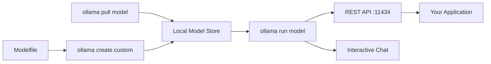

# Ollama — A 2-Day Crash Course

> **In one sentence:** Ollama lets you run open-source LLMs locally on your machine with a single command — no cloud, no API keys, no data leaving your network.

---

## Part 0 — Why Ollama exists

Cloud LLM APIs are convenient, but they come with real costs: latency on every request, per-token billing that adds up fast, privacy risk when you send proprietary code or customer data over the wire, and rate limits that bite you at inconvenient times. Before Ollama, running a model locally meant wrestling with CUDA driver versions, manually downloading multi-gigabyte GGUF quantization files, figuring out llama.cpp build flags, and writing your own server layer. It was a weekend project just to get "hello world" out of a model.

Ollama removes all of that friction.

**Mental model:** Ollama is the Docker of LLMs. `ollama run llama3` is like `docker run nginx` — one command pulls the image if you don't have it, starts the runtime, and gives you an interactive session. There's a model registry (analogous to Docker Hub), a local image cache, a daemon running in the background, and a REST API server included out of the box. You don't think about quantization formats, BLAS backends, or memory-mapped file loading. You think about which model to use and what to ask it.

The daemon starts automatically on login (macOS/Linux) and handles GPU detection, memory management, and model unloading. When you're not using a model, it gets evicted from VRAM. When you call it again, it reloads in seconds.

---




## Part 1 — The vocabulary

| Term | What it means |
|------|--------------|
| **Model** | A packaged LLM — weights plus metadata — identified by name and tag (e.g., `llama3:8b`). Stored in `~/.ollama/models`. |
| **Modelfile** | A Dockerfile-equivalent for LLMs. Defines base model, system prompt, parameters, and prompt template. |
| **Quantization** | Lossy compression of model weights from float32 down to int4/int5/int8. Lower precision = smaller size, less VRAM, slightly lower quality. Q4 = aggressive compression, Q8 = near-lossless. |
| **GGUF** | The file format for quantized models, developed by llama.cpp. Ollama handles GGUF internally — you rarely touch these files directly. |
| **Context Window** | Maximum number of tokens the model can "see" at once — input + output combined. A 4K context window means the model can't reason over more than ~3,000 words of combined history. |
| **System Prompt** | An instruction injected before the conversation begins. Used to set persona, output format, constraints, or domain context. |
| **Temperature** | Controls randomness in token sampling. `0.0` = deterministic and repetitive. `1.0` = creative and unpredictable. SRE tooling: use `0.1`–`0.3`. Creative tasks: `0.7`–`0.9`. |
| **VRAM** | GPU memory. Models run fastest when they fit entirely in VRAM. If they don't fit, layers spill to RAM (slower) or CPU (much slower). |
| **Ollama API** | A local HTTP server on `localhost:11434`. Exposes `/api/generate`, `/api/chat`, `/api/embeddings`, and an OpenAI-compatible endpoint. |
| **Tag** | Version/variant specifier appended to a model name with a colon — `llama3:70b`, `mistral:7b-instruct-q4_K_M`. Default tag is `latest`. |

---

## DAY 1 — Run your first local model

### 1. Install

**macOS:**
```bash
brew install ollama
```

Or download the `.dmg` from [ollama.com](https://ollama.com) and install the menu bar app. The app starts the daemon automatically.

**Linux:**
```bash
curl -fsSL https://ollama.com/install.sh | sh
```

The install script detects NVIDIA/AMD GPUs and installs appropriate drivers if needed. After install, the `ollama` service starts automatically via systemd.

**Windows:** Download the installer from ollama.com. WSL2 with GPU passthrough is supported.

Verify:
```bash
ollama --version
```

### 2. Pull and run your first model

```bash
ollama pull llama3
ollama run llama3
```

`pull` downloads the model to `~/.ollama/models`. `run` starts an interactive REPL. Type your prompt and press Enter. Use `/bye` to exit.

If you skip `pull`, `run` pulls automatically:
```bash
ollama run llama3 "Explain TCP three-way handshake in two sentences"
```

That last form — passing the prompt as an argument — is useful for scripting.

### 3. Chat with models interactively

Inside the REPL:
```
>>> What is the difference between a process and a thread?
>>> /clear         # clear conversation history
>>> /set verbose   # show token stats
>>> /show info     # show model metadata
>>> /bye           # exit
```

Multi-line input: end a line with `\` to continue on the next line.

### 4. The REST API

Ollama runs an HTTP server on `localhost:11434`. It's up whenever the daemon is running.

**Generate (single-turn):**
```bash
curl http://localhost:11434/api/generate \
  -d '{
    "model": "llama3",
    "prompt": "What is a kernel panic?",
    "stream": false
  }'
```

**Chat (multi-turn with history):**
```bash
curl http://localhost:11434/api/chat \
  -d '{
    "model": "llama3",
    "messages": [
      {"role": "system", "content": "You are a concise SRE assistant."},
      {"role": "user", "content": "What causes OOM kills?"}
    ],
    "stream": false
  }'
```

Setting `"stream": true` returns newline-delimited JSON chunks — useful for building streaming UIs. Setting `"stream": false` returns a single JSON response when generation completes.

### 5. List and remove models

```bash
ollama list                    # show all local models
ollama show llama3             # model metadata, parameters, template
ollama rm llama3               # delete local model
ollama cp llama3 my-llama3     # copy model under new name (useful before customizing)
```

Models are stored at `~/.ollama/models`. Each model is a few gigabytes — manage disk space accordingly.

### 6. Set a system prompt at run time

```bash
ollama run llama3 --system "You are a Kubernetes expert. Answer only about k8s topics."
```

This is a one-session override. For persistent system prompts, use a Modelfile (see Day 2).

### 7. Basic Modelfile

Create a file named `Modelfile`:
```dockerfile
FROM llama3

SYSTEM """
You are a senior SRE at a fintech company.
You give direct, concise answers. No filler.
When answering about incidents, always include a root cause and a mitigation step.
"""

PARAMETER temperature 0.2
PARAMETER num_ctx 4096
```

Build and run it:
```bash
ollama create sre-assistant -f Modelfile
ollama run sre-assistant
```

You've now created a named custom model that persists in your local registry.

---

**By end of Day 1 you can:**
- Install Ollama and pull models from the registry
- Run interactive chat sessions and one-shot prompts
- Call the REST API with `curl` from scripts or pipelines
- Create a basic custom model with a Modelfile
- Manage your local model library

---

## DAY 2 — Make it real

### 1. Custom Modelfiles in depth

A Modelfile supports several instructions:

```dockerfile
FROM mistral                        # base model

SYSTEM """                          # persistent system prompt
You are a runbook assistant. Output only actionable steps.
Format responses as numbered lists.
"""

PARAMETER temperature 0.1           # low = deterministic
PARAMETER top_p 0.9                 # nucleus sampling threshold
PARAMETER top_k 40                  # top-k sampling
PARAMETER num_ctx 8192              # context window size
PARAMETER repeat_penalty 1.1        # penalize repetition

TEMPLATE """                        # custom prompt template
{{ if .System }}<|system|>
{{ .System }}<|end|>
{{ end }}{{ if .Prompt }}<|user|>
{{ .Prompt }}<|end|>
<|assistant|>
{{ end }}{{ .Response }}<|end|>
"""
```

The `TEMPLATE` instruction matters when the base model has a specific chat format (like Mistral's `[INST]` tags or Llama3's `<|start_header_id|>` format). If you skip `TEMPLATE`, Ollama uses the base model's default, which is usually correct.

### 2. Model selection guide

Choosing the right model for your workload avoids wasting VRAM and getting disappointing results.

| Model | Size | Best for | When to skip |
|-------|------|----------|-------------|
| **Llama 3.1 8B** | ~5 GB | General-purpose chat, code, Q&A — best all-rounder at this size | Long-form reasoning, complex math |
| **Llama 3.1 70B** | ~40 GB | Near-GPT-4 quality, complex reasoning, detailed code review | Machines with < 48 GB VRAM/RAM |
| **Mistral 7B** | ~4 GB | Fast inference, instruction following, tight resource budget | Complex multi-step reasoning |
| **Phi-3 Mini (3.8B)** | ~2 GB | Minimal hardware, quick prototyping, edge/embedded | Nuanced instruction following |
| **Gemma 2 9B** | ~6 GB | Code generation, structured output, Google ecosystem familiarity | Creative writing |
| **CodeLlama 13B** | ~8 GB | Code completion, debugging, explaining code | Non-code tasks |
| **nomic-embed-text** | ~0.3 GB | Generating embeddings for semantic search / RAG | Generating text |

Start with `llama3` (8B). Move to a 70B model only when 8B quality is demonstrably insufficient for your use case.

### 3. Quantization tradeoffs

When you pull `llama3`, you get the default quantization (usually Q4_K_M). You can be explicit:

```bash
ollama pull llama3:8b-instruct-q4_K_M   # ~4.7 GB, good quality/size balance
ollama pull llama3:8b-instruct-q5_K_M   # ~5.7 GB, better quality
ollama pull llama3:8b-instruct-q8_0     # ~8.5 GB, near-lossless
```

Rules of thumb:
- **Q4_K_M** — default choice. Good enough for most tasks. Fits in 6 GB VRAM.
- **Q5_K_M** — noticeably better on reasoning tasks. Use if you have VRAM headroom.
- **Q8_0** — essentially full quality. Use when accuracy matters more than speed.
- **Q2/Q3** — avoid. Quality degrades significantly. Only useful on extreme hardware constraints.

The `_K_M` suffix (K-quants medium) is a smarter quantization scheme — it quantizes different layers at different precisions. Prefer `_K_M` over plain `q4_0` for the same size.

### 4. GPU vs CPU performance

With a GPU (NVIDIA/AMD/Apple Silicon):
- 8B model: 30–80 tokens/second
- 70B model: 5–15 tokens/second (requires 40+ GB VRAM or splits across GPU/RAM)

CPU-only:
- 8B model: 3–8 tokens/second (still usable for batch/offline tasks)
- 70B model: < 1 token/second (impractical for interactive use)

Apple Silicon (M1/M2/M3/M4) uses unified memory — the GPU and CPU share the same physical RAM. An M2 Max with 64 GB can run a 70B Q4 model comfortably at 10–20 tokens/second. This is why Apple Silicon is popular for local LLM work.

Check which layers are offloaded to GPU:
```bash
ollama run llama3 --verbose
```

Look for `gpu_layers` in the output. If it's lower than the total layer count, some layers are running on CPU.

### 5. Embedding models

Embeddings convert text into dense vectors for semantic search and RAG pipelines. Ollama serves embedding models the same way it serves chat models.

```bash
ollama pull nomic-embed-text

curl http://localhost:11434/api/embeddings \
  -d '{
    "model": "nomic-embed-text",
    "prompt": "alert: high memory usage on node-3"
  }'
```

Returns a JSON object with an `"embedding"` array (768 dimensions for nomic-embed-text). Store these vectors in a vector database like pgvector, Chroma, or Qdrant.

### 6. Integrating with Python

```python
import ollama

# Simple generation
response = ollama.generate(model="llama3", prompt="Summarize this alert: CPU at 95%")
print(response["response"])

# Chat with history
messages = [
    {"role": "system", "content": "You are a concise SRE assistant."},
    {"role": "user", "content": "What is an SLO?"},
]
response = ollama.chat(model="llama3", messages=messages)
print(response["message"]["content"])

# Streaming
for chunk in ollama.generate(model="llama3", prompt="List 5 Linux debugging commands", stream=True):
    print(chunk["response"], end="", flush=True)
```

Install: `pip install ollama`

### 7. Integrating with JavaScript/Node

```javascript
import ollama from "ollama";

const response = await ollama.chat({
  model: "llama3",
  messages: [{ role: "user", content: "What is a circuit breaker pattern?" }],
});
console.log(response.message.content);

// Streaming
const stream = await ollama.chat({
  model: "llama3",
  messages: [{ role: "user", content: "Explain backpressure." }],
  stream: true,
});
for await (const chunk of stream) {
  process.stdout.write(chunk.message.content);
}
```

Install: `npm install ollama`

### 8. OpenAI-compatible API

Ollama exposes an OpenAI-compatible endpoint at `/v1`. Any library or tool that supports OpenAI can be pointed at Ollama without code changes.

```python
from openai import OpenAI

client = OpenAI(
    base_url="http://localhost:11434/v1",
    api_key="ollama",  # required by the client, value is ignored
)

response = client.chat.completions.create(
    model="llama3",
    messages=[{"role": "user", "content": "What is a runbook?"}],
)
print(response.choices[0].message.content)
```

This lets you swap Ollama in for OpenAI in existing applications with a one-line change — just update `base_url` and `api_key`.

### 9. Multi-model serving

Ollama loads models lazily — the first request loads the model into VRAM, and it stays loaded until evicted. You can serve multiple models from the same daemon; they share VRAM and evict the least-recently-used model when memory pressure occurs.

Set how long a model stays loaded after the last request:
```bash
# Keep model loaded for 10 minutes (default is 5 minutes)
OLLAMA_KEEP_ALIVE=10m ollama serve

# Keep a specific model loaded indefinitely
curl http://localhost:11434/api/generate \
  -d '{"model": "llama3", "keep_alive": -1}'
```

For multi-GPU setups, Ollama automatically distributes layers across available GPUs. You can constrain which GPUs are used:
```bash
CUDA_VISIBLE_DEVICES=0,1 ollama serve
```

### 10. Ollama + Open WebUI

Open WebUI is a self-hosted ChatGPT-style interface that connects directly to Ollama. It gives you a browser-based chat UI, conversation history, model switching, and file uploads — without any cloud dependency.

```bash
docker run -d \
  -p 3000:8080 \
  --add-host=host.docker.internal:host-gateway \
  -v open-webui:/app/backend/data \
  --name open-webui \
  ghcr.io/open-webui/open-webui:main
```

Open `http://localhost:3000`. The UI auto-discovers Ollama at `host.docker.internal:11434`. See `Docker.md` for Docker fundamentals.

### 11. Running in Docker and Kubernetes

**Docker (CPU):**
```bash
docker run -d \
  -v ollama:/root/.ollama \
  -p 11434:11434 \
  --name ollama \
  ollama/ollama
```

**Docker (NVIDIA GPU):**
```bash
docker run -d \
  --gpus=all \
  -v ollama:/root/.ollama \
  -p 11434:11434 \
  --name ollama \
  ollama/ollama
```

**Kubernetes deployment (minimal):**
```yaml
apiVersion: apps/v1
kind: Deployment
metadata:
  name: ollama
spec:
  replicas: 1
  selector:
    matchLabels:
      app: ollama
  template:
    metadata:
      labels:
        app: ollama
    spec:
      containers:
        - name: ollama
          image: ollama/ollama:latest
          ports:
            - containerPort: 11434
          resources:
            limits:
              nvidia.com/gpu: "1"
          volumeMounts:
            - name: ollama-data
              mountPath: /root/.ollama
      volumes:
        - name: ollama-data
          persistentVolumeClaim:
            claimName: ollama-pvc
```

In Kubernetes, model downloads happen at pod startup unless the PVC already has the model cached. Pre-pull models into a persistent volume during cluster setup to avoid cold-start latency in production.

---

## Worked example — Local RAG with Ollama

This is the canonical privacy-first use case: a knowledge base where documents never leave your machine.

**Goal:** Ask natural-language questions over your internal runbooks and get grounded answers.

**Step 1 — Embed your documents**

```python
import ollama

def embed_document(text: str) -> list[float]:
    response = ollama.embeddings(
        model="nomic-embed-text",
        prompt=text,
    )
    return response["embedding"]

# Load and chunk your runbooks
chunks = [
    "To restart the payment service: kubectl rollout restart deployment/payments -n production",
    "High latency alert procedure: check Grafana dashboard 'Payment SLOs', look for p99 > 500ms",
    "Database failover: run /opt/scripts/db-failover.sh, confirm replica promotion in RDS console",
]

# Build your vector store (in-memory for this example)
store = [{"text": chunk, "embedding": embed_document(chunk)} for chunk in chunks]
```

**Step 2 — Query with semantic search**

```python
import numpy as np

def cosine_similarity(a: list[float], b: list[float]) -> float:
    a, b = np.array(a), np.array(b)
    return float(np.dot(a, b) / (np.linalg.norm(a) * np.linalg.norm(b)))

def retrieve(query: str, top_k: int = 2) -> list[str]:
    query_embedding = embed_document(query)
    scored = [
        (cosine_similarity(query_embedding, doc["embedding"]), doc["text"])
        for doc in store
    ]
    scored.sort(reverse=True)
    return [text for _, text in scored[:top_k]]

def answer(query: str) -> str:
    context = "\n".join(retrieve(query))
    prompt = f"""Answer based only on the context below.

Context:
{context}

Question: {query}"""
    response = ollama.generate(model="llama3", prompt=prompt)
    return response["response"]

print(answer("How do I handle a database failover?"))
```

No data sent to any external service. The embedding model, the LLM, and the vector store all run locally. This is the architecture described in `RAG.md` — Ollama handles the model layer, you handle retrieval. For production, replace the in-memory store with pgvector or Chroma and the manual chunking with a proper document loader.

---

## Common pitfalls

- **Model too large for VRAM.** If a 13B model requires 8 GB VRAM and you have 6 GB, Ollama offloads layers to RAM silently. Generation works but slows to 3–5 tokens/second. Always check `ollama show <model>` for VRAM requirements before pulling.

- **Wrong quantization for the task.** Q4 models on complex reasoning tasks produce noticeably worse output than Q8. If answers seem inconsistent or logic breaks down, try a higher-precision quantization before blaming the model architecture.

- **Context window overflow.** Feeding 20,000 tokens into a model with a 4K context window silently truncates your input. The model answers based on a fragment of what you sent. Set `num_ctx` in your Modelfile to match your workload, and verify with `/show info` inside the REPL.

- **Expecting cloud-model quality from 7B.** A 7B model is not GPT-4. It will hallucinate more, struggle with multi-step reasoning, and fail at tasks requiring broad world knowledge. Use it for tasks where it's clearly sufficient — summarization, structured extraction, simple Q&A — and reach for a 70B model or a cloud API when you genuinely need higher quality. Size is the primary predictor of capability.

- **Not pinning model tags.** `ollama pull llama3` pulls `latest`, which can change. In production pipelines, pin explicit tags like `llama3:8b-instruct-q4_K_M` so your outputs stay reproducible across deployments.

- **Forgetting the daemon is a process.** Ollama keeps models in VRAM between requests. If you're running other GPU workloads, Ollama may hold VRAM you need. Use `OLLAMA_KEEP_ALIVE=0` to unload immediately after each request, or `ollama stop <model>` to manually evict.

- **System prompt not persisting between script invocations.** `/api/generate` is stateless — each request is independent. If you need a system prompt, pass it in every request body or bake it into a Modelfile. Conversational history must be managed by your application code when using `/api/chat`.

---

## Quick command reference

**CLI:**
```bash
# Model management
ollama pull llama3                          # download model
ollama pull llama3:8b-instruct-q5_K_M      # specific tag
ollama list                                 # list local models
ollama show llama3                          # model info
ollama rm llama3                            # delete model
ollama cp llama3 my-custom                  # copy model

# Running
ollama run llama3                           # interactive REPL
ollama run llama3 "your prompt here"        # one-shot
ollama run llama3 --system "You are X"      # with system prompt
ollama run llama3 --verbose                 # show token stats + GPU info

# Custom models
ollama create my-model -f Modelfile         # build from Modelfile
ollama push my-model                        # push to registry (requires account)

# Service
ollama serve                                # start daemon manually
ollama stop llama3                          # unload model from memory
```

**API endpoints:**
```bash
# Health check
curl http://localhost:11434/

# List models
curl http://localhost:11434/api/tags

# Generate (non-streaming)
curl http://localhost:11434/api/generate \
  -d '{"model": "llama3", "prompt": "Hello", "stream": false}'

# Chat
curl http://localhost:11434/api/chat \
  -d '{"model": "llama3", "messages": [{"role": "user", "content": "Hello"}], "stream": false}'

# Embeddings
curl http://localhost:11434/api/embeddings \
  -d '{"model": "nomic-embed-text", "prompt": "text to embed"}'

# OpenAI-compatible
curl http://localhost:11434/v1/chat/completions \
  -H "Authorization: Bearer ollama" \
  -d '{"model": "llama3", "messages": [{"role": "user", "content": "Hello"}]}'

# Show model details
curl http://localhost:11434/api/show \
  -d '{"name": "llama3"}'

# Delete model
curl -X DELETE http://localhost:11434/api/delete \
  -d '{"name": "llama3"}'
```

**Environment variables:**
```bash
OLLAMA_MODELS=~/.ollama/models             # model storage path
OLLAMA_HOST=0.0.0.0:11434                  # bind address (default: 127.0.0.1)
OLLAMA_KEEP_ALIVE=5m                       # model unload timeout
OLLAMA_NUM_PARALLEL=2                      # concurrent request limit
OLLAMA_MAX_LOADED_MODELS=3                 # max models in VRAM simultaneously
CUDA_VISIBLE_DEVICES=0                     # restrict to specific GPU(s)
```

---


## Top 10 Interview Questions

<details>
<summary><strong>Q: What is Ollama and how does it differ from other local LLM runners like llama.cpp?</strong></summary>

Ollama wraps llama.cpp (and other backends) in a user-friendly CLI and REST API with model management — pull, run, create custom models, and serve them via an OpenAI-compatible API, all with a single binary. Unlike raw llama.cpp, which requires manual model downloading and GGUF conversion, Ollama handles model packaging, quantisation selection, and GPU detection automatically. Think of it as Docker for LLMs — it abstracts the infrastructure so you focus on using models, not configuring them.

</details>

<details>
<summary><strong>Q: How does Ollama handle GPU acceleration and what happens without a GPU?</strong></summary>

Ollama auto-detects NVIDIA GPUs (via CUDA), AMD GPUs (via ROCm), and Apple Silicon (via Metal). It automatically offloads as many layers as VRAM allows. If no GPU is available or VRAM is insufficient, it falls back to CPU inference — slower but functional. You can control GPU usage with OLLAMA_NUM_GPU environment variable. For Apple Silicon Macs, Metal acceleration is used by default and performs well for 7B-13B models.

</details>

<details>
<summary><strong>Q: What is a Modelfile and when would you create a custom one?</strong></summary>

A Modelfile is Ollama's equivalent of a Dockerfile — it defines a custom model configuration with a base model, system prompt, parameters (temperature, top_p, context length), and optional adapter weights (LoRA). Create one when you need a domain-specific assistant (e.g., a coding assistant with a particular system prompt), want to adjust default parameters, or need to apply fine-tuned LoRA adapters on top of a base model.

</details>

<details>
<summary><strong>Q: How do you choose between quantisation levels (Q4_0, Q4_K_M, Q5_K_M, Q8_0)?</strong></summary>

Lower quantisation (Q4) reduces model size and VRAM usage by ~60-75% but loses some quality. Q4_K_M is the sweet spot for most use cases — good quality with significant size reduction. Q5_K_M offers near-full quality at moderate savings. Q8_0 is nearly lossless but saves only ~50% compared to FP16. For production, benchmark on your specific task — quantisation impact varies by model architecture and task type. Creative writing suffers more than classification from aggressive quantisation.

</details>

<details>
<summary><strong>Q: How do you integrate Ollama with application code and what API does it expose?</strong></summary>

Ollama exposes a REST API on port 11434 with endpoints for chat (/api/chat), generate (/api/generate), embeddings (/api/embeddings), and model management (/api/pull, /api/list). It also supports an OpenAI-compatible endpoint (/v1/chat/completions), so existing OpenAI SDK code works by changing the base URL. Libraries like LangChain, LlamaIndex, and the official ollama-python/ollama-js SDKs provide native integration.

</details>

<details>
<summary><strong>Q: What are the memory and hardware requirements for running different model sizes?</strong></summary>

Rule of thumb for Q4 quantised models: 7B needs ~4GB VRAM, 13B needs ~8GB, 30B needs ~18GB, 70B needs ~40GB. System RAM should be at least 2x the model size for comfortable operation. Apple Silicon Macs with unified memory can run larger models than discrete GPU setups with the same VRAM because they share the memory pool. For CPU-only inference, expect 10-50x slower token generation compared to GPU.

</details>

<details>
<summary><strong>Q: How do you serve Ollama in a production or team environment?</strong></summary>

Set OLLAMA_HOST=0.0.0.0 to listen on all interfaces, put it behind a reverse proxy (Nginx) for TLS and authentication, and use a systemd service for process management. For team use, pre-pull required models and set OLLAMA_MODELS to a shared directory. For higher scale, run multiple Ollama instances behind a load balancer. Note that Ollama does not natively support request queuing or multi-tenant isolation — add those at the proxy layer.

</details>

<details>
<summary><strong>Q: How does Ollama handle concurrent requests and what are the limitations?</strong></summary>

Ollama can handle multiple concurrent requests but loads only one model at a time by default (configurable with OLLAMA_NUM_PARALLEL). When a request arrives for a different model, it unloads the current one and loads the requested one — this swap takes seconds and causes latency spikes. For multi-model serving, either run multiple Ollama instances on different ports or use OLLAMA_MAX_LOADED_MODELS to keep multiple models in memory simultaneously (requires sufficient VRAM).

</details>

<details>
<summary><strong>Q: What security considerations apply when running Ollama?</strong></summary>

By default Ollama binds to localhost only — safe for personal use but must be explicitly exposed for network access. It has no built-in authentication, so exposing it requires a reverse proxy with auth. Model downloads come from Ollama's registry — verify model provenance for sensitive workloads. Running locally keeps data private (no API calls to external services), which is the primary security advantage over cloud LLM APIs. Restrict file system access if running untrusted model code.

</details>

<details>
<summary><strong>Q: How do you troubleshoot slow inference or out-of-memory errors in Ollama?</strong></summary>

Check GPU utilisation (nvidia-smi or Activity Monitor on Mac) to verify GPU offloading is working. If VRAM is insufficient, try a smaller quantisation (Q4 instead of Q8) or a smaller model. Set OLLAMA_DEBUG=1 for verbose logging showing layer offloading decisions. Common issues: another process using VRAM (check nvidia-smi), model too large for available memory (switch to a smaller variant), or CPU fallback causing slowness (ensure GPU drivers are installed). Monitor with `ollama ps` to see loaded models and memory usage.

</details>

---


## Quick Quiz

Test your understanding with these rapid-fire questions (answers hidden):

<details>
<summary>1. What is the ONE core problem that Ollama solves?</summary>
Re-read Part 0 — the mental model section. If you can explain the "why" in one sentence, you understand the foundation.
</details>

<details>
<summary>2. Name the 3 most important terms from the vocabulary section.</summary>
Review Part 1. These are the building blocks every conversation about Ollama uses.
</details>

<details>
<summary>3. What is the first thing you would set up on Day 1?</summary>
Check the Day 1 section — the very first hands-on step that gets you a working result.
</details>

<details>
<summary>4. What is the most common production pitfall with Ollama?</summary>
Review the Common Pitfalls section. The first item listed is typically the most frequently encountered.
</details>

<details>
<summary>5. How does Ollama compare to its closest alternative?</summary>
Check the Comparison Matrix below — focus on the key differentiating row.
</details>


## Comparison Matrix

| Dimension | Ollama | llama.cpp | LM Studio |
|-----------|--------|-----------|-----------|
| **Primary use case** | Core strength of Ollama | Core strength of llama.cpp | Core strength of LM Studio |
| **Learning curve** | Moderate | Varies | Varies |
| **Community/ecosystem** | Active | Active | Growing |
| **Operational complexity** | Medium | Varies | Varies |
| **Best for** | See Part 0 | Different tradeoffs | Different tradeoffs |

> **How to read this matrix:** no tool wins on every dimension. Pick based on your specific constraints — team expertise, existing infrastructure, scale requirements, and compliance needs. The right choice is the one that fits your context, not the one with the most checkmarks.

## Next steps after Day 2

- **`LLM-Fundamentals.md`** — transformer architecture, attention, tokenization, how temperature and sampling actually work under the hood
- **`RAG.md`** — full retrieval-augmented generation pipeline: chunking strategies, vector databases, reranking, evaluation
- **`Prompt-Engineering.md`** — system prompt design, few-shot examples, chain-of-thought, structured output with JSON mode
- **vLLM** — production-grade LLM serving with continuous batching and PagedAttention; use when you need to serve many concurrent users at scale
- **llama.cpp** — the C++ runtime Ollama wraps; useful when you need fine-grained control over quantization, compilation flags, or custom hardware targets
- **`Docker.md`** — container fundamentals for deploying Ollama in isolated, reproducible environments

---

## Recommended learning resources

**YouTube channels & playlists:**
- [Matt Williams — Ollama Tutorials](https://www.youtube.com/@technovangelist) — the definitive Ollama tutorial series: installation, model management, Modelfiles, and API usage
- [AI Jason — Local LLM Guides](https://www.youtube.com/@AIJasonZ) — practical tutorials on running open-source models locally, comparing quantization levels, and building local pipelines
- [Sam Witteveen — Open Source LLMs](https://www.youtube.com/@samwitteveen) — weekly coverage of new open-source model releases, benchmarks, and local deployment patterns
- [Andrej Karpathy — llama.cpp & Local Inference](https://www.youtube.com/@AndrejKarpathy) — deep understanding of the inference runtime that Ollama wraps
- [Yannic Kilcher — Open Source Model Reviews](https://www.youtube.com/@YannicKilcher) — architecture reviews of LLaMA, Mistral, Qwen, and other models you run in Ollama

**Official docs & blogs:**
- [Ollama Documentation](https://github.com/ollama/ollama) — model library, Modelfile reference, API spec, and GPU configuration
- [Hugging Face Model Hub](https://huggingface.co/models) — model cards, quantization options, and benchmark comparisons for models available in Ollama

---

**The mantra:** Local inference means you own the inference — pick the right model, quantize to fit your hardware, and build pipelines that never need to ask permission.
