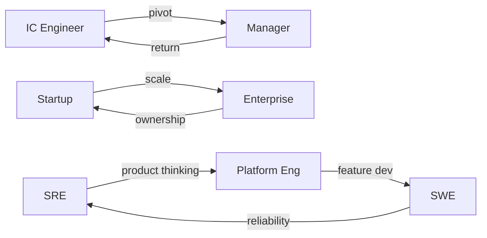

# Career Transitions — A 2-Day Crash Course

The five primary career shifts in engineering — IC→Manager, startup→enterprise, SRE→Platform→SWE, technical→people, and back again — and how to navigate each without resetting your career.

---

## Part 0 — Why

Careers aren't linear ladders. They're climbing walls.

On a ladder, you go up or you fall. One path, one direction, one definition of progress. That model worked when companies were stable, roles were rigid, and "senior engineer" at one company meant the same thing at the next. It doesn't work anymore.

On a climbing wall, you move up, sideways, diagonally — sometimes you drop a handhold to reach a better one higher and to the right. The climbers who look weak from the outside are often just repositioning. The ones who look stuck are building grip strength.

The best engineers you know — the ones who end up with disproportionate impact, comp, and optionality — didn't get there by staying in one lane for twenty years. They made deliberate lateral moves. SRE to Platform Engineering. IC to Manager and back. Startup to enterprise to startup again. Each move looked risky in the moment. In hindsight, each move was a compound investment.

This crash course is about how to make those moves deliberately, not reactively.

---

## Vocabulary

**Pivot** — A fundamental change in direction, often involving a new role type or domain. Not just a job change — a shift in how you create value. Example: backend engineer to engineering manager.

**Lateral Move** — A move that changes context (company, team, domain) without changing level or comp. Often undervalued. Often the highest-leverage move available.

**T-shaped** — Deep expertise in one area, broad familiarity across adjacent areas. The shape most valued at senior levels. Transitions are how you grow the horizontal bar.

**Adjacent Role** — A role close enough to your current one that 60–70% of your skills transfer directly. SRE to Platform Engineer is adjacent. SRE to product manager is not.

**Transferable Skills** — The subset of your abilities that carry across roles regardless of title or domain. Systems thinking, incident triage, technical communication, cross-functional collaboration. These are your anchor in any transition.

**Career Capital** — The accumulated credibility, relationships, and demonstrated skills you can spend on your next move. You build it in one role and invest it in the next. Don't make a move when your balance is low.

**Ramp-up Period** — The time between starting a new role and reaching full productivity. Typically 30–90 days for lateral moves, 90–180 days for pivots. Plan for it explicitly — your new team already has.

**Probation Mindset** — The mental posture of a new hire: curious, observant, slow to judge, fast to listen. Even if you're technically senior, adopting this mindset for the first 60 days in any new context dramatically shortens your ramp-up.

---

## Day 1 — The Identity Transitions

### IC → Manager

You've been promoted into management or you've asked for it. Either way, week one feels like someone handed you a new job description written in a language you only half-speak.

**What changes immediately:**

Your output is no longer visible. As an IC, you shipped code, wrote runbooks, resolved incidents. You could point to what you did. As a manager, your output is your team's output. The work that matters most — a difficult conversation that unblocked someone, a hiring decision that changed team dynamics, a roadmap negotiation that protected engineering time — is largely invisible. You will feel unproductive. You are not. You're just operating on a different time horizon.

Your relationship with the work changes. You'll still be in technical conversations, but you'll be there to ask questions and make decisions, not to write the code. If you keep writing the code, you're stealing growth from your reports and neglecting the actual job.

Your relationship with your peers changes. The engineers who were your equals are now your direct reports. This transition is awkward for everyone. Name it early. Have the conversation explicitly.

**The identity crisis:**

Around month two or three, many new managers hit a wall. The IC identity — "I'm the person who builds things" — is still how they think of themselves, but the role no longer supports it. The new identity — "I'm the person who builds the people who build things" — hasn't settled yet. This gap is normal. It's not a sign you made the wrong move.

The fix is not to claw back IC work. It's to find the craft in management. Structuring a difficult performance conversation well is a skill. Running a team meeting that actually produces decisions is a skill. Writing a promotion doc that changes someone's career is a skill. Treat management like you treated engineering: as a domain to get good at.

**The 6-month adjustment:**

- Months 1–2: Listen more than you talk. Don't change things yet. Understand the current state.
- Month 3: Start making small structural decisions. Build trust through follow-through on commitments.
- Months 4–5: Take on harder conversations. Start shaping team culture and process deliberately.
- Month 6: Evaluate honestly. Are you energized by the work? Are your reports growing? If both answers are yes, you're in the right place.

If at month six you still resent every 1:1 and fantasize about being back on the keyboard full-time, that's useful data. Not failure — data.

---

### Manager → IC (The Return)

Coming back to IC work is more common than anyone talks about. And it doesn't have to feel like a demotion.

The biggest risk is the story you tell yourself. If you frame it as "I failed at management" or "I couldn't handle it," you'll carry that narrative into every IC interaction. Your new teammates will sense it. Frame it instead as a deliberate move: you wanted to go deep again, you valued craft over coordination, you made a choice.

**What you bring back:**

You understand how decisions get made above your level. You know what a manager actually needs from their ICs — clear status, early escalation, ownership without constant prompting. You've sat in roadmap meetings and headcount discussions. That context makes you a better senior IC than you were before you left. You're not starting over. You're starting higher.

**What trips people up:**

The urge to manage people around you without the authority to do so. The instinct to run meetings, set agendas, make decisions by consensus. If you're an IC, let your manager manage. Your job is to build well and influence through technical credibility, not positional authority.

Give yourself a real ramp-up period. Don't pretend the context switch is instant.

---

### Startup → Enterprise

You've been moving fast for two or three years. You've worn five hats. You've shipped things that mattered with three people and a Slack channel. Now you're joining a company with ten thousand engineers, a change management process for changing the change management process, and a Jira board with 847 open tickets labeled "P2."

**Process shock:**

The first thing that hits is speed — or the absence of it. In a startup, you could push a change to production in an afternoon. At an enterprise, the same change has a ticket, a review, an approval chain, and a deployment window on the third Tuesday of the month. This will feel like dysfunction. Some of it is. Some of it is hard-won institutional knowledge about what happens when you move fast at scale.

Your job in the first 90 days is not to fix the process. It's to understand why it exists. Earn the right to change things by demonstrating that you understand the constraints first.

**Scope vs. speed:**

What the enterprise offers that a startup can't: scale. Your code will run on infrastructure that serves tens of millions of users. Your decisions affect systems with years of operational history. Your platform team has more engineers than your last startup had people total. Learning to navigate that complexity — how to ship within constraints, how to build consensus across ten stakeholders, how to think about reliability at scale — is genuinely valuable career capital.

The engineers who thrive in this transition are the ones who reframe from "I miss moving fast" to "I'm learning how to build things that last."

---

### Enterprise → Startup

The inverse transition has its own traps.

You're used to having a security team, a platform team, a DBA, a legal team, a dedicated oncall rotation. At a startup, you are all of those things simultaneously.

**Wearing all the hats:**

In the first month, you'll be asked to make decisions you're used to delegating — infrastructure cost, security posture, hiring criteria, API design. You won't have all the context you're used to having. You'll have to act on incomplete information, more often and with higher stakes.

This is terrifying and clarifying in equal measure. Many engineers discover they're more capable than the enterprise structure allowed them to demonstrate.

**No safety net:**

The enterprise's bureaucracy that frustrated you was also protecting you. Deployment windows prevented Friday afternoon catastrophes. Change review caught integration errors. The absence of those guardrails is freedom and risk simultaneously.

Establish your own disciplines early. Even if there's no process, you can have personal process: don't push on Fridays, write runbooks for anything you'd be paged for, document decisions as you make them. You're building the institutional knowledge from scratch. Act like it.

---

## Day 2 — The Technical Transitions

### SRE → Platform Engineering → SWE

These three roles exist on a spectrum, and movement along that spectrum is one of the most natural career transitions available to you.

**SRE → Platform Engineering:**

SRE is fundamentally about reliability and operational excellence. Platform Engineering is about building the systems that give developers leverage. The overlap is massive: both care deeply about observability, automation, developer experience, and the operational cost of software systems.

The shift is primarily in output type. As an SRE, your output is reliability — an application stays up, incidents are resolved faster, toil is reduced. As a Platform Engineer, your output is a product — a CI/CD pipeline, an internal developer platform, an observability stack — used by other engineers.

Start by treating your SRE work as product work. Who are your customers? What do they need? How do you measure whether you're serving them well? Build those mental models now. The transition will be gradual and natural.

**Platform Engineering → SWE:**

This move requires more deliberate work. Platform Engineering can insulate you from application development — you're building the road, not driving the car. If you want to move into SWE, you need to rebuild or strengthen skills in product thinking, feature development velocity, and working with product managers and designers.

The fastest path: spend time in your current platform role working closely with the application teams you serve. Understand their development loop intimately. Volunteer for cross-functional projects. When you make the move, you'll bring operational instincts that most SWEs don't have — that's your competitive advantage.

---

### DevOps → Cloud → AI

Technology waves create transition opportunities that didn't exist five years ago.

**Riding the wave:**

The pattern repeats: a new paradigm emerges (DevOps in 2012, cloud-native in 2016, AI/ML infra in 2022), demand far outpaces supply for the first three to five years, and the engineers who move early capture disproportionate compensation and career progress.

The entry cost for each wave is lower than it looks from the outside. Cloud was accessible to any engineer who could write code and understood networking. AI infrastructure today is accessible to any engineer who understands distributed systems and can work with Python. You don't need to reinvent yourself completely. You need to extend what you already know into the new domain.

**The sequence:**

Build depth in your current domain first. Then identify the adjacent skill set in the new wave. Then find a project — at your current company or a side project — that requires both. The intersection of your existing expertise and the new domain is where you're most differentiated. A former SRE building AI observability infrastructure brings something a pure ML engineer can't.

---

### Geography Transitions

**India → US/EU:**

The technical skills transfer completely. The context that doesn't transfer: communication norms, meeting culture, how decisions are made, how visibility and credit work.

In many US tech companies, visibility is not automatic — you have to create it. Speaking up in meetings, writing up your work in Slack or email, volunteering for cross-team projects. This isn't self-promotion for its own sake. It's how influence works in those environments.

Build a sponsor, not just a mentor. A mentor gives you advice. A sponsor advocates for you in rooms you're not in. You need both, but the sponsor matters more for advancement.

**Remote-First:**

The transition to remote-first work is its own adjustment. Written communication becomes load-bearing — every Slack message, every doc, every PR description represents you when you're not in the room. Invest in writing quality. Read your messages before sending them. The engineers who advance in remote-first environments are almost always the ones with the clearest written communication.

---

### The Pendulum Strategy

The highest-leverage career pattern most engineers don't name explicitly: alternate between building depth and building breadth.

Go deep for two to three years — become genuinely expert in a domain. Then make a lateral move that forces you to apply that depth in a new context, building breadth. Then go deep again in the new context. Repeat.

Each cycle increases the diameter of your expertise. After three cycles, you're T-shaped at a senior enough level that you're functionally irreplaceable in the intersection of those domains. You're not a generalist. You're a specialist with unusual contextual range.

The trap to avoid: lateral moves that don't add a genuinely new domain. Moving from "SRE at company A" to "SRE at company B" isn't a pendulum move — it's a job change. The pendulum requires genuine domain shift, not just company change.

---

### Timing Your Transitions

**When to move:**

- You've mastered 80% of the current role and the remaining 20% doesn't excite you.
- You've identified a clear skill gap that the current role can't close.
- You've built enough career capital in your current context to spend on something new.
- The new role has a legible path to impact within the first six months.

**When to stay:**

- You're in the middle of something important that will close in three to six months. Finish it. The exit will be cleaner and your career capital will be higher.
- You're running from something rather than toward something. Diagnose the problem first. A new role with the same unexamined pattern won't fix it.
- Your career capital is low — you're new, you haven't shipped anything significant, your relationships are shallow. Build first, then spend.

⚠️ The most common timing mistake is leaving too early — before you've extracted the full learning value from your current context. You don't have to love a role to learn from it.

---

### Networking for Transitions

Networking doesn't mean collecting LinkedIn connections. It means building relationships with people whose work you respect before you need anything from them.

The mechanism that actually works: be genuinely useful to people in the domain you want to move into. Write about your work publicly. Contribute to open source projects that relevant engineers use. Show up in the communities where your target domain lives. Your next transition will often come through someone who watched you do good work from a distance before you ever asked for anything.

Internal networking matters more than most people realize. The job posting is often the last resort. The first call is usually to someone who already knows your work. Make sure people know your work.

---

## Worked Example — An SRE's 5-Year Transition Plan

**Starting point:** L4 SRE at a mid-size tech company. Strong on incidents, oncall, and observability. Wants to reach Staff Platform Engineer in five years.

**Year 1 — Build depth, establish credibility:**

Focus on becoming the go-to person for the observability stack. Own the metrics pipeline end to end. Write a postmortem culture doc that gets adopted across teams. Start treating the observability platform as a product — instrument usage, gather customer feedback from app teams, prioritize improvements based on actual pain.

**Year 2 — Lateral move to Platform Engineering:**

Transfer internally to the Platform team with a clear mandate: build developer experience tooling. Bring the operational discipline and customer instinct from SRE. Pick up product skills — roadmapping, stakeholder management, writing engineering proposals. Level up to L5.

**Year 3 — Go wide, build cross-team influence:**

Volunteer to lead a cross-organizational project — a migration, a new platform capability, a reliability initiative that spans multiple teams. This is where you build the network and the reputation that Staff roles require. Publish an internal architecture doc that becomes a reference. Present at an internal tech talk.

**Year 4 — Find the staff-level problem:**

Staff engineers exist to solve problems that span multiple teams or require sustained technical judgment over months. Find that problem at your company — the one that nobody owns, that requires both systems thinking and people navigation. Own it. Staff roles are created or recognized around demonstrated staff-level impact, not tenure.

**Year 5 — Formalize:**

The promotion case is built on the work you did in years three and four. Your manager isn't writing your promotion doc from scratch — they're packaging evidence that already exists. If the staff case isn't clear by year five, it's a signal to either find a bigger problem to own or look externally where your accumulated experience levels you in at Staff.

---

## Pitfalls

**Moving reactively instead of deliberately.** The worst transitions happen when you're running from a bad manager or a toxic team. The urgency clouds your judgment. If you need to leave, make a short-term safe move first, then plan the real transition from a stable position.

**Underestimating the ramp-up period.** Every transition takes longer than you think. Plan for 90 days before you're fully productive. Don't commit to major deliverables in month one.

**Skipping the identity work.** IC to Manager is not just a job change — it's a self-concept change. Manager to IC is the same. If you don't explicitly work through what the new role means to your identity, you'll unconsciously sabotage the transition by acting like you're still in the old role.

**Optimizing only for comp.** A lateral move that builds rare skills often produces more lifetime earnings than a promotion that puts you in a role you're not growing in. Think in five-year comp, not this-year comp.

**Burning bridges.** Every transition exit is a future reference, a future collaborator, or a future hiring manager. Leave well. Give real notice. Document your work. Train your replacement. The world is smaller than it looks.

**Not negotiating the transition terms explicitly.** If you're making an internal move, negotiate the ramp-up period, the success criteria for the first six months, and whether your level and comp are being protected. Get it in writing. Informal agreements evaporate.

---

## Quick Reference

### Transition Decision Matrix

| Transition | Skill Overlap | Ramp-up | Risk | Primary Gain |
|---|---|---|---|---|
| IC → Manager | 40% | 90–180 days | Medium | Leadership capital |
| Manager → IC | 50% | 60–90 days | Low | Craft depth, credibility |
| Startup → Enterprise | 70% | 60–90 days | Low | Scale, process, stability |
| Enterprise → Startup | 65% | 60–90 days | Medium | Speed, ownership, breadth |
| SRE → Platform Eng | 80% | 30–60 days | Low | Product skills |
| Platform Eng → SWE | 55% | 60–90 days | Medium | Feature dev, product context |
| DevOps → Cloud | 75% | 30–60 days | Low | Scale, modern infra |
| Cloud → AI Infra | 65% | 60–90 days | Medium | High-demand domain |

---

### Ramp-up Timeline per Transition

**Days 1–30:**
Understand the org, the team's priorities, the existing systems. Don't propose changes. Ask questions. Take notes. Identify the one thing you can do in month two that will make your manager's life easier.

**Days 31–60:**
Ship something small. Build trust through follow-through. Identify the two or three people whose collaboration matters most for your success. Find the gap — the thing the team needs that nobody is owning.

**Days 61–90:**
Own something meaningful end to end. Have had one real conversation with your manager about your performance and trajectory. Know where the bodies are buried — the technical debt, the political landmines, the legacy decisions that everyone works around.

---

### Transferable Skills Map

| From | Skills That Transfer | Skills to Build |
|---|---|---|
| SRE | Systems thinking, incident triage, oncall discipline, observability | Product roadmapping, stakeholder communication |
| Manager | Org navigation, communication, prioritization, hiring | Technical depth recovery, individual output |
| Startup | Speed, breadth, ownership, scrappiness | Process discipline, stakeholder management at scale |
| Enterprise | Scale thinking, process design, stakeholder navigation | Tolerance for ambiguity, self-directed initiative |
| DevOps | Automation mindset, pipeline design, reliability | Cloud-native architecture, cost optimization |

---

## Top 10 Interview Questions

<strong>Q: How do you decide when it is the right time to transition from IC to management?</strong>

The decision should be pull-based, not push-based. Move when you genuinely want to multiply others rather than when it feels like the only path to advancement. Concrete signals: you find yourself naturally mentoring juniors, you care more about team outcomes than personal output, and you have a manager who will support you through the ramp-up. If your primary motivation is compensation or title, the transition will be painful — management requires finding satisfaction in invisible work.

<strong>Q: What transferable skills matter most when moving from SRE to Platform Engineering?</strong>

Systems thinking, incident triage discipline, and deep observability knowledge transfer almost directly. The critical new skill is product thinking — treating internal tools as products with customers, roadmaps, and success metrics. SREs who already gather feedback from app teams and measure toil reduction are halfway there. The gap is usually in stakeholder management and writing engineering proposals that influence multi-team investment decisions.

<strong>Q: How do you handle the identity crisis that comes with moving from a senior IC role into management?</strong>

Name it explicitly — most new managers try to ignore the discomfort. Around month two or three you will feel unproductive because your output is no longer visible code. The fix is to find craft in the new domain: treat 1:1s, performance conversations, and roadmap negotiations as skills to develop, not administrative overhead. Set a six-month checkpoint — if you still resent the work, returning to IC is data, not failure.

<strong>Q: What is the biggest risk when transitioning from a startup to an enterprise?</strong>

Process shock — the pace feels unbearably slow compared to pushing code to production in an afternoon. The mitigation is spending your first 90 days understanding why the process exists before proposing changes. Much of what looks like bureaucracy is hard-won institutional knowledge about what breaks at scale. Earn credibility by demonstrating you understand constraints first, then advocate for change from a position of trust rather than frustration.

<strong>Q: How do you build career capital in a new role after a lateral transition?</strong>

Follow the 30-60-90 day framework. In the first 30 days, listen and map the landscape. By day 60, ship something small and build trust through follow-through. By day 90, own something meaningful end-to-end. Career capital in a new context comes from demonstrated reliability and the relationships you build with key collaborators, not from immediately proposing large changes.

<strong>Q: What does the pendulum strategy look like in practice for a mid-career engineer?</strong>

Alternate between building depth and breadth in two-to-three-year cycles. Go deep in SRE for three years, then move laterally into Platform Engineering where you apply that depth in a new product-oriented context. Each cycle widens your expertise diameter. After three cycles you are a specialist with unusual contextual range. The trap is lateral moves that do not add a genuinely new domain — moving between the same role at different companies is a job change, not a pendulum move.

<strong>Q: How should a manager returning to an IC role handle the perception of demotion?</strong>

Frame it as a deliberate choice, not a retreat. You bring context most ICs lack — you understand how decisions are made above your level, what managers actually need, and how roadmap meetings work. Resist the urge to manage without authority and influence through technical credibility instead. Give yourself a real 60-90 day ramp-up and avoid committing to heroic deliverables in month one.

<strong>Q: How do you evaluate whether a technology wave like AI infrastructure is worth transitioning into?</strong>

Look for the intersection of your existing expertise and the new domain — that is where you are most differentiated. A former SRE building AI observability brings something a pure ML engineer cannot. Assess whether the entry cost is adjacent to your current skills and time it so demand still outpaces supply, typically the first three to five years of a wave. Avoid reinventing yourself completely; extend what you know.

<strong>Q: What are the signs that you should stay in your current role instead of making a transition?</strong>

Stay when you are in the middle of something important that will close in three to six months — finishing it cleanly increases your career capital. Stay when you are running from something rather than toward something, because a new role with the same unexamined pattern will not fix the underlying issue. Stay when your career capital is low — you are new, have not shipped anything significant, or your relationships are shallow.

<strong>Q: How do you build a sponsor relationship to support a career transition?</strong>

You cannot directly ask someone to sponsor you — sponsorship is earned through demonstrated competence and trust over time. Work on projects where senior engineers and managers can directly observe your impact. Make your work visible through design docs, presentations, and cross-team collaboration. Internal networking matters more than most people realize; the first call for a new opportunity usually goes to someone who already knows your work.

---

## Next Steps

Once you're grounded in transitions, these build on this material:

- `Engineering-Career-Path.md` — The full IC track from L3 to Distinguished Engineer, with milestone definitions and promotion criteria.
- `Engineering-Leadership.md` — The manager track in depth: 1:1s, performance conversations, roadmap ownership, managing up.
- `Mentorship.md` — How to find mentors and sponsors, how to be a good mentee, how to start mentoring others.

---

## Recommended learning resources

**YouTube channels & playlists:**
- [Rahul Pandey and Taro — Career Transitions](https://www.youtube.com/@RahulPandeyrkp) — switching companies, changing roles, and evaluating offers beyond total compensation
- [Tiff in Tech — Career Changes in Tech](https://www.youtube.com/@TiffInTech) — practical guidance on pivoting between roles, industries, and company sizes
- [LeadDev — Career Growth Talks](https://www.youtube.com/results?search_query=leaddev+career+transition+engineering) — talks on moving from IC to manager, manager back to IC, and cross-functional transitions
- [Healthy Software Developer — Sustainable Careers](https://www.youtube.com/@HealthyDev) — making career changes without burning out, building transferable skills, and long-term planning
- [ThePrimeagen — Career Decisions](https://www.youtube.com/@ThePrimeagen) — honest perspectives on when to stay, when to leave, and how to evaluate career opportunities

**Official docs & blogs:**
- [staffeng.com (Will Larson)](https://staffeng.com/) — career archetypes and how lateral moves build the range that vertical moves cannot
- [pragmaticengineer.com (Gergely Orosz)](https://blog.pragmaticengineer.com/) — data-driven insights on job market trends, company tiers, and career decision frameworks

---

## The Mantra

> Move deliberately. Build capital before you spend it. Every lateral move that compounds your range is more valuable than a vertical move that narrows it. The goal isn't to climb the ladder — it's to become the kind of engineer the ladder was built to recognize.
