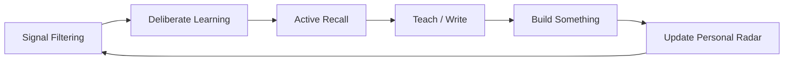

# Continuous Learning — A 2-Day Crash Course

> **In one sentence:** Learning science applied to engineering careers — how to stay relevant in a
> volatile tech landscape without burning out or chasing every new framework.

> Companion files: `Engineering-Career-Path.md` (where learning fits in the broader arc),
> `Mentorship.md` (learning from others), `Career-Transitions.md` (when learning enables a shift).

---

## Part 0 — Why this matters

Technology changes faster than any career. The engineers who thrive aren't the ones who know the
most — they're the ones who learn the fastest.

The half-life of any specific technical skill is shrinking. A Kubernetes certification from three
years ago covers deprecated APIs. A machine learning specialization from 2021 predates the shift
that LLMs caused. The knowledge you have right now has an expiration date — the question is how
quickly you can replace it when it does.

The engineers who burn out are caught in the wrong loop: reading every new blog post, spinning up
every new tool, feeling permanently behind. This is a prioritization problem compounded by
anxiety, not a learning problem.

The engineers who stagnate stopped learning deliberately. They pick up just enough to finish the
current ticket and never build the broader mental models that make new things click faster. They
mistake familiarity with competence.

Both failure modes are fixable with a system. This crash course gives you that system — grounded
in learning science, not career-guru intuition.



---

## Part 1 — The vocabulary

| Term | Meaning |
|------|---------|
| **Deliberate Practice** | Structured practice at the edge of your current ability, with immediate feedback — not just repetition of what you already know |
| **Spaced Repetition** | Reviewing information at increasing intervals — exploits the spacing effect to make memories durable with minimal review time |
| **T-Shaped Skills** | Deep expertise in one area (the vertical bar) combined with broad awareness across adjacent domains (the horizontal bar) |
| **Learning in Public** | The practice of sharing your learning process openly — blog posts, talks, GitHub — teaching forces understanding deeper than passive reading |
| **Second Brain** | A personal knowledge management system external to your head — notes, links, summaries organized so you can retrieve and connect ideas |
| **Feynman Technique** | Explain a concept in plain language as if teaching a beginner; gaps in your explanation reveal gaps in your understanding |
| **70/20/10 Rule** | A model of how professionals actually learn: 70% from on-the-job experience, 20% from peers and mentors, 10% from formal study |
| **Signal vs Noise** | In a landscape of infinite things to learn, signal is what will matter for your goals; noise is everything else — distinguishing them is a skill |

---

## DAY 1 — How learning works and what to learn

### How memory works

Your brain does not store information like a hard drive. It stores patterns of activation — each
time you retrieve a memory, you reconstruct it. This has a counterintuitive implication: the act
of retrieval strengthens the memory more than the act of studying it.

The practical upshot is that most engineers study wrong. They read documentation, follow
tutorials, maybe take notes — and then feel like they understood it. But passive reading builds
fragile knowledge. You recognized the content when you saw it; that is not the same as being able
to produce it when you need it.

**Active recall** — forcing yourself to retrieve information without looking at it — produces
durable learning. Flashcard tools like Anki use this. So does the Feynman Technique. So does
explaining something to a colleague. The discomfort you feel when trying to recall something you
half-know is the feeling of learning actually happening. Lean into it.

**Spaced repetition** multiplies active recall. Reviewing something once the day after you learn
it, again three days later, again a week later, is dramatically more efficient than reviewing it
three times the same evening. The spacing effect is one of the most replicated findings in
cognitive psychology. Use it deliberately.

**Interleaving** — mixing topics rather than blocking them — feels harder but produces better
retention. Alternating between two subjects forces your brain to discriminate between them, which
builds more durable understanding than finishing one completely before touching the other.

### The Feynman Technique in practice

1. Pick a concept you just encountered — say, eBPF's kernel attachment model.
2. Write an explanation of it as if you are teaching a smart but non-specialist colleague.
3. Identify every place where you wrote something vague, hand-wavy, or that you would not be able
   to defend if questioned.
4. Go back to the source material to fill those gaps.
5. Revise your explanation until it is tight and you can defend every sentence.

The technique works because fluency feels like understanding. You can read a technical explanation
and feel like you got it — until someone asks you a question and you realize you were just
recognizing familiar words, not building mental models.

### Signal vs noise — identifying what to learn

The hardest problem in continuous learning is not how to learn. It is what to learn. The landscape
is infinite. Your time is not.

Signal is the set of skills and concepts that will compound in value over your career horizon.
Noise is the set of things that sound important right now but won't move the needle.

Some heuristics that help:

**Half-life filtering.** Before investing deeply in a technology, ask: what is the half-life of
this skill? Linux internals have a long half-life. Kubernetes operator patterns have a medium
half-life. The specific CLI flags of a vendor's proprietary tool have a short one. Prioritize
long-half-life skills. They compound. Short-half-life skills are fine to learn shallowly.

**Fundamentals pay forever.** Networking, distributed systems, operating systems, observability
principles, security mental models — these underlie every specific technology. An engineer who
understands how a socket works will pick up any new networking tool faster than one who only
learned Nginx by following tutorials. Investment in fundamentals has the highest ROI of anything
you will ever study.

**The technology radar.** ThoughtWorks publishes a Technology Radar twice a year that categorizes
tools into Adopt, Trial, Assess, and Hold. It is a useful external signal for where the industry
is moving. CNCF's landscape and annual surveys are another. These are not instructions — they are
evidence. Use them alongside your own judgment about what your team and market actually need.

**Job posting mining.** Read ten job postings for the role you want to hold in two years. Note
which technologies appear in eight of the ten. Those are signal. The ones that appear in one are
noise. Do this quarterly — the pattern shifts.

**Ask people one level ahead of you.** Senior engineers have already filtered noise from signal.
They know which tools they wish they had learned earlier and which ones they regret spending time
on. This is the 20% of the 70/20/10 model in action.

### The 70/20/10 model

The numbers are not precise laws — they are a reminder that formal learning is a small fraction
of how real capability develops.

**70% — on-the-job experience.** You learn most by doing work at the edge of your current
ability: the incident that stretches you, the code you are afraid to read, the runbook you write
for the system you only half-understand.

**20% — learning from others.** Code reviews, pairing, mentorship, postmortems. Every
conversation with someone more experienced is a compressed transfer of pattern recognition. If
you are the smartest person in every room at work, you are in the wrong rooms.

**10% — formal learning.** Courses, certifications, books. Valuable — but often overweighted.
Use them to build mental models and vocabulary; use the 70% to verify them against reality.

### Building a learning system

A system is a set of habits and structures that produce learning without requiring constant
willpower. Willpower is a depleting resource. Systems are not.

**Time-box it.** Decide how many hours per week you will spend on deliberate learning. Be
conservative — two hours per week maintained for a year beats ten hours for two months followed
by burnout. Put it on your calendar like a meeting with someone you cannot cancel.

**A learning queue.** Maintain a prioritized list of things you want to learn. When something new
catches your attention, it goes on the queue — not immediately into your schedule. Review the
queue weekly. Most things will lose urgency on their own. The ones that stay matter.

**Active note-taking.** When you read or watch something, write a summary in your own words
immediately after. Do not copy. Paraphrase. If you cannot paraphrase, you did not understand it.

**Retrieval practice.** At the end of each week, close your notes and write down the three most
important things you learned. Then check. The gap between what you thought you retained and what
you actually wrote is data about where learning is still shallow.

---

## DAY 2 — Learning in public, building depth, and staying sane

### Learning in public

The most effective learning habit most engineers avoid is sharing what they are learning.

Writing a blog post about a technology forces a level of precision that reading never does. You
have to commit to specific claims. You have to handle the edge cases. You have to structure your
understanding well enough that a reader can follow it. Every time you do this, you find the gaps
in your own model.

Giving a talk — even a five-minute lightning talk at a team meeting — amplifies the effect.
Questions from the audience surface blind spots you did not know you had. Contributing to open
source documentation forces you to understand a system well enough to explain it to strangers.

None of this requires a large audience. You are not building a brand — you are using explanation
as a learning tool. A blog with three readers still gives you the full cognitive benefit of
teaching, and occasionally connects you with people thinking about the same problems.

⚠️ One trap: learning in public can become performance rather than practice. If you are writing
posts to look smart rather than to understand, the benefit collapses. The test: are you writing
about things you are still figuring out, or only things you have already mastered? Write about
the former.

### Building a second brain

Your working memory holds roughly four chunks at once. Your long-term memory is vast but
unreliable without structure. A second brain bridges the two — organized well enough that you can
find things you once knew. The goal is not to capture everything; it is to capture what you will
want to recall and connect. Good second-brain hygiene means:

- Write notes in your own words, not as pastes from documentation.
- Tag and link notes to related concepts — knowledge is a graph, not a list.
- Review and prune quarterly — stale notes that you never retrieve are noise.
- Prefer synthesis over collection. One good note connecting three ideas is more valuable than
  thirty bookmarks you will never open.

Popular tools: Obsidian (local Markdown, highly flexible), Notion (collaborative, good for teams),
plain Git-backed Markdown files (portable, no vendor lock-in). The tool matters less than the
habit of actually writing in it.

### Staying relevant without chasing hype

The technology hype cycle is real and predictable. Every two years, a new category peaks the
curve — containers, microservices, serverless, AI agents, platform engineering. The engineers who
chase each peak spend enormous energy learning things at their most immature and least stable.
The ones who wait for the trough of disillusionment and pick up the technologies that survive are
learning things that will matter for a decade.

This does not mean ignoring new things. It means calibrating your investment to the stage of
maturity:

- **Emerging:** Read one good overview article. Put it in your second brain. Check back in six
  months.
- **Adopted by early majority:** Do a hands-on project. Understand the core concepts. Invest
  two to four weeks.
- **Commoditized (everyone uses it):** Get proficient. This is your T-shape deepening.

The Kubernetes ecosystem is a good example. Many engineers are still learning tools that were
deprecated in 2022 because they chased the bleeding edge too early. Meanwhile, the engineers who
waited until the ecosystem stabilized around Helm, Argo, and the CNCF graduated projects are now
working with durable knowledge.

### Deep work and focus management

Learning requires sustained attention. Most engineering environments are hostile to sustained
attention. Slack, stand-ups, pull request reviews, on-call alerts — the default is to be
continuously partially attending to everything.

Deep work — Cal Newport's term for cognitively demanding tasks requiring full concentration — is
when real learning happens. Shallow work maintains what you know. Deep work builds new capability.

Some practical mechanics:

**Protect morning hours.** Cognitive capacity is highest before interruptions accumulate. Block
the first hour or ninety minutes for learning or difficult technical work before opening Slack.

**Single-task.** When studying, close everything else. Browser tabs, notifications, email. Set a
timer for twenty-five to fifty minutes. Work without context-switching. The Pomodoro technique is
a reasonable scaffold if you struggle with this.

**Batch communication.** Check Slack twice a day rather than reactively. This is a cultural
negotiation at most companies — worth having explicitly.

**Track cognitive load, not hours.** Two hours of genuine deep focus produces more learning than
six hours of interrupted shallow reading. Quality over quantity.

### Learning communities

You do not learn alone. Communities of practitioners — online and in-person — provide:

- Exposure to problems you have not encountered yet
- Fast feedback on your mental models
- Signal about what matters in the industry
- Mentors you would not otherwise find

Useful formats: local meetups (cloud native, SRE, DevOps), conference talks on YouTube
(KubeCon, SRECon, GOTO), Discord and Slack communities (Kubernetes, CNCF, platform engineering),
study groups with colleagues, reading groups around specific books.

⚠️ Consumption without application is not learning. Every community should push you to produce
something — an answer to a question, a demo, a talk proposal. If you are only lurking, you are
getting signal value but not the compounding return of active participation.

### Breadth vs depth — the compounding argument

Early in your career, breadth wins — you need enough vocabulary and surface area to recognize
patterns and have informed conversations. Past the five-year mark, depth compounds. The engineer
who deeply understands distributed consensus and observability builds intuition that cannot be
shortcut. Each new system clicks faster because the mental model is rich.

The mistake is chasing breadth indefinitely. Adding a tenth tool to your resume has diminishing
returns. Another thousand hours on distributed systems adds non-linear returns — because depth
compounds and breadth does not.

Identify one or two domains where you want to be genuinely world-class. Invest there
disproportionately. Stay broad enough to collaborate — but do not mistake exposure for mastery.

### Creating a personal technology radar

ThoughtWorks' radar is a useful model to apply to your own career. Categorize the technologies
and skills in your domain into four rings:

- **Adopt:** You use this confidently. You are deepening expertise here.
- **Trial:** You are actively experimenting. You have a small project in this area.
- **Assess:** You are reading about it. You understand the use case. You are watching to see if
  it matures.
- **Hold:** You are not investing further. Either it is declining, or you deprioritized it.

Review your personal radar quarterly. Move things between rings as the landscape shifts. This
makes your learning investments explicit and prevents the default drift toward learning whatever
is newest rather than whatever matters most.

---

## Worked example — A 6-month learning plan for an SRE moving into platform engineering

**Situation:** You are a mid-level SRE with three years of experience — strong on incident
response, solid on Kubernetes operations, competent with Prometheus and Grafana. You want to move
into platform engineering — building internal developer platforms, not just operating them.

**Gap analysis:**
- Developer experience principles: low
- Internal developer platform (IDP) architecture: low
- Backstage: zero
- GitOps and supply chain security: medium
- API design and service catalog patterns: low
- Leadership and product thinking for platform teams: low

**Month 1 — Foundation and orientation**
- Read "Team Topologies" (cognitive load, platform as product)
- Assess: CNCF Platform Engineering whitepaper
- Hands-on: Stand up a local Backstage instance. Get a service registered. Understand the plugin
  model.
- Learning in public: Write a short internal wiki post explaining what platform engineering is and
  how it differs from SRE. The act of writing will expose your gaps.

**Month 2 — GitOps and supply chain depth**
- Trial: Implement a GitOps pipeline with Argo CD for a side project
- 70%: Volunteer to audit your team's CI/CD pipelines from a platform lens. Document developer
  friction points.
- Study group: Find one colleague on the same path. Meet biweekly to compare notes.

**Month 3 — Developer experience and product thinking**
- Read: "Accelerate" — understand DORA metrics as a platform health signal
- Hands-on: Run five informal interviews with developers at your company. What slows them down?
  This is product research, not operations.
- Second brain: Seed a notes structure for platform engineering from months 1 and 2.

**Month 4 — Build something real**
- Project: Build an internal tool that solves one friction point from month 3. It needs to work
  and be used by at least one other engineer — not be polished.
- Learning in public: Present it at a team demo. Write a short retrospective.

**Month 5 — Community and signal**
- Attend a local platform engineering or CNCF meetup
- Watch KubeCon platform engineering tracks (free on YouTube)
- Contribute a documentation fix to an open source project in the platform space
- Feynman check: Explain internal developer platform vs DevOps toolchain to a skeptical VP
  without jargon.

**Month 6 — Consolidation and radar update**
- Update your personal technology radar
- Revise your resume — concrete projects, not technology lists
- Identify the next six-month horizon: what moves from Assess to Trial?
- Write a retrospective: what worked in your learning system, what did not

**Expected outcome:** Not an expert — but enough depth and vocabulary to interview for junior
platform engineering roles and take on platform-adjacent work within your current team. The depth
compounds from here.

---

## Pitfalls

**Tutorial purgatory.** Following ten tutorials is not the same as building one thing. Tutorials
scaffold recognition. Building from scratch surfaces understanding. At some point you have to
close the tutorial and work from the documentation alone.

**Certification theater.** Certifications have real value for demonstrating baseline competence
and passing HR filters. They have no value as a substitute for actual depth. A K8s cert plus zero
production Kubernetes is a resume line, not an asset. Get the cert if you need it; do not confuse
it with the skill.

**Learning instead of doing.** Some engineers use learning as a form of productive procrastination.
They feel busy, they are acquiring knowledge, but they are avoiding the harder work of applying
it under real constraints. If you have been "learning" something for three months without shipping
anything, you are probably in this trap.

**Comparing your internals to others' externals.** When a colleague publishes a polished blog post
or gives a confident talk, you are seeing the output — not the months of confusion that preceded
it. Learning is messy. The polished output is not evidence that they found it easy.

**Chasing the hype cycle.** Investing at peak hype means learning something at its least stable.
Wait for the trough. The exception: if your company is betting on it, learn it anyway.

**No system, just intent.** "I want to learn more" without a calendar block, a queue, and a
review habit produces nothing. Intent is not a system. Systems run without willpower.

---

## Quick reference

### Learning plan template

```
Goal: [What specific capability do I want to have in 6 months?]
Gap: [What do I not know that I need to know?]

Month 1: Foundation — [book/course + one hands-on project]
Month 2: Apply     — [trial project + 70% volunteer work]
Month 3: Teach     — [explain it to someone, write it up]
Month 4: Build     — [real thing used by real people]
Month 5: Community — [meetup / open source / conference content]
Month 6: Consolidate — [radar update, resume revision, next horizon]

Weekly habit:
- [ ] X hours blocked for learning
- [ ] Learning queue reviewed
- [ ] End-of-week retrieval practice
```

### Personal technology radar template

```
ADOPT (using confidently, deepening):
- [skill/tool] — [why it matters to your current goals]

TRIAL (active experiment underway):
- [skill/tool] — [what you are building / testing]

ASSESS (watching, not yet investing):
- [skill/tool] — [what would trigger moving to Trial?]

HOLD (deprioritized):
- [skill/tool] — [why deprioritized / when to revisit]
```

### Resource list

**Learning science**
- "Make It Stick" — Brown, Roediger, McDaniel — active recall and spaced repetition, the research
- "Deep Work" — Cal Newport — protecting attention for high-value cognitive work
- Anki — spaced repetition flashcard tool, free, cross-platform

**Signal sources**
- ThoughtWorks Technology Radar — thoughtworks.com/radar
- CNCF Annual Survey — cncf.io/reports
- The Pragmatic Engineer (Gergely Orosz) — strong signal-to-noise on engineering careers

**Learning in public**
- "Learn in Public" — swyx.io/learn-in-public — the original essay, worth reading
- Your company's internal wiki — the audience is real and the problems are ones you care about

**Platform and career**
- "Team Topologies" — Skelton, Pais — platform as product, cognitive load
- "Accelerate" — Forsgren, Humble, Kim — evidence-based engineering performance
- "The Pragmatic Programmer" — Hunt, Thomas — foundational; still relevant after 25 years

---

## Top 10 Interview Questions

<details>
<summary><strong>Q: How do you decide what to learn next when the technology landscape is constantly changing?</strong></summary>

Use half-life filtering: prioritize skills with long half-lives like distributed systems, networking, and observability principles over vendor-specific CLI flags. Mine job postings for the role you want in two years, consult ThoughtWorks Technology Radar and CNCF surveys, and ask engineers one level ahead of you what they wish they had learned earlier. Maintain a personal technology radar with Adopt/Trial/Assess/Hold rings and review it quarterly.

</details>

<details>
<summary><strong>Q: What is the difference between active recall and passive reading, and why does it matter for engineers?</strong></summary>

Passive reading builds fragile recognition — you feel like you understood it, but you cannot reproduce it under pressure. Active recall forces retrieval without looking at the source, which strengthens the neural pathways that make knowledge durable. In practice this means closing the documentation and trying to explain the concept, using spaced repetition tools like Anki, or applying the Feynman Technique. The discomfort of retrieval is the feeling of learning actually working.

</details>

<details>
<summary><strong>Q: How do you balance depth versus breadth in your technical skill development?</strong></summary>

Early in your career, breadth wins because you need vocabulary and surface area to recognize patterns. Past the five-year mark, depth compounds non-linearly — deep understanding of distributed systems or observability lets you pick up new tools faster because the mental model is rich. Identify one or two domains to invest in disproportionately while staying broad enough to collaborate. Adding a tenth tool to your resume has diminishing returns; another thousand hours on fundamentals does not.

</details>

<details>
<summary><strong>Q: How do you maintain a learning habit without burning out?</strong></summary>

Build a system, not a goal. Time-box two hours per week on your calendar and protect it like a meeting. Maintain a learning queue so new interests go on the list rather than immediately into your schedule — most will lose urgency on their own. Use retrieval practice at week's end to check what stuck. Two hours per week maintained for a year beats ten hours for two months followed by burnout. Track cognitive load, not hours.

</details>

<details>
<summary><strong>Q: What is the 70/20/10 model and how do you apply it to engineering growth?</strong></summary>

Seventy percent of capability develops from on-the-job experience at the edge of your ability — the incident that stretches you, the unfamiliar codebase. Twenty percent comes from learning from others through code reviews, pairing, mentorship, and postmortems. Ten percent comes from formal study like courses and certifications. Most engineers overweight the 10% and underweight the 70%. Use formal learning to build mental models and vocabulary, then verify them against real work.

</details>

<details>
<summary><strong>Q: How do you evaluate whether a new technology is worth investing time in versus hype?</strong></summary>

Calibrate investment to the maturity stage. For emerging technologies, read one good overview and check back in six months. For technologies adopted by the early majority, do a hands-on project over two to four weeks. For commoditized tools everyone uses, get proficient. Engineers who chase peak hype spend enormous energy learning things at their most immature. Those who wait for the trough and pick up survivors learn things that last a decade.

</details>

<details>
<summary><strong>Q: What does learning in public mean and how does it accelerate growth?</strong></summary>

Writing a blog post or giving a talk forces precision that reading never does — you must commit to specific claims and handle edge cases. Every time you explain something, you find gaps in your own model. This works even with a tiny audience because the cognitive benefit comes from the act of teaching, not the reach. The trap is performance over practice — write about things you are still figuring out, not only things you have mastered.

</details>

<details>
<summary><strong>Q: How do you build and maintain a second brain for technical knowledge?</strong></summary>

Write notes in your own words — never paste from documentation. Tag and link notes to related concepts because knowledge is a graph, not a list. Review and prune quarterly since stale notes that you never retrieve are noise. Prefer synthesis over collection: one note connecting three ideas beats thirty bookmarks you will never open. The tool matters less than the habit — Obsidian, Notion, or plain Git-backed Markdown all work.

</details>

<details>
<summary><strong>Q: How do you avoid tutorial purgatory and actually build real competence?</strong></summary>

Tutorials scaffold recognition but not production capability. At some point you must close the tutorial and work from documentation alone. The test: can you build something without step-by-step instructions? If you have been learning something for three months without shipping anything real, you are using learning as productive procrastination. Build something that at least one other person uses — it does not need to be polished, just functional.

</details>

<details>
<summary><strong>Q: How should an engineering team structure its collective learning investment?</strong></summary>

Create a team learning queue alongside the work backlog. Allocate roughly 10% of sprint capacity to deliberate learning — study groups, internal tech talks, documentation contributions, or conference talk reviews. Rotate who presents learnings so the 20% peer-learning channel stays active. Use the personal technology radar format at a team level to make collective skill investments visible and prevent everyone from chasing the same hype cycle independently.

</details>

---


## Quick Quiz

Test your understanding with these rapid-fire questions (answers hidden):

<details>
<summary>1. What is the ONE core problem that Continuous Learning solves?</summary>
Re-read Part 0 — the mental model section. If you can explain the "why" in one sentence, you understand the foundation.
</details>

<details>
<summary>2. Name the 3 most important terms from the vocabulary section.</summary>
Review Part 1. These are the building blocks every conversation about Continuous Learning uses.
</details>

<details>
<summary>3. What is the first thing you would set up on Day 1?</summary>
Check the Day 1 section — the very first hands-on step that gets you a working result.
</details>

<details>
<summary>4. What is the most common production pitfall with Continuous Learning?</summary>
Review the Common Pitfalls section. The first item listed is typically the most frequently encountered.
</details>

<details>
<summary>5. How does Continuous Learning compare to its closest alternative?</summary>
Check the Comparison Matrix below — focus on the key differentiating row.
</details>


## Comparison Matrix

| Dimension | Structured Learning | Project-Based | Community-Based |
|-----------|---------------------|---------------|-----------------|
| **Primary use case** | Core strength of Structured Learning | Core strength of Project-Based | Core strength of Community-Based |
| **Learning curve** | Moderate | Varies | Varies |
| **Community/ecosystem** | Active | Active | Growing |
| **Operational complexity** | Medium | Varies | Varies |
| **Best for** | See Part 0 | Different tradeoffs | Different tradeoffs |

> **How to read this matrix:** no tool wins on every dimension. Pick based on your specific constraints — team expertise, existing infrastructure, scale requirements, and compliance needs. The right choice is the one that fits your context, not the one with the most checkmarks.

## Next steps

Once you have a working learning system, the adjacent files worth reading:

- `Engineering-Career-Path.md` — where learning investments map onto career levels and transitions
- `Mentorship.md` — how to get more from the 20%, and how to give it back
- `Career-Transitions.md` — when accumulated learning enables a deliberate role change

---

## Recommended learning resources

**YouTube channels & playlists:**
- [Fireship — Tech Trends and Learning](https://www.youtube.com/@Fireship) — fast, dense introductions to new technologies that help you decide what to learn next
- [ThePrimeagen — Learning and Growth](https://www.youtube.com/@ThePrimeagen) — honest takes on learning strategies, deep vs broad knowledge, and staying current
- [Tiff in Tech — Continuous Learning](https://www.youtube.com/@TiffInTech) — learning habits, course reviews, and building a personal development system
- [Rahul Pandey and Taro — Skill Building](https://www.youtube.com/@RahulPandeyrkp) — deliberate practice, T-shaped skill development, and compounding learning investments
- [Healthy Software Developer — Sustainable Learning](https://www.youtube.com/@HealthyDev) — avoiding tutorial overload, building real projects, and learning without burnout

**Official docs & blogs:**
- [pragmaticengineer.com (Gergely Orosz)](https://blog.pragmaticengineer.com/) — what skills compound over a career, and how top engineers invest their learning time
- [staffeng.com (Will Larson)](https://staffeng.com/) — how staff-plus engineers balance depth and breadth in their continuous learning

---

## The mantra

> Know less. Understand more. Teach it. Build it. Repeat.

The engineers who stay relevant do not know everything. They have built a system that keeps their
knowledge current without burning out — one that compounds depth over time while maintaining
enough breadth to navigate a changing landscape. That system is learnable. You are reading part
of it now.
