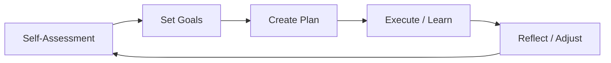

# Mentorship — A 2-Day Crash Course

Mentorship accelerates careers by decades — finding the right mentors, being a good mentee, and eventually becoming the mentor others seek out is one of the highest-leverage investments you can make.

---

## Part 0 — Why Mentorship Matters

The fastest learners don't just read docs — they learn from people who've already made the mistakes.

You can read every book on engineering leadership, system design, and career growth. You still won't know which decisions actually derail careers, how to handle a bad manager, or what "senior engineer behavior" really looks like in practice — until someone who has lived it tells you directly.

Mentors compress time. A 30-minute conversation with the right person can save you six months of trial and error. That's not an exaggeration. The patterns you'd discover after two years of painful feedback cycles, a mentor surfaces in a single conversation.

This is not networking. It's not schmoozing. It's a deliberate practice of finding people who are further along the path you're walking, learning how they think, and applying it — then doing the same for others.

---

## Vocabulary

**Mentor** — someone with more experience in a domain who guides your development over time. The relationship is usually ongoing, not transactional.

**Mentee** — you, when you're the one being guided. The mentee owns the relationship. The burden of scheduling, preparing, and following through falls on you, not the mentor.

**Sponsor** — different from a mentor. A sponsor doesn't just advise you — they advocate for you when you're not in the room. They say your name in meetings where opportunities are decided. Mentors give you wisdom; sponsors give you access.

**Reverse Mentoring** — a junior person teaches a senior. A 25-year-old can mentor a VP on how younger engineers experience the product, how remote culture actually feels, or how to navigate modern tooling. It goes both ways.

**Peer Mentoring** — learning from equals. Your colleagues at the same level are a massively underused resource. Someone working on a different team with a different stack can show you blind spots you didn't know you had.

**Mentorship vs Coaching** — coaching is usually structured, time-boxed, and performance-focused (think: a coach hired to help you get promoted). Mentorship is more organic, longer-term, and relationship-based. A coach helps you execute; a mentor helps you think.

**Advisory Relationship** — a more formal version of mentorship, common in startup contexts. An advisor might take a small equity stake in exchange for strategic guidance. The relationship is explicit and documented.

**Accountability Partner** — a peer who holds you to your own commitments. Not quite a mentor, not quite a coach. You exchange goals, check in regularly, and call each other out when you slip.

---




## DAY 1 — Finding Mentors and Being a Good Mentee

### Where to Look

You don't need to find a famous person. You need to find someone two to five years ahead of you on the path you want to walk — someone who still remembers what it felt like to be where you are.

**Inside your company:**
- Senior engineers and staff engineers on adjacent teams
- Engineering managers you've seen handle hard situations well
- Principal engineers who show up in architecture discussions

**Outside your company:**
- Open-source maintainers of projects you use
- Speakers at conferences and meetups you attend
- Authors of blog posts or newsletters you already read
- People who responded thoughtfully to a question you asked in a public forum

**Online communities:**
- Slack workspaces for your tech stack — many have explicit mentorship channels
- Dev.to, Hashnode, and Substack comment sections
- LinkedIn — not for cold pitching, but for people who write things that resonate with you

### How to Ask

The biggest mistake is asking someone to "be your mentor." That's vague, it's a large commitment, and it puts them in an awkward position if they want to say no.

Instead, ask for something small and specific.

**The cold outreach template:**

```
Subject: Quick question about [specific topic]

Hi [Name],

I've been following your work on [specific thing — post, project, talk].
[One sentence on why it resonated or what you learned from it.]

I'm a [role] at [company], currently working on [brief context].
I'm trying to figure out [specific problem or decision], and your
experience with [related thing] seems directly relevant.

Would you be open to a 20-minute call sometime in the next few weeks?
I'll come prepared with specific questions and won't take more time
than that.

[Your name]
```

That's it. Short. Specific. Easy to say yes to. You've shown you did your homework, you've named a concrete problem, and you've respected their time by capping the ask.

If they say yes — prepare. If they don't respond — follow up once after two weeks, then let it go. Don't take it personally. Senior people are drowning in messages.

### Being a Good Mentee

The mentee owns the relationship. Repeat that until it's instinct.

**Before each session:**
- Review what you discussed last time
- Note what you said you'd do and whether you did it
- Prepare three to five specific questions — not vague, not "what advice do you have for me in general"
- Send an agenda 24 hours in advance

**During the session:**
- Take notes visibly — it signals you value what they're saying
- Ask follow-up questions; don't just collect advice like a grocery list
- Be honest about where you're stuck, including things that embarrass you
- Don't let them do all the talking — engage, push back respectfully, think out loud

**After the session:**
- Send a short follow-up within 24 hours: what you took away, what you're going to do
- Actually do the things you said you'd do
- When you apply their advice and something happens — good or bad — report back. This is the thing that turns a one-off conversation into an ongoing relationship.

⚠️ The fastest way to lose a mentor: ask for their time, ignore their advice, and disappear until you need something again.

### Mentorship vs Sponsorship

Understanding the difference changes how you think about your career.

A mentor can tell you you're ready for a staff role. Only a sponsor can walk into a room and say "I want [your name] considered for this." Mentors give you perspective; sponsors give you leverage.

You can't directly ask someone to sponsor you — that's not how it works. Sponsorship is earned through demonstrated competence and trust over time. What you can do is be visible, deliver high-quality work, and build real relationships with people who have influence. Sponsorship follows from that.

Some mentors become sponsors. Not all. That's fine — the mentorship itself is valuable regardless.

### Setting Up the Relationship

When someone agrees to mentor you, don't leave the first conversation without answering these questions:

**Cadence:** How often will you meet? Monthly is usually sustainable for a busy senior person. Biweekly if you're in a period of rapid change.

**Format:** Video call, async Slack, in-person coffee? Let them pick — you adapt to their preference.

**Goals:** What do you want to accomplish in three months? Six months? Be specific. "Get better at engineering" is not a goal. "Build enough systems design confidence to lead the architecture review for our next major feature" is a goal.

**Scope:** What is and isn't on the table? Career decisions? Code review? Job offers? Salary negotiation? Set this early so neither of you has mismatched expectations.

Write this down and share it with them. You don't need a formal contract — a brief summary email works. It shows you're serious.

---

## DAY 2 — Becoming a Mentor, Peer Learning, and Building Your Advisory Network

### When You're Ready to Mentor

Earlier than you think.

You don't need to be a principal engineer before you can mentor someone. If you're two years into your career, you have things to offer a bootcamp grad that they can't learn from docs. The scar tissue you've already built — the broken deploys, the estimation failures, the code review friction — is genuinely useful to someone who hasn't been through it yet.

The signal that you're ready: you find yourself explaining the same concepts repeatedly to colleagues, and you're good at it.

### How to Structure It

**First session:** Don't give advice yet. Ask questions. Where are they now? Where do they want to be? What's blocking them? Listen at least twice as much as you talk.

**Ongoing sessions:** Pick one or two areas of focus — spreading attention across ten different growth areas produces nothing. Help them go deep on the things that will compound fastest.

**Share your own failures.** This is the most underrated part of mentoring. Telling someone "here's a mistake I made and here's what it cost me" is more useful than any advice you can give. It makes you human and it makes the lesson stick.

**Don't do the work for them.** When they bring you a problem, don't immediately tell them the answer. Ask what they've tried. Ask what they think the right move is. Coach them to their own insight — it builds capability rather than dependency.

### Common Mentoring Mistakes

**Projecting your path onto them.** Your career trajectory is not their career trajectory. Ask what success looks like to them before you start mapping out their next five years.

**Over-scheduling.** Monthly is usually enough. Biweekly can work. Weekly is almost always too much — it creates dependency and burns out both of you.

**Being too available outside sessions.** If you're answering every message within minutes, you've become a crutch. Be warm, be accessible — but let them sit with problems long enough to try solving them first.

**Forgetting to follow up.** You said you'd send a resource or make an introduction. Write it down and do it. Reliability is the whole ballgame.

### Peer Mentoring — Learning From Equals

Your peers are the most underused resource in your professional development.

Someone at your level who works on a different system, in a different language, with different team dynamics has learned things you haven't. And because they're at your level, there's no power dynamic — they'll tell you things a senior person might soften or omit.

Build a small group of two to four peers you trust and are honest with. Check in quarterly. Share what you're working on, what's hard, what you're proud of. Ask each other hard questions. This compounds over years.

### Reverse Mentoring — When Junior Teaches Senior

You probably have expertise that senior people don't — and most of them know it.

If you work closely with AI tools, know the modern frontend ecosystem, understand how the newest developer platforms feel from the inside, or have a perspective on remote work culture that leadership lacks — that's valuable. Offer it.

The way to set this up: don't call it "reverse mentoring" in the ask. Just frame it as an exchange. "I'd love to learn how you think about [their domain] — and I'm happy to share what I'm seeing from [your domain] if that's useful." Most senior people appreciate the candor.

### Mentoring Across Cultures and Timezones

If your mentor or mentee is in a different country, a few things change.

**Communication style:** Some cultures default to indirect feedback; others are very direct. Neither is wrong. Ask explicitly how they prefer to give and receive feedback — don't assume.

**Time:** Agree on response time expectations upfront. "I'll reply within 48 hours" is fine if you say it clearly. What erodes trust is silence when someone expects a reply.

**Async-first:** When timezones are more than four to five hours apart, try running most of the relationship async — a shared doc with questions and updates works well. Use synchronous video calls for the sessions that really need them: goal-setting, major decisions, difficult conversations.

### Building a Personal Board of Advisors

No single mentor can cover everything you need. Think of your advisory network as a board with different seats:

- **Technical depth** — someone who thinks deeply in your domain
- **Career navigation** — someone who has navigated the company, industry, or career path you're targeting
- **Different industry** — someone outside your field who challenges your assumptions
- **Peer/accountability** — a colleague at your level who will be honest with you
- **Sponsor** — someone with influence who believes in your work

You don't fill all seats at once. Build it over years. Some people rotate out as your needs change. That's normal.

The goal is to have people you can bring your real problems to — not a trophy case of impressive names.

### Mentorship in Open-Source Communities

Open source is one of the best places to find mentorship if you're early in your career or moving into a new domain.

Most healthy open-source projects have maintainers who will review your PRs carefully, give you detailed feedback, and point you toward good first issues. That is mentorship — even if no one calls it that.

**How to build a mentorship relationship through open source:**

1. Pick a project you actually use and care about
2. Start with documentation fixes or small bugs — build a track record
3. Ask questions in the issue tracker or community channels that show you've already tried to figure it out yourself
4. After a few contributions, reach out to a maintainer and ask if they'd be willing to give feedback on your code and direction

Open-source maintainers tend to be generous with people who demonstrate genuine commitment. The cost of entry is doing the work first.

---

## Worked Example — A 6-Month Mentorship with a Staff Engineer

**Context:** You're a mid-level software engineer who wants to grow toward a senior or staff role. You've identified a Staff engineer at another company whose work you've followed for a year.

**Week 0 — The first message:**

```
Subject: Question about distributed systems trade-offs

Hi [Name],

I've been reading your posts on consistency vs availability trade-offs
for about a year — your series on eventually-consistent systems at
[Company] was the clearest explanation I've found.

I'm a software engineer at [My Company], currently designing a
notification system that needs to handle partial failures gracefully.
I'm weighing a few approaches and your experience seems directly relevant.

Would you be open to a 20-minute call? I'll come with specific questions
and keep it focused.

[Your name]
```

**Week 1 — First call:**
You come with three specific questions about the technical decision. You listen, take notes, and at the end you ask: "Would you be open to a monthly check-in for the next few months while I work through this project? I'll send a summary after each call and update you on what I tried."

They say yes.

**Month 1:**
- Send agenda 24 hours before the call
- During the call: share what you built, what broke, what you don't understand
- After the call: send a three-sentence summary — what you took away, what you'll try next
- Apply the feedback and note what happened

**Months 2–4:**
The technical questions evolve into career questions. You're getting feedback on your architecture proposal. You share a difficult situation with a cross-team disagreement. They share a story about a similar situation from their past. You start to understand how they think, not just what they know.

**Month 5:**
You ask: "What would you say is the biggest thing holding me back from the next level?" This is the question most mentees never ask. They answer honestly. You thank them and don't get defensive.

**Month 6 — The review:**
You send a short document: what you set out to do six months ago, what you actually did, what changed. You thank them specifically for the things that helped most. You ask if they'd be open to continuing, and if so, what would be most useful to focus on next.

This is how a mentorship relationship deepens over time — not through grand gestures, but through follow-through, respect for their time, and honest engagement.

---

## Pitfalls

**Treating it as networking.** Mentorship is a relationship, not a transaction. If you're mentally tallying what you're getting without thinking about what you're giving — the follow-through, the genuine engagement, the reporting back — the relationship will stall.

**Asking for too much too fast.** You don't ask someone to mentor you on the first interaction. You ask for a single, small, specific thing. The relationship grows from there if both people want it to.

**Disappearing between sessions.** The mentee who vanishes after each meeting and reappears only when they need something next is exhausting to mentor. Stay present. Acknowledge their help. Report outcomes.

**Collecting mentors like trophies.** Having five mentors you talk to twice a year is worth less than one mentor you engage with deeply. Depth beats breadth.

**Confusing advice with instructions.** A mentor's perspective is informed data, not a directive. You still have to think for yourself. Take their input seriously, but own your decisions.

**Not being honest.** If you only bring your mentor the things you're proud of, you're wasting the relationship. They're most useful when you show them the things you're embarrassed about or genuinely stuck on.

---

## Quick Reference

### Cold Outreach Template

```
Subject: Quick question about [specific topic]

Hi [Name],

I've been following [specific work — post, project, talk].
[One sentence on why it resonated.]

I'm a [role] at [company], working on [brief context].
I'm trying to figure out [specific problem], and your experience
with [related thing] seems directly relevant.

Would you be open to a 20-minute call in the next few weeks?
I'll come prepared and won't take more time than that.

[Your name]
```

---

### 1:1 Agenda for Mentoring Sessions

```
1. Quick update (5 min)
   - What did you try since we last talked?
   - What worked? What didn't?

2. Main topic (15–20 min)
   - The specific question or situation you prepared

3. Broader reflection (5 min)
   - What patterns do you notice?
   - What's the real thing you're working on underneath this?

4. Next steps (5 min)
   - What will you do before the next session?
   - Is there anything you need from me?
```

---

### Goal-Setting Framework

Use this at the start of a mentorship to align expectations:

| Dimension | Question |
|-----------|----------|
| **Where you are** | What's your current role, and what are you actually doing day-to-day? |
| **Where you want to be** | In 12 months, what would "success" look like concretely? |
| **The gap** | What's specifically missing — skills, visibility, relationships, confidence? |
| **Constraints** | What's getting in the way right now — time, org dynamics, technical gaps? |
| **Success signals** | How will you know the mentorship is working? What changes? |

---


## Top 10 Interview Questions

<details>
<summary><strong>Q: What is Mentorship and what problem does it solve?</strong></summary>

Mentorship addresses a specific need in modern engineering workflows. Understanding the core problem it solves — and the alternatives it replaced — is the foundation for every subsequent interview question. Frame your answer around the pain point first, then the solution.

</details>

<details>
<summary><strong>Q: How does Mentorship compare to its main alternatives?</strong></summary>

Every tool exists in an ecosystem of alternatives. Be prepared to articulate the specific tradeoffs: when Mentorship is the right choice, when an alternative is better, and what factors drive the decision (scale, team expertise, existing infrastructure, compliance requirements).

</details>

<details>
<summary><strong>Q: What are the most common production pitfalls with Mentorship?</strong></summary>

Production experience is what separates senior from junior engineers. Common pitfalls include: misconfiguration that works in dev but fails at scale, security oversights, inadequate monitoring, and operational procedures that are untested until an incident occurs. Cite specific examples from your experience.

</details>

<details>
<summary><strong>Q: How do you monitor and observe Mentorship in production?</strong></summary>

Key metrics to track, alerting thresholds to set, dashboards to build, and log patterns to watch. Production monitoring should cover: health/liveness, performance (latency, throughput), capacity (resource utilisation), and business impact (error rates affecting users). Explain which metrics are leading indicators versus lagging.

</details>

<details>
<summary><strong>Q: How do you scale Mentorship as load increases?</strong></summary>

Scaling strategies depend on the bottleneck: horizontal scaling (add more instances), vertical scaling (bigger instances), caching (reduce load), sharding (distribute data), and async processing (decouple components). Explain which approach applies to Mentorship and at what scale each strategy becomes necessary.

</details>

<details>
<summary><strong>Q: How do you handle security and access control with Mentorship?</strong></summary>

Security is non-negotiable in production. Cover: authentication and authorization mechanisms, secrets management (never in code), encryption (at rest and in transit), network security (firewalls, private networks), audit logging, and compliance requirements relevant to your industry.

</details>

<details>
<summary><strong>Q: How do you implement disaster recovery for Mentorship?</strong></summary>

DR planning requires defining RTO (recovery time objective) and RPO (recovery point objective), implementing backup strategies, testing restore procedures, and documenting runbooks. Explain your backup strategy, how you test restores, and what your recovery procedure looks like.

</details>

<details>
<summary><strong>Q: How do you automate Mentorship deployment and configuration management?</strong></summary>

Infrastructure as code, CI/CD pipelines, configuration management, and GitOps workflows. Explain how you version, test, deploy, and roll back changes. Cover: what is automated, what requires manual approval, and how you handle configuration drift.

</details>

<details>
<summary><strong>Q: How do you troubleshoot issues with Mentorship in production?</strong></summary>

A systematic debugging approach: check health endpoints, review recent changes (deploys, config changes), examine logs and metrics, reproduce the issue, identify root cause, fix, verify, and write a postmortem. Explain your actual debugging workflow with concrete examples.

</details>

<details>
<summary><strong>Q: What are the best practices for Mentorship that you have learned from experience?</strong></summary>

Best practices that go beyond documentation: lessons learned from production incidents, configuration patterns that prevent common issues, testing strategies that catch bugs before production, and operational procedures that reduce toil. Share specific examples where following (or not following) a best practice had measurable impact.

</details>

---


## Terminal Demo

```terminal-demo
# mentor@growth ~ %

$ echo "Mentoring Framework"
1. Set goals: What does the mentee want to achieve in 3 months?
2. Assess: Where are they now? What are the gaps?
3. Plan: Concrete actions (not vague advice)
4. Check in: Weekly 30-min 1:1
5. Reflect: Monthly review of progress

$ echo "Good Mentor Behaviors"
- Ask questions before giving answers
- Share failures, not just successes
- Connect them to people and opportunities
- Push them slightly beyond comfort zone
- Celebrate their wins publicly

$ echo "Anti-patterns"
- Solving their problems for them
- Only meeting when they have a crisis
- Giving advice based on your path, not theirs
- Not following up on commitments
```

---

## Quick Quiz

Test your understanding with these rapid-fire questions (answers hidden):

<details>
<summary>1. What is the ONE core problem that Mentorship solves?</summary>
Re-read Part 0 — the mental model section. If you can explain the "why" in one sentence, you understand the foundation.
</details>

<details>
<summary>2. Name the 3 most important terms from the vocabulary section.</summary>
Review Part 1. These are the building blocks every conversation about Mentorship uses.
</details>

<details>
<summary>3. What is the first thing you would set up on Day 1?</summary>
Check the Day 1 section — the very first hands-on step that gets you a working result.
</details>

<details>
<summary>4. What is the most common production pitfall with Mentorship?</summary>
Review the Common Pitfalls section. The first item listed is typically the most frequently encountered.
</details>

<details>
<summary>5. How does Mentorship compare to its closest alternative?</summary>
Check the Comparison Matrix below — focus on the key differentiating row.
</details>


## Comparison Matrix

| Dimension | 1:1 Mentorship | Group Coaching | Peer Learning |
|-----------|----------------|----------------|---------------|
| **Primary use case** | Core strength of 1:1 Mentorship | Core strength of Group Coaching | Core strength of Peer Learning |
| **Learning curve** | Moderate | Varies | Varies |
| **Community/ecosystem** | Active | Active | Growing |
| **Operational complexity** | Medium | Varies | Varies |
| **Best for** | See Part 0 | Different tradeoffs | Different tradeoffs |

> **How to read this matrix:** no tool wins on every dimension. Pick based on your specific constraints — team expertise, existing infrastructure, scale requirements, and compliance needs. The right choice is the one that fits your context, not the one with the most checkmarks.

## Next Steps

- `Engineering-Career-Path.md` — how to navigate levels, promotions, and the IC vs management fork
- `Engineering-Leadership.md` — what technical leadership actually looks like in practice
- `Continuous-Learning.md` — building the habits that compound over a career

---

## Recommended learning resources

**YouTube channels & playlists:**
- [Rahul Pandey and Taro — Mentorship and Sponsorship](https://www.youtube.com/@RahulPandeyrkp) — how to find mentors, build sponsor relationships, and structure mentoring conversations
- [LeadDev — Mentoring Talks](https://www.youtube.com/results?search_query=leaddev+mentoring+engineering) — conference talks on effective mentoring programmes, reverse mentoring, and sponsorship
- [Healthy Software Developer — Growth Relationships](https://www.youtube.com/@HealthyDev) — building trust in mentoring relationships and creating psychological safety
- [Lenny Rachitsky — Career Mentorship](https://www.youtube.com/@LennyRachitsky) — interviews with senior leaders on the mentoring relationships that shaped their careers
- [ThePrimeagen — Learning and Teaching](https://www.youtube.com/@ThePrimeagen) — the dynamics of teaching and learning in engineering, and why mentoring accelerates both sides

**Official docs & blogs:**
- [leaddev.com — Mentoring](https://leaddev.com/) — articles on mentoring programmes, sponsorship vs mentorship, and scaling mentoring in engineering teams
- [staffeng.com (Will Larson)](https://staffeng.com/) — how staff-plus engineers use mentoring and sponsorship as force multipliers

---

## The Mantra

> Find someone who's already made the mistakes you haven't made yet. Be honest with them. Do what you say you'll do. Then become that person for someone else.
