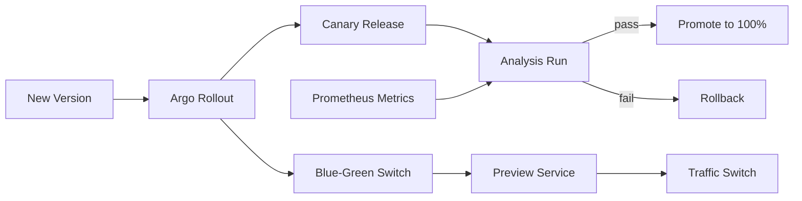

# Argo Rollouts — A 2-Day Crash Course

Argo Rollouts is a progressive delivery controller for Kubernetes — it adds traffic-weighted canaries, blue-green deployments, and analysis-driven automated rollback that go well beyond what a standard Deployment can do.

**Prerequisites:** [`Kubernetes.md`](../containers/Kubernetes.md), [`ArgoCD.md`](./ArgoCD.md)

---

## Part 0 — Why Argo Rollouts Exists

A Kubernetes Deployment gives you one release strategy: rolling update. It shifts traffic from old pods to new pods proportionally as pods become ready. That works fine until something goes wrong partway through — at which point you have a partially deployed service, possibly serving errors to a fraction of your users, and your only escape is a manual `kubectl rollout undo`.

Argo Rollouts changes the calculus. Instead of "replace pods and hope", you get:

- **Traffic-weighted canaries** — send 5% of traffic to v2 before you commit to 100%
- **Automated analysis** — query Prometheus (or Datadog, New Relic, etc.) during the rollout and automatically abort if error rate spikes
- **Blue-green deployments** — maintain two fully provisioned stacks and flip traffic atomically
- **Experiments** — run ephemeral parallel variants for A/B testing without a full rollout

The controller watches `Rollout` custom resources (not `Deployment` objects) and integrates with your existing ingress or service mesh to manipulate real traffic, not just pod counts.

---




## Part 1 — Vocabulary

Before you touch any YAML, get these terms clear in your head.

| Term | What it means |
|---|---|
| **Rollout** | The CRD that replaces `Deployment`. Same pod template spec, plus a `strategy` block. |
| **Strategy** | Either `canary` or `blueGreen`. You pick one per Rollout. |
| **Step** | A discrete unit inside a canary strategy — `setWeight`, `pause`, or `analysis`. |
| **SetWeight** | A step that routes N% of traffic to the canary. Requires a traffic routing integration for accuracy. |
| **Pause** | A step that halts the rollout until a duration expires or you manually promote. |
| **AnalysisTemplate** | A cluster- or namespace-scoped template defining what metrics to query and what constitutes success or failure. |
| **AnalysisRun** | An instantiation of an `AnalysisTemplate`, created automatically during a rollout step. |
| **Experiment** | A short-lived object that spins up one or more replica sets for parallel comparison without advancing the rollout. |
| **TrafficRouting** | The integration layer — Istio VirtualService, Nginx ingress, AWS ALB — that makes `setWeight` real. |
| **Promotion** | The act of advancing past a `pause` step, either manually or via automated analysis. |

---

## Day 1 — Getting Up and Running

### Install the Controller

```bash
kubectl create namespace argo-rollouts
kubectl apply -n argo-rollouts \
  -f https://github.com/argoproj/argo-rollouts/releases/latest/download/install.yaml
```

Install the kubectl plugin for manual interaction:

```bash
# macOS
brew install argoproj/tap/kubectl-argo-rollouts

# Linux
curl -LO https://github.com/argoproj/argo-rollouts/releases/latest/download/kubectl-argo-rollouts-linux-amd64
chmod +x kubectl-argo-rollouts-linux-amd64
sudo mv kubectl-argo-rollouts-linux-amd64 /usr/local/bin/kubectl-argo-rollouts
```

Verify:

```bash
kubectl argo rollouts version
```

### Convert a Deployment to a Rollout

The migration is intentionally low-friction. The `Rollout` spec mirrors `Deployment` exactly — same `template`, same `selector`, same `replicas`. You add a `strategy` block and change `apiVersion` and `kind`.

**Before (Deployment):**

```yaml
apiVersion: apps/v1
kind: Deployment
metadata:
  name: my-app
spec:
  replicas: 5
  selector:
    matchLabels:
      app: my-app
  template:
    metadata:
      labels:
        app: my-app
    spec:
      containers:
        - name: app
          image: my-app:1.0.0
```

**After (Rollout with canary):**

```yaml
apiVersion: argoproj.io/v1alpha1
kind: Rollout
metadata:
  name: my-app
spec:
  replicas: 5
  selector:
    matchLabels:
      app: my-app
  template:
    metadata:
      labels:
        app: my-app
    spec:
      containers:
        - name: app
          image: my-app:1.0.0
  strategy:
    canary:
      steps:
        - setWeight: 20
        - pause: {}          # pause indefinitely — requires manual promotion
        - setWeight: 50
        - pause: {duration: 10m}
        - setWeight: 100
```

⚠️ If you have an existing `Deployment` with the same name and selector, delete it first. The controller does not auto-migrate running Deployments — it will conflict.

```bash
kubectl delete deployment my-app
kubectl apply -f rollout.yaml
```

### Trigger an Update

Change the image tag and apply:

```bash
kubectl argo rollouts set image my-app app=my-app:2.0.0
```

Or update the manifest and `kubectl apply`. The controller detects the pod template change and begins executing steps.

### Watch the Rollout

```bash
kubectl argo rollouts get rollout my-app --watch
```

You will see output like:

```
Name:            my-app
Namespace:       default
Status:          ॥ Paused
Step:            1/5
SetWeight:       20
...
```

The rollout stopped at the first `pause: {}`. Twenty percent of traffic is on v2. Eighty percent is still on v1.

### Manual Promote

Advance past the pause:

```bash
kubectl argo rollouts promote my-app
```

To skip all remaining steps and go straight to 100%:

```bash
kubectl argo rollouts promote my-app --full
```

### Abort a Rollout

If something looks wrong, abort and roll back:

```bash
kubectl argo rollouts abort my-app
```

The controller scales down the canary and routes all traffic back to the stable revision. The `Rollout` moves to `Degraded` status. You can retry with a new image tag or fix the spec.

### The Dashboard

The controller ships a local dashboard for visual inspection:

```bash
kubectl argo rollouts dashboard
```

Open `http://localhost:3100`. You get a real-time view of all Rollouts, their steps, traffic weights, and analysis results. Useful during incidents — faster than reading YAML.

---

## Day 2 — Automation, Blue-Green, and Integration

### Automated Analysis with Prometheus

Manual promotion is useful for low-volume services. For anything important, you want the rollout to make its own go/no-go decision based on metrics.

**Step 1 — Define an AnalysisTemplate:**

```yaml
apiVersion: argoproj.io/v1alpha1
kind: AnalysisTemplate
metadata:
  name: success-rate
spec:
  args:
    - name: service-name
  metrics:
    - name: success-rate
      interval: 1m
      successCondition: result[0] >= 0.95
      failureLimit: 3
      provider:
        prometheus:
          address: http://prometheus.monitoring.svc.cluster.local:9090
          query: |
            sum(rate(http_requests_total{
              job="{{ args.service-name }}",
              status!~"5.."
            }[5m]))
            /
            sum(rate(http_requests_total{
              job="{{ args.service-name }}"
            }[5m]))
```

**Step 2 — Reference the template in your Rollout steps:**

```yaml
strategy:
  canary:
    steps:
      - setWeight: 20
      - pause: {duration: 5m}
      - analysis:
          templates:
            - templateName: success-rate
          args:
            - name: service-name
              value: my-app
      - setWeight: 50
      - pause: {duration: 10m}
      - setWeight: 100
```

When the rollout reaches the `analysis` step, it creates an `AnalysisRun`. The run queries Prometheus every minute. If the success rate drops below 95% three times consecutively (`failureLimit: 3`), the run fails, the rollout aborts, and traffic returns to stable.

You can also run analysis as a background step across the entire canary phase:

```yaml
strategy:
  canary:
    analysis:
      templates:
        - templateName: success-rate
      args:
        - name: service-name
          value: my-app
      startingStep: 1     # begin after first setWeight
    steps:
      - setWeight: 20
      - pause: {duration: 10m}
      - setWeight: 100
```

### Blue-Green Strategy

Blue-green keeps two fully provisioned replica sets — active (stable) and preview (new version). Traffic stays on active until you promote.

```yaml
strategy:
  blueGreen:
    activeService: my-app-active
    previewService: my-app-preview
    autoPromotionEnabled: false   # require manual promotion
    prePromotionAnalysis:
      templates:
        - templateName: success-rate
      args:
        - name: service-name
          value: my-app-preview
```

You need two Services pointing at the same selector — the controller manages pod selector patches on these Services automatically. When you promote, the active Service flips to the new revision. The old revision stays running for `scaleDownDelaySeconds` (default 30 seconds) before scale-down, giving your load balancer time to drain connections.

### Traffic Management Integrations

Without a traffic routing integration, `setWeight` works by adjusting replica counts — an approximation, not real traffic splitting. For accurate splitting, wire in your ingress or service mesh.

**Nginx Ingress:**

```yaml
strategy:
  canary:
    canaryService: my-app-canary
    stableService: my-app-stable
    trafficRouting:
      nginx:
        stableIngress: my-app-ingress
    steps:
      - setWeight: 10
      - pause: {duration: 5m}
      - setWeight: 100
```

**Istio:**

```yaml
strategy:
  canary:
    canaryService: my-app-canary
    stableService: my-app-stable
    trafficRouting:
      istio:
        virtualService:
          name: my-app-vsvc
          routes:
            - primary
    steps:
      - setWeight: 10
      - pause: {duration: 5m}
      - setWeight: 100
```

The controller patches the `VirtualService` weights at each step. You define the `VirtualService` skeleton; Argo Rollouts manages the weight values.

**AWS ALB:**

```yaml
trafficRouting:
  alb:
    ingress: my-app-ingress
    servicePort: 80
```

Requires the AWS Load Balancer Controller. The Rollout controller patches ingress annotations to set target group weights.

### Experiments

An `Experiment` lets you spin up an ephemeral replica set for comparison without committing to a full rollout. Use it for A/B testing a UI change or benchmarking a CPU-heavy code path.

```yaml
apiVersion: argoproj.io/v1alpha1
kind: Experiment
metadata:
  name: my-app-ab-test
spec:
  duration: 1h
  templates:
    - name: baseline
      replicas: 2
      selector:
        matchLabels:
          app: my-app
          variant: baseline
      template:
        metadata:
          labels:
            app: my-app
            variant: baseline
        spec:
          containers:
            - name: app
              image: my-app:1.0.0
    - name: candidate
      replicas: 2
      selector:
        matchLabels:
          app: my-app
          variant: candidate
      template:
        metadata:
          labels:
            app: my-app
            variant: candidate
        spec:
          containers:
            - name: app
              image: my-app:2.0.0
  analyses:
    - name: ab-analysis
      templateName: success-rate
```

After `duration`, the Experiment scales down both replica sets. The `AnalysisRun` result is attached to the Experiment — you read it and decide whether to proceed with a full rollout.

### Notifications

Argo Rollouts emits events at each state transition. Forward these to Slack, PagerDuty, or any webhook via the Notifications Controller (shared with ArgoCD).

Install the notifications controller alongside Argo Rollouts (it ships in the same repo). Then configure a `ConfigMap` with templates and triggers:

```yaml
apiVersion: v1
kind: ConfigMap
metadata:
  name: argo-rollouts-notification-configmap
  namespace: argo-rollouts
data:
  trigger.on-rollout-aborted: |
    - when: rollout.status.abort == true
      send: [slack-message]
  template.slack-message: |
    message: |
      Rollout {{ .rollout.metadata.name }} aborted in {{ .rollout.metadata.namespace }}
  service.slack: |
    token: $slack-token
    channels:
      - deployments
```

Secrets like `$slack-token` live in a `Secret` named `argo-rollouts-notification-secret`.

### Integration with ArgoCD

ArgoCD and Argo Rollouts compose cleanly. ArgoCD manages desired state in Git — it syncs your `Rollout` manifest to the cluster. Argo Rollouts manages execution — it controls traffic and analysis.

Key points:

- ArgoCD treats a `Rollout` mid-deployment as `Progressing` (not `Healthy`), so your application stays yellow in the ArgoCD UI until the rollout completes or is promoted. This is expected behavior.
- If ArgoCD is set to auto-sync with `prune: true`, it will not delete the Rollout mid-flight — the controller owns live state during the rollout.
- For full visibility, install the ArgoCD Rollouts extension (the `rollout-extension` plugin), which embeds the Rollouts UI panel inside the ArgoCD application view.
- Use `syncOptions: ServerSideApply=true` when ArgoCD manages Rollouts to avoid field manager conflicts.

### Flagger Comparison

You will encounter Flagger (by Flux) as an alternative. Here is the honest comparison:

| Dimension | Argo Rollouts | Flagger |
|---|---|---|
| Resource model | You manage the Rollout object directly | Flagger watches Deployments, creates its own Canary CRD |
| GitOps fit | Native (ArgoCD ecosystem) | Native (Flux ecosystem) |
| Traffic splitting | Explicit steps in YAML | Automated — Flagger decides timing based on metrics |
| Control | High — you define every step | Lower — Flagger's algorithm drives promotion |
| Blue-green | First-class support | Supported |
| Learning curve | Steeper (more explicit) | Gentler (more opinionated) |

If you are on Flux, Flagger is the natural choice. If you are on ArgoCD, Argo Rollouts fits your mental model better and gives you more explicit control.

---

## Worked Example — Canary with Automated Prometheus Analysis

A complete, deployable example. It assumes you have Prometheus installed and an app exposing `http_requests_total` with `status` and `job` labels.

```yaml
# analysis-template.yaml
apiVersion: argoproj.io/v1alpha1
kind: AnalysisTemplate
metadata:
  name: http-success-rate
  namespace: default
spec:
  args:
    - name: service-name
  metrics:
    - name: success-rate
      interval: 2m
      count: 5
      successCondition: result[0] >= 0.98
      failureLimit: 2
      provider:
        prometheus:
          address: http://prometheus-server.monitoring.svc.cluster.local
          query: |
            sum(rate(http_requests_total{
              job="{{ args.service-name }}",
              status!~"5.."
            }[5m]))
            /
            sum(rate(http_requests_total{
              job="{{ args.service-name }}"
            }[5m]))
---
# rollout.yaml
apiVersion: argoproj.io/v1alpha1
kind: Rollout
metadata:
  name: api-server
  namespace: default
spec:
  replicas: 10
  revisionHistoryLimit: 3
  selector:
    matchLabels:
      app: api-server
  template:
    metadata:
      labels:
        app: api-server
    spec:
      containers:
        - name: api
          image: my-org/api-server:1.0.0
          ports:
            - containerPort: 8080
          readinessProbe:
            httpGet:
              path: /healthz
              port: 8080
            initialDelaySeconds: 5
            periodSeconds: 5
  strategy:
    canary:
      canaryService: api-server-canary
      stableService: api-server-stable
      trafficRouting:
        nginx:
          stableIngress: api-server-ingress
      steps:
        - setWeight: 10
        - pause: {duration: 5m}
        - analysis:
            templates:
              - templateName: http-success-rate
            args:
              - name: service-name
                value: api-server-canary
        - setWeight: 30
        - pause: {duration: 5m}
        - setWeight: 60
        - pause: {duration: 5m}
        - setWeight: 100
```

Deploy the template first, then the Rollout. Update the image:

```bash
kubectl argo rollouts set image api-server api=my-org/api-server:2.0.0
```

The rollout proceeds to 10%, pauses 5 minutes, runs analysis (5 samples over 10 minutes querying Prometheus), then continues to 30%, 60%, and 100% — or aborts automatically if success rate falls below 98% twice.

---

## Pitfalls

**Forgetting to delete the existing Deployment.** If a `Deployment` with the same name and selector exists, the controller cannot take over. Delete it before applying the `Rollout`.

**No traffic routing integration.** Without Nginx, Istio, or ALB wired in, `setWeight` only adjusts replica counts. With 10 replicas and `setWeight: 20`, you get 2 canary pods — but your Service round-robins to all pods, so actual traffic split depends on connection distribution, not exact percentage. For production use, set up a real traffic routing integration.

**Readiness probe gaps.** Argo Rollouts relies on pod readiness to determine when a step is complete. If your readiness probe is too permissive or resolves before the app is truly ready, traffic gets sent to pods that are not ready to serve.

**Analysis with no data.** If Prometheus has no data for the canary yet (cold start, low traffic), the query returns an empty result. By default this counts as a measurement failure. Handle it with `inconclusiveLimit` in the template so low-traffic windows do not cause false aborts.

**Promotions during incidents.** `promote --full` skips all remaining steps including analysis. Fine for a hotfix under pressure. Dangerous as a habit — it defeats the purpose of the controller.

**ArgoCD sync during rollout.** If ArgoCD auto-syncs while a rollout is in progress, it may reset the Rollout spec mid-flight. Use ArgoCD sync waves or `ignoreDifferences` to exclude in-flight status fields from ArgoCD's diff.

**Forgetting `revisionHistoryLimit`.** The controller keeps old replica sets around for rollback. Without a limit, these accumulate over time. Set `revisionHistoryLimit: 3` unless you have a specific reason for more.

---

## Quick Reference

```bash
# Install plugin
brew install argoproj/tap/kubectl-argo-rollouts

# List all rollouts
kubectl argo rollouts list rollouts

# Get rollout status
kubectl argo rollouts get rollout <name> --watch

# Trigger update by changing image
kubectl argo rollouts set image <rollout> <container>=<image>:<tag>

# Manual promote past pause
kubectl argo rollouts promote <name>

# Promote past all steps immediately
kubectl argo rollouts promote <name> --full

# Abort and roll back
kubectl argo rollouts abort <name>

# Retry after abort
kubectl argo rollouts retry rollout <name>

# Undo to previous revision
kubectl argo rollouts undo <name>

# Open dashboard
kubectl argo rollouts dashboard

# List analysis runs
kubectl get analysisruns

# Inspect a rollout and its analysis
kubectl argo rollouts get rollout <name>
kubectl describe analysisrun <name>
```

---

## Top 10 Interview Questions

<details>
<summary><strong>Q: What problem does Argo Rollouts solve that a standard Kubernetes Deployment does not?</strong></summary>

A Deployment only supports rolling updates — it replaces pods proportionally with no traffic awareness. Argo Rollouts adds traffic-weighted canaries, blue-green deployments, and automated analysis-driven rollback. You can send 5% of traffic to a new version, query Prometheus for error rates, and abort automatically if metrics degrade — none of which a Deployment can do.

</details>

<details>
<summary><strong>Q: What is the difference between a canary and a blue-green strategy in Argo Rollouts?</strong></summary>

Canary gradually shifts traffic through configurable weight steps (10%, 30%, 60%, 100%), with optional analysis at each step. Blue-green maintains two fully provisioned replica sets — active and preview — and flips traffic atomically on promotion. Use canary for gradual risk reduction; use blue-green when you need instant cutover and fast rollback.

</details>

<details>
<summary><strong>Q: How does automated analysis work during a rollout?</strong></summary>

You define an `AnalysisTemplate` with a metric query (Prometheus, Datadog, etc.), a success condition, and a failure limit. When the rollout reaches an `analysis` step, it creates an `AnalysisRun` that queries the metric provider at intervals. If the success condition fails more times than `failureLimit`, the run fails and the rollout aborts automatically, returning all traffic to stable.

</details>

<details>
<summary><strong>Q: Why is a traffic routing integration important for canary deployments?</strong></summary>

Without one, `setWeight` only adjusts replica counts — a rough approximation. With 10 replicas and `setWeight: 20`, you get 2 canary pods, but a Service round-robins to all pods, so actual traffic distribution depends on connection patterns, not exact percentage. Integrating with Nginx, Istio, or AWS ALB gives real traffic splitting at the ingress or mesh level.

</details>

<details>
<summary><strong>Q: How do you handle the cold-start problem where Prometheus has no data for a new canary?</strong></summary>

On a cold start or during low traffic, the Prometheus query returns empty results, which count as measurement failures by default. Use `inconclusiveLimit` in the AnalysisTemplate — it lets you tolerate a number of inconclusive measurements without triggering an abort. Also add an initial `pause` step before analysis to let metrics accumulate.

</details>

<details>
<summary><strong>Q: How does Argo Rollouts integrate with Argo CD?</strong></summary>

Argo CD syncs the `Rollout` manifest from Git to the cluster. Argo Rollouts executes the progressive delivery strategy. During a rollout, Argo CD shows the Application as `Progressing`. Install the Argo CD Rollouts extension for embedded visibility. Use `syncOptions: ServerSideApply=true` to avoid field manager conflicts between the two controllers.

</details>

<details>
<summary><strong>Q: What happens when you run `promote --full` and when is it appropriate?</strong></summary>

`promote --full` skips all remaining steps — including pauses and analysis — and sends 100% of traffic to the canary immediately. It is appropriate for emergency hotfixes where you have high confidence and need speed. It is dangerous as a habit because it completely bypasses the safety net of progressive delivery.

</details>

<details>
<summary><strong>Q: How do Experiments differ from a canary rollout?</strong></summary>

An Experiment spins up one or more ephemeral replica sets for a fixed duration for comparison (A/B testing, benchmarking) without advancing a full rollout. It runs analysis and scales down when the duration expires. A canary rollout is the actual deployment progression. Use Experiments to test a hypothesis; use canary to ship the change.

</details>

<details>
<summary><strong>Q: What is `revisionHistoryLimit` and why should you set it?</strong></summary>

The controller keeps old replica sets around for rollback. Without a limit, these accumulate indefinitely, consuming cluster resources. Set `revisionHistoryLimit: 3` (or similar) to keep the last few revisions for quick rollback while preventing unbounded growth.

</details>

<details>
<summary><strong>Q: How would you migrate an existing Deployment to a Rollout?</strong></summary>

The Rollout spec mirrors a Deployment exactly — same `template`, `selector`, and `replicas`. Change the `apiVersion` to `argoproj.io/v1alpha1`, the `kind` to `Rollout`, and add a `strategy` block. Delete the existing Deployment first to avoid selector conflicts, then apply the Rollout. The controller takes over pod management immediately.

</details>

---


## Terminal Demo

```terminal-demo
# kubectl-argo-rollouts@production ~ %

$ kubectl argo rollouts version
kubectl-argo-rollouts: v1.6.6

$ kubectl argo rollouts list rollouts -n production
NAME   STRATEGY   STATUS        STEP  SET-WEIGHT  READY  DESIRED  UP-TO-DATE
api    Canary     Healthy       8/8   100         5/5    5        5
web    BlueGreen  Healthy       -     -           3/3    3        3

$ kubectl argo rollouts set image api api=myregistry/api:v2.2.0 -n production
rollout "api" image updated

$ kubectl argo rollouts get rollout api -n production --watch
Name:            api
Namespace:       production
Status:          ◌ Progressing
Strategy:        Canary
  Step:          2/8 (setWeight: 20%)
  ActualWeight:  20
  
Images:
  myregistry/api:v2.1.0  (stable)
  myregistry/api:v2.2.0  (canary)

NAME                        KIND        STATUS     AGE
⟳ api                       Rollout     ◌ Progressing  30d
├──# revision:3
│  └──⧫ api-6f8b9c4d7      ReplicaSet  ✔ Healthy      10s (canary)
│     └──□ api-6f8b9c4d7-x  Pod         ✔ Running      10s
└──# revision:2
   └──⧫ api-7d4b8c6f5      ReplicaSet  ✔ Healthy      3d (stable)
      ├──□ api-7d4b8c6f5-a  Pod         ✔ Running      3d
      ├──□ api-7d4b8c6f5-b  Pod         ✔ Running      3d
      ├──□ api-7d4b8c6f5-c  Pod         ✔ Running      3d
      └──□ api-7d4b8c6f5-d  Pod         ✔ Running      3d

$ kubectl argo rollouts promote api -n production
rollout 'api' promoted

$ kubectl argo rollouts status api -n production
Healthy
```

---

## Quick Quiz

Test your understanding with these rapid-fire questions (answers hidden):

<details>
<summary>1. What is the ONE core problem that Argo Rollouts solves?</summary>
Re-read Part 0 — the mental model section. If you can explain the "why" in one sentence, you understand the foundation.
</details>

<details>
<summary>2. Name the 3 most important terms from the vocabulary section.</summary>
Review Part 1. These are the building blocks every conversation about Argo Rollouts uses.
</details>

<details>
<summary>3. What is the first thing you would set up on Day 1?</summary>
Check the Day 1 section — the very first hands-on step that gets you a working result.
</details>

<details>
<summary>4. What is the most common production pitfall with Argo Rollouts?</summary>
Review the Common Pitfalls section. The first item listed is typically the most frequently encountered.
</details>

<details>
<summary>5. How does Argo Rollouts compare to its closest alternative?</summary>
Check the Comparison Matrix below — focus on the key differentiating row.
</details>


## Comparison Matrix

| Dimension | Argo Rollouts | Flagger | Istio Traffic |
|-----------|---------------|---------|---------------|
| **Primary use case** | Core strength of Argo Rollouts | Core strength of Flagger | Core strength of Istio Traffic |
| **Learning curve** | Moderate | Varies | Varies |
| **Community/ecosystem** | Active | Active | Growing |
| **Operational complexity** | Medium | Varies | Varies |
| **Best for** | See Part 0 | Different tradeoffs | Different tradeoffs |

> **How to read this matrix:** no tool wins on every dimension. Pick based on your specific constraints — team expertise, existing infrastructure, scale requirements, and compliance needs. The right choice is the one that fits your context, not the one with the most checkmarks.

## Next Steps

- [`ArgoCD.md`](./ArgoCD.md) — GitOps sync layer that manages the Rollout manifests
- [`Kubernetes.md`](../containers/Kubernetes.md) — Deployments, Services, and the primitives Rollouts builds on
- `Istio.md` — Service mesh for accurate traffic splitting
- [`Prometheus.md`](../observability/Prometheus.md) — Metrics backend for automated analysis

---

## Recommended learning resources

**YouTube channels & playlists:**
- [DevOps Toolkit — Argo Rollouts and progressive delivery](https://www.youtube.com/@DevOpsToolkit) — Viktor Farcic's deep dives on canary, blue-green, and analysis-driven rollbacks
- [CNCF — Argo project talks from KubeCon](https://www.youtube.com/@cncf) — maintainer presentations on Rollouts architecture and real-world adoption
- [Codefresh — Argo Rollouts tutorials](https://www.youtube.com/@Codefresh) — hands-on demos from the team behind the Argo commercial offering
- [TechWorld with Nana — Kubernetes deployments](https://www.youtube.com/@TechWorldwithNana) — foundational deployment concepts that Rollouts builds on
- [Fireship — Kubernetes explained](https://www.youtube.com/@Fireship) — quick conceptual overview for context

**Official docs & blogs:**
- [Argo Rollouts Official Documentation](https://argo-rollouts.readthedocs.io/)
- [Codefresh Blog — Progressive Delivery](https://codefresh.io/blog/) — in-depth articles on canary strategies, traffic splitting, and analysis templates

---

## The Mantra

Ship 10%, wait, measure, then commit — or let the metrics make the call for you.
