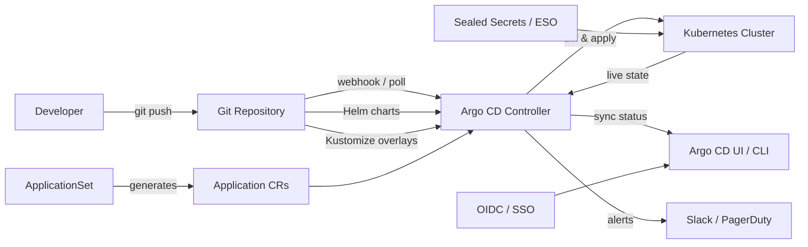

# Argo CD — A 2-Day Crash Course

> **In one sentence:** Argo CD is a Kubernetes-native GitOps controller that continuously reconciles your cluster state to match what's declared in a Git repository — before starting here, make sure you're comfortable with Kubernetes resources and Helm chart structure; see `Kubernetes.md` and `Helm.md`.

---

## Part 0 — Why Argo CD exists

Picture a team of five engineers, each running `kubectl apply -f` from their laptop. Every deploy is a manual act. Nobody knows if what's in the cluster matches what's in Git. A stale kubeconfig sends staging changes to production. A pod gets patched directly on the cluster — nobody committed that change — and three weeks later someone's `apply` silently reverts it. This is the drift problem.

CI-driven deploys don't fully solve it. Your pipeline applies manifests on merge and then walks away. The pipeline doesn't watch the cluster. If someone runs `kubectl edit` five minutes after the deploy, the pipeline never notices. Declared state and live state diverge silently.

GitOps flips the model. Git is the single source of truth. A controller running *inside* the cluster watches Git and watches the cluster simultaneously. Any difference — drift — triggers an alert or an automatic reconciliation. Deploys become pull requests, not shell scripts. The audit log is Git history.

Argo CD is that controller. It runs as a set of pods in your cluster. You tell it: "Watch this Git repo, this path, this branch. Keep the cluster matching it." Argo CD then polls or receives webhooks, diffs the desired state against live state, and either alerts or auto-syncs.

**Mental model:** Git is the source of truth; Argo CD is the enforcement agent that makes the cluster confess to it.



---

## Part 1 — The vocabulary

| Term | What it means |
|---|---|
| **Application** | The core Argo CD resource. Maps one Git source (repo + path + revision) to one destination (cluster + namespace). |
| **AppProject** | A grouping resource that scopes which repos, clusters, and namespaces a set of Applications can touch. Think of it as an RBAC boundary. |
| **Sync** | The act of applying the desired state from Git to the cluster. Can be manual or automated. |
| **Sync Status** | Whether Git state and live cluster state match: `Synced`, `OutOfSync`. |
| **Health Status** | Whether the live resources are actually healthy: `Healthy`, `Progressing`, `Degraded`, `Missing`, `Unknown`. |
| **Refresh** | Fetching the latest commit from Git and recomputing the diff — does not apply anything. |
| **Self-Heal** | When auto-sync is enabled with self-heal, Argo CD re-syncs automatically if the cluster drifts from Git. |
| **ApplicationSet** | A controller that generates multiple Application resources from a template — used for multi-env and multi-cluster rollouts. |
| **Sync Wave** | An integer annotation on a resource that controls ordering within a sync operation. Lower waves apply first. |
| **Sync Hook** | A Job or other resource annotated to run at a specific phase of a sync (PreSync, Sync, PostSync, SyncFail). |

---

## DAY 1 — Your first GitOps deploy

### 1.1 — Install Argo CD into your cluster

Argo CD runs as a set of Kubernetes deployments. The official install manifest is the fastest path for a first look.

```bash
kubectl create namespace argocd

kubectl apply -n argocd \
  -f https://raw.githubusercontent.com/argoproj/argo-cd/stable/manifests/install.yaml
```

Wait for all pods to reach Running:

```bash
kubectl -n argocd get pods --watch
```

You'll see: `argocd-server`, `argocd-repo-server`, `argocd-application-controller`, `argocd-dex-server`, `argocd-redis`.

### 1.2 — Access the UI and CLI

Port-forward the server for local access:

```bash
kubectl -n argocd port-forward svc/argocd-server 8080:443
```

Open `https://localhost:8080`. Accept the self-signed cert for now.

The initial admin password is auto-generated and stored in a Secret:

```bash
kubectl -n argocd get secret argocd-initial-admin-secret \
  -o jsonpath="{.data.password}" | base64 -d
```

Log in via CLI:

```bash
argocd login localhost:8080 \
  --username admin \
  --password <password-from-above> \
  --insecure
```

Change the password immediately:

```bash
argocd account update-password
```

### 1.3 — Create your first Application

You need a Git repository containing Kubernetes manifests or a Helm chart. The Argo CD project maintains `https://github.com/argoproj/argocd-example-apps` — use the `guestbook` directory to start.

Create the Application via CLI:

```bash
argocd app create guestbook \
  --repo https://github.com/argoproj/argocd-example-apps.git \
  --path guestbook \
  --dest-server https://kubernetes.default.svc \
  --dest-namespace default \
  --revision HEAD \
  --sync-policy manual
```

Or declaratively as a YAML resource — this is the recommended approach for anything beyond experimentation:

```yaml
apiVersion: argoproj.io/v1alpha1
kind: Application
metadata:
  name: guestbook
  namespace: argocd
spec:
  project: default
  source:
    repoURL: https://github.com/argoproj/argocd-example-apps.git
    targetRevision: HEAD
    path: guestbook
  destination:
    server: https://kubernetes.default.svc
    namespace: default
  syncPolicy:
    automated:
      prune: true
      selfHeal: true
```

Apply it:

```bash
kubectl apply -f guestbook-app.yaml
```

### 1.4 — Inspect status and sync

Check what Argo CD sees:

```bash
argocd app get guestbook
```

The output shows sync status, health status, and a resource tree. If you used `--sync-policy manual`, trigger the first sync:

```bash
argocd app sync guestbook
```

Watch the sync progress in the UI at `https://localhost:8080`. You'll see resources animate from `OutOfSync` to `Synced` and health transitions from `Unknown` to `Healthy`.

### 1.5 — Observe drift detection

Manually scale the guestbook deployment:

```bash
kubectl scale deployment guestbook-ui --replicas=3 -n default
```

Wait 3 minutes (the default refresh interval), then check:

```bash
argocd app get guestbook
```

Sync status flips to `OutOfSync`. Argo CD detected that the live cluster no longer matches Git. If `selfHeal` is enabled, it will revert the change automatically. If not, you decide when to re-sync.

**By end of Day 1 you can:**
- Install Argo CD into a cluster
- Create an Application pointing at a Git repo
- Trigger a sync and watch resources reconcile
- Observe drift detection in action
- Use both the UI and `argocd` CLI for inspection

---

## DAY 2 — Make it real

### 2.1 — Multi-environment promotion with directory structure

The most common pattern: one Git repo, separate directories per environment.

```
deploy/
  base/
    deployment.yaml
    service.yaml
  overlays/
    staging/
      kustomization.yaml   # patches image tag, replicas
    production/
      kustomization.yaml
```

Create one Application per environment:

```yaml
# staging application
spec:
  source:
    path: deploy/overlays/staging
  destination:
    namespace: staging
---
# production application
spec:
  source:
    path: deploy/overlays/production
  destination:
    namespace: production
```

Promotion means merging a PR that updates the image tag in `production/kustomization.yaml`. Argo CD detects the change and syncs production. No pipeline kubectl. See `GitHub-Actions.md` for the CI side of writing that commit.

### 2.2 — ApplicationSets for scale

When you have many environments, clusters, or tenants, writing one Application YAML per env doesn't scale. ApplicationSet generates Application resources from a template and a generator.

List generator — one Application per environment in a list:

```yaml
apiVersion: argoproj.io/v1alpha1
kind: ApplicationSet
metadata:
  name: myapp-envs
  namespace: argocd
spec:
  generators:
    - list:
        elements:
          - env: staging
            namespace: staging
          - env: production
            namespace: production
  template:
    metadata:
      name: "myapp-{{env}}"
    spec:
      project: default
      source:
        repoURL: https://github.com/your-org/your-repo.git
        targetRevision: HEAD
        path: "deploy/overlays/{{env}}"
      destination:
        server: https://kubernetes.default.svc
        namespace: "{{namespace}}"
      syncPolicy:
        automated:
          prune: true
          selfHeal: true
```

Git directory generator — automatically create an Application for every subdirectory that matches a pattern. Useful for team-per-directory or service-per-directory monorepos.

### 2.3 — AppProjects and RBAC

The `default` project allows any source and any destination. In a real cluster, lock it down.

Create a project that restricts a team to their namespace:

```yaml
apiVersion: argoproj.io/v1alpha1
kind: AppProject
metadata:
  name: team-payments
  namespace: argocd
spec:
  description: Payments team applications
  sourceRepos:
    - https://github.com/your-org/payments-service.git
  destinations:
    - namespace: payments
      server: https://kubernetes.default.svc
  clusterResourceWhitelist: []   # no cluster-scoped resources
  namespaceResourceWhitelist:
    - group: apps
      kind: Deployment
    - group: ""
      kind: Service
```

Argo CD RBAC is configured in `argocd-rbac-cm` ConfigMap. It uses a Casbin policy format:

```
p, role:payments-dev, applications, sync, team-payments/*, allow
p, role:payments-dev, applications, get, team-payments/*, allow
g, team-payments-group, role:payments-dev
```

### 2.4 — SSO integration

Argo CD ships with Dex as an embedded OIDC provider. Point it at GitHub, Google, Okta, or any OIDC-compatible IdP by editing `argocd-cm`:

```yaml
data:
  url: https://argocd.your-domain.com
  oidc.config: |
    name: GitHub
    issuer: https://github.com
    clientID: <your-github-oauth-app-client-id>
    clientSecret: $oidc.github.clientSecret
    requestedScopes: ["openid", "profile", "email", "read:org"]
```

Map GitHub team membership to Argo CD roles via the RBAC ConfigMap.

### 2.5 — Sync waves and hooks

Sync waves control apply order within a single sync. Annotate resources with `argocd.argoproj.io/sync-wave`. Resources in wave `-5` apply before wave `0`, which applies before wave `5`.

```yaml
metadata:
  annotations:
    argocd.argoproj.io/sync-wave: "1"   # apply after wave 0
```

A common pattern: wave `-1` for Namespace and CRDs, wave `0` for the application workloads, wave `1` for a smoke-test Job.

Sync hooks run Jobs at specific phases. A database migration hook:

```yaml
apiVersion: batch/v1
kind: Job
metadata:
  name: db-migrate
  annotations:
    argocd.argoproj.io/hook: PreSync
    argocd.argoproj.io/hook-delete-policy: BeforeHookCreation
spec:
  template:
    spec:
      containers:
        - name: migrate
          image: your-app:latest
          command: ["./migrate", "up"]
      restartPolicy: Never
```

The `hook-delete-policy: BeforeHookCreation` annotation removes the previous Job before creating a new one, avoiding name conflicts on subsequent syncs.

### 2.6 — Custom health checks

Argo CD ships built-in health checks for standard Kubernetes resources. For CRDs, you write Lua scripts. Add them to `argocd-cm`:

```yaml
data:
  resource.customizations.health.your.io_MyResource: |
    hs = {}
    if obj.status ~= nil then
      if obj.status.phase == "Ready" then
        hs.status = "Healthy"
        hs.message = "Resource is ready"
        return hs
      end
    end
    hs.status = "Progressing"
    hs.message = "Waiting for ready"
    return hs
```

### 2.7 — Notifications

Argo CD Notifications (bundled since Argo CD 2.6) sends messages to Slack, PagerDuty, email, and more on sync success, failure, or health changes.

Configure a Slack trigger in `argocd-notifications-cm`:

```yaml
data:
  trigger.on-sync-failed: |
    - when: app.status.operationState.phase in ['Error', 'Failed']
      send: [app-sync-failed]
  template.app-sync-failed: |
    message: |
      Application {{.app.metadata.name}} sync failed.
      Error: {{.app.status.operationState.message}}
  service.slack: |
    token: $slack-token
```

Annotate Applications to subscribe:

```yaml
metadata:
  annotations:
    notifications.argoproj.io/subscribe.on-sync-failed.slack: ops-alerts
```

### 2.8 — Secrets management

⚠️ Never commit plaintext secrets to Git. Argo CD syncs whatever is in your repo — including Secrets. Two patterns dominate:

**Sealed Secrets** — encrypt a Secret with a cluster-specific public key using the `kubeseal` CLI. The encrypted `SealedSecret` resource is safe to commit. The Sealed Secrets controller decrypts it in-cluster.

```bash
kubectl create secret generic db-password \
  --from-literal=password=supersecret \
  --dry-run=client -o yaml | \
  kubeseal --controller-namespace kube-system \
           --format yaml > db-password-sealed.yaml
```

Commit `db-password-sealed.yaml`. The controller decrypts and creates the real Secret.

**External Secrets Operator** — fetches secrets from AWS Secrets Manager, GCP Secret Manager, HashiCorp Vault, etc., and materializes them as Kubernetes Secrets. You commit an `ExternalSecret` resource that references the external store path — no secret value ever touches Git.

```yaml
apiVersion: external-secrets.io/v1beta1
kind: ExternalSecret
metadata:
  name: db-credentials
spec:
  refreshInterval: 1h
  secretStoreRef:
    name: aws-secretsmanager
    kind: ClusterSecretStore
  target:
    name: db-credentials
  data:
    - secretKey: password
      remoteRef:
        key: /prod/db/password
```

---

## Worked example — Promoting staging → production

You have two Applications: `myapp-staging` and `myapp-production`. Both point at the same repo; staging at `deploy/overlays/staging`, production at `deploy/overlays/production`. Image tags are managed by Kustomize image overrides.

**Step 1 — CI builds and tags the image.** Your GitHub Actions workflow (see `GitHub-Actions.md`) builds on merge to `main`, pushes `your-registry/myapp:abc1234`, then opens a PR updating the image tag in `deploy/overlays/staging/kustomization.yaml`:

```yaml
images:
  - name: your-registry/myapp
    newTag: abc1234
```

**Step 2 — Staging auto-syncs.** `myapp-staging` has `automated.selfHeal: true`. Within the refresh interval (default 3 minutes, or immediately on webhook), Argo CD detects the tag change and applies it. You watch it go `Progressing` → `Healthy`.

**Step 3 — Verify staging.** Run your integration tests against staging. Gate on Argo CD health via the CLI:

```bash
argocd app wait myapp-staging \
  --health \
  --timeout 300
```

**Step 4 — Promote.** Open a PR updating `deploy/overlays/production/kustomization.yaml` with the same image tag `abc1234`. The PR description is your paper trail: what changed, who approved, when.

**Step 5 — Production syncs.** On PR merge, Argo CD detects the production overlay change. If production has `automated` sync, it applies automatically. If you prefer manual gates on production, `sync-policy` is not set to automated — a team member runs:

```bash
argocd app sync myapp-production
```

**Step 6 — Verify and monitor.** Check health:

```bash
argocd app get myapp-production
```

If health goes `Degraded`, the sync hooks and notifications you configured in Day 2 fire.

---

## Common pitfalls

- **Committing secrets in plaintext.** Argo CD faithfully syncs whatever is in Git. If you put a `Secret` manifest with real data in your repo, it's now in your Git history. Use Sealed Secrets or External Secrets Operator from day one.

- **Setting `prune: true` without understanding it.** Prune deletes resources from the cluster that no longer appear in Git. If you accidentally remove a resource from your repo, Argo CD will delete it from production. Use it knowingly, and test in staging first.

- **Using `HEAD` as `targetRevision` in production.** HEAD always points to the latest commit. If someone pushes a broken commit, production auto-syncs to it. Pin production to a tag or a specific commit SHA for predictable behavior.

- **Ignoring health status.** Sync status (`Synced`/`OutOfSync`) tells you whether the manifests were applied. Health status tells you whether the workloads are actually running. A deploy can be `Synced` and `Degraded` simultaneously — the manifests applied but the Pods are crash-looping.

- **Skipping AppProjects in multi-team environments.** The `default` project has no restrictions. In a shared cluster, any team could point an Application at any namespace. Create explicit AppProjects with tight sourceRepos and destinations before onboarding multiple teams.

- **Forgetting `hook-delete-policy` on sync hooks.** Without it, a PreSync Job from a previous sync is still present when the next sync runs, and Kubernetes rejects the duplicate name. Always annotate hooks with `BeforeHookCreation` or `HookSucceeded`.

- **Relying on polling instead of webhooks.** The default 3-minute polling interval means drift detection and new commit detection are delayed. Configure a webhook from your Git host to the Argo CD server for near-instant detection — the endpoint is `https://argocd.your-domain.com/api/webhook`.

- **Resource tracking conflicts.** If you manage a resource with both Argo CD and another tool (Helm CLI, Flux, manual kubectl), the tracking annotations conflict. Pick one tool per resource.

---

## Quick command reference

```bash
# --- Authentication ---
argocd login <server>:<port> --username admin --password <pass> --insecure
argocd account update-password
argocd logout <server>:<port>

# --- Application lifecycle ---
argocd app create <name> \
  --repo <url> \
  --path <dir> \
  --dest-server https://kubernetes.default.svc \
  --dest-namespace <ns>

argocd app list
argocd app get <name>
argocd app diff <name>
argocd app sync <name>
argocd app sync <name> --dry-run
argocd app sync <name> --force          # replace resources — use sparingly
argocd app delete <name>
argocd app delete <name> --cascade      # also deletes cluster resources

# --- Waiting and health ---
argocd app wait <name> --sync           # wait for sync to complete
argocd app wait <name> --health         # wait for healthy status
argocd app wait <name> --timeout 300

# --- History and rollback ---
argocd app history <name>
argocd app rollback <name> <id>

# --- Refresh (fetch latest from Git, no apply) ---
argocd app get <name> --refresh
argocd app list --refresh

# --- Projects ---
argocd proj list
argocd proj get <project-name>
argocd proj create <name>
argocd proj add-source <name> <repo-url>
argocd proj add-destination <name> <server> <namespace>

# --- Clusters ---
argocd cluster list
argocd cluster add <context-name>       # register an external cluster

# --- Repositories ---
argocd repo list
argocd repo add <url>
argocd repo add <url> --username <user> --password <pass>
argocd repo add <url> --ssh-private-key-path ~/.ssh/id_rsa

# --- Admin utilities ---
argocd admin export > backup.yaml
argocd admin import < backup.yaml
argocd version
```

---

## Top 10 Interview Questions

<details>
<summary><strong>Q: What problem does Argo CD solve that a CI pipeline with kubectl apply does not?</strong></summary>

A CI pipeline applies manifests and walks away — it has no awareness of post-deploy drift. Argo CD continuously reconciles, detecting and optionally correcting any divergence between Git and the live cluster. It also removes the need to store cluster credentials in CI, because the controller runs inside the cluster and pulls from Git.

</details>

<details>
<summary><strong>Q: How does Argo CD detect drift, and what happens when it finds it?</strong></summary>

Argo CD periodically refreshes (default every 3 minutes or via webhook) by fetching the latest commit and rendering manifests, then diffs the result against live cluster state. If they diverge, the Application moves to `OutOfSync`. With `selfHeal` enabled, Argo CD automatically re-applies the Git state; without it, drift is surfaced in the UI for manual resolution.

</details>

<details>
<summary><strong>Q: What is the difference between Sync Status and Health Status?</strong></summary>

Sync Status tells you whether the manifests in Git have been applied to the cluster (`Synced` or `OutOfSync`). Health Status tells you whether the running resources are actually working (`Healthy`, `Progressing`, `Degraded`). An Application can be `Synced` but `Degraded` — the manifests applied successfully but the pods are crash-looping.

</details>

<details>
<summary><strong>Q: How would you handle secrets in a GitOps workflow with Argo CD?</strong></summary>

Never commit plaintext secrets to Git. The two dominant patterns are Sealed Secrets (encrypt with a cluster-specific public key, commit the SealedSecret resource, and the controller decrypts in-cluster) and External Secrets Operator (commit an ExternalSecret that references a path in Vault, AWS Secrets Manager, or GCP Secret Manager — the operator materialises the real Secret).

</details>

<details>
<summary><strong>Q: What is an ApplicationSet and when would you use one?</strong></summary>

An ApplicationSet generates multiple Application resources from a template and a generator (list, Git directory, cluster, pull request, etc.). You use it when you have many environments, clusters, or tenants and writing one Application YAML per target does not scale. A single ApplicationSet can produce hundreds of Applications from a directory structure or a cluster list.

</details>

<details>
<summary><strong>Q: How do sync waves and hooks work, and what is a common ordering pattern?</strong></summary>

Sync waves are integer annotations that control the order resources are applied within a single sync — lower waves apply first. Hooks are Jobs annotated to run at specific sync phases (PreSync, Sync, PostSync, SyncFail). A common pattern is wave `-1` for Namespaces and CRDs, wave `0` for application workloads, and a PostSync hook for smoke tests.

</details>

<details>
<summary><strong>Q: How do you promote a release from staging to production in a GitOps model with Argo CD?</strong></summary>

CI builds and pushes the image, then updates the image tag in the staging overlay via an automated commit. Argo CD auto-syncs staging. After verification, a PR is opened updating the production overlay with the same tag. On merge, Argo CD detects the change and syncs production — either automatically or after a manual sync if auto-sync is disabled for production.

</details>

<details>
<summary><strong>Q: What is an AppProject, and why should you not use the default project in a multi-team cluster?</strong></summary>

An AppProject scopes which Git repos, clusters, and namespaces a set of Applications can access. The `default` project has no restrictions — any team could deploy to any namespace from any repo. In a multi-team environment, you create explicit AppProjects with tight `sourceRepos` and `destinations` to enforce RBAC boundaries.

</details>

<details>
<summary><strong>Q: Why should you avoid using HEAD as targetRevision for production Applications?</strong></summary>

HEAD always resolves to the latest commit on the branch. If someone pushes a broken commit, production auto-syncs to it immediately. For production, pin `targetRevision` to a Git tag or a specific commit SHA so deployments are predictable and deliberate, requiring an explicit tag bump to deploy.

</details>

<details>
<summary><strong>Q: How would you integrate Argo CD with your existing CI pipeline?</strong></summary>

The CI pipeline (GitHub Actions, GitLab CI, Jenkins) handles build, test, and image push. Its final step commits the new image tag to a GitOps repo. Argo CD watches that repo and handles the deploy. The CI pipeline can then call `argocd app wait --health` to gate on successful deployment. The pipeline never needs cluster credentials — it writes to Git, and Argo CD reads from Git.

</details>

---


## Quick Quiz

Test your understanding with these rapid-fire questions (answers hidden):

<details>
<summary>1. What is the ONE core problem that ArgoCD solves?</summary>
Re-read Part 0 — the mental model section. If you can explain the "why" in one sentence, you understand the foundation.
</details>

<details>
<summary>2. Name the 3 most important terms from the vocabulary section.</summary>
Review Part 1. These are the building blocks every conversation about ArgoCD uses.
</details>

<details>
<summary>3. What is the first thing you would set up on Day 1?</summary>
Check the Day 1 section — the very first hands-on step that gets you a working result.
</details>

<details>
<summary>4. What is the most common production pitfall with ArgoCD?</summary>
Review the Common Pitfalls section. The first item listed is typically the most frequently encountered.
</details>

<details>
<summary>5. How does ArgoCD compare to its closest alternative?</summary>
Check the Comparison Matrix below — focus on the key differentiating row.
</details>


## Comparison Matrix

| Dimension | ArgoCD | Flux | Jenkins X |
|-----------|--------|------|-----------|
| **Primary use case** | Core strength of ArgoCD | Core strength of Flux | Core strength of Jenkins X |
| **Learning curve** | Moderate | Varies | Varies |
| **Community/ecosystem** | Active | Active | Growing |
| **Operational complexity** | Medium | Varies | Varies |
| **Best for** | See Part 0 | Different tradeoffs | Different tradeoffs |

> **How to read this matrix:** no tool wins on every dimension. Pick based on your specific constraints — team expertise, existing infrastructure, scale requirements, and compliance needs. The right choice is the one that fits your context, not the one with the most checkmarks.

## Next steps after Day 2

- **`Kubernetes.md`** — Deepen understanding of the resources Argo CD manages: Deployments, StatefulSets, CRDs, RBAC, NetworkPolicy. Argo CD's health checks and sync behavior are defined against these primitives.

- **`Helm.md`** — Argo CD has native Helm support. You can point an Application at a Helm chart repo and pass values directly in the Application spec. Understanding Helm's templating model helps you reason about what Argo CD will render before applying.

- **`GitHub-Actions.md`** — The CI side of GitOps: build the image, run tests, open the PR updating the image tag. The pipeline writes to Git; Argo CD reads from Git. These two tools compose into a full delivery pipeline.

- **`GitLab-CI.md`** — Same pattern as GitHub Actions for teams on GitLab. The `argocd app wait` command integrates cleanly into post-deploy pipeline steps to gate on health.

- **`Git.md`** — GitOps is only as reliable as your Git workflow. Understand branch protection, signed commits, and merge strategies — these are your deployment controls now.

- **Argo Rollouts** — Progressive delivery for Argo CD users. Adds canary and blue/green deployment strategies as first-class Kubernetes resources, with Argo CD integration for health status propagation.

- **Flux** — Argo CD's main GitOps alternative. Flux v2 is more Kubernetes-native in its API design. The concepts translate directly if you join a team already using it.

---

## Recommended learning resources

**YouTube channels & playlists:**
- [DevOps Toolkit — ArgoCD playlist](https://www.youtube.com/@DevOpsToolkit) — Viktor Farcic's deep dives on ArgoCD patterns, ApplicationSets, and GitOps comparisons
- [TechWorld with Nana — ArgoCD Tutorial](https://www.youtube.com/@TechWorldwithNana) — beginner-friendly walkthrough of ArgoCD setup and GitOps workflow
- [CNCF — Argo Project talks from KubeCon](https://www.youtube.com/@cncf) — maintainer talks on new features, multi-cluster, and production patterns
- [Codefresh — GitOps and Argo Ecosystem](https://www.youtube.com/@Codefresh) — practical tutorials from the team behind the Argo commercial offering
- [Fireship — GitOps explained](https://www.youtube.com/@Fireship) — quick conceptual explainer on GitOps and continuous delivery

**Official docs & blogs:**
- [Argo CD Official Documentation](https://argo-cd.readthedocs.io/)
- [Codefresh Blog — GitOps and Argo](https://codefresh.io/blog/) — in-depth articles on ArgoCD patterns, ApplicationSets, and multi-cluster GitOps

---

**The mantra:** Git is the only deploy button — everything else is just watching it happen.
