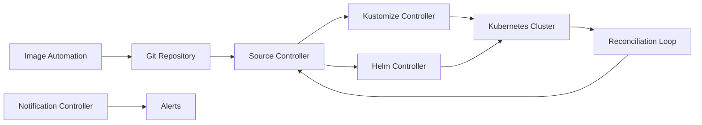

# Flux — A 2-Day Crash Course

> **In one sentence:** Flux is a GitOps operator for Kubernetes — it continuously reconciles your cluster state with your Git repository, pulling changes automatically rather than being pushed to. Prerequisite: know Kubernetes — see `Kubernetes.md`.

---

## Part 0 — Why Flux exists

Every team starts the same way: write a Kubernetes manifest, run `kubectl apply -f`, and move on. That works for three services. It falls apart at thirty.

The problems compound quickly. CI pipelines need cluster credentials stored as secrets — now your pipeline is a blast radius if those credentials leak. Developers apply hotfixes directly to production and forget to commit the change. Someone deletes a resource by accident. Your running cluster and your Git repo diverge silently until something breaks at 2 a.m.

The push model — where CI/CD tooling reaches into your cluster and applies changes — requires outbound firewall rules, stored credentials, and trust that every pipeline step executed exactly as intended. Auditing that is painful.

Flux inverts the model. The cluster reaches out to Git, not the other way around. Your cluster credentials never leave the cluster. Git becomes the single source of truth, and Flux continuously verifies that reality matches it. Drift is detected and corrected automatically. Every change is a Git commit — auditable, reversible, reviewable.

**Mental model:** Flux is an autopilot for your cluster — it watches your Git repo and Helm repos, detects changes, and applies them automatically, then keeps checking that reality matches the source of truth.

---




## Part 1 — The vocabulary

Before you touch a command, get these terms straight. They appear everywhere.

| Term | What it is |
|------|------------|
| **GitRepository** | A Flux CRD that tells the Source Controller where your Git repo lives and how to authenticate to it. Flux polls it on an interval. |
| **Kustomization** (Flux CRD) | A Flux CRD — distinct from the Kustomize `kustomization.yaml` — that tells the Kustomize Controller which path in a GitRepository to apply, on what interval, and with what health checks. |
| **HelmRelease** | A Flux CRD that tells the Helm Controller to install or upgrade a Helm chart at a specific version, with specific values. |
| **HelmRepository** | A Flux CRD pointing at a Helm chart repository (OCI or HTTP). The Source Controller fetches chart metadata from it. |
| **Source Controller** | Fetches and caches external sources — Git repos, Helm repos, OCI artifacts, S3 buckets. Other controllers consume what it produces. |
| **Kustomize Controller** | Reads a Kustomization CRD, builds the manifests (with or without Kustomize overlays), and applies them to the cluster. |
| **Helm Controller** | Reads HelmRelease CRDs and manages full Helm lifecycle — install, upgrade, rollback, uninstall. |
| **Notification Controller** | Routes events (reconciliation success, failure, drift detection) to external providers — Slack, Teams, PagerDuty, GitHub commit statuses. |
| **ImagePolicy** | A CRD that defines a filter (semver range, regex, alphabetical) over container image tags scanned from a registry. Feeds the Image Automation Controller. |
| **Reconciliation** | The continuous control loop Flux runs — compare desired state (Git) against actual state (cluster), and converge them. Runs on a configurable interval, typically 1–10 minutes. |

Flux is not one binary — it is a set of controllers, each responsible for a category of sources or actions. Understanding which controller owns which CRD saves you enormous debugging time.

---

## DAY 1 — Bootstrap and deploy

### 1. Prerequisites

You need:

- A Kubernetes cluster (kind, k3d, or cloud-managed — see `Kubernetes.md`)
- `kubectl` configured with cluster access
- The `flux` CLI installed
- A GitHub (or GitLab/Gitea/etc.) token with repo read/write access

Install the CLI:

```bash
# macOS
brew install fluxcd/tap/flux

# Linux
curl -s https://fluxcd.io/install.sh | sudo bash

# Verify
flux --version
```

Pre-flight check — Flux validates your cluster before bootstrapping:

```bash
flux check --pre
```

### 2. Bootstrap

Bootstrap installs Flux components into your cluster and commits them to a Git repository. From that point, Flux manages itself — if you change a Flux component manifest in Git, Flux updates itself.

```bash
flux bootstrap github \
  --owner=<your-github-org-or-user> \
  --repository=<your-fleet-repo> \
  --branch=main \
  --path=clusters/my-cluster \
  --personal
```

What this does:
- Creates the repo if it does not exist (or uses an existing one)
- Generates Flux component manifests under `clusters/my-cluster/flux-system/`
- Commits and pushes them
- Applies them to the cluster
- Flux then reconciles itself from Git — the loop is running

Inspect what got installed:

```bash
kubectl get pods -n flux-system
flux get all
```

You will see: `source-controller`, `kustomize-controller`, `helm-controller`, `notification-controller`, and optionally `image-automation-controller` and `image-reflector-controller`.

### 3. Connect a GitRepository

If your application manifests live in a separate repo from your fleet repo, create a GitRepository pointing at it:

```yaml
# apps/podinfo/source.yaml
apiVersion: source.toolkit.fluxcd.io/v1
kind: GitRepository
metadata:
  name: podinfo
  namespace: flux-system
spec:
  interval: 1m
  url: https://github.com/stefanprodan/podinfo
  ref:
    branch: master
```

Commit this to your fleet repo under `clusters/my-cluster/`. Flux picks it up automatically.

Check its status:

```bash
flux get sources git
```

### 4. Create a Kustomization

A Flux Kustomization wires a GitRepository to a path and tells the Kustomize Controller to apply it:

```yaml
# apps/podinfo/kustomization.yaml
apiVersion: kustomize.toolkit.fluxcd.io/v1
kind: Kustomization
metadata:
  name: podinfo
  namespace: flux-system
spec:
  interval: 5m
  path: ./kustomize
  prune: true
  sourceRef:
    kind: GitRepository
    name: podinfo
  targetNamespace: default
```

`prune: true` means resources removed from Git are also removed from the cluster. This is how Flux prevents drift accumulation.

Commit and push. Within the reconciliation interval, `podinfo` is running:

```bash
kubectl get pods -n default
flux get kustomizations
```

### 5. Watch reconciliation in action

Force an immediate reconciliation without waiting for the interval:

```bash
flux reconcile kustomization podinfo --with-source
```

Tail the Kustomize Controller logs directly:

```bash
flux logs --kind=Kustomization --name=podinfo --follow
```

Describe a specific Kustomization to see events, status, and last applied revision:

```bash
flux get kustomization podinfo -v
```

### 6. Core Day 1 commands

```bash
# List all Flux resources and their status
flux get all

# Get specific resource types
flux get sources git
flux get kustomizations
flux get helmreleases

# Force reconciliation
flux reconcile source git flux-system
flux reconcile kustomization podinfo

# View logs
flux logs --all-namespaces
flux logs --kind=Kustomization --name=podinfo

# Suspend reconciliation (pause without deleting)
flux suspend kustomization podinfo

# Resume
flux resume kustomization podinfo
```

**By end of Day 1 you can:**
- Bootstrap Flux into a cluster and have it self-manage from Git
- Define a GitRepository source pointing at an application repo
- Deploy an application via a Flux Kustomization
- Force reconciliation and read its status
- Suspend and resume reconciliation for maintenance

---

## DAY 2 — Make it real

### 1. Helm releases

For applications distributed as Helm charts, use HelmRelease instead of Kustomization. First define a HelmRepository:

```yaml
apiVersion: source.toolkit.fluxcd.io/v1
kind: HelmRepository
metadata:
  name: ingress-nginx
  namespace: flux-system
spec:
  interval: 1h
  url: https://kubernetes.github.io/ingress-nginx
```

Then a HelmRelease that references it:

```yaml
apiVersion: helm.toolkit.fluxcd.io/v2
kind: HelmRelease
metadata:
  name: ingress-nginx
  namespace: ingress-nginx
spec:
  interval: 30m
  chart:
    spec:
      chart: ingress-nginx
      version: ">=4.0.0 <5.0.0"
      sourceRef:
        kind: HelmRepository
        name: ingress-nginx
        namespace: flux-system
  values:
    controller:
      replicaCount: 2
  install:
    remediation:
      retries: 3
  upgrade:
    remediation:
      retries: 3
      remediateLastFailure: true
    cleanupOnFail: true
```

Flux handles install, upgrade, and — if a release fails — automatic rollback. The `remediation` block controls retry behavior before Flux gives up or rolls back.

For values that are environment-specific, use `valuesFrom` to reference a ConfigMap or Secret:

```yaml
  valuesFrom:
    - kind: ConfigMap
      name: ingress-nginx-values
    - kind: Secret
      name: ingress-nginx-secrets
      optional: true
```

### 2. Multi-tenancy

In a shared cluster, different teams own different namespaces. Flux supports this via tenant isolation: each team gets a ServiceAccount with limited RBAC, and their Kustomizations run as that ServiceAccount.

```yaml
apiVersion: kustomize.toolkit.fluxcd.io/v1
kind: Kustomization
metadata:
  name: team-alpha-apps
  namespace: flux-system
spec:
  serviceAccountName: team-alpha
  targetNamespace: team-alpha
  sourceRef:
    kind: GitRepository
    name: team-alpha-repo
  path: ./apps
  interval: 5m
  prune: true
```

The `team-alpha` ServiceAccount only has permissions in `team-alpha` namespace. Even if a team member pushes a manifest targeting `kube-system`, Flux rejects it. See the Flux multi-tenancy guide for the full RBAC setup — the scaffold is a `flux bootstrap` flag: `--network-policy=true`.

### 3. Image automation

This is one of Flux's most powerful — and most misunderstood — features. The goal: when a new container image tag is pushed to a registry, Flux automatically updates the image tag in Git, which triggers a normal reconciliation and deploys the new image.

Three components work together:

**ImageRepository** — scans a container registry for available tags:

```yaml
apiVersion: image.toolkit.fluxcd.io/v1beta2
kind: ImageRepository
metadata:
  name: podinfo
  namespace: flux-system
spec:
  image: ghcr.io/stefanprodan/podinfo
  interval: 1m
```

**ImagePolicy** — filters which tag to select:

```yaml
apiVersion: image.toolkit.fluxcd.io/v1beta2
kind: ImagePolicy
metadata:
  name: podinfo
  namespace: flux-system
spec:
  imageRepositoryRef:
    name: podinfo
  policy:
    semver:
      range: ">=6.0.0 <7.0.0"
```

**ImageUpdateAutomation** — writes the selected tag back to Git:

```yaml
apiVersion: image.toolkit.fluxcd.io/v1beta1
kind: ImageUpdateAutomation
metadata:
  name: flux-system
  namespace: flux-system
spec:
  interval: 1m
  sourceRef:
    kind: GitRepository
    name: flux-system
  git:
    commit:
      author:
        email: fluxcdbot@users.noreply.github.com
        name: fluxcdbot
      messageTemplate: |
        Auto-update images to {{range .Updated.Images}}{{println .}}{{end}}
    push:
      branch: main
  update:
    path: ./clusters/my-cluster
    strategy: Setters
```

In your deployment manifest, mark the image field with a comment marker so Flux knows where to write:

```yaml
image: ghcr.io/stefanprodan/podinfo:6.0.0 # {"$imagepolicy": "flux-system:podinfo"}
```

Flux scans the registry, finds a newer tag matching the policy, updates the YAML in Git, commits, pushes, and then reconciles the change into the cluster. The entire cycle is auditable in Git history.

⚠️ Image automation requires the `image-reflector-controller` and `image-automation-controller` — they are not installed by default. Add `--components-extra=image-reflector-controller,image-automation-controller` to your bootstrap command.

### 4. Notifications

Flux can emit events to Slack, Teams, Discord, GitHub, PagerDuty, and others via the Notification Controller.

Define a Provider — where to send notifications:

```yaml
apiVersion: notification.toolkit.fluxcd.io/v1beta3
kind: Provider
metadata:
  name: slack-bot
  namespace: flux-system
spec:
  type: slack
  channel: deployments
  secretRef:
    name: slack-bot-token
```

Define an Alert — what events to send:

```yaml
apiVersion: notification.toolkit.fluxcd.io/v1beta3
kind: Alert
metadata:
  name: on-call-slack
  namespace: flux-system
spec:
  providerRef:
    name: slack-bot
  eventSeverity: error
  eventSources:
    - kind: GitRepository
      name: "*"
    - kind: Kustomization
      name: "*"
    - kind: HelmRelease
      name: "*"
```

`eventSeverity: info` floods your channel. Start with `error` and add `info` selectively for specific resources. For GitHub commit statuses — useful in PRs — use `type: github` and provide a GitHub token with `repo:status` scope.

### 5. Health checks and remediation

Flux can wait for resources to become healthy before declaring a reconciliation successful. Add health checks to your Kustomization:

```yaml
spec:
  healthChecks:
    - apiVersion: apps/v1
      kind: Deployment
      name: podinfo
      namespace: default
  timeout: 2m
```

If the Deployment does not reach `Available` within the timeout, the Kustomization reports `False` on its `Ready` condition. Combine with notifications to get alerted.

For HelmRelease, the `remediation` block handles automatic rollback on upgrade failure. Set `retries: -1` for infinite retries — useful for infrastructure charts that may take longer on first install.

### 6. Secrets management

Flux does not manage secret values — it manages secret manifests. Two common approaches:

**SOPS** (Secrets OPerationS) — encrypts secret values in Git using age or PGP. Flux's Kustomize Controller has native SOPS decryption built in:

```yaml
# In your Kustomization
spec:
  decryption:
    provider: sops
    secretRef:
      name: sops-age  # Secret containing your age private key
```

Encrypt a secret before committing:

```bash
sops --age=<age-public-key> --encrypt --encrypted-regex '^(data|stringData)$' \
  --in-place secret.yaml
```

The encrypted file is safe to commit. Flux decrypts it at apply time inside the cluster.

**Sealed Secrets** — a controller that decrypts SealedSecret CRDs into regular Secrets using a cluster-side key pair. The `kubeseal` CLI encrypts secrets using the cluster's public key. Only the cluster can decrypt them. See the Bitnami Sealed Secrets project for setup.

Both approaches achieve the same goal: secret values never travel over the wire unencrypted and are never stored in plaintext in Git.

### 7. Multi-cluster

Flux runs per-cluster — you bootstrap it independently into each cluster. The recommended pattern is a single fleet repo with a directory per cluster:

```
clusters/
├── production/
│   ├── flux-system/
│   └── apps/
├── staging/
│   ├── flux-system/
│   └── apps/
└── development/
    ├── flux-system/
    └── apps/
```

Each cluster's Flux instance only watches its own path. Shared base manifests live in an `infrastructure/` directory and are referenced by Kustomize overlays in each cluster path.

### 8. Dependency ordering

By default, Flux reconciles all Kustomizations in a namespace in parallel. Sometimes you need ordering — infrastructure before apps, cert-manager before anything that needs certificates.

Use `dependsOn`:

```yaml
apiVersion: kustomize.toolkit.fluxcd.io/v1
kind: Kustomization
metadata:
  name: apps
  namespace: flux-system
spec:
  dependsOn:
    - name: infrastructure
  sourceRef:
    kind: GitRepository
    name: flux-system
  path: ./clusters/my-cluster/apps
  interval: 10m
  prune: true
```

`apps` will not reconcile until `infrastructure` reports `Ready: True`. This applies to HelmRelease as well — add `dependsOn` to sequence Helm chart installs.

### 9. Monitoring Flux itself

Flux exposes Prometheus metrics from every controller. The flux-monitoring community repo provides ready-made Grafana dashboards and a Kube-Prometheus-Stack HelmRelease.

Key metrics to watch:

- `gotk_reconcile_duration_seconds` — how long reconciliation takes per controller and resource
- `gotk_reconcile_condition` — `Ready` (1) or not (0) per resource
- `controller_runtime_reconcile_errors_total` — reconciliation error count

For a quick health overview without Prometheus:

```bash
flux stats
flux get all --all-namespaces
```

See `Prometheus.md` and `Grafana.md` for the full observability stack.

---

## Worked example — Multi-environment GitOps

This example shows a mono-repo serving three environments: development, staging, production. Application base manifests are shared; environment-specific values are in overlays.

### Repository structure

```
fleet-repo/
├── clusters/
│   ├── development/
│   │   ├── flux-system/      # bootstrapped by Flux
│   │   └── apps.yaml         # Flux Kustomization pointing at apps/overlays/development
│   ├── staging/
│   │   ├── flux-system/
│   │   └── apps.yaml
│   └── production/
│       ├── flux-system/
│       └── apps.yaml
├── apps/
│   ├── base/
│   │   └── podinfo/
│   │       ├── deployment.yaml
│   │       ├── service.yaml
│   │       └── kustomization.yaml
│   └── overlays/
│       ├── development/
│       │   └── podinfo/
│       │       └── kustomization.yaml   # patches: replicas=1, image tag from ImagePolicy
│       ├── staging/
│       │   └── podinfo/
│       │       └── kustomization.yaml   # patches: replicas=2
│       └── production/
│           └── podinfo/
│               └── kustomization.yaml   # patches: replicas=3, resource limits
```

### Cluster Kustomization (apps.yaml)

Each cluster has one Flux Kustomization that points at its overlay path:

```yaml
# clusters/production/apps.yaml
apiVersion: kustomize.toolkit.fluxcd.io/v1
kind: Kustomization
metadata:
  name: apps
  namespace: flux-system
spec:
  interval: 10m
  path: ./apps/overlays/production
  prune: true
  sourceRef:
    kind: GitRepository
    name: flux-system
  dependsOn:
    - name: infrastructure
  healthChecks:
    - apiVersion: apps/v1
      kind: Deployment
      name: podinfo
      namespace: default
```

### Automated image updates per environment

In development, enable ImageUpdateAutomation pushing to `main`. In staging and production, restrict updates to specific branches or require a PR — configure the `push.branch` in the ImageUpdateAutomation to target a branch per environment, then use a `GitHub-Actions.md` workflow to auto-merge staging and require manual approval for production.

This gives you: fully automated development, one-click promotion to staging, manual gate to production — all driven by Git.

---

## Common pitfalls

- **Confusing Flux Kustomization with Kustomize kustomization.yaml.** They are different objects. A Flux `Kustomization` CRD has `kind: Kustomization` in `kustomize.toolkit.fluxcd.io/v1`. A Kustomize `kustomization.yaml` is a plain file in your directory. Flux uses both — the CRD tells it what to do, the file tells Kustomize how to build it.

- **Setting `prune: false` in production "to be safe."** Without `prune: true`, deleted manifests accumulate in your cluster silently. Drift becomes unmanageable. Use `prune: true` everywhere and trust Git as the source of truth.

- **Storing encrypted secrets without testing decryption in CI.** You add SOPS-encrypted secrets to Git and bootstrap — only to find at 2 a.m. that the age key was not imported into the `sops-age` Secret in the cluster. Test your decryption path before relying on it.

- **Image automation writing to a protected branch.** If your `main` branch requires PR reviews, `ImageUpdateAutomation` commits will fail. Either allow the Flux bot token to bypass branch protection, or configure `push.branch` to a staging branch and automate the PR.

- **Forgetting `dependsOn` for cert-manager.** Ingress resources with TLS annotations will fail if cert-manager is not fully ready. Always sequence cert-manager before any app that uses it.

- **Reconciliation interval too short on large repos.** A 30-second interval on a monorepo with thousands of files causes constant Source Controller load. Start at 1–5 minutes and reduce only if you have a specific requirement.

- **Not reading Flux events.** `flux get kustomizations` shows a truncated status. `kubectl describe kustomization podinfo -n flux-system` shows the full event log. Many debugging sessions end here.

- **Ignoring the `flux check` command.** Before filing a bug or escalating an incident, run `flux check` — it validates API compatibility, controller health, and prerequisite versions.

- **Helm values drift.** If someone edits a HelmRelease's values but the chart version pin does not change, Flux will reconcile the values on the next interval. This is correct behavior — but it surprises teams who manually edited Helm values directly via `helm upgrade`. Flux owns Helm releases it manages; do not touch them with the Helm CLI.

---

## Quick command reference

```bash
# Bootstrap
flux bootstrap github \
  --owner=<org> --repository=<repo> \
  --branch=main --path=clusters/my-cluster --personal

# Install Flux without Git (for testing)
flux install

# Check prerequisites and controller health
flux check
flux check --pre

# List all managed resources
flux get all
flux get all --all-namespaces

# Get specific resource types
flux get sources git
flux get sources helm
flux get sources oci
flux get kustomizations
flux get helmreleases
flux get images repository
flux get images policy
flux get images update

# Reconcile (force sync from source)
flux reconcile source git flux-system
flux reconcile kustomization podinfo --with-source
flux reconcile helmrelease ingress-nginx --with-source

# Suspend and resume
flux suspend kustomization podinfo
flux resume kustomization podinfo
flux suspend helmrelease ingress-nginx
flux resume helmrelease ingress-nginx

# Logs
flux logs --all-namespaces
flux logs --kind=Kustomization --name=podinfo
flux logs --kind=HelmRelease --name=ingress-nginx --follow

# Export a resource manifest
flux export source git flux-system
flux export kustomization podinfo
flux export helmrelease ingress-nginx

# Create resources imperatively (generates YAML — pipe to a file)
flux create source git podinfo \
  --url=https://github.com/stefanprodan/podinfo \
  --branch=master \
  --interval=1m \
  --export > podinfo-source.yaml

flux create kustomization podinfo \
  --source=GitRepository/podinfo \
  --path=./kustomize \
  --prune=true \
  --interval=5m \
  --export > podinfo-kustomization.yaml

# Diff — show what Flux would apply without applying it
flux diff kustomization podinfo

# Stats
flux stats

# Uninstall Flux (leaves CRDs and objects — add --crds to remove all)
flux uninstall
```

---

## Top 10 Interview Questions

<details>
<summary><strong>Q: How does Flux differ from a traditional CI/CD push model?</strong></summary>

In a push model, the CI pipeline holds cluster credentials and runs `kubectl apply` from outside. Flux inverts this — the controller runs inside the cluster and pulls from Git. Cluster credentials never leave the cluster, the attack surface is smaller, and drift is continuously corrected rather than detected only at deploy time.

</details>

<details>
<summary><strong>Q: What is the difference between a Flux Kustomization CRD and a Kustomize kustomization.yaml?</strong></summary>

A Flux `Kustomization` (API group `kustomize.toolkit.fluxcd.io`) is a CRD that tells the Kustomize Controller which Git path to apply on what interval with what health checks. A Kustomize `kustomization.yaml` is a plain file that instructs the `kustomize` tool how to assemble manifests. Flux uses both — the CRD points to a path, and Kustomize renders that path.

</details>

<details>
<summary><strong>Q: How does Flux handle Helm releases, and what happens on a failed upgrade?</strong></summary>

Flux's Helm Controller reads `HelmRelease` CRDs and manages the full lifecycle — install, upgrade, test, rollback. If an upgrade fails, the `remediation` block controls retry count and whether to roll back to the last successful release. Set `remediateLastFailure: true` and a retry count to get automatic rollback on failure.

</details>

<details>
<summary><strong>Q: How do you manage secrets in a Flux GitOps workflow?</strong></summary>

Two main approaches: SOPS encrypts secret values in Git using age or PGP keys — Flux's Kustomize Controller has native SOPS decryption. Alternatively, Sealed Secrets uses a cluster-side key pair to decrypt `SealedSecret` CRDs. In both cases, plaintext secrets never appear in Git or travel over the wire unencrypted.

</details>

<details>
<summary><strong>Q: What is image automation in Flux and how does it work?</strong></summary>

Three components collaborate: `ImageRepository` scans a container registry for tags, `ImagePolicy` selects the desired tag (by semver, regex, or alphabetical filter), and `ImageUpdateAutomation` writes the selected tag back to Git via a commit. Flux then reconciles that commit into the cluster. The entire cycle is auditable in Git history.

</details>

<details>
<summary><strong>Q: How does Flux handle multi-cluster deployments?</strong></summary>

Flux runs per-cluster — you bootstrap it independently into each cluster. The recommended pattern is a single fleet repo with a directory per cluster (`clusters/production/`, `clusters/staging/`). Each Flux instance watches only its own path. Shared base manifests live in a common directory and are referenced via Kustomize overlays.

</details>

<details>
<summary><strong>Q: What does `prune: true` do and why should you always enable it?</strong></summary>

When `prune: true` is set on a Kustomization, resources removed from Git are also removed from the cluster. Without it, deleted manifests silently accumulate as orphaned resources, creating drift between Git and reality. Pruning is essential for Git to be the genuine single source of truth.

</details>

<details>
<summary><strong>Q: How do you enforce multi-tenancy and RBAC with Flux?</strong></summary>

Each tenant gets a dedicated ServiceAccount with RBAC limited to their namespace. Their Flux Kustomization runs under that ServiceAccount via `serviceAccountName`. Even if a team pushes a manifest targeting another namespace, Flux rejects it because the ServiceAccount lacks permissions. The bootstrap flag `--network-policy=true` adds network isolation.

</details>

<details>
<summary><strong>Q: How does Flux compare to Argo CD?</strong></summary>

Both are pull-based GitOps controllers. Flux is a set of composable Kubernetes controllers with no UI — it is more Kubernetes-native and favours the CLI and API. Argo CD has a rich UI, Application and AppProject abstractions, and an opinionated sync model. Flux is often preferred for headless multi-cluster automation; Argo CD for teams that value a visual dashboard.

</details>

<details>
<summary><strong>Q: How do you debug a Flux reconciliation failure?</strong></summary>

Start with `flux get kustomizations` or `flux get helmreleases` for a quick status. For detailed events, use `kubectl describe kustomization <name> -n flux-system`. Check controller logs with `flux logs --kind=Kustomization --name=<name>`. Run `flux check` to validate controller health and API compatibility before escalating.

</details>

---

## Next steps after Day 2

- `ArgoCD.md` — Flux's main alternative; pull-based like Flux but with a UI and a different reconciliation model. Worth understanding the tradeoffs.
- `Kubernetes.md` — Deepen your understanding of RBAC, namespaces, and health conditions — all directly relevant to Flux multi-tenancy and health checks.
- `Helm.md` — Learn Helm chart authoring and the full values hierarchy so you get the most out of HelmRelease and `valuesFrom`.
- `Kustomize.md` — Understand patches, overlays, and strategic merge so your base/overlay structure is maintainable at scale.
- `Git.md` — Flux is only as good as your Git hygiene. Branch strategies, commit conventions, and protected branches all affect how Flux behaves.
- `GitHub-Actions.md` — Combine push-based CI (build, test, push image) with pull-based CD (Flux reconciles) for a complete pipeline without cluster credentials in your CI environment.

---

## Recommended learning resources

**YouTube channels & playlists:**
- [DevOps Toolkit — Flux and GitOps](https://www.youtube.com/@DevOpsToolkit) — Viktor Farcic's comparisons of Flux vs ArgoCD and GitOps deep dives
- [CNCF — Flux talks from KubeCon](https://www.youtube.com/@cncf) — maintainer presentations on Flux v2 architecture, multi-tenancy, and SOPS integration
- [TechWorld with Nana — GitOps with Flux](https://www.youtube.com/@TechWorldwithNana) — beginner walkthrough of Flux bootstrap and reconciliation
- [Weaveworks — Flux tutorials](https://www.youtube.com/@intaborweave) — original creators of Flux covering real-world GitOps patterns
- [Fireship — GitOps explained](https://www.youtube.com/@Fireship) — quick conceptual overview of GitOps and pull-based deployment

**Official docs & blogs:**
- [Flux Official Documentation](https://fluxcd.io/docs/)
- [Weaveworks Blog — GitOps and Flux](https://www.weave.works/blog/) — in-depth guides on Flux patterns, SOPS encryption, and multi-cluster GitOps

---

**The mantra:** Git is the source of truth — if it is not in Git, it is not in your cluster.
