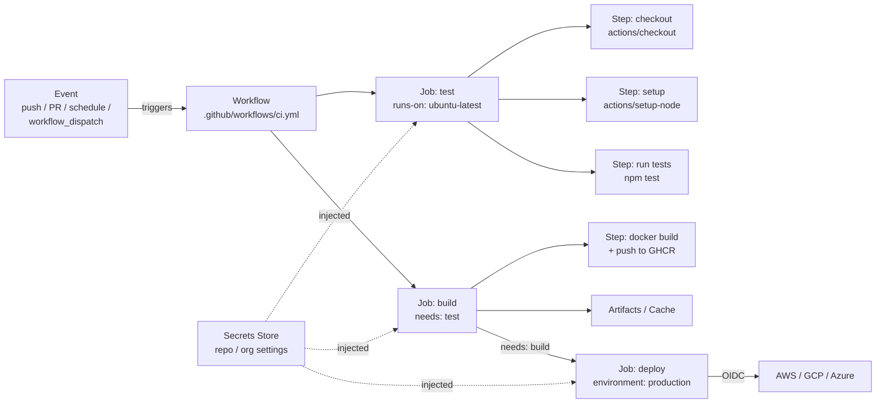

# GitHub Actions — A 2-Day Crash Course

> **In one sentence:** GitHub Actions runs your build/test/deploy automation directly in your
> GitHub repo — you drop a YAML file in `.github/workflows/`, and GitHub runs it on a fresh
> machine whenever events happen (a push, a PR, a schedule).

---

## Part 0 — Why CI/CD exists, and why Actions

**Continuous Integration (CI)** means: every time someone pushes code, automatically build it and
run the tests, so bugs are caught in minutes — not after they've merged and broken everyone.
**Continuous Delivery/Deployment (CD)** extends that to automatically shipping the code that
passes. The goal is to make integrating and releasing changes boring, frequent, and safe.

GitHub Actions is CI/CD built into GitHub itself. There's no separate server to run — you commit
a workflow file and GitHub provisions clean, ephemeral VMs ("runners") to execute it on the
events you choose. Its other superpower is the **Marketplace**: thousands of pre-built "actions"
(reusable steps) so you rarely write automation from scratch — you compose existing pieces.

**Mental model:** a **workflow** is a recipe triggered by an **event**. It contains **jobs**
(which run on separate fresh machines, in parallel by default), and each job is a list of
**steps** (shell commands or reusable actions) run in order. Event → workflow → jobs → steps.



---

## Part 1 — The vocabulary

| Term | Meaning |
|------|---------|
| **Workflow** | A YAML file in `.github/workflows/` defining the automation |
| **Event** | What triggers it (`push`, `pull_request`, `schedule`, `workflow_dispatch`) |
| **Job** | A set of steps that run on one fresh runner; jobs run in parallel unless chained |
| **Step** | A single unit in a job — either a shell command (`run:`) or an action (`uses:`) |
| **Action** | A reusable, packaged step from the Marketplace (e.g. `actions/checkout`) |
| **Runner** | The machine a job runs on (GitHub-hosted `ubuntu-latest`, or self-hosted) |
| **Secret** | Encrypted credential injected at runtime (`${{ secrets.X }}`) |

---

## DAY 1 — Get it working

### 1. Your first workflow
Create `.github/workflows/ci.yml`:
```yaml
name: CI                          # shown in the Actions tab
on: [push, pull_request]          # EVENTS that trigger this workflow

jobs:
  test:                           # job id
    runs-on: ubuntu-latest        # fresh GitHub-hosted runner
    steps:
      - uses: actions/checkout@v4         # ACTION: clone your repo onto the runner
      - uses: actions/setup-node@v4       # ACTION: install Node
        with: { node-version: '20' }
      - run: npm ci                       # SHELL command: install deps
      - run: npm test                     # SHELL command: run tests
```
Commit and push. Go to the repo's **Actions** tab — you'll see the run execute live, step by
step. That's CI: every push now runs your tests automatically.

### 2. Read the structure (the four nested levels)
```
workflow (ci.yml)
└── on: events that trigger it
└── jobs:
    └── test: (runs on its own fresh machine)
        └── steps: (run top-to-bottom on that machine)
            - uses: ...   (a reusable action)
            - run: ...    (a shell command)
```
Key facts that trip up beginners:
- **`uses:`** pulls in a prebuilt action (from the Marketplace or another repo). **`run:`**
  executes shell. A step is one or the other.
- **`actions/checkout` is almost always your first step** — the runner starts *empty*, without
  even your code, until you check it out.
- Each **job gets a brand-new, clean machine.** Two jobs don't share files unless you explicitly
  pass artifacts between them.

### 3. Common events (when workflows run)
```yaml
on:
  push:
    branches: [main]                  # only pushes to main
    paths: ['src/**']                 # only when files under src/ change
  pull_request:
    branches: [main]                  # on PRs targeting main
  schedule:
    - cron: '0 2 * * *'               # nightly at 02:00 UTC
  workflow_dispatch:                  # a manual "Run workflow" button in the UI
```
`workflow_dispatch` (manual trigger) and `schedule` (cron) are extremely useful beyond push/PR.

### 4. Use the Marketplace (don't reinvent)
Need to set up Python, log in to AWS, build a Docker image, deploy to somewhere? There's an
action. `uses: owner/action@version` — always **pin to a version** (`@v4`, or better a commit
SHA for security). The Marketplace is why most workflows are just a handful of `uses:` lines.

**By end of Day 1 you can:** write a workflow, trigger it on push/PR/schedule/manual, use
Marketplace actions, run shell steps, and read the live logs. That's real CI.

---

## DAY 2 — Make it real

### 1. Secrets and variables (never hardcode credentials)
Store secrets in the repo/org settings (**Settings → Secrets and variables → Actions**), then
reference them — they're masked in logs:
```yaml
steps:
  - run: ./deploy.sh
    env:
      AWS_ACCESS_KEY_ID: ${{ secrets.AWS_ACCESS_KEY_ID }}
      API_TOKEN: ${{ secrets.API_TOKEN }}
```
> Relevant to your habit of pasting secrets in plaintext: put them in **Actions secrets** (or use
> OIDC, below) — never in the YAML, never echoed to logs.

**Even better — OIDC, no stored cloud keys at all.** GitHub can hand the job a short-lived token
that your cloud trusts, so you store *zero* long-lived credentials:
```yaml
permissions:
  id-token: write
  contents: read
steps:
  - uses: aws-actions/configure-aws-credentials@v4
    with:
      role-to-assume: arn:aws:iam::123456789012:role/github-deploy
      aws-region: us-east-1
```

### 2. Job dependencies, matrices, and parallelism
Jobs run in parallel by default. Chain them with `needs:`; fan out with a **matrix**:
```yaml
jobs:
  test:
    strategy:
      matrix:                         # run the job once per combination
        node: [18, 20, 22]
        os: [ubuntu-latest, windows-latest]
    runs-on: ${{ matrix.os }}
    steps:
      - uses: actions/checkout@v4
      - uses: actions/setup-node@v4
        with: { node-version: ${{ matrix.node }} }
      - run: npm test

  deploy:
    needs: test                       # only runs if ALL test matrix jobs pass
    if: github.ref == 'refs/heads/main'   # and only on main
    runs-on: ubuntu-latest
    steps:
      - run: ./deploy.sh
```
The matrix above runs your tests across 3 Node versions × 2 OSes in parallel — huge for catching
environment-specific bugs.

### 3. Caching and artifacts (speed + passing data between jobs)
```yaml
# cache dependencies to speed up runs
- uses: actions/cache@v4
  with:
    path: ~/.npm
    key: npm-${{ hashFiles('**/package-lock.json') }}

# pass build output from one job to another (jobs have separate machines!)
- uses: actions/upload-artifact@v4
  with: { name: build, path: dist/ }
# ...in a later job:
- uses: actions/download-artifact@v4
  with: { name: build }
```
Caching cuts minutes off every run; artifacts are how a `build` job hands `dist/` to a `deploy`
job (they don't share a filesystem).

### 4. Environments & approvals (gating production)
Define **environments** (Settings → Environments) with protection rules — required reviewers,
wait timers, branch restrictions — and reference them in the deploy job:
```yaml
deploy-prod:
  environment: production            # triggers the env's protection rules (e.g. manual approval)
  needs: test
  runs-on: ubuntu-latest
  steps: [ { run: ./deploy.sh prod } ]
```
Now a deploy to `production` pauses for a human approval before running. This is how you add
safety to CD.

### 5. Build & push a container (the most common real pipeline)
```yaml
- uses: docker/setup-buildx-action@v3
- uses: docker/login-action@v3
  with:
    registry: ghcr.io
    username: ${{ github.actor }}
    password: ${{ secrets.GITHUB_TOKEN }}     # auto-provided token, scoped to the repo
- uses: docker/build-push-action@v6
  with:
    push: true
    tags: ghcr.io/${{ github.repository }}:${{ github.sha }}
```
`${{ secrets.GITHUB_TOKEN }}` is auto-created per run — no setup needed for repo-scoped actions
like pushing to GHCR.

### 6. Contexts & expressions (the `${{ }}` language)
```yaml
${{ github.sha }}          # the commit SHA          ${{ github.ref }}   # the branch/tag ref
${{ github.actor }}        # who triggered it         ${{ github.event_name }}
${{ secrets.NAME }}        ${{ vars.NAME }}           ${{ env.NAME }}
${{ matrix.node }}         ${{ needs.test.outputs.x }}
if: ${{ github.event_name == 'push' && github.ref == 'refs/heads/main' }}
```
`if:` conditions on jobs/steps let you run things only on certain branches/events.

---

## Worked example — test, build image, deploy to prod with approval
```text
1. on: push to main + pull_request.
2. job "test": matrix across Node 18/20/22; npm ci; npm test; cache ~/.npm.
3. job "build" (needs: test): docker build-push to ghcr.io/...:${{ github.sha }}.
4. job "deploy" (needs: build, environment: production): pauses for reviewer approval,
   then uses OIDC to assume an AWS role (no stored keys) and rolls out the new image.
5. On a PR, only test runs (no deploy). On merge to main, the whole chain runs.
```

---

## Common pitfalls
- **Forgetting `actions/checkout`.** The runner has no code until you check it out — "file not
  found" on step one.
- **Expecting jobs to share files.** Separate machines. Use artifacts (or combine into one job).
- **Hardcoding secrets in YAML.** Use Actions secrets or OIDC; secrets are masked, plaintext in
  YAML is exposed forever in Git history.
- **Unpinned action versions.** `uses: owner/action@main` can change under you (and is a supply-
  chain risk). Pin `@v4` or a commit SHA.
- **Over-broad `permissions`.** The default `GITHUB_TOKEN` can be powerful; set least-privilege
  `permissions:` per workflow/job.
- **No `if:`/branch guards on deploy.** Without `if: github.ref == 'refs/heads/main'`, you deploy
  from every branch/PR.
- **Slow runs from no caching.** Reinstalling deps every run wastes minutes (and money). Cache.

---

## Quick reference
```yaml
# Skeleton
name: CI
on:
  push: { branches: [main], paths: ['src/**'] }
  pull_request: { branches: [main] }
  schedule: [ { cron: '0 2 * * *' } ]
  workflow_dispatch:
permissions: { contents: read, id-token: write }
jobs:
  build:
    runs-on: ubuntu-latest
    strategy: { matrix: { v: [18, 20] }, fail-fast: false }
    steps:
      - uses: actions/checkout@v4
      - run: make test
    outputs: { tag: ${{ steps.x.outputs.tag }} }
  deploy:
    needs: build
    if: github.ref == 'refs/heads/main'
    environment: production
    runs-on: ubuntu-latest
    steps: [ { run: ./deploy.sh } ]
```
```text
Common actions:  actions/checkout · actions/setup-{node,python,go,java} ·
  actions/cache · actions/upload-artifact · actions/download-artifact ·
  docker/{login,build-push}-action · aws-actions/configure-aws-credentials (OIDC)
Contexts:  github.* · secrets.* · vars.* · env.* · matrix.* · needs.<job>.outputs.*
Step types:  uses: owner/action@vX   |   run: shell command
Useful:  continue-on-error · timeout-minutes · concurrency · defaults.run.shell
```

---

## Top 10 Interview Questions

<details>
<summary><strong>Q: What is the relationship between workflows, jobs, steps, and actions in GitHub Actions?</strong></summary>

A workflow is a YAML file in `.github/workflows/` triggered by events. It contains one or more jobs, each running on a separate fresh runner (virtual machine). Each job has a sequence of steps executed top-to-bottom on that runner. A step is either a shell command (`run:`) or a reusable action (`uses:`). Jobs run in parallel by default unless chained with `needs:`. This hierarchy — event triggers workflow, workflow contains jobs, jobs contain steps — is the core mental model.

</details>

<details>
<summary><strong>Q: How do you securely handle credentials in GitHub Actions workflows?</strong></summary>

Store secrets in the repository or organization settings under Settings > Secrets and Variables > Actions. Reference them as `${{ secrets.NAME }}` — they are automatically masked in logs. For cloud providers, prefer OIDC (OpenID Connect) over stored long-lived keys: configure the cloud to trust GitHub's identity provider, and the job receives a short-lived token with no stored credentials at all. Never hardcode secrets in YAML — they persist in Git history forever.

</details>

<details>
<summary><strong>Q: What is a matrix strategy, and when would you use it?</strong></summary>

A matrix strategy runs the same job multiple times with different parameter combinations. For example, `matrix: { node: [18, 20, 22], os: [ubuntu-latest, windows-latest] }` creates 6 parallel jobs covering every combination. This is essential for testing across multiple language versions, operating systems, or dependency versions to catch environment-specific bugs. `fail-fast: false` ensures all combinations run even if one fails, giving you complete coverage information.

</details>

<details>
<summary><strong>Q: Why do you need `actions/checkout` as the first step, and what happens without it?</strong></summary>

Each job runs on a fresh, empty runner — your repository code is not present by default. `actions/checkout` clones your repository onto the runner so subsequent steps can access your code, tests, and configuration. Without it, any step that references your files will fail with "file not found." This catches many beginners off guard because they assume the runner starts with their code, but it is by design — the runner is ephemeral and clean.

</details>

<details>
<summary><strong>Q: How do you pass data between jobs, given that each job runs on a separate machine?</strong></summary>

Two mechanisms: **artifacts** and **outputs**. Use `actions/upload-artifact` to save files (build output, test reports) from one job, then `actions/download-artifact` to retrieve them in a dependent job. For small values (a version string, a computed tag), use job outputs — set a value in a step with `echo "key=value" >> $GITHUB_OUTPUT`, declare it in the job's `outputs:` block, and access it in dependent jobs via `${{ needs.jobid.outputs.key }}`.

</details>

<details>
<summary><strong>Q: What are reusable workflows and composite actions, and how do they differ?</strong></summary>

Reusable workflows (triggered by `workflow_call`) are entire workflow files that other workflows can call — they run as a separate workflow with their own jobs and runners. Composite actions are custom actions defined in `action.yml` that bundle multiple steps into a single reusable step. Use reusable workflows to standardize entire CI/CD pipelines across an organization. Use composite actions to package a sequence of steps (e.g. "build and push a container") into a single step that any workflow can reference.

</details>

<details>
<summary><strong>Q: What are environments in GitHub Actions, and how do they enable safe continuous deployment?</strong></summary>

Environments (configured in Settings > Environments) attach protection rules to deployment jobs — required reviewers, wait timers, and branch restrictions. When a job references `environment: production`, it pauses for manual approval before running. This lets you build a full CD pipeline where test and build jobs run automatically, but the production deploy waits for a human gate. Combined with branch protection rules, this ensures only reviewed, tested code reaches production.

</details>

<details>
<summary><strong>Q: How does caching work in GitHub Actions, and why is it important?</strong></summary>

`actions/cache` stores and restores directories (like `~/.npm`, `~/.m2`, `node_modules`) between workflow runs, keyed by a hash of lock files. On a cache hit, dependency installation is skipped or drastically faster. Without caching, every run downloads and installs all dependencies from scratch, wasting minutes and compute costs. The cache is scoped to the branch (with fallback to the default branch) and has a 10 GB per-repo limit with LRU eviction.

</details>

<details>
<summary><strong>Q: What are self-hosted runners, and when would you choose them over GitHub-hosted runners?</strong></summary>

Self-hosted runners are machines you manage (physical, VM, or container) that register with GitHub and pick up jobs. Choose them when you need access to private networks (on-prem databases, internal APIs), specific hardware (GPUs, ARM), compliance requirements (data must not leave your infrastructure), or when GitHub-hosted runner costs are prohibitive for heavy workloads. The trade-off is you manage patching, scaling, and security — and you must be careful that workflows from forks cannot run on them (security risk).

</details>

<details>
<summary><strong>Q: How do you prevent a workflow from deploying on every branch and only deploy from main?</strong></summary>

Use `if:` conditions on the deploy job: `if: github.ref == 'refs/heads/main'` ensures the job only runs when the push is to main. Combine this with event filters — `on: push: branches: [main]` limits the entire workflow, or use `on: [push, pull_request]` with the `if:` condition only on the deploy job so tests still run on PRs. Additionally, environment protection rules can restrict which branches are allowed to deploy to production, providing a second layer of safety.

</details>

---


## Quick Quiz

Test your understanding with these rapid-fire questions (answers hidden):

<details>
<summary>1. What is the ONE core problem that GitHub Actions solves?</summary>
Re-read Part 0 — the mental model section. If you can explain the "why" in one sentence, you understand the foundation.
</details>

<details>
<summary>2. Name the 3 most important terms from the vocabulary section.</summary>
Review Part 1. These are the building blocks every conversation about GitHub Actions uses.
</details>

<details>
<summary>3. What is the first thing you would set up on Day 1?</summary>
Check the Day 1 section — the very first hands-on step that gets you a working result.
</details>

<details>
<summary>4. What is the most common production pitfall with GitHub Actions?</summary>
Review the Common Pitfalls section. The first item listed is typically the most frequently encountered.
</details>

<details>
<summary>5. How does GitHub Actions compare to its closest alternative?</summary>
Check the Comparison Matrix below — focus on the key differentiating row.
</details>


## Comparison Matrix

| Dimension | GitHub Actions | GitLab CI | Jenkins |
|-----------|----------------|-----------|---------|
| **Primary use case** | Core strength of GitHub Actions | Core strength of GitLab CI | Core strength of Jenkins |
| **Learning curve** | Moderate | Varies | Varies |
| **Community/ecosystem** | Active | Active | Growing |
| **Operational complexity** | Medium | Varies | Varies |
| **Best for** | See Part 0 | Different tradeoffs | Different tradeoffs |

> **How to read this matrix:** no tool wins on every dimension. Pick based on your specific constraints — team expertise, existing infrastructure, scale requirements, and compliance needs. The right choice is the one that fits your context, not the one with the most checkmarks.

## Next steps after Day 2
- **Reusable workflows** (`workflow_call`) and **composite actions** to DRY up automation across
  repos.
- **Self-hosted runners** for private networks / special hardware.
- **OIDC** to every cloud (kill long-lived keys); environment protection rules for real CD gates.
- Pair with **Argo CD** for GitOps deploys (Actions builds + pushes the image and bumps the tag in
  Git; Argo CD syncs it — see `ArgoCD.md`).

## Recommended learning resources

**YouTube channels & playlists:**
- [GitHub Official — GitHub Actions tutorials](https://www.youtube.com/@GitHub) — official walkthroughs, GitHub Universe talks, and new feature announcements
- [TechWorld with Nana — GitHub Actions CI/CD](https://www.youtube.com/@TechWorldwithNana) — beginner-friendly pipeline setup and workflow authoring
- [DevOps Toolkit — GitHub Actions comparisons](https://www.youtube.com/@DevOpsToolkit) — honest comparisons against GitLab CI, Jenkins, and Tekton
- [Fireship — GitHub Actions in 100 Seconds](https://www.youtube.com/@Fireship) — quick explainer on Actions concepts and event-driven workflows
- [CNCF — CI/CD talks from KubeCon](https://www.youtube.com/@cncf) — GitHub Actions in Kubernetes deployment pipelines and GitOps patterns

**Official docs & blogs:**
- [GitHub Actions Documentation](https://docs.github.com/en/actions)
- [GitHub Blog — Actions category](https://github.blog/) — release announcements, security best practices, and reusable workflow patterns

---

**The mantra:** event → workflow → jobs (fresh machines, parallel) → steps (`uses` actions or
`run` shell). Check out your code first, keep secrets in secrets (or use OIDC), gate prod with
environments, and cache to stay fast.
