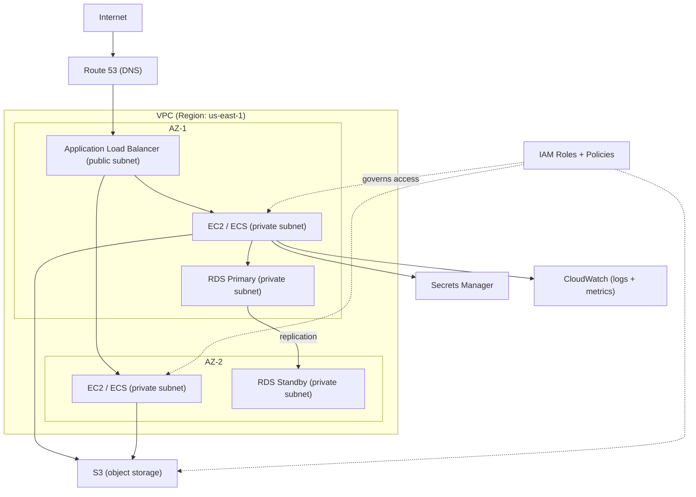

# AWS — A 2-Day Crash Course

> **In one sentence:** AWS is a giant menu of on-demand building blocks — compute, storage,
> networking, databases — that you rent by the second and wire together to run anything,
> controlled by an API, a CLI, and an IAM permission system.

---

## Part 0 — How to think about "the cloud"

AWS has 200+ services and the names are alphabet soup. Don't try to learn them all. Learn the
**handful of primitives** every architecture is built from, plus the **mental model** that ties
them together. Everything else is a variation.

**The model:** You rent resources via an API. Every resource lives in a **Region** (a
geographic area like `us-east-1`) made of **Availability Zones** (AZs — isolated datacenters;
you spread across AZs for resilience). Access to everything is gated by **IAM** (who can do what
to which resource). You pay only for what you use, by the second/GB/request.

**The five primitives you must know cold:**
1. **Compute** — where code runs: **EC2** (virtual machines), **Lambda** (functions, no servers
   to manage), containers (**ECS/EKS**).
2. **Storage** — **S3** (object storage: files, backups, static sites — effectively infinite),
   **EBS** (disks attached to EC2).
3. **Networking** — **VPC** (your private network), subnets, security groups (instance
   firewalls), load balancers, **Route 53** (DNS).
4. **Database** — **RDS** (managed SQL: Postgres/MySQL), **DynamoDB** (managed NoSQL).
5. **Identity** — **IAM** (users, roles, policies — the permission system that fronts everything).

**Mental model:** AWS is a warehouse of rentable parts. You assemble compute + storage +
network + database inside a region, spread across AZs for resilience, and IAM decides who can
touch what. Master the five primitives and the rest of the catalog clicks into place.



---

## Part 1 — The vocabulary

| Term | Meaning |
|------|---------|
| **Region** | Geographic location (`us-east-1`, `ap-south-1`) — resources are region-scoped |
| **AZ** | Availability Zone — isolated datacenter within a region (deploy across ≥2) |
| **IAM** | Identity & Access Management — users, roles, policies |
| **Role** | An identity that *services/instances* assume (no long-lived keys) |
| **VPC** | Virtual Private Cloud — your isolated network |
| **Security Group** | Stateful firewall attached to resources |
| **S3 bucket** | A container for objects (files) in S3 |
| **ARN** | Amazon Resource Name — the unique ID of any resource |

---

## DAY 1 — Get it working (CLI-first)

### 1. Set up the CLI and verify identity
```bash
aws --version
aws configure --profile dev        # set access key, secret, region, output format
export AWS_PROFILE=dev
aws sts get-caller-identity        # "who am I?" — proves auth works; run this constantly
```
Better than long-lived keys: use **SSO**.
```bash
aws configure sso                  # set up SSO once
aws sso login --profile dev        # temporary creds, refreshed on login
```

### 2. The CLI shape (it's the same for every service)
```bash
aws <service> <operation> [--parameters] [--query JMESPath] [--output table|json]
aws ec2 describe-instances
aws s3 ls
aws iam list-users
```
`--query` filters output server-side using JMESPath; `--output table` makes it readable. Learn
these two and the CLI becomes pleasant:
```bash
aws ec2 describe-instances \
  --query 'Reservations[].Instances[].[InstanceId,State.Name,PrivateIpAddress]' \
  --output table
```

### 3. S3 — the easiest service to feel productive with
```bash
aws s3 mb s3://my-unique-bucket-12345        # make bucket
aws s3 cp file.txt s3://my-unique-bucket-12345/
aws s3 ls s3://my-unique-bucket-12345/ --recursive --human-readable
aws s3 sync ./site s3://my-unique-bucket-12345/   # upload only changed files
aws s3 presign s3://my-bucket/key --expires-in 3600   # temporary shareable URL
```
S3 stores "objects" (files) in "buckets." It's durable (11 nines), cheap, and the backbone of
backups, data lakes, and static sites.

### 4. EC2 — a virtual machine
```bash
aws ec2 describe-instances --filters "Name=tag:Env,Values=dev" \
  --query 'Reservations[].Instances[].[InstanceId,State.Name]' --output table
aws ec2 start-instances  --instance-ids i-0abc123
aws ec2 stop-instances   --instance-ids i-0abc123
# connect WITHOUT SSH keys or a bastion (needs SSM agent + IAM):
aws ssm start-session --target i-0abc123
```
`ssm start-session` is the modern way in — no open SSH ports, no key management.

### 5. IAM — the thing that says "no" (understand it early)
Three concepts:
- **Policy** — a JSON document listing allowed/denied actions on resources.
- **User** — a human/long-lived identity (prefer SSO over IAM users).
- **Role** — an identity that *something* assumes temporarily (an EC2 instance, a Lambda, a
  CI job). Roles give short-lived credentials and are the secure default.
```json
{
  "Version": "2012-10-17",
  "Statement": [{
    "Effect": "Allow",
    "Action": ["s3:GetObject"],
    "Resource": "arn:aws:s3:::my-bucket/*"
  }]
}
```
The golden rule: **least privilege** — grant only the actions needed. "Access Denied" errors
mean an IAM policy is missing the action or resource; read the error, it names what's missing.

**By end of Day 1 you can:** authenticate, drive any service via the CLI pattern, use S3 and
EC2, connect to instances via SSM, and read the basics of IAM. That's a working foundation.

---

## DAY 2 — Make it real

### 1. The networking foundation (VPC)
Every workload lives in a **VPC** (a private network you control). Inside it:
- **Subnets** split the VPC by AZ; **public** subnets reach the internet (via an Internet
  Gateway), **private** subnets don't (they egress via a NAT Gateway).
- **Security Groups** are stateful firewalls on resources (allow port 443 from anywhere, etc.).
- **Route 53** is DNS; **ELB/ALB** load-balances traffic across instances/containers.
Architecture rule of thumb: put databases and app servers in *private* subnets, put only the
load balancer in *public* subnets, spread across ≥2 AZs.

### 2. Managed databases (RDS / DynamoDB)
```bash
aws rds describe-db-instances \
  --query 'DBInstances[].[DBInstanceIdentifier,DBInstanceStatus,Endpoint.Address]' \
  --output table
```
**RDS** runs managed Postgres/MySQL/etc. — AWS handles backups, patching, failover (Multi-AZ).
**DynamoDB** is a managed key-value/NoSQL store with single-digit-ms latency at any scale. Use
RDS for relational data, DynamoDB for high-scale simple-access patterns.

### 3. Serverless compute (Lambda)
Run code with no servers to manage; pay per invocation:
```bash
aws lambda list-functions
aws lambda invoke --function-name myfn --payload '{"k":"v"}' out.json
```
Lambda + S3 + DynamoDB + API Gateway is the classic serverless stack — no instances to patch.

### 4. Containers (ECS / EKS / ECR)
- **ECR** — private container registry (push your Docker images here).
- **ECS (Fargate)** — run containers without managing servers (AWS's own orchestrator).
- **EKS** — managed Kubernetes (use your `kubectl` skills — see `Kubernetes.md`).
```bash
aws ecr get-login-password | docker login --username AWS --password-stdin <acct>.dkr.ecr.us-east-1.amazonaws.com
aws eks update-kubeconfig --name mycluster --region us-east-1   # wire kubectl to EKS
```

### 5. Observability (CloudWatch)
```bash
aws logs tail /aws/lambda/myfn --follow            # live log tail
aws logs filter-log-events --log-group-name /app --filter-pattern "ERROR"
aws cloudwatch describe-alarms --state-value ALARM
```
CloudWatch is metrics + logs + alarms. (Many teams ship metrics to Prometheus/Grafana too —
see `Prometheus.md`.)

### 6. Secrets, config, and cost
```bash
aws secretsmanager get-secret-value --secret-id mysecret --query SecretString --output text
aws ssm get-parameter --name /app/db/url --with-decryption --query Parameter.Value --output text
aws ce get-cost-and-usage --time-period Start=2026-05-01,End=2026-06-01 \
  --granularity MONTHLY --metrics UnblendedCost --group-by Type=DIMENSION,Key=SERVICE
```
Store secrets in **Secrets Manager**/**SSM Parameter Store**, never in code or env files in Git.
Watch **Cost Explorer** — the cloud's pay-per-use model rewards turning off what you don't use.

### 7. Don't click — codify it (IaC)
Everything above can and should be defined in **Terraform** (see `Terraform.md`) or
CloudFormation/CDK rather than created by hand in the console. The CLI is for inspection and
quick actions; production infrastructure should be code.

---

## Worked example — a simple, resilient web app
```text
1. VPC across 2 AZs: public subnets (ALB) + private subnets (app + db).
2. ALB (public) -> ECS Fargate service (private) running your Docker image from ECR.
3. RDS Postgres (Multi-AZ, private) for data; Secrets Manager holds the DB password.
4. App's task role (IAM) grants least-privilege access to S3 + Secrets Manager — no static keys.
5. Route 53 -> ALB; ACM provides the TLS cert.
6. CloudWatch logs + alarms; autoscaling on the ECS service.
7. ALL of it defined in Terraform; the console is only for looking, not building.
```

---

## Common pitfalls
- **Long-lived IAM user keys.** They leak and they're forever. Use SSO + roles + temporary
  creds. Never commit keys to Git.
- **Over-permissive IAM (`"Action": "*"`).** Least privilege always; a wildcard policy is a
  breach waiting to happen.
- **Wrong region.** Resources are region-scoped; "it's not there" is usually "you're in the
  wrong region." Set a default and confirm it.
- **Single-AZ deployments.** One AZ outage takes you down. Spread across ≥2 AZs.
- **Public S3 buckets / open security groups.** The classic data-leak cause. Default to private;
  open only what's needed, to the narrowest source.
- **ClickOps.** Manual console changes aren't reproducible or reviewable. Codify with Terraform.
- **Ignoring cost.** Idle instances, unattached EBS volumes, and forgotten NAT gateways quietly
  burn money. Tag resources and watch Cost Explorer.

---

## Quick command reference
```bash
# Auth / identity
aws configure [--profile p]        aws configure sso       aws sso login --profile p
aws sts get-caller-identity        export AWS_PROFILE=p AWS_REGION=us-east-1

# General pattern
aws <svc> <op> --query 'JMESPath' --output table|json
aws ec2 describe-instances --filters "Name=tag:Env,Values=prod"

# S3
aws s3 ls|cp|sync|rm|mb|rb         aws s3 presign s3://b/k --expires-in 3600
aws s3api put-bucket-versioning --bucket b --versioning-configuration Status=Enabled

# EC2 / SSM
aws ec2 describe-instances|start-instances|stop-instances
aws ssm start-session --target i-xxxx

# IAM
aws iam list-users|list-roles      aws iam get-role --role-name r
aws iam list-attached-role-policies --role-name r

# Containers
aws ecr get-login-password | docker login ...
aws eks update-kubeconfig --name c --region r

# Logs / secrets / cost
aws logs tail /path --follow       aws logs filter-log-events --log-group-name g --filter-pattern P
aws secretsmanager get-secret-value --secret-id s --query SecretString --output text
aws ssm get-parameter --name /p --with-decryption --query Parameter.Value --output text
aws ce get-cost-and-usage ...
```

---

## Top 10 Interview Questions

<details>
<summary><strong>Q: What is a VPC and how do public and private subnets differ?</strong></summary>

A VPC (Virtual Private Cloud) is your isolated network in AWS. Public subnets have a route to an Internet Gateway, so resources in them can have public IPs and reach the internet directly. Private subnets have no direct internet route — they egress through a NAT Gateway. The standard pattern: load balancers in public subnets, application servers and databases in private subnets. This limits the attack surface to only the load balancer.

</details>

<details>
<summary><strong>Q: What is the difference between an IAM Role and an IAM User?</strong></summary>

An IAM User has long-lived credentials (access key + secret) tied to a person or service. An IAM Role has no permanent credentials — it is assumed temporarily by a service (EC2, Lambda, ECS task) or a federated identity, and provides short-lived credentials that auto-rotate. Roles are the secure default for machine-to-machine access. Use SSO for humans and Roles for services; avoid IAM Users with static keys.

</details>

<details>
<summary><strong>Q: When would you choose EC2 versus Lambda?</strong></summary>

Choose Lambda for event-driven, short-lived workloads (under 15 minutes) where you want zero server management and pay-per-invocation pricing — API handlers, file processing triggers, scheduled tasks. Choose EC2 when you need long-running processes, full OS control, GPU access, or workloads with sustained high throughput where per-invocation pricing would be more expensive than a reserved instance. ECS/Fargate sits in between — containerised workloads without managing EC2 instances.

</details>

<details>
<summary><strong>Q: How does S3 achieve 11 nines of durability?</strong></summary>

S3 automatically replicates objects across a minimum of three Availability Zones within a region. Each AZ is a physically separate data centre with independent power and networking. The service uses checksums to detect and automatically repair any bit-level corruption. Durability (99.999999999%) means you would statistically lose one object out of 10 billion stored over 10,000 years. Availability is a separate metric — standard S3 offers 99.99% availability.

</details>

<details>
<summary><strong>Q: How do Security Groups and NACLs differ?</strong></summary>

Security Groups are stateful firewalls attached to resources (EC2, RDS, ALB) — if you allow inbound traffic, the return traffic is automatically allowed. They operate at the resource level and default to deny-all inbound. NACLs (Network Access Control Lists) are stateless firewalls at the subnet level — you must explicitly allow both inbound and outbound rules. In practice, Security Groups handle most access control; NACLs provide an additional layer for subnet-wide rules.

</details>

<details>
<summary><strong>Q: How do you design for high availability on AWS?</strong></summary>

Spread resources across at least two Availability Zones. Use an ALB to distribute traffic across instances in multiple AZs. Use RDS Multi-AZ for automatic database failover. Use Auto Scaling Groups to replace failed instances automatically. Store state externally (S3, RDS, ElastiCache) so application instances are stateless and replaceable. Route 53 health checks can fail over across regions for disaster recovery.

</details>

<details>
<summary><strong>Q: What are the main AWS cost optimisation strategies?</strong></summary>

Start by right-sizing: most instances are over-provisioned. Use Reserved Instances or Savings Plans for predictable base load (up to 72% savings). Use Spot Instances for fault-tolerant workloads (up to 90% savings). Turn off non-production resources outside business hours. Delete unattached EBS volumes and unused Elastic IPs. Use S3 lifecycle policies to transition cold data to cheaper storage classes. Tag everything and use Cost Explorer to identify waste.

</details>

<details>
<summary><strong>Q: How do you securely connect to an EC2 instance without SSH keys?</strong></summary>

Use AWS Systems Manager (SSM) Session Manager. It requires the SSM Agent on the instance (pre-installed on Amazon Linux and most AMIs) and an IAM role with the `AmazonSSMManagedInstanceCore` policy attached to the instance. No SSH port (22) needs to be open in the Security Group, no key pairs to manage or rotate, and all sessions are logged to CloudWatch or S3 for audit purposes.

</details>

<details>
<summary><strong>Q: What is the AWS Well-Architected Framework?</strong></summary>

It is a set of five design pillars: Operational Excellence (automate, observe, improve), Security (least privilege, encryption, traceability), Reliability (recover from failures, scale to meet demand), Performance Efficiency (right resource types, monitor), and Cost Optimization (eliminate waste, use the right pricing model). AWS provides a Well-Architected Tool to review workloads against these pillars. It is the standard framework for architecture reviews and interview discussions.

</details>

<details>
<summary><strong>Q: How does an Application Load Balancer (ALB) route traffic?</strong></summary>

An ALB operates at Layer 7 (HTTP/HTTPS). It uses listener rules to route requests based on host header, URL path, HTTP method, or query string to different target groups. Each target group contains registered targets (EC2 instances, ECS tasks, Lambda functions, or IP addresses). The ALB performs health checks on targets and only routes to healthy ones. It also handles SSL termination, sticky sessions, and integrates with WAF for web application security.

</details>

---


## Quick Quiz

Test your understanding with these rapid-fire questions (answers hidden):

<details>
<summary>1. What is the ONE core problem that AWS solves?</summary>
Re-read Part 0 — the mental model section. If you can explain the "why" in one sentence, you understand the foundation.
</details>

<details>
<summary>2. Name the 3 most important terms from the vocabulary section.</summary>
Review Part 1. These are the building blocks every conversation about AWS uses.
</details>

<details>
<summary>3. What is the first thing you would set up on Day 1?</summary>
Check the Day 1 section — the very first hands-on step that gets you a working result.
</details>

<details>
<summary>4. What is the most common production pitfall with AWS?</summary>
Review the Common Pitfalls section. The first item listed is typically the most frequently encountered.
</details>

<details>
<summary>5. How does AWS compare to its closest alternative?</summary>
Check the Comparison Matrix below — focus on the key differentiating row.
</details>


## Comparison Matrix

| Dimension | AWS | GCP | Azure |
|-----------|-----|-----|-------|
| **Primary use case** | Core strength of AWS | Core strength of GCP | Core strength of Azure |
| **Learning curve** | Moderate | Varies | Varies |
| **Community/ecosystem** | Active | Active | Growing |
| **Operational complexity** | Medium | Varies | Varies |
| **Best for** | See Part 0 | Different tradeoffs | Different tradeoffs |

> **How to read this matrix:** no tool wins on every dimension. Pick based on your specific constraints — team expertise, existing infrastructure, scale requirements, and compliance needs. The right choice is the one that fits your context, not the one with the most checkmarks.

## Next steps after Day 2
- Learn the **Well-Architected Framework** (5 pillars: operational excellence, security,
  reliability, performance, cost) — AWS's design checklist.
- Go deeper on **VPC networking** (NAT, peering, Transit Gateway, PrivateLink).
- **CDK** (infrastructure in real languages on top of CloudFormation) or **Terraform** for IaC.
- Compare the equivalents on **GCP** and **Azure** (see those cheatsheets) — the primitives map
  almost 1:1.

## Recommended learning resources

**YouTube channels & playlists:**
- [Adrian Cantrill — AWS Solutions Architect Course](https://www.youtube.com/@adriancantrill) — deep, visual walkthroughs of every AWS service and architecture pattern
- [Stephane Maarek — Ultimate AWS Certified Solutions Architect](https://www.youtube.com/@StephaneMaarek) — practical, exam-aligned tutorials that double as production knowledge
- [AWS re:Invent — Architecture Track](https://www.youtube.com/@AWSEventsChannel) — annual deep dives from AWS principal engineers on real-world patterns
- [AWS Online Tech Talks](https://www.youtube.com/@AWSOnlineTechTalks) — focused 30-minute sessions on individual services and best practices
- [Fireship — AWS in 100 Seconds](https://www.youtube.com/@Fireship) — rapid mental-model videos when you need a quick orientation on a service

**Official docs & blogs:**
- [AWS Documentation](https://docs.aws.amazon.com/) — the canonical reference; start with the "Getting Started" guide for each service
- [AWS Architecture Blog](https://aws.amazon.com/blogs/architecture/) — real-world architecture patterns, Well-Architected case studies, and reference diagrams

**The mantra:** five primitives (compute, storage, network, database, identity), in a region
across AZs, gated by least-privilege IAM, defined as code. Check `sts get-caller-identity` and
your region before you do anything.
