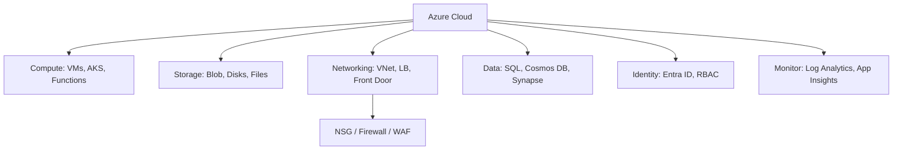

# Microsoft Azure — A 2-Day Crash Course

> **In one sentence:** Azure is Microsoft's cloud — the same building blocks as AWS/GCP
> (compute, storage, networking, databases) organized around **Resource Groups** and
> **Subscriptions**, driven by the `az` CLI, and tightly integrated with Microsoft identity
> (Entra ID / Active Directory).

> If you know AWS or GCP, the concepts transfer directly. This cheatsheet leads with what's
> Azure-specific and the cross-cloud service translation.

---

## Part 0 — How Azure is organized (the Azure-specific structure)

Azure's hierarchy is the first thing to internalize:
```
Tenant (Entra ID directory = your org's identity)
└── Management Groups        (optional, group subscriptions)
    └── Subscription         (billing + quota boundary)
        └── Resource Group   (a logical container for related resources — VERY central)
            └── Resources     (VMs, storage accounts, databases...)
```
The **Resource Group (RG)** is the unit you work with constantly: it's a folder that holds
related resources, and — crucially — **deleting the RG deletes everything in it**. This makes
RGs great for managing an app's lifecycle ("everything for project X lives in `rg-projectx`;
tear it down by deleting the group"). Resources also live in a **region** (`centralindia`,
`eastus`), like everywhere else.

**Identity is Azure's home turf.** Auth runs through **Microsoft Entra ID** (formerly Azure
Active Directory). If your org uses Microsoft 365, Azure identity is already wired in — a big
reason enterprises pick Azure.

**Mental model:** same rentable building blocks, grouped into Resource Groups (disposable
folders) under a Subscription (billing), with Entra ID as the identity backbone.

---




## Part 1 — The cross-cloud service translation (your real cheat sheet)

| Need | AWS | GCP | Azure |
|------|-----|-----|-------|
| Virtual machines | EC2 | Compute Engine | **Virtual Machines** |
| Object storage | S3 | Cloud Storage | **Blob Storage** (in a *Storage Account*) |
| Managed Kubernetes | EKS | GKE | **AKS** |
| Serverless functions | Lambda | Cloud Functions | **Azure Functions** |
| Serverless containers | Fargate | Cloud Run | **Container Apps** |
| Managed SQL | RDS | Cloud SQL | **Azure SQL Database** / **DB for PostgreSQL** |
| NoSQL | DynamoDB | Firestore | **Cosmos DB** |
| Networking | VPC | VPC | **Virtual Network (VNet)** |
| DNS | Route 53 | Cloud DNS | **Azure DNS** |
| Identity | IAM | IAM | **Entra ID + RBAC** |
| Secrets | Secrets Manager | Secret Manager | **Key Vault** |
| Container registry | ECR | Artifact Registry | **Azure Container Registry (ACR)** |
| Logs/metrics | CloudWatch | Cloud Monitoring | **Azure Monitor + Log Analytics** |
| IaC (native) | CloudFormation | Deployment Manager | **ARM / Bicep** |

---

## DAY 1 — Get it working

### 1. Install the CLI, log in, set context
```bash
az version
az login                                  # browser login (human)
az account show                           # which subscription am I in? (check constantly)
az account list --output table
az account set --subscription "My Sub"    # pick the active subscription
```
The active **subscription** is the "which account/region am I in?" check — confirm it before
acting.

### 2. Resource Groups — create the container first
Almost everything goes into an RG, so you make one first:
```bash
az group create --name rg-demo --location centralindia
az group list --output table
az group delete --name rg-demo            # deletes EVERYTHING inside — powerful and dangerous
```

### 3. The `az` command shape
```bash
az <group> <subgroup> <action> [args] [--output table|json] [--query JMESPath]
az vm list
az storage account list
az group list
```
Like AWS, `--query` uses JMESPath and `--output table` makes things readable:
```bash
az vm list --query "[].{name:name, rg:resourceGroup, size:hardwareProfile.vmSize}" --output table
```

### 4. Blob Storage (the S3 equivalent — note the two-level structure)
Azure object storage has an extra layer: a **Storage Account** contains **Containers** which
contain **Blobs**:
```bash
az storage account create --name mystorageacct123 --resource-group rg-demo \
  --location centralindia --sku Standard_LRS
az storage container create --account-name mystorageacct123 --name files
az storage blob upload --account-name mystorageacct123 -c files -f ./file.txt -n file.txt
az storage blob list --account-name mystorageacct123 -c files --output table
```
(Storage Account → Container → Blob, versus S3's flat Bucket → Object.)

### 5. Virtual Machines (the EC2 equivalent)
```bash
az vm create --resource-group rg-demo --name web1 \
  --image Ubuntu2204 --size Standard_B1s --generate-ssh-keys
az vm list --output table
az ssh vm --resource-group rg-demo --name web1     # SSH in (az manages keys)
az vm stop --resource-group rg-demo --name web1
az vm delete --resource-group rg-demo --name web1
```

### 6. Container Apps — deploy a container quickly (the Cloud Run equivalent)
```bash
az containerapp up --name myapp --resource-group rg-demo \
  --image ghcr.io/org/myapp:1.0 --target-port 8080 --ingress external
```
A managed, autoscaling container endpoint without managing servers.

**By end of Day 1 you can:** log in, set the subscription, create Resource Groups, use Blob
Storage and VMs, and deploy a Container App. Solid foundation.

---

## DAY 2 — Make it real

### 1. RBAC — roles scoped to a level of the hierarchy
Azure access control assigns **roles** to **principals** (users, groups, service principals,
managed identities) at a **scope** (subscription / resource group / single resource):
```bash
az role assignment create \
  --assignee <user-or-app-id> \
  --role "Storage Blob Data Reader" \
  --scope /subscriptions/<sub>/resourceGroups/rg-demo
```
Built-in roles like `Reader`, `Contributor`, `Owner`, and granular ones like
`Storage Blob Data Reader` cover most needs. Assign at the *narrowest* scope that works
(least privilege).

### 2. Managed Identities (the secure way for workloads to authenticate)
A **Managed Identity** lets an Azure resource (VM, Container App, AKS pod) authenticate to other
Azure services *with no credentials in code* — Azure handles the secret rotation entirely. This
is the AWS-role / GCP-service-account equivalent and the right default:
```bash
az vm identity assign --resource-group rg-demo --name web1   # give the VM a system-managed identity
# then grant that identity an RBAC role on the resource it needs
```
Never put credentials in app config when a managed identity can do the job.

### 3. AKS — managed Kubernetes
```bash
az aks create --resource-group rg-demo --name myaks --node-count 2 --generate-ssh-keys
az aks get-credentials --resource-group rg-demo --name myaks   # wire up kubectl
kubectl get nodes                                              # standard K8s from here
```
See `Kubernetes.md` — all your kubectl knowledge applies.

### 4. Key Vault — secrets, keys, certs
```bash
az keyvault create --name mykv-demo --resource-group rg-demo --location centralindia
az keyvault secret set --vault-name mykv-demo --name dbPassword --value "s3cr3t"
az keyvault secret show --vault-name mykv-demo --name dbPassword --query value -o tsv
```
Combine Key Vault with a managed identity so apps fetch secrets at runtime without storing them.

### 5. Networking (VNet)
A **Virtual Network (VNet)** is your private network; **subnets** segment it; **Network Security
Groups (NSGs)** are the firewalls (≈ AWS security groups). Load balancing via **Azure Load
Balancer** (L4) or **Application Gateway** (L7).
```bash
az network vnet create --resource-group rg-demo --name myvnet \
  --address-prefix 10.0.0.0/16 --subnet-name app --subnet-prefix 10.0.1.0/24
az network nsg create --resource-group rg-demo --name app-nsg
```

### 6. Observability & cost
```bash
az monitor metrics list --resource <id> --metric "Percentage CPU"
az monitor log-analytics query --workspace <id> --analytics-query "AppExceptions | take 50"
az consumption usage list --output table
```
Azure Monitor + Log Analytics (queried with **KQL**, Kusto Query Language) is the observability
stack. Set **budgets** and **cost alerts** early.

### 7. Codify it — Bicep or Terraform
Azure's native IaC is **Bicep** (a clean DSL that compiles to ARM templates); Terraform's
`azurerm` provider is also extremely common (see `Terraform.md`). A tiny Bicep taste:
```bicep
resource sa 'Microsoft.Storage/storageAccounts@2023-01-01' = {
  name: 'mystorageacct123'
  location: resourceGroup().location
  sku: { name: 'Standard_LRS' }
  kind: 'StorageV2'
}
```
```bash
az deployment group create --resource-group rg-demo --template-file main.bicep
```

---

## Worked example — container app with managed data and secrets
```text
1. az group create rg-prod (one RG = the whole app's lifecycle).
2. ACR holds the image; Azure DB for PostgreSQL (private) holds data.
3. Key Vault stores the DB connection string.
4. Container App runs the image with a system-managed identity.
5. Grant that identity "Key Vault Secrets User" (RBAC) so it reads the secret at runtime — no
   credentials in config.
6. Azure Monitor collects logs/metrics; a budget alert watches spend.
7. Everything defined in Bicep or Terraform; tear down = delete the resource group.
```

---

## Common pitfalls
- **Forgetting which subscription is active.** `az` acts on the current subscription — the Azure
  version of the wrong-account accident. `az account show` first.
- **Deleting a Resource Group casually.** It deletes *everything* inside, irreversibly. Great
  for cleanup, terrifying by accident. Double-check the name.
- **Credentials in code instead of managed identities.** Use managed identities + Key Vault;
  don't store secrets in app settings or Git.
- **Over-broad RBAC (Owner/Contributor at subscription scope).** Assign least privilege at the
  narrowest scope.
- **Storage account name collisions.** Storage account names are *globally* unique and lowercase
  alphanumeric — pick something distinctive.
- **Region/availability confusion.** Use **Availability Zones** for resilience; not every SKU is
  available in every region.

---

## Quick command reference
```bash
# Auth / context
az login                           az account show
az account list --output table     az account set --subscription "Name"

# Resource groups
az group create --name RG --location LOC
az group list --output table       az group delete --name RG

# General pattern
az <svc> <action> --query 'JMESPath' --output table
az vm list --query "[].{name:name,size:hardwareProfile.vmSize}" -o table

# Storage
az storage account create --name N --resource-group RG --sku Standard_LRS
az storage container create --account-name N --name C
az storage blob upload|list|download --account-name N -c C ...

# Compute / containers
az vm create|list|stop|delete --resource-group RG --name N
az ssh vm --resource-group RG --name N
az containerapp up --name N --resource-group RG --image IMG --target-port P
az aks create|get-credentials --resource-group RG --name N

# Identity / RBAC / secrets
az role assignment create --assignee ID --role "Role" --scope SCOPE
az vm identity assign --resource-group RG --name N
az keyvault create|secret set|secret show ...

# Monitor / cost / IaC
az monitor metrics list --resource ID --metric M
az consumption usage list --output table
az deployment group create --resource-group RG --template-file main.bicep
```

---

## Top 10 Interview Questions

<details>
<summary><strong>Q: How does Azure's resource hierarchy work, and what is a Resource Group?</strong></summary>

Azure organizes resources under Tenant → Management Groups → Subscriptions → Resource Groups. A Resource Group is a logical container that groups related resources for a workload or environment. Critically, deleting a Resource Group deletes everything inside it, making lifecycle management clean. Subscriptions are the billing and quota boundary — always confirm your active subscription before acting.

</details>

<details>
<summary><strong>Q: What is a Managed Identity and why should you use it over storing credentials?</strong></summary>

A Managed Identity lets Azure resources (VMs, Container Apps, AKS pods) authenticate to other Azure services without any credentials in code or config. Azure handles the credential lifecycle — issuance, rotation, and revocation — entirely. This eliminates the risk of leaked secrets in git, environment variables, or CI logs. It is the Azure equivalent of AWS IAM roles for EC2 or GCP Workload Identity.

</details>

<details>
<summary><strong>Q: How does Azure RBAC differ from AWS IAM?</strong></summary>

Azure RBAC assigns roles to principals (users, groups, managed identities) at a specific scope — management group, subscription, resource group, or individual resource. The scope inheritance means a role assigned at subscription level applies to all resource groups below it. AWS IAM attaches policies to principals directly. Azure also has Entra ID as a separate identity layer for authentication, while AWS combines authn and authz in IAM.

</details>

<details>
<summary><strong>Q: When would you use Azure Container Apps versus AKS?</strong></summary>

Container Apps is the managed, serverless container platform — ideal for stateless HTTP services, event-driven microservices, and teams that want autoscaling (including to zero) without managing Kubernetes infrastructure. AKS gives you full Kubernetes control for complex workloads requiring custom networking, persistent storage, service meshes, or multi-container pods with sidecar patterns. If you do not need kubectl, Container Apps is simpler and cheaper.

</details>

<details>
<summary><strong>Q: How would you secure secrets in an Azure production environment?</strong></summary>

Store all secrets, keys, and certificates in Azure Key Vault. Grant access using RBAC roles like "Key Vault Secrets User" scoped to the specific vault. Combine Key Vault with a managed identity so applications fetch secrets at runtime without storing them anywhere. Never put connection strings or passwords in app settings, ARM templates, or source code. For Kubernetes workloads, use the Key Vault CSI driver to mount secrets as volumes.

</details>

<details>
<summary><strong>Q: What is Azure Policy and how does it compare to AWS SCPs?</strong></summary>

Azure Policy evaluates resource configurations against rules and can audit, deny, or auto-remediate non-compliant resources. It operates at management group, subscription, or resource group scope. AWS SCPs restrict maximum permissions at the Organizations level but do not remediate. Azure Policy is both a guardrail (deny unencrypted storage accounts) and a compliance reporter (audit all resources missing required tags), making it more versatile than SCPs alone.

</details>

<details>
<summary><strong>Q: How do you approach networking in Azure — VNets, NSGs, and peering?</strong></summary>

A Virtual Network (VNet) is your isolated network, segmented by subnets. Network Security Groups (NSGs) act as stateful firewalls applied to subnets or individual NICs. For multi-VNet connectivity, use VNet Peering (non-transitive) or Azure Virtual WAN for hub-and-spoke at scale. Private Endpoints bring Azure PaaS services (SQL, Storage, Key Vault) into your VNet so traffic stays on the Microsoft backbone — the Azure equivalent of AWS PrivateLink.

</details>

<details>
<summary><strong>Q: What is Bicep and how does it compare to Terraform for Azure IaC?</strong></summary>

Bicep is Azure's native IaC language — a clean DSL that compiles down to ARM templates. It has first-class support for every Azure resource, immediate access to new features, and tight integration with `az deployment`. Terraform's azurerm provider is the choice for multi-cloud environments or teams already standardized on Terraform. Bicep is simpler for Azure-only shops; Terraform provides portability and a larger ecosystem of modules.

</details>

<details>
<summary><strong>Q: How does Azure Monitor and Log Analytics work for observability?</strong></summary>

Azure Monitor collects metrics and logs from all Azure resources. Log Analytics workspaces store log data, queryable with KQL (Kusto Query Language). You create alert rules based on metric thresholds or log query results. Application Insights provides application-level telemetry — request rates, dependency tracking, and exceptions. For Kubernetes, Container Insights adds pod and node-level metrics. The key skill is writing KQL queries to diagnose production issues quickly.

</details>

<details>
<summary><strong>Q: How would you design a disaster recovery strategy for an Azure workload?</strong></summary>

Define your RTO and RPO first — they determine the DR tier. Azure Site Recovery (ASR) handles VM replication to a secondary region for warm standby. For databases, Azure SQL auto-failover groups and Cosmos DB multi-region writes provide data-layer DR. Use Azure Front Door or Traffic Manager for global traffic routing with health probes. Test failover quarterly. The common mistake is building active-active for a workload that only needs a 4-hour RTO — pilot light or warm standby is usually sufficient and far cheaper.

</details>

---

## Next steps after Day 2
- **Bicep** deeply if you go Azure-native; **Terraform azurerm** if multi-cloud.
- **Entra ID** concepts (app registrations, service principals, conditional access) — Azure's
  identity depth is its differentiator.
- **KQL** for querying logs in Log Analytics — a genuinely useful skill.
- Map back to AWS/GCP: VMs/Blob/AKS/Functions are EC2/S3/EKS/Lambda by another name.

## Recommended learning resources

**YouTube channels & playlists:**
- [Azure Friday — Scott Hanselman & Friends](https://www.youtube.com/@AzureFriday) — short, focused deep dives on individual Azure services with the teams that built them
- [Microsoft Developer — Azure Architecture](https://www.youtube.com/@MicrosoftDeveloper) — end-to-end architecture walkthroughs and best practices
- [John Savill — Azure Master Class](https://www.youtube.com/@NTFAQGuy) — comprehensive, whiteboard-style explanations of Azure networking, identity, and governance
- [Adrian Cantrill — Cloud Architecture](https://www.youtube.com/@adriancantrill) — cross-cloud architecture patterns that map cleanly to Azure concepts
- [A Cloud Guru — Azure Fundamentals](https://www.youtube.com/@ACloudGuru) — structured learning paths for AZ-900 through AZ-305

**Official docs & blogs:**
- [Microsoft Learn — Azure Documentation](https://learn.microsoft.com/en-us/azure/) — the canonical reference with learning paths, quickstarts, and architecture guides
- [Azure Blog](https://azure.microsoft.com/en-us/blog/) — engineering updates, case studies, and new service announcements

**The mantra:** resources live in Resource Groups (delete the group to clean up) under a
Subscription; identity flows through Entra ID; workloads authenticate via managed identities +
Key Vault; codify with Bicep or Terraform. Check the active subscription before every command.
