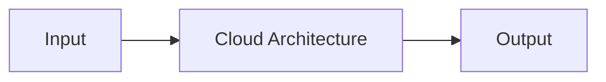

# Cloud Architecture — A 2-Day Crash Course

Cloud architecture is the discipline of designing systems that are reliable, scalable, secure, cost-efficient, and operationally excellent on cloud platforms — the AWS Well-Architected Framework distilled into actionable patterns.

---

## Part 0 — Why This Matters

Bad architecture costs you in outages, bills, and compliance violations. Good architecture is invisible; bad architecture pages you at 3am.

### The Mental Model: City Planning

Think of cloud architecture as city planning. You zone areas (accounts/VPCs), build roads (networking), set regulations (security/compliance), plan for growth (scalability), and budget for maintenance (cost). A city with no zoning is a sprawl — everything tangled, every change breaks something else. A well-zoned city has clear districts, predictable traffic patterns, and room to expand without tearing everything down.

When you inherit a single-account AWS environment with every workload in one VPC, you are inheriting a city with no zoning ordinances. The blast radius of any mistake is the entire city.

This crash course gives you the frameworks and vocabulary to reason about architecture at the cloud platform level — above the service level (EC2, GCS buckets) and below the application level (which database engine to pick). This is the layer most engineers skip, and it is the layer that determines whether your org can scale without constant firefighting.

---

## Vocabulary You Need

**Well-Architected Framework** — AWS's six-pillar framework for evaluating cloud workloads: Operational Excellence, Security, Reliability, Performance Efficiency, Cost Optimization, and Sustainability. GCP and Azure have equivalent frameworks (Google Cloud Architecture Framework, Microsoft Azure Well-Architected Framework) with strong overlap.

**Landing Zone** — A pre-configured, secure, multi-account cloud environment that enforces governance from day one. Think of it as the city blueprint before any buildings go up. AWS Landing Zone and AWS Control Tower are implementations of this concept.

**Multi-Account Strategy** — The practice of isolating workloads, environments, and security boundaries across separate cloud accounts rather than sharing a single account. AWS uses Organizations and Organizational Units (OUs). GCP uses Folders. Azure uses Management Groups.

**Availability Zone (AZ)** — A physically separate data center within a Region. AZs are connected by low-latency private links. Deploying across multiple AZs is the baseline for high availability. A single AZ failure should be survivable.

**Region** — A geographic cluster of AZs. Regions are isolated from each other by design. Multi-region architecture is about disaster recovery and data residency, not just performance.

**Blast Radius** — The scope of damage when something goes wrong. Good architecture minimizes blast radius: a misconfigured IAM role in one account should not compromise another. A noisy-neighbor workload in one OU should not throttle production. Your security controls in one account should not be bypassed by an admin in another.

**Cost Allocation** — The practice of tagging and attributing cloud spend to business units, teams, products, or environments. Without cost allocation, you cannot have accountability or make informed trade-offs.

**Tagging Strategy** — The convention your org agrees on for labeling cloud resources: `env`, `team`, `cost-center`, `product`, `owner`, `criticality`. Tags are the foundation of cost allocation, automation, and security policy enforcement. A tagging strategy agreed on day one saves thousands of hours of retrofitting later.

**Shared Services** — Resources used across multiple accounts or workloads: DNS, logging, CI/CD pipelines, artifact registries, monitoring, identity federation. These live in a dedicated Shared Services account to avoid duplication and enforce consistency.

**Control Tower** — AWS's managed service for setting up and governing a multi-account environment. It deploys Account Factory, SCPs (Service Control Policies), CloudTrail, Config, and guardrails automatically. The alternative for complex enterprises is the Landing Zone Accelerator (LZA), an open-source AWS solution for highly regulated industries.

**SCP (Service Control Policy)** — An IAM-like policy applied at the AWS Organizations level. SCPs set the maximum permissions boundary for all principals in an OU or account. They do not grant permissions — they restrict them. A SCP that denies `s3:DeleteBucket` applies even to the account root user.

---




## DAY 1 — The Well-Architected Pillars

Walk through each pillar as a checklist you apply to every workload you design or review.

### Pillar 1: Operational Excellence

Operational excellence is about running and monitoring systems to deliver business value and continually improving processes. In practice, it means you can make changes safely, respond to events quickly, and learn from failures without panic.

**Infrastructure as Code (IaC)** is the foundation. If you cannot reproduce your infrastructure from code, you cannot reason about drift, automate recovery, or peer-review changes. Every resource should be defined in Terraform, CDK, Pulumi, or equivalent. Console-only resources are a liability. See `Terraform.md` for patterns.

**Runbooks and playbooks** are the operational documents that tell an on-call engineer exactly what to do when an alert fires. A runbook documents a known procedure (restart the service, flush the cache). A playbook documents a known incident type (database failover, certificate expiry). Without these, every incident is a novel problem. With them, a junior engineer can handle a P1 at 3am without escalating. See `Runbook-template.md` for structure.

**Observability** — you need metrics, logs, and traces. Metrics tell you what is happening (latency, error rate, saturation). Logs tell you what happened (event detail). Traces tell you where time was spent (distributed request flow). Without all three, you are debugging blind. See `Prometheus.md`, `Grafana.md`, `Loki.md`, `OpenTelemetry.md`.

**Deployment safety**: Blue/green deployments, canary releases, and feature flags reduce the blast radius of bad deploys. If every deploy is a binary all-or-nothing event, your deploy frequency will be low and your incident rate will be high.

**Key questions for any workload:**
- Can you deploy without downtime?
- Can you roll back in under five minutes?
- Do alerts map to runbooks?
- Are all resources defined in IaC?

### Pillar 2: Security

Security applies at every layer — identity, network, data, detection, and response. The principle of least privilege is not a checkbox; it is a mindset applied to every IAM role, VPC rule, and S3 bucket policy.

**Identity and Access Management (IAM)**: Every human and machine identity should have the minimum permissions needed for the minimum time needed. Use roles, not long-lived access keys. Use permission boundaries to constrain what admins can grant. Rotate credentials. Audit unused permissions with AWS IAM Access Analyzer or equivalent. See `Cloud-Security.md` for depth.

**Encryption**: Encrypt data at rest (KMS-managed keys) and in transit (TLS 1.2+). For regulated industries, use customer-managed keys (CMKs) so you control the key lifecycle and can prove it to auditors. ⚠️ Managed encryption is not the same as controlled encryption — understand the difference before signing off on a compliance posture.

**Network security**: Use Security Groups (stateful) and NACLs (stateless) for network-level controls. Put resources in private subnets unless they explicitly need public access. Use VPC endpoints to keep AWS API traffic off the public internet. Never expose management ports (22, 3389) directly to the internet.

**Detection and response**: Enable GuardDuty (threat detection), Security Hub (aggregated findings), CloudTrail (API audit log), Config (resource change tracking). These should be centralized in a dedicated Security account, not scattered across workload accounts where they can be disabled. Set alerts on critical findings. Have a documented response process.

**Key questions:**
- Who has admin access, and do they need it permanently?
- Are all S3 buckets private by default?
- Is CloudTrail enabled in all regions, with log integrity validation?
- Can a workload account admin disable security controls?

### Pillar 3: Reliability

Reliability means a system performs its intended function under all conditions, including component failures, traffic spikes, and infrastructure outages. The goal is not zero failures — the goal is that failures do not become customer-visible incidents.

**Multi-AZ deployments** are the baseline. Run compute, databases, and load balancers across at least two AZs. RDS Multi-AZ gives you automatic failover. ALB spans AZs automatically. If your architecture has a single-AZ dependency, you have a single point of failure.

**Auto-scaling** handles variable load. Use it for compute (EC2 Auto Scaling, ECS service auto-scaling, Lambda concurrency) and databases (Aurora Serverless, DynamoDB on-demand). Define scaling policies based on observed metrics, not guesses. Test scale-out and scale-in behavior before production. See `Capacity-Planning.md`.

**Disaster Recovery (DR)**: Define your RTO (Recovery Time Objective — how long you can be down) and RPO (Recovery Point Objective — how much data you can lose). Your DR strategy is a function of these two numbers. Higher cost equals lower RTO/RPO. More on DR tiers in Day 2.

**Dependency management**: Use circuit breakers, retries with exponential backoff, and timeouts on all downstream calls. A slow dependency should degrade your service gracefully, not cascade into a total outage. Dead letter queues (DLQs) for async workloads prevent message loss during transient failures.

**Chaos engineering**: Deliberately inject failures in non-production to validate your resilience assumptions. AWS Fault Injection Service (FIS) makes this manageable. You do not want to discover that your Multi-AZ failover takes 90 seconds — not 30 — for the first time during a real incident.

**Key questions:**
- What is your RTO and RPO, and are they documented and tested?
- What happens if a single AZ goes down?
- Are all critical queues and streams monitored with DLQ alerts?
- Have you ever actually run a failover drill?

### Pillar 4: Performance Efficiency

Performance efficiency is about using compute resources efficiently to meet system requirements and maintaining that efficiency as demand changes. Right-sizing is the ongoing practice; caching and CDN are the force multipliers.

**Right-sizing**: The single biggest performance efficiency win is using the correct instance type. Use Compute Optimizer (AWS) or equivalent to get recommendations based on actual utilization. Over-provisioning is waste; under-provisioning is latency and throttling. Benchmark before you commit to a size. See `Capacity-Planning.md`.

**Caching**: Cache at every appropriate layer. ElastiCache (Redis/Memcached) for application-layer caching. DAX for DynamoDB. CloudFront for static assets and API responses. Cache invalidation is hard — design your cache keys and TTLs deliberately, not as an afterthought.

**CDN**: Use CloudFront, Cloud CDN, or Azure CDN to serve static content from edge locations close to users. This reduces latency and offloads origin servers. For global APIs, edge caching of cacheable responses can dramatically reduce backend load.

**Database selection**: Use the right database for the access pattern. Relational for structured data with complex queries. DynamoDB for high-throughput key-value access. OpenSearch for full-text search. Redshift for analytical queries. Using a relational database for every use case is not architecture — it is habit.

**Serverless**: For event-driven, unpredictable, or low-throughput workloads, Lambda eliminates server management and scales to zero. For high-throughput, low-latency, or long-running workloads, containers or instances are more efficient. Know when serverless is the right fit.

**Key questions:**
- Are instances right-sized based on actual utilization data?
- Is static content served via CDN?
- Are caching layers documented with TTL and invalidation strategy?
- Are database choices driven by access patterns?

### Pillar 5: Cost Optimization

Cost optimization is about avoiding unnecessary costs. In practice, it means you pay only for what you use, you use the right pricing models, and you have visibility into where money is going.

**Reserved Instances and Savings Plans**: For steady-state workloads, committing to 1-year or 3-year reservations can save 40–70% over on-demand pricing. Savings Plans (AWS) are more flexible than Reserved Instances — they apply to any instance family in a region. Buy these after you have baseline utilization data, not speculatively.

**Spot Instances**: For fault-tolerant, interruptible workloads (batch processing, CI/CD workers, stateless compute), Spot can save up to 90% over on-demand. Design for interruption: use Spot with Auto Scaling groups, drain connections gracefully, and never use Spot for stateful singletons.

**Waste elimination**: The most common sources of cloud waste are unused resources (stopped instances still charging for attached volumes), over-provisioned instances, unattached Elastic IPs, orphaned snapshots, and data transfer costs. Schedule automated cleanup. Use AWS Trusted Advisor or equivalent to surface waste. See `FinOps.md`.

**Cost visibility**: Tag everything. Set budget alerts. Use Cost Explorer. Without visibility, you cannot act. In a multi-account setup, consolidated billing in the management account gives you a single pane for the org, but per-account and per-tag drill-down is where you find the actionable detail.

**Key questions:**
- Do you have budget alerts set at 80% and 100% of expected spend?
- Are all resources tagged with cost-center and team?
- Have you reviewed Trusted Advisor or Cost Anomaly Detection findings this month?
- What percentage of your compute spend is on reservations or savings plans?

### Pillar 6: Sustainability

The sustainability pillar — added in 2021 — addresses the environmental impact of cloud workloads. It is less about compliance and more about reducing energy consumption and carbon footprint.

**Right-sizing for sustainability**: An over-provisioned instance wastes compute, power, and money. Right-sizing improves sustainability and cost simultaneously.

**Managed services**: AWS managed services (Lambda, Fargate, Aurora Serverless) share infrastructure across customers, achieving higher utilization rates than dedicated instances. Higher utilization equals less waste per unit of work.

**Region selection**: AWS, GCP, and Azure publish data on the carbon intensity of each region. Where data residency and latency requirements allow, placing workloads in regions powered by renewable energy reduces carbon footprint.

**Graviton / Arm architectures**: AWS Graviton3 processors deliver better performance per watt than x86 equivalents for many workloads. Migrating to Graviton-based instances (C7g, M7g, R7g) reduces both cost and energy consumption.

---

## DAY 2 — Platform-Level Architecture

### Multi-Account Strategy

A single-account architecture is the most common mistake in cloud adoption. Everything in one account means no blast radius isolation, no environment separation, no per-team autonomy, and no clean security boundary.

The correct approach is an org structure with separate accounts for distinct concerns:

**Management/Root Account** — only for billing, organization management, and SCP enforcement. No workloads. No application resources. The management account has elevated trust by design — protect it accordingly. MFA on the root user, no long-lived access keys, no human logins for day-to-day work.

**Security Account** — centralized security tooling: CloudTrail aggregation, GuardDuty master, Security Hub master, Config aggregator, SIEM integration. Security tooling should be owned and operated by the security team, not workload teams, so it cannot be accidentally disabled.

**Log Archive Account** — an immutable log storage account. CloudTrail logs, VPC Flow Logs, Config snapshots, and other audit logs are shipped here and protected by S3 Object Lock. Even account administrators cannot delete these logs. This is the account auditors point to.

**Shared Services Account** — DNS (Route 53 private hosted zones), certificate authorities, container registries, CI/CD pipelines, artifact stores, internal monitoring dashboards. Shared services avoid duplication and enforce consistent standards. For example, a single ECR repository in Shared Services, accessed via cross-account IAM roles, is cleaner than per-team registries in each workload account.

**Workload Accounts** — one per environment (dev, staging, prod) per product or team, or one per product with environment separation at the VPC/namespace level depending on your isolation requirements. Regulated industries typically require separate accounts per environment. Startups may tolerate VPC-level separation.

**Network Account** — for orgs using a hub-and-spoke network model (Transit Gateway), a dedicated network account owns the TGW and shared VPCs. This keeps network topology changes separated from workload changes.

### OU Structure Example

```
Root
├── Management (account)
├── Security OU
│   ├── Security Tooling (account)
│   └── Log Archive (account)
├── Infrastructure OU
│   ├── Network (account)
│   └── Shared Services (account)
├── Workloads OU
│   ├── Production OU
│   │   ├── Product-A-Prod (account)
│   │   └── Product-B-Prod (account)
│   └── Non-Production OU
│       ├── Product-A-Dev (account)
│       └── Product-B-Dev (account)
└── Sandbox OU
    └── Developer sandbox accounts
```

SCPs at each OU level enforce guardrails. Production OU SCPs deny region-restriction violations and deletion of security resources. Sandbox OU SCPs cap spend and restrict sensitive services.

### Landing Zones

A landing zone is the implementation of your org structure — automated, repeatable, and governed. You should never set up accounts manually.

**AWS Control Tower** is the managed path. It sets up your OU structure, creates foundational accounts, deploys preventive and detective guardrails (SCPs + Config rules), enables CloudTrail and Config across all accounts, and provides Account Factory for self-service account vending.

**Landing Zone Accelerator (LZA)** is an open-source AWS solution for organizations with complex compliance requirements (BFSI, government, healthcare). LZA is deployed via CodePipeline and gives you full control over every guardrail, network topology, and security configuration. It is the right choice when Control Tower's managed guardrails are insufficient.

**GCP equivalent**: Organization Policies, Folders, and the GCP Landing Zone Blueprint (via Terraform). GCP's hierarchical policy inheritance model is similar to AWS SCPs.

**Azure equivalent**: Management Groups, Azure Policy, and the Enterprise-Scale Landing Zone (now called Azure Landing Zones). Azure Blueprints (deprecated in favor of Bicep + Azure Policy) enforced baseline configurations.

### Multi-Region Architecture

Multi-region is not the default. It is expensive, complex, and operationally demanding. You do it for two reasons: data residency requirements and disaster recovery RTO/RPO that single-region cannot meet.

**Active-Passive**: Primary region handles all traffic. Secondary region is pre-provisioned and ready to receive traffic if the primary fails. Traffic cutover is manual or automated via Route 53 health checks. RPO is determined by replication lag; RTO is determined by DNS TTL and application startup time.

**Active-Active**: Both regions handle live traffic simultaneously. Traffic is distributed by latency routing or geolocation. This requires globally consistent data (DynamoDB Global Tables, Aurora Global Database, Cloud Spanner) or careful partitioning of data by region. Active-active is operationally complex — conflict resolution, replication lag, and split-brain scenarios require deliberate design.

For most workloads, multi-AZ in a single region is sufficient. Validate your actual RTO/RPO requirements with the business before committing to multi-region.

### DR Patterns at Cloud Level

| Pattern | Description | RTO | RPO | Cost |
|---|---|---|---|---|
| Backup and Restore | Snapshots and backups stored in S3/GCS. Restore on failure. | Hours | Hours | Low |
| Pilot Light | Minimal resources running in DR region (DB replication, no compute). Scale up on failover. | 10–30 min | Minutes | Low-Medium |
| Warm Standby | Scaled-down but functional copy running in DR region. Scale up traffic on failover. | 5–15 min | Seconds–minutes | Medium |
| Hot Standby | Full-scale replica running in DR region, ready to accept traffic immediately. | < 5 min | Seconds | High |
| Multi-Site Active-Active | Both regions serving live traffic simultaneously. No failover needed — traffic reroutes automatically. | Near-zero | Near-zero | Very High |

Choose your DR tier based on documented RTO/RPO requirements, not gut feel. A pilot light architecture for a workload with a 99.99% SLA is a mismatch. See `Disaster-Recovery.md` for implementation detail.

### Compliance Architectures for BFSI

Banking, Financial Services, and Insurance (BFSI) workloads come with requirements that shape your architecture before you write a line of application code.

**Data residency**: Regulators require that customer financial data remain within specific geographic boundaries. This is solved at the account level (region restrictions via SCP) and the data level (S3 bucket policies, RDS instance placement, data classification tags). ⚠️ Shared services like CloudFront caches or cross-region replication can violate data residency without explicit controls.

**Audit and immutability**: Every API call, resource change, and data access must be logged and tamper-evident. CloudTrail with log integrity validation, S3 Object Lock, and a dedicated Log Archive account with restricted access satisfies most audit requirements. Ensure logs are retained for the required period (often 7+ years in banking).

**Segregation of duties**: No single person should have the ability to both make a change and approve it, or both write code and deploy it to production. Implement this at the IAM level: separate roles for developers, operators, and auditors. Use AWS IAM Identity Center (SSO) with permission sets scoped to role. Automate deployments via CI/CD so humans cannot push directly to production environments.

**Encryption key control**: For tier-1 BFSI workloads, use customer-managed KMS keys (CMKs) rather than AWS-managed keys. This lets you prove to auditors that you control the key material and can revoke access to encrypted data. Implement key rotation policies and access logging on KMS.

**Network segmentation**: Isolate production workloads in private subnets with no direct internet access. Use AWS PrivateLink for AWS service endpoints. Route all outbound internet traffic through an egress VPC with inspection (Network Firewall, third-party NVA) and explicit allowlists.

### Architecture Review Process

A good architecture review is not a rubber stamp. It is a structured evaluation against the pillars before significant investment is made.

**Pre-review**: Document the workload — business context, criticality, data classification, compliance requirements, expected scale. Share this before the review meeting.

**During review**: Walk through each Well-Architected pillar. Use the AWS Well-Architected Tool (free, in-console) to record questions, risks, and improvement plans. Focus on High Risk Issues (HRIs) — these are the ones that have caused actual incidents at scale.

**Output**: A prioritized list of improvements, not a pass/fail verdict. Architecture is iterative. The goal is to surface risks and build a remediation roadmap, not to block work.

**Interview context**: When presenting architecture in interviews, use the following structure:
1. Business requirements and constraints (SLA, compliance, scale)
2. Key architectural decisions and trade-offs (why this, not that)
3. How the design addresses each Well-Architected pillar
4. What you would do differently with more time or resources
5. How you would evolve the architecture as requirements change

Interviewers care more about your reasoning than your specific choices. Explaining why you chose a warm standby over a hot standby — and what trade-off you accepted — demonstrates architectural maturity.

### Cloud Provider Architecture Comparison

| Dimension | AWS | GCP | Azure |
|---|---|---|---|
| Multi-account governance | Organizations + SCPs | Resource Hierarchy + Org Policies | Management Groups + Azure Policy |
| Landing zone | Control Tower / LZA | Landing Zone Blueprint (Terraform) | Azure Landing Zones (CAF) |
| Network hub model | Transit Gateway | Network Connectivity Center | Virtual WAN |
| Threat detection | GuardDuty | Security Command Center | Microsoft Defender for Cloud |
| Audit log | CloudTrail | Cloud Audit Logs | Azure Activity Log + Defender |
| IaC native | CloudFormation / CDK | Deployment Manager / Config Connector | Bicep / ARM |
| Managed K8s | EKS | GKE | AKS |
| Serverless compute | Lambda | Cloud Functions / Cloud Run | Azure Functions |
| DR tool | Elastic Disaster Recovery | N/A (manual) | Azure Site Recovery |

AWS has the deepest ecosystem and the most mature landing zone tooling. GCP has the cleanest data platform and the most opinionated networking model. Azure is the default for Microsoft-heavy enterprises and has the tightest Active Directory integration. Architecture patterns are portable; service names are not.

---

## Worked Example — BFSI-Compliant Multi-Account Landing Zone

You are the cloud architect for a mid-size bank standing up a new cloud environment. The bank has strict data residency requirements (data must stay in the home country), a 7-year audit log retention requirement, segregation of duties between developers and operators, and a 4-hour RTO for critical workloads.

### Org Structure

```
Root (Management Account — billing only)
├── Security OU
│   ├── Security Tooling Account (GuardDuty master, Security Hub, CloudTrail aggregation)
│   └── Log Archive Account (S3 with Object Lock, 7-year retention, read-only auditor access)
├── Infrastructure OU
│   ├── Network Account (Transit Gateway, Inspection VPC with Network Firewall)
│   └── Shared Services Account (Route 53, ACM, ECR, CI/CD, monitoring dashboards)
├── Workloads OU
│   ├── Core Banking Production Account
│   ├── Core Banking Non-Production Account
│   ├── Digital Channels Production Account
│   └── Digital Channels Non-Production Account
└── Sandbox OU
    └── Developer accounts (budget-capped, restricted services)
```

### Networking — Transit Gateway Hub

The Network Account owns a Transit Gateway that acts as the central router. Each workload account attaches its VPC to the TGW. An Inspection VPC with AWS Network Firewall sits between the TGW and internet egress — all outbound traffic is inspected and logged. No VPC has direct internet access; all traffic is routed through the Inspection VPC.

Private DNS resolution is centralized in the Shared Services Account via Route 53 Resolver. Workload VPCs use Resolver rules to forward DNS queries to the central resolver, ensuring consistent resolution across all accounts.

### Security Baseline

**SCPs applied at root OU level:**
- Deny region usage outside home country regions
- Deny disabling CloudTrail
- Deny disabling GuardDuty
- Require MFA for console access
- Deny creation of internet gateways in workload accounts (routing controlled via TGW)

**SCPs applied at Workloads OU level:**
- Deny direct S3 public access
- Deny unencrypted EBS volumes and RDS instances
- Require resource tagging on create actions

**Security tooling:**
- GuardDuty enabled in all accounts, aggregated in Security Tooling Account
- Security Hub with CIS AWS Foundations Benchmark and PCI DSS standard
- CloudTrail enabled in all regions, logs shipped to Log Archive Account with integrity validation
- Config rules for compliance drift detection, also aggregated in Security Tooling Account
- Macie on S3 buckets containing customer PII

### Shared Services

- Route 53 private hosted zones for internal service discovery
- ACM Private CA for internal TLS certificates
- ECR for container images (cross-account pull via IAM roles)
- AWS CodePipeline for CI/CD; pipelines deploy to workload accounts via cross-account roles; developers cannot deploy directly
- Grafana workspace in Shared Services aggregates CloudWatch metrics from all accounts via cross-account data sources

### Workload Accounts — Core Banking Production

- Compute: EKS cluster in private subnets, spread across 3 AZs
- Database: Aurora PostgreSQL Global Database (primary in home region, replica in DR region)
- Encryption: CMKs in KMS for all data at rest; key rotation enabled; access logged
- Secrets: AWS Secrets Manager, rotated automatically
- Egress: All traffic routed through Inspection VPC in Network Account
- Monitoring: CloudWatch Container Insights, OpenTelemetry collector shipping to central Grafana

### DR Strategy

RTO requirement is 4 hours, RPO is 15 minutes. This maps to a **Warm Standby** pattern.

A scaled-down but functional replica of the core banking workload runs in the DR region: EKS cluster with minimum node count, Aurora read replica that can be promoted, and Route 53 health checks on the primary ALB. On failover, the Aurora replica is promoted (under 1 minute), EKS node groups are scaled to production capacity (3–5 minutes), and Route 53 health checks automatically reroute traffic to the DR region ALB. Total RTO is well within the 4-hour requirement. Aurora Global Database RPO is typically under 1 second.

Failover drills are run quarterly and documented in the runbook.

---

## Common Pitfalls

**Single-account everything.** Starting in one account is understandable; staying there is an architecture debt that compounds. Security blast radius is unconstrained, cost attribution is impossible, and environment separation is a naming convention (prod-my-bucket) rather than a guardrail. Migrate to multi-account early — it is significantly harder to do after teams are embedded in workflows.

**No tagging strategy.** Cost spikes with no owner. Resources with no context. Automation that cannot distinguish production from development. A tagging strategy agreed on day one — even a simple one — is far better than retrofitting tags after 200 resources have been created. Enforce tagging with Config rules and SCPs on tag-on-create APIs.

**Ignoring costs until the bill arrives.** Cloud spend is invisible until it is not. An engineer experimenting with a p3.16xlarge instance in a dev account can run up thousands of dollars in a weekend. Set budget alerts on every account and at the org level. Use Cost Anomaly Detection. Review the cost dashboard weekly, not monthly. Waiting for the monthly bill to find waste means you have already paid for it. See `FinOps.md`.

**Over-engineering DR.** Multi-site active-active for a workload with a 24-hour RTO is waste. Validate your actual RTO/RPO requirements with the business before choosing a DR tier. The difference in cost between pilot light and active-active can be 10x.

**Security as an afterthought.** Adding encryption, network segmentation, and IAM boundaries after workloads are running is expensive and disruptive. Build security into the landing zone — SCPs, encryption defaults, VPC baseline — before the first workload is deployed. Retrofitting security is a project; building it in is a configuration.

**Undifferentiated lifting.** Moving a monolith from on-prem to a single EC2 instance is lift-and-shift, not cloud architecture. You are paying cloud prices for on-prem behavior. The discipline is to identify which cloud-native capabilities (managed databases, auto-scaling, serverless, CDN) genuinely improve your reliability and cost profile, and adopt them deliberately.

---

## Quick Reference

### Well-Architected Review Checklist

| Pillar | Key Question | Red Flag |
|---|---|---|
| Operational Excellence | Is all infrastructure in IaC? | Console-only resources, no runbooks |
| Security | Are all IAM roles least-privilege? | Wildcard policies, long-lived access keys |
| Reliability | Are workloads deployed across 2+ AZs? | Single-AZ databases or compute |
| Performance Efficiency | Are instances right-sized by utilization data? | Default instance sizes, no caching |
| Cost Optimization | Are all resources tagged with cost-center? | Untagged resources, no budget alerts |
| Sustainability | Are managed services used where appropriate? | Oversized always-on instances for low traffic |

### Multi-Account Template

| Account | Purpose | Key Services |
|---|---|---|
| Management | Billing, org governance | Organizations, SCPs, Cost Explorer |
| Security Tooling | Threat detection, findings aggregation | GuardDuty, Security Hub, Config |
| Log Archive | Immutable audit logs | S3 (Object Lock), CloudTrail, Config |
| Network | Connectivity, inspection | Transit Gateway, Network Firewall |
| Shared Services | Common tooling | Route 53, ECR, CI/CD, Grafana |
| Workload Prod | Production workloads | App-specific services |
| Workload Non-Prod | Dev/test/staging | App-specific services |
| Sandbox | Experimentation | Budget-capped, restricted |

### DR Tier Comparison

| Tier | RTO | RPO | Key Resources | When to Use |
|---|---|---|---|---|
| Backup & Restore | 4–24h | 1–24h | S3 backups, AMI snapshots | Non-critical, long RTO acceptable |
| Pilot Light | 30–60 min | 5–15 min | DB replication, no compute | Business-critical, moderate budget |
| Warm Standby | 5–30 min | 1–5 min | Scaled-down full stack | BFSI, regulated, low tolerance |
| Hot Standby | 1–5 min | < 1 min | Full-scale replica | High-criticality, near-instant recovery |
| Active-Active | Near-zero | Near-zero | Global routing, global DB | Tier-1, global, no single-region tolerance |

---

## Top 10 Interview Questions

<details>
<summary><strong>Q: Walk me through the AWS Well-Architected Framework pillars and which one you consider most important.</strong></summary>

The six pillars are Operational Excellence, Security, Reliability, Performance Efficiency, Cost Optimization, and Sustainability. Security is the most important because a security failure can be existential — data breaches, regulatory fines, and loss of customer trust. But in practice, the pillars interact: poor operational excellence (no IaC, no runbooks) undermines reliability, and ignoring cost optimization makes the architecture unsustainable. The framework is a checklist you apply to every workload, not a one-time exercise.

</details>

<details>
<summary><strong>Q: Why should you use a multi-account strategy instead of a single account?</strong></summary>

A single account means no blast-radius isolation — a misconfigured IAM role, a runaway cost, or a security breach affects everything. Multi-account gives you separate billing boundaries, independent IAM boundaries, and environment isolation (dev cannot accidentally touch prod). You also get per-account service quotas, which prevents one team's workload from throttling another's. The overhead of managing multiple accounts is solved by AWS Control Tower or equivalent landing zone tooling.

</details>

<details>
<summary><strong>Q: What is a Landing Zone and how would you set one up?</strong></summary>

A landing zone is a pre-configured, governed multi-account environment — the blueprint before any workloads are deployed. AWS Control Tower automates it: OU structure, foundational accounts (security, log archive, shared services), SCPs for guardrails, CloudTrail and Config enabled everywhere, and Account Factory for self-service account creation. For heavily regulated environments (BFSI), the Landing Zone Accelerator provides deeper customization of every guardrail and network topology.

</details>

<details>
<summary><strong>Q: How do you choose between the different DR patterns — backup/restore, pilot light, warm standby, and active-active?</strong></summary>

The choice is driven by documented RTO and RPO requirements, not technical preference. Backup/restore is cheapest but has hours-long RTO. Pilot light keeps a DB replica running and scales compute on failover (30-60 min RTO). Warm standby runs a scaled-down full stack (5-30 min RTO). Active-active serves traffic from both regions simultaneously (near-zero RTO, highest cost). The common mistake is over-engineering — building active-active for a workload that tolerates a 4-hour outage wastes significant money.

</details>

<details>
<summary><strong>Q: How do you enforce security guardrails across an organization without blocking teams?</strong></summary>

Use SCPs (AWS) or Organization Policies (GCP) to set hard boundaries — deny unapproved regions, deny disabling CloudTrail, deny public S3 buckets. These are preventive and non-negotiable. Layer on detective controls (Config rules, Security Hub) that alert on drift without blocking. Give teams autonomy within the guardrails — they choose their instance types, database engines, and application architecture, but the security baseline is not optional. This is the "paved road" model.

</details>

<details>
<summary><strong>Q: What is the difference between multi-AZ and multi-region, and when do you need each?</strong></summary>

Multi-AZ deploys across availability zones within one region — it survives individual data center failures and is the baseline for any production workload. Multi-region deploys across geographic regions and is needed for data residency requirements or RTO/RPO that single-region cannot meet. Multi-region is 3-5x more expensive and operationally complex (data replication, conflict resolution, global routing). Most workloads only need multi-AZ.

</details>

<details>
<summary><strong>Q: How would you design a BFSI-compliant cloud architecture for a bank?</strong></summary>

Start with data residency — restrict all resources to approved regions via SCP. Separate accounts for production, non-production, security, and networking. Immutable audit logs in a Log Archive account with S3 Object Lock (7+ year retention). Encryption with customer-managed KMS keys. Network segmentation with private subnets, no direct internet access, all egress through an inspection VPC. Segregation of duties — developers cannot deploy to production; CI/CD pipelines handle deployment via cross-account roles.

</details>

<details>
<summary><strong>Q: How do you approach cost optimization in cloud architecture without sacrificing reliability?</strong></summary>

Tag everything from day one so you can attribute spend. Right-size based on actual utilization data, not guesses. Use Savings Plans for steady-state workloads and Spot for fault-tolerant batch. Schedule non-production environments to shut down outside business hours. The key principle is that every optimization has a reliability tradeoff — make it explicitly. Right-sizing to the bone or using Spot for stateful services to save 10% more is recklessness, not FinOps.

</details>

<details>
<summary><strong>Q: What would you look for in an architecture review?</strong></summary>

Walk through each Well-Architected pillar as a checklist. Key red flags: console-only resources (no IaC), IAM wildcard policies, single-AZ databases, no budget alerts, untagged resources, no runbooks mapped to alerts, default instance sizes without utilization data. The output is a prioritized list of improvements, not a pass/fail. Focus on High Risk Issues — the ones that have caused actual incidents at scale. Architecture reviews are iterative, not gates.

</details>

<details>
<summary><strong>Q: How do you present an architecture decision in an interview or design review?</strong></summary>

Use this structure: business requirements and constraints (SLA, compliance, expected scale), key architectural decisions and the trade-offs you accepted (why this approach, not that one), how the design addresses each Well-Architected pillar, what you would do differently with more time, and how the architecture evolves as requirements change. Interviewers care more about your reasoning process than the specific services you chose. Explaining why you chose warm standby over active-active demonstrates maturity.

</details>

---


## Quick Quiz

Test your understanding with these rapid-fire questions (answers hidden):

<details>
<summary>1. What is the ONE core problem that Cloud Architecture solves?</summary>
Re-read Part 0 — the mental model section. If you can explain the "why" in one sentence, you understand the foundation.
</details>

<details>
<summary>2. Name the 3 most important terms from the vocabulary section.</summary>
Review Part 1. These are the building blocks every conversation about Cloud Architecture uses.
</details>

<details>
<summary>3. What is the first thing you would set up on Day 1?</summary>
Check the Day 1 section — the very first hands-on step that gets you a working result.
</details>

<details>
<summary>4. What is the most common production pitfall with Cloud Architecture?</summary>
Review the Common Pitfalls section. The first item listed is typically the most frequently encountered.
</details>

<details>
<summary>5. How does Cloud Architecture compare to its closest alternative?</summary>
Check the Comparison Matrix below — focus on the key differentiating row.
</details>


## Comparison Matrix

| Dimension | Cloud-Native | On-Premises | Hybrid |
|-----------|--------------|-------------|--------|
| **Primary use case** | Core strength of Cloud-Native | Core strength of On-Premises | Core strength of Hybrid |
| **Learning curve** | Moderate | Varies | Varies |
| **Community/ecosystem** | Active | Active | Growing |
| **Operational complexity** | Medium | Varies | Varies |
| **Best for** | See Part 0 | Different tradeoffs | Different tradeoffs |

> **How to read this matrix:** no tool wins on every dimension. Pick based on your specific constraints — team expertise, existing infrastructure, scale requirements, and compliance needs. The right choice is the one that fits your context, not the one with the most checkmarks.

## Next Steps

This file is foundational. The following files go deeper on specific domains:

- `Cloud-Networking.md` — VPC design, Transit Gateway, peering, PrivateLink, DNS
- `Cloud-Security.md` — IAM deep dive, SCPs, GuardDuty, encryption key management
- `AWS.md` — AWS service reference and architecture patterns
- `GCP.md` — GCP service reference, org structure, Cloud Armor, VPC SC
- `Azure.md` — Azure service reference, Management Groups, Defender for Cloud
- `Terraform.md` — IaC patterns for multi-account environments
- `FinOps.md` — Cost governance, tagging enforcement, reserved instance strategy
- `Disaster-Recovery.md` — DR implementation, failover testing, runbooks
- `Capacity-Planning.md` — Right-sizing methodology, scaling policies, load testing

Cross-reference: `Cloud-Networking.md`, `Cloud-Security.md`, `AWS.md`, `GCP.md`, `Azure.md`, `Terraform.md`, `FinOps.md`, `Disaster-Recovery.md`, `Capacity-Planning.md`.

---

## Recommended learning resources

**YouTube channels & playlists:**
- [Adrian Cantrill — Cloud Architecture & Well-Architected Framework](https://www.youtube.com/@adriancantrill) — the best visual walkthroughs of multi-account patterns, landing zones, and DR tiers
- [AWS re:Invent — Architecture Track](https://www.youtube.com/@AWSEventsChannel) — principal-engineer-level talks on real-world architecture decisions at scale
- [Google Cloud Tech — Architecture Center Walkthroughs](https://www.youtube.com/@googlecloudtech) — GCP-specific patterns with cross-cloud applicability
- [Stephane Maarek — AWS Solutions Architect](https://www.youtube.com/@StephaneMaarek) — practical architecture patterns mapped to certification topics
- [A Cloud Guru — Cloud Architecture Fundamentals](https://www.youtube.com/@ACloudGuru) — structured courses covering multi-cloud architecture and design principles

**Official docs & blogs:**
- [AWS Well-Architected Framework](https://docs.aws.amazon.com/wellarchitected/latest/framework/welcome.html) — the six-pillar design review checklist every cloud architect should internalise
- [Google Cloud Architecture Center](https://cloud.google.com/architecture) — reference architectures, best practices, and design patterns
- [Azure Architecture Center](https://learn.microsoft.com/en-us/azure/architecture/) — cloud design patterns, reference architectures, and landing zone guides

---

## The Mantra

> Design for failure. Automate everything. Tag from day one. Separate accounts before you need to. Know your RTO before you pick your DR tier. Security is not a layer on top — it is the foundation. The bill is a report card.
