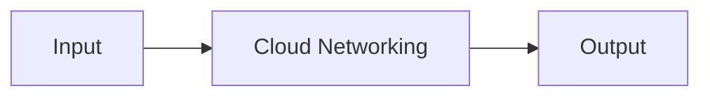

# Cloud Networking — A 2-Day Crash Course

Cloud networking is the foundation everything else sits on — VPCs, subnets, routing, peering, and connectivity are the roads your traffic travels, and misconfiguring them means outages or security breaches.

---

## Part 0 — Why This Matters

You can't debug a "service can't reach the database" issue if you don't understand how cloud networks work. This is the #1 gap in most DevOps engineers' knowledge. You'll hear "it works on my machine" replaced by "the security group is blocking it" or "the route table has no entry for that CIDR" — and if you don't know what those mean, you're guessing.

**Mental model:** A VPC is your own private data center in the cloud. You draw the network diagram — subnets, routes, gateways — and the cloud provider builds it instantly. The hardware, cables, and switches disappear. What remains is pure configuration, and configuration is both your power and your liability.

---

## Vocabulary — Learn These Cold

| Term | What it is |
|---|---|
| **VPC** | Virtual Private Cloud — an isolated, logically-defined network inside a cloud provider. Your private address space. |
| **Subnet** | A segment of your VPC's CIDR block, scoped to a single availability zone. Can be public (routed to the internet) or private (not). |
| **CIDR** | Classless Inter-Domain Routing — notation like `10.0.0.0/16` that defines an IP range. The `/16` means 65,536 addresses. |
| **Route Table** | A set of rules (routes) that tell traffic where to go. Every subnet is associated with exactly one route table. |
| **Internet Gateway (IGW)** | The door between your VPC and the public internet. Attach one to a VPC, add a route `0.0.0.0/0 → IGW` in a subnet's route table, and that subnet becomes public. |
| **NAT Gateway** | Lets private subnet instances initiate outbound internet traffic without being reachable from the internet. Lives in a public subnet. |
| **Security Group** | A stateful virtual firewall applied to an ENI (network interface). You allow traffic; denies are implicit. Stateful means return traffic is allowed automatically. |
| **NACL** | Network Access Control List — a stateless firewall applied at the subnet level. You must explicitly allow both inbound and outbound. Rules are numbered and evaluated in order. |
| **VPC Peering** | A private connection between two VPCs (same or different accounts/regions). Non-transitive — traffic does not flow through a peer to reach a third VPC. |
| **Transit Gateway** | A hub that connects multiple VPCs and on-premises networks. Enables transitive routing. The modern replacement for complex peering meshes. |
| **PrivateLink / VPC Endpoint** | Access AWS (or other) services over the AWS backbone without leaving your VPC and without using an internet gateway or NAT. |
| **Direct Connect / ExpressRoute / Interconnect** | Dedicated physical circuits from your data center to the cloud provider. Lower latency, more predictable bandwidth, higher cost than VPN. |
| **DNS** | Route 53 (AWS), Cloud DNS (GCP), Azure DNS — name resolution inside and outside your VPC. Private hosted zones resolve internal service names. |

---




## DAY 1 — Building a VPC From Scratch

### CIDR Planning

Before you create a single subnet, plan your address space. This is the decision you cannot easily undo.

Pick a `/16` for a VPC — it gives you 65,536 addresses and enough room to carve clean subnets. Common choices are `10.0.0.0/16`, `10.1.0.0/16`, and so on. The rule is simple: **no two VPCs that will ever peer or connect should share overlapping CIDRs.**

A practical allocation strategy for a production VPC (`10.0.0.0/16`):

```
10.0.0.0/18    → Public subnets   (AZ-a: /20, AZ-b: /20, AZ-c: /20)
10.0.64.0/18   → Private app      (AZ-a: /20, AZ-b: /20, AZ-c: /20)
10.0.128.0/18  → Private data     (AZ-a: /20, AZ-b: /20, AZ-c: /20)
10.0.192.0/18  → Reserved / future expansion
```

Each `/20` gives you 4,096 addresses per AZ per tier. That's almost always more than enough, and the clean boundaries make debugging easier.

⚠️ Reserve address space for future VPCs before you start. Renumbering a production VPC is painful.

### Public vs Private Subnets

The distinction is routing, not labeling.

A **public subnet** has a route table entry: `0.0.0.0/0 → Internet Gateway`. Resources in a public subnet with a public IP (Elastic IP or auto-assigned) are reachable from the internet.

A **private subnet** has no route to an Internet Gateway. Its default route either points to a NAT Gateway (for outbound-only internet access) or has no internet route at all.

Nothing stops you from launching a database in a public subnet — the cloud provider won't warn you. That's on you. Always launch data stores in private subnets.

### Route Tables

Every subnet is associated with a route table. When traffic leaves an instance, the VPC looks up the destination IP against the subnet's route table. The most specific (longest prefix) match wins.

A typical public subnet route table:

```
Destination       Target
10.0.0.0/16       local
0.0.0.0/0         igw-xxxxxxxxx
```

A typical private subnet route table:

```
Destination       Target
10.0.0.0/16       local
0.0.0.0/0         nat-xxxxxxxxx
```

The `local` route is implicit and cannot be deleted — it ensures all traffic within the VPC routes internally without leaving.

### Internet Gateway

An IGW is a horizontally scaled, redundant, HA component managed by AWS. You don't pay per hour; you pay for data transfer. Attach exactly one IGW per VPC. Adding the route to a subnet's table is a separate step — attaching the IGW to the VPC doesn't automatically make subnets public.

### NAT Gateway

A NAT Gateway lives in a public subnet and requires an Elastic IP. Private subnets route `0.0.0.0/0` to the NAT Gateway, which translates the source IP to its own EIP before forwarding to the internet.

For high availability, deploy one NAT Gateway per AZ and route each AZ's private subnets to their local NAT Gateway. One NAT Gateway for all AZs is cheaper but creates a single point of failure and cross-AZ data transfer costs.

NAT Gateway costs add up fast — roughly $0.045/hour plus $0.045/GB (AWS us-east-1). If your workload transfers significant data to the internet, S3 VPC endpoints eliminate the NAT cost for S3 traffic.

### Security Groups vs NACLs

This is a near-certain interview question.

**Security Groups:**
- Applied to ENIs (instances, load balancers, RDS, Lambda in VPC)
- Stateful — if you allow inbound port 443, return traffic is automatically allowed
- Allow rules only — no explicit deny
- Can reference other security groups by ID (e.g., "allow traffic from the app-sg")
- Evaluated as a whole — all rules are checked, most permissive match wins

**NACLs:**
- Applied to subnets
- Stateless — you must allow both inbound and outbound explicitly
- Allow and deny rules, evaluated in ascending rule number order
- First match wins — rule 100 is checked before rule 200
- Default NACL allows all; custom NACLs deny all by default

In practice: Security Groups do 95% of the work. NACLs are used for broad subnet-level blocks — blocking a known-bad IP range, compliance requirements for defense-in-depth, or rate-limiting a subnet during an incident.

If you open port 443 inbound on a NACL but forget to open ephemeral ports (1024–65535) outbound, your HTTPS connections will silently fail. This is the most common NACL mistake.

### DNS Resolution in VPCs

AWS VPCs have two VPC-level settings:

- **DNS resolution** — enables the AWS-provided DNS resolver at the VPC's second IP (e.g., `10.0.0.2` for a `10.0.0.0/16` VPC). Must be enabled.
- **DNS hostnames** — assigns private DNS hostnames (`ip-10-0-1-50.ec2.internal`) to instances. Needed for services that resolve by hostname.

Both must be enabled if you're using Route 53 private hosted zones or any service that depends on internal DNS names.

For custom DNS (corporate resolvers, Active Directory), use Route 53 Resolver endpoints — inbound endpoints to forward queries into the VPC, outbound endpoints to forward queries from the VPC to on-premises resolvers.

### AWS / GCP / Azure Comparison — Day 1 Concepts

| Concept | AWS | GCP | Azure |
|---|---|---|---|
| Isolated network | VPC | VPC | Virtual Network (VNet) |
| Subnet scope | AZ-scoped | Regional (spans zones) | Regional |
| Internet gateway | Internet Gateway | Cloud Router + route | Not explicit; public IP on resource |
| NAT | NAT Gateway | Cloud NAT | NAT Gateway |
| Stateful firewall | Security Group | Firewall Rules (VPC-wide) | Network Security Group (NSG) |
| Stateless firewall | NACL | No direct equivalent | — |
| DNS resolver | Route 53 Resolver | Cloud DNS | Azure DNS / Private DNS Zones |
| Default routing | Route Table per subnet | Routes (VPC-level) | Route Table (UDR) |

GCP's VPCs are global by default — a single VPC spans all regions, and subnets are regional. This simplifies peering but means firewall rules are VPC-wide unless you use hierarchical firewall policies. Azure subnets are regional and NSGs can be applied to subnets or individual NICs.

---

## DAY 2 — Connectivity, Hybrid Networking, and Troubleshooting

### VPC Peering

VPC Peering connects two VPCs privately. Traffic stays on the provider's backbone — it never hits the internet. You can peer VPCs across accounts and across regions.

The critical limitation: **peering is non-transitive.** If VPC-A peers with VPC-B, and VPC-B peers with VPC-C, VPC-A cannot reach VPC-C through VPC-B. You must create a direct peering between A and C.

For 3 VPCs, you need 3 peering connections. For 10 VPCs, you need up to 45. This is why peering doesn't scale — it becomes a mesh that's hard to reason about and expensive to manage.

After creating a peering connection:
1. Accept the peering request (if cross-account)
2. Add routes in both VPCs' route tables pointing to the peer
3. Update security groups to allow traffic from the peer's CIDR
4. If the VPCs are in different regions, enable DNS resolution for the peering

⚠️ The most common peering failure: the route table was updated but security groups still block the traffic, or vice versa.

### Transit Gateway

Transit Gateway (AWS) solves the peering mesh problem. It's a regional network hub — attach VPCs and VPN connections to it, and all attached networks can route to each other through the hub.

Architecture pattern (hub-and-spoke):

```
Shared Services VPC  <-->  Transit Gateway  <-->  Production VPC
                                 ^
                            Dev VPC
                                 ^
                         On-premises (VPN or Direct Connect)
```

Transit Gateway has route tables of its own. You can segment traffic: production VPCs go in one TGW route table, dev in another, ensuring prod and dev can't accidentally route to each other while both can reach shared services.

GCP equivalent: **Network Connectivity Center** (for hub-and-spoke with spokes including on-premises). Azure equivalent: **Virtual WAN (vWAN)**.

### PrivateLink and VPC Endpoints

When your EC2 instance calls S3, the request by default leaves your VPC, travels through NAT Gateway, hits S3's public endpoint, and returns. You pay for NAT data transfer and your traffic briefly touches the internet path.

VPC Endpoints eliminate this. There are two types:

**Gateway Endpoints** (free): Support S3 and DynamoDB. You add an entry to your route table pointing the S3/DynamoDB prefix list at the gateway endpoint. No cost, no bandwidth limit.

**Interface Endpoints** (PrivateLink, ~$7/month/AZ plus data): Create an ENI in your subnet with a private IP. DNS resolves the service's hostname to this private IP. Supports most AWS services — Secrets Manager, SSM, ECR, CloudWatch, SQS, and hundreds more.

For production workloads:
- Always use a Gateway Endpoint for S3 — it's free and eliminates unnecessary NAT costs
- Use Interface Endpoints for Secrets Manager and SSM — your EC2 instances need these at boot, and routing them through NAT adds unnecessary dependency on the NAT Gateway being healthy

In a locked-down private subnet with no internet access (compliance requirement), Interface Endpoints are mandatory for any AWS service your workloads call.

### VPN — Site-to-Site

A Site-to-Site VPN connects your on-premises network to your VPC over encrypted IPsec tunnels across the public internet. It's the fastest way to establish hybrid connectivity — setup takes minutes.

AWS provides a Virtual Private Gateway (VGW) on the VPC side and a Customer Gateway (CGW) resource representing your on-premises VPN device. Each VPN connection has two tunnels for redundancy.

Throughput is capped at ~1.25 Gbps per tunnel. For higher bandwidth or consistent latency, use Direct Connect.

### Direct Connect / ExpressRoute / Interconnect

A dedicated physical circuit from your network to the cloud provider's facility. Not internet-based — your traffic rides private fiber, usually through a colocation partner.

Benefits: predictable latency, consistent throughput, lower data transfer pricing, meets regulatory requirements that prohibit data traversing the public internet.

Drawbacks: takes weeks to provision, costs $0.03–$0.09/GB transferred (still lower than internet rates at scale), requires either colocation presence or a Direct Connect partner.

For BFSI, healthcare, and government workloads, Direct Connect (or ExpressRoute in Azure, Dedicated Interconnect in GCP) is not optional — it's a compliance requirement.

Use a VPN as a backup path alongside Direct Connect. If the dedicated link fails, failover to encrypted VPN keeps the hybrid connection alive.

### Hybrid Cloud Networking

Hybrid means your on-premises environment and cloud VPC are extensions of the same network. Traffic flows between them as if they're in the same data center.

Common patterns:

**Extend on-premises DNS to the cloud:** Route 53 Resolver outbound endpoints forward queries for your internal domain (e.g., `corp.internal`) to your on-premises DNS servers. Inbound endpoints let on-premises resolve cloud-hosted names.

**Shared services model:** A single shared services VPC (containing DNS, Active Directory, monitoring, CI/CD) connects to all workload VPCs via Transit Gateway. On-premises connects to the TGW once and can reach all spokes.

**IP address management:** On-premises and cloud must not overlap. Use a central IPAM (IP Address Management) tool — AWS IPAM, Infoblox, or a spreadsheet maintained religiously. Overlapping CIDRs kill peering connections and are hard to fix without re-architecture.

### Multi-Region Networking

For active-active or disaster recovery across regions:

- **Transit Gateway peering** — connect TGWs in different regions. Traffic stays on AWS backbone between regions.
- **Route 53 routing policies** — latency-based, geolocation, failover, and weighted routing to distribute traffic globally.
- **Global Accelerator** — routes users to the closest AWS edge location, then on the AWS backbone to your endpoint. Reduces latency for TCP/UDP workloads.
- **CloudFront** — for HTTP/HTTPS, caching at edge locations reduces origin load.

For multi-region VPCs, replicate your subnet/CIDR scheme consistently. If `10.0.0.0/16` is us-east-1, use `10.1.0.0/16` for eu-west-1, `10.2.0.0/16` for ap-southeast-1. When you peer or connect them, non-overlapping ranges make route tables predictable.

### Network Troubleshooting

When traffic isn't flowing, work the OSI model from the bottom up — but in cloud, start at layer 3/4 since layer 1/2 is the provider's problem.

**VPC Flow Logs:** Enable on VPCs, subnets, or individual ENIs. Logs every accepted and rejected flow. Search in CloudWatch Logs Insights or Athena. Look for REJECT entries — they'll tell you which security group or NACL is blocking traffic.

```sql
-- Athena query to find rejected traffic to port 5432 (Postgres)
SELECT srcaddr, dstaddr, srcport, dstport, action
FROM vpc_flow_logs
WHERE dstport = 5432 AND action = 'REJECT'
LIMIT 100;
```

**Reachability Analyzer (AWS):** A point-and-click tool that traces a logical path between two resources and tells you exactly where it breaks — security group, route table, NACL, or missing endpoint. Use it before digging through logs.

**DNS debugging steps:**
1. From inside the instance: `dig +short service.example.internal` — does it resolve?
2. Check DNS settings: `cat /etc/resolv.conf` — is it pointing to the VPC resolver (`169.254.169.253` or the VPC `.2` address)?
3. Check Route 53 private hosted zone — is the VPC associated with it?
4. If using a custom resolver: check outbound resolver rule, check the on-prem resolver is reachable

**traceroute / tracepath:** Shows routing hops. In a VPC, private hops won't respond — that's normal. A traceroute stopping at the expected hop but not continuing usually means a security group or NACL block, not a routing problem.

**Common debugging checklist:**

```
1. Security Group — does it allow the source IP/SG on the right port?
2. NACL — does it allow both inbound and outbound (stateless)?
3. Route Table — is there a route to the destination?
4. Internet Gateway / NAT — is the gateway attached and the route present?
5. Instance — is the process listening on the expected port and interface?
6. DNS — is the name resolving to the expected IP?
7. VPC Peering / TGW — are routes and acceptances in place on both sides?
```

### Network Design for BFSI and Regulated Industries

Financial services, insurance, and healthcare have specific requirements that change your network design:

**Isolation zones:** Separate VPCs (not just subnets) for production, pre-production, and development. Cross-zone traffic must go through an inspected path — a firewall appliance or AWS Network Firewall — not direct peering.

**No internet ingress to production:** All inbound traffic enters through a DMZ or dedicated ingress VPC with a WAF and IDS. Production workloads sit in VPCs with no IGW attached.

**Data in transit:** Enforce TLS everywhere — between tiers, not just at the edge. Use VPC endpoints to keep AWS API calls off the internet.

**Audit logging:** Flow logs are mandatory. Enable them on all production VPCs and ship to an immutable log store (S3 with Object Lock, or a separate SIEM account). Retention is typically 1–7 years.

**Compliance zones:** PCI-DSS cardholder data must be in a CDE (Cardholder Data Environment) subnet/VPC with strict segmentation. Validate segmentation annually with a penetration test.

**Private connectivity only:** Direct Connect or ExpressRoute for all cloud-to-datacenter traffic. No data traverses the public internet.

---

## Worked Example — Multi-Tier Production VPC

You're designing the network for a three-tier web application: a load balancer facing the internet, application servers in the middle, and a database at the back. Here's the full design.

### VPC and Subnet Layout

```
VPC: 10.0.0.0/16 (us-east-1)

Public subnets (ALB, NAT Gateways):
  10.0.0.0/24   — us-east-1a
  10.0.1.0/24   — us-east-1b
  10.0.2.0/24   — us-east-1c

Private app subnets (EC2 / ECS):
  10.0.10.0/24  — us-east-1a
  10.0.11.0/24  — us-east-1b
  10.0.12.0/24  — us-east-1c

Private data subnets (RDS, ElastiCache):
  10.0.20.0/24  — us-east-1a
  10.0.21.0/24  — us-east-1b
  10.0.22.0/24  — us-east-1c
```

### Route Tables

**Public route table** (attached to all public subnets):
```
10.0.0.0/16  → local
0.0.0.0/0    → igw-xxxxxxxx
```

**Private app route table** (one per AZ, routes to that AZ's NAT):
```
10.0.0.0/16      → local
0.0.0.0/0        → nat-xxxxxxxx (AZ-local)
pl-xxxxxxxxx     → vpce-s3 (S3 gateway endpoint prefix list)
```

**Private data route table** (no internet route):
```
10.0.0.0/16  → local
```

The data tier has no outbound internet path. If RDS needs to reach AWS APIs, it does so through VPC Interface Endpoints only.

### Security Groups

**alb-sg:** Inbound 80, 443 from `0.0.0.0/0`. Outbound to `app-sg` on port 8080.

**app-sg:** Inbound 8080 from `alb-sg`. Outbound 5432 to `db-sg`. Outbound 443 to anywhere (for AWS API calls via VPC endpoints or NAT).

**db-sg:** Inbound 5432 from `app-sg` only. No outbound rules needed for most databases (responses are allowed by stateful group).

### VPC Endpoints

**S3 Gateway Endpoint:** Free. Route table entries added automatically. App tier can write to S3 for object storage and logs without hitting NAT.

**Secrets Manager Interface Endpoint:** App servers call Secrets Manager at boot to retrieve database credentials. Without this endpoint, that call routes through NAT. With it, the call stays inside the VPC.

**SSM Interface Endpoint:** Allows EC2 instances without public IPs to be managed via Session Manager — no bastion host needed.

### Peering to Shared Services VPC

Your organization has a shared services VPC (`10.1.0.0/16`) containing CI/CD agents, monitoring collectors, and an Active Directory controller.

Create a peering connection between your app VPC (`10.0.0.0/16`) and the shared services VPC (`10.1.0.0/16`).

Add routes:
- In the app VPC's private app route table: `10.1.0.0/16 → pcx-xxxxxxxx`
- In the shared services VPC's route table: `10.0.0.0/16 → pcx-xxxxxxxx`

Update security groups:
- `app-sg`: allow inbound on monitoring port from shared services CIDR
- Shared services monitoring agent SG: allow outbound to `10.0.0.0/16`

### Traffic Flow Summary

```
Internet → ALB (public subnet, alb-sg)
         → App servers (private app subnet, app-sg) via Target Group
         → RDS (private data subnet, db-sg) on port 5432
         → S3 (via Gateway Endpoint — no NAT)
         → Secrets Manager (via Interface Endpoint — no NAT)
         → Monitoring (via VPC Peering to shared services VPC)

App servers → internet (software updates, third-party APIs)
           → NAT Gateway (public subnet) → IGW → internet
```

---


## Terminal Demo

```terminal-demo
# neteng@production ~ %

$ aws ec2 describe-vpcs --query 'Vpcs[].{ID:VpcId,CIDR:CidrBlock,Name:Tags[?Key==`Name`].Value|[0]}' --output table
--------------------------------------------
|              DescribeVpcs                |
+----------+---------------+--------------+
|   CIDR   |      ID       |    Name      |
+----------+---------------+--------------+
| 10.0.0.0/16| vpc-abc123  | prod-vpc     |
| 10.1.0.0/16| vpc-def456  | staging-vpc  |
+----------+---------------+--------------+

$ aws ec2 describe-subnets --filters "Name=vpc-id,Values=vpc-abc123" --query 'Subnets[].{AZ:AvailabilityZone,CIDR:CidrBlock,Type:Tags[?Key==`Type`].Value|[0],Available:AvailableIpAddressCount}' --output table
--------------------------------------------------
|                DescribeSubnets                 |
+----------------+--------------+--------+-------+
|       AZ       |    CIDR      | Type   |Avail  |
+----------------+--------------+--------+-------+
| ap-south-1a    | 10.0.1.0/24  | public |  245  |
| ap-south-1b    | 10.0.2.0/24  | public |  248  |
| ap-south-1a    | 10.0.10.0/24 | private|  250  |
| ap-south-1b    | 10.0.20.0/24 | private|  251  |
+----------------+--------------+--------+-------+

$ aws ec2 describe-security-groups --filters "Name=group-name,Values=prod-*" --query 'SecurityGroups[].{Name:GroupName,ID:GroupId,Rules:length(IpPermissions)}' --output table
-----------------------------------------
|        DescribeSecurityGroups         |
+---------+------------------+----------+
|  Name   |       ID         |  Rules   |
+---------+------------------+----------+
| prod-alb| sg-abc123        |    5     |
| prod-app| sg-def456        |    3     |
| prod-db | sg-ghi789        |    2     |
+---------+------------------+----------+

$ dig app.example.com +short
52.66.123.45
52.66.123.46

$ traceroute -m 10 app.example.com | head -5
 1  gateway (10.0.0.1)  0.5 ms
 2  isp-router (203.0.113.1)  2.1 ms
 3  * * *
 4  aws-edge (52.95.64.1)  15.2 ms
 5  prod-alb (52.66.123.45)  18.7 ms
```

---

## Common Pitfalls

**1. Overlapping CIDRs — the #1 mistake.** You create VPC-A (`10.0.0.0/16`) and VPC-B (`10.0.0.0/16`) and then try to peer them. The peer creation fails or, worse, succeeds but routing breaks. Plan your IP space before you create anything. Use AWS IPAM or a central spreadsheet.

**2. Security groups as default-allow.** Someone creates a security group, forgets to restrict it, and the default becomes "allow all from 0.0.0.0/0" on every port. This happens most often on database security groups. Audit security groups regularly — `aws ec2 describe-security-groups` and look for rules with source `0.0.0.0/0` on ports 22, 3306, 5432, 6379.

**3. Single NAT Gateway.** Putting one NAT Gateway in one AZ and routing all private subnets through it is a single point of failure. When that AZ has an issue, all private subnet outbound traffic stops. One NAT per AZ is the pattern — yes, it costs more.

**4. Forgetting NACL ephemeral ports.** If you add a NACL rule to block inbound on port 22, you also need to ensure your outbound ephemeral port rules (1024–65535) aren't blocked. A NACL blocks a subnet; a security group blocks an instance. Use the right tool.

**5. VPC Peering without DNS resolution enabled.** After peering, instances in each VPC can communicate by IP. But if VPC-A tries to resolve `db.internal` (a Route 53 private hosted zone in VPC-B), it fails unless you enable DNS resolution support on the peering connection and associate the hosted zone with VPC-A.

**6. Not using VPC Endpoints for S3.** Traffic to S3 from a private subnet goes through NAT Gateway by default. At scale, that's significant cost. A Gateway Endpoint is free, takes two minutes to configure, and eliminates the data transfer charge.

**7. Attaching the IGW but not adding the route.** Attaching an Internet Gateway to a VPC does nothing by itself. You must also add `0.0.0.0/0 → igw-xxx` to the subnet's route table. The resources also need a public IP. All three conditions must be true for a subnet to be public.

**8. Over-permissive peering.** When you peer VPCs, update route tables and security groups with the specific CIDR you need. Don't route the entire `10.0.0.0/8` to a peer — route exactly `10.1.0.0/16` to reach that specific VPC. Principle of least privilege applies to routing.

---

## Quick Reference

### CIDR Cheatsheet

| CIDR | Addresses | Usable (AWS reserves 5) | Common use |
|---|---|---|---|
| /16 | 65,536 | 65,531 | VPC |
| /20 | 4,096 | 4,091 | Large subnet per AZ |
| /24 | 256 | 251 | Standard subnet per AZ |
| /27 | 32 | 27 | Small service subnet |
| /28 | 16 | 11 | Bastion / endpoint subnet |

AWS reserves 5 IPs per subnet: network address, VPC router, DNS, future use, broadcast.

### AWS / GCP / Azure Networking Comparison

| Concept | AWS | GCP | Azure |
|---|---|---|---|
| Private network | VPC | VPC | Virtual Network (VNet) |
| Subnet scope | Availability Zone | Regional | Regional |
| Public access control | IGW + public IP + route | External IP on instance | Public IP + NSG |
| Private outbound | NAT Gateway | Cloud NAT | NAT Gateway |
| Instance firewall | Security Group | Firewall Rules (tag-based) | NSG (subnet or NIC) |
| Subnet firewall | NACL | No direct equivalent | NSG (subnet-level) |
| DNS | Route 53 | Cloud DNS | Azure DNS |
| Private DNS | Private Hosted Zone | Private DNS Zone | Private DNS Zone |
| Peering | VPC Peering | VPC Peering | VNet Peering |
| Hub routing | Transit Gateway | Network Connectivity Center | Virtual WAN |
| Private service access | PrivateLink (Interface Endpoint) | Private Service Connect | Private Endpoint |
| Free service endpoint | Gateway Endpoint (S3/DynamoDB) | — | Service Endpoint |
| Dedicated circuit | Direct Connect | Dedicated Interconnect | ExpressRoute |
| Flow logs | VPC Flow Logs | VPC Flow Logs | NSG Flow Logs |
| Network topology tool | Reachability Analyzer | Connectivity Tests | Network Watcher |

### VPC Design Checklist

Before going to production:

```
CIDR
[ ] VPC CIDR does not overlap with any peered or connected VPC
[ ] Subnets have room for 2x growth
[ ] Reserved space for future VPCs in the org

Routing
[ ] Public subnets have route to IGW
[ ] Private subnets route to NAT Gateway (one per AZ)
[ ] S3 Gateway Endpoint in route tables
[ ] No route to IGW in private subnet route tables

Security
[ ] No security group allows 0.0.0.0/0 on ports 22, 3389, or database ports
[ ] Database security group only allows from application security group
[ ] NACLs configured if required by compliance (and ephemeral ports opened)

DNS
[ ] DNS resolution and DNS hostnames enabled on VPC
[ ] Private hosted zone associated with VPC
[ ] Resolver rules in place for on-premises domains (if hybrid)

Connectivity
[ ] VPC Endpoints for Secrets Manager, SSM, ECR if instances are in private subnets
[ ] Peering connections accepted and routes added on both sides
[ ] Security groups updated to allow peered CIDR traffic

Operations
[ ] VPC Flow Logs enabled and shipping to CloudWatch or S3
[ ] Reachability Analyzer or equivalent documented for incident use
[ ] IPAM entry updated with new CIDR allocation
```

---

## Top 10 Interview Questions

<details>
<summary><strong>Q: What is the difference between a Security Group and a NACL?</strong></summary>

Security Groups are stateful firewalls applied to individual ENIs (instances, load balancers, RDS). You write allow rules only; return traffic is automatically permitted. NACLs are stateless firewalls applied to entire subnets, with both allow and deny rules evaluated in numbered order. Because NACLs are stateless, you must explicitly allow ephemeral ports (1024-65535) for return traffic. In practice, Security Groups do 95% of the work; NACLs are used for broad subnet-level blocks or compliance requirements.

</details>

<details>
<summary><strong>Q: How do you design a VPC for a three-tier application?</strong></summary>

Use a /16 VPC with three tiers of subnets across at least two AZs. Public subnets hold the ALB and NAT Gateways, with a route to the Internet Gateway. Private app subnets hold application servers, routing outbound through NAT. Private data subnets hold databases with no internet route at all. Security groups chain: ALB-sg allows 443 from the internet, app-sg allows 8080 from ALB-sg only, db-sg allows 5432 from app-sg only. Add S3 Gateway Endpoints and Secrets Manager Interface Endpoints to avoid NAT for AWS service calls.

</details>

<details>
<summary><strong>Q: Why is VPC Peering non-transitive, and what is the alternative?</strong></summary>

VPC Peering creates a direct private connection between two VPCs, but traffic cannot transit through one peer to reach a third. If VPC-A peers with VPC-B and VPC-B peers with VPC-C, A cannot reach C through B — you need a direct A-to-C peering. For more than 3-4 VPCs, this creates an unmanageable mesh. Transit Gateway solves this as a hub — all VPCs attach to the TGW and can route to each other through it, with route table segmentation for isolation.

</details>

<details>
<summary><strong>Q: What are VPC Endpoints and when should you use them?</strong></summary>

VPC Endpoints let you access AWS services (S3, DynamoDB, Secrets Manager, KMS) over the AWS backbone without leaving your VPC. Gateway Endpoints (S3, DynamoDB) are free and add a route table entry. Interface Endpoints (PrivateLink) create an ENI with a private IP in your subnet (~$7/month/AZ). Use them when your instances are in private subnets — they eliminate NAT Gateway dependency and data transfer costs, and keep traffic off the public internet for compliance.

</details>

<details>
<summary><strong>Q: How do you troubleshoot connectivity issues in a VPC?</strong></summary>

Work through the checklist: Security Group (correct port and source?), NACL (inbound and outbound allowed, including ephemeral ports?), Route Table (route to destination exists?), IGW/NAT (attached and routed?), instance (process listening on correct port?), DNS (name resolving to expected IP?), peering/TGW (routes and acceptances on both sides?). Use VPC Flow Logs to find REJECT entries. AWS Reachability Analyzer traces the logical path and tells you exactly where it breaks.

</details>

<details>
<summary><strong>Q: What is CIDR planning and why is it critical to get right early?</strong></summary>

CIDR planning allocates non-overlapping IP address ranges to every VPC before you create anything. Overlapping CIDRs prevent peering and cause routing conflicts that require re-architecture to fix. Use a /16 per VPC (65,536 addresses), reserve ranges for future VPCs, and document allocations centrally (AWS IPAM or a spreadsheet). If VPC-A is 10.0.0.0/16, VPC-B should be 10.1.0.0/16. This is the networking decision you cannot easily undo.

</details>

<details>
<summary><strong>Q: When would you use Direct Connect versus a Site-to-Site VPN?</strong></summary>

Site-to-Site VPN runs encrypted IPsec tunnels over the public internet — it is fast to set up (minutes), costs less, but throughput caps at ~1.25 Gbps and latency varies. Direct Connect is a dedicated physical circuit with predictable latency, higher bandwidth, and lower data transfer costs. For BFSI and regulated workloads, Direct Connect is often a compliance requirement — no data traverses the public internet. Use VPN as a backup path alongside Direct Connect for failover.

</details>

<details>
<summary><strong>Q: How does NAT Gateway pricing work and how do you reduce NAT costs?</strong></summary>

NAT Gateway costs roughly $0.045/hour plus $0.045/GB of data processed. At scale, this adds up fast. Reduce costs by adding free S3 and DynamoDB Gateway Endpoints (eliminates NAT for those services), using Interface Endpoints for frequently called AWS services, and auditing what traffic actually needs internet access. Deploy one NAT per AZ for high availability, but be aware each one adds to the hourly cost.

</details>

<details>
<summary><strong>Q: How does GCP networking differ from AWS networking?</strong></summary>

GCP VPCs are global by default — a single VPC spans all regions, with subnets being regional. Firewall rules are VPC-wide and tag-based rather than per-subnet or per-instance. Cloud NAT is a managed service that does not require deploying in a specific subnet. There is no NACL equivalent. Cloud Load Balancing is global with a single anycast IP. This simplifies many patterns but means firewall rules need careful scoping to avoid overly permissive defaults.

</details>

<details>
<summary><strong>Q: How would you design network security for a regulated (BFSI/PCI) environment?</strong></summary>

Separate VPCs (not just subnets) for production, pre-production, and development. No Internet Gateway on production VPCs — all inbound traffic enters through a DMZ/ingress VPC with WAF and IDS. Cross-zone traffic routes through an inspection VPC with AWS Network Firewall. Direct Connect for all cloud-to-datacenter traffic. TLS everywhere, including between tiers. VPC Flow Logs enabled on all production VPCs, shipped to an immutable log store. PCI cardholder data in a dedicated CDE subnet with strict segmentation validated by annual pen testing.

</details>

---

## The Mantra

> Know your CIDR. Trace your route. Check your security group before you blame the code.

Every network problem in the cloud is either a routing issue, a firewall issue, or a DNS issue. If you internalize that, you'll resolve incidents faster than anyone else in the room.

---


## Quick Quiz

Test your understanding with these rapid-fire questions (answers hidden):

<details>
<summary>1. What is the ONE core problem that Cloud Networking solves?</summary>
Re-read Part 0 — the mental model section. If you can explain the "why" in one sentence, you understand the foundation.
</details>

<details>
<summary>2. Name the 3 most important terms from the vocabulary section.</summary>
Review Part 1. These are the building blocks every conversation about Cloud Networking uses.
</details>

<details>
<summary>3. What is the first thing you would set up on Day 1?</summary>
Check the Day 1 section — the very first hands-on step that gets you a working result.
</details>

<details>
<summary>4. What is the most common production pitfall with Cloud Networking?</summary>
Review the Common Pitfalls section. The first item listed is typically the most frequently encountered.
</details>

<details>
<summary>5. How does Cloud Networking compare to its closest alternative?</summary>
Check the Comparison Matrix below — focus on the key differentiating row.
</details>


## Comparison Matrix

| Dimension | Cloud Networking | Traditional DC | SD-WAN |
|-----------|------------------|----------------|--------|
| **Primary use case** | Core strength of Cloud Networking | Core strength of Traditional DC | Core strength of SD-WAN |
| **Learning curve** | Moderate | Varies | Varies |
| **Community/ecosystem** | Active | Active | Growing |
| **Operational complexity** | Medium | Varies | Varies |
| **Best for** | See Part 0 | Different tradeoffs | Different tradeoffs |

> **How to read this matrix:** no tool wins on every dimension. Pick based on your specific constraints — team expertise, existing infrastructure, scale requirements, and compliance needs. The right choice is the one that fits your context, not the one with the most checkmarks.

## Next Steps

Work through these in order:

- `Cloud-Security.md` — IAM, encryption, compliance — the policies that sit on top of this network
- `Cloud-Architecture.md` — how to compose VPCs into resilient, scalable systems
- `AWS.md` — deep dive into AWS-specific networking services and CLI commands
- `GCP.md` — GCP's global VPC model, Cloud NAT, and Private Service Connect
- `Azure.md` — VNets, NSGs, ExpressRoute, and Azure Private Endpoint
- `DNS-curl-dig.md` — DNS debugging in depth — the tool you'll use in every network incident
- `WireGuard.md` — lightweight VPN for site-to-site or peer access without Direct Connect costs

Cross-reference: `AWS.md`, `GCP.md`, `Azure.md`, `DNS-curl-dig.md`, `WireGuard.md`, `Kubernetes.md` (CNI networking — how the concepts here map to pod networking, services, and network policies inside a cluster).

---

## Recommended learning resources

**YouTube channels & playlists:**
- [Adrian Cantrill — VPC Deep Dive & Cloud Networking](https://www.youtube.com/@adriancantrill) — the clearest visual explanations of VPCs, subnets, route tables, and Transit Gateway
- [Google Cloud Tech — Cloud Networking Series](https://www.youtube.com/@googlecloudtech) — GCP's global VPC model, Cloud NAT, and Private Service Connect explained by the product team
- [John Savill — Azure Networking Master Class](https://www.youtube.com/@NTFAQGuy) — comprehensive whiteboard sessions on VNets, NSGs, ExpressRoute, and Azure Firewall
- [NetworkChuck — Cloud Networking for Beginners](https://www.youtube.com/@NetworkChuck) — hands-on, beginner-friendly labs covering VPCs, subnets, and security groups
- [AWS re:Invent — Networking Track](https://www.youtube.com/@AWSEventsChannel) — deep dives on Transit Gateway, PrivateLink, and VPC design at scale

**Official docs & blogs:**
- [AWS VPC Documentation](https://docs.aws.amazon.com/vpc/latest/userguide/what-is-amazon-vpc.html) — the canonical reference for subnets, route tables, security groups, and NACLs
- [Google Cloud Networking Documentation](https://cloud.google.com/vpc/docs) — VPC, firewall rules, Cloud NAT, and Private Service Connect
- [Azure Virtual Network Documentation](https://learn.microsoft.com/en-us/azure/virtual-network/) — VNets, NSGs, peering, and Private Endpoints
