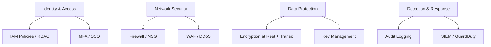

# Cloud Security — A 2-Day Crash Course

Cloud security is the shared responsibility model in practice — IAM, encryption, network controls, compliance, and detection that protect your workloads from breaches, data leaks, and regulatory violations.

---

## Part 0 — Why This Matters

The cloud provider's infrastructure is not what gets breached. Your configuration of it is. Misconfigured S3 buckets exposed to the public internet, IAM roles with `*` permissions attached to Lambda functions, RDS databases with no encryption, CloudTrail disabled in half your accounts — these are the actual causes of cloud breaches, and they are all entirely your fault.

The cloud is fundamentally a shared responsibility contract. The provider owns the physical security, the hypervisor, the managed service internals. You own everything you deploy on top — the IAM policies, the network rules, the encryption keys, the logging.

**Mental model — concentric rings of defense:**

```
[ Identity — who can act ]
  [ Network — where they can act from ]
    [ Data — what they can touch ]
      [ Detection — when they act ]
```

Attackers only need to break one ring. You have to defend all four. A leaked IAM key bypasses your network controls entirely. An unencrypted database makes your network security irrelevant once they're in. Detection is what limits blast radius when the other three fail — and they will eventually fail.

Start with identity. Harden it harder than you think you need to. Then work outward.

---




## Part 1 — Vocabulary

**Shared Responsibility Model** — The contractual boundary between what the cloud provider secures (hardware, hypervisors, physical facilities, managed service internals) and what you secure (IAM, OS, application, data, network config). The exact split varies by service type: IaaS (EC2) gives you more control and more responsibility; PaaS (RDS) and SaaS (Workspaces) shift more to the provider.

**IAM (Identity and Access Management)** — The system that controls who (humans, services, machines) can do what to which resources. Consists of identities (users, roles, service accounts), permissions (what actions are allowed), and policies (documents that express permissions). Every cloud has one; they differ in syntax, not concept.

**Least Privilege** — Grant only the permissions actually needed, nothing more. Not "give the app S3 read access" but "give this Lambda function read access to this specific bucket, for these specific object prefixes, from this specific VPC." In practice, start with deny-all and open up as needed.

**SCP (Service Control Policy)** — AWS Organizations feature. A guardrail applied at the OU or account level that restricts what even admin users can do. SCPs do not grant permissions — they set the maximum allowed boundary. If an SCP denies `ec2:*` in region `ap-east-1`, no IAM policy in that account can override it.

**KMS (Key Management Service)** — A managed service for creating, rotating, and controlling access to encryption keys. Keys never leave KMS unencrypted. You use KMS to encrypt/decrypt data by calling the API — the key material itself is never exposed to your application code.

**Envelope Encryption** — The pattern KMS uses under the hood. A data encryption key (DEK) encrypts your data locally; the DEK itself is then encrypted by a master key (CMK) in KMS. This lets you encrypt large datasets efficiently while keeping the actual key material inside KMS.

**Encryption at Rest** — Data stored in S3, EBS, RDS, DynamoDB is encrypted on disk using AES-256. Enabled at resource creation. You manage the keys (SSE-KMS) or let the provider manage them (SSE-S3/AWS managed). Mandatory for any regulated workload.

**Encryption in Transit** — TLS everywhere. Between your browser and the load balancer, between the load balancer and the app, between the app and the database, between services in the same VPC. Use TLS 1.2+ minimum, enforce 1.3 where possible.

**Security Group** — Stateful virtual firewall attached to an ENI (network interface). Operates at the instance/service level. Default deny inbound, default allow outbound. Rules specify port, protocol, and source (CIDR or another security group). Changes take effect immediately.

**NACL (Network ACL)** — Stateless firewall at the subnet level. Evaluated before security groups. Rules are numbered; lowest number wins. Stateless means you must explicitly allow both inbound and outbound directions for bidirectional traffic. Use for broad subnet-level blocks (e.g., block a known-bad CIDR).

**WAF (Web Application Firewall)** — Layer 7 protection. Inspects HTTP(S) traffic and blocks common attack patterns — SQL injection, XSS, path traversal, bot traffic. Sits in front of ALB, API Gateway, or CloudFront. Works on rule sets (AWS Managed Rules, OWASP Top 10 sets, custom rules).

**GuardDuty / Security Command Center / Microsoft Defender** — Threat detection services. Analyze CloudTrail logs, VPC flow logs, DNS logs for anomalous behavior — unusual API calls, impossible travel, crypto mining signatures, known malicious IPs. Output is findings with severity, not raw logs.

**CloudTrail / Audit Logs** — Every API call made to AWS is recorded in CloudTrail. Who called it, from where, what parameters, what the response was. This is your audit trail and your forensics source. Disabling CloudTrail is itself a finding. Equivalent: GCP Cloud Audit Logs, Azure Monitor Activity Log.

**CSPM (Cloud Security Posture Management)** — Tools that continuously evaluate your cloud configuration against best practices and compliance benchmarks. Checkov, Prowler, ScoutSuite, Prisma Cloud. They tell you "this S3 bucket has public ACLs" or "this IAM policy allows *:*" before an attacker does.

**Zero Trust** — Never trust, always verify. No implicit trust based on network location. Every request — even internal — is authenticated, authorized, and logged. Assumes breach. Enforce MFA everywhere, mTLS between services, time-limited credentials, continuous authorization.

---

## Day 1 — Identity, Encryption, and the Foundation

### The Shared Responsibility Model in Practice

The model is cleaner in theory than in practice. A few rules of thumb:

- **EC2**: You own everything from the OS up. Patch it. Harden it. Encrypt the EBS volumes.
- **RDS**: AWS manages the database engine patching and underlying host. You manage encryption, network access, IAM authentication, and backup policy.
- **S3**: AWS manages durability and availability. You manage bucket policies, public access block, object-level encryption, and versioning.
- **Lambda**: AWS manages the execution environment. You manage the IAM execution role, the code, the secrets the code uses.

The rule is: anything you configure, you own. Anything the provider manages without your input, they own.

### IAM Deep-Dive

**Users** are long-lived identities with static credentials. Avoid them for programmatic access — they accumulate permissions, keys get leaked in git, MFA gets skipped. Use them for humans, enforce MFA, and nothing else.

**Roles** are temporary identities. A role has a trust policy (who can assume it) and a permission policy (what it can do). When assumed, it issues temporary credentials (15 minutes to 12 hours). Use roles for everything: EC2 instances, Lambda functions, ECS tasks, CI/CD pipelines, cross-account access.

**Policies** are JSON documents. The structure is: Version, Statement array, each Statement has Effect (Allow/Deny), Action (list of API operations), Resource (list of ARNs), and optionally Condition (context-based constraints like IP, time, MFA presence).

```json
{
  "Version": "2012-10-17",
  "Statement": [
    {
      "Effect": "Allow",
      "Action": ["s3:GetObject", "s3:PutObject"],
      "Resource": "arn:aws:s3:::my-bucket/app-data/*",
      "Condition": {
        "StringEquals": {"aws:RequestedRegion": "ap-south-1"}
      }
    }
  ]
}
```

**Assume-Role** is the mechanism for granting temporary access. An entity with `sts:AssumeRole` permission calls the STS API and gets back `AccessKeyId`, `SecretAccessKey`, and `SessionToken` — all time-limited. Use this for cross-account deployments, CI/CD pipelines, and federated access.

**OIDC Federation** — CI/CD systems like GitHub Actions can federate with AWS using OIDC. The pipeline presents a JWT token to AWS STS, which validates it against a trusted OIDC provider, and issues temporary role credentials. No stored secrets. No long-lived keys in GitHub Secrets for AWS access.

```yaml
# GitHub Actions — AWS OIDC example
- uses: aws-actions/configure-aws-credentials@v4
  with:
    role-to-assume: arn:aws:iam::123456789:role/github-deploy
    aws-region: ap-south-1
```

**Service Accounts (GCP)** — The GCP equivalent of IAM roles for compute workloads. A service account is an identity for a GKE pod, Cloud Run service, or Compute Engine VM. Bind IAM roles to the service account at the project or resource level. Use Workload Identity on GKE — do not download and mount JSON key files.

### Least Privilege — How to Actually Do It

Start with CloudTrail or GCP Audit Logs. Run the workload with a broad policy first (only in a dev environment). After a few weeks, use AWS IAM Access Analyzer or GCP IAM Recommender to see what permissions were actually used. Remove everything else.

For new policies, write them permission by permission against the specific resources the workload needs. Use `Condition` blocks to tighten further — require requests come from your VPC (`aws:SourceVpc`), require MFA (`aws:MultiFactorAuthPresent`), restrict to a region.

Run Checkov or cfn-python-lint on every IAM policy before it ships. Fail the pipeline on `Effect: Allow, Action: *, Resource: *`.

### SCPs and Multi-Account Guardrails

In a multi-account AWS setup (using AWS Organizations), SCPs are your org-level safety net. You cannot grant permissions with an SCP — you can only restrict the maximum permissions any principal in the account can have.

Common SCP patterns:

```json
// Deny all actions outside approved regions
{
  "Effect": "Deny",
  "Action": "*",
  "Resource": "*",
  "Condition": {
    "StringNotEquals": {
      "aws:RequestedRegion": ["ap-south-1", "ap-southeast-1", "us-east-1"]
    }
  }
}
```

```json
// Prevent disabling CloudTrail
{
  "Effect": "Deny",
  "Action": ["cloudtrail:StopLogging", "cloudtrail:DeleteTrail"],
  "Resource": "*"
}
```

```json
// Require MFA for console access
{
  "Effect": "Deny",
  "NotAction": ["iam:CreateVirtualMFADevice", "iam:EnableMFADevice", "sts:GetSessionToken"],
  "Resource": "*",
  "Condition": {
    "BoolIfExists": {"aws:MultiFactorAuthPresent": "false"}
  }
}
```

Attach restrictive SCPs to your root OU, then carve out exceptions for specific OUs as needed. Never attach the FullAWSAccess SCP to anything below root unless you have a deliberate reason.

### Encryption — KMS, Envelope Encryption, TLS Everywhere

**KMS fundamentals**: Create a Customer Managed Key (CMK). Define a key policy — who can administer it, who can use it for encrypt/decrypt. Never give `kms:*` to any principal. Separate key admin from key usage.

Enable automatic key rotation (1 year for symmetric keys). KMS keeps old versions for decryption but uses the latest for encryption.

For every S3 bucket: `aws s3api put-bucket-encryption` with `aws:kms`. For every EBS volume: encrypt at creation. For RDS: enable encryption at DB instance creation (you cannot encrypt an existing unencrypted instance — you have to take a snapshot, copy it encrypted, and restore). For Secrets Manager: encrypt the secret with a KMS key.

**TLS**: Use ACM (AWS Certificate Manager) for TLS certificates on ALBs and CloudFront — it handles rotation automatically. Enforce HTTPS-only on S3 static sites via bucket policy with `aws:SecureTransport`. Use SSL/TLS on RDS connections. Enable `enforce_ssl` on ElasticSearch domains. Never run internal service-to-service traffic unencrypted even inside a VPC — mTLS via service meshes (Istio, App Mesh) or at minimum TLS with certificate validation.

### AWS vs GCP vs Azure IAM Comparison

| Concept | AWS | GCP | Azure |
|---|---|---|---|
| Human identity | IAM User | Google Account / Cloud Identity | Azure AD User |
| Machine identity | IAM Role | Service Account | Managed Identity |
| Permission document | IAM Policy (JSON) | IAM Condition + Role | RBAC Role Definition |
| Cross-account | AssumeRole via STS | Service Account impersonation | Cross-tenant via Azure AD B2B |
| OIDC federation | OIDC provider + STS | Workload Identity Federation | Federated Credentials |
| Org-level guardrail | SCP (Organizations) | Org Policy Constraints | Azure Policy |
| Credential lifetime | 15 min – 12 hr (STS) | 1 hr default (OAuth2 token) | 1 hr default (access token) |
| Key inventory | IAM Access Analyzer | IAM Recommender | Azure Advisor |
| CLI auth | `aws configure` + profiles | `gcloud auth activate-service-account` | `az login` |

---

## Day 2 — Detection, Network Security, Secrets, and Compliance

### Detection and Response

**CloudTrail** — Enable it in every region, in every account, and aggregate to a centralized S3 bucket in a dedicated security account. Enable log file validation (detects tampering). Set up CloudWatch Logs integration for real-time alerting on specific events (root login, SCP modifications, IAM policy changes).

**GuardDuty** — Enable it. It is cheap relative to what it catches. It ingests CloudTrail management events, S3 data events, VPC flow logs, and DNS query logs. It outputs findings like `UnauthorizedAccess:IAMUser/InstanceCredentialExfiltration` when your EC2 instance role credentials are used from an external IP. Review findings daily; automate remediation for high-severity findings via EventBridge -> Lambda.

**Security Hub** — Aggregates findings from GuardDuty, Inspector, Macie, Firewall Manager, and third-party tools into a single dashboard. Runs CIS AWS Foundations Benchmark and AWS Foundational Security Best Practices checks continuously. Score your accounts. Fix findings in priority order.

**GCP equivalent**: Security Command Center (SCC). Enable Standard tier minimum, Premium for threat intelligence. Event Threat Detection and Container Threat Detection are Premium features worth having.

**Azure equivalent**: Microsoft Defender for Cloud. Integrates with Azure Monitor, Microsoft Sentinel (SIEM), and Azure Policy. Secure Score gives you a prioritized remediation list.

**What to alert on:**
- Root account login (always)
- IAM policy changes in production accounts
- SCP modifications
- CloudTrail disabled in any region
- S3 public access block disabled
- Security group opening `0.0.0.0/0` on port 22 or 3389
- GuardDuty high-severity findings
- Failed authentication spikes

### Network Security

**Security Groups** are your primary defense at the workload level. The right posture:

- Bastion hosts: allow SSH/RDP only from your corporate egress IP or VPN
- Application tier: allow only from the load balancer's security group, not a CIDR
- Database tier: allow only from the application tier's security group, not a CIDR
- Never `0.0.0.0/0` on port 22, 3306, 5432, 6379, 27017 — ever

Reference security groups by ID in rules, not by CIDR ranges. This is dynamic and survives IP changes.

**NACLs** provide subnet-level stateless filtering. Use them to block known-bad CIDRs across an entire subnet. Since they are stateless, you must allow ephemeral ports outbound (1024-65535) for return traffic on inbound rules. They operate in order — lower rule number wins.

**WAF**: Attach to every public-facing ALB and API Gateway. Enable AWS Managed Rule Groups as a baseline: `AWSManagedRulesCommonRuleSet`, `AWSManagedRulesKnownBadInputsRuleSet`, `AWSManagedRulesSQLiRuleSet`. Add rate-based rules to throttle abusive clients. Log all WAF decisions to S3 or CloudWatch.

**DDoS protection**: AWS Shield Standard is free and automatic — protects against volumetric network-layer attacks. AWS Shield Advanced adds SRT (Shield Response Team) support, attack diagnostics, and financial protection against scaling costs during attacks. Enable it for internet-facing applications in regulated industries.

**Private connectivity**: Never traverse the public internet for service-to-service calls within AWS. Use VPC Endpoints (Interface and Gateway) to reach S3, DynamoDB, STS, KMS, Secrets Manager without leaving the AWS network. Use PrivateLink for cross-account service consumption.

### Secrets Management

The rule is absolute: no credentials in source code, environment variables in plaintext, or config files committed to git. This includes database passwords, API keys, SSH keys, certificates, OAuth client secrets.

**AWS Secrets Manager** — Store secrets, enable automatic rotation (built-in support for RDS, Redshift, DocumentDB credentials), control access via resource-based policies and IAM. Retrieve at runtime via the SDK. Cache locally with a short TTL to reduce API calls.

```python
import boto3
import json

client = boto3.client('secretsmanager', region_name='ap-south-1')
secret = json.loads(
    client.get_secret_value(SecretId='prod/app/db-credentials')['SecretString']
)
db_password = secret['password']
```

**AWS Systems Manager Parameter Store** — Cheaper than Secrets Manager for non-rotating values. SecureString parameters are KMS-encrypted. Good for configuration values, feature flags, non-sensitive config alongside sensitive parameters.

**HashiCorp Vault** — Provider-agnostic secrets engine. Supports dynamic secrets (generates a short-lived database credential on demand, revokes it when the lease expires). Excellent for multi-cloud or on-premise hybrid environments. See `Vault.md` for operational patterns.

**GCP Secret Manager** — Same concept as Secrets Manager. Secrets are versioned. Access via IAM (`roles/secretmanager.secretAccessor`). Integrates natively with GKE Workload Identity.

⚠️ Run `git-secrets` or `truffleHog` as a pre-commit hook and in CI. Once a credential is committed to git history, assume it is compromised — rotate it immediately even if the repo is private.

### CSPM Tools

**Checkov** — Static analysis for IaC. Runs against Terraform, CloudFormation, Kubernetes manifests, Dockerfiles, Helm charts. Hundreds of built-in policies. Integrate into CI to fail builds on security misconfigurations. See `Checkov.md`.

```bash
checkov -d ./terraform/ --framework terraform --check CKV_AWS_*
```

**Prowler** — Runtime assessment of your live AWS account against CIS Benchmarks, AWS Security Best Practices, GDPR, HIPAA, SOC2, PCI-DSS. Produces HTML and CSV reports. Run it periodically or as part of a compliance pipeline.

```bash
prowler aws --region ap-south-1 --compliance aws_well_architected_framework
```

**ScoutSuite** — Multi-cloud (AWS, GCP, Azure, OCI) security auditor. Connects via cloud APIs, generates an HTML report. Good for one-time assessments or onboarding new accounts.

**Falco** — Runtime security for containers and Kubernetes. Monitors kernel system calls and detects anomalous behavior — container privilege escalation, unexpected outbound connections, crypto mining, file tampering. See `Falco.md`.

### Compliance Frameworks

Compliance is a floor, not a ceiling. Meeting SOC2 does not mean you are secure — it means you have documented controls that auditors can verify.

**SOC2 (Type II)** — Trust Services Criteria: Security, Availability, Processing Integrity, Confidentiality, Privacy. Type I is a point-in-time assessment; Type II covers a period (typically 6-12 months) and tests operating effectiveness. Required by most enterprise SaaS customers. Controls map to: access control, change management, incident response, availability monitoring.

**PCI-DSS** — Payment Card Industry Data Security Standard. 12 requirements covering cardholder data protection. If you store, process, or transmit card data, you are in scope. Scope reduction is the real skill — use tokenization to push card processing to a compliant third party (Stripe, Razorpay) and reduce your surface to near zero.

**HIPAA** — US healthcare data. PHI (Protected Health Information) must be encrypted at rest and in transit, access controlled, and audit logged. Sign a Business Associate Agreement (BAA) with AWS, GCP, or Azure before processing PHI on their services. Not all services are HIPAA-eligible — check the provider's compliance page.

**RBI Guidelines (BFSI — India)** — Reserve Bank of India mandates for IT frameworks in banking and financial services. Key requirements: data localization (customer data must reside in India), audit trails for all access, DR/BCP with defined RTO/RPO, VAPT (Vulnerability Assessment and Penetration Testing) annually, cyber incident reporting within defined timelines. AWS `ap-south-1` (Mumbai) satisfies data residency; enforce via SCP region restriction.

**ISO 27001** — Information Security Management System standard. Process-oriented — you define controls, document them, and get audited on implementation. AWS/GCP/Azure are ISO 27001 certified for their infrastructure; your workloads are not automatically covered.

### Security in CI/CD

The pipeline is an attack surface. A compromised CI/CD system can deploy malicious code, exfiltrate secrets, and modify your infrastructure — often with the same permissions as your production deployment system.

**Scan before deploy:**
- Container images: Trivy, Grype, Snyk (see `Trivy.md`)
- IaC: Checkov, tfsec, terrascan
- Application dependencies: Dependabot, OWASP Dependency-Check, `npm audit`
- Secrets in code: truffleHog, gitleaks, detect-secrets

**Pipeline credential hygiene:**
- Use OIDC federation — no long-lived AWS keys in CI secrets
- Scope deployment roles to minimum required — `s3:PutObject` on a specific bucket, `ecr:GetAuthorizationToken`, not `AdministratorAccess`
- Use separate roles for plan (read) and apply (write) in Terraform pipelines
- Rotate any secret that appears in a build log immediately

**Artifact integrity**: Sign container images with Cosign (Sigstore). Verify signatures at deployment via admission controllers (OPA Gatekeeper, Kyverno). Ensure the image running in production is the image that was scanned and approved.

### Incident Response in Cloud

Cloud IR differs from on-premise IR. You cannot physically seize a disk — but you can snapshot it. You can revoke credentials in seconds. You can isolate a compromised instance by replacing its security group with a deny-all group without taking it offline.

**IR playbook basics:**
1. **Detect**: GuardDuty finding, alert, anomaly in logs
2. **Contain**: Revoke the IAM principal's credentials (`aws iam update-access-key --status Inactive`), isolate the EC2 instance (modify security group to deny all inbound/outbound), block the source IP in WAF
3. **Investigate**: Snapshot EBS volumes for forensic analysis, pull CloudTrail logs for the principal and time window, analyze VPC flow logs for lateral movement
4. **Eradicate**: Terminate compromised instances, rotate all secrets the compromised identity had access to, remove the attacker's persistence mechanisms (backdoor users, Lambda functions, EC2 instances)
5. **Recover**: Redeploy from known-good IaC, not from the compromised instance
6. **Learn**: Postmortem, fix the control gap that allowed initial access, update detection rules

Enable AWS Systems Manager Session Manager — it gives you shell access to EC2 instances without SSH, with full session logging to CloudTrail and S3. This is better than a bastion host in every measurable way.

### Zero Trust Architecture

Zero trust is not a product — it is an architecture principle. The traditional perimeter model assumed everything inside the VPC was trusted. Zero trust assumes breach and verifies every request.

**Practical implementation:**
- **Identity**: Every service has a verifiable identity (IAM role, service account, certificate). No anonymous internal requests.
- **Device posture**: For human access, integrate with an identity provider (Okta, Azure AD, Google Workspace). Enforce device compliance before granting access.
- **Micro-segmentation**: Security groups per service, not per tier. The database security group allows only the application service account's role, not the entire "app tier."
- **mTLS**: Services authenticate to each other using certificates, not just network proximity. A service mesh (Istio, Linkerd) handles this transparently.
- **Just-in-time access**: Production access for humans is time-limited and requires approval. Engineers don't have standing IAM access to production — they request it for a specific task, it expires, and all actions are logged.
- **Continuous authorization**: Don't validate identity once at login. Validate at every request. Use token introspection, short-lived tokens, and step-up authentication for sensitive operations.

---

## Worked Example — Securing a Production AWS Account From Scratch (BFSI-Compliant)

You are given a new AWS account for a production workload serving an NBFC in India. Here is the sequence.

**Step 1 — Account baseline**
- Enable root account MFA immediately. Remove all root access keys.
- Create an IAM Identity Center (SSO) setup. Human access goes through SSO, never via IAM users.
- Enable CloudTrail: multi-region trail, log file validation enabled, logs to a dedicated S3 bucket in a security account, with S3 Object Lock (WORM) enabled for RBI audit trail requirements.
- Enable AWS Config: record all resource configuration changes. Required for change management evidence in audits.

**Step 2 — SCP guardrails (applied from Organizations)**
- Deny all regions except `ap-south-1` (RBI data localization)
- Deny `cloudtrail:StopLogging` and `cloudtrail:DeleteTrail`
- Deny `s3:PutBucketPublicAccessBlock` with a value of `false` (prevent disabling public access block)
- Deny creation of access keys for the root account
- Require `aws:RequestedRegion` condition on all resource creation

**Step 3 — IAM baseline**
- Create roles for each workload with scoped policies (no `*` actions or `*` resources)
- Attach IAM permissions boundaries to all developer roles to cap maximum privilege
- Enable IAM Access Analyzer — reviews S3 bucket policies, KMS key policies, IAM roles for unintended external access
- Tag all IAM roles with owner, environment, and cost-center

**Step 4 — GuardDuty and Security Hub**
- Enable GuardDuty in `ap-south-1`. Enable S3 Protection and EKS Protection if applicable.
- Enable Security Hub. Enable CIS AWS Foundations Benchmark v1.4 standard.
- Create EventBridge rule: GuardDuty HIGH/CRITICAL findings -> SNS -> PagerDuty + Slack security channel
- Target 0 critical findings within 24 hours; 0 high findings within 72 hours (SLA for RBI compliance)

**Step 5 — Encryption**
- Create a CMK per service category (app-data, secrets, logs). Separate key policies for admin and usage.
- All S3 buckets: SSE-KMS with CMK, Block Public Access enabled globally, bucket policies enforce `aws:SecureTransport`
- All RDS instances: encryption enabled at creation, TLS required (set `rds.force_ssl` parameter to 1)
- All EBS volumes: encrypted with CMK, enforced via SCP if needed
- Secrets Manager for all DB credentials, API keys, third-party tokens — KMS-encrypted

**Step 6 — Network hardening**
- No EC2 instance in a public subnet that is not a NAT gateway or load balancer
- Application and database tiers in private subnets
- Security groups: explicit deny-all, open only required ports to specific SGs
- VPC endpoints for S3, DynamoDB, STS, KMS, Secrets Manager — no public internet for internal calls
- WAF on ALB with `AWSManagedRulesCommonRuleSet` + rate limiting + geo-blocking if applicable
- AWS Shield Advanced for the ALB endpoint (RBI mandates DDoS resilience documentation)

**Step 7 — CI/CD pipeline security**
- GitHub Actions with OIDC — separate deploy role per environment
- Checkov in PR checks — fail on any HIGH severity finding
- Trivy image scan before ECR push — fail on CRITICAL CVEs
- truffleHog on every commit

Result: a documented, auditable baseline that satisfies RBI IT Framework requirements, maps to SOC2 Security criteria, and gives you the CloudTrail evidence trail auditors will ask for.

---


## Terminal Demo

```terminal-demo
# secops@production ~ %

$ aws iam get-account-summary | jq '{Users:.SummaryMap.Users,Roles:.SummaryMap.Roles,MFADevices:.SummaryMap.MFADevicesInUse,Policies:.SummaryMap.Policies}'
{
  "Users": 25,
  "Roles": 42,
  "MFADevices": 25,
  "Policies": 38
}

$ aws guardduty list-findings --detector-id abc123 --finding-criteria '{"Severity":{"Gte":7}}' | jq '.FindingIds | length'
3

$ aws securityhub get-findings --filters '{"SeverityLabel":[{"Value":"CRITICAL","Comparison":"EQUALS"}]}' --query 'Findings[:3].[Title,Severity.Label]' --output table
-----------------------------------------------------
|                    GetFindings                    |
+-------------------------------------------+-------+
| Missing MFA on root account               | CRIT  |
| S3 bucket public access enabled           | CRIT  |
| Security group allows 0.0.0.0/0 on SSH    | CRIT  |
+-------------------------------------------+-------+

$ aws kms list-keys --query 'Keys[:5].KeyId' --output text
abc123-def456   ghi789-jkl012   mno345-pqr678

$ aws cloudtrail lookup-events --lookup-attributes AttributeKey=EventName,AttributeValue=ConsoleLogin --max-results 3 --query 'Events[].{User:Username,Time:EventTime,IP:CloudTrailEvent}' --output table | head -5
2026-06-02T09:00:00Z  admin@example.com   52.66.123.45
2026-06-02T08:45:00Z  dev@example.com     203.0.113.10

$ trivy config --severity HIGH,CRITICAL ./terraform/
2026-06-02T10:00:00Z INFO  Detected config files: 12
Failures: 2 (HIGH: 1, CRITICAL: 1)
CRITICAL: S3 bucket encryption not enabled (main.tf:45)
HIGH: RDS instance not in private subnet (rds.tf:12)
```

---

## Common Pitfalls

**Over-permissioned roles** — The most common issue. An EC2 instance profile or Lambda role with `AdministratorAccess` because "it was the quickest way to get it working." Audit all roles quarterly. IAM Access Analyzer will surface the ones with public trust policies or excessive permissions.

**Public S3 buckets** — AWS now blocks public access by default at the account level, but older accounts and buckets created via certain APIs can still be public. Enable S3 Block Public Access at the account level via SCP. Audit bucket policies for `Principal: *`.

**No MFA on IAM users** — If you still have IAM users (for humans), enforce MFA via SCP. An IAM user without MFA is one phishing email away from full account compromise.

**CloudTrail disabled or not aggregated** — CloudTrail per-region trails are on by default, but all-region trails with log file validation and centralized storage are not. Without centralized CloudTrail, an attacker who compromises an account can delete the trail in that account and destroy evidence.

**Hardcoded credentials in application code or Docker images** — Scan your git history with truffleHog. Scan your container images with Trivy. Rotate anything you find immediately, even if you believe the code was never publicly accessible.

**Security groups open to `0.0.0.0/0` on sensitive ports** — Port 22 (SSH), 3389 (RDP), 3306 (MySQL), 5432 (Postgres) should never be open to the world. If you need access, use SSM Session Manager, a VPN, or an IP-restricted bastion.

**No rotation on long-lived credentials** — Secrets Manager auto-rotation addresses database credentials. For IAM access keys (where you must have them), enforce rotation every 90 days via Config rule `access-keys-rotated`.

**Missing VPC endpoints** — Traffic from EC2 to S3 or DynamoDB goes over the public internet by default. Add gateway VPC endpoints — they are free, improve security, and reduce NAT gateway costs.

---

## Quick Reference

### IAM Policy Patterns

```json
// Allow only specific S3 actions on a specific bucket
{
  "Effect": "Allow",
  "Action": ["s3:GetObject", "s3:PutObject", "s3:DeleteObject"],
  "Resource": "arn:aws:s3:::my-bucket/*"
}

// Deny all outside approved regions
{
  "Effect": "Deny",
  "Action": "*",
  "Resource": "*",
  "Condition": {
    "StringNotEquals": {"aws:RequestedRegion": ["ap-south-1"]}
  }
}

// Require MFA for sensitive actions
{
  "Effect": "Deny",
  "Action": ["iam:DeleteUser", "iam:UpdateAccessKey"],
  "Resource": "*",
  "Condition": {
    "BoolIfExists": {"aws:MultiFactorAuthPresent": "false"}
  }
}

// Enforce HTTPS on S3 bucket
{
  "Effect": "Deny",
  "Principal": "*",
  "Action": "s3:*",
  "Resource": ["arn:aws:s3:::my-bucket", "arn:aws:s3:::my-bucket/*"],
  "Condition": {"Bool": {"aws:SecureTransport": "false"}}
}
```

### Security Baseline Checklist

**Identity**
- [ ] Root account: MFA enabled, no access keys
- [ ] No IAM users for programmatic access (use roles)
- [ ] All human access via SSO/Identity Center with MFA
- [ ] IAM Access Analyzer enabled
- [ ] Access key rotation enforced (if IAM users exist)

**Logging and Detection**
- [ ] CloudTrail: all-region, log validation, centralized bucket, S3 Object Lock
- [ ] GuardDuty enabled in all active regions
- [ ] Security Hub enabled with CIS benchmark
- [ ] Config enabled and recording all resources
- [ ] Alerts configured for critical findings

**Network**
- [ ] No `0.0.0.0/0` on SSH/RDP/database ports
- [ ] VPC endpoints for S3, DynamoDB, STS, KMS
- [ ] WAF on all public-facing load balancers
- [ ] S3 Public Access Block at account level

**Encryption**
- [ ] All S3 buckets: SSE-KMS, no public access
- [ ] All EBS volumes: encrypted
- [ ] All RDS instances: encrypted, TLS enforced
- [ ] Secrets Manager for all credentials
- [ ] KMS key rotation enabled

**Compliance**
- [ ] SCP: deny non-approved regions
- [ ] SCP: deny CloudTrail modification
- [ ] Checkov in CI pipeline
- [ ] Prowler quarterly assessment

### AWS / GCP / Azure Security Service Comparison

| Function | AWS | GCP | Azure |
|---|---|---|---|
| Threat detection | GuardDuty | Security Command Center | Microsoft Defender for Cloud |
| Security posture | Security Hub | SCC Findings | Secure Score |
| Audit logs | CloudTrail | Cloud Audit Logs | Azure Monitor Activity Log |
| Key management | KMS | Cloud KMS | Azure Key Vault |
| Secrets management | Secrets Manager | Secret Manager | Azure Key Vault Secrets |
| WAF | AWS WAF | Cloud Armor | Azure WAF |
| DDoS | Shield | Cloud Armor | Azure DDoS Protection |
| Network policy | Security Groups + NACLs | Firewall Policies | NSGs |
| Static IaC analysis | Checkov, cfn-python-lint | Checkov | Checkov, tfsec |
| Runtime container security | Falco, Sysdig | Falco, SCC Container Threat Detection | Defender for Containers |
| Identity federation | IAM OIDC + STS | Workload Identity Federation | Azure AD Federated Credentials |
| Compliance reports | Artifact | Compliance Reports Manager | Microsoft Service Trust Portal |

---

## Top 10 Interview Questions

<details>
<summary><strong>Q: Explain the Shared Responsibility Model and give an example of where it trips teams up.</strong></summary>

The cloud provider secures the infrastructure (physical, hypervisor, managed service internals); you secure everything you deploy on top (IAM, network config, encryption, data, application code). The common trap is RDS — teams assume AWS manages database security because it is "managed," but you own encryption enablement, network access (security groups), IAM authentication, backup policy, and parameter group hardening. Anything you configure, you own.

</details>

<details>
<summary><strong>Q: How do you implement least privilege in practice, not just in theory?</strong></summary>

Start with a broad policy in a dev environment, let the workload run for a few weeks, then use IAM Access Analyzer (AWS) or IAM Recommender (GCP) to see which permissions were actually used. Remove everything else. For new policies, write them action-by-action against specific resource ARNs with Condition blocks — restrict by VPC, region, MFA presence. Fail CI pipelines on any policy containing `Action: *, Resource: *`. Least privilege is iterative, not one-shot.

</details>

<details>
<summary><strong>Q: What are SCPs, and how do they interact with IAM policies?</strong></summary>

Service Control Policies are guardrails applied at the AWS Organizations OU or account level. They set the maximum permissions any principal in the account can have — they restrict, never grant. If an SCP denies `ec2:*` in region `ap-east-1`, no IAM policy in that account can override it, not even the root user. Use them for non-negotiable boundaries: deny unapproved regions, deny disabling CloudTrail, deny public S3. IAM policies grant permissions within the SCP boundary.

</details>

<details>
<summary><strong>Q: How does OIDC federation work for CI/CD, and why is it better than stored credentials?</strong></summary>

The CI/CD system (GitHub Actions, GitLab) presents a JWT token to AWS STS, which validates it against a configured OIDC provider. STS issues temporary role credentials (15 min to 1 hour). No long-lived access keys are stored anywhere — not in CI secrets, not in environment variables. This eliminates the risk of key leakage through build logs, repo forks, or compromised CI environments. The trust policy on the role scopes which repos and branches can assume it.

</details>

<details>
<summary><strong>Q: What is envelope encryption and how does KMS use it?</strong></summary>

KMS generates a data encryption key (DEK) and returns both the plaintext DEK and a KMS-encrypted copy. Your application encrypts data locally with the plaintext DEK, then stores the encrypted DEK alongside the encrypted data. To decrypt, you send the encrypted DEK to KMS, which decrypts it and returns the plaintext DEK. This lets you encrypt large datasets efficiently while the actual master key material never leaves KMS — you get performance and security.

</details>

<details>
<summary><strong>Q: What should you alert on for cloud security, and how do you prioritize findings?</strong></summary>

Alert immediately on: root account login, CloudTrail disabled in any region, SCP modifications, S3 public access block disabled, security groups opening 0.0.0.0/0 on SSH/RDP/database ports, and any GuardDuty HIGH/CRITICAL findings. Prioritize by blast radius — a compromised IAM role with admin access is more urgent than a single overly permissive security group. Target 0 critical findings within 24 hours, 0 high within 72 hours.

</details>

<details>
<summary><strong>Q: How do you handle secrets management in production?</strong></summary>

Store all credentials in a secrets manager (AWS Secrets Manager, GCP Secret Manager, HashiCorp Vault). Enable automatic rotation for database credentials. Access secrets at runtime via SDK calls, not environment variables or config files. Combine with managed identities so the application authenticates to the secrets manager without storing any credentials. Run truffleHog and gitleaks as pre-commit hooks and in CI. If a credential is ever committed to git, rotate it immediately — assume compromise even for private repos.

</details>

<details>
<summary><strong>Q: Walk me through how you would respond to a compromised IAM access key.</strong></summary>

Contain first: deactivate the access key immediately (`aws iam update-access-key --status Inactive`). Check CloudTrail for all API calls made by the compromised key — what did the attacker access, create, or modify? Isolate any EC2 instances launched by the key (replace security group with deny-all). Snapshot EBS volumes for forensics. Rotate all secrets the compromised identity could access. Eradicate persistence — check for new IAM users, roles, Lambda functions, or EC2 instances the attacker may have created. Redeploy from IaC, not from compromised resources. Postmortem: how did the key leak, and what control prevents recurrence?

</details>

<details>
<summary><strong>Q: What is Zero Trust and how do you implement it in the cloud?</strong></summary>

Zero Trust means no implicit trust based on network location — every request is authenticated, authorized, and logged, even between internal services. Implement with: IAM roles for every service (no anonymous internal traffic), mTLS between services via a service mesh, security groups per service rather than per tier, just-in-time production access for humans (time-limited, approval-required), and continuous authorization with short-lived tokens. The shift is from "inside the VPC is trusted" to "prove your identity on every request."

</details>

<details>
<summary><strong>Q: How do you approach compliance (SOC2, PCI-DSS, RBI) in cloud architecture?</strong></summary>

Compliance is a floor, not a ceiling. Map each compliance requirement to a technical control: data residency → SCP region restriction, audit trails → CloudTrail with S3 Object Lock, encryption → KMS CMKs with rotation, access control → least-privilege IAM with MFA. Use CSPM tools (Prowler, Security Hub with CIS benchmarks) for continuous assessment. For PCI-DSS, reduce scope aggressively — tokenize card data via a compliant third party (Stripe) to minimize your cardholder data environment. Document controls, test them, and prove they work over time (SOC2 Type II).

</details>

---


## Quick Quiz

Test your understanding with these rapid-fire questions (answers hidden):

<details>
<summary>1. What is the ONE core problem that Cloud Security solves?</summary>
Re-read Part 0 — the mental model section. If you can explain the "why" in one sentence, you understand the foundation.
</details>

<details>
<summary>2. Name the 3 most important terms from the vocabulary section.</summary>
Review Part 1. These are the building blocks every conversation about Cloud Security uses.
</details>

<details>
<summary>3. What is the first thing you would set up on Day 1?</summary>
Check the Day 1 section — the very first hands-on step that gets you a working result.
</details>

<details>
<summary>4. What is the most common production pitfall with Cloud Security?</summary>
Review the Common Pitfalls section. The first item listed is typically the most frequently encountered.
</details>

<details>
<summary>5. How does Cloud Security compare to its closest alternative?</summary>
Check the Comparison Matrix below — focus on the key differentiating row.
</details>


## Comparison Matrix

| Dimension | Cloud Security | On-Prem Security | Hybrid |
|-----------|----------------|------------------|--------|
| **Primary use case** | Core strength of Cloud Security | Core strength of On-Prem Security | Core strength of Hybrid |
| **Learning curve** | Moderate | Varies | Varies |
| **Community/ecosystem** | Active | Active | Growing |
| **Operational complexity** | Medium | Varies | Varies |
| **Best for** | See Part 0 | Different tradeoffs | Different tradeoffs |

> **How to read this matrix:** no tool wins on every dimension. Pick based on your specific constraints — team expertise, existing infrastructure, scale requirements, and compliance needs. The right choice is the one that fits your context, not the one with the most checkmarks.

## Next Steps

Work through these files after this one:

- `Cloud-Networking.md` — VPCs, peering, transit gateway, private connectivity patterns
- `Cloud-Architecture.md` — Well-Architected Framework, multi-account patterns, landing zones
- `Vault.md` — HashiCorp Vault operations: dynamic secrets, PKI, Kubernetes integration
- `Trivy.md` — Container and IaC vulnerability scanning in CI/CD
- `Checkov.md` — Policy-as-code for Terraform, CloudFormation, Kubernetes
- `Falco.md` — Runtime threat detection for containers and Kubernetes

---

## Recommended learning resources

**YouTube channels & playlists:**
- [Adrian Cantrill — AWS Security & IAM Deep Dive](https://www.youtube.com/@adriancantrill) — thorough visual walkthroughs of IAM policies, SCPs, and cross-account trust
- [AWS re:Invent — Security Track](https://www.youtube.com/@AWSEventsChannel) — talks from AWS security engineers on GuardDuty, Security Hub, and zero-trust patterns
- [John Savill — Azure Security Master Class](https://www.youtube.com/@NTFAQGuy) — Entra ID, Defender for Cloud, and Azure security architecture in whiteboard format
- [Google Cloud Tech — Security Best Practices](https://www.youtube.com/@googlecloudtech) — VPC Service Controls, IAM, and Cloud Armor explained by the product team
- [Fireship — Cloud Security in 100 Seconds](https://www.youtube.com/@Fireship) — rapid mental-model videos covering IAM, encryption, and zero-trust basics

**Official docs & blogs:**
- [AWS Security Documentation](https://docs.aws.amazon.com/security/) — IAM, KMS, GuardDuty, Security Hub, and the Shared Responsibility Model
- [Google Cloud Security Best Practices](https://cloud.google.com/security/best-practices) — organisation policies, VPC-SC, and workload identity federation
- [Microsoft Security Documentation](https://learn.microsoft.com/en-us/security/) — Entra ID, Defender, Sentinel, and Azure security baselines

---

## The Mantra

> Identity first. Encrypt everything. Log everything. Trust nothing. Verify continuously.

---

*Cross-reference: `Vault.md`, `Trivy.md`, `Checkov.md`, `Falco.md`, `SSH.md`, `cert-manager.md`, `AWS.md`, `GCP.md`, `Azure.md`*
