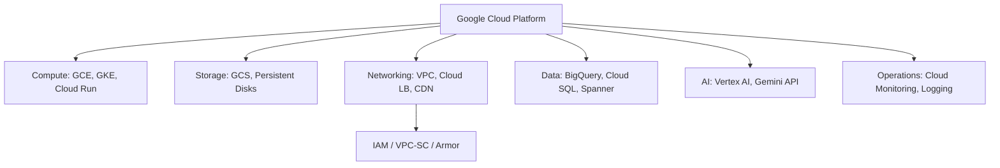

# Google Cloud (GCP) — A 2-Day Crash Course

> **In one sentence:** GCP is Google's cloud — the same kinds of building blocks as AWS
> (compute, storage, networking, databases) but organized around **Projects** and driven by the
> `gcloud` CLI, with a few genuinely best-in-class services (BigQuery, GKE).

> If you know AWS, you already know 80% of this — the concepts map almost 1:1. This cheatsheet
> leads with the differences and the AWS→GCP translation.

---

## Part 0 — How GCP is organized (the one big difference from AWS)

The single most important GCP-specific idea is the **resource hierarchy**:
```
Organization              (your company)
└── Folders               (departments / environments — optional)
    └── Project           (the fundamental unit — billing, APIs, IAM all attach HERE)
        └── Resources     (VMs, buckets, databases...)
```
**Everything lives in a Project.** A project is a billing boundary, an API-enablement boundary,
and an IAM boundary. In AWS you mostly work within one account and use regions/tags to separate
things; in GCP you create *separate projects* for separate apps/environments
(`myapp-dev`, `myapp-prod`). Get comfortable switching projects — it's constant.

Two more GCP quirks worth knowing on day one:
- **APIs must be enabled per project** before you can use a service (`gcloud services enable
  compute.googleapis.com`). First-time "API not enabled" errors are normal — just enable it.
- **Regions and zones:** like AWS regions/AZs. A *region* is geographic (`asia-south1`);
  a *zone* is an isolated location within it (`asia-south1-a`).

**Mental model:** same warehouse of rentable parts as AWS, but neatly boxed into Projects, and
you must flip the "on" switch (enable the API) for each kind of part before using it.

---




## Part 1 — The AWS → GCP service translation (your real cheat sheet)

| Need | AWS | GCP |
|------|-----|-----|
| Virtual machines | EC2 | **Compute Engine (GCE)** |
| Object storage | S3 | **Cloud Storage (GCS)** |
| Managed Kubernetes | EKS | **GKE** (the original; arguably the best) |
| Serverless functions | Lambda | **Cloud Functions** |
| Serverless containers | Fargate/App Runner | **Cloud Run** (excellent) |
| Managed SQL | RDS | **Cloud SQL** |
| NoSQL | DynamoDB | **Firestore / Bigtable** |
| Data warehouse | Redshift | **BigQuery** (flagship — serverless, huge scale) |
| Networking | VPC | **VPC** (but **global**, not regional) |
| DNS | Route 53 | **Cloud DNS** |
| Identity/permissions | IAM | **IAM** (role-based, attaches to the project) |
| Secrets | Secrets Manager | **Secret Manager** |
| Container registry | ECR | **Artifact Registry** |
| Logs/metrics | CloudWatch | **Cloud Logging / Cloud Monitoring** (Operations Suite) |

Notable GCP strengths: **BigQuery** (analytics), **GKE** (Kubernetes), and **Cloud Run**
(deploy a container and get a scalable HTTPS endpoint in one command).

---

## DAY 1 — Get it working

### 1. Install the CLI, authenticate, set context
```bash
gcloud version
gcloud auth login                         # browser-based login (human)
gcloud config set project myapp-dev       # set the active PROJECT (do this constantly)
gcloud config set compute/region asia-south1
gcloud config set compute/zone asia-south1-a
gcloud config list                        # see active project/region/account
gcloud auth application-default login      # creds for local SDKs/Terraform
```
The active **project** is the GCP equivalent of "which AWS account/region am I in?" — check it
before every action.

### 2. Enable an API, then use it
```bash
gcloud services list --enabled
gcloud services enable compute.googleapis.com run.googleapis.com
```

### 3. The `gcloud` command shape
```bash
gcloud <group> <subgroup> <action> [args] [--format=...] [--filter=...]
gcloud compute instances list
gcloud storage buckets list
gcloud projects list
```
Use `--format` and `--filter` like AWS's `--query`:
```bash
gcloud compute instances list --format="table(name,zone,status,networkInterfaces[0].networkIP)"
gcloud compute instances list --filter="status=RUNNING"
```

### 4. Cloud Storage (the S3 equivalent)
```bash
gcloud storage buckets create gs://my-unique-bucket --location=asia-south1
gcloud storage cp file.txt gs://my-unique-bucket/
gcloud storage ls gs://my-unique-bucket/ --recursive
gcloud storage rsync ./site gs://my-unique-bucket/   # sync changed files
```
Buckets use the `gs://` scheme. (The older `gsutil` tool still works; `gcloud storage` is the
modern replacement.)

### 5. Compute Engine (the EC2 equivalent)
```bash
gcloud compute instances create web1 \
  --machine-type=e2-small --image-family=debian-12 --image-project=debian-cloud
gcloud compute instances list
gcloud compute ssh web1                   # SSH in — gcloud manages keys for you
gcloud compute instances stop web1
gcloud compute instances delete web1
```
`gcloud compute ssh` handles key provisioning automatically — no manual key management.

### 6. Cloud Run — deploy a container in one command (GCP's killer convenience)
```bash
gcloud run deploy myapp \
  --image=asia-south1-docker.pkg.dev/myapp-dev/repo/myapp:1.0 \
  --region=asia-south1 --allow-unauthenticated
```
That builds out a fully managed, autoscaling (to zero), HTTPS-served container endpoint. For
stateless web services this is dramatically simpler than the AWS equivalent.

**By end of Day 1 you can:** authenticate, set the active project, enable APIs, use Cloud
Storage and Compute Engine, and deploy a container to Cloud Run. That's a real foothold.

---

## DAY 2 — Make it real

### 1. IAM — roles bound to a project
GCP IAM grants **roles** to **members** (users, groups, service accounts) on a resource
(usually the project):
```bash
gcloud projects add-iam-policy-binding myapp-dev \
  --member="serviceAccount:app@myapp-dev.iam.gserviceaccount.com" \
  --role="roles/storage.objectViewer"
gcloud projects get-iam-policy myapp-dev
```
Roles come in three flavors: **basic** (Owner/Editor/Viewer — too broad, avoid in prod),
**predefined** (`roles/storage.objectViewer` — use these), and **custom**. Principle of least
privilege, same as AWS.

### 2. Service Accounts (the secure identity for workloads)
A **service account** is a non-human identity your VMs/Cloud Run/GKE workloads run as — the
GCP equivalent of an AWS role. Attach one to a resource and it gets credentials automatically;
you never handle static keys:
```bash
gcloud iam service-accounts create app-sa --display-name="App SA"
gcloud run deploy myapp --service-account=app-sa@myapp-dev.iam.gserviceaccount.com ...
```
Avoid downloading service-account *key files* — use attached identities (Workload Identity on
GKE) instead. (Downloaded JSON keys are the GCP version of leaked AWS keys.)

### 3. GKE — managed Kubernetes
```bash
gcloud container clusters create-auto mycluster --region=asia-south1   # Autopilot (managed nodes)
gcloud container clusters get-credentials mycluster --region=asia-south1   # wire up kubectl
kubectl get nodes                                                          # your K8s skills apply
```
**Autopilot** mode manages nodes for you (you pay per pod). Then it's all standard Kubernetes —
see `Kubernetes.md`.

### 4. Cloud SQL (managed databases)
```bash
gcloud sql instances create mydb --database-version=POSTGRES_16 \
  --tier=db-g1-small --region=asia-south1
gcloud sql instances describe mydb
```
Connect securely via the **Cloud SQL Auth Proxy** (no public IP needed) rather than exposing
the database.

### 5. Networking (VPC is global)
A GCP **VPC is global** — its subnets are regional but live under one network, so resources in
different regions can talk privately without peering. **Firewall rules** (≈ AWS security
groups) gate traffic. **Cloud Load Balancing** is also global (one anycast IP, worldwide).
```bash
gcloud compute networks create myvpc --subnet-mode=custom
gcloud compute firewall-rules create allow-https --network=myvpc \
  --allow=tcp:443 --source-ranges=0.0.0.0/0
```

### 6. Observability, secrets, cost
```bash
gcloud logging read "resource.type=cloud_run_revision severity>=ERROR" --limit=50
gcloud secrets create db-pass --replication-policy=automatic
echo -n "s3cr3t" | gcloud secrets versions add db-pass --data-file=-
gcloud secrets versions access latest --secret=db-pass
gcloud billing accounts list
```
Cloud Logging/Monitoring is the CloudWatch equivalent; Secret Manager holds secrets. Set
**budgets and alerts** early.

### 7. Codify it
Define GCP infrastructure with **Terraform** (the `google` provider) — see `Terraform.md`.
The console/CLI are for inspection and quick tasks; production infra is code.

---

## Worked example — container service with managed data
```text
1. Create project myapp-prod; enable run, sqladmin, secretmanager, artifactregistry APIs.
2. Push image to Artifact Registry (asia-south1-docker.pkg.dev/myapp-prod/repo/app:1.0).
3. Cloud SQL Postgres instance (private IP); store its password in Secret Manager.
4. Create service account app-sa with roles/cloudsql.client + secret accessor (least privilege).
5. gcloud run deploy app --service-account=app-sa ... --no-allow-unauthenticated
6. Cloud Run autoscales the container; Cloud Logging captures logs; a budget alert watches cost.
7. All defined in Terraform; gcloud only for inspection.
```

---


## Terminal Demo

```terminal-demo
# gcloud@production ~ %

$ gcloud config get-value project
prod-project-123456

$ gcloud compute instances list --filter="labels.env=production" --format="table(name,zone,machineType.basename(),status,networkInterfaces[0].networkIP)"
NAME          ZONE             MACHINE_TYPE   STATUS   INTERNAL_IP
prod-web-01   asia-south1-a    e2-standard-4  RUNNING  10.0.1.42
prod-web-02   asia-south1-b    e2-standard-4  RUNNING  10.0.2.18
prod-api-01   asia-south1-a    e2-standard-8  RUNNING  10.0.1.55

$ gcloud container clusters describe prod-cluster --zone asia-south1-a --format="value(currentNodeCount,currentMasterVersion)"
6	1.29.3-gke.1093000

$ gcloud sql instances list
NAME       DATABASE_VERSION  LOCATION       TIER              STATUS
prod-db    POSTGRES_15       asia-south1-a  db-custom-4-15360 RUNNING
prod-db-r  POSTGRES_15       asia-south1-b  db-custom-4-15360 RUNNING

$ gcloud run services list --platform managed --format="table(name,region,status)"
NAME      REGION         STATUS
api       asia-south1    Ready
webhook   asia-south1    Ready

$ bq query --use_legacy_sql=false 'SELECT COUNT(*) as total_events FROM analytics.events WHERE DATE(timestamp) = CURRENT_DATE()'
+---------------+
| total_events  |
+---------------+
|     2345678   |
+---------------+

$ gcloud logging read 'resource.type="gke_cluster" severity>=WARNING' --limit=3 --format=json | jq '.[].textPayload'
"Node pool scale-up: 4 -> 6 nodes"
"Pod evicted due to node pressure: monitoring/prometheus-0"
```

---

## Common pitfalls
- **Forgetting which project is active.** `gcloud` acts on the configured project — the GCP
  version of the wrong-account/region accident. `gcloud config list` before acting.
- **"API not enabled" surprise.** Enable each service's API per project before first use.
- **Downloading service-account key files.** They leak like AWS keys. Use attached service
  accounts / Workload Identity instead.
- **Basic roles (Owner/Editor) in production.** Too broad. Use predefined/custom roles, least
  privilege.
- **Public Cloud Storage buckets.** Default to private; `--allow-unauthenticated` on Cloud Run
  and public buckets are deliberate, audited choices, not defaults.
- **Confusing region vs zone.** Some resources are zonal (a single VM), some regional, some
  global (VPC, load balancers). Mismatches cause "not found."

---

## Quick command reference
```bash
# Auth / context
gcloud auth login                  gcloud auth application-default login
gcloud config set project P        gcloud config set compute/region R
gcloud config list                 gcloud projects list

# APIs
gcloud services list --enabled     gcloud services enable <api>.googleapis.com

# Storage
gcloud storage buckets create gs://b --location=R
gcloud storage cp|ls|rsync|rm ...

# Compute
gcloud compute instances create|list|ssh|stop|delete
gcloud compute instances list --format="table(name,zone,status)"

# Cloud Run / containers
gcloud run deploy NAME --image=IMG --region=R
gcloud container clusters create-auto C --region=R
gcloud container clusters get-credentials C --region=R

# Cloud SQL
gcloud sql instances create|describe|list

# IAM / service accounts
gcloud projects add-iam-policy-binding P --member=... --role=roles/...
gcloud iam service-accounts create NAME

# Logs / secrets / billing
gcloud logging read 'QUERY' --limit=N
gcloud secrets create|versions add|versions access
gcloud billing accounts list
```

---

## Top 10 Interview Questions

<details>
<summary><strong>Q: How does GCP's resource hierarchy differ from AWS, and why does it matter?</strong></summary>

GCP organizes everything under Organization → Folders → Projects, where a Project is the fundamental billing, IAM, and API boundary. Unlike AWS accounts, you routinely create many Projects to separate apps and environments. This gives you clean blast-radius isolation and per-project billing without the overhead of managing separate accounts and cross-account roles.

</details>

<details>
<summary><strong>Q: When would you choose Cloud Run over GKE?</strong></summary>

Cloud Run is the right choice for stateless HTTP services where you want zero infrastructure management — it scales to zero, handles TLS and load balancing automatically, and deploys in one command. GKE is for workloads that need persistent volumes, custom networking (service meshes), long-running background processes, or fine-grained control over scheduling and resource allocation across many services.

</details>

<details>
<summary><strong>Q: What is Workload Identity and why should you use it instead of service account key files?</strong></summary>

Workload Identity maps a Kubernetes service account to a GCP service account, letting GKE pods authenticate to GCP APIs without downloading JSON key files. Key files are static credentials that can leak through git, CI logs, or container images. Workload Identity provides short-lived, automatically rotated tokens — the same security posture as AWS IAM roles for EC2.

</details>

<details>
<summary><strong>Q: How is a GCP VPC different from an AWS VPC?</strong></summary>

A GCP VPC is global — it spans all regions, with subnets being regional. This means resources in different regions can communicate privately without peering. Firewall rules are also VPC-wide by default (tag-based), not per-subnet like AWS security groups. Cloud Load Balancing is global too, providing a single anycast IP for worldwide traffic distribution.

</details>

<details>
<summary><strong>Q: How would you handle secrets in a GCP production environment?</strong></summary>

Store secrets in Secret Manager with automatic replication, access them at runtime via the SDK using a service account that has only the `secretmanager.secretAccessor` role. Never bake secrets into container images or environment variables in Cloud Run YAML. For GKE, mount secrets via the Secret Manager CSI driver or use Workload Identity to access them in application code.

</details>

<details>
<summary><strong>Q: What is BigQuery's architecture and when does it shine?</strong></summary>

BigQuery is a serverless, columnar data warehouse that separates storage from compute. You pay for storage at rest and for bytes scanned per query. It handles petabyte-scale analytics without you managing clusters, indexes, or partitions. It shines for ad-hoc analytics, large-scale ETL, and scenarios where you want to query terabytes without provisioning infrastructure — but it is not a replacement for transactional databases.

</details>

<details>
<summary><strong>Q: How do you enforce least-privilege IAM in a multi-project GCP environment?</strong></summary>

Use predefined roles rather than basic roles (Owner/Editor/Viewer). Grant roles at the narrowest scope — a specific resource or project, not the folder or organization. Use Organization Policy constraints to enforce guardrails (e.g., restrict which APIs can be enabled). Run the IAM Recommender periodically to identify over-granted permissions and tighten them based on actual usage.

</details>

<details>
<summary><strong>Q: How would you design a CI/CD pipeline deploying to Cloud Run?</strong></summary>

Push code to a Git repo, trigger Cloud Build on commit, build and push the container image to Artifact Registry, then deploy to Cloud Run with `gcloud run deploy`. Use separate projects for staging and production. Authenticate Cloud Build to production via cross-project service account impersonation — no static keys. Gate production deploys behind a manual approval step or a canary traffic split in Cloud Run.

</details>

<details>
<summary><strong>Q: What GCP services would you use to build an observability stack?</strong></summary>

Cloud Logging for log aggregation and search, Cloud Monitoring for metrics and alerting (with custom dashboards), and Cloud Trace for distributed tracing. For a more open approach, deploy OpenTelemetry collectors on GKE that ship to Cloud Monitoring or to a self-managed Prometheus/Grafana stack. Use Error Reporting to surface application exceptions automatically from logs.

</details>

<details>
<summary><strong>Q: How do you control costs in GCP and what are the common cost traps?</strong></summary>

Set budget alerts per project immediately. Use Committed Use Discounts (CUDs) for steady-state GKE and Compute Engine workloads. The common traps are: idle GKE nodes running 24/7 in non-prod, oversized Cloud SQL instances with Multi-AZ enabled in dev, egress charges from cross-region traffic, and BigQuery queries scanning full tables instead of using partitioning and clustering. Export billing data to BigQuery for granular cost analysis by label.

</details>

---


## Quick Quiz

Test your understanding with these rapid-fire questions (answers hidden):

<details>
<summary>1. What is the ONE core problem that GCP solves?</summary>
Re-read Part 0 — the mental model section. If you can explain the "why" in one sentence, you understand the foundation.
</details>

<details>
<summary>2. Name the 3 most important terms from the vocabulary section.</summary>
Review Part 1. These are the building blocks every conversation about GCP uses.
</details>

<details>
<summary>3. What is the first thing you would set up on Day 1?</summary>
Check the Day 1 section — the very first hands-on step that gets you a working result.
</details>

<details>
<summary>4. What is the most common production pitfall with GCP?</summary>
Review the Common Pitfalls section. The first item listed is typically the most frequently encountered.
</details>

<details>
<summary>5. How does GCP compare to its closest alternative?</summary>
Check the Comparison Matrix below — focus on the key differentiating row.
</details>


## Comparison Matrix

| Dimension | GCP | AWS | Azure |
|-----------|-----|-----|-------|
| **Primary use case** | Core strength of GCP | Core strength of AWS | Core strength of Azure |
| **Learning curve** | Moderate | Varies | Varies |
| **Community/ecosystem** | Active | Active | Growing |
| **Operational complexity** | Medium | Varies | Varies |
| **Best for** | See Part 0 | Different tradeoffs | Different tradeoffs |

> **How to read this matrix:** no tool wins on every dimension. Pick based on your specific constraints — team expertise, existing infrastructure, scale requirements, and compliance needs. The right choice is the one that fits your context, not the one with the most checkmarks.

## Next steps after Day 2
- **BigQuery** — if you touch analytics/data, this is GCP's standout; learn `bq query`.
- **Cloud Build** for CI/CD; **Workload Identity** for keyless auth between GCP and GKE/GitHub.
- **Anthos / GKE** deeper for multi-cluster, and **Cloud Armor** for WAF.
- Map this back to AWS/Azure — the primitives are the same; only names and a few defaults differ.

## Recommended learning resources

**YouTube channels & playlists:**
- [Google Cloud Tech — Getting Started Series](https://www.youtube.com/@googlecloudtech) — official tutorials covering every GCP service with clear diagrams
- [Google Cloud Next Conferences](https://www.youtube.com/@googlecloudtech/playlists) — deep technical talks from Google engineers on production patterns
- [Adrian Cantrill — GCP Networking and Architecture](https://www.youtube.com/@adriancantrill) — thorough visual explanations of GCP's global networking model
- [Fireship — GCP in 100 Seconds](https://www.youtube.com/@Fireship) — quick orientation videos to build mental models before diving deep
- [A Cloud Guru — Google Cloud Fundamentals](https://www.youtube.com/@ACloudGuru) — structured learning paths for GCP certification and practical use

**Official docs & blogs:**
- [Google Cloud Documentation](https://cloud.google.com/docs) — well-structured reference with architecture guides and quickstarts per service
- [Google Cloud Blog](https://cloud.google.com/blog/) — engineering deep dives, case studies, and new feature announcements

**The mantra:** everything lives in a Project, enable the API before you use the service, run
workloads as service accounts (not key files), and remember VPC and load balancing are global.
Check your active project before every command.
