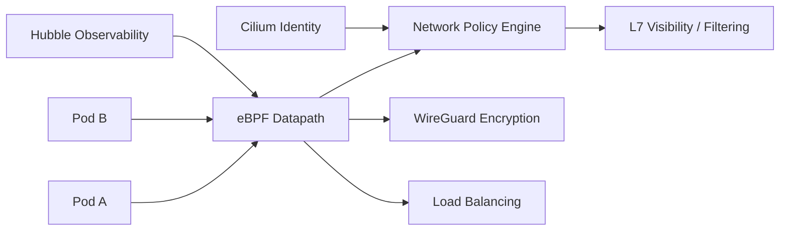

# Cilium — A 2-Day Crash Course

> Cilium is an eBPF-based networking, security, and observability platform for Kubernetes that replaces iptables with kernel-level programmability.

**Prerequisite:** [`Kubernetes.md`](./Kubernetes.md)




---

## Part 0 — Why Cilium Exists

### The iptables Problem

Every time a pod starts or a service changes in Kubernetes, the control plane rewrites iptables rules on every node. At small scale — a few dozen services — this is invisible. At a few hundred services, you start noticing. At thousands, iptables becomes a bottleneck you cannot engineer around.

The core issue is structural: iptables is a sequential list of rules evaluated top-to-bottom. Each packet traverses the full chain. Adding a rule means rewriting the entire table — a non-incremental, locking operation. In a dynamic cluster where pods come and go continuously, you are constantly paying that cost on every node simultaneously.

There are secondary problems too. iptables has no concept of service identity. It works with IP addresses and ports, so any policy that references a workload is invalidated the moment that workload's IP changes. In Kubernetes, IPs change constantly.

Conntrack — the connection tracking table that iptables depends on — has a fixed maximum size. Large clusters with high connection churn exhaust it. When conntrack is full, new connections are silently dropped. This failure mode is notoriously difficult to diagnose.

### What eBPF Changes

eBPF (Extended Berkeley Packet Filter) lets you run verified programs directly in the Linux kernel without writing a kernel module. The key word is "verified": the kernel runs an in-kernel verifier before executing any eBPF program, ensuring it cannot crash the system, loop forever, or access memory it should not.

You attach eBPF programs to hooks in the kernel — network interfaces, system calls, tracepoints, kprobes. For networking, the relevant hooks are XDP (eXpress Data Path, runs before the kernel networking stack) and TC (Traffic Control, runs at the network interface layer). Cilium attaches programs at these points to replace what iptables does — and more.

The difference in practice:

- **Lookup is O(1), not O(n).** Cilium uses eBPF hash maps keyed by identity, not IP. Adding a thousand services does not slow down per-packet processing.
- **Updates are atomic.** eBPF map updates are atomic operations. There is no "rewrite the entire table" step.
- **Identity survives IP changes.** Cilium assigns a numeric identity to each workload based on its labels. Policy is written against identities, so when a pod restarts with a new IP, the policy still applies without update.
- **L7 visibility is native.** eBPF can parse HTTP, gRPC, Kafka, and other protocols at the kernel level without a sidecar proxy.

Cilium is the production implementation of this approach for Kubernetes. It ships as a CNI plugin, a policy engine, and an observability layer — all backed by eBPF.

---

## Vocabulary

Before Day 1, make sure these terms are clear.

**eBPF** — Extended Berkeley Packet Filter. A Linux kernel subsystem that lets you run sandboxed programs in kernel space. For Cilium, the execution engine behind everything.

**CNI** — Container Network Interface. The Kubernetes extension point for networking. When a pod starts, Kubernetes calls the CNI plugin to set up the pod's network. Cilium implements CNI, replacing whatever was there before (Flannel, Calico, etc.).

**CiliumNetworkPolicy** — A Kubernetes custom resource (CRD) that extends the standard `NetworkPolicy` to support L7 rules (HTTP paths, gRPC methods, Kafka topics) and identity-based selectors. Standard `NetworkPolicy` resources also work — Cilium is fully compatible.

**Hubble** — Cilium's built-in observability layer. It reads network flow data from the eBPF maps and exposes it as a real-time event stream, a CLI, and a UI. Hubble is to Cilium what Prometheus is to metrics — a purpose-built observability tool that understands the domain.

**Service Mesh (sidecar-free)** — Traditional service meshes (Istio, Linkerd) inject a sidecar proxy into every pod. Cilium provides mutual TLS, load balancing, and traffic management without sidecars, by implementing these features at the eBPF layer. This trades some flexibility for significantly lower overhead.

**ClusterMesh** — Cilium's multi-cluster networking feature. It connects two or more Cilium-managed clusters so that pods in one cluster can reach services in another with the same identity-based policy model, without a gateway appliance.

**Identity** — A numeric label set assigned to a group of pods sharing the same Kubernetes labels. Policy rules reference identities, not IPs. Identities are local to a cluster (ClusterMesh extends this across clusters).

**Endpoint** — Cilium's representation of a single network-connected entity, typically a pod. Each endpoint has an identity, an eBPF program attached to its network interface, and its own policy map.

---

## DAY 1 — Install, Observe, Enforce

### Installing Cilium as Your CNI

The standard install path is Helm. You need a cluster without an existing CNI, or you perform a live migration (covered later).

```bash
helm repo add cilium https://helm.cilium.io/
helm repo update

helm install cilium cilium/cilium \
  --version 1.15.5 \
  --namespace kube-system \
  --set ipam.mode=kubernetes \
  --set kubeProxyReplacement=true \
  --set k8sServiceHost=<API_SERVER_IP> \
  --set k8sServicePort=6443
```

`kubeProxyReplacement=true` tells Cilium to take over kube-proxy's job entirely. This is the mode where you get the full eBPF benefit — service routing, load balancing, and NodePort handling all move out of iptables.

After install, verify with the Cilium CLI:

```bash
cilium status --wait
cilium connectivity test
```

`cilium connectivity test` deploys test pods and runs a full connectivity matrix. It takes a few minutes but tells you definitively whether Cilium is working correctly.

### Enabling Hubble

Hubble is disabled by default to keep the install minimal. Enable it:

```bash
helm upgrade cilium cilium/cilium \
  --namespace kube-system \
  --reuse-values \
  --set hubble.relay.enabled=true \
  --set hubble.ui.enabled=true
```

Expose the UI for local access:

```bash
cilium hubble ui
```

This port-forwards the Hubble UI to `http://localhost:12000`. You will see a real-time service map showing which services are talking to each other, flow volumes, and drop events.

From the CLI:

```bash
hubble observe --namespace default --follow
hubble observe --verdict DROPPED --follow
```

The second command is your first debugging tool: it shows every dropped packet in real time, including the policy rule that dropped it and the identity of both endpoints.

### Writing Your First Network Policy

By default, Cilium allows all traffic. Network policies are additive denials — once you apply any `NetworkPolicy` to a pod, all traffic not explicitly allowed is denied.

Start with a simple L3/L4 policy. This allows the `frontend` deployment to receive traffic from `backend` on port 8080:

```yaml
apiVersion: "cilium.io/v2"
kind: CiliumNetworkPolicy
metadata:
  name: allow-backend-to-frontend
  namespace: default
spec:
  endpointSelector:
    matchLabels:
      app: frontend
  ingress:
  - fromEndpoints:
    - matchLabels:
        app: backend
    toPorts:
    - ports:
      - port: "8080"
        protocol: TCP
```

Apply it and verify in Hubble:

```bash
kubectl apply -f allow-backend-to-frontend.yaml
hubble observe --namespace default --verdict DROPPED --follow
```

Try sending traffic from a pod that is not `backend` to `frontend:8080`. You will see the drop appear in real time in Hubble.

### L7 Policy — HTTP Path Enforcement

This is where Cilium goes beyond what standard `NetworkPolicy` can do. You can enforce at the HTTP method and path level:

```yaml
apiVersion: "cilium.io/v2"
kind: CiliumNetworkPolicy
metadata:
  name: allow-backend-get-only
  namespace: default
spec:
  endpointSelector:
    matchLabels:
      app: frontend
  ingress:
  - fromEndpoints:
    - matchLabels:
        app: backend
    toPorts:
    - ports:
      - port: "8080"
        protocol: TCP
      rules:
        http:
        - method: "GET"
          path: "/api/.*"
```

Now `backend` can only make GET requests to paths matching `/api/.*` on `frontend`. A POST to `/admin` from `backend` is dropped — and Hubble shows you the exact HTTP request that was denied, including method and path.

### The Service Map

With Hubble UI open, navigate to the namespace you are working in. Every service appears as a node. Edges show active connections. The color of an edge indicates health — green for allowed, red for dropped.

This is your operational view. When a team member says "our service can't reach the database," you open Hubble, filter to that namespace, and you can see in real time whether the traffic is reaching the database at all, being dropped by policy, or failing at a lower layer.

---

## DAY 2 — Advanced Features

### Hubble Observability in Depth

Hubble exposes a gRPC API that Prometheus can scrape. Enable the metrics endpoint:

```bash
helm upgrade cilium cilium/cilium \
  --namespace kube-system \
  --reuse-values \
  --set hubble.metrics.enabled="{dns,drop,tcp,flow,icmp,http}"
```

This gives you pre-built metrics for DNS resolution times, TCP connection rates, HTTP error rates, and drop counts — all broken down by source and destination identity. Import the Cilium Grafana dashboards (available in the Cilium GitHub repository) and you have a complete L3-L7 observability stack without writing a single PromQL query from scratch.

For deeper DNS debugging:

```bash
hubble observe --type l7 --protocol dns --follow
```

Every DNS query and response flows through Hubble. You can see which pods are making queries, to which resolvers, and whether they are succeeding. DNS-based policy enforcement is also available — you can write rules that allow a pod to reach `*.amazonaws.com` and deny everything else at the DNS level.

### ClusterMesh — Multi-Cluster Networking

ClusterMesh connects clusters by sharing their Cilium KV stores (backed by etcd). Each cluster retains its own control plane; ClusterMesh adds cross-cluster service discovery and identity federation.

Prerequisites:
- Each cluster needs a unique name and a non-overlapping pod CIDR.
- The Cilium KV store in each cluster must be reachable from the other clusters (requires load balancer or NodePort exposure).

Enable ClusterMesh:

```bash
cilium clustermesh enable --service-type LoadBalancer
```

Connect two clusters:

```bash
cilium clustermesh connect \
  --destination-context <kubeconfig-context-for-cluster-b>
```

Once connected, annotate a service in Cluster A to make it globally discoverable:

```yaml
metadata:
  annotations:
    service.cilium.io/global: "true"
```

Pods in Cluster B can now resolve and reach that service. Policy still applies — an endpoint in Cluster B needs an explicit allow rule referencing the remote identity.

Use cases: active-active disaster recovery, splitting dev/staging workloads across clusters while sharing a database cluster, geographic distribution.

### Sidecar-Free Service Mesh

Cilium's service mesh operates at the eBPF layer. For mutual TLS between services, Cilium injects per-node Envoy instances (not per-pod sidecars) or uses kernel TLS (kTLS) directly.

Enable:

```bash
helm upgrade cilium cilium/cilium \
  --namespace kube-system \
  --reuse-values \
  --set ingressController.enabled=true \
  --set envoy.enabled=true
```

The trade-off compared to a full sidecar mesh:

| Capability | Cilium (sidecar-free) | Istio (sidecar) |
|---|---|---|
| mTLS | Yes | Yes |
| Traffic shifting | Yes (weight-based) | Yes (fine-grained) |
| Circuit breaking | Limited | Full |
| CPU overhead per pod | Near zero | ~50-100m CPU |
| Memory overhead per pod | Near zero | ~50-100Mi |
| L7 policy enforcement | Yes | Yes |
| Tracing (Jaeger/Zipkin) | Via Hubble | Native |

If you do not need per-request circuit breaking or fine-grained retry policies, Cilium's service mesh delivers mTLS and traffic management at a fraction of the resource cost.

### Bandwidth Manager

Cilium can enforce per-pod bandwidth limits using eBPF-based traffic shaping, replacing the `bandwidth` CNI plugin or external traffic shapers:

```bash
helm upgrade cilium cilium/cilium \
  --namespace kube-system \
  --reuse-values \
  --set bandwidthManager.enabled=true
```

Annotate pods to set limits:

```yaml
metadata:
  annotations:
    kubernetes.io/ingress-bandwidth: "100M"
    kubernetes.io/egress-bandwidth: "100M"
```

This enforces bandwidth at the eBPF layer, before packets enter the kernel network stack. It is significantly more efficient than tc-based approaches and does not require privileged init containers.

### Host Firewall

Cilium can protect the node itself, not just pod-to-pod traffic. The host firewall lets you write `CiliumClusterwideNetworkPolicy` rules that govern traffic to and from the node's host network namespace:

```yaml
apiVersion: "cilium.io/v2"
kind: CiliumClusterwideNetworkPolicy
metadata:
  name: restrict-node-access
spec:
  nodeSelector:
    matchLabels:
      kubernetes.io/os: linux
  ingress:
  - fromCIDR:
    - "10.0.0.0/8"
    toPorts:
    - ports:
      - port: "22"
        protocol: TCP
```

This replaces host-level iptables rules or security group policies for controlling SSH and API server access.

### BGP Integration

For bare-metal clusters or environments where you control the network fabric, Cilium supports BGP via the `CiliumBGPPeeringPolicy` CRD. This lets Cilium advertise pod CIDRs and service IPs directly to your routers:

```yaml
apiVersion: "cilium.io/v2alpha1"
kind: CiliumBGPPeeringPolicy
metadata:
  name: bgp-peering
spec:
  nodeSelector:
    matchLabels:
      kubernetes.io/os: linux
  virtualRouters:
  - localASN: 65001
    exportPodCIDR: true
    neighbors:
    - peerAddress: "192.168.1.1/32"
      peerASN: 65000
```

This eliminates the need for MetalLB or a separate BGP speaker in many bare-metal setups.

### Cilium vs Calico vs Flannel

You will encounter these three when evaluating CNI options. Here is a direct comparison:

| Feature | Cilium | Calico | Flannel |
|---|---|---|---|
| Data plane | eBPF | iptables / eBPF (partial) | VXLAN overlay |
| L7 policy | Yes | No | No |
| Observability | Hubble (built-in) | External only | None |
| kube-proxy replacement | Yes | Partial (eBPF mode) | No |
| Multi-cluster | ClusterMesh | Calico Enterprise | No |
| Service mesh | Yes (sidecar-free) | No | No |
| BGP | Yes (native) | Yes (mature) | No |
| Operational complexity | Medium-high | Medium | Low |
| Minimum kernel version | 4.9 (5.10+ recommended) | 3.10+ | 3.10+ |

**Choose Flannel** when you want the simplest possible CNI with no policy requirements. It works everywhere and is trivial to operate.

**Choose Calico** when you need mature BGP support, are running older kernels, or have existing Calico operational knowledge. Calico's eBPF mode is improving but lags Cilium's depth.

**Choose Cilium** when you need L7 policy, built-in observability, multi-cluster networking, or are building a zero-trust security model. The operational complexity is higher, but the capability ceiling is also significantly higher.

---

## Worked Example — Zero-Trust Network Policies for Microservices

This example builds a zero-trust posture for a three-tier application: `frontend`, `api`, `database`.

**Goal:** Frontend can only call the API on port 8080 via GET/POST. The API can only call the database on port 5432. Nothing else is permitted. Egress from the database is denied entirely except for DNS.

**Step 1 — Default deny for the namespace.**

Standard Kubernetes `NetworkPolicy` handles this cleanly:

```yaml
apiVersion: networking.k8s.io/v1
kind: NetworkPolicy
metadata:
  name: default-deny-all
  namespace: production
spec:
  podSelector: {}
  policyTypes:
  - Ingress
  - Egress
```

This locks the namespace. Now you add back only what is needed.

**Step 2 — Allow DNS egress for all pods.**

```yaml
apiVersion: "cilium.io/v2"
kind: CiliumNetworkPolicy
metadata:
  name: allow-dns-egress
  namespace: production
spec:
  endpointSelector: {}
  egress:
  - toEndpoints:
    - matchLabels:
        "k8s:io.kubernetes.pod.namespace": kube-system
        k8s-app: kube-dns
    toPorts:
    - ports:
      - port: "53"
        protocol: ANY
      rules:
        dns:
        - matchPattern: "*"
```

**Step 3 — Frontend to API, L7.**

```yaml
apiVersion: "cilium.io/v2"
kind: CiliumNetworkPolicy
metadata:
  name: frontend-to-api
  namespace: production
spec:
  endpointSelector:
    matchLabels:
      app: api
  ingress:
  - fromEndpoints:
    - matchLabels:
        app: frontend
    toPorts:
    - ports:
      - port: "8080"
        protocol: TCP
      rules:
        http:
        - method: "GET"
        - method: "POST"
```

**Step 4 — API to database, L4 only.**

```yaml
apiVersion: "cilium.io/v2"
kind: CiliumNetworkPolicy
metadata:
  name: api-to-database
  namespace: production
spec:
  endpointSelector:
    matchLabels:
      app: database
  ingress:
  - fromEndpoints:
    - matchLabels:
        app: api
    toPorts:
    - ports:
      - port: "5432"
        protocol: TCP
```

**Verify with Hubble:**

```bash
hubble observe --namespace production --verdict DROPPED --follow
```

Attempt a direct connection from `frontend` to `database:5432`. It will be dropped. Hubble shows you the drop with source identity `app=frontend`, destination identity `app=database`, reason `policy-denied`. You have the evidence you need to confirm the policy is working as intended.

---

## Pitfalls

**Kernel version requirements.** Cilium's full feature set requires Linux 5.10 or later. kube-proxy replacement needs 5.2+. L7 policy enforcement needs 4.19+. If you are running older nodes (common on managed cloud services using older AMIs), check the Cilium compatibility matrix before deploying. Running Cilium on an unsupported kernel results in silent feature degradation, not a hard error.

**Migration from an existing CNI is not trivial.** Replacing Flannel or Calico with Cilium on a running cluster requires either a maintenance window or a node-by-node rolling migration. The Cilium migration guide documents the rolling approach, but it is complex. Budget time to test it in a non-production cluster first.

**L7 policy requires Envoy.** When you add `http` rules to a `CiliumNetworkPolicy`, Cilium transparently redirects that traffic through a per-node Envoy instance. This adds latency (typically 0.1-0.5ms) and creates a new operational dependency. Monitor Envoy resource usage after enabling L7 policies at scale.

**Identity cardinality.** Cilium's identity model works well when label sets are consistent. If you generate unique labels per pod (for example, including a pod UID or a timestamp in a label), you create a unique identity per pod, which exhausts identity space and degrades performance. Audit your label usage before deploying.

**Hubble data is ephemeral.** By default, Hubble stores flow data in a ring buffer — typically the last 30 seconds of flows per node. For forensics and compliance, you need to export flows to a persistent store. Hubble supports exporting to Kafka, AWS S3, and other sinks via `hubble-export`. Set this up before you need it, not after an incident.

**Host firewall and node upgrades.** If you enable the host firewall, be careful when upgrading nodes. A misconfigured host policy can lock you out of SSH access to the node. Always test host firewall rules in a non-production environment, and ensure your cloud provider's out-of-band console access is available before applying host policies.

⚠️ **Cilium requires privileged access.** The DaemonSet runs with `hostNetwork: true` and extensive Linux capabilities. This is unavoidable given eBPF's kernel-level operation. Ensure your pod security policies or admission controllers account for this, and audit what the Cilium DaemonSet actually does on your nodes before deploying in a security-sensitive environment.

---

## Quick Reference

```bash
# Install Cilium CLI
CILIUM_CLI_VERSION=$(curl -s https://raw.githubusercontent.com/cilium/cilium-cli/main/stable.txt)
curl -L --remote-name-all \
  https://github.com/cilium/cilium-cli/releases/download/${CILIUM_CLI_VERSION}/cilium-linux-amd64.tar.gz
tar xzvf cilium-linux-amd64.tar.gz
mv cilium /usr/local/bin

# Check cluster health
cilium status
cilium connectivity test

# Enable Hubble
cilium hubble enable

# Open Hubble UI (port-forwards to localhost:12000)
cilium hubble ui

# Install Hubble CLI
export HUBBLE_VERSION=$(curl -s https://raw.githubusercontent.com/cilium/hubble/master/stable.txt)
curl -L --remote-name-all \
  https://github.com/cilium/hubble/releases/download/$HUBBLE_VERSION/hubble-linux-amd64.tar.gz
tar xzvf hubble-linux-amd64.tar.gz
mv hubble /usr/local/bin

# Port-forward Hubble relay for CLI access
cilium hubble port-forward &

# Observe all flows in a namespace
hubble observe --namespace <ns> --follow

# Observe only dropped traffic
hubble observe --verdict DROPPED --follow

# Observe DNS queries
hubble observe --type l7 --protocol dns --follow

# List Cilium endpoints
kubectl get ciliumendpoints -A

# Inspect endpoint policy
kubectl exec -n kube-system ds/cilium -- cilium endpoint list
kubectl exec -n kube-system ds/cilium -- cilium endpoint get <endpoint-id>

# Check identity assignments
kubectl exec -n kube-system ds/cilium -- cilium identity list

# Validate applied policy
kubectl exec -n kube-system ds/cilium -- cilium policy get

# Enable ClusterMesh
cilium clustermesh enable --service-type LoadBalancer
cilium clustermesh status

# Inspect eBPF maps
kubectl exec -n kube-system ds/cilium -- cilium bpf lb list
kubectl exec -n kube-system ds/cilium -- cilium bpf policy get

# Monitor real-time drops on a node
kubectl exec -n kube-system ds/cilium -- cilium monitor --type drop
```

---

## Next Steps

- [`Kubernetes.md`](./Kubernetes.md) — Revisit `NetworkPolicy`, RBAC, and pod security with Cilium in mind
- [`Istio.md`](./Istio.md) — Compare Cilium's sidecar-free mesh against a full sidecar mesh for your workload's requirements
- [`Prometheus.md`](../observability/Prometheus.md) — Scrape Hubble metrics and build SLO dashboards on top of Cilium's L7 data
- [`Falco.md`](../security/Falco.md) — Pair Falco's syscall-level detection with Cilium's network-level enforcement for defense in depth

---

## Recommended learning resources

**YouTube channels & playlists:**
- [CNCF — KubeCon eBPF & Cilium Talks](https://www.youtube.com/@cncf) — conference sessions from Cilium maintainers on eBPF datapath, ClusterMesh, and network policy design
- [Rawkode Live — Cilium & eBPF](https://www.youtube.com/@rawkode) — hands-on CNCF ecosystem walkthroughs including Cilium installation, Hubble, and service mesh capabilities
- [Viktor Farcic (DevOps Toolkit)](https://www.youtube.com/@DevOpsToolkit) — Cilium vs Calico vs Flannel comparisons with production tradeoff analysis
- [That DevOps Guy (Marcel Dempers)](https://www.youtube.com/@introsession) — practical Kubernetes networking deep dives covering CNI selection and network policy enforcement
- [KodeKloud — Kubernetes Networking](https://www.youtube.com/@KodeKloud) — foundational networking concepts that make Cilium's eBPF approach easier to understand

**Official docs & blogs:**
- [Cilium Official Documentation](https://docs.cilium.io/) — the reference for installation, network policies, ClusterMesh, and Hubble observability
- [Isovalent Blog](https://isovalent.com/blog/) — deep technical posts from the team behind Cilium on eBPF, network security, and cloud native networking

---

## The Mantra

> The network is the security boundary. eBPF makes that boundary programmable, observable, and fast enough to actually enforce at scale. Cilium is what happens when you stop treating networking as a solved problem and start treating it as a first-class engineering concern.

## Top 10 Interview Questions

<details>
<summary><strong>Q: What is eBPF and why does Cilium use it instead of iptables?</strong></summary>

eBPF (extended Berkeley Packet Filter) runs sandboxed programs in the Linux kernel without modifying kernel source or loading kernel modules. Cilium uses it because iptables performance degrades linearly with rule count — in a cluster with thousands of pods, iptables chains become a bottleneck. eBPF provides O(1) lookup performance via hash maps, programmable packet processing, and deep kernel visibility without the overhead of userspace proxies.

</details>

<details>
<summary><strong>Q: How does Cilium handle network policy enforcement differently from Calico?</strong></summary>

Cilium enforces policies at the eBPF level in the kernel datapath — packets are filtered before they even reach the network stack. Calico traditionally uses iptables (or newer eBPF mode). Cilium's advantage: identity-based policies (pods are assigned cryptographic identities, not just IP-based rules), L7 filtering (HTTP method/path, gRPC, Kafka topic), and no performance degradation as policy count grows. Calico is simpler to set up; Cilium is more powerful for complex policy requirements.

</details>

<details>
<summary><strong>Q: What is Hubble and how does it provide network observability?</strong></summary>

Hubble is Cilium's observability layer — it captures network flows at the eBPF level and exposes them via a CLI, UI, and Prometheus metrics. It provides L3/L4 flow visibility (source/destination pod, port, protocol), L7 visibility (HTTP status codes, DNS queries, Kafka topics), network policy verdicts (which policy allowed/denied a flow), and service dependency maps. Unlike traditional packet capture, Hubble has minimal performance overhead because it hooks into the kernel datapath directly.

</details>

<details>
<summary><strong>Q: How does Cilium implement service mesh without sidecars?</strong></summary>

Cilium's service mesh uses eBPF to handle L7 traffic management (load balancing, retries, circuit breaking) directly in the kernel, eliminating the need for sidecar proxies like Envoy. This removes the memory overhead (each sidecar consumes 50-100MB), latency overhead (extra network hops through the proxy), and operational complexity (managing sidecar injection and lifecycle). For advanced L7 features that require full protocol parsing, Cilium can optionally deploy an Envoy proxy per node instead of per pod.

</details>

<details>
<summary><strong>Q: How does Cilium handle multi-cluster networking?</strong></summary>

Cilium ClusterMesh connects multiple Kubernetes clusters with shared service discovery and unified network policies. Pods in cluster A can reach services in cluster B using standard Kubernetes service names. ClusterMesh uses etcd for cross-cluster state synchronisation and supports global services (load-balanced across clusters), affinity routing (prefer local cluster), and cross-cluster network policies. This enables active-active multi-cluster deployments and disaster recovery topologies.

</details>

<details>
<summary><strong>Q: What is Cilium's identity-based security model?</strong></summary>

Instead of using IP addresses for policy rules (which change constantly in Kubernetes), Cilium assigns each endpoint a numeric identity based on its labels. Policies reference identities, not IPs. When a pod communicates, Cilium embeds its identity in the packet header and the receiving side validates it. This is more robust than IP-based policies — pod rescheduling, scaling, and IP reuse do not break security rules. Identities are allocated cluster-wide and shared via the Cilium control plane.

</details>

<details>
<summary><strong>Q: How do you troubleshoot connectivity issues in a Cilium-managed cluster?</strong></summary>

Use cilium status to check agent health, cilium endpoint list to verify endpoint identity assignment, cilium monitor for real-time packet tracing, and hubble observe for flow-level debugging. Common issues: policy denying expected traffic (check cilium policy get and look for default-deny), identity not assigned (pod labels not matching any policy), and BPF map full (increase map sizes). The cilium connectivity test command runs a comprehensive suite of connectivity checks between pods.

</details>

<details>
<summary><strong>Q: How does Cilium handle encryption in transit?</strong></summary>

Cilium supports transparent encryption using either WireGuard (default, simpler, kernel-based) or IPsec. WireGuard encryption is enabled cluster-wide with a single flag — all pod-to-pod traffic is encrypted without application changes. It uses the pod's Cilium identity for key management, so keys rotate automatically as pods come and go. Performance overhead is minimal (WireGuard is extremely fast in-kernel). For compliance requirements that mandate specific cipher suites, IPsec provides more configuration options.

</details>

<details>
<summary><strong>Q: What are the resource requirements and operational considerations for running Cilium?</strong></summary>

Cilium runs as a DaemonSet with one agent per node. Each agent consumes 200-500MB memory depending on cluster size and BPF map configurations. CPU usage scales with packet throughput. Key operational considerations: Cilium replaces kube-proxy (disable it), kernel version matters (5.4+ recommended for full features), BPF filesystem must be mounted, and upgrades require rolling restarts of the DaemonSet. Monitor agent health with Prometheus metrics and set alerts for agent restarts or BPF map pressure.

</details>

<details>
<summary><strong>Q: When would you choose Cilium over other CNI plugins like Calico or Flannel?</strong></summary>

Choose Cilium when you need: L7 network policies (HTTP/gRPC/Kafka-aware filtering), high-performance networking at scale (thousands of pods with complex policies), built-in observability (Hubble), sidecar-free service mesh, multi-cluster networking (ClusterMesh), or transparent encryption. Choose Calico for simpler setups with only L3/L4 policies or when you need BGP peering with existing network infrastructure. Choose Flannel for the simplest possible overlay networking without policy enforcement. Cilium has the steepest learning curve but the richest feature set.

</details>

---

