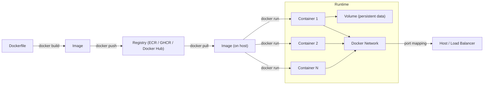

# Docker — A 2-Day Crash Course

> **In one sentence:** Docker packages an application *and everything it needs to run* into a
> single portable box (a "container") that behaves identically on your laptop, a colleague's
> machine, and production.

---

## Part 0 — Why Docker exists

"It works on my machine" is the oldest bug in software. Your app runs fine locally, then
breaks in production because the server has a different Python version, a missing library, or
a different OS. The root problem: the app and its environment are separate, and the
environment drifts.

Docker fixes this by **bundling the app with its entire environment** — the runtime,
libraries, system tools, config — into one immutable image. That image runs the same way
everywhere, because it *carries its world with it*.

**Container vs Virtual Machine (the key distinction):** A VM virtualizes an entire computer,
including a full guest OS — heavy, slow to boot, gigabytes in size. A container shares the
host's OS kernel and only packages the app + its dependencies — lightweight, boots in
milliseconds, megabytes in size. You can run dozens of containers where you'd run a couple of
VMs. Containers are *isolated processes*, not *virtual machines*.

**Mental model — three nouns you must separate in your head:**
- **Dockerfile** = the *recipe* (text instructions to build an image).
- **Image** = the *cake mix* (a built, immutable, shareable package — never runs by itself).
- **Container** = the *baked cake* (a running instance of an image; you can have many from one image).

Recipe → build → Image → run → Container. Keep these three straight and Docker stops being confusing.



---

## Part 1 — The vocabulary

| Term | Meaning |
|------|---------|
| **Image** | A read-only template: app + dependencies, built in layers |
| **Container** | A running (or stopped) instance of an image |
| **Dockerfile** | Instructions to build an image |
| **Registry** | Where images are stored/shared (Docker Hub, ECR, GHCR) |
| **Layer** | Each Dockerfile instruction creates a cached filesystem layer |
| **Volume** | Persistent storage that outlives a container |
| **Compose** | A tool to define and run multi-container apps from one YAML file |

---

## DAY 1 — Get it working

### 1. Install & verify
```bash
docker --version
docker run hello-world        # pulls a tiny image and runs it — proves install works
```

### 2. Run something real
```bash
docker run -d -p 8080:80 --name web nginx
```
Read that as: run (`-d` = detached/background) the `nginx` image, map host port 8080 to
container port 80 (`-p host:container`), and name it `web`. Open http://localhost:8080 — nginx
is serving, and you installed *nothing* on your machine. That's the magic.
```bash
docker ps                     # see it running
docker logs web               # its output
docker exec -it web bash      # open a shell INSIDE the running container
docker stop web && docker rm web   # stop and remove
```
`docker run` = create + start. `-it` = interactive terminal (for shells). `exec` runs a
command in an *already-running* container — your primary debugging tool.

### 3. Understand images and layers
```bash
docker pull python:3.12       # download an image from a registry
docker images                 # list local images
docker history python:3.12    # see the layers it's built from
```
Images are built in **layers**, one per Dockerfile instruction, and layers are **cached**.
This is why a tiny code change rebuilds fast (only the changed layer + everything after it
rebuilds) — and why instruction *order* in a Dockerfile matters enormously (covered Day 2).

### 4. Write your first Dockerfile
Make a folder with your app and a file named `Dockerfile`:
```dockerfile
FROM python:3.12-slim          # start from an official base image
WORKDIR /app                   # set the working directory inside the image
COPY requirements.txt .        # copy deps file first (cache optimization)
RUN pip install -r requirements.txt   # install dependencies (a layer)
COPY . .                       # copy the rest of the source
EXPOSE 8000                    # document the port (doesn't actually publish it)
CMD ["python", "app.py"]       # the default command when a container starts
```
Build and run it:
```bash
docker build -t myapp:1.0 .    # -t = tag/name; '.' = build context (current dir)
docker run -d -p 8000:8000 myapp:1.0
```
You just turned source code into a portable artifact. `docker build` reads the Dockerfile top
to bottom, executing each instruction into a cached layer.

### 5. Read the run lifecycle
```
docker run image
  -> Docker finds the image locally (or pulls it from a registry)
  -> creates a writable container layer on top of the read-only image
  -> runs the image's CMD/ENTRYPOINT as PID 1 inside the container
  -> container lives as long as that PID 1 process runs; when it exits, container stops
```
A container is "one main process." When that process ends, the container ends. (This trips up
beginners who expect a container to be a "little server you log into" — it's a *process*.)

**By end of Day 1 you can:** run containers, map ports, exec in to debug, read logs, and build
your own image from a Dockerfile. That's the daily 80%.

---

## DAY 2 — Make it real

### 1. Layer caching & instruction order (the #1 build skill)
Docker caches each layer and reuses it if nothing above changed. So order from
*least-frequently-changing* to *most-frequently-changing*:
```dockerfile
# GOOD: deps change rarely, so install them before copying volatile source
COPY requirements.txt .
RUN pip install -r requirements.txt   # cached unless requirements.txt changes
COPY . .                              # only this re-runs on a code change
```
If you `COPY . .` *before* installing deps, every code change busts the dependency cache and
reinstalls everything — slow builds. Putting dep-installation first is the single highest-impact
Dockerfile habit.

### 2. Multi-stage builds (small, secure images)
Build tools and compilers don't belong in your final image. Use one stage to build, another to
run:
```dockerfile
# stage 1: build
FROM golang:1.22 AS build
WORKDIR /src
COPY . .
RUN CGO_ENABLED=0 go build -o /app

# stage 2: runtime — tiny, no compiler, no shell
FROM gcr.io/distroless/static
COPY --from=build /app /app
ENTRYPOINT ["/app"]
```
The final image contains only the binary — often 10–20MB instead of 800MB, with a far smaller
attack surface. This is standard practice for compiled languages and even Node/Python.

### 3. Persisting data — volumes
Containers are ephemeral; their writable layer dies with them. For data that must survive
(databases, uploads), use **volumes**:
```bash
docker volume create pgdata
docker run -d -v pgdata:/var/lib/postgresql/data postgres:16   # named volume (managed by Docker)
docker run -d -v $(pwd):/app myapp:1.0                          # bind mount (host dir -> container)
```
Named volumes are for persistent app data; bind mounts are great in development (edit code on
the host, see it live in the container).

### 4. Networking between containers
```bash
docker network create appnet
docker run -d --name db --network appnet postgres:16
docker run -d --name api --network appnet myapi
```
Containers on the same user-defined network reach each other **by container name** as a
hostname (`db:5432`). This is how multi-service apps wire together. (Compose does this for you.)

### 5. Docker Compose — the real way to run multi-container apps
Typing long `docker run` commands doesn't scale. Define everything in `compose.yaml`:
```yaml
services:
  api:
    build: .
    ports: ["8000:8000"]
    environment:
      DB_HOST: db
    depends_on: [db]
    restart: unless-stopped
  db:
    image: postgres:16
    environment:
      POSTGRES_PASSWORD: secret
    volumes: ["pgdata:/var/lib/postgresql/data"]
volumes:
  pgdata:
```
```bash
docker compose up -d          # build + start everything
docker compose logs -f api    # tail one service
docker compose down           # stop + remove (add -v to also drop volumes)
```
Compose handles the network, naming, ordering, and lifecycle. For local dev and simple deploys,
this is your daily driver.

### 6. Push to a registry (share your image)
```bash
docker tag myapp:1.0 ghcr.io/org/myapp:1.0
docker login ghcr.io
docker push ghcr.io/org/myapp:1.0
```

---

## Worked example — containerize and run a Python API + Postgres
```text
1. Dockerfile (as in Day 1) builds the API image.
2. compose.yaml (as above) defines api + db, a shared network, and a volume for db data.
3. docker compose up -d           # both start; api reaches db via hostname "db"
4. docker compose logs -f api     # watch it boot
5. Code change? docker compose up -d --build   # rebuilds only changed layers, restarts api
6. docker compose down            # tears it down; pgdata volume keeps the database
```

---

## Common pitfalls
- **Thinking a container is a VM.** It's one process. No init system, no SSH by default. Don't
  try to run multiple services in one container — one concern per container.
- **Bad layer order = slow builds.** Copy and install dependencies *before* copying source.
- **Using `latest` tags in production.** Non-reproducible; pin versions (`postgres:16.2`).
- **Storing data in the container.** It vanishes on `rm`. Use volumes for anything persistent.
- **Baking secrets into images.** Anyone who pulls the image can read them. Pass secrets at
  runtime (env vars, secrets managers), never `COPY` them in.
- **Running as root.** Add a `USER` instruction; root in a container is a security risk.
- **Giant images.** Use `-slim`/`alpine`/distroless bases and multi-stage builds. Add a
  `.dockerignore` (like `.gitignore`) to keep junk out of the build context.

---

## Quick command reference
```bash
# Images
docker build -t name:tag .          docker images          docker pull img
docker push img                     docker rmi img         docker history img
docker tag src dst                  docker image prune -a

# Run / lifecycle
docker run -d -p 8080:80 --name web img
docker run -it --rm img sh          # interactive, auto-remove on exit
docker run -e KEY=val -v vol:/path img
docker ps        docker ps -a       docker stop|start|restart name
docker rm name   docker rm -f $(docker ps -aq)

# Inspect / debug
docker logs -f name                 docker exec -it name sh
docker inspect name                 docker stats        docker top name
docker cp name:/path ./local        docker port name

# Volumes / networks
docker volume create|ls|rm|prune    docker network create|ls|connect

# Compose
docker compose up -d                docker compose up --build
docker compose down [-v]            docker compose logs -f svc
docker compose ps                   docker compose exec svc sh

# Cleanup
docker system df                    docker system prune -a --volumes
```

### Dockerfile instruction cheat
`FROM` base · `WORKDIR` cwd · `COPY`/`ADD` files in · `RUN` build-time command ·
`ENV` env var · `ARG` build arg · `EXPOSE` document port · `USER` drop privileges ·
`ENTRYPOINT` fixed executable · `CMD` default args · `HEALTHCHECK` liveness.

---

## Top 10 Interview Questions

<details>
<summary><strong>Q: What is the difference between a Docker image and a container?</strong></summary>

An image is a read-only, layered filesystem template containing the application and all its dependencies. A container is a running (or stopped) instance of an image with its own writable layer on top. You can create many containers from one image, and each container is isolated. Think of an image as a class and a container as an instance.

</details>

<details>
<summary><strong>Q: How do Docker image layers work, and why does instruction order in a Dockerfile matter?</strong></summary>

Each Dockerfile instruction (FROM, RUN, COPY) creates a new filesystem layer. Layers are cached and reused if nothing above them changed. If you COPY source code before installing dependencies, every code change invalidates the dependency cache and forces a full reinstall. Putting dependency installation before source code copy means only the final layer rebuilds on code changes, dramatically speeding up builds.

</details>

<details>
<summary><strong>Q: What is a multi-stage build and when would you use one?</strong></summary>

A multi-stage build uses multiple FROM statements in a Dockerfile. The first stage compiles or builds the application with all build tools. The final stage copies only the built artifact into a minimal base image (e.g., distroless or alpine). The result is a much smaller image (often 10-20MB instead of 800MB) with a reduced attack surface, since compilers, package managers, and source code are not shipped to production.

</details>

<details>
<summary><strong>Q: How does Docker networking work between containers?</strong></summary>

Containers on the same user-defined bridge network can reach each other by container name as a hostname. Docker provides an internal DNS resolver that maps container names to their IPs within the network. The default bridge network does not support name resolution — always create a custom network. For external access, you publish ports with `-p host:container` which sets up iptables rules on the host.

</details>

<details>
<summary><strong>Q: What is the difference between CMD and ENTRYPOINT?</strong></summary>

ENTRYPOINT sets the fixed executable that always runs. CMD provides default arguments that can be overridden at `docker run` time. When both are present, CMD arguments are appended to ENTRYPOINT. In practice: use ENTRYPOINT for the main binary (e.g., `["python", "app.py"]`) and CMD for default flags. If you only use CMD, the entire command can be replaced by the user at runtime.

</details>

<details>
<summary><strong>Q: How do you persist data in Docker, and what is the difference between a volume and a bind mount?</strong></summary>

A named volume is managed by Docker and stored in Docker's storage directory — ideal for database data and production persistence. A bind mount maps a specific host directory into the container — useful for development where you want live code reloading. Both survive container removal, but volumes are portable and easier to back up, while bind mounts couple the container to a specific host path.

</details>

<details>
<summary><strong>Q: How do you keep Docker images secure?</strong></summary>

Use minimal base images (slim, alpine, distroless) to reduce attack surface. Add a `USER` instruction to run as non-root. Never bake secrets into images — pass them at runtime via environment variables or a secrets manager. Scan images for CVEs with tools like Trivy or Docker Scout. Pin base image versions to avoid surprise changes. Use `.dockerignore` to prevent sensitive files from entering the build context.

</details>

<details>
<summary><strong>Q: What happens when a container's main process exits?</strong></summary>

The container stops. A Docker container is fundamentally one main process (PID 1). When that process exits, the container's lifecycle ends. This is why you should not try to run multiple services in a single container or rely on background daemons. If you need the container to restart automatically, use `--restart unless-stopped` or a container orchestrator like Kubernetes.

</details>

<details>
<summary><strong>Q: What is Docker Compose and when would you use it versus Kubernetes?</strong></summary>

Docker Compose defines multi-container applications in a single YAML file — it handles networking, volumes, environment variables, and startup ordering. Use Compose for local development, CI pipelines, and simple single-host deployments. Use Kubernetes when you need multi-node orchestration, auto-scaling, self-healing, rolling updates, and production-grade resilience. Compose is simplicity; Kubernetes is scale.

</details>

<details>
<summary><strong>Q: Why should you avoid using the `latest` tag in production?</strong></summary>

The `latest` tag is mutable — it points to whatever was most recently pushed. Using it means your deployments are not reproducible: the same tag might resolve to different images on different hosts or at different times. Pin to a specific version tag (e.g., `nginx:1.25.3`) or use the image digest (`nginx@sha256:...`) to guarantee that every environment runs the exact same image.

</details>

---

## Next steps after Day 2
- Learn `docker buildx` + BuildKit for cache mounts and multi-arch (arm64/amd64) images.
- Scan images for vulnerabilities (`docker scout`, Trivy).
- Understand how this maps to Kubernetes — a Pod runs your container image; everything you
  learned about images carries straight over. (See `Kubernetes.md`.)

## Recommended learning resources

**YouTube channels & playlists:**
- [TechWorld with Nana — Docker Tutorial for Beginners](https://www.youtube.com/@TechWorldwithNana) — clear, structured walkthrough from install to multi-container apps
- [Bret Fisher — Docker Captain](https://www.youtube.com/@BretFisher) — Docker best practices, Compose patterns, and production container workflows from a Docker Captain
- [KodeKloud — Docker for Beginners](https://www.youtube.com/@KodeKloud) — hands-on labs that build muscle memory for image builds and container management
- [That DevOps Guy (Marcel Dempers)](https://www.youtube.com/@introsession) — real-world Docker usage in CI/CD, multi-stage builds, and security hardening

**Official docs & blogs:**
- [Docker Official Documentation](https://docs.docker.com/) — the reference for Dockerfile syntax, CLI commands, and Compose specification
- [Docker Blog](https://www.docker.com/blog/) — release announcements, best practices, and security advisories

**The mantra:** Dockerfile → image → container. One process per container. Order layers for
cache. Persist data in volumes, pass secrets at runtime, pin your tags.
