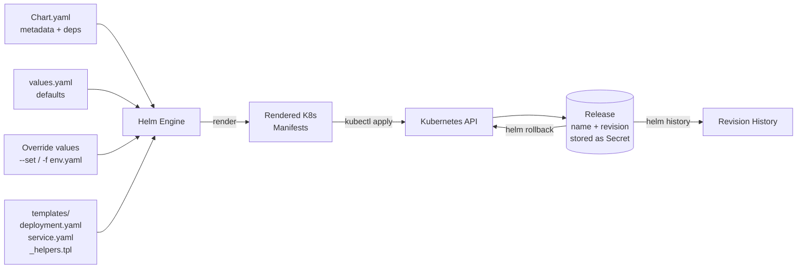

# Helm — A 2-Day Crash Course

> **In one sentence:** Helm is the package manager for Kubernetes — it bundles all the YAML for
> an app into a reusable, versioned, configurable "chart" you can install with one command.

> Prerequisite: know Kubernetes basics (Deployments, Services, ConfigMaps). See `Kubernetes.md`.

---

## Part 0 — Why Helm exists

Deploying a real app to Kubernetes means writing a *pile* of YAML: a Deployment, a Service, a
ConfigMap, a Secret, an Ingress, maybe an HPA — easily 200+ lines. Now you need that same app
in dev, staging, and prod, each with different replica counts, image tags, and hostnames. You
end up copy-pasting YAML and hand-editing values in three places. It's error-prone and doesn't
scale.

Helm solves two distinct problems:
1. **Templating + configuration.** Write the YAML *once* with placeholders (`{{ .Values.x }}`),
   then supply different values per environment. One template, many deployments.
2. **Packaging + distribution + lifecycle.** Bundle it all into a versioned **chart** you can
   share, install, upgrade, roll back, and uninstall as a single unit — like `apt`/`brew` but
   for Kubernetes apps.

**Mental model:** A **chart** is a parameterized template (the blueprint + default values).
When you install it, Helm renders the templates with your values into plain Kubernetes YAML,
applies it, and records the result as a versioned **release**. Chart = blueprint; values =
the knobs; release = a specific installed instance you can upgrade and roll back.



---

## Part 1 — The vocabulary

| Term | Meaning |
|------|---------|
| **Chart** | A package: templates + default values + metadata |
| **Values** | The configuration that fills in the templates (`values.yaml` / `--set`) |
| **Release** | A specific install of a chart into a cluster (named, versioned) |
| **Repository** | A place charts are hosted (like a registry for charts) |
| **Template** | A Kubernetes manifest with Go-template placeholders |
| **Revision** | Each upgrade bumps the release revision — enables rollback |

---

## DAY 1 — Get it working

### 1. Install & use an existing chart (consume before you create)
```bash
helm version
helm repo add bitnami https://charts.bitnami.com/bitnami    # add a chart repo
helm repo update
helm search repo nginx                                       # find charts
helm install my-nginx bitnami/nginx                          # install (release name: my-nginx)
helm list                                                    # see your releases
kubectl get pods                                             # the chart created real resources
```
You just deployed a production-grade nginx — Deployment, Service, config, the lot — with one
command. `my-nginx` is the **release name**; `bitnami/nginx` is the chart.

### 2. Configure it with values
Charts expose knobs. See them, then override:
```bash
helm show values bitnami/nginx                # all configurable values + defaults
helm install my-nginx bitnami/nginx --set replicaCount=3
# or with a file:
helm install my-nginx bitnami/nginx -f my-values.yaml
```
`my-values.yaml`:
```yaml
replicaCount: 3
service:
  type: LoadBalancer
```
Same chart, your configuration. This is the core workflow: *find a chart, override values.*

### 3. Upgrade, roll back, uninstall — the lifecycle
```bash
helm upgrade my-nginx bitnami/nginx --set replicaCount=5   # change config -> new revision
helm history my-nginx                                       # list revisions
helm rollback my-nginx 1                                    # go back to revision 1
helm uninstall my-nginx                                     # remove everything the release created
```
`helm upgrade --install` (often written `helm upgrade -i`) is the idempotent workhorse: installs
if absent, upgrades if present — ideal for CI/CD.

### 4. See what Helm *would* do (dry run)
```bash
helm install my-nginx bitnami/nginx --dry-run --debug     # render + validate, apply nothing
helm template my-nginx bitnami/nginx -f my-values.yaml    # just print the rendered YAML
```
`helm template` renders locally with no cluster — perfect for inspecting exactly what gets
applied and for piping into `kubectl diff`.

**By end of Day 1 you can:** add repos, install/upgrade/rollback/uninstall releases, and
configure charts with values. That's all you need to *consume* the huge ecosystem of existing
charts (databases, monitoring stacks, ingress controllers, etc.).

---

## DAY 2 — Make it real (author your own chart)

### 1. Scaffold a chart
```bash
helm create myapp        # generates a working example chart you can edit down
```
Chart layout:
```
myapp/
├── Chart.yaml            # name, version, description (chart metadata)
├── values.yaml           # DEFAULT configuration values
├── templates/            # the templated Kubernetes manifests
│   ├── deployment.yaml
│   ├── service.yaml
│   ├── _helpers.tpl      # reusable template snippets (named templates)
│   └── NOTES.txt         # post-install message shown to the user
└── charts/               # subchart dependencies live here
```

### 2. Templating — the Go template language
Inside `templates/deployment.yaml`:
```yaml
apiVersion: apps/v1
kind: Deployment
metadata:
  name: {{ .Release.Name }}-myapp           # built-in object: the release name
spec:
  replicas: {{ .Values.replicaCount }}      # pulled from values.yaml / --set
  template:
    spec:
      containers:
        - name: myapp
          image: "{{ .Values.image.repository }}:{{ .Values.image.tag }}"
          {{- if .Values.resources }}
          resources:
            {{- toYaml .Values.resources | nindent 12 }}   # render a whole values block
          {{- end }}
```
The pieces:
- `{{ .Values.x }}` — a value from `values.yaml` (or `--set x=...`).
- `{{ .Release.Name }}`, `{{ .Chart.Name }}` — built-in objects Helm provides.
- `{{- if }}...{{- end }}`, `{{- range }}` — conditionals and loops.
- `{{-` / `-}}` — the dash trims surrounding whitespace (critical for valid YAML).
- `toYaml ... | nindent N` — dump a structured value with correct indentation.

### 3. values.yaml — your defaults (the public API of your chart)
```yaml
replicaCount: 1
image:
  repository: ghcr.io/org/myapp
  tag: "1.0.0"
resources:
  requests: { cpu: 100m, memory: 128Mi }
  limits:   { cpu: 500m, memory: 256Mi }
```
Users override these per environment. Good charts pick sane defaults and document every value.

### 4. Helpers and named templates (`_helpers.tpl`)
Avoid repeating label blocks everywhere:
```yaml
{{- define "myapp.labels" -}}
app.kubernetes.io/name: {{ .Chart.Name }}
app.kubernetes.io/instance: {{ .Release.Name }}
{{- end }}
```
Use it: `{{- include "myapp.labels" . | nindent 4 }}`. DRY templates, consistent labels.

### 5. Validate, package, and ship
```bash
helm lint myapp                          # catch chart errors
helm template myapp ./myapp              # render to inspect
helm install demo ./myapp --dry-run --debug
helm package myapp                       # -> myapp-1.0.0.tgz (a distributable artifact)
helm push myapp-1.0.0.tgz oci://registry.example.com/charts   # OCI registries host charts now
```

### 6. Per-environment pattern (how teams actually use Helm)
```bash
helm upgrade -i myapp ./myapp -f values.yaml -f values-staging.yaml   # later file wins
helm upgrade -i myapp ./myapp -f values.yaml -f values-prod.yaml
```
A base `values.yaml` plus thin per-env overlays keeps differences explicit and small. This
pairs naturally with GitOps (Argo CD can render Helm charts directly — see `ArgoCD.md`).

---

## Worked example — package and deploy your app across envs
```text
1. helm create myapp; trim templates/ to your real Deployment + Service.
2. Set defaults in values.yaml (image, replicas, resources).
3. helm lint myapp && helm template myapp ./myapp   # validate + eyeball the YAML
4. helm upgrade -i myapp ./myapp -f values-staging.yaml   # deploy to staging
5. Test, then: helm upgrade -i myapp ./myapp -f values-prod.yaml   # promote to prod
6. Bad release? helm rollback myapp <previous-revision>   # instant, clean revert
7. helm history myapp   # full audit of revisions
```

---

## Common pitfalls
- **Whitespace/indentation in templates.** YAML is indentation-sensitive and Go templates
  emit text blindly. Use `{{-`/`-}}` to trim and `nindent` for blocks. `helm template` to debug.
- **Forgetting `--install` in CI.** Plain `helm upgrade` fails if the release doesn't exist;
  use `helm upgrade -i`.
- **Editing live resources with kubectl.** The next `helm upgrade` overwrites your manual
  change. Change values/templates, not the cluster.
- **`helm install` twice with the same name.** Errors ("release already exists"). Use `upgrade -i`.
- **Hardcoding values in templates.** Defeats the point — expose them in `values.yaml`.
- **Not pinning chart versions.** `helm install x repo/chart` grabs the latest; pin with
  `--version` for reproducible deploys.
- **Secrets in values files committed to Git.** Use a secrets solution (sealed-secrets,
  external-secrets, SOPS) — don't commit plaintext.

---

## Quick command reference
```bash
# Repos
helm repo add <name> <url>      helm repo update      helm repo list
helm search repo <term>         helm search hub <term>

# Releases (lifecycle)
helm install <release> <chart> [-f vals.yaml] [--set k=v] [--version X]
helm upgrade -i <release> <chart> -f vals.yaml      # install-or-upgrade (idempotent)
helm list [-A]                  helm status <release>
helm history <release>          helm rollback <release> <revision>
helm uninstall <release>

# Inspect / debug (no cluster changes)
helm show values <chart>        helm show chart <chart>
helm template <release> <chart> [-f vals.yaml]      # render to stdout
helm install <r> <c> --dry-run --debug
helm get values <release>       helm get manifest <release>

# Authoring
helm create <name>              helm lint <chart>
helm package <chart>            helm dependency update <chart>
helm push <chart>.tgz oci://<registry>/charts
```

### Template essentials
`{{ .Values.x }}` · `{{ .Release.Name }}` · `{{ .Chart.Name }}` · `{{ .Files.Get "f" }}` ·
`{{- if }}/{{ else }}/{{ end }}` · `{{- range .Values.list }}` · `{{- define }}/include` ·
`| nindent N` · `| toYaml` · `| quote` · `| default "x"` · `{{-` and `-}}` (whitespace trim).

---

## Top 10 Interview Questions

<details>
<summary><strong>Q: What is the difference between a Helm chart, a release, and a revision?</strong></summary>

A chart is the package — a collection of templates, default values, and metadata that describes a Kubernetes application. A release is a specific installed instance of a chart in a cluster, identified by a name you choose (e.g. `my-nginx`). Each time you upgrade a release, the revision number increments. Revisions enable rollback — you can revert to any previous revision if an upgrade goes wrong.

</details>

<details>
<summary><strong>Q: How does `helm upgrade --install` differ from running `helm install` and `helm upgrade` separately, and why is it preferred in CI/CD?</strong></summary>

`helm upgrade --install` (shorthand `upgrade -i`) is idempotent: it installs the release if it does not exist, or upgrades it if it does. Running `helm install` on an existing release fails with "release already exists," and `helm upgrade` on a non-existent release also fails. In CI/CD pipelines you want a single command that works regardless of whether this is the first deployment or the hundredth, making `upgrade -i` the standard approach.

</details>

<details>
<summary><strong>Q: Explain the Helm chart directory structure and the role of each key file.</strong></summary>

`Chart.yaml` holds metadata — name, version, description, and dependency declarations. `values.yaml` contains the default configuration values that users override per environment. The `templates/` directory holds Kubernetes manifests with Go template placeholders (`{{ .Values.x }}`). `_helpers.tpl` defines reusable named templates (labels, names). `NOTES.txt` is displayed post-install. The `charts/` directory holds downloaded subchart dependencies.

</details>

<details>
<summary><strong>Q: How do you manage different configurations across dev, staging, and production environments with Helm?</strong></summary>

Use a base `values.yaml` with sane defaults, then create thin per-environment override files (`values-dev.yaml`, `values-staging.yaml`, `values-prod.yaml`) containing only the values that differ — replica counts, image tags, resource limits, hostnames. Apply them with `helm upgrade -i myapp ./myapp -f values.yaml -f values-prod.yaml` — the later file wins on conflicts. This keeps environment differences explicit, small, and reviewable in Git.

</details>

<details>
<summary><strong>Q: What are Helm hooks, and when would you use them?</strong></summary>

Hooks are special templates annotated with `helm.sh/hook` that run at specific lifecycle points — `pre-install`, `post-install`, `pre-upgrade`, `post-upgrade`, `pre-delete`, etc. Common use cases include running database migrations before an upgrade (`pre-upgrade`), loading seed data after install (`post-install`), or running cleanup jobs before deletion. Hooks run as Kubernetes Jobs and can have weight (ordering) and deletion policies.

</details>

<details>
<summary><strong>Q: How does Helm store release information, and what happens if you modify resources directly with kubectl?</strong></summary>

Helm stores release metadata (the rendered manifests, values used, revision history) as Kubernetes Secrets in the release's namespace. When you run `helm upgrade`, Helm computes a three-way diff between the previous release manifest, the new rendered manifest, and the live state. If you modify resources directly with `kubectl edit` or `kubectl apply`, the next `helm upgrade` will overwrite your manual changes because Helm treats its stored manifest as the source of truth.

</details>

<details>
<summary><strong>Q: What is the purpose of `_helpers.tpl` and the `include` function in Helm templates?</strong></summary>

`_helpers.tpl` is a convention for defining reusable named templates — typically for standard labels, resource names, and selector blocks that need to be consistent across all manifests. `{{ include "myapp.labels" . | nindent 4 }}` renders the named template and indents it correctly. This DRYs up templates and ensures consistency — changing a label pattern in `_helpers.tpl` updates it everywhere rather than requiring edits to every template file.

</details>

<details>
<summary><strong>Q: How do you debug a Helm chart that produces invalid Kubernetes YAML?</strong></summary>

Use `helm template myrelease ./mychart -f values.yaml` to render the templates locally without applying to the cluster — inspect the output for YAML errors. `helm install --dry-run --debug` does the same but also validates against the Kubernetes API. `helm lint ./mychart` catches common chart issues. The most frequent cause of invalid YAML is Go template whitespace — use `{{-` and `-}}` to trim whitespace and `| nindent N` for correct indentation of block values.

</details>

<details>
<summary><strong>Q: What are Helm chart dependencies (subcharts), and how do you manage them?</strong></summary>

Dependencies let you compose charts — your application chart can declare that it needs Redis, PostgreSQL, or any other chart as a dependency in `Chart.yaml` under the `dependencies:` section, specifying the chart name, version, and repository. Running `helm dependency update` downloads them into the `charts/` directory. You can pass values to subcharts via the parent's `values.yaml` using the subchart name as a key. Pin dependency versions for reproducible deployments.

</details>

<details>
<summary><strong>Q: How does Helm rollback work, and what are its limitations?</strong></summary>

`helm rollback <release> <revision>` re-applies the manifests from a previous revision, effectively creating a new revision with the old configuration. It handles Deployments, Services, and other Kubernetes resources that Helm manages. Limitations: it does not rollback external state changes — database migrations, persistent volume data, or changes made outside Helm. If a `pre-upgrade` hook ran a migration, rollback will not reverse it. For stateful changes, you need an application-level rollback strategy alongside Helm.

</details>

---

## Next steps after Day 2
- **Subcharts & dependencies** (`Chart.yaml` `dependencies:` + `helm dependency update`) to
  compose apps (e.g. your app + its Redis chart).
- **Chart hooks** (`pre-install`, `post-upgrade`) for migrations/jobs.
- **helm-diff** plugin to preview upgrades; **helmfile** to manage many releases declaratively.
- Render Helm via **Argo CD** for GitOps-driven Helm deployments.

## Recommended learning resources

**YouTube channels & playlists:**
- [TechWorld with Nana — Helm Tutorial](https://www.youtube.com/@TechWorldwithNana) — beginner-friendly walkthrough of charts, values, and templating
- [KodeKloud — Helm for Beginners](https://www.youtube.com/@KodeKloud) — hands-on labs covering chart creation, dependencies, and upgrades
- [That DevOps Guy (Marcel Dempers)](https://www.youtube.com/@introsession) — production Helm patterns including library charts, umbrella charts, and CI/CD integration
- [Viktor Farcic (DevOps Toolkit)](https://www.youtube.com/@DevOpsToolkit) — honest comparisons of Helm vs Kustomize vs raw manifests with real tradeoffs

**Official docs & blogs:**
- [Helm Official Documentation](https://helm.sh/docs/) — the canonical reference for chart structure, templating functions, and CLI commands
- [Artifact Hub](https://artifacthub.io/) — the central registry for discovering and evaluating community Helm charts

**The mantra:** chart = blueprint, values = knobs, release = an installed, versioned instance.
Override values per environment, `upgrade -i` in CI, and `rollback` when it goes wrong.
