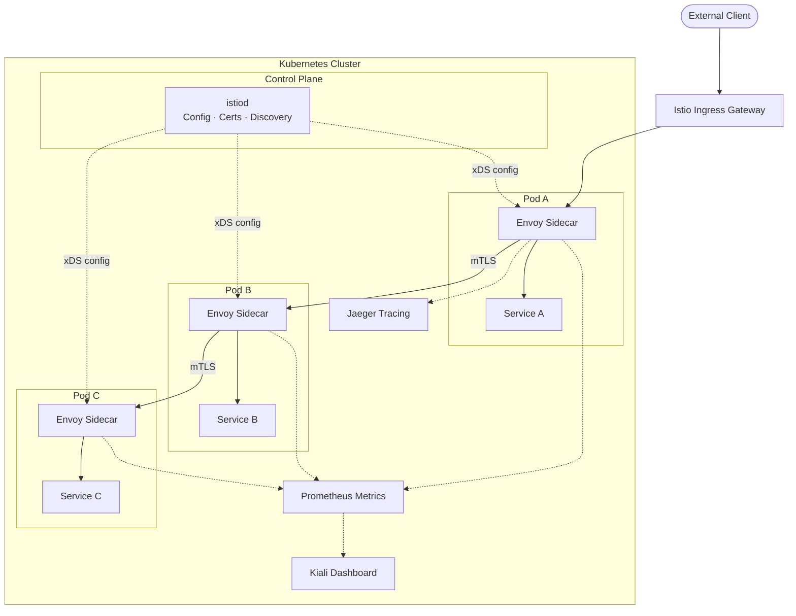

# Istio — A 2-Day Crash Course

> **In one sentence:** Istio is a service mesh that gives you traffic management, security (mTLS), and observability between your microservices — without changing a single line of application code. Prerequisite: know Kubernetes — see `Kubernetes.md`.

---

## Part 0 — Why Istio exists

You have ten microservices. Each one needs to retry failed calls, break circuits when a downstream is degraded, encrypt traffic to its neighbours, report distributed traces, and support canary releases. You could bake that into every service — but that means ten implementations in five languages, all drifting out of sync the moment a new team joins.

Istio solves this by pulling every cross-cutting concern out of your application code and pushing it into the network layer. Your service still speaks plain HTTP or gRPC. The infrastructure intercepts every packet and handles the rest.

The failure modes Istio addresses:

- **Cascading failures** — one slow service degrades the whole fleet without circuit breaking
- **Unencrypted east-west traffic** — services talk plaintext inside the cluster by default
- **Blind retries** — each team reinvents exponential backoff inconsistently
- **Invisible traffic** — you have no idea where latency is actually hiding without distributed tracing
- **Manual canary management** — shifting 5% of traffic to v2 requires custom load-balancer config

All of these become declarative Kubernetes YAML once Istio is installed.

**Mental model:** Istio is an invisible network layer — it injects a sidecar proxy (Envoy) next to every pod, and those proxies handle all the cross-cutting concerns while your app just talks HTTP. The control plane (`istiod`) programs all those proxies from a single point. Your application never knows Istio is there.



---

## Part 1 — The vocabulary

| Term | What it is |
|------|-----------|
| **Service Mesh** | A dedicated infrastructure layer that controls service-to-service communication — retries, auth, observability — applied uniformly across all services |
| **Sidecar (Envoy)** | A lightweight proxy container injected alongside every application pod; all inbound and outbound traffic flows through it |
| **Control Plane (istiod)** | The single Istio binary that distributes configuration to all Envoy proxies; handles certificate issuance, service discovery, and policy |
| **VirtualService** | Defines routing rules for traffic — how to route requests to a service, with weights, header matching, retries, and timeouts |
| **DestinationRule** | Defines policies applied after routing — which subsets (versions) exist, load-balancing strategy, connection pool settings, outlier detection |
| **Gateway** | Configures a load balancer at the mesh edge for ingress (or egress) traffic; works in front of VirtualServices |
| **mTLS** | Mutual TLS — both sides of every connection authenticate each other; Istio provisions and rotates certificates automatically via istiod |
| **PeerAuthentication** | Policy that controls whether mTLS is required, optional, or disabled between workloads in a namespace or across the mesh |
| **AuthorizationPolicy** | RBAC for the mesh — specifies which source workloads (or JWT principals) can call which destination workloads on which paths and methods |
| **Kiali** | The Istio-native dashboard; draws a live graph of your service mesh, shows traffic flow, error rates, and mTLS status |

---

## DAY 1 — Install and observe

### 1. Prerequisites

You need a running Kubernetes cluster. If you are starting from scratch, see `Kubernetes.md`. A local cluster (kind, minikube, or k3d) works fine for Day 1.

```bash
# Verify your cluster is reachable
kubectl cluster-info
kubectl get nodes
```

### 2. Install istioctl

`istioctl` is the Istio CLI — it installs the mesh, inspects proxies, and diagnoses configuration problems.

```bash
# macOS / Linux — download the latest release
curl -L https://istio.io/downloadIstio | sh -

# Move the binary to your PATH (replace X.Y.Z with the version downloaded)
mv istio-X.Y.Z/bin/istioctl /usr/local/bin/

# Verify
istioctl version
```

### 3. Install Istio into the cluster

Istio ships with named profiles. `demo` enables all features including tracing and Kiali. Use `default` for production.

```bash
# Install with the demo profile
istioctl install --set profile=demo -y

# Confirm control plane pods are running
kubectl get pods -n istio-system
```

You should see `istiod`, `istio-ingressgateway`, and `istio-egressgateway` pods running.

### 4. Enable sidecar injection

Istio injects the Envoy sidecar automatically when you label a namespace. Every pod deployed into a labelled namespace gets a second container — the proxy — without any change to your Deployment manifests.

```bash
# Label the default namespace for injection
kubectl label namespace default istio-injection=enabled

# Confirm the label
kubectl get namespace default --show-labels
```

### 5. Deploy the sample app (Bookinfo)

Istio ships with Bookinfo — a polyglot microservices app used in all official documentation. It has four services: `productpage`, `details`, `reviews` (three versions), and `ratings`.

```bash
# Deploy Bookinfo
kubectl apply -f https://raw.githubusercontent.com/istio/istio/release-1.21/samples/bookinfo/platform/kube/bookinfo.yaml

# Wait for all pods to be ready — each pod should show 2/2 containers (app + Envoy)
kubectl get pods

# Quick smoke test
kubectl exec -it deploy/productpage-v1 -c productpage -- curl -s http://productpage:9080/productpage | head -20
```

### 6. Install observability add-ons

```bash
# Install Kiali, Prometheus, Grafana, and Jaeger
kubectl apply -f https://raw.githubusercontent.com/istio/istio/release-1.21/samples/addons/kiali.yaml
kubectl apply -f https://raw.githubusercontent.com/istio/istio/release-1.21/samples/addons/prometheus.yaml
kubectl apply -f https://raw.githubusercontent.com/istio/istio/release-1.21/samples/addons/grafana.yaml
kubectl apply -f https://raw.githubusercontent.com/istio/istio/release-1.21/samples/addons/jaeger.yaml

kubectl rollout status deployment/kiali -n istio-system
```

### 7. Open Kiali and see live traffic

```bash
# Port-forward Kiali to your browser
istioctl dashboard kiali
```

In another terminal, generate traffic:

```bash
for i in $(seq 1 100); do
  curl -s http://$(kubectl get svc productpage -o jsonpath='{.spec.clusterIP}'):9080/productpage > /dev/null
done
```

In Kiali, navigate to Graph → Namespace: default. You see the live service graph, request rates, error rates (red edges = 5xx), and mTLS padlock icons on each connection. Every edge with a padlock means that traffic is mutually authenticated and encrypted — you got this for free.

### 8. Confirm mTLS is active

```bash
# Check PeerAuthentication policy — demo profile enables PERMISSIVE mode by default
kubectl get peerauthentication -A

# Inspect a specific connection's TLS status
istioctl x describe pod $(kubectl get pod -l app=productpage -o jsonpath='{.items[0].metadata.name}')
```

### 9. Write your first VirtualService

Route all traffic to `reviews` v1 (the version with no star ratings) to establish a stable baseline before Day 2.

```yaml
# reviews-vs.yaml
apiVersion: networking.istio.io/v1beta1
kind: VirtualService
metadata:
  name: reviews
spec:
  hosts:
  - reviews
  http:
  - route:
    - destination:
        host: reviews
        subset: v1
```

```yaml
# reviews-dr.yaml — defines the subsets (versions)
apiVersion: networking.istio.io/v1beta1
kind: DestinationRule
metadata:
  name: reviews
spec:
  host: reviews
  subsets:
  - name: v1
    labels:
      version: v1
  - name: v2
    labels:
      version: v2
  - name: v3
    labels:
      version: v3
```

```bash
kubectl apply -f reviews-vs.yaml
kubectl apply -f reviews-dr.yaml
```

Refresh the productpage several times — you always land on v1 now. Without the VirtualService, Kubernetes round-robins across all three versions.

**By end of Day 1 you can:**
- Install Istio on any Kubernetes cluster
- Enable automatic sidecar injection per namespace
- Read the live service graph in Kiali and see which connections are mTLS-encrypted
- Write a VirtualService to pin traffic to a specific version

---

## DAY 2 — Make it real

### 1. Traffic splitting — canary and blue-green

Weighted routing is the core primitive for canary deployments. You split traffic by percentage across DestinationRule subsets.

```yaml
# Send 90% to v1, 10% to v2
apiVersion: networking.istio.io/v1beta1
kind: VirtualService
metadata:
  name: reviews
spec:
  hosts:
  - reviews
  http:
  - route:
    - destination:
        host: reviews
        subset: v1
      weight: 90
    - destination:
        host: reviews
        subset: v2
      weight: 10
```

For header-based blue-green (route specific users to v2):

```yaml
http:
- match:
  - headers:
      x-canary-user:
        exact: "true"
  route:
  - destination:
      host: reviews
      subset: v2
- route:
  - destination:
      host: reviews
      subset: v1
```

### 2. Retries and timeouts

Add these inside the VirtualService `http` block. Retries fire on 5xx and connection failures. Timeouts prevent slow services from holding connections open indefinitely.

```yaml
http:
- route:
  - destination:
      host: ratings
      subset: v1
  timeout: 3s
  retries:
    attempts: 3
    perTryTimeout: 1s
    retryOn: "5xx,reset,connect-failure"
```

⚠️ Be careful with retries on non-idempotent writes (POST, PATCH). Retrying a payment endpoint without idempotency keys causes duplicate charges.

### 3. Circuit breaker

Circuit breakers live in DestinationRule under `trafficPolicy.outlierDetection`. Envoy ejects unhealthy hosts from the load-balancing pool when they exceed an error threshold.

```yaml
apiVersion: networking.istio.io/v1beta1
kind: DestinationRule
metadata:
  name: ratings
spec:
  host: ratings
  trafficPolicy:
    outlierDetection:
      consecutive5xxErrors: 5
      interval: 10s
      baseEjectionTime: 30s
      maxEjectionPercent: 100
    connectionPool:
      http:
        http1MaxPendingRequests: 100
        http2MaxRequests: 1000
```

When five consecutive 5xx responses come from a pod, that pod is ejected for 30 seconds. `connectionPool` limits concurrent connections — requests beyond the limit fail fast rather than piling up.

### 4. Fault injection

Fault injection lets you test resilience without touching application code. Inject delays to simulate network latency, or aborts to simulate 500 errors.

```yaml
# Inject a 5-second delay for 50% of requests to ratings
http:
- fault:
    delay:
      percentage:
        value: 50
      fixedDelay: 5s
  route:
  - destination:
      host: ratings
      subset: v1
```

```yaml
# Inject HTTP 503 for 10% of requests
http:
- fault:
    abort:
      percentage:
        value: 10
      httpStatus: 503
  route:
  - destination:
      host: ratings
      subset: v1
```

Use fault injection to verify your timeouts and retries behave as expected before you hit production.

### 5. mTLS — enforce STRICT mode

The demo profile installs in PERMISSIVE mode — plaintext is still allowed. Move to STRICT to require mutual TLS on every connection.

```yaml
# Enforce STRICT mTLS mesh-wide
apiVersion: security.istio.io/v1beta1
kind: PeerAuthentication
metadata:
  name: default
  namespace: istio-system
spec:
  mtls:
    mode: STRICT
```

```bash
kubectl apply -f strict-mtls.yaml

# Verify — any pod without a sidecar will now fail to connect
istioctl x check-inject -n default
```

### 6. JWT authentication

Require a valid JWT on incoming requests. Istio validates the token against a JWKS URI before the request reaches your service.

```yaml
apiVersion: security.istio.io/v1beta1
kind: RequestAuthentication
metadata:
  name: productpage-jwt
  namespace: default
spec:
  selector:
    matchLabels:
      app: productpage
  jwtRules:
  - issuer: "https://accounts.example.com"
    jwksUri: "https://accounts.example.com/.well-known/jwks.json"
```

A request with a malformed token gets a 401. A request with no token passes through — pair this with an AuthorizationPolicy to reject unauthenticated requests entirely.

### 7. AuthorizationPolicy — RBAC for the mesh

AuthorizationPolicy is the Istio equivalent of a firewall rule. It controls which source workloads (or JWT principals) can reach a destination.

```yaml
# Allow only the productpage service to call reviews
apiVersion: security.istio.io/v1beta1
kind: AuthorizationPolicy
metadata:
  name: reviews-allow-productpage
  namespace: default
spec:
  selector:
    matchLabels:
      app: reviews
  rules:
  - from:
    - source:
        principals: ["cluster.local/ns/default/sa/bookinfo-productpage"]
    to:
    - operation:
        methods: ["GET"]
```

```yaml
# Deny all traffic by default — then selectively allow
apiVersion: security.istio.io/v1beta1
kind: AuthorizationPolicy
metadata:
  name: deny-all
  namespace: default
spec:
  {}
```

Start with a deny-all policy in your namespace, then add explicit allow rules. This is zero-trust networking without any application changes.

### 8. Observability — traces and metrics

**Distributed tracing (Jaeger)**

Envoy automatically generates trace spans for every hop. The application needs to propagate the `x-b3-*` or `traceparent` headers from incoming requests to outgoing ones — that is the only code change required.

```bash
istioctl dashboard jaeger
```

Search for a trace by service name. Each trace shows the full request path, per-hop latency, and any errors. See `OpenTelemetry.md` for enriching traces with custom spans from application code.

**Metrics (Prometheus + Grafana)**

Envoy exposes a rich set of metrics automatically. See `Prometheus.md` for querying patterns.

```bash
istioctl dashboard grafana
```

The Istio Service Dashboard shows request volume, success rate, and P50/P99 latency per service — without a line of instrumentation code.

### 9. Gateway — ingress into the mesh

A Kubernetes Ingress resource does not understand Istio routing rules. Use an Istio Gateway instead.

```yaml
apiVersion: networking.istio.io/v1beta1
kind: Gateway
metadata:
  name: bookinfo-gateway
spec:
  selector:
    istio: ingressgateway
  servers:
  - port:
      number: 80
      name: http
      protocol: HTTP
    hosts:
    - "bookinfo.example.com"
---
apiVersion: networking.istio.io/v1beta1
kind: VirtualService
metadata:
  name: bookinfo
spec:
  hosts:
  - "bookinfo.example.com"
  gateways:
  - bookinfo-gateway
  http:
  - match:
    - uri:
        prefix: /productpage
    route:
    - destination:
        host: productpage
        port:
          number: 9080
```

For TLS termination at the Gateway, see `Helm.md` — cert-manager integrates cleanly with Istio Gateways.

### 10. Ambient mesh — sidecar-less Istio

Istio 1.21+ ships ambient mode as production-stable. Instead of per-pod sidecars, a node-level daemon (`ztunnel`) handles mTLS and basic L4 policy, while a namespace-level `waypoint` proxy handles L7 routing. This cuts memory overhead by 60-70% and removes the need for pod restarts on injection.

```bash
# Install Istio in ambient mode
istioctl install --set profile=ambient -y

# Enroll a namespace
kubectl label namespace default istio.io/dataplane-mode=ambient

# Verify ztunnel is running on each node
kubectl get pods -n istio-system -l app=ztunnel
```

Ambient mesh is the direction Istio is heading. For new clusters, prefer ambient over sidecars unless you need per-pod policy granularity that only sidecars can provide today.

---

## Worked example — Canary deployment with traffic shifting

You have `reviews` v1 in production. You want to release v2 to 10% of users, monitor error rates, then shift to 100%.

**Step 1 — Deploy v2 alongside v1**

v2 is already in the Bookinfo manifests. Confirm both Deployments exist:

```bash
kubectl get deploy -l app=reviews
# reviews-v1   1/1
# reviews-v2   1/1
# reviews-v3   1/1
```

**Step 2 — Route 10% to v2**

```yaml
apiVersion: networking.istio.io/v1beta1
kind: VirtualService
metadata:
  name: reviews
spec:
  hosts:
  - reviews
  http:
  - route:
    - destination:
        host: reviews
        subset: v1
      weight: 90
    - destination:
        host: reviews
        subset: v2
      weight: 10
```

```bash
kubectl apply -f reviews-canary-10.yaml
```

**Step 3 — Generate traffic and monitor**

```bash
for i in $(seq 1 200); do
  curl -s http://$(kubectl get svc productpage -o jsonpath='{.spec.clusterIP}'):9080/productpage > /dev/null
done
```

Open Kiali → Graph. The `reviews` node shows two outgoing edges — one thick (v1, 90%) and one thin (v2, 10%). Check the error rate on v2. If it stays below your threshold (e.g., < 0.1%), proceed.

**Step 4 — Shift to 50%, then 100%**

```bash
# 50/50
kubectl patch vs reviews --type=json -p='[
  {"op":"replace","path":"/spec/http/0/route/0/weight","value":50},
  {"op":"replace","path":"/spec/http/0/route/1/weight","value":50}
]'

# Monitor for 10 minutes — check Grafana P99 latency

# 100% to v2
kubectl patch vs reviews --type=json -p='[
  {"op":"replace","path":"/spec/http/0/route/0/weight","value":0},
  {"op":"replace","path":"/spec/http/0/route/1/weight","value":100}
]'
```

**Step 5 — Clean up v1**

Once v2 is stable at 100%, delete the v1 Deployment and remove the now-redundant subset from the DestinationRule. The VirtualService can point directly at `reviews` without a subset.

---


## Terminal Demo

```terminal-demo
# istioctl@production ~ %

$ istioctl version
client version: 1.21.0
control plane version: 1.21.0
data plane version: 1.21.0 (15 proxies)

$ kubectl get pods -n istio-system
NAME                                   READY   STATUS    RESTARTS   AGE
istiod-7f8b9c4d5-x2k9n                1/1     Running   0          30d
istio-ingressgateway-6c9a8b3d2-m3p2q   1/1     Running   0          30d

$ istioctl analyze -n production
✔ No validation issues found when analyzing namespace: production.

$ kubectl get virtualservice -n production
NAME         GATEWAYS             HOSTS              AGE
api-vs       [prod-gateway]       [api.example.com]  25d
web-vs       [prod-gateway]       [app.example.com]  25d

$ kubectl get destinationrule -n production
NAME       HOST    AGE
api-dr     api     25d

$ istioctl proxy-status
NAME                                 CDS    LDS    EDS    RDS    ECDS   ISTIOD
api-7d4b8c6f5-x2k9n.production      SYNCED SYNCED SYNCED SYNCED        istiod-7f8b9c4d5-x2k9n
api-7d4b8c6f5-p8m3w.production      SYNCED SYNCED SYNCED SYNCED        istiod-7f8b9c4d5-x2k9n
web-5f8b9c4d7-m3p2q.production      SYNCED SYNCED SYNCED SYNCED        istiod-7f8b9c4d5-x2k9n

$ istioctl dashboard kiali
http://localhost:20001/kiali

$ kubectl get peerauthentication -n production
NAME         MODE     AGE
default      STRICT   30d

$ istioctl proxy-config routes api-7d4b8c6f5-x2k9n.production | head -5
NAME           DOMAINS              MATCH     VIRTUAL SERVICE
8080           api.example.com      /*        api-vs.production
```

---

## Common pitfalls

- **Sidecar not injected.** The namespace label is set but existing pods were not restarted. Injection happens at pod creation — `kubectl rollout restart deployment` to pick it up.

- **503s after applying a VirtualService.** You defined a subset in the VirtualService but have not applied the matching DestinationRule yet. VirtualService subsets without DestinationRule entries return 503 immediately.

- **mTLS breaks non-mesh clients.** A legacy job or monitoring agent without a sidecar tries to call a STRICT-mode service and gets a TLS handshake failure. Either inject a sidecar into the caller, or set a per-port PeerAuthentication to PERMISSIVE for that specific port.

- **Retries on non-idempotent endpoints cause duplicate side effects.** Retrying a POST without checking idempotency keys means the operation fires multiple times. Scope retries to `GET` and safe methods only, or ensure your endpoints are idempotent by design.

- **AuthorizationPolicy with no rules denies everything.** An empty `spec: {}` policy is a deny-all. This is intentional but surprising if you apply it to the wrong namespace by accident.

- **Gateway and VirtualService hosts must match exactly.** If the Gateway `hosts` field is `bookinfo.example.com` and the VirtualService `hosts` field is `*`, Istio will not connect them. Both must agree on the hostname.

- **Resource overhead at scale.** Each sidecar uses roughly 50MB RAM. At 500 pods that is 25GB across the cluster just for proxies. Consider ambient mode for large clusters (see Day 2, section 10).

- **Forgetting to propagate trace headers.** Jaeger will show single-hop traces (just Envoy) instead of full end-to-end traces unless your application copies `x-request-id`, `x-b3-traceid`, `x-b3-spanid`, and related headers from inbound to outbound requests.

- **istioctl and Istio version mismatch.** Always use the `istioctl` binary that matches your installed control plane version. A version skew causes config validation warnings and occasionally broken proxies.

---

## Quick command reference

```bash
# Install Istio
istioctl install --set profile=demo -y
istioctl install --set profile=ambient -y

# Upgrade
istioctl upgrade

# Uninstall
istioctl uninstall --purge

# Check injection status
istioctl x check-inject -n default

# Describe a pod's proxy config (routing, listeners, clusters)
istioctl proxy-config all <pod-name>

# Show effective routing rules for a pod
istioctl x describe pod <pod-name>

# Validate YAML before applying
istioctl analyze -f my-virtualservice.yaml

# Analyze the whole cluster for config issues
istioctl analyze

# Open dashboards
istioctl dashboard kiali
istioctl dashboard grafana
istioctl dashboard jaeger
istioctl dashboard prometheus

# Check proxy sync state with istiod
istioctl proxy-status

# Debug a specific proxy's listeners
istioctl proxy-config listener <pod-name>.<namespace>

# View Envoy clusters (upstream services)
istioctl proxy-config cluster <pod-name>.<namespace>
```

**VirtualService with retries and timeout**

```yaml
apiVersion: networking.istio.io/v1beta1
kind: VirtualService
metadata:
  name: my-service
spec:
  hosts:
  - my-service
  http:
  - route:
    - destination:
        host: my-service
        subset: v1
    timeout: 5s
    retries:
      attempts: 3
      perTryTimeout: 2s
      retryOn: "5xx,reset,connect-failure,retriable-4xx"
```

**DestinationRule with circuit breaker**

```yaml
apiVersion: networking.istio.io/v1beta1
kind: DestinationRule
metadata:
  name: my-service
spec:
  host: my-service
  trafficPolicy:
    outlierDetection:
      consecutive5xxErrors: 5
      interval: 10s
      baseEjectionTime: 30s
      maxEjectionPercent: 50
    connectionPool:
      tcp:
        maxConnections: 100
      http:
        http1MaxPendingRequests: 50
        http2MaxRequests: 200
  subsets:
  - name: v1
    labels:
      version: v1
  - name: v2
    labels:
      version: v2
```

**Enforce STRICT mTLS cluster-wide**

```yaml
apiVersion: security.istio.io/v1beta1
kind: PeerAuthentication
metadata:
  name: default
  namespace: istio-system
spec:
  mtls:
    mode: STRICT
```

**Deny-all then selective allow**

```yaml
# deny-all.yaml
apiVersion: security.istio.io/v1beta1
kind: AuthorizationPolicy
metadata:
  name: deny-all
  namespace: production
spec: {}
---
# allow-frontend-to-api.yaml
apiVersion: security.istio.io/v1beta1
kind: AuthorizationPolicy
metadata:
  name: allow-frontend
  namespace: production
spec:
  selector:
    matchLabels:
      app: api
  rules:
  - from:
    - source:
        principals: ["cluster.local/ns/production/sa/frontend"]
    to:
    - operation:
        methods: ["GET", "POST"]
        paths: ["/api/*"]
```

---

## Top 10 Interview Questions

<details>
<summary><strong>Q: What problem does a service mesh solve, and why can't you just handle it in application code?</strong></summary>

A service mesh centralises cross-cutting concerns — retries, mTLS, circuit breaking, observability — in the infrastructure layer so every service gets them uniformly without each team reimplementing in different languages. Doing it in-app leads to inconsistent behaviour, duplicated effort, and drift the moment a new team joins.

</details>

<details>
<summary><strong>Q: How does Istio inject the Envoy sidecar, and what happens if injection fails?</strong></summary>

Istio uses a mutating admission webhook. When a pod is created in a labelled namespace (`istio-injection=enabled`), the webhook patches the pod spec to add the Envoy container. If injection fails — for example because the webhook is unreachable — the pod starts without a sidecar. Traffic flows but bypasses all mesh policy, which in STRICT mTLS mode means connections are refused by peers.

</details>

<details>
<summary><strong>Q: Explain the relationship between VirtualService and DestinationRule.</strong></summary>

A VirtualService defines routing rules — how traffic is matched and where it goes (host, subset, weight). A DestinationRule defines what happens after routing — which subsets exist (by label), load-balancing algorithm, connection pool limits, and outlier detection. You need both: a VirtualService referencing a subset that has no matching DestinationRule returns 503.

</details>

<details>
<summary><strong>Q: How would you implement a canary deployment using Istio?</strong></summary>

Deploy v2 alongside v1, define both as subsets in a DestinationRule, then create a VirtualService with weighted routing — e.g., 90% to v1 and 10% to v2. Monitor error rates and latency in Kiali or Grafana. Gradually shift the weight (50/50, then 100% to v2) as confidence grows. You can also use header-based matching to route specific test users to v2 before any percentage-based rollout.

</details>

<details>
<summary><strong>Q: What is the difference between PERMISSIVE and STRICT mTLS in Istio?</strong></summary>

PERMISSIVE mode accepts both plaintext and mTLS connections — useful during migration when not all workloads have sidecars yet. STRICT mode requires mTLS on every connection; any client without a sidecar (and therefore without a valid mesh certificate) is rejected. You move to STRICT once all workloads are injected to enforce zero-trust east-west encryption.

</details>

<details>
<summary><strong>Q: How does Istio's AuthorizationPolicy differ from Kubernetes NetworkPolicy?</strong></summary>

Kubernetes NetworkPolicy operates at L3/L4 — source IP, port, protocol. Istio AuthorizationPolicy operates at L7 — it can restrict by HTTP method, path, JWT claims, and service account identity. It also follows Istio's identity model (SPIFFE), so policy survives pod IP changes. The two are complementary: use NetworkPolicy for coarse isolation, AuthorizationPolicy for fine-grained access control.

</details>

<details>
<summary><strong>Q: What observability does Istio provide out of the box, and what requires application changes?</strong></summary>

Out of the box, Envoy generates request-level metrics (volume, latency, error rate) and creates trace spans for each hop — no application changes needed. The one requirement for distributed tracing is that the application propagates trace context headers (`x-b3-*` or `traceparent`) from incoming to outgoing requests. Without header propagation, you get per-hop spans but cannot stitch them into end-to-end traces.

</details>

<details>
<summary><strong>Q: What is ambient mesh and when would you choose it over sidecars?</strong></summary>

Ambient mesh replaces per-pod sidecars with a node-level ztunnel daemon for L4 mTLS and a namespace-level waypoint proxy for L7 policy. It cuts memory overhead by 60-70% and removes the need for pod restarts on injection. Choose ambient for large clusters where sidecar resource cost is significant, or when you cannot restart workloads to inject sidecars. Choose sidecars when you need per-pod L7 policy granularity that waypoint proxies do not yet fully support.

</details>

<details>
<summary><strong>Q: How do you debug a 503 error in an Istio mesh?</strong></summary>

Start with `istioctl analyze` to check for configuration errors. Then use `istioctl proxy-config cluster <pod>` and `istioctl proxy-config route <pod>` to inspect what Envoy sees. Common causes: a VirtualService references a subset not defined in a DestinationRule, the destination service has no healthy endpoints, or a circuit breaker has ejected all hosts. Kiali's service graph shows error edges in red, and Hubble or Envoy access logs reveal the upstream response code.

</details>

<details>
<summary><strong>Q: What are the resource overhead implications of Istio at scale, and how do you mitigate them?</strong></summary>

Each Envoy sidecar consumes roughly 50MB RAM and a small CPU slice. At 500 pods, that is 25GB of RAM just for proxies. Mitigation options: use ambient mesh to remove per-pod sidecars, scope sidecar injection to namespaces that actually need mesh features, tune Envoy concurrency settings, and use Sidecar resources to limit the configuration each proxy receives — reducing memory consumption from large service discovery tables.

</details>

---


## Quick Quiz

Test your understanding with these rapid-fire questions (answers hidden):

<details>
<summary>1. What is the ONE core problem that Istio solves?</summary>
Re-read Part 0 — the mental model section. If you can explain the "why" in one sentence, you understand the foundation.
</details>

<details>
<summary>2. Name the 3 most important terms from the vocabulary section.</summary>
Review Part 1. These are the building blocks every conversation about Istio uses.
</details>

<details>
<summary>3. What is the first thing you would set up on Day 1?</summary>
Check the Day 1 section — the very first hands-on step that gets you a working result.
</details>

<details>
<summary>4. What is the most common production pitfall with Istio?</summary>
Review the Common Pitfalls section. The first item listed is typically the most frequently encountered.
</details>

<details>
<summary>5. How does Istio compare to its closest alternative?</summary>
Check the Comparison Matrix below — focus on the key differentiating row.
</details>


## Comparison Matrix

| Dimension | Istio | Linkerd | Cilium Mesh |
|-----------|-------|---------|-------------|
| **Primary use case** | Core strength of Istio | Core strength of Linkerd | Core strength of Cilium Mesh |
| **Learning curve** | Moderate | Varies | Varies |
| **Community/ecosystem** | Active | Active | Growing |
| **Operational complexity** | Medium | Varies | Varies |
| **Best for** | See Part 0 | Different tradeoffs | Different tradeoffs |

> **How to read this matrix:** no tool wins on every dimension. Pick based on your specific constraints — team expertise, existing infrastructure, scale requirements, and compliance needs. The right choice is the one that fits your context, not the one with the most checkmarks.

## Next steps after Day 2

- **Linkerd** — a lighter-weight alternative mesh written in Rust; simpler to operate, less feature-rich than Istio — good comparison point to understand the tradeoffs
- **Cilium** — eBPF-based networking that can replace kube-proxy and provide some mesh capabilities without sidecars; complements or replaces Istio ambient depending on your requirements
- **`Kubernetes.md`** — revisit RBAC, NetworkPolicy, and Service Account management — these integrate directly with Istio's AuthorizationPolicy model
- **`Prometheus.md`** — query the Istio metrics Envoy exposes: `istio_requests_total`, `istio_request_duration_milliseconds`, `istio_tcp_connections_opened_total`
- **`OpenTelemetry.md`** — add application-level spans to complement Envoy's automatic trace generation; use the OTel SDK to propagate context and emit custom metrics alongside Istio's

---

## Recommended learning resources

**YouTube channels & playlists:**
- [TechWorld with Nana — Istio Service Mesh](https://www.youtube.com/@TechWorldwithNana) — clear introduction to sidecars, traffic management, and observability with Istio
- [CNCF — KubeCon Service Mesh Talks](https://www.youtube.com/@cncf) — deep dives on Istio ambient mode, Envoy internals, and mesh adoption patterns from maintainers
- [Rawkode Live — CNCF Ecosystem](https://www.youtube.com/@rawkode) — hands-on walkthroughs of Istio alongside other CNCF networking tools
- [Viktor Farcic (DevOps Toolkit)](https://www.youtube.com/@DevOpsToolkit) — Istio vs Linkerd vs Cilium comparisons grounded in production experience
- [That DevOps Guy (Marcel Dempers)](https://www.youtube.com/@introsession) — production-focused Istio setup including mTLS, canary deployments, and gateway configuration

**Official docs & blogs:**
- [Istio Official Documentation](https://istio.io/latest/docs/) — the reference for traffic management, security policies, and observability configuration
- [Istio Blog](https://istio.io/latest/blog/) — release notes, ambient mesh updates, and architecture evolution posts
- [The New Stack — Service Mesh Articles](https://thenewstack.io/category/service-mesh/) — cloud native news covering mesh adoption patterns and comparisons

**The mantra:** The network is the policy — declare what traffic should do, and Envoy enforces it everywhere, invisibly.
