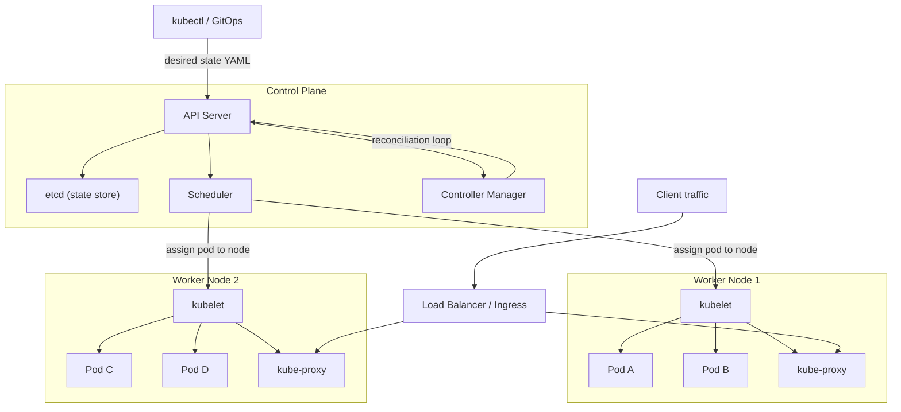

# Kubernetes — A 2-Day Crash Course

> **In one sentence:** Kubernetes (K8s) is a system that runs your containers across a fleet of
> machines for you — restarting them when they crash, scaling them up and down, and keeping the
> running reality matching the state you declared.

> Prerequisite: understand containers first (see `Docker.md`). Kubernetes *runs* container images.

---

## Part 0 — Why Kubernetes exists

Docker runs containers on *one* machine. But production needs more: dozens of machines,
hundreds of containers, automatic restart when one dies, scaling when traffic spikes, rolling
updates with zero downtime, and self-healing when a whole server fails. Doing this by hand is
impossible. Kubernetes is the **orchestrator** that does it automatically.

**The one idea that explains all of Kubernetes: the reconciliation loop.** You don't tell
Kubernetes *how* to do things step by step. You declare *desired state* ("I want 3 replicas of
this image running") in YAML. Kubernetes constantly compares desired state to actual state and
takes action to close any gap. A pod crashes? Actual is now 2, desired is 3 → it starts a new
one. A node dies? It reschedules those pods elsewhere. You describe the destination; K8s
continuously drives toward it.

**Mental model:** Kubernetes is a thermostat. You set the target (desired state); it endlessly
measures reality and acts to match it. Every object you create is just another "set point" the
control loops work to satisfy.



---

## Part 1 — The vocabulary (the object hierarchy)

You rarely create a bare container. You build up through layers, each adding a capability:

| Object | What it adds | Analogy |
|--------|--------------|---------|
| **Pod** | One or more containers sharing network/storage; the smallest unit | A single running instance |
| **ReplicaSet** | Keeps N identical pods alive | A photocopier maintaining N copies |
| **Deployment** | Manages ReplicaSets; rolling updates + rollback | The manager you actually talk to |
| **Service** | A stable network address + load balancing across pods | A permanent phone number |
| **Ingress** | HTTP routing from outside into Services | The front-desk router |
| **ConfigMap / Secret** | Inject config / sensitive data into pods | Settings & passwords |
| **Namespace** | A virtual cluster for grouping/isolating resources | A folder / a tenant |

You almost always create a **Deployment** (not a Pod directly) and a **Service** to expose it.
Pods are cattle, not pets — they're created and destroyed constantly and get new IPs each time,
which is exactly why Services exist (a stable address in front of changing pods).

**Cluster anatomy:** a **control plane** (the brain: API server, scheduler, controllers, etcd
datastore) plus **worker nodes** (machines that actually run your pods). `kubectl` talks to the
API server; everything you do is "tell the API server my desired state."

---

## DAY 1 — Get it working

### 0. Get a cluster + set up kubectl
For learning, run a local cluster: `kind`, `minikube`, or Docker Desktop's built-in K8s.
```bash
alias k=kubectl                 # everyone does this
kubectl version --short
kubectl config current-context  # which cluster am I pointed at? (check before EVERY action)
kubectl get nodes               # the machines in your cluster
```
> The #1 production accident is running a command against the wrong cluster. Make checking
> `current-context` a reflex.

### 1. Run something imperatively (to feel it), then do it the real way
```bash
kubectl create deployment web --image=nginx     # quick, imperative
kubectl get pods                                 # watch a pod appear
kubectl scale deployment/web --replicas=3        # now 3 pods
kubectl get pods                                 # three of them
kubectl delete pod <one-pod-name>                # delete one...
kubectl get pods                                 # ...K8s instantly recreates it (reconciliation!)
```
That auto-recreation is the whole point — you witnessed the control loop maintaining desired
state. Now delete it (`kubectl delete deployment web`) and do it declaratively.

### 2. Declarative YAML — the way you'll actually work
`deployment.yaml`:
```yaml
apiVersion: apps/v1
kind: Deployment
metadata:
  name: web
spec:
  replicas: 3
  selector:
    matchLabels: { app: web }      # which pods this Deployment owns
  template:                         # the pod blueprint
    metadata:
      labels: { app: web }          # pods get this label (must match selector above)
    spec:
      containers:
        - name: nginx
          image: nginx:1.25
          ports: [{ containerPort: 80 }]
          resources:
            requests: { cpu: "100m", memory: "128Mi" }   # guaranteed
            limits:   { cpu: "500m", memory: "256Mi" }   # ceiling
```
```bash
kubectl apply -f deployment.yaml    # declarative: "make the cluster match this file"
kubectl get deploy,rs,pods          # see Deployment -> ReplicaSet -> 3 Pods
```
`apply` is idempotent: run it repeatedly and K8s only changes what differs. This is how you
manage everything (and how GitOps tools like Argo CD work — see `ArgoCD.md`).

### 3. Expose it with a Service
Pods get ephemeral IPs and come and go. A Service gives a stable address and load-balances:
```yaml
apiVersion: v1
kind: Service
metadata: { name: web }
spec:
  selector: { app: web }       # routes to pods with label app=web
  ports: [{ port: 80, targetPort: 80 }]
  type: ClusterIP              # internal-only (default). LoadBalancer/NodePort to expose externally
```
```bash
kubectl apply -f service.yaml
kubectl get svc
kubectl port-forward svc/web 8080:80   # tunnel to it from your laptop -> http://localhost:8080
```

### 4. The inspection trio you'll use a thousand times
```bash
kubectl get pods                 # high-level status
kubectl describe pod <pod>       # detailed state + EVENTS (scroll to the bottom — gold)
kubectl logs <pod>               # the container's stdout/stderr
kubectl logs <pod> --previous    # logs from the crashed instance (for CrashLoopBackOff)
kubectl exec -it <pod> -- sh     # shell inside a running pod
```
`get` → `describe` → `logs` is the universal debugging path. The **Events** at the bottom of
`describe` explain *why* a pod is stuck more often than anything else.

**By end of Day 1 you can:** point kubectl at a cluster, deploy declaratively, expose with a
Service, scale, and debug with get/describe/logs. That covers most day-to-day work.

---

## DAY 2 — Make it real

### 1. Decode pod status (your daily troubleshooting)
```text
Pending           -> can't be scheduled (no node has the resources, or taints/affinity). describe it.
ContainerCreating -> pulling image / mounting volumes — usually transient
ImagePullBackOff  -> bad image name or registry auth. Check the image string + pull secrets.
CrashLoopBackOff  -> the app starts then crashes, repeatedly. kubectl logs --previous.
OOMKilled         -> hit its memory limit. Raise limits or fix the leak. (describe shows it.)
Running but not Ready -> readiness probe failing. Check the probe + app health endpoint.
```

### 2. Config & secrets — never bake them into images
```bash
kubectl create configmap app-cfg --from-literal=LOG_LEVEL=info
kubectl create secret generic db --from-literal=password=s3cr3t
```
```yaml
# inside a container spec:
envFrom:
  - configMapRef: { name: app-cfg }
env:
  - name: DB_PASSWORD
    valueFrom:
      secretKeyRef: { name: db, key: password }
```
(Secrets are only base64-encoded by default, not encrypted — use sealed-secrets/external
secret stores for real protection.)

### 3. Health probes — how K8s knows your app is OK
```yaml
livenessProbe:               # if this fails, K8s RESTARTS the container
  httpGet: { path: /healthz, port: 80 }
  initialDelaySeconds: 10
  periodSeconds: 10
readinessProbe:              # if this fails, K8s stops sending TRAFFIC (but doesn't restart)
  httpGet: { path: /ready, port: 80 }
```
Liveness = "is it alive? restart if not." Readiness = "is it ready for traffic? hold traffic if
not." Getting these right is what makes rolling updates seamless.

### 4. Rolling updates & rollback
```bash
kubectl set image deployment/web nginx=nginx:1.26   # triggers a rolling update
kubectl rollout status deployment/web               # watch it progress
kubectl rollout history deployment/web
kubectl rollout undo deployment/web                 # roll back to the previous version
kubectl rollout restart deployment/web              # restart all pods (e.g. to pick up new config)
```
A Deployment updates by spinning up new pods and draining old ones gradually (controlled by
`strategy.rollingUpdate`), so there's no downtime — and `undo` reverses it instantly.

### 5. Resource requests/limits & autoscaling
**Requests** = what the scheduler reserves (used to place pods). **Limits** = the hard ceiling
(exceed memory → OOMKilled; exceed CPU → throttled). Always set them. Then autoscale:
```bash
kubectl autoscale deployment/web --min=2 --max=10 --cpu-percent=70   # Horizontal Pod Autoscaler
kubectl top pods       # live CPU/mem usage (needs metrics-server)
kubectl top nodes
```

### 6. Namespaces & context hygiene
```bash
kubectl get ns
kubectl get pods -n kube-system
kubectl config set-context --current --namespace=staging   # set default ns
# install kubectx/kubens for fast switching between clusters and namespaces
```

### 7. Node operations (the ops side)
```bash
kubectl get nodes -o wide
kubectl describe node <node>
kubectl cordon <node>      # stop scheduling new pods here
kubectl drain <node> --ignore-daemonsets --delete-emptydir-data   # evict pods (before maintenance)
kubectl uncordon <node>    # allow scheduling again
```

---

## Worked example — deploy, expose, update, roll back
```text
1. kubectl apply -f deployment.yaml        # 3 replicas of nginx:1.25
2. kubectl apply -f service.yaml           # stable ClusterIP in front of them
3. kubectl get deploy,svc,pods             # verify desired == actual
4. kubectl set image deploy/web nginx=nginx:1.26   # roll out a new version
5. kubectl rollout status deploy/web       # zero-downtime rolling update
6. Bug found -> kubectl rollout undo deploy/web    # instant rollback to 1.25
7. kubectl describe pod <pod>              # if anything stuck, read the Events
```

---

## Common pitfalls
- **Creating bare Pods.** They don't self-heal or scale. Always use a Deployment (or
  StatefulSet/DaemonSet/Job as appropriate).
- **No resource requests/limits.** Pods get scheduled badly and one greedy pod starves a node.
  Always set requests *and* limits.
- **No readiness probe.** Traffic hits pods before they're ready → errors during every deploy.
- **selector/labels mismatch.** If the Deployment's `selector` doesn't match the pod template's
  `labels`, it won't manage them. Same for Service → pods.
- **Wrong context/namespace.** Always confirm `current-context` and namespace before acting.
- **Treating pods as durable.** They're ephemeral with changing IPs. Use Services for stable
  addressing and volumes/StatefulSets for state.
- **Reading only `get pods`.** When stuck, `describe` (Events) and `logs --previous` tell you
  *why*.

---

## Quick command reference
```bash
# Context / cluster
kubectl config get-contexts | current-context | use-context <c>
kubectl config set-context --current --namespace=<ns>
kubectl get nodes -o wide        kubectl cluster-info

# Inspect
kubectl get pods [-A] [-o wide] [-w] [-l app=web]
kubectl get all                  kubectl get deploy,svc,ingress
kubectl describe pod <pod>       kubectl get pod <pod> -o yaml
kubectl get events --sort-by=.metadata.creationTimestamp

# Logs / exec / debug
kubectl logs <pod> [-f] [-c container] [--previous]
kubectl exec -it <pod> -- sh
kubectl port-forward svc/<svc> 8080:80
kubectl debug <pod> -it --image=busybox

# Apply / delete
kubectl apply -f file.yaml | -f ./dir/ | -k ./overlay
kubectl delete -f file.yaml | pod <pod>
kubectl run tmp --rm -it --image=busybox -- sh

# Scale / rollout
kubectl scale deploy/web --replicas=5
kubectl set image deploy/web c=img:tag
kubectl rollout status|history|undo|restart deploy/web
kubectl autoscale deploy/web --min=2 --max=10 --cpu-percent=70

# Config / secrets
kubectl create configmap c --from-literal=K=V
kubectl create secret generic s --from-literal=k=v
kubectl get secret s -o jsonpath='{.data.k}' | base64 -d

# Nodes
kubectl top node|pod
kubectl cordon|uncordon <node>
kubectl drain <node> --ignore-daemonsets --delete-emptydir-data
```

---

## Top 10 Interview Questions

<details>
<summary><strong>Q: What is the difference between a Pod and a Deployment?</strong></summary>

A Pod is the smallest schedulable unit — one or more containers sharing network and storage. A Deployment manages a ReplicaSet of Pods, handling rolling updates, rollbacks, and self-healing. You almost never create bare Pods in production because they do not self-heal or scale; the Deployment controller ensures the desired replica count is maintained.

</details>

<details>
<summary><strong>Q: How does Kubernetes networking work — how do Pods communicate?</strong></summary>

Every Pod gets its own IP address within the cluster's flat network. Pods on the same node communicate directly; Pods across nodes communicate via a CNI plugin (Calico, Cilium, Flannel) that routes traffic between nodes. Services provide a stable virtual IP and DNS name in front of a set of Pods, and kube-proxy handles the load balancing rules on each node.

</details>

<details>
<summary><strong>Q: What is the reconciliation loop and why is it central to Kubernetes?</strong></summary>

Controllers continuously compare desired state (what you declared in YAML) with actual state (what is running). When a gap is detected — a crashed Pod, a missing replica, a failed node — the controller takes action to close it. This declarative, loop-based model is why Kubernetes self-heals without step-by-step scripting.

</details>

<details>
<summary><strong>Q: A Pod is stuck in CrashLoopBackOff. Walk through your debugging steps.</strong></summary>

First, `kubectl describe pod <pod>` and read the Events at the bottom for scheduling or image-pull issues. Then `kubectl logs <pod> --previous` to see the stdout/stderr from the crashed container. Common causes: the application fails on startup (missing config, bad connection string), the health probe is misconfigured, or the container hits its memory limit (OOMKilled). Fix the root cause in the app or its configuration, not by restarting the Pod.

</details>

<details>
<summary><strong>Q: What is the difference between a liveness probe and a readiness probe?</strong></summary>

A liveness probe checks whether the container is alive — if it fails, kubelet restarts the container. A readiness probe checks whether the container is ready to receive traffic — if it fails, the Pod is removed from Service endpoints but not restarted. Getting readiness probes right is what makes rolling updates seamless: new Pods only receive traffic once they are genuinely ready.

</details>

<details>
<summary><strong>Q: How does RBAC work in Kubernetes?</strong></summary>

RBAC (Role-Based Access Control) uses four objects: Role (namespace-scoped permissions), ClusterRole (cluster-wide permissions), RoleBinding, and ClusterRoleBinding. A Role defines which API verbs (get, list, create, delete) are allowed on which resource types. A RoleBinding associates that Role with a user, group, or ServiceAccount. The principle of least privilege applies: grant only the verbs and resources needed.

</details>

<details>
<summary><strong>Q: How do you perform a zero-downtime rolling update?</strong></summary>

A Deployment's rolling update strategy creates new Pods with the updated image before terminating old ones, controlled by `maxSurge` and `maxUnavailable`. Readiness probes ensure traffic only shifts to new Pods once they pass health checks. If the new version is broken, `kubectl rollout undo` instantly reverts to the previous ReplicaSet. The key requirement is that readiness probes are correctly configured — without them, traffic hits Pods before they are ready.

</details>

<details>
<summary><strong>Q: What happens when a worker node goes down?</strong></summary>

The node controller detects the node is not reporting heartbeats and marks it NotReady after a configurable timeout (default ~40 seconds). After the eviction timeout (default 5 minutes), Pods on that node are evicted and rescheduled to healthy nodes by their controllers (Deployments, StatefulSets). Pods without a controller (bare Pods) are lost permanently, which is why you always use a controller.

</details>

<details>
<summary><strong>Q: When would you use a StatefulSet instead of a Deployment?</strong></summary>

StatefulSets are for workloads that need stable network identities (each Pod gets a persistent hostname like `db-0`, `db-1`), ordered startup/shutdown, and stable persistent storage (each Pod gets its own PersistentVolumeClaim). Databases (PostgreSQL, Kafka, etcd) are the classic use case. If your application is stateless and does not need stable identity, use a Deployment.

</details>

<details>
<summary><strong>Q: How do you manage secrets in Kubernetes securely?</strong></summary>

Native Kubernetes Secrets are only base64-encoded, not encrypted at rest by default. For production, enable encryption at rest on the API server and use an external secrets solution: HashiCorp Vault with the Vault Secrets Operator, AWS Secrets Manager with External Secrets Operator, or Bitnami Sealed Secrets for GitOps workflows. Never commit plain Secret manifests to Git — the secret values are trivially decoded.

</details>

---

## Next steps after Day 2
- **Helm** to package and template manifests (see `Helm.md`) — you'll outgrow raw YAML fast.
- **StatefulSets** (databases), **DaemonSets** (one pod per node), **Jobs/CronJobs** (batch).
- **Ingress** + an ingress controller for real HTTP routing and TLS.
- **RBAC**, **NetworkPolicies**, and **GitOps** with Argo CD (see `ArgoCD.md`).
- `kubectl krew` plugins: `ctx`, `ns`, `stern` (multi-pod log tailing).

**The mantra:** declare desired state, let the reconciliation loop maintain it. Deployment +
Service for almost everything. When stuck: get → describe (Events) → logs --previous. Always
check your context first.
