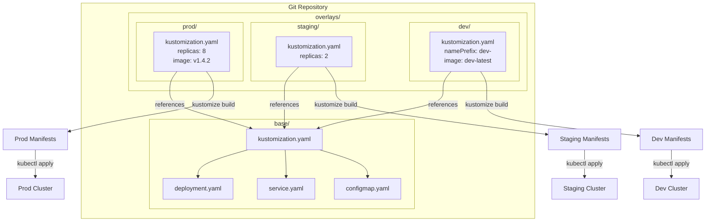

# Kustomize — A 2-Day Crash Course

> **In one sentence:** Kustomize lets you customize Kubernetes YAML without templates — you keep a clean base and layer environment-specific patches on top.

> Prerequisite: know Kubernetes — see `Kubernetes.md`. Kustomize *customizes* the manifests Kubernetes consumes.

---

## Part 0 — Why Kustomize exists

You have a Deployment, a Service, and a ConfigMap. They work in dev. Now you need staging and
prod. The naive approach: copy the YAML three times, tweak image tags, replica counts, and
resource limits in each copy. Two months later you have a bug in the base Deployment — you fix
it in one copy, forget the others, and prod silently diverges.

Helm solves this with templates, but templates turn clean YAML into a language of `{{ }}` noise.
For the common case — "same app, different environment-specific values" — that's more complexity
than the problem warrants. You're essentially writing a programming language to avoid copy-paste.

Kustomize takes a third path: keep the original YAML untouched as a **base**, then write small
surgical **patches** per environment that override only what differs. No templating engine. No
`{{ }}`. Just plain YAML that you layer.

**Mental model:** Kustomize is like CSS for Kubernetes manifests — you have a base (the HTML)
and overlays (the stylesheets) that patch specific values per environment without touching the
original. The base renders sensibly on its own; overlays only state what changes.



---

## Part 1 — The vocabulary

| Term | What it means |
|------|---------------|
| **Base** | A directory of Kubernetes YAML files plus a `kustomization.yaml` that registers them. Meant to be reusable across environments. |
| **Overlay** | A directory that points at a base and declares patches or additions for a specific environment (dev/staging/prod). |
| **Kustomization** | The `kustomization.yaml` file in any directory — the manifest that tells Kustomize what resources, patches, and generators to process. |
| **Strategic Merge Patch** | A YAML fragment that mirrors the structure of the target resource; Kustomize merges it in, keeping everything not mentioned. |
| **JSON Patch** | An RFC 6902 patch — explicit operations (`add`, `replace`, `remove`) on exact JSON paths. More precise, more verbose. |
| **ConfigMapGenerator** | Declares a ConfigMap from files or literals; Kustomize generates it and appends a content hash to the name, forcing pod restarts on config change. |
| **SecretGenerator** | Same as ConfigMapGenerator but produces a Secret. Never commit secret values — use env files excluded from git. |
| **Transformer** | A built-in transformation applied to all resources — `namePrefix`, `nameSuffix`, `commonLabels`, `commonAnnotations`, `images`. |
| **namePrefix / nameSuffix** | Prepends or appends a string to every resource name in a kustomization — useful for namespacing overlays (`prod-` prefix). |
| **commonLabels** | Adds labels to every resource and selector in the kustomization. Use with care — it modifies selectors on Deployments, which can break rolling updates if changed later. |
| **Component** | A reusable, independently versioned kustomization that can be included by multiple overlays — for cross-cutting concerns like monitoring sidecars or security policies. |

---

## DAY 1 — Base and overlays

### 1. Install Kustomize

Kustomize ships inside `kubectl` as of 1.14:

```bash
kubectl kustomize --help          # built-in, no install needed
kustomize version                 # standalone binary (brew install kustomize)
```

The standalone binary is always newer than the kubectl-bundled version. For production use,
install the standalone binary and pin the version in CI.

### 2. Create a base

```
app/
└── base/
    ├── kustomization.yaml
    ├── deployment.yaml
    ├── service.yaml
    └── configmap.yaml
```

`base/deployment.yaml`:
```yaml
apiVersion: apps/v1
kind: Deployment
metadata:
  name: api
spec:
  replicas: 1
  selector:
    matchLabels:
      app: api
  template:
    metadata:
      labels:
        app: api
    spec:
      containers:
        - name: api
          image: myorg/api:latest
          envFrom:
            - configMapRef:
                name: api-config
          resources:
            requests:
              cpu: "100m"
              memory: "128Mi"
            limits:
              cpu: "200m"
              memory: "256Mi"
```

`base/kustomization.yaml`:
```yaml
apiVersion: kustomize.config.k8s.io/v1beta1
kind: Kustomization

resources:
  - deployment.yaml
  - service.yaml
  - configmap.yaml
```

The base is intentionally minimal — lowest common denominator across all environments.

### 3. Create overlays

```
app/
├── base/
└── overlays/
    ├── dev/
    │   └── kustomization.yaml
    ├── staging/
    │   └── kustomization.yaml
    └── prod/
        ├── kustomization.yaml
        └── replicas-patch.yaml
```

`overlays/dev/kustomization.yaml`:
```yaml
apiVersion: kustomize.config.k8s.io/v1beta1
kind: Kustomization

resources:
  - ../../base

namePrefix: dev-

commonLabels:
  env: dev

images:
  - name: myorg/api
    newTag: dev-latest
```

`overlays/prod/kustomization.yaml`:
```yaml
apiVersion: kustomize.config.k8s.io/v1beta1
kind: Kustomization

resources:
  - ../../base

namePrefix: prod-

commonLabels:
  env: prod

images:
  - name: myorg/api
    newTag: "1.4.2"

patches:
  - path: replicas-patch.yaml
```

`overlays/prod/replicas-patch.yaml` (strategic merge patch):
```yaml
apiVersion: apps/v1
kind: Deployment
metadata:
  name: api
spec:
  replicas: 5
```

Only the fields you specify are changed. Every other field in the base Deployment is untouched.

### 4. Build and apply

```bash
# Preview — outputs rendered YAML to stdout, nothing applied
kustomize build overlays/dev

# Apply with standalone binary
kustomize build overlays/prod | kubectl apply -f -

# Apply with kubectl (equivalent)
kubectl apply -k overlays/prod

# Diff what would change against live cluster
kubectl diff -k overlays/prod
```

Always run `kubectl diff -k` before applying to production. It shows exactly what will change
in the live cluster — equivalent to a Terraform plan.

### 5. ConfigMapGenerator and SecretGenerator

Instead of writing a ConfigMap by hand, declare it in the kustomization:

```yaml
configMapGenerator:
  - name: api-config
    literals:
      - LOG_LEVEL=info
      - REGION=us-east-1
    envs:
      - config.env        # KEY=VALUE file, one per line

secretGenerator:
  - name: api-secrets
    envs:
      - secrets.env       # never commit this file
```

Kustomize appends a content hash to the generated name: `api-config-7d4k9m2f`. When the config
changes, the hash changes, the name changes, and Kubernetes treats it as a new ConfigMap — pods
with `configMapRef` referencing the old name get updated automatically on next rollout. This
gives you automatic restart-on-config-change without any extra tooling.

Add `secrets.env` to `.gitignore`. Use a secrets manager (Vault, AWS Secrets Manager,
Sealed Secrets) to populate it in CI — see `Git.md` for secret hygiene patterns.

**By end of Day 1 you can:**
- Structure a base + overlay directory layout
- Write a `kustomization.yaml` that references resources and patches
- Use `namePrefix` and `images` transformer to differentiate environments
- Build and apply an overlay with `kustomize build | kubectl apply -f -` or `kubectl apply -k`
- Generate ConfigMaps with hash-based automatic pod restarts

---

## DAY 2 — Make it real

### 1. Strategic merge patches vs JSON patches

Strategic merge patches are the default and the readable choice — you write a partial YAML
fragment that matches the structure of the resource, and Kustomize merges it in.

```yaml
# Strategic merge — change resource limits
apiVersion: apps/v1
kind: Deployment
metadata:
  name: api
spec:
  template:
    spec:
      containers:
        - name: api
          resources:
            limits:
              cpu: "2"
              memory: "2Gi"
```

The catch: strategic merge patches use Kubernetes merge keys (like container `name`) to locate
list items. This works well for standard resources. For CRDs with unusual list structures or when
you need to delete a field entirely, use a JSON patch instead.

```yaml
# JSON patch — remove a specific annotation and set replicas
patches:
  - target:
      kind: Deployment
      name: api
    patch: |-
      - op: replace
        path: /spec/replicas
        value: 10
      - op: remove
        path: /metadata/annotations/old-annotation
```

JSON patches are surgical and explicit. Use them when strategic merge behaves unexpectedly or
when you need `remove` semantics.

### 2. Components — reusable cross-cutting concerns

A Component is a kustomization fragment that can be included by multiple overlays. It is not a
base — it doesn't stand alone. Think of it as a mixin.

```
app/
├── base/
├── components/
│   ├── monitoring/
│   │   ├── kustomization.yaml   # kind: Component
│   │   └── servicemonitor.yaml
│   └── hpa/
│       ├── kustomization.yaml
│       └── hpa.yaml
└── overlays/
    └── prod/
        └── kustomization.yaml
```

`components/monitoring/kustomization.yaml`:
```yaml
apiVersion: kustomize.config.k8s.io/v1alpha1
kind: Component

resources:
  - servicemonitor.yaml
```

`overlays/prod/kustomization.yaml` — opt in to components:
```yaml
resources:
  - ../../base

components:
  - ../../components/monitoring
  - ../../components/hpa
```

Dev overlay omits the `components` block — no ServiceMonitor, no HPA in dev. The concern lives
in one place; each overlay decides whether to include it.

### 3. Image transformer — pin and promote images

The `images` transformer is the cleanest way to update image tags across environments without
patching:

```yaml
images:
  - name: myorg/api          # matches image name in any resource
    newName: 012345.dkr.ecr.us-east-1.amazonaws.com/api   # optional registry swap
    newTag: "1.4.2"
  - name: myorg/worker
    digest: sha256:abc123...  # pin by digest for immutable deploys
```

In CI, override the tag at build time without editing files:

```bash
kustomize edit set image myorg/api=myorg/api:${GIT_SHA}
kustomize build . | kubectl apply -f -
```

This keeps your overlay `kustomization.yaml` as the source of truth for the current deployed
version — commit the file after `kustomize edit set image` to record the deploy in git history.

### 4. Variable substitution — use sparingly

Kustomize supports `vars` to substitute values into fields that can't be patched directly. This
feature is intentionally limited and marked as a "last resort" in the Kustomize docs — most
things you think require vars can be solved with patches or generators instead.

```yaml
vars:
  - name: SERVICE_NAME
    objref:
      kind: Service
      name: api
      apiVersion: v1
    fieldref:
      fieldpath: metadata.name
```

Then reference it in a resource as `$(SERVICE_NAME)`. Avoid vars for environment-specific config
— that's what overlays are for. Vars solve a narrow problem: when one resource needs to reference
the name of another resource that might be transformed (e.g., prefixed).

### 5. Multi-base layouts

One overlay can reference multiple bases — useful for composing microservices or shared
infrastructure:

```yaml
resources:
  - ../../services/api
  - ../../services/worker
  - ../../infrastructure/redis
```

Each base is processed independently, then merged into a single set of resources. Name conflicts
across bases are an error — use `namePrefix` in each base or overlay to keep names unique.

### 6. Helm chart post-rendering with Kustomize

You can use Kustomize as a Helm post-renderer: Helm renders the chart, Kustomize patches the
output. This is useful when you use a third-party Helm chart but need to add labels, sidecars,
or annotations that the chart doesn't expose as values.

```bash
helm install cert-manager jetstack/cert-manager \
  --post-renderer ./kustomize-post-renderer.sh
```

`kustomize-post-renderer.sh`:
```bash
#!/bin/bash
cat > /tmp/helm-output.yaml
kustomize build /tmp/helm-kustomize-overlay
```

The overlay at `/tmp/helm-kustomize-overlay` reads the helm output as a resource and applies
patches. This keeps your patches in version control and avoids forking the chart — see `Helm.md`
for the full Helm post-rendering workflow.

### 7. Integrating with ArgoCD and Flux

Both ArgoCD and Flux have native Kustomize support — they detect `kustomization.yaml` and run
`kustomize build` automatically.

**ArgoCD** — in your Application manifest:
```yaml
apiVersion: argoproj.io/v1alpha1
kind: Application
spec:
  source:
    repoURL: https://github.com/myorg/k8s-config
    targetRevision: main
    path: overlays/prod          # point at the overlay directory
  destination:
    server: https://kubernetes.default.svc
    namespace: prod
```

ArgoCD runs `kustomize build overlays/prod` and syncs the output. It shows you a diff before
applying — the same guarantee as `kubectl diff -k` but surfaced in a UI.

**Flux** — uses a `Kustomization` CRD (different from Kustomize's own `kustomization.yaml`):
```yaml
apiVersion: kustomize.toolkit.fluxcd.io/v1
kind: Kustomization
metadata:
  name: prod-apps
spec:
  path: ./overlays/prod
  sourceRef:
    kind: GitRepository
    name: k8s-config
  interval: 5m
  prune: true                    # delete resources removed from git
```

The `prune: true` field is critical — without it, resources deleted from git persist in the
cluster. See `ArgoCD.md` for the full GitOps reconciliation workflow.

---

## Worked example — Three-environment deployment

Directory layout:
```
app/
├── base/
│   ├── kustomization.yaml
│   ├── deployment.yaml
│   └── service.yaml
└── overlays/
    ├── dev/
    │   ├── kustomization.yaml
    │   └── config.env
    ├── staging/
    │   ├── kustomization.yaml
    │   ├── config.env
    │   └── resources-patch.yaml
    └── prod/
        ├── kustomization.yaml
        ├── config.env
        ├── replicas-patch.yaml
        └── resources-patch.yaml
```

`base/kustomization.yaml`:
```yaml
apiVersion: kustomize.config.k8s.io/v1beta1
kind: Kustomization

resources:
  - deployment.yaml
  - service.yaml

configMapGenerator:
  - name: api-config
    envs:
      - config.env
```

`overlays/dev/kustomization.yaml`:
```yaml
apiVersion: kustomize.config.k8s.io/v1beta1
kind: Kustomization

resources:
  - ../../base

namePrefix: dev-

images:
  - name: myorg/api
    newTag: dev-latest

configMapGenerator:
  - name: api-config
    behavior: merge
    envs:
      - config.env       # LOG_LEVEL=debug, DB_HOST=dev-db.internal
```

`overlays/staging/resources-patch.yaml`:
```yaml
apiVersion: apps/v1
kind: Deployment
metadata:
  name: api
spec:
  replicas: 2
  template:
    spec:
      containers:
        - name: api
          resources:
            requests:
              cpu: "250m"
              memory: "256Mi"
            limits:
              cpu: "500m"
              memory: "512Mi"
```

`overlays/prod/replicas-patch.yaml`:
```yaml
apiVersion: apps/v1
kind: Deployment
metadata:
  name: api
spec:
  replicas: 8
```

`overlays/prod/resources-patch.yaml`:
```yaml
apiVersion: apps/v1
kind: Deployment
metadata:
  name: api
spec:
  template:
    spec:
      containers:
        - name: api
          resources:
            requests:
              cpu: "500m"
              memory: "512Mi"
            limits:
              cpu: "2"
              memory: "2Gi"
```

`overlays/prod/kustomization.yaml`:
```yaml
apiVersion: kustomize.config.k8s.io/v1beta1
kind: Kustomization

resources:
  - ../../base

namePrefix: prod-

images:
  - name: myorg/api
    newTag: "1.4.2"

patches:
  - path: replicas-patch.yaml
  - path: resources-patch.yaml

configMapGenerator:
  - name: api-config
    behavior: merge
    envs:
      - config.env       # LOG_LEVEL=warn, DB_HOST=prod-db.internal
```

Apply each environment:
```bash
kubectl apply -k overlays/dev
kubectl apply -k overlays/staging
kubectl apply -k overlays/prod
```

Result: three independent deployments — `dev-api`, `staging-api`, `prod-api` — each with
environment-appropriate replicas, resource limits, and config, all derived from one clean base.

---


## Terminal Demo

```terminal-demo
# kustomize@dev ~ %

$ kustomize version
v5.3.0

$ ls base/
deployment.yaml  kustomization.yaml  service.yaml

$ cat base/kustomization.yaml
apiVersion: kustomize.config.k8s.io/v1beta1
kind: Kustomization
resources:
  - deployment.yaml
  - service.yaml

$ ls overlays/production/
kustomization.yaml  replica-patch.yaml  resource-limits.yaml

$ kustomize build overlays/production/ | head -15
apiVersion: apps/v1
kind: Deployment
metadata:
  name: api
  namespace: production
  labels:
    env: production
spec:
  replicas: 5

$ kubectl apply -k overlays/production/
deployment.apps/api configured
service/api configured
configmap/api-config-m2k5d8h created

$ kubectl apply -k overlays/staging/ --dry-run=server
deployment.apps/api created (server dry run)
service/api created (server dry run)

$ kustomize build overlays/production/ | kubectl diff -f -
- replicas: 3
+ replicas: 5
```

---

## Common pitfalls

- **`commonLabels` modifies selectors.** Once a Deployment is created with a selector, you
  cannot change it — it's immutable. Adding or changing `commonLabels` after initial deploy
  requires deleting and recreating the Deployment. Use `commonLabels` only if you're certain
  the labels won't change, or use `commonAnnotations` instead for non-selector metadata.

- **Overlay `configMapGenerator` with `behavior: merge` requires the base to also use
  `configMapGenerator`.** If the base defines the ConfigMap as a raw resource (not a generator),
  the merge behavior won't work — Kustomize can only merge generated maps with generated maps.

- **`namePrefix` propagates to ConfigMapRef — sometimes.** When you use `configMapGenerator`,
  Kustomize automatically updates `configMapRef` entries in pods to match the prefixed and hashed
  name. For hand-written ConfigMaps referenced by name, you must also patch the reference.
  Prefer generators to avoid this mismatch.

- **`kustomize build` silently succeeds with empty output.** If your resource paths are wrong,
  Kustomize may produce valid but empty output. Always inspect `kustomize build` output before
  piping to `kubectl apply`.

- **Patches fail silently if the target doesn't match.** A strategic merge patch that references
  a resource name not in the build output is silently ignored — no error, no warning. The patch
  `metadata.name` must match the base resource name before `namePrefix` is applied, because
  patches run before transformers.

- **Committing generated secrets.** `secretGenerator` with literal values in `kustomization.yaml`
  means those values are in git. Always use `envs` pointing to a file that is `.gitignore`d, and
  populate that file from a secrets manager in CI — see `Git.md`.

- **`bases` key is deprecated in Kustomize v4+.** Use `resources` for everything — local paths,
  base directories, and remote references alike. The `bases` key still works but will be removed
  in a future version.

- **Remote base URLs break in air-gapped environments.** Kustomize supports GitHub URLs as bases
  (`github.com/myorg/repo//path`). These fail in CI without internet access. Prefer local
  relative paths or vendor the base into your repo.

---

## Quick command reference

```bash
# Build — render final YAML to stdout
kustomize build overlays/prod
kubectl kustomize overlays/prod          # kubectl-bundled version

# Apply
kubectl apply -k overlays/prod
kustomize build overlays/prod | kubectl apply -f -

# Diff against live cluster
kubectl diff -k overlays/prod

# Delete everything in an overlay
kubectl delete -k overlays/prod

# Edit image tag in current directory's kustomization.yaml
kustomize edit set image myorg/api=myorg/api:1.4.3

# Add a resource to current kustomization.yaml
kustomize edit add resource new-cronjob.yaml

# Set a namePrefix
kustomize edit set nameprefix staging-

# Dry-run validation against server (kubectl 1.26+)
kubectl apply -k overlays/prod --dry-run=server

# View the kustomization tree (debug overlay structure)
kustomize cfg tree overlays/prod
```

---

## Top 10 Interview Questions

<details>
<summary><strong>Q: What problem does Kustomize solve that copying YAML files per environment does not?</strong></summary>

Copying YAML creates drift — a fix in one copy is forgotten in others, and prod silently diverges from dev. Kustomize keeps a single base and layers environment-specific patches on top. Changes to the base propagate to every environment automatically, and the overlay diff is the only thing that varies.

</details>

<details>
<summary><strong>Q: How does Kustomize differ from Helm, and when would you choose one over the other?</strong></summary>

Helm uses Go templates to parameterise YAML, making it a packaging and distribution tool. Kustomize uses patch-based overlays with no templating language — the base YAML stays clean and readable. Choose Kustomize when you own the manifests and need per-environment customisation. Choose Helm when you consume third-party charts or need to distribute a packaged application to external users.

</details>

<details>
<summary><strong>Q: What is a strategic merge patch and how does it differ from a JSON patch?</strong></summary>

A strategic merge patch is a partial YAML fragment that mirrors the target resource structure — Kustomize merges it in, keeping everything not mentioned. A JSON patch (RFC 6902) uses explicit operations (`add`, `replace`, `remove`) on exact JSON paths. Strategic merge is readable and handles most cases, but JSON patches are needed for deleting fields or working with CRDs that have non-standard list merge keys.

</details>

<details>
<summary><strong>Q: Why does Kustomize append a hash suffix to ConfigMap and Secret names, and what problem does it solve?</strong></summary>

The hash suffix is derived from the content of the ConfigMap or Secret. When the content changes, the name changes, which forces Kubernetes to treat it as a new resource and triggers a rolling update of any pods referencing it. This solves the problem of config changes being invisible — without the hash, updating a ConfigMap does not restart pods that have already cached the old values.

</details>

<details>
<summary><strong>Q: What happens if you change `commonLabels` on an existing Deployment?</strong></summary>

Deployment selectors are immutable after creation. Changing `commonLabels` changes the selector, and Kubernetes rejects the update with an error. You must delete and recreate the Deployment. This is why you should set `commonLabels` once at initial deploy and not change them, or use `commonAnnotations` for metadata that might evolve.

</details>

<details>
<summary><strong>Q: How do you handle secrets safely with Kustomize?</strong></summary>

Use `secretGenerator` with `envs` pointing to a file that is listed in `.gitignore`. Never put literal secret values in `kustomization.yaml` — that puts them in git history. In CI, populate the env file from a secrets manager (Vault, AWS Secrets Manager, Sealed Secrets) before running `kustomize build`. The generated Secret gets a content hash suffix like ConfigMaps.

</details>

<details>
<summary><strong>Q: What is a Kustomize Component and when would you use one?</strong></summary>

A Component (`kind: Component`) is a reusable kustomization fragment that multiple overlays can opt into independently. Unlike a base, it does not stand alone — it is a mixin for cross-cutting concerns like monitoring sidecars, HPA, or security policies. Prod can include the monitoring component while dev omits it, keeping the concern defined in one place.

</details>

<details>
<summary><strong>Q: How does Kustomize integrate with GitOps tools like ArgoCD and Flux?</strong></summary>

Both ArgoCD and Flux have native Kustomize support. They detect `kustomization.yaml` in the target path and run `kustomize build` automatically. ArgoCD Application manifests point at an overlay directory; Flux uses a `Kustomization` CRD with a `path` field. The rendered output is diffed against the live cluster and reconciled. This makes Kustomize overlays the natural unit of deployment in a GitOps workflow.

</details>

<details>
<summary><strong>Q: How would you use Kustomize as a Helm post-renderer, and why would you want to?</strong></summary>

You pipe Helm's rendered output through `kustomize build` using `--post-renderer`. This lets you patch third-party Helm charts without forking them — adding labels, annotations, sidecars, or security policies that the chart does not expose as values. The patches live in version control alongside the Helm release, keeping customisations auditable.

</details>

<details>
<summary><strong>Q: What are common failure modes when using Kustomize in CI/CD pipelines?</strong></summary>

Patches that reference a resource name not in the build output are silently ignored — the pipeline succeeds but the change is missing. `kustomize build` can produce empty output if resource paths are wrong, and piping that to `kubectl apply` deletes nothing but also deploys nothing. Always validate output with `kubectl diff -k` before applying, and check that `kustomize build` output is non-empty in your pipeline script.

</details>

---


## Quick Quiz

Test your understanding with these rapid-fire questions (answers hidden):

<details>
<summary>1. What is the ONE core problem that Kustomize solves?</summary>
Re-read Part 0 — the mental model section. If you can explain the "why" in one sentence, you understand the foundation.
</details>

<details>
<summary>2. Name the 3 most important terms from the vocabulary section.</summary>
Review Part 1. These are the building blocks every conversation about Kustomize uses.
</details>

<details>
<summary>3. What is the first thing you would set up on Day 1?</summary>
Check the Day 1 section — the very first hands-on step that gets you a working result.
</details>

<details>
<summary>4. What is the most common production pitfall with Kustomize?</summary>
Review the Common Pitfalls section. The first item listed is typically the most frequently encountered.
</details>

<details>
<summary>5. How does Kustomize compare to its closest alternative?</summary>
Check the Comparison Matrix below — focus on the key differentiating row.
</details>


## Comparison Matrix

| Dimension | Kustomize | Helm | cdk8s |
|-----------|-----------|------|-------|
| **Primary use case** | Core strength of Kustomize | Core strength of Helm | Core strength of cdk8s |
| **Learning curve** | Moderate | Varies | Varies |
| **Community/ecosystem** | Active | Active | Growing |
| **Operational complexity** | Medium | Varies | Varies |
| **Best for** | See Part 0 | Different tradeoffs | Different tradeoffs |

> **How to read this matrix:** no tool wins on every dimension. Pick based on your specific constraints — team expertise, existing infrastructure, scale requirements, and compliance needs. The right choice is the one that fits your context, not the one with the most checkmarks.

## Next steps after Day 2

- `Helm.md` — when customization needs outgrow overlays, or when packaging for external consumers
- `Kubernetes.md` — deepen understanding of the resources Kustomize renders
- `ArgoCD.md` — the natural home for Kustomize in a GitOps workflow; ArgoCD Application manifests
  point directly at overlay directories
- `Git.md` — branching strategy for the k8s-config repo; treating git history as the audit log
  of every deploy

---

## Recommended learning resources

**YouTube channels & playlists:**
- [TechWorld with Nana — Kustomize Tutorial](https://www.youtube.com/@TechWorldwithNana) — structured walkthrough of bases, overlays, and patch strategies
- [That DevOps Guy (Marcel Dempers)](https://www.youtube.com/@introsession) — real-world Kustomize usage in GitOps pipelines with ArgoCD
- [Viktor Farcic (DevOps Toolkit)](https://www.youtube.com/@DevOpsToolkit) — Kustomize vs Helm head-to-head comparisons with honest tradeoff analysis
- [KodeKloud — Kustomize for Kubernetes](https://www.youtube.com/@KodeKloud) — hands-on labs covering generators, transformers, and multi-environment setups

**Official docs & blogs:**
- [Kustomize Official Documentation](https://kubectl.docs.kubernetes.io/references/kustomize/) — the reference for kustomization.yaml fields, built-in transformers, and plugins
- [Kubernetes SIG CLI — Kustomize GitHub](https://github.com/kubernetes-sigs/kustomize) — examples, release notes, and the canonical source for feature support

**The mantra:** One clean base, one small patch per environment — the diff tells the whole story.
