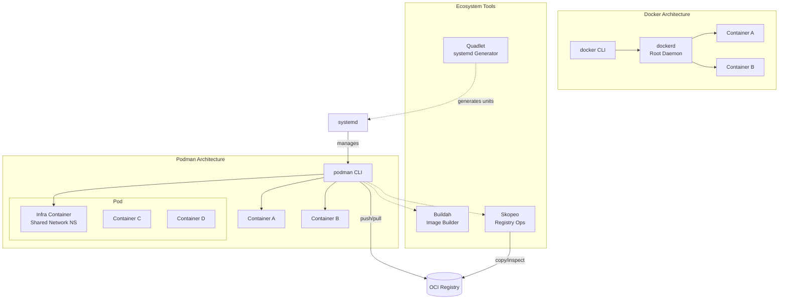

# Podman — A 2-Day Crash Course

> **In one sentence:** Podman is a daemonless, rootless container engine that's CLI-compatible with Docker — you can alias `docker=podman` and most things just work, but without the security baggage of a root daemon. Prerequisite: know containers — see `Docker.md`.

---

## Part 0 — Why Podman exists

Docker's architecture has a fundamental flaw for production and enterprise environments: it requires a root daemon (`dockerd`) running as root at all times. Every container you start is a child of that daemon. If the daemon crashes, all containers go with it. If the daemon has a vulnerability, attackers get root. On RHEL, Fedora, and most enterprise Linux distributions, running untrusted workloads under a root daemon is a non-starter for the security team.

Three problems converged:

1. **Security** — a root daemon is a privilege escalation vector. Any user who can talk to the Docker socket effectively has root on the machine.
2. **Enterprise/RHEL alignment** — Red Hat needed a container runtime that fits their security model. They built Podman (and Buildah and Skopeo) as drop-in replacements that don't require root.
3. **Kubernetes moved on** — Kubernetes deprecated Docker as a runtime in 1.20 and removed it in 1.24. It uses the Container Runtime Interface (CRI) — typically containerd or CRI-O. Docker is no longer the runtime underneath production clusters; OCI-compatible tools are.

Podman solves all three. It speaks the same CLI as Docker, produces OCI-compliant images, and runs containers as direct child processes of the calling user — no daemon in the middle.

**Mental model:** Podman is Docker without the middleman. Each `podman run` forks a container directly from your shell. No central daemon, no root requirement, no single point of failure. The process tree is your process tree — you can see it with `ps`, kill it with `kill`, and manage it with systemd like any other service.



---

## Part 1 — The vocabulary

| Term | What it means |
|------|---------------|
| **Pod** | One or more containers sharing a network namespace — the same concept as a Kubernetes pod. Podman supports pods natively; this is not a Docker feature. |
| **Container** | An OCI-compliant process running in an isolated namespace. Same concept as Docker. |
| **Rootless** | Running Podman (and its containers) as a non-root user. User namespaces map your UID to a range of sub-UIDs inside the container. This is the default and recommended mode. |
| **Daemonless** | No background daemon process. Each Podman command is a standalone binary invocation. Containers persist after the command exits because they're tracked via a state database, not a daemon. |
| **OCI** | Open Container Initiative — the standard that defines image format and runtime spec. Both Docker and Podman produce and consume OCI images; they're interchangeable at the image layer. |
| **Buildah** | A companion tool for building OCI images. Podman calls Buildah under the hood for `podman build`, but Buildah can also be used directly for scripted, fine-grained image construction without a Dockerfile. |
| **Skopeo** | A tool for inspecting and copying container images between registries — without pulling them to disk first. Think of it as `curl` for container registries. |
| **Quadlet** | A systemd generator that turns a container or pod description (a `.container` or `.pod` file) into a systemd unit. This is the modern, preferred way to run containers as system services — replacing `podman generate systemd`. |
| **systemd integration** | Podman containers can be managed as systemd services. You can start, stop, enable on boot, and check status of containers with `systemctl`. Quadlet makes this declarative. |
| **User namespace** | A Linux kernel feature that maps a range of UIDs/GIDs inside a container to unprivileged UIDs on the host. This is what makes rootless containers safe — root inside the container is not root on the host. |

---

## DAY 1 — Drop-in Docker replacement

### 1.1 — Install

On Fedora/RHEL/CentOS:

```bash
sudo dnf install -y podman
```

On Ubuntu/Debian (20.04+):

```bash
sudo apt-get install -y podman
```

On macOS (via Homebrew — runs in a VM):

```bash
brew install podman
podman machine init
podman machine start
```

Verify:

```bash
podman version
podman info
```

The alias that makes migration trivial:

```bash
alias docker=podman
```

Put it in your `~/.bashrc` or `~/.zshrc`. See `Bash.md` for alias management.

### 1.2 — Run your first container

```bash
# Pull and run interactively
podman run -it --rm alpine sh

# Run detached
podman run -d --name webserver -p 8080:80 nginx

# List running containers
podman ps

# List all containers including stopped
podman ps -a

# Stop and remove
podman stop webserver
podman rm webserver
```

The commands are identical to Docker. The difference you won't see: no daemon involved — the nginx process is a direct child of your shell session (or its sub-process group).

### 1.3 — Build images

**Using a Dockerfile (identical to Docker):**

```bash
# Build from current directory
podman build -t myapp:latest .

# Build with a specific file
podman build -f Dockerfile.prod -t myapp:prod .

# Build with build args
podman build --build-arg VERSION=1.2.3 -t myapp:1.2.3 .
```

Podman calls Buildah internally for builds. The Dockerfile syntax is fully compatible — multi-stage builds, ARG, ENV, COPY, RUN — all work identically.

**Tag and push:**

```bash
podman tag myapp:latest registry.example.com/myapp:latest
podman push registry.example.com/myapp:latest

# Login to a registry first
podman login registry.example.com
```

### 1.4 — Volumes

```bash
# Named volume
podman volume create mydata
podman run -v mydata:/data alpine touch /data/file.txt

# Bind mount (host path)
podman run -v /host/path:/container/path:Z nginx
```

The `:Z` flag is important on SELinux-enabled systems (RHEL, Fedora) — it relabels the volume for the container's SELinux context. Without it, SELinux denies access. Use `:z` (lowercase) for shared access across multiple containers, `:Z` (uppercase) for exclusive access.

```bash
# Inspect volumes
podman volume ls
podman volume inspect mydata
podman volume rm mydata
```

### 1.5 — Networking

```bash
# Default bridge network (like Docker's bridge)
podman run -d -p 8080:80 nginx

# Create a custom network
podman network create mynet

# Run containers on the same network
podman run -d --name app --network mynet myapp:latest
podman run -d --name db --network mynet postgres:15

# Containers on the same network resolve each other by name
# Inside 'app', you can reach postgres at hostname 'db'

# Inspect networks
podman network ls
podman network inspect mynet
```

### 1.6 — Pods

This is where Podman diverges from Docker. Pods are a first-class concept:

```bash
# Create a pod with a port mapping
podman pod create --name webapp -p 8080:80

# Add containers to the pod
podman run -d --pod webapp --name frontend nginx
podman run -d --pod webapp --name backend myapp:latest

# Containers in a pod share the network namespace
# 'backend' can reach 'frontend' on localhost

# Manage the pod as a unit
podman pod start webapp
podman pod stop webapp
podman pod rm webapp

# List pods
podman pod ls
```

The pod pattern maps directly to Kubernetes — this is intentional. A pod you test locally with Podman can be exported as Kubernetes YAML (covered in Day 2).

### 1.7 — Docker vs Podman side-by-side

| Operation | Docker | Podman |
|-----------|--------|--------|
| Run container | `docker run` | `podman run` |
| Build image | `docker build` | `podman build` |
| List containers | `docker ps` | `podman ps` |
| Pull image | `docker pull` | `podman pull` |
| Push image | `docker push` | `podman push` |
| Exec into container | `docker exec` | `podman exec` |
| View logs | `docker logs` | `podman logs` |
| Inspect | `docker inspect` | `podman inspect` |
| Volume create | `docker volume create` | `podman volume create` |
| Network create | `docker network create` | `podman network create` |
| Compose | `docker compose` | `podman-compose` or `podman compose` |
| Daemon socket | `/var/run/docker.sock` | `/run/user/UID/podman/podman.sock` |
| Root required | Yes (for daemon) | No (rootless by default) |
| Pod support | No | Yes |
| systemd native | No | Yes (Quadlet) |

**By end of Day 1 you can:**
- Install Podman and alias it to `docker`
- Run, build, push, and pull containers with identical Docker syntax
- Use volumes and custom networks
- Create and manage pods
- Understand the key CLI differences and when they matter

---

## DAY 2 — Make it real

### 2.1 — Rootless mode deep-dive

Rootless is the default. When you run `podman run` as a non-root user, Podman uses user namespaces to map UIDs:

```bash
# See your sub-UID mappings
cat /etc/subuid
# Output: yourusername:100000:65536

# This means inside containers, UIDs 0-65535 map to host UIDs 100000-165535
# Root inside the container (UID 0) = UID 100000 on the host

# Check what user a container runs as
podman run --rm alpine id

# Run as a specific user
podman run --rm --user 1000:1000 alpine id
```

The security implication: even if a process escapes the container, it's running as an unprivileged UID on the host. Compare this to Docker where a root escape from a container means root on the host.

Sub-UID ranges must be configured for your user:

```bash
# If not already configured
sudo usermod --add-subuids 100000-165535 yourusername
sudo usermod --add-subgids 100000-165535 yourusername

# Apply without logout
podman system migrate
```

Rootless networking uses slirp4netns or pasta (newer, faster):

```bash
# Check which networking backend is in use
podman info | grep -i network
```

### 2.2 — systemd integration with Quadlet

Quadlet is the modern way to run containers as systemd services. You write a `.container` file, and systemd generates the unit automatically.

Create `/etc/containers/systemd/webserver.container` (system-wide) or `~/.config/containers/systemd/webserver.container` (user-level):

```ini
[Unit]
Description=Nginx web server container
After=network-online.target

[Container]
Image=docker.io/library/nginx:latest
PublishPort=8080:80
Volume=/srv/www:/usr/share/nginx/html:Z
Environment=NGINX_HOST=example.com

[Service]
Restart=always
TimeoutStartSec=30

[Install]
WantedBy=default.target
```

Activate it:

```bash
# Reload systemd to pick up new units
systemctl --user daemon-reload

# Start the container
systemctl --user start webserver

# Enable on boot
systemctl --user enable webserver

# Check status
systemctl --user status webserver

# View logs
journalctl --user -u webserver -f
```

For system-level services (not user-level), drop the `--user` flag and use `sudo systemctl`.

Quadlet handles restarts, dependencies, and boot ordering — this replaces writing raw systemd unit files that call `podman run`.

### 2.3 — Generating Kubernetes YAML

One of Podman's most useful features: export a running pod or container as Kubernetes-compatible YAML.

```bash
# Create and populate a pod
podman pod create --name myapp -p 8080:80
podman run -d --pod myapp --name frontend nginx
podman run -d --pod myapp --name backend mybackend:latest

# Generate Kubernetes YAML
podman generate kube myapp > myapp.yaml

# Inspect the output
cat myapp.yaml
```

The generated YAML is valid Kubernetes Pod spec. You can apply it to a cluster:

```bash
kubectl apply -f myapp.yaml
```

Going the other way — running Kubernetes YAML locally with Podman:

```bash
podman kube play myapp.yaml
```

This is an excellent workflow for testing Kubernetes manifests locally before pushing to a cluster. See `Kubernetes.md` for cluster-side details.

### 2.4 — Skopeo for registry operations

Skopeo operates on container images without pulling them to local storage. It's fast, lightweight, and useful for CI/CD pipelines.

```bash
# Install
sudo dnf install -y skopeo   # RHEL/Fedora
sudo apt-get install -y skopeo  # Ubuntu

# Inspect a remote image (no pull required)
skopeo inspect docker://docker.io/library/nginx:latest

# Copy between registries (no local storage involved)
skopeo copy docker://source-registry.io/image:tag \
             docker://dest-registry.io/image:tag

# Copy from a registry to a local tar archive
skopeo copy docker://nginx:latest oci-archive:/tmp/nginx.tar

# Copy from local tar to a registry
skopeo copy oci-archive:/tmp/nginx.tar docker://registry.example.com/nginx:latest

# Delete an image from a registry
skopeo delete docker://registry.example.com/myimage:old

# Check if an image exists in a registry
skopeo inspect docker://registry.example.com/myimage:tag > /dev/null && echo "exists"
```

Skopeo is especially useful in CI/CD for promoting images between registries without the overhead of a full pull-push cycle.

### 2.5 — Buildah for advanced image builds

Buildah gives you programmatic control over image construction — no Dockerfile required:

```bash
# Install
sudo dnf install -y buildah

# Build from a Dockerfile (same as podman build)
buildah bud -t myapp:latest .

# Build programmatically (scripted approach)
container=$(buildah from alpine)

# Run commands inside the build container
buildah run $container -- apk add --no-cache curl

# Copy files in
buildah copy $container ./app /usr/local/bin/app

# Set metadata
buildah config --cmd "/usr/local/bin/app" $container
buildah config --port 8080 $container
buildah config --label version=1.0 $container

# Commit to an image
buildah commit $container myapp:latest

# Cleanup
buildah rm $container

# Push the image
buildah push myapp:latest docker://registry.example.com/myapp:latest
```

The scripted approach is valuable when you need conditional logic, loops, or dynamic content during image builds that Dockerfile syntax handles awkwardly.

### 2.6 — podman-compose

For Docker Compose compatibility:

```bash
# Install via pip
pip3 install podman-compose

# Use an existing docker-compose.yml
podman-compose up -d
podman-compose down
podman-compose logs -f
```

Alternatively, newer versions of Podman ship a built-in compose command:

```bash
podman compose up -d
```

⚠️ Compose compatibility is good but not perfect. Features like Docker-specific network extensions, Swarm-mode configs, and some networking edge cases may behave differently. Test your compose files explicitly.

### 2.7 — Podman in CI/CD

Podman is well-suited for CI/CD because it doesn't require a privileged daemon. In GitHub Actions:

```yaml
jobs:
  build:
    runs-on: ubuntu-latest
    steps:
      - uses: actions/checkout@v4

      - name: Install Podman
        run: |
          sudo apt-get update
          sudo apt-get install -y podman

      - name: Build image
        run: podman build -t myapp:${{ github.sha }} .

      - name: Run tests
        run: podman run --rm myapp:${{ github.sha }} npm test

      - name: Push to registry
        run: |
          podman login -u ${{ secrets.REGISTRY_USER }} \
                       -p ${{ secrets.REGISTRY_TOKEN }} \
                       ghcr.io
          podman push myapp:${{ github.sha }} \
                      ghcr.io/${{ github.repository }}/myapp:${{ github.sha }}
```

On RHEL/Fedora-based CI runners, Podman is typically pre-installed. No daemon startup step needed — it just works.

### 2.8 — Security advantages

The security model is worth understanding explicitly.

**No root daemon attack surface.** Docker's `/var/run/docker.sock` is effectively root access — any process that can write to it can escalate to root. Podman has no equivalent global socket in the default configuration.

**User namespaces.** Root inside a rootless container maps to an unprivileged UID on the host. Even a full container escape gives an attacker an unprivileged account.

**Seccomp and capabilities.** Podman applies the same seccomp profiles and Linux capabilities restrictions as Docker by default. You can inspect them:

```bash
podman inspect mycontainer | grep -A 20 SecurityOpt
```

**SELinux integration.** On RHEL/Fedora, Podman works natively with SELinux. The `:Z` volume flag is part of this — containers run in their own SELinux context, preventing cross-container and host access.

**No privilege escalation via socket.** The per-user socket (`/run/user/UID/podman/podman.sock`) is only accessible to that user. Exposing it to other users requires explicit action.

```bash
# Check the socket location for your user
podman info | grep sock
```

---

## Worked example — Rootless multi-container pod with systemd

Deploy a web application (nginx frontend + a backend API) as a pod, manage it via systemd using Quadlet.

**Step 1 — Create the pod and containers locally to test**

```bash
# Create the pod
podman pod create --name webapp -p 8080:80

# Backend API
podman run -d \
  --pod webapp \
  --name backend \
  -e DATABASE_URL=sqlite:///data/app.db \
  -v webapp-data:/data:Z \
  myapp-backend:latest

# Frontend (nginx reverse-proxying to backend)
podman run -d \
  --pod webapp \
  --name frontend \
  -v ./nginx.conf:/etc/nginx/conf.d/default.conf:Z \
  nginx:latest

# Verify
podman pod ps
podman ps --pod
curl http://localhost:8080/health
```

**Step 2 — Generate Kubernetes YAML (optional, for cluster promotion)**

```bash
podman generate kube webapp > webapp-pod.yaml
```

**Step 3 — Write Quadlet files for systemd management**

Create `~/.config/containers/systemd/webapp.pod`:

```ini
[Unit]
Description=Web application pod

[Pod]
PublishPort=8080:80
```

Create `~/.config/containers/systemd/webapp-backend.container`:

```ini
[Unit]
Description=Web app backend
After=webapp-pod.service

[Container]
Image=myapp-backend:latest
Pod=webapp.pod
Volume=webapp-data:/data:Z
Environment=DATABASE_URL=sqlite:///data/app.db

[Service]
Restart=on-failure

[Install]
WantedBy=default.target
```

Create `~/.config/containers/systemd/webapp-frontend.container`:

```ini
[Unit]
Description=Web app nginx frontend
After=webapp-backend.service

[Container]
Image=nginx:latest
Pod=webapp.pod
Volume=%h/nginx.conf:/etc/nginx/conf.d/default.conf:Z

[Service]
Restart=on-failure

[Install]
WantedBy=default.target
```

**Step 4 — Activate via systemd**

```bash
# Pick up the new units
systemctl --user daemon-reload

# Start everything (systemd resolves the dependency chain automatically)
systemctl --user start webapp-frontend

# Enable on login/boot
systemctl --user enable webapp-frontend

# Enable lingering so user services start without an active login
loginctl enable-linger $USER

# Monitor
systemctl --user status webapp-frontend
journalctl --user -u webapp-frontend -f
```

`%h` in the Quadlet file expands to the user's home directory. The pod and all its containers are now managed as systemd units — restart policy, dependency ordering, and journald logging are all handled for you.

---

## Common pitfalls

- **Rootless networking port limits.** Non-root users cannot bind to ports below 1024 by default. Use ports 1024+ in your container mapping (e.g., `8080:80`) or lower the limit: `sudo sysctl -w net.ipv4.ip_unprivileged_port_start=80`. For a permanent change, add it to `/etc/sysctl.d/`. See `Linux.md` for sysctl management.

- **Volume permission mismatches with user namespaces.** When you bind-mount a host directory into a rootless container, the UID mapping can cause "permission denied" errors. The container's root (UID 0) maps to your sub-UID range on the host. Fix by chowning the host directory inside the user namespace: `podman unshare chown 0:0 /host/path` — this runs the chown as Podman sees it, so the mapping is correct.

- **The `:Z` flag is not optional on SELinux hosts.** Forgetting `:Z` on bind mounts causes cryptic permission errors on RHEL/Fedora. Docker doesn't enforce this — it's a common trap when migrating. Always use `:Z` for exclusive mounts, `:z` for shared mounts across multiple containers.

- **docker-compose compatibility limits.** `podman-compose` handles the common cases (services, volumes, networks, environment variables, depends_on) but diverges on Docker-specific network drivers, `deploy` (Swarm-mode) keys, some `build` options, and `links` (deprecated anyway). Test each compose file explicitly — don't assume it works because it worked with Docker.

- **Image layer caching is per-user.** Rootless Podman stores images in `~/.local/share/containers/storage/`. If you switch between root Podman and rootless Podman on the same machine, image caches are completely separate — you'll pull twice. Use `podman system df` to inspect storage usage per user.

- **`podman generate systemd` is deprecated.** Old documentation suggests it; current best practice is Quadlet `.container` files. The old command still works but won't receive new features.

- **Socket path differs from Docker.** Tools hardcoded to `/var/run/docker.sock` (Testcontainers, some IDE plugins) won't find Podman's socket automatically. Set the environment variable: `export DOCKER_HOST=unix:///run/user/$(id -u)/podman/podman.sock`.

---

## Quick command reference

**Containers:**

```bash
podman run -it --rm alpine sh               # Interactive, auto-remove
podman run -d --name app -p 8080:80 nginx   # Detached with name and port
podman ps                                   # Running containers
podman ps -a                                # All containers
podman stop app && podman rm app            # Stop and remove
podman exec -it app sh                      # Shell into running container
podman logs -f app                          # Follow logs
podman inspect app                          # Full JSON metadata
podman stats                                # Live resource usage
```

**Images:**

```bash
podman pull nginx:latest                    # Pull from registry
podman build -t myapp:latest .              # Build from Dockerfile
podman images                               # List local images
podman rmi myapp:latest                     # Remove image
podman tag myapp:latest reg.io/myapp:latest # Tag
podman push reg.io/myapp:latest             # Push
podman image prune                          # Remove dangling images
podman system prune                         # Full cleanup
```

**Pods:**

```bash
podman pod create --name mypod -p 8080:80   # Create pod
podman run -d --pod mypod nginx             # Add container to pod
podman pod ls                               # List pods
podman pod start mypod                      # Start pod
podman pod stop mypod                       # Stop pod
podman pod rm mypod                         # Remove pod (and containers)
podman generate kube mypod > mypod.yaml    # Export as Kubernetes YAML
podman kube play mypod.yaml                # Run Kubernetes YAML locally
```

**Volumes and networks:**

```bash
podman volume create mydata
podman volume ls && podman volume inspect mydata
podman volume rm mydata
podman network create mynet
podman network ls && podman network inspect mynet
podman network rm mynet
```

**System:**

```bash
podman system info                          # Runtime info
podman system df                            # Disk usage
podman system prune -a                      # Remove all unused resources
podman machine init && podman machine start # macOS VM setup
podman machine ls                           # List machines
```

**Docker vs Podman — quick comparison:**

```
Docker command                              Podman equivalent
────────────────────────────────────────────────────────────────────
docker run ...                              podman run ...
docker build ...                            podman build ...
docker ps / docker ps -a                    podman ps / podman ps -a
docker pull / docker push                   podman pull / podman push
docker exec ...                             podman exec ...
docker logs ...                             podman logs ...
docker inspect ...                          podman inspect ...
docker volume create ...                    podman volume create ...
docker network create ...                   podman network create ...
docker compose up                           podman-compose up / podman compose up
docker run -v /run/docker.sock (socket)     No equivalent — no daemon socket
(no equivalent)                             podman pod create / podman pod ...
(no equivalent)                             podman generate kube
(no equivalent)                             podman kube play
(no equivalent)                             Quadlet (.container files)
```

---


## Top 10 Interview Questions

<details>
<summary><strong>Q: What is Podman and how does it differ from Docker?</strong></summary>

Podman is a daemonless, rootless container engine that is CLI-compatible with Docker. The key difference: Docker runs a persistent daemon (dockerd) as root, which is a security concern — if the daemon is compromised, the attacker has root access. Podman runs containers as the invoking user with no daemon, reducing the attack surface. Commands are identical (podman run = docker run), making migration straightforward. Podman also natively supports pods (groups of containers sharing namespaces), which Docker does not.

</details>

<details>
<summary><strong>Q: What does 'rootless containers' mean and why is it a security advantage?</strong></summary>

Rootless means the container engine and the containers it runs operate entirely within a non-root user's namespace — no privilege escalation to root at any point. This means: a container escape gives the attacker only the unprivileged user's permissions (not root), compliance requirements around running services as non-root are satisfied, and multiple users on the same host can run isolated containers without interfering. The tradeoff: some operations that require root (binding to ports < 1024, certain network configurations) need workarounds.

</details>

<details>
<summary><strong>Q: How does Podman handle networking without a daemon?</strong></summary>

Podman uses CNI plugins (or Netavark in newer versions) for container networking. In rootless mode, it uses slirp4netns (userspace networking) or pasta for network namespace setup — slower than root-mode networking but requires no privileges. Podman supports bridge networks, host networking, and macvlan. For pod networking, containers in the same pod share a network namespace (like Kubernetes pods). Port forwarding works the same as Docker (-p 8080:80), though rootless mode requires ports > 1024 or additional configuration.

</details>

<details>
<summary><strong>Q: How do pods work in Podman and how do they relate to Kubernetes pods?</strong></summary>

A Podman pod is a group of containers sharing the same network namespace, IPC namespace, and optionally PID namespace — exactly like a Kubernetes pod. Each pod gets an infra container (like Kubernetes' pause container) that holds the namespaces. This allows you to develop multi-container applications locally that mirror the Kubernetes pod model. Podman can generate Kubernetes YAML from a running pod (podman generate kube) and create pods from Kubernetes YAML (podman play kube), bridging local development and cluster deployment.

</details>

<details>
<summary><strong>Q: How do you migrate from Docker to Podman?</strong></summary>

For most users, it is a drop-in replacement: alias docker=podman. Dockerfiles work unchanged (podman build). Docker Compose files work with podman-compose or podman compose (built-in in newer versions). Key differences to address: no daemon means no background process (use systemd to manage long-running containers), Docker volumes map to Podman volumes (data is separate — migrate with export/import), and some Docker-specific socket dependencies (e.g., /var/run/docker.sock) need reconfiguration. Test your CI/CD pipelines after switching.

</details>

<details>
<summary><strong>Q: How do you run Podman containers as systemd services?</strong></summary>

Use podman generate systemd to create a systemd unit file from a running container. This gives you auto-restart, boot-time startup, and standard systemd management (systemctl start/stop/status). For rootless containers, install the unit file in ~/.config/systemd/user/ and enable lingering (loginctl enable-linger). For root containers, install in /etc/systemd/system/. Quadlet (new in Podman 4.4+) provides a simpler declarative format — write a .container file and systemd generates the unit automatically.

</details>

<details>
<summary><strong>Q: What is Buildah and how does it relate to Podman?</strong></summary>

Buildah is a companion tool for building OCI container images. Podman uses Buildah internally for podman build. Buildah's advantage: it can build images without a Dockerfile using shell scripts (buildah from, buildah run, buildah commit), allowing fine-grained control over each layer. It also builds rootlessly and does not require a daemon. Use Podman for running containers and Buildah when you need advanced image building capabilities beyond what Dockerfiles provide.

</details>

<details>
<summary><strong>Q: How does Podman handle container storage and volumes?</strong></summary>

Podman uses containers/storage for image and container layer management, supporting overlayfs (default), vfs, and other drivers. Volumes work the same as Docker: podman volume create, -v mounts in containers. In rootless mode, storage is in ~/.local/share/containers/. Key difference from Docker: Podman uses a different default storage location, so Docker images are not shared — you need to pull images separately (or use podman pull from Docker daemon with --root).

</details>

<details>
<summary><strong>Q: What are the limitations of rootless Podman compared to rootful?</strong></summary>

Rootless limitations: cannot bind to ports below 1024 without net.ipv4.ip_unprivileged_port_start, slower networking (slirp4netns overhead), some volume mount permission issues (container UID may not match host file ownership — use --userns=keep-id), limited cgroup control (cgroups v2 required for resource limits), and no access to host devices without configuration. Most of these have workarounds. For development, rootless is usually fine. For production servers, evaluate whether the limitations affect your specific use case.

</details>

<details>
<summary><strong>Q: How does Podman compare to containerd and CRI-O for Kubernetes?</strong></summary>

Podman is a developer-facing tool for building and running containers locally — it is not a Kubernetes container runtime. CRI-O and containerd are Kubernetes container runtimes that implement the CRI (Container Runtime Interface) for kubelet. Podman complements Kubernetes: develop locally with Podman, deploy to clusters running CRI-O or containerd. Podman can generate Kubernetes YAML and play Kubernetes manifests, bridging the gap. In BFSI environments, CRI-O is often preferred for its minimal, security-focused design.

</details>

---


## Quick Quiz

Test your understanding with these rapid-fire questions (answers hidden):

<details>
<summary>1. What is the ONE core problem that Podman solves?</summary>
Re-read Part 0 — the mental model section. If you can explain the "why" in one sentence, you understand the foundation.
</details>

<details>
<summary>2. Name the 3 most important terms from the vocabulary section.</summary>
Review Part 1. These are the building blocks every conversation about Podman uses.
</details>

<details>
<summary>3. What is the first thing you would set up on Day 1?</summary>
Check the Day 1 section — the very first hands-on step that gets you a working result.
</details>

<details>
<summary>4. What is the most common production pitfall with Podman?</summary>
Review the Common Pitfalls section. The first item listed is typically the most frequently encountered.
</details>

<details>
<summary>5. How does Podman compare to its closest alternative?</summary>
Check the Comparison Matrix below — focus on the key differentiating row.
</details>


## Comparison Matrix

| Dimension | Podman | Docker | containerd |
|-----------|--------|--------|------------|
| **Primary use case** | Core strength of Podman | Core strength of Docker | Core strength of containerd |
| **Learning curve** | Moderate | Varies | Varies |
| **Community/ecosystem** | Active | Active | Growing |
| **Operational complexity** | Medium | Varies | Varies |
| **Best for** | See Part 0 | Different tradeoffs | Different tradeoffs |

> **How to read this matrix:** no tool wins on every dimension. Pick based on your specific constraints — team expertise, existing infrastructure, scale requirements, and compliance needs. The right choice is the one that fits your context, not the one with the most checkmarks.

## Next steps after Day 2

- **`Docker.md`** — solidify your container fundamentals; Podman is only as useful as your Docker knowledge base
- **`Kubernetes.md`** — the natural next step: `podman generate kube` output goes here; understand pods, deployments, and services at the cluster level
- **`Linux.md`** — user namespaces, SELinux, cgroups, systemd — the kernel features Podman sits on top of
- **Buildah deep-dive** — scripted image builds, multi-stage pipelines, building without root and without a Dockerfile; essential for custom CI/CD image workflows
- **Skopeo** — registry operations at scale: mirroring, promotion pipelines, image signing verification, airgapped environments

---

## Recommended learning resources

**YouTube channels & playlists:**
- [TechWorld with Nana — Podman vs Docker](https://www.youtube.com/@TechWorldwithNana) — clear comparison explaining when and why to choose Podman over Docker
- [Bret Fisher — Rootless Containers](https://www.youtube.com/@BretFisher) — container security best practices that apply directly to Podman's rootless model
- [CNCF — Container Runtime Talks](https://www.youtube.com/@cncf) — KubeCon sessions on OCI runtimes, rootless containers, and Podman in enterprise environments
- [That DevOps Guy (Marcel Dempers)](https://www.youtube.com/@introsession) — practical Podman usage in CI/CD, including Buildah and Skopeo integration

**Official docs & blogs:**
- [Podman Official Documentation](https://podman.io/docs) — the reference for CLI commands, rootless setup, and pod management
- [Red Hat — Container Tools Guide](https://access.redhat.com/documentation/en-us/red_hat_enterprise_linux/9/html/building_running_and_managing_containers/) — enterprise perspective on Podman, Buildah, and Skopeo workflows

**The mantra:** If it runs as root when it doesn't need to, you've already lost — Podman gives you the containers without the gamble.
