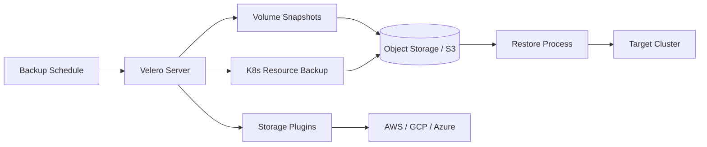

# Velero — A 2-Day Crash Course

Velero is a backup and restore tool for Kubernetes — cluster state, persistent volumes, and disaster recovery in one CLI.

**Prerequisite:** `Kubernetes.md` — you need a working understanding of namespaces, PVCs, and CRDs before this makes sense.




---

## Part 0 — Why Velero Exists

Your Kubernetes clusters are cattle until they're not.

You treat them as disposable right up until the moment a junior engineer runs `kubectl delete namespace production` at 2 AM, or your cloud provider's etcd cluster silently corrupts itself, or you need to move a stateful workload from GKE to EKS without losing three weeks of customer data.

At that point, "cattle" stops being a useful mental model, and you need a backup.

Velero solves three distinct problems:

**Disaster recovery** — something goes wrong and you need to restore your cluster state to a known-good point. This includes both Kubernetes object state (Deployments, ConfigMaps, Secrets, RBAC, CRDs) and the actual data inside persistent volumes.

**Cluster migration** — you want to move workloads from one cluster to another. Velero lets you take a backup on the source cluster and restore it on the destination cluster, even across cloud providers.

**Scheduled backups** — you want automated, regular backups without building your own tooling. Velero's Schedule resource handles this natively.

Without Velero (or something equivalent), your backup strategy is probably "hope etcd doesn't break and remember to document things." That is not a strategy.

---

## Vocabulary

**Backup** — a Kubernetes CRD (`kind: Backup`) that captures a point-in-time snapshot of selected cluster resources. It writes Kubernetes object manifests plus optional volume data to object storage.

**Restore** — a CRD (`kind: Restore`) that reads from a Backup and recreates the captured resources in the cluster. You can restore to the same cluster or a different one.

**Schedule** — a CRD (`kind: Schedule`) that creates Backups on a cron expression. Think of it as a cron job that triggers Velero backups.

**BackupStorageLocation (BSL)** — defines where Velero writes backup data. Typically an S3-compatible bucket or GCS bucket. You can have multiple BSLs and mark one as default.

**VolumeSnapshotLocation (VSL)** — defines where volume snapshots are stored when using cloud provider snapshots (as opposed to file-level backup). Usually points to an AWS region or GCP project.

**Restic / Kopia** — file-level backup methods that work by mounting volumes and copying files directly into object storage. They bypass the cloud snapshot API entirely, which means they work on any storage provider — including on-prem. Velero originally used Restic; newer versions default to Kopia. Use these when CSI snapshots are not available or when you need cross-cloud portability.

**Plugin** — Velero's storage and snapshot integrations are provided as plugins (separate container images). AWS, GCP, Azure, and CSI all have official plugins. You install them at deploy time.

**TTL (Time-To-Live)** — how long a Backup is retained before Velero deletes it. Set this explicitly or your bucket fills up. Default is 720 hours (30 days).

**Hook** — a command Velero runs inside a container before or after a backup. Pre-hooks let you flush application state (e.g., tell your database to checkpoint). Post-hooks let you resume normal operation.

---

## DAY 1 — Install, Configure, and Your First Backup/Restore

### Install the Velero CLI

```bash
# macOS
brew install velero

# Linux — check latest release at github.com/vmware-tanzu/velero/releases
curl -fsSL https://github.com/vmware-tanzu/velero/releases/download/v1.13.0/velero-v1.13.0-linux-amd64.tar.gz \
  | tar -xz --strip-components=1 -C /usr/local/bin velero-v1.13.0-linux-amd64/velero

velero version
```

### Configure an S3 Backend (AWS)

Create a dedicated S3 bucket and IAM credentials first. Velero needs `s3:GetObject`, `s3:PutObject`, `s3:DeleteObject`, `s3:ListBucket`, and snapshot permissions.

Store credentials in a file:

```
# credentials-velero
[default]
aws_access_key_id=<YOUR_KEY_ID>
aws_secret_access_key=<YOUR_SECRET>
```

Install Velero into your cluster:

```bash
velero install \
  --provider aws \
  --plugins velero/velero-plugin-for-aws:v1.9.0 \
  --bucket my-velero-backups \
  --backup-location-config region=us-east-1 \
  --snapshot-location-config region=us-east-1 \
  --secret-file ./credentials-velero
```

This creates a `velero` namespace, installs the CRDs, and starts the Velero server pod.

### Configure a GCS Backend (GCP)

```bash
velero install \
  --provider gcp \
  --plugins velero/velero-plugin-for-gcp:v1.9.0 \
  --bucket my-velero-gcs-bucket \
  --secret-file ./gcp-credentials.json
```

Verify the BSL is available:

```bash
velero backup-location get
# STATUS should be "Available"
```

### Backup a Namespace

```bash
# Backup everything in the "staging" namespace
velero backup create staging-backup-20260531 \
  --include-namespaces staging \
  --ttl 168h

# Check status
velero backup get
velero backup describe staging-backup-20260531
velero backup logs staging-backup-20260531
```

The backup transitions through phases: `New` → `InProgress` → `Completed` (or `Failed` / `PartiallyFailed`).

### Restore a Namespace

```bash
# Restore into the same cluster (namespace must not exist, or use --existing-resource-policy)
velero restore create --from-backup staging-backup-20260531

# Watch restore status
velero restore get
velero restore describe <restore-name>
```

If the namespace already exists, add `--existing-resource-policy update` to overwrite existing resources. Without it, Velero skips resources that already exist.

### Schedule Automatic Backups

```bash
# Backup the entire cluster daily at 1 AM, retain 7 days
velero schedule create daily-cluster-backup \
  --schedule "0 1 * * *" \
  --ttl 168h

# Backup a specific namespace every 6 hours
velero schedule create frequent-prod-backup \
  --schedule "0 */6 * * *" \
  --include-namespaces production \
  --ttl 48h

velero schedule get
```

Schedules create Backup objects automatically. You can trigger a scheduled backup immediately:

```bash
velero backup create --from-schedule daily-cluster-backup
```

---

## DAY 2 — Volume Backups, Hooks, Migration, and DR

### Volume Backups: CSI Snapshots vs Restic/Kopia

**CSI Snapshots** use the cloud provider's native snapshot API through the CSI driver. They are fast, storage-efficient, and consistent. They require a CSI driver that supports `VolumeSnapshot` and a configured VolumeSnapshotLocation.

Enable CSI snapshots at install time:

```bash
velero install \
  --use-volume-snapshots=true \
  --features=EnableCSI \
  ...other flags
```

From Velero v1.10+, opt-in is the default. Use `--default-volumes-to-fs-backup=false` to rely on CSI snapshots by default instead of file-level backup.

**Restic/Kopia (file-level backup)** runs a node-agent DaemonSet that mounts the PVC and copies files to object storage. Slower than CSI snapshots but works everywhere — no cloud provider dependency. Use this for on-prem clusters, or when you need to restore a volume to a different cloud.

Enable file-level backup per pod by annotating the pod (not the PVC):

```bash
kubectl annotate pod my-app-pod -n production \
  backup.velero.io/backup-volumes=data-volume
```

Or enable globally at install time:

```bash
velero install --default-volumes-to-fs-backup=true ...
```

⚠️ Kopia replaces Restic as of Velero 1.12. If you are upgrading from an older install, confirm whether existing node-agent DaemonSets are migrated. Old Restic annotations still work but the underlying engine has changed.

### Backup Hooks

Hooks let you run commands inside containers at precise points during backup. The canonical use case is flushing a database write-ahead log before Velero captures the volume.

Define hooks as pod annotations:

```bash
# Pre-hook: flush PostgreSQL before backup
kubectl annotate pod postgres-0 -n production \
  pre.hook.backup.velero.io/command='["/bin/bash","-c","psql -U postgres -c CHECKPOINT"]' \
  pre.hook.backup.velero.io/container=postgres \
  pre.hook.backup.velero.io/on-error=Fail \
  pre.hook.backup.velero.io/timeout=60s

# Post-hook: signal the app to resume normal writes
kubectl annotate pod postgres-0 -n production \
  post.hook.backup.velero.io/command='["/bin/bash","-c","echo backup_complete"]' \
  post.hook.backup.velero.io/container=postgres
```

You can also define hooks in the Backup spec directly using `spec.hooks.resources`, which is cleaner for GitOps workflows — it keeps hook definitions in the Backup manifest rather than scattered across pod annotations.

### Cross-Cluster Migration

Migrating a namespace from Cluster A to Cluster B:

1. On Cluster A: create the backup pointing at your shared object storage bucket.
2. On Cluster B: install Velero pointing at the same bucket with the same BSL configuration.
3. On Cluster B: sync the backup metadata, then restore.

```bash
# On Cluster B — make Velero aware of backups already in the bucket
velero backup-location create shared-bsl \
  --provider aws \
  --bucket my-velero-backups \
  --config region=us-east-1

# List backups that Velero discovered from the bucket
velero backup get

# Restore — map the namespace if needed
velero restore create migration-restore \
  --from-backup staging-backup-20260531 \
  --namespace-mappings staging:staging-new
```

`--namespace-mappings source:destination` lets you restore a namespace under a different name — useful when the target cluster already has a namespace with that name.

### Selective Restore — Include and Exclude

Velero gives you precise control over what gets restored.

```bash
# Restore only Deployments and ConfigMaps
velero restore create partial-restore \
  --from-backup staging-backup-20260531 \
  --include-resources deployments,configmaps

# Exclude Secrets from restore
velero restore create no-secrets-restore \
  --from-backup staging-backup-20260531 \
  --exclude-resources secrets

# Restore only resources with a specific label
velero restore create labeled-restore \
  --from-backup staging-backup-20260531 \
  --selector app=my-api

# Restore a single namespace from a full-cluster backup
velero restore create ns-restore \
  --from-backup full-cluster-backup \
  --include-namespaces production
```

### Monitoring Backups

Velero exposes Prometheus metrics on port 8085 of the `velero` server pod. Scrape `/metrics`.

Key metrics to watch:

- `velero_backup_success_total` — count of successful backups
- `velero_backup_failure_total` — count of failed backups
- `velero_restore_success_total` — count of successful restores
- `velero_restore_failed_total`
- `velero_backup_duration_seconds` — alert on p99 spikes
- `velero_volume_snapshot_failure_total` — volume snapshot failures specifically

Recommended alerts:

- Fire when `velero_backup_failure_total` increases.
- Fire when no backup completes within 25 hours — this catches a missed daily schedule.
- Fire when backup duration exceeds your agreed SLO.

A community-maintained Grafana dashboard is available at grafana.com in the dashboard library. It covers backup success rates, duration, and restore history in one view.

### DR Strategy with Velero

A minimal DR strategy using Velero has four components:

**1. Regular scheduled backups** — at minimum daily, hourly for critical namespaces. Set TTL to manage retention cost.

**2. Cross-region or cross-cloud BSL** — your backup bucket should live in a different region from your cluster. If your primary region goes down you need to restore to a new cluster elsewhere. If you are migrating cross-cloud, replicate the bucket.

**3. Restore runbook** — document the exact Velero commands needed to restore each critical namespace. Store the runbook outside the cluster — not in a ConfigMap. Use the `Runbook-template.md` format. The cluster may not exist when you need the runbook.

**4. Regular restore drills** — schedule quarterly drills where you actually restore a backup to a sandbox cluster and verify the application runs. A backup you have never tested restoring is an assumption, not a guarantee.

### Backup Verification

Verification means more than `velero backup describe` showing `Completed`. It means confirming the data is restorable and application-consistent.

```bash
# Check for partial failures and warnings
velero backup describe staging-backup-20260531 --details

# Check for errors in backup logs
velero backup logs staging-backup-20260531 | grep -i error

# Check node-agent logs for volume backup errors
kubectl logs -n velero -l app.kubernetes.io/name=node-agent | grep -i error
```

For automated verification, restore to a temporary namespace and run a smoke test:

```bash
velero restore create verify-restore-$(date +%s) \
  --from-backup staging-backup-20260531 \
  --namespace-mappings staging:staging-verify

# Run smoke tests against staging-verify
# Then clean up
kubectl delete namespace staging-verify
```

---

## Worked Example — Disaster Recovery: Restore a Namespace After Accidental Deletion

The scenario: someone deleted the `payments` namespace. The namespace, its Deployments, Services, ConfigMaps, Secrets, and PVCs are gone.

**Step 1: Verify what backups are available.**

```bash
velero backup get | grep payments
# payments-backup-20260530   Completed   0   0   2026-05-30 01:00:02 +0000   ...
```

**Step 2: Inspect the backup.**

```bash
velero backup describe payments-backup-20260530 --details
# Confirm "payments" appears under Namespaces
# Confirm your PVCs are listed under Persistent Volume Claims
# Confirm Phase: Completed with 0 warnings
```

**Step 3: Restore.**

```bash
velero restore create payments-restore-20260531 \
  --from-backup payments-backup-20260530 \
  --include-namespaces payments \
  --wait
```

**Step 4: Verify.**

```bash
velero restore describe payments-restore-20260531
# Phase: Completed, 0 errors

kubectl get all -n payments
kubectl get pvc -n payments

# Confirm the service is healthy
kubectl logs -n payments -l app=payments-api --tail=50
```

**Step 5: Communicate.**

Write a brief incident summary. Note the backup timestamp — any transactions that happened between the last backup and the deletion are lost. That gap informs your backup frequency decision going forward.

---

## Pitfalls

**Trusting "Completed" without checking warnings.** A backup can finish with partial failures — some resources may not have been captured. Always run `velero backup describe --details` and read the warnings section.

**Not backing up PVCs when they matter.** By default, Velero backs up Kubernetes objects but skips volume data unless you configure file-level backup or CSI snapshots explicitly. Your Deployments restore but your databases come up empty.

**Forgetting cluster-scoped resources.** CRDs, ClusterRoles, ClusterRoleBindings, and StorageClasses live outside namespaces. If your restore target is missing a CRD that your application depends on, the restore will create the CR objects but they will not function. Either back up cluster-scoped resources or ensure the destination cluster has matching CRDs pre-installed.

**Storing backups in the same region as your cluster.** If the region fails, you cannot restore. Keep backups in a separate region or replicate your bucket cross-region.

**Not testing restores.** A backup never verified by an actual restore is an untested hypothesis. Build restore drills into your team's calendar — not as a one-time effort but as a recurring obligation.

**Hook failures silently continuing.** If a pre-hook command fails and `on-error` is set to `Continue` (the default), Velero proceeds without the flush. Your volume backup may be crash-consistent rather than application-consistent. Use `on-error=Fail` for critical databases.

**TTL not set.** Without a TTL, backups accumulate indefinitely. Storage costs grow and old backups become noise. Set TTL on every Backup and Schedule.

⚠️ **Secret handling.** Velero backs up Kubernetes Secrets as plain base64-encoded YAML written to your object storage bucket. Ensure your bucket is encrypted at rest, access-controlled, and not publicly readable. Treat your backup bucket with the same security posture as your secrets manager.

---

## Quick Reference

```bash
# Install
velero install --provider aws --plugins velero/velero-plugin-for-aws:v1.9.0 \
  --bucket BUCKET --backup-location-config region=REGION --secret-file CREDS

# Backup
velero backup create NAME --include-namespaces NS --ttl 168h
velero backup get
velero backup describe NAME --details
velero backup logs NAME

# Restore
velero restore create --from-backup NAME
velero restore create NAME --from-backup NAME --include-namespaces NS
velero restore create NAME --from-backup NAME --namespace-mappings src:dst
velero restore describe NAME

# Schedule
velero schedule create NAME --schedule "0 1 * * *" --ttl 168h
velero schedule get
velero backup create --from-schedule NAME       # trigger immediately

# Delete
velero backup delete NAME
velero schedule delete NAME

# Inspect BSL
velero backup-location get

# File-level volume backup (all pods in namespace)
velero backup create NAME --include-namespaces NS --default-volumes-to-fs-backup

# Selective restore
velero restore create NAME --from-backup B --include-resources deployments,configmaps
velero restore create NAME --from-backup B --exclude-resources secrets
velero restore create NAME --from-backup B --selector "app=my-api"
```

---

## Next Steps

- `Kubernetes.md` — understand PVCs, CRDs, and RBAC before going deeper on Velero internals
- `Disaster-Recovery.md` — build a full DR playbook around Velero
- `Helm.md` — deploy Velero via the official Helm chart for GitOps integration
- `etcd.md` — understand what Velero does and does not cover relative to etcd-level backups

---

## Recommended learning resources

**YouTube channels & playlists:**
- [That DevOps Guy (Marcel Dempers)](https://www.youtube.com/@introsession) — production backup and disaster recovery workflows with Velero including CSI snapshots and restore drills
- [CNCF — KubeCon Backup & DR Talks](https://www.youtube.com/@cncf) — conference sessions on Kubernetes data protection, Velero architecture, and disaster recovery strategies
- [KodeKloud — Kubernetes Backup with Velero](https://www.youtube.com/@KodeKloud) — hands-on labs covering backup schedules, restores, and migration scenarios
- [Viktor Farcic (DevOps Toolkit)](https://www.youtube.com/@DevOpsToolkit) — Kubernetes backup tool comparisons and GitOps-integrated disaster recovery patterns

**Official docs & blogs:**
- [Velero Official Documentation](https://velero.io/docs/) — the reference for installation, backup/restore configuration, plugins, and CSI integration
- [The New Stack — Kubernetes Backup Articles](https://thenewstack.io/) — cloud native news covering backup strategies, DR planning, and data protection patterns

---

## The Mantra

> You do not have backups until you have tested restores.
> Schedule the drill before you need the backup.

## Top 10 Interview Questions

<details>
<summary><strong>Q: What is Velero and why do you need backup for Kubernetes?</strong></summary>

Velero is an open-source tool for backing up and restoring Kubernetes cluster resources and persistent volumes. You need it because Kubernetes is declarative but not self-healing for data — if you accidentally delete a namespace, the resources and their persistent data are gone. Velero protects against: operator error (accidental deletion), cluster migration (move workloads between clusters), disaster recovery (restore to a new cluster after a failure), and upgrade safety (backup before major K8s version upgrades).

</details>

<details>
<summary><strong>Q: How does Velero handle persistent volume backups?</strong></summary>

Velero uses two approaches: volume snapshots (via CSI snapshotter or cloud-provider plugins — creates a point-in-time snapshot of the underlying disk) and file-level backup via Restic/Kopia (reads files from the volume and uploads to object storage). Snapshots are faster and more efficient but cloud-provider-specific. Restic/Kopia is portable (works anywhere) but slower for large volumes. For production, use snapshots for speed and Restic as a fallback for volumes that do not support snapshots.

</details>

<details>
<summary><strong>Q: How do you set up a disaster recovery strategy with Velero?</strong></summary>

Schedule regular backups (hourly for critical namespaces, daily for others) to a cross-region object storage bucket. Test restores regularly — a backup you have never restored is not a backup. For DR: backup the source cluster, provision a new cluster in the DR region, install Velero pointing to the same backup location, and run velero restore. Include CRDs and cluster-scoped resources in backups. Document and test the full DR runbook quarterly. RTO depends on cluster provisioning time plus restore time.

</details>

<details>
<summary><strong>Q: What is the difference between velero backup and velero schedule?</strong></summary>

velero backup creates a one-time backup of specified resources. velero schedule creates a recurring backup on a cron schedule (e.g., every 6 hours). Schedules also support TTL (time-to-live) — automatically delete old backups after N days. In production, always use schedules for automated protection, and use one-time backups before risky operations (upgrades, migrations, large changes). Combine short-TTL frequent backups (hourly, keep 24h) with long-TTL infrequent backups (daily, keep 30d).

</details>

<details>
<summary><strong>Q: How do you migrate workloads between clusters using Velero?</strong></summary>

Backup the source cluster (or specific namespaces) with Velero. Install Velero on the target cluster pointing to the same backup storage location. Run velero restore on the target. Key considerations: the target cluster must have compatible storage classes (use --storage-class-mapping to remap), CRDs must be installed or included in the backup, and secrets/configmaps referenced by workloads must be included. Test the migration in a staging environment first. Velero handles resource UID regeneration automatically.

</details>

<details>
<summary><strong>Q: How do you handle backup of cluster-scoped resources like CRDs and ClusterRoles?</strong></summary>

By default, Velero backs up only namespace-scoped resources in the selected namespaces. To include cluster-scoped resources, use --include-cluster-resources=true or specify them with --include-resources. For CRDs, include them explicitly — restoring a custom resource without its CRD will fail. Best practice: create a separate backup schedule for cluster-scoped resources (CRDs, ClusterRoles, StorageClasses) that runs less frequently but covers the full cluster infrastructure.

</details>

<details>
<summary><strong>Q: What are Velero's backup hooks and how do you use them for application consistency?</strong></summary>

Backup hooks run commands in pods before (pre-hook) or after (post-hook) the backup. Use pre-hooks to freeze the application state: flush database buffers (CHECKPOINT in PostgreSQL), pause write operations, or create application-level snapshots. Use post-hooks to resume operations. Without hooks, you risk backing up a database mid-transaction, resulting in an inconsistent backup. Define hooks via annotations on pods: pre.hook.backup.velero.io/command and post.hook.backup.velero.io/command.

</details>

<details>
<summary><strong>Q: How do you monitor and troubleshoot Velero backups?</strong></summary>

Check backup status with velero backup describe <name> --details. Common failures: storage credentials expired (check the BackupStorageLocation status), volume snapshot failed (check CSI driver logs), timeout on large backups (increase --default-volumes-to-fs-backup-timeout). Monitor with Prometheus metrics: velero_backup_success_total, velero_backup_failure_total, velero_backup_duration_seconds, and velero_restore_success_total. Alert on backup failures immediately — a failed backup discovered during a disaster is the worst possible timing.

</details>

<details>
<summary><strong>Q: How does Velero handle backup storage and what are the best practices?</strong></summary>

Velero stores backups in object storage (S3, GCS, Azure Blob, MinIO). Best practices: use a dedicated bucket with versioning enabled, enable server-side encryption, configure cross-region replication for DR, use separate buckets for different environments (prod backups should not be in the same bucket as dev), and restrict access with IAM policies (Velero service account only). Enable object lock for compliance — prevents backup deletion even by admins. Monitor storage costs — large clusters with frequent backups can generate significant storage bills.

</details>

<details>
<summary><strong>Q: When would you choose Velero over etcd snapshots for Kubernetes backup?</strong></summary>

etcd snapshots back up the entire cluster state (all resources) but not persistent volume data. Velero backs up both resources and volume data, supports selective backup (specific namespaces, label selectors), and can restore to different clusters. Use etcd snapshots as a last-resort full-cluster recovery mechanism. Use Velero for operational backups (namespace-level, application-level), migrations, and DR scenarios where you need volume data. In production, use both: etcd snapshots for cluster-level recovery, Velero for application-level protection.

</details>

---

