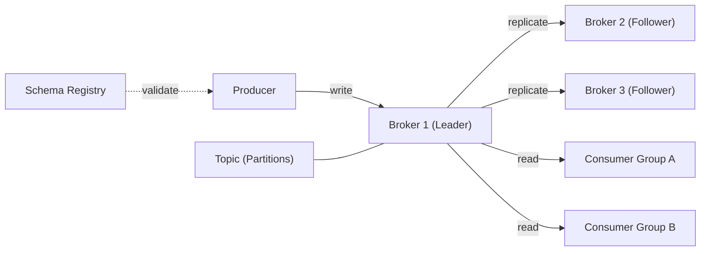

# Kafka — A 2-Day Crash Course

> **In one sentence:** Kafka is a distributed event-streaming platform that lets services publish and subscribe to streams of records — think of it as a durable, replayable, ordered commit log for your entire system.

---

## Part 0 — Why Kafka exists

You start with two services. They talk directly. Then you have five services, then twenty. Every new service needs to know about every other service it depends on. You end up with a mesh of point-to-point HTTP calls, custom retry logic, and bespoke queues — a system where adding one new consumer means touching the producer code.

Traditional message queues help, but they have their own sharp edges. Most queues delete a message once it's been consumed. That means you can't replay events for a new downstream service, you can't reprocess on a logic bug, and you can't audit what happened two days ago. Queues also struggle to guarantee strict ordering across concurrent consumers.

Databases feel like the safe fallback — just poll a table. But databases are not built for firehose write throughput. A busy e-commerce platform pushing 500k events per second will saturate a relational database long before it saturates Kafka.

Kafka solves all three problems. Producers write to Kafka and have no idea who's reading. Consumers read at their own pace and maintain their own position in the log. Events are retained for a configurable window — days, weeks, or indefinitely — so any new consumer can read from the beginning.

**Mental model:** Kafka is a distributed append-only log. Producers write to the end of the log. Consumers read from any position and track where they are independently. Nothing is deleted on read — only when the retention policy expires. Every event is immutable once written.



---

## Part 1 — The vocabulary

| Term | What it means |
|---|---|
| **Broker** | A single Kafka server process. A cluster is multiple brokers. Producers and consumers connect to brokers. |
| **Topic** | A named, ordered, append-only stream of records. Like a database table, but you can only append — not update or delete. |
| **Partition** | A topic is split into N partitions, each its own ordered log on disk. Partitions are the unit of parallelism. |
| **Offset** | The integer position of a record within a partition. Starts at 0, increments by 1. The consumer owns its offset — Kafka doesn't track it for you (well, it stores it, but you control when to commit it). |
| **Producer** | An application that writes records to a topic. The producer decides which partition to send to, either by key hash or round-robin. |
| **Consumer** | An application that reads records from one or more topic partitions, starting from a stored or specified offset. |
| **Consumer Group** | A set of consumer instances that share the work of consuming a topic. Each partition is assigned to exactly one consumer in the group at a time — horizontal scaling built in. |
| **Replication Factor** | How many brokers hold a copy of each partition. A replication factor of 3 means one leader and two followers. If the leader dies, a follower is promoted. |
| **ISR** | In-Sync Replicas — the set of replicas that are caught up to the leader. A message is only considered committed when all ISR members have acknowledged it. |
| **Zookeeper / KRaft** | Historically, Kafka relied on Zookeeper to manage cluster metadata, leader election, and broker registration. KRaft (Kafka Raft) is the modern replacement — Kafka manages its own metadata without an external dependency. Zookeeper is deprecated as of Kafka 3.x and removed in 4.x. |

---

## DAY 1 — Your first cluster

### 1. Spin up a cluster with Docker Compose

You need Docker installed and running. See `Docker.md` for fundamentals.

Create a `docker-compose.yml`:

```yaml
version: "3.8"
services:
  kafka:
    image: apache/kafka:3.8.0
    container_name: kafka
    ports:
      - "9092:9092"
    environment:
      KAFKA_NODE_ID: 1
      KAFKA_PROCESS_ROLES: broker,controller
      KAFKA_LISTENERS: PLAINTEXT://:9092,CONTROLLER://:9093
      KAFKA_ADVERTISED_LISTENERS: PLAINTEXT://localhost:9092
      KAFKA_CONTROLLER_QUORUM_VOTERS: 1@kafka:9093
      KAFKA_CONTROLLER_LISTENER_NAMES: CONTROLLER
      KAFKA_LISTENER_SECURITY_PROTOCOL_MAP: PLAINTEXT:PLAINTEXT,CONTROLLER:PLAINTEXT
      KAFKA_OFFSETS_TOPIC_REPLICATION_FACTOR: 1
      KAFKA_LOG_DIRS: /var/kafka/logs
      CLUSTER_ID: MkU3OEVBNTcwNTJENDM2Qk
```

```bash
docker compose up -d
docker exec -it kafka bash
```

This is KRaft mode — no Zookeeper. One broker, good for local development.

### 2. Create a topic

```bash
# Inside the container, or with the bin scripts on PATH
kafka-topics.sh --bootstrap-server localhost:9092 \
  --create \
  --topic orders \
  --partitions 3 \
  --replication-factor 1
```

You now have a topic called `orders` with 3 partitions. The replication factor is 1 because you have one broker — in production, you want at least 3.

```bash
# Verify
kafka-topics.sh --bootstrap-server localhost:9092 --describe --topic orders
```

The output tells you which broker is the leader for each partition, the ISR set, and the replication factor.

### 3. Produce messages from the CLI

```bash
kafka-console-producer.sh --bootstrap-server localhost:9092 --topic orders
```

Type a few lines, then Ctrl+C. Each line becomes one record. No key specified — records are distributed round-robin across partitions.

Produce with a key:

```bash
kafka-console-producer.sh \
  --bootstrap-server localhost:9092 \
  --topic orders \
  --property "parse.key=true" \
  --property "key.separator=:"
```

Now type `user-123:{"order_id": "A1", "amount": 99.00}`. The key `user-123` is hashed to determine the partition — all records with the same key land on the same partition, preserving order per key.

### 4. Consume messages from the CLI

```bash
# Read from the latest offset (default)
kafka-console-consumer.sh --bootstrap-server localhost:9092 --topic orders

# Read from the beginning
kafka-console-consumer.sh --bootstrap-server localhost:9092 --topic orders --from-beginning
```

Notice that with 3 partitions, the records may appear out of insertion order. Kafka guarantees order within a partition, not across partitions. If you need strict global order, use one partition — but you lose parallelism.

### 5. Understand offsets

Each record has a partition and an offset. Offsets are per-partition. Partition 0 might be at offset 14, partition 1 at offset 7.

```bash
# Check the current end offsets for all partitions
kafka-get-offsets.sh --bootstrap-server localhost:9092 --topic orders
```

When a consumer reads partition 0 up to offset 12 and commits, Kafka stores that committed offset under the consumer group's name. A restart will resume from offset 13.

**By end of Day 1 you can:**
- Run a local Kafka cluster in KRaft mode with Docker Compose
- Create topics with a specified partition count and replication factor
- Produce records from the CLI, with and without keys
- Consume from the beginning or the latest offset
- Read partition and offset metadata and understand what they mean

---

## DAY 2 — Make it real

### 1. Consumer groups and rebalancing

A consumer group is the mechanism by which Kafka scales consumption horizontally. Start two consumers in the same group:

```bash
# Terminal 1
kafka-console-consumer.sh \
  --bootstrap-server localhost:9092 \
  --topic orders \
  --group order-processors \
  --from-beginning

# Terminal 2
kafka-console-consumer.sh \
  --bootstrap-server localhost:9092 \
  --topic orders \
  --group order-processors
```

With 3 partitions and 2 consumers, one consumer gets 2 partitions and the other gets 1. Add a third terminal with the same group ID and each consumer gets exactly one partition. Add a fourth — one consumer sits idle (you can't have more active consumers than partitions).

When a consumer in the group dies or a new one joins, Kafka triggers a **rebalance** — partitions are reassigned across the live group members. During rebalance, consumption pauses. This is a known operational cost. The cooperative rebalancing protocol (available since Kafka 2.4) reduces the pause by only reassigning partitions that need to move.

```bash
# Check committed offsets and lag for a group
kafka-consumer-groups.sh \
  --bootstrap-server localhost:9092 \
  --describe \
  --group order-processors
```

The `LAG` column is the difference between the latest offset on the broker and the committed offset of the consumer. Non-zero lag means your consumers are behind. This is your primary operational metric.

### 2. Exactly-once semantics

Kafka gives you three delivery guarantees, depending on your producer and consumer configuration:

**At-most-once** — messages may be lost, never duplicated. Fire and forget. `acks=0`.

**At-least-once** — messages are never lost, but may be duplicated. The default. `acks=all`, retries enabled, idempotency disabled.

**Exactly-once** — every message is delivered and processed exactly once. Requires the idempotent producer and, for cross-topic workflows, Kafka transactions.

Enable idempotent producer (prevents duplicates on retry):

```properties
enable.idempotence=true
acks=all
retries=2147483647
max.in.flight.requests.per.connection=5
```

For transactional producers — where you need atomicity across multiple topic writes:

```properties
transactional.id=order-producer-1
enable.idempotence=true
```

```java
producer.initTransactions();
producer.beginTransaction();
producer.send(new ProducerRecord<>("orders", key, value));
producer.send(new ProducerRecord<>("audit-log", key, auditValue));
producer.commitTransaction();
```

⚠️ Exactly-once adds latency and coordination overhead. Use at-least-once with idempotent consumers (process-once logic keyed on record ID) unless you have a hard requirement for transactional writes.

### 3. Schema Registry and Avro

When you have ten producers and twenty consumers, the schema of your records must be managed — otherwise one team changes a field name and silently breaks five downstream services.

Confluent Schema Registry (also available as an open-source project) enforces schema compatibility. Producers register a schema; consumers fetch it by ID embedded in the message header.

Run Schema Registry alongside Kafka:

```yaml
  schema-registry:
    image: confluentinc/cp-schema-registry:7.6.0
    ports:
      - "8081:8081"
    environment:
      SCHEMA_REGISTRY_KAFKASTORE_BOOTSTRAP_SERVERS: kafka:9092
      SCHEMA_REGISTRY_HOST_NAME: schema-registry
```

Register an Avro schema:

```bash
curl -X POST http://localhost:8081/subjects/orders-value/versions \
  -H "Content-Type: application/vnd.schemaregistry.v1+json" \
  -d '{
    "schema": "{\"type\":\"record\",\"name\":\"Order\",\"fields\":[{\"name\":\"order_id\",\"type\":\"string\"},{\"name\":\"amount\",\"type\":\"double\"}]}"
  }'
```

Compatibility modes: `BACKWARD` (new schema can read old data), `FORWARD` (old schema can read new data), `FULL` (both directions). Start with `BACKWARD` — it lets you deploy consumers before producers.

### 4. Retention and log compaction

By default Kafka retains records for 7 days (`log.retention.hours=168`). You can also set retention by size (`log.retention.bytes`). Once the retention limit is reached, old segments are deleted from disk.

**Log compaction** is a different policy, suited for changelog topics — a topic where each key represents the latest state of an entity. With compaction enabled, Kafka guarantees that at least the most recent record for each key is retained indefinitely. Older records for the same key are removed during compaction in the background.

```bash
kafka-topics.sh --bootstrap-server localhost:9092 \
  --alter --topic user-profiles \
  --config cleanup.policy=compact \
  --config min.cleanable.dirty.ratio=0.1
```

Use compacted topics as a lightweight key-value store that new consumers can bootstrap from. A new service joining the system reads the compacted topic from the beginning and gets the current state of every key — no database needed for initial load.

### 5. Monitoring — lag, under-replicated partitions, throughput

The three metrics you watch first:

**Consumer lag** — how many records each consumer group is behind. High lag means consumers can't keep up with producers. Fix by adding partitions (and consumers), optimizing consumer processing, or both.

**Under-replicated partitions (URP)** — partitions where one or more replicas are not in the ISR. Non-zero URP means a broker is struggling or a replica is offline. This reduces your durability guarantee.

**Request rate and bytes in/out** — the throughput metrics. Use these to size your cluster and detect unexpected traffic spikes.

Export metrics via JMX to Prometheus using the JMX Exporter agent. Import the Kafka Grafana dashboard (see `Prometheus.md` and `Grafana.md`) for prebuilt panels covering lag, URP, request latency, and disk usage.

```bash
# Quick lag check via CLI
kafka-consumer-groups.sh \
  --bootstrap-server localhost:9092 \
  --describe \
  --group your-group
```

Confluent's `kafka-lag-exporter` is a purpose-built Prometheus exporter for consumer lag. Recommended over scraping JMX manually.

### 6. KRaft mode — Kafka without Zookeeper

Zookeeper was the external coordination service that Kafka required for cluster metadata, controller election, and configuration storage. Maintaining a separate Zookeeper ensemble added operational complexity: separate monitoring, separate upgrades, separate failure modes.

KRaft (Kafka Raft) replaces Zookeeper by embedding metadata management directly into Kafka brokers. A subset of brokers act as controllers, using the Raft consensus algorithm to elect a leader and replicate the metadata log.

In Kafka 3.x, KRaft is stable and the recommended mode for new clusters. In Kafka 4.0+, Zookeeper support is removed entirely. The Docker Compose example in Day 1 already uses KRaft.

Benefits:
- Single system to operate and monitor
- Faster controller failover (sub-second vs. several seconds with Zookeeper)
- Support for millions of partitions (Zookeeper had practical limits around 200k)

For Kubernetes deployments, use the Strimzi Kafka operator — it has first-class KRaft support. See `Kubernetes.md` and `Helm.md` for cluster deployment patterns.

### 7. Security — SASL, TLS, ACLs

A default Kafka install has no authentication, no encryption, and no authorization. That is fine on localhost; it is not fine in any other environment.

**TLS** encrypts data in transit between clients and brokers (and between brokers). Generate a CA, sign broker certificates, configure `ssl.keystore.location` and `ssl.truststore.location` on each broker.

**SASL** handles authentication. The common mechanisms:
- `PLAIN` — username/password, simple but credentials in clear if not over TLS
- `SCRAM-SHA-512` — salted challenge-response, no plaintext passwords
- `OAUTHBEARER` — token-based, integrates with your existing OAuth/OIDC provider

**ACLs** control what an authenticated principal can do — produce to a topic, consume from a topic, create topics, manage consumer groups.

```bash
# Grant a producer principal write access to the orders topic
kafka-acls.sh --bootstrap-server localhost:9092 \
  --add \
  --allow-principal User:order-service \
  --operation Write \
  --topic orders

# Grant a consumer group read access
kafka-acls.sh --bootstrap-server localhost:9092 \
  --add \
  --allow-principal User:fulfillment-service \
  --operation Read \
  --topic orders \
  --group fulfillment-group
```

⚠️ Enable `allow.everyone.if.no.acl.found=false` — the default `true` means any authenticated user can read any topic. That is almost certainly not what you want.

### 8. Performance tuning

Producer-side knobs that matter most:

| Config | Default | What it does |
|---|---|---|
| `batch.size` | 16384 | Max bytes to batch before sending. Increase for higher throughput. |
| `linger.ms` | 0 | Time to wait for more records before sending a batch. Set to 5–20ms for throughput. |
| `compression.type` | none | `snappy` or `lz4` gives 3–5x compression with minimal CPU cost. |
| `buffer.memory` | 33554432 | Total memory for buffering. Increase if you see `BufferExhaustedException`. |
| `acks` | all | `1` for lower latency, `all` for durability. |

Consumer-side:

| Config | Default | What it does |
|---|---|---|
| `fetch.min.bytes` | 1 | Minimum bytes broker waits to accumulate before responding. Higher = fewer requests, higher latency. |
| `fetch.max.wait.ms` | 500 | Max wait if `fetch.min.bytes` not met. |
| `max.poll.records` | 500 | Max records returned per poll. Tune based on processing time. |
| `enable.auto.commit` | true | Set to `false` and commit manually for reliable at-least-once processing. |

Broker-side: keep your log directories on dedicated disks, separate from OS. Kafka is I/O-bound. SSDs reduce tail latency but spinning disks handle sustained throughput fine at lower cost.

---

## Worked example — Event-driven order processing

Consider an e-commerce platform. An order is placed, needs to be validated, fulfilled, invoiced, and notified.

**Topics:**
- `orders.created` — 12 partitions, keyed by `customer_id` (ensures all events for a customer are ordered)
- `orders.validated` — 12 partitions
- `orders.fulfilled` — 12 partitions
- `payments.processed` — 6 partitions
- `orders.dead-letter` — 3 partitions (failed events land here for manual inspection)

**Producers:**
- `order-api` writes to `orders.created` on checkout
- `validation-service` reads from `orders.created`, validates inventory and fraud signals, writes to `orders.validated` or `orders.dead-letter`
- `fulfillment-service` reads from `orders.validated`, picks and packs, writes to `orders.fulfilled`
- `payment-service` reads from `orders.validated`, charges the card, writes to `payments.processed`

**Consumer groups:**
- `validation-group` — 12 consumers consuming `orders.created`
- `fulfillment-group` — 12 consumers consuming `orders.validated`
- `notification-group` — 3 consumers consuming `orders.fulfilled` and `payments.processed` (fan-out: multiple groups read the same topics independently)

**Dead-letter flow:**
When `validation-service` catches a processing error it cannot recover from (malformed payload, unknown SKU, fraud flag), it produces to `orders.dead-letter` with an error header: `X-Error-Reason: unknown_sku`. A separate `dlq-inspector` service consumes the DLQ, alerts on-call, and offers a retry endpoint.

⚠️ Never discard failed events silently. A dead-letter topic is non-optional in production workflows. Without it, you can't audit failures, replay after a bug fix, or meet regulatory requirements for event traceability.

**Replay scenario:** Your fulfillment logic had a bug for two days. Fix is deployed. Seek the `fulfillment-group` back to the offset from 48 hours ago and reprocess. Because Kafka retains records, this works. With a traditional queue, those messages are gone.

---


## Terminal Demo

```terminal-demo
# kafka@production ~ %

$ kafka-broker-api-versions.sh --bootstrap-server prod-kafka:9092 | head -3
prod-kafka:9092 (id: 0 rack: ap-south-1a) -> (
  ApiVersion(0, Produce, 0 to 10),
  ApiVersion(1, Fetch, 0 to 16),

$ kafka-topics.sh --bootstrap-server prod-kafka:9092 --list
orders
payments
notifications
user-events
dead-letter

$ kafka-topics.sh --bootstrap-server prod-kafka:9092 --describe --topic orders
Topic: orders   PartitionCount: 12   ReplicationFactor: 3
  Partition: 0   Leader: 1   Replicas: 1,2,3   Isr: 1,2,3
  Partition: 1   Leader: 2   Replicas: 2,3,1   Isr: 2,3,1
  Partition: 2   Leader: 3   Replicas: 3,1,2   Isr: 3,1,2

$ kafka-consumer-groups.sh --bootstrap-server prod-kafka:9092 --describe --group order-processor
GROUP             TOPIC    PARTITION  CURRENT-OFFSET  LOG-END-OFFSET  LAG
order-processor   orders   0          4567890         4567892         2
order-processor   orders   1          3456789         3456789         0
order-processor   orders   2          5678901         5678905         4

$ kafka-console-consumer.sh --bootstrap-server prod-kafka:9092 --topic orders --from-latest --max-messages 2
{"orderId":"ord-123","userId":"u-42","amount":99.99,"currency":"INR","timestamp":"2026-06-02T10:15:32Z"}
{"orderId":"ord-124","userId":"u-55","amount":149.50,"currency":"INR","timestamp":"2026-06-02T10:15:33Z"}
Processed a total of 2 messages

$ kafka-log-dirs.sh --bootstrap-server prod-kafka:9092 --describe | jq '.brokers[0] | {broker:.broker, logDirs:.logDirs[0].partitions | length, totalSize: (.logDirs[0].partitions | map(.size) | add)}'
{"broker": 0, "logDirs": 24, "totalSize": 12345678901}
```

---

## Common pitfalls

- **Too few partitions at topic creation.** You can increase partitions later, but this changes the key-to-partition mapping — records with the same key may land on a different partition. Any system relying on per-key ordering across time breaks silently. Start with more partitions than you think you need; 12 is a reasonable default for production topics.

- **Auto-commit enabled with slow processing.** When `enable.auto.commit=true`, the consumer commits the offset on a timer regardless of whether processing succeeded. A crash after commit but before successful processing means silent data loss. Disable auto-commit, process, then commit.

- **Consumer group ID collisions.** Two unrelated applications accidentally sharing a group ID will split partitions between them — each sees only a fraction of events. Name groups explicitly and treat them as a first-class resource.

- **Producing without keys when order matters.** Round-robin partition assignment means records from the same logical entity (a user, an order) end up on different partitions, losing relative order. Always use a meaningful key for ordered event streams.

- **Ignoring consumer lag.** Lag is your Kafka health signal. A steady, non-zero lag means your consumers are permanently behind. This will eventually cause you to miss retention windows — records expire before your consumer reads them.

- **Under-replicated partitions in silence.** URP is a pre-failure warning. Set an alert on `kafka.server:type=ReplicaManager,name=UnderReplicatedPartitions > 0`. Ignoring it means you're running with reduced durability and may lose data on the next broker failure.

- **Zookeeper in new clusters.** If you're starting fresh, use KRaft. Zookeeper support is removed in Kafka 4.x. Building on it now is creating future migration work.

- **Max message size mismatch.** The default max message size is 1MB (`message.max.bytes`). If a producer sends a larger message, it fails. If you increase the broker limit, you must also increase `replica.fetch.max.bytes` and the consumer's `fetch.max.bytes` — missing any one of these causes confusing errors.

---

## Quick command reference

### Topics

```bash
# List all topics
kafka-topics.sh --bootstrap-server localhost:9092 --list

# Create topic
kafka-topics.sh --bootstrap-server localhost:9092 \
  --create --topic <name> --partitions <n> --replication-factor <r>

# Describe topic (partitions, leaders, ISR)
kafka-topics.sh --bootstrap-server localhost:9092 --describe --topic <name>

# Increase partition count
kafka-topics.sh --bootstrap-server localhost:9092 \
  --alter --topic <name> --partitions <new-n>

# Delete topic
kafka-topics.sh --bootstrap-server localhost:9092 --delete --topic <name>
```

### Produce / Consume

```bash
# Produce (interactive, no key)
kafka-console-producer.sh --bootstrap-server localhost:9092 --topic <name>

# Produce with key
kafka-console-producer.sh --bootstrap-server localhost:9092 --topic <name> \
  --property parse.key=true --property key.separator=:

# Consume from beginning
kafka-console-consumer.sh --bootstrap-server localhost:9092 \
  --topic <name> --from-beginning

# Consume and show key, value, partition, offset
kafka-console-consumer.sh --bootstrap-server localhost:9092 \
  --topic <name> --from-beginning \
  --property print.key=true \
  --property print.partition=true \
  --property print.offset=true

# Consume N messages and exit
kafka-console-consumer.sh --bootstrap-server localhost:9092 \
  --topic <name> --from-beginning --max-messages 100
```

### Consumer groups

```bash
# List groups
kafka-consumer-groups.sh --bootstrap-server localhost:9092 --list

# Describe group (offsets, lag per partition)
kafka-consumer-groups.sh --bootstrap-server localhost:9092 \
  --describe --group <group-id>

# Reset offsets to beginning (dry-run first)
kafka-consumer-groups.sh --bootstrap-server localhost:9092 \
  --group <group-id> --topic <name> \
  --reset-offsets --to-earliest --dry-run

# Apply the reset
kafka-consumer-groups.sh --bootstrap-server localhost:9092 \
  --group <group-id> --topic <name> \
  --reset-offsets --to-earliest --execute

# Reset to a specific datetime
kafka-consumer-groups.sh --bootstrap-server localhost:9092 \
  --group <group-id> --topic <name> \
  --reset-offsets --to-datetime 2026-05-29T00:00:00.000 --execute
```

### Configs

```bash
# View topic config overrides
kafka-configs.sh --bootstrap-server localhost:9092 \
  --describe --entity-type topics --entity-name <name>

# Set retention to 24 hours
kafka-configs.sh --bootstrap-server localhost:9092 \
  --alter --entity-type topics --entity-name <name> \
  --add-config retention.ms=86400000

# Enable compaction
kafka-configs.sh --bootstrap-server localhost:9092 \
  --alter --entity-type topics --entity-name <name> \
  --add-config cleanup.policy=compact

# View broker configs
kafka-configs.sh --bootstrap-server localhost:9092 \
  --describe --entity-type brokers --entity-name 1
```

### Admin

```bash
# Get current end offsets (useful for lag calculation)
kafka-get-offsets.sh --bootstrap-server localhost:9092 --topic <name>

# List ACLs
kafka-acls.sh --bootstrap-server localhost:9092 --list

# Add produce ACL
kafka-acls.sh --bootstrap-server localhost:9092 \
  --add --allow-principal User:<name> \
  --operation Write --topic <topic>

# Describe cluster (brokers, controller)
kafka-broker-api-versions.sh --bootstrap-server localhost:9092

# Check under-replicated partitions
kafka-topics.sh --bootstrap-server localhost:9092 \
  --describe --under-replicated-partitions
```

---

## Top 10 Interview Questions

<details>
<summary><strong>Q: How does Kafka guarantee message ordering, and what are the limitations?</strong></summary>

Kafka guarantees strict ordering within a single partition only — records with the same key always go to the same partition via consistent hashing. There is no ordering guarantee across partitions. If you need global ordering, you use a single partition, but this eliminates parallelism. In practice, per-key ordering (e.g., all events for a given user) is sufficient for most use cases.

</details>

<details>
<summary><strong>Q: What is the difference between at-most-once, at-least-once, and exactly-once delivery in Kafka?</strong></summary>

At-most-once (`acks=0`): messages may be lost, never duplicated — fire and forget. At-least-once (`acks=all`, retries enabled): messages are never lost but may be duplicated on retry. Exactly-once requires the idempotent producer (`enable.idempotence=true`) and, for cross-topic workflows, Kafka transactions. Exactly-once adds latency; most production systems use at-least-once with idempotent consumers.

</details>

<details>
<summary><strong>Q: What happens during a consumer group rebalance, and how can you minimize its impact?</strong></summary>

When a consumer joins or leaves a group, Kafka reassigns partitions across the remaining consumers. During rebalance, consumption pauses — no records are processed. This can cause latency spikes. Use the cooperative sticky assignor (available since Kafka 2.4) to minimize disruption — it only reassigns partitions that actually need to move, rather than revoking all partitions and reassigning from scratch.

</details>

<details>
<summary><strong>Q: What is consumer lag and why is it the primary operational metric for Kafka?</strong></summary>

Consumer lag is the difference between the latest offset on the broker and the committed offset of the consumer. It tells you how far behind consumers are. High or growing lag means consumers cannot keep up with producers. If lag exceeds the retention window, records expire before being consumed — silent data loss. Monitor lag per consumer group and per partition, and alert when it grows beyond a threshold.

</details>

<details>
<summary><strong>Q: What is log compaction and when would you use it instead of time-based retention?</strong></summary>

Log compaction retains at least the most recent record for each key indefinitely, removing older records for the same key during background compaction. Use it for changelog topics where each key represents the latest state of an entity — user profiles, configuration, inventory counts. New consumers can bootstrap from a compacted topic to get the current state of every key without needing a separate database.

</details>

<details>
<summary><strong>Q: Why is increasing the partition count of an existing topic risky?</strong></summary>

Increasing partitions changes the key-to-partition mapping because Kafka hashes the key modulo the partition count. Records with the same key may now land on a different partition than before, breaking any system that relies on per-key ordering across time. You also cannot decrease partitions. Start with more partitions than you think you need — 12 is a reasonable default for production topics.

</details>

<details>
<summary><strong>Q: What is KRaft mode and why is Zookeeper being removed from Kafka?</strong></summary>

KRaft (Kafka Raft) embeds metadata management directly into Kafka brokers using the Raft consensus algorithm, replacing the external Zookeeper dependency. Benefits include a single system to operate, faster controller failover (sub-second vs. several seconds), and support for millions of partitions. Zookeeper is deprecated in Kafka 3.x and removed in 4.x. All new clusters should use KRaft.

</details>

<details>
<summary><strong>Q: How do you handle failed messages in a Kafka consumer pipeline?</strong></summary>

Use a dead-letter topic (DLQ). When a consumer encounters a message it cannot process after a bounded number of retries, it produces the failed message to the DLQ with error metadata in headers. A separate service monitors the DLQ for alerting, manual inspection, and replay after bug fixes. Never silently discard failed events — you lose auditability and cannot recover from logic bugs.

</details>

<details>
<summary><strong>Q: What is the ISR (In-Sync Replicas) set and why does it matter for durability?</strong></summary>

The ISR is the set of replicas that are fully caught up to the leader's log. A message is only considered committed when all ISR members acknowledge it. If a broker falls behind (network lag, disk issues), it drops out of the ISR. Under-replicated partitions (URPs) — where the ISR is smaller than the replication factor — mean reduced durability. Alert on URP > 0 as a pre-failure signal.

</details>

<details>
<summary><strong>Q: Why should you disable auto-commit for consumers in production?</strong></summary>

With `enable.auto.commit=true`, the consumer commits offsets on a timer regardless of whether processing succeeded. If the consumer crashes after the offset is committed but before processing completes, that message is silently lost — it will never be re-delivered. Disable auto-commit, process the message, then commit explicitly. This gives you at-least-once delivery semantics with reliable processing guarantees.

</details>

---


## Quick Quiz

Test your understanding with these rapid-fire questions (answers hidden):

<details>
<summary>1. What is the ONE core problem that Kafka solves?</summary>
Re-read Part 0 — the mental model section. If you can explain the "why" in one sentence, you understand the foundation.
</details>

<details>
<summary>2. Name the 3 most important terms from the vocabulary section.</summary>
Review Part 1. These are the building blocks every conversation about Kafka uses.
</details>

<details>
<summary>3. What is the first thing you would set up on Day 1?</summary>
Check the Day 1 section — the very first hands-on step that gets you a working result.
</details>

<details>
<summary>4. What is the most common production pitfall with Kafka?</summary>
Review the Common Pitfalls section. The first item listed is typically the most frequently encountered.
</details>

<details>
<summary>5. How does Kafka compare to its closest alternative?</summary>
Check the Comparison Matrix below — focus on the key differentiating row.
</details>


## Comparison Matrix

| Dimension | Kafka | RabbitMQ | Pulsar |
|-----------|-------|----------|--------|
| **Primary use case** | Core strength of Kafka | Core strength of RabbitMQ | Core strength of Pulsar |
| **Learning curve** | Moderate | Varies | Varies |
| **Community/ecosystem** | Active | Active | Growing |
| **Operational complexity** | Medium | Varies | Varies |
| **Best for** | See Part 0 | Different tradeoffs | Different tradeoffs |

> **How to read this matrix:** no tool wins on every dimension. Pick based on your specific constraints — team expertise, existing infrastructure, scale requirements, and compliance needs. The right choice is the one that fits your context, not the one with the most checkmarks.

## Next steps after Day 2

Once you're comfortable producing and consuming reliably, the natural extensions are:

- **`Redis.md`** — Use Redis as a fast read-through cache in front of the state your Kafka consumers maintain. Useful when consumers build aggregated state that services need to query in real time.
- **`PostgreSQL.md`** — Kafka Connect has a first-class JDBC sink connector. Stream records from Kafka directly into Postgres tables without writing consumer code. Also relevant for the outbox pattern — write events to a Postgres outbox table first, then stream them into Kafka via the Debezium CDC connector.
- **`Docker.md`** — Your Kafka cluster runs in containers. Understanding Docker networking, volume management, and resource limits directly affects cluster stability.
- **`Kubernetes.md`** — Running Kafka on Kubernetes with the Strimzi operator. Covers StatefulSets, persistent volumes, rolling upgrades, and the KRaft configuration for a production-grade multi-broker cluster. Pair with `Helm.md` for deploying Strimzi via Helm chart.

---

## Recommended learning resources

**YouTube channels & playlists:**
- [Confluent — YouTube channel](https://www.youtube.com/@Confluent) — official Kafka tutorials, Kafka Streams, ksqlDB, Connect, and conference keynotes
- [Hussein Nasser — Kafka playlist](https://www.youtube.com/@haboread) — internals-first explanations of partitions, consumer groups, replication, and exactly-once semantics
- [Fireship — Kafka in 100 Seconds](https://www.youtube.com/@Fireship) — quick conceptual overview before the deep dive
- [Stephane Maarek — Apache Kafka for Beginners](https://www.youtube.com/@StephaneMaarek) — structured walkthrough from zero to production-ready topics, consumers, and Connect
- [Tim Berglund (Confluent) — Kafka Internals](https://www.youtube.com/@Confluent) — deep technical talks on log compaction, KRaft, and partition leadership

**Official docs & blogs:**
- [Apache Kafka Official Documentation](https://kafka.apache.org/documentation/) — the canonical reference for broker configuration, producer/consumer APIs, and operations
- [Confluent Blog](https://www.confluent.io/blog/) — production patterns, performance tuning, and Kafka ecosystem updates
- [Confluent Developer — Kafka Tutorials](https://developer.confluent.io/) — hands-on exercises for Streams, Connect, and Schema Registry

---

**The mantra:** The log never lies — design your system so every state change is an event, and you'll never need a migration you can't replay.
