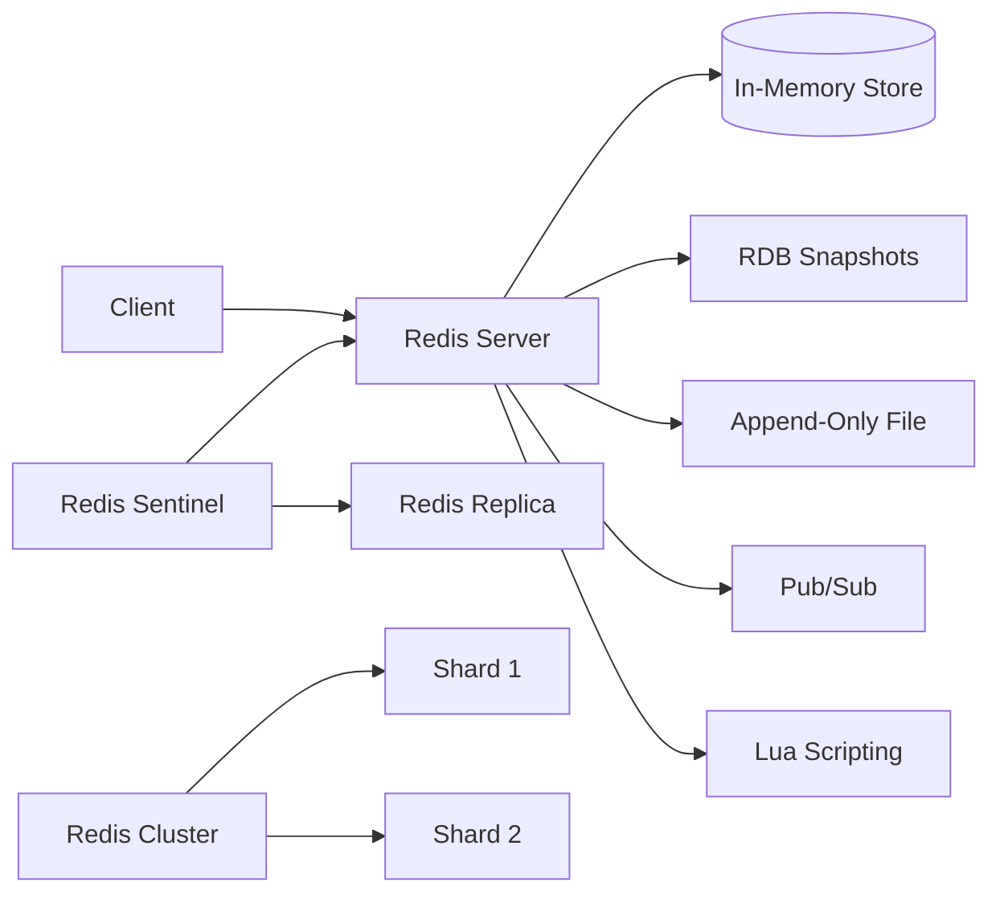

# Redis — A 2-Day Crash Course

> **In one sentence:** Redis is an in-memory data structure store used as a cache, message broker, and database — it's the Swiss Army knife you put in front of your slow things to make them fast.

---

## Part 0 — Why Redis exists

Disk-based databases are optimized for durability and rich querying. They're good at that. What they're not good at: returning results in under a millisecond, handling ten thousand rate-limit checks per second, or fanning a message out to fifty subscribers in real time. When your PostgreSQL query takes 40ms and you're calling it 500 times per second, the math stops working. You need something faster.

The root problem is the storage medium. A spinning disk or even an NVMe SSD introduces seek and I/O latency that RAM simply doesn't have. Redis keeps everything in RAM. Reads and writes are measured in microseconds. That single architectural choice — memory-first — is what makes Redis feel like a different category of tool.

But Redis isn't just a fast key-value store. The distinguishing feature is that it speaks **data structures natively**. Instead of serializing a list into a JSON blob, storing it as a string, fetching it back, and deserializing it in your app, Redis operates on the list directly — push, pop, range — server-side. You move logic closer to the data, reduce round trips, and keep your app code simpler.

Common use cases you'll encounter in the wild:

- **Caching** — database query results, rendered HTML fragments, API responses
- **Session storage** — stateless apps storing user sessions with automatic expiry
- **Rate limiting** — counting requests per user per window without hitting Postgres
- **Leaderboards** — real-time rankings via sorted sets, no `ORDER BY` needed
- **Pub/sub messaging** — lightweight event fan-out between services
- **Distributed locks** — coordinating work across multiple app instances
- **Job queues** — lightweight task queuing (though Kafka or RabbitMQ for heavy workloads)

See `Prometheus.md` for how you'd instrument Redis hit rates and latency in production. See `Docker.md` for running Redis in a container locally.

**Mental model:** Redis is RAM with a language — it speaks data structures (strings, hashes, lists, sets, sorted sets) natively, not just key-value blobs. Think of it as a networked, persistent, multi-structure in-memory process that your entire application fleet shares.

---




## Part 1 — The vocabulary

| Term | Meaning |
|------|---------|
| **Key** | The name that identifies a value — any binary string, up to 512MB (keep them short and structured: `user:1001:profile`) |
| **TTL** | Time To Live — how many seconds before Redis automatically deletes a key; the backbone of caching |
| **String** | The most basic type — bytes, integers, or serialized blobs; also the type for counters (`INCR`) |
| **Hash** | A map of field→value pairs under one key; think of it as a row in a table or a struct |
| **List** | An ordered linked list of strings; push/pop from head or tail; good for queues and timelines |
| **Set** | An unordered collection of unique strings; supports union/intersection/diff across sets |
| **Sorted Set** | Like a set but every member has a floating-point score; kept sorted by score; the leaderboard type |
| **Pub/Sub** | Publish/subscribe messaging — publishers push to channels, subscribers receive in real time |
| **RDB** | Redis Database — point-in-time snapshot of all data, written to disk periodically |
| **AOF** | Append-Only File — a log of every write operation; higher durability than RDB, larger on disk |
| **Sentinel** | A separate process that monitors Redis primaries and replicas and orchestrates automatic failover |
| **Cluster** | Redis in sharded mode — data is partitioned across multiple nodes using hash slots (16384 total) |
| **Eviction Policy** | What Redis does when it's full — evict LRU keys, evict by TTL, or refuse writes; configured via `maxmemory-policy` |
| **Pipeline** | Batching multiple commands into one network round trip — critical for throughput under high load |

---

## DAY 1 — Get it running

### 1. Install and connect

```bash
# macOS
brew install redis
brew services start redis

# Ubuntu/Debian
sudo apt install redis-server
sudo systemctl start redis

# Docker (cleanest for dev — see Docker.md)
docker run -d --name redis -p 6379:6379 redis:7-alpine

# Verify
redis-cli ping          # should return PONG
redis-cli              # opens an interactive session
```

Redis listens on `6379` by default. The CLI is your REPL — use it constantly while learning.

### 2. Strings — the universal type

```bash
SET user:1001:name "Alice"          # store a string
GET user:1001:name                  # retrieve it
DEL user:1001:name                  # delete it

SET visit:count 0
INCR visit:count                    # atomic increment → 1
INCRBY visit:count 10               # add 10 → 11
DECR visit:count                    # → 10

SET session:abc123 "payload"
EXPIRE session:abc123 3600          # expire in 1 hour
TTL session:abc123                  # seconds remaining; -1 = no TTL; -2 = key gone
SET session:xyz789 "payload" EX 3600  # SET + EXPIRE in one command (prefer this)

SETNX lock:job42 "worker1"         # SET if Not eXists — the primitive for distributed locks
```

Key naming convention: colon-separated namespaces (`type:id:field`). This is a community standard, not enforced by Redis, but follow it — it makes `SCAN` queries and debugging far easier.

### 3. Hashes — structured objects

```bash
HSET user:1001 name "Alice" email "alice@example.com" age 30
HGET user:1001 name             # "Alice"
HMGET user:1001 name email      # get multiple fields at once
HGETALL user:1001               # all fields and values
HDEL user:1001 age
HEXISTS user:1001 email         # 1 if field exists
HLEN user:1001                  # number of fields
HINCRBY user:1001 login_count 1 # atomic field increment
```

Use hashes when you'd otherwise serialize a struct to JSON and store it as a string. Hashes let you update a single field without touching the whole object — fewer bytes over the wire, and atomic field-level updates.

### 4. Lists — queues and timelines

```bash
RPUSH jobs:queue "task1" "task2" "task3"   # push to tail
LPUSH jobs:queue "urgent"                  # push to head
LRANGE jobs:queue 0 -1                     # all elements (0 to last)
LRANGE jobs:queue 0 2                      # first 3 elements
LPOP jobs:queue                            # pop from head (FIFO queue consumer)
RPOP jobs:queue                            # pop from tail (stack)
LLEN jobs:queue                            # length

BLPOP jobs:queue 30     # blocking pop — waits up to 30s for an item; the worker pattern
```

`BLPOP` is the heart of a Redis-backed job queue — workers block-wait for work, and producers push tasks. No polling. Zero CPU waste when the queue is empty.

### 5. Sets — membership and uniqueness

```bash
SADD tags:article:42 "redis" "databases" "caching"
SREM tags:article:42 "caching"
SMEMBERS tags:article:42          # all members (unordered)
SISMEMBER tags:article:42 "redis" # 1 if member
SCARD tags:article:42             # count of members

# Set operations — the power of sets
SADD online:users "alice" "bob" "carol"
SADD premium:users "bob" "carol" "dave"
SINTER online:users premium:users    # intersection: bob, carol
SUNION online:users premium:users    # union: alice, bob, carol, dave
SDIFF online:users premium:users     # difference: alice (online but not premium)
```

Sets are ideal for: unique visitor counting per page, tag systems, tracking which users received a notification, anything requiring deduplication.

### 6. Sorted sets — leaderboards and windowed queries

```bash
ZADD leaderboard 1500 "alice" 2300 "bob" 900 "carol"
ZINCRBY leaderboard 200 "alice"               # alice now 1700
ZRANK leaderboard "alice"                     # 0-indexed rank by score ascending
ZREVRANK leaderboard "alice"                  # rank by score descending (leaderboard rank)
ZRANGE leaderboard 0 -1 WITHSCORES           # all, low to high
ZREVRANGE leaderboard 0 2 WITHSCORES         # top 3, high to low
ZRANGEBYSCORE leaderboard 1000 2000          # members with score between 1000 and 2000
ZCARD leaderboard                            # total members
ZREM leaderboard "carol"
```

The score is a `double` — it can represent timestamps, numeric ranks, weights, or anything you can encode as a number. Sorted sets are the right tool any time you need "top N" or "by time range" without a full database query.

### 7. TTL and key lifecycle

```bash
EXPIRE key 60             # set TTL in seconds
PEXPIRE key 60000         # set TTL in milliseconds
EXPIREAT key 1800000000   # set absolute Unix timestamp for expiry
PERSIST key               # remove TTL — make key permanent
TTL key                   # seconds remaining; -1 no TTL; -2 key doesn't exist
PTTL key                  # milliseconds remaining
```

TTL is how caching actually works. You store a value, set its expiry, and Redis deletes it for you. No cron job. No cleanup query. The cache is self-healing.

### 8. Basic pub/sub

Open two terminal windows — subscriber first, then publisher:

```bash
# Terminal 1 — subscribe to a channel
redis-cli
SUBSCRIBE notifications:user:1001

# Terminal 2 — publish to that channel
redis-cli
PUBLISH notifications:user:1001 "Your order shipped"
```

The subscriber receives the message in real time. Pub/sub in Redis is fire-and-forget — no persistence, no acknowledgment. If the subscriber is offline, the message is lost. For durable messaging, use Redis Streams or see `Kafka.md`.

**By end of Day 1 you can:** store and retrieve all five data structure types, set TTLs for automatic expiry, build a basic queue with lists, rank members with sorted sets, and send real-time messages with pub/sub. That's the daily 80%.

---

## DAY 2 — Make it real

### 1. Persistence — RDB vs AOF

Redis is in-memory but it's not purely ephemeral. Two mechanisms write data to disk:

**RDB (snapshot)** — Redis forks and writes the full dataset to a `.rdb` file at intervals.
```
# redis.conf
save 900 1       # snapshot if at least 1 key changed in 900 seconds
save 300 10      # snapshot if at least 10 keys changed in 300 seconds
save 60 10000    # snapshot if at least 10000 keys changed in 60 seconds
```

**AOF (append-only file)** — Redis logs every write command to an append-only file.
```
# redis.conf
appendonly yes
appendfsync everysec   # flush to disk every second (good balance of safety/perf)
# appendfsync always   # flush every write — safest, slowest
# appendfsync no       # let the OS decide — fastest, least safe
```

| Concern | RDB | AOF |
|---------|-----|-----|
| Recovery speed | Fast (load snapshot) | Slower (replay all commands) |
| Data loss on crash | Up to minutes (since last snapshot) | Up to 1 second (with `everysec`) |
| File size | Compact | Grows continuously (auto-rewritten by Redis) |
| Best for | Backups, disaster recovery | High-durability caches and queues |

In production: run both. AOF gives you low data loss; RDB gives you fast restarts and backups. Configure `aof-use-rdb-preamble yes` to get a compact hybrid file.

### 2. Replication

Redis replication is asynchronous and single-primary by default.

```bash
# On the replica's redis.conf (or at runtime):
REPLICAOF 192.168.1.10 6379

# Check replication state
redis-cli INFO replication
```

Replicas serve reads — you can spread read load across them. Writes always go to the primary. Replication is eventually consistent; under network partition, replicas may lag. Never write to a replica directly; it silently discards the write in some configurations.

### 3. Sentinel — high availability

Sentinel is Redis's automated failover system. You run three or more Sentinel processes that monitor your primary and replicas.

```
# sentinel.conf
sentinel monitor mymaster 192.168.1.10 6379 2   # monitor primary; 2 = quorum
sentinel down-after-milliseconds mymaster 5000   # declare primary down after 5s of no response
sentinel failover-timeout mymaster 60000
```

```bash
redis-sentinel /etc/redis/sentinel.conf
redis-cli -p 26379 sentinel masters   # check sentinel state
```

When the primary goes down, Sentinel (once quorum is reached) promotes a replica to primary and reconfigures the others. Your app connects to Sentinel and asks for the current primary address — not to Redis directly. This is the HA pattern for non-clustered deployments. See `Kubernetes.md` for running Sentinel in a StatefulSet.

### 4. Redis Cluster — horizontal sharding

Cluster partitions your keyspace across multiple primary nodes using **hash slots** (0–16383). Each primary owns a range of slots; each has one or more replicas.

```bash
# Create a cluster from 6 nodes (3 primaries, 3 replicas)
redis-cli --cluster create \
  192.168.1.10:7000 192.168.1.11:7001 192.168.1.12:7002 \
  192.168.1.13:7003 192.168.1.14:7004 192.168.1.15:7005 \
  --cluster-replicas 1

redis-cli -c -p 7000    # -c enables cluster-aware redirect (MOVED/ASK handling)
redis-cli --cluster info 192.168.1.10:7000
```

⚠️ Multi-key operations (`MGET`, `MSET`, transactions, Lua scripts) only work when all keys hash to the same slot. Use **hash tags** to force co-location: `{user:1001}:profile` and `{user:1001}:sessions` both hash on `user:1001` and land on the same slot.

Cluster is the right choice when your dataset outgrows a single machine's RAM, or when you need horizontal write scaling. For most teams, a single primary + Sentinel covers the first few years.

### 5. Eviction policies

When Redis hits its `maxmemory` limit, it needs a strategy:

```
# redis.conf
maxmemory 2gb
maxmemory-policy allkeys-lru
```

| Policy | Behavior |
|--------|----------|
| `noeviction` | Refuse writes when full — safe for durability, bad for caches |
| `allkeys-lru` | Evict the least-recently-used key across all keys |
| `volatile-lru` | Evict LRU keys only from those with a TTL set |
| `allkeys-lfu` | Evict the least-frequently-used key (better than LRU for skewed access) |
| `volatile-ttl` | Evict the key with the shortest remaining TTL |
| `allkeys-random` | Evict a random key — rarely what you want |

For a pure cache: `allkeys-lru` or `allkeys-lfu`. For a mix of persistent and cached data: `volatile-lru` (only evict keys with TTL, leaving your persistent keys untouched).

### 6. Lua scripting — atomic multi-step operations

Redis executes Lua scripts atomically. No other command runs between the script's first and last operation — this is how you implement compare-and-swap, complex rate limiters, and other multi-step operations without a transaction race.

```bash
# Atomic increment with cap — returns 1 if under limit, 0 if over
redis-cli EVAL "
  local current = redis.call('INCR', KEYS[1])
  if current == 1 then
    redis.call('EXPIRE', KEYS[1], ARGV[1])
  end
  if current > tonumber(ARGV[2]) then
    return 0
  end
  return 1
" 1 "rate:user:1001" 60 100
```

`KEYS[1]` is the key, `ARGV[1]` is the window (60s), `ARGV[2]` is the limit (100 requests). The script is atomic — no race between `INCR` and `EXPIRE`. Load frequently-used scripts with `SCRIPT LOAD` and call them by SHA with `EVALSHA` for efficiency.

### 7. Pipelining — batching for throughput

Every Redis command is a network round trip: send command, wait for response. Under high throughput, this RTT dominates your latency. Pipelining sends a batch of commands without waiting for individual responses.

```python
import redis
r = redis.Redis()

# Without pipeline: 1000 round trips
for i in range(1000):
    r.set(f"key:{i}", i)

# With pipeline: 1 round trip (or a few, if the batch is large)
pipe = r.pipeline()
for i in range(1000):
    pipe.set(f"key:{i}", i)
pipe.execute()
```

Pipeline does not guarantee atomicity — for atomic multi-step ops, use Lua or `MULTI`/`EXEC` transactions. Pipeline is purely a network optimization.

### 8. Memory optimization

Redis stores data in memory — wasting it has a direct cost. Key habits:

```bash
redis-cli INFO memory          # current memory usage breakdown
redis-cli MEMORY USAGE key     # bytes consumed by a single key
redis-cli MEMORY DOCTOR        # automated analysis and suggestions
```

- **Use hashes for small objects.** Redis internally uses a compact `ziplist` encoding for hashes with fewer than 128 fields and values under 64 bytes. Storing 1000 small user structs as hashes uses far less memory than 1000 string keys.
- **Keep keys short.** `u:1001:n` vs `user:1001:name` — millions of keys × saved bytes adds up.
- **Set TTLs on everything that should expire.** Memory leaks in Redis are almost always keys without TTLs that were forgotten.
- **Use the right type.** A sorted set for 5 members is wasteful; a list or hash may be better. Profile with `MEMORY USAGE`.

### 9. Security — AUTH, ACL, TLS

Redis was designed for trusted networks. If it's reachable from the public internet without protection, it will be exploited — within hours, not days.

```bash
# redis.conf — basic password auth (Redis 5 and earlier style)
requirepass your-strong-password

# Connect with auth
redis-cli -a your-strong-password
AUTH your-strong-password    # or send AUTH after connecting
```

**ACLs (Redis 6+)** — fine-grained per-user permissions:

```bash
# redis.conf
ACL SETUSER appuser on >app-password ~app:* +GET +SET +DEL
# appuser can only GET/SET/DEL keys matching "app:*"

ACL LIST               # show all users
ACL WHOAMI             # current user
```

**TLS** — encrypt in-transit traffic:

```bash
# redis.conf
tls-port 6380
tls-cert-file /etc/redis/redis.crt
tls-key-file /etc/redis/redis.key
tls-ca-cert-file /etc/redis/ca.crt
```

**Bind to localhost** unless your architecture requires network exposure:

```
# redis.conf
bind 127.0.0.1 ::1
```

In a Kubernetes environment (see `Kubernetes.md`), run Redis in its own namespace, use network policies to restrict access, and mount secrets via Kubernetes Secrets — never hardcode credentials in your app config.

---

## Worked example — Rate limiter for an API gateway

You're running an API gateway. Each upstream service has a rate limit: 100 requests per minute per user. You need this check to add under 1ms of latency and handle 50,000 checks per second. Postgres cannot do this. Redis can.

**Strategy:** sliding window using sorted sets. Each user gets a sorted set of request timestamps. On each request, you:

1. Remove timestamps older than the current window.
2. Count remaining members.
3. If under the limit, add the current timestamp and allow the request.
4. If at or over the limit, reject.

Steps 1–4 must be atomic — use Lua.

```lua
-- rate_limit.lua
local key = KEYS[1]                          -- e.g. "ratelimit:user:1001"
local window = tonumber(ARGV[1])             -- window in seconds, e.g. 60
local limit = tonumber(ARGV[2])              -- max requests, e.g. 100
local now = tonumber(ARGV[3])                -- current timestamp in milliseconds
local window_start = now - (window * 1000)

-- remove timestamps outside the window
redis.call("ZREMRANGEBYSCORE", key, "-inf", window_start)

-- count requests in the current window
local count = redis.call("ZCARD", key)

if count >= limit then
  return 0    -- rate limited
end

-- record this request with timestamp as score
redis.call("ZADD", key, now, now)
redis.call("PEXPIRE", key, window * 1000)    -- auto-cleanup if user goes idle

return 1      -- allowed
```

Load the script and call it from your gateway:

```bash
# Load once at startup, store the SHA
SHA=$(redis-cli SCRIPT LOAD "$(cat rate_limit.lua)")

# On each request (millisecond timestamp as third arg)
redis-cli EVALSHA $SHA 1 "ratelimit:user:1001" 60 100 $(date +%s%3N)
# returns 1 (allowed) or 0 (rate limited)
```

This implementation is accurate across the full sliding window — not a fixed-window approximation that allows bursts at window boundaries. The sorted set naturally evicts old timestamps. The Lua script is atomic so two concurrent requests cannot both read `count = 99` and both proceed past a limit of 100. The `PEXPIRE` means idle users' keys clean themselves up automatically.

In production, instrument the 0 returns with a counter metric — see `Prometheus.md` for how to expose that from your gateway.

---


## Terminal Demo

```terminal-demo
# redis-cli@production ~ %

$ redis-cli -h prod-redis.internal INFO server | head -5
redis_version:7.2.4
redis_mode:standalone
os:Linux 5.15.0-1049-aws x86_64
tcp_port:6379
uptime_in_days:90

$ redis-cli INFO memory | grep -E "used_memory_human|maxmemory_human|mem_fragmentation"
used_memory_human:2.45G
maxmemory_human:4.00G
mem_fragmentation_ratio:1.12

$ redis-cli INFO keyspace
db0:keys=1234567,expires=987654,avg_ttl=3600000

$ redis-cli --latency-history -i 5
min: 0, max: 1, avg: 0.23 (502 samples) -- 5.00 seconds range
min: 0, max: 2, avg: 0.25 (498 samples) -- 5.00 seconds range

$ redis-cli INFO stats | grep -E "keyspace_hits|keyspace_misses|evicted"
keyspace_hits:45678901
keyspace_misses:1234567
evicted_keys:0

$ redis-cli SET session:user:42 '{"token":"abc","role":"admin"}' EX 3600
OK

$ redis-cli GET session:user:42
{"token":"abc","role":"admin"}

$ redis-cli SLOWLOG GET 3
1) (integer) 142
   (integer) 1717315200
   (integer) 15234
   1) "KEYS"
   2) "session:*"
2) (integer) 141
   (integer) 1717315100
   (integer) 8901
   1) "ZRANGEBYSCORE"
   2) "leaderboard"

$ redis-cli DBSIZE
(integer) 1234567

$ redis-cli MONITOR | head -5
1717315200.123456 [0 10.0.1.42:45678] "GET" "cache:user:42"
1717315200.123789 [0 10.0.1.42:45679] "SET" "cache:product:99" "..." "EX" "300"
1717315200.124012 [0 10.0.2.18:45680] "INCR" "rate:api:10.0.1.42"
```

---

## Common pitfalls

- **No `maxmemory` set.** Redis will consume all available RAM and start competing with the OS. Always configure `maxmemory` and an eviction policy before deploying.

- **Missing TTLs on cache keys.** A cache that never expires is a memory leak. Every key you intend as a cache entry must have a TTL. Audit with `redis-cli --scan --pattern "*" | xargs redis-cli TTL` periodically.

- **Using `KEYS *` in production.** `KEYS` is O(N) and blocks the entire Redis process while it runs. On a large keyspace this causes latency spikes. Use `SCAN` instead — it's cursor-based, iterative, and non-blocking.

- **Treating Redis pub/sub as a message queue.** Pub/sub has no persistence and no acknowledgment. A subscriber that disconnects loses messages. For reliable delivery, use Redis Streams (`XADD`/`XREADGROUP`) or a proper broker (`Kafka.md`).

- **Multi-key operations in Cluster mode without hash tags.** `MGET user:1 user:2` will fail or give wrong results in cluster mode if the keys hash to different slots. Design your keyspace for cluster from day one if you plan to scale there.

- **Not using pipelining for bulk writes.** Writing 10,000 keys one at a time in a loop is 10,000 round trips. Pipeline them. This is a 10–50x throughput difference.

- **Storing large objects in Redis.** A 10MB JSON blob in a Redis key defeats the purpose — serialization cost, memory waste, and network overhead. Redis is for hot, small, frequently-accessed data. Large blobs belong in object storage.

- **Forgetting that replication is asynchronous.** After a write to the primary, a read from a replica may not yet reflect it. If your app reads its own writes, read from the primary or use `WAIT` to block until replicas acknowledge.

- **Using a single Redis instance for everything.** Cache evictions can displace session keys. Rate limit counters have different durability needs than job queue payloads. Use separate Redis instances (or at minimum separate databases with `SELECT`) for workloads with different persistence and eviction requirements.

- **No connection pooling.** Opening a new TCP connection per Redis command adds milliseconds of overhead. Every Redis client library has connection pooling — configure it. A pool of 10–50 connections handles most workloads.

---

## Quick command reference

### Strings
```
SET key value [EX seconds] [PX ms] [NX|XX]
GET key
MSET k1 v1 k2 v2         MGET k1 k2
INCR key                  INCRBY key n       INCRBYFLOAT key f
APPEND key value          STRLEN key
GETSET key newval         SETNX key value
```

### Hashes
```
HSET key field value [field value ...]
HGET key field            HMGET key f1 f2 ...
HGETALL key               HKEYS key          HVALS key
HDEL key field            HEXISTS key field  HLEN key
HINCRBY key field n       HSCAN key cursor [MATCH pattern] [COUNT n]
```

### Lists
```
RPUSH key val [val ...]   LPUSH key val [val ...]
RPOP key                  LPOP key
LRANGE key start stop     LLEN key
LINDEX key i              LSET key i val
LINSERT key BEFORE|AFTER pivot val
BLPOP key [key ...] timeout
LMOVE src dst LEFT|RIGHT LEFT|RIGHT
```

### Sets
```
SADD key member [member ...]
SREM key member           SCARD key
SMEMBERS key              SISMEMBER key member
SINTER key [key ...]      SUNION key [key ...]    SDIFF key [key ...]
SINTERSTORE dst k1 k2     SMOVE src dst member
SSCAN key cursor [MATCH pattern]
```

### Sorted Sets
```
ZADD key [NX|XX] [GT|LT] score member [score member ...]
ZREM key member           ZSCORE key member
ZRANK key member          ZREVRANK key member
ZRANGE key start stop [WITHSCORES] [REV] [BYSCORE|BYLEX] [LIMIT offset count]
ZREVRANGE key start stop [WITHSCORES]
ZRANGEBYSCORE key min max [WITHSCORES] [LIMIT offset count]
ZINCRBY key n member      ZCARD key
ZCOUNT key min max        ZREMRANGEBYRANK key start stop
ZREMRANGEBYSCORE key min max
```

### Keys / TTL
```
DEL key [key ...]         UNLINK key [key ...]   (async DEL)
EXISTS key [key ...]      TYPE key
RENAME key newkey         RENAMENX key newkey
EXPIRE key s              PEXPIRE key ms
EXPIREAT key timestamp    TTL key        PTTL key
PERSIST key               COPY src dst [REPLACE]
SCAN cursor [MATCH pattern] [COUNT n] [TYPE type]
OBJECT ENCODING key       OBJECT IDLETIME key
MEMORY USAGE key
```

### Server / Admin
```
INFO [section]            DBSIZE
CONFIG GET maxmemory      CONFIG SET maxmemory 2gb
CONFIG REWRITE            BGSAVE        BGREWRITEAOF
LASTSAVE                  DEBUG SLEEP 0
MONITOR                   (live command log — dev only, never in prod)
SLOWLOG GET [n]           SLOWLOG RESET
CLIENT LIST               CLIENT KILL ID id
FLUSHDB                   FLUSHALL   ⚠️  (destroys data — never in prod without intent)
SELECT db                 MOVE key db
WAIT numreplicas timeout
```

### Cluster
```
CLUSTER INFO              CLUSTER NODES
CLUSTER MEET ip port      CLUSTER FORGET node-id
CLUSTER REPLICATE node-id
CLUSTER FAILOVER [FORCE|TAKEOVER]
CLUSTER KEYSLOT key       CLUSTER GETKEYSINSLOT slot count
redis-cli --cluster info host:port
redis-cli --cluster check host:port
redis-cli --cluster rebalance host:port
```

---


## Top 10 Interview Questions

<details>
<summary><strong>Q: What are the main Redis data structures and their use cases?</strong></summary>

Strings (caching, counters, session tokens), Hashes (object storage — user profiles, product details), Lists (queues, activity feeds, recent items), Sets (unique collections, tagging, social graphs), Sorted Sets (leaderboards, rate limiters, priority queues), Streams (event logs, message queues with consumer groups), and HyperLogLog (cardinality estimation — unique visitor counts). Choosing the right structure is critical — a leaderboard in a Sorted Set is O(log N) per update versus O(N log N) with a List.

</details>

<details>
<summary><strong>Q: How does Redis handle persistence and what are the tradeoffs?</strong></summary>

RDB creates point-in-time snapshots at configured intervals — compact, fast to load, but you lose data since the last snapshot. AOF logs every write command — more durable (fsync every second or every command) but larger files and slower restart. Best practice: use both — AOF for durability (fsync every second is a good default), RDB for fast backups and disaster recovery. In BFSI, if Redis holds session or rate-limit data, AOF with everysec is sufficient; if it holds financial state, consider AOF with always (performance impact).

</details>

<details>
<summary><strong>Q: How does Redis Cluster sharding work?</strong></summary>

Redis Cluster divides the keyspace into 16384 hash slots. Each master node owns a subset of slots. Keys are assigned to slots via CRC16(key) mod 16384. Clients discover the slot-to-node mapping and route commands directly. For multi-key operations, all keys must be in the same slot — use hash tags ({user:123}.profile, {user:123}.settings) to co-locate related keys. Adding/removing nodes involves migrating slots. Minimum production setup: 3 masters + 3 replicas for HA.

</details>

<details>
<summary><strong>Q: What is Redis Sentinel and how does it provide high availability?</strong></summary>

Sentinel monitors Redis master-replica setups and performs automatic failover. Multiple Sentinel instances (minimum 3 for quorum) watch the master. If the master is unreachable, Sentinels vote to confirm the failure (avoiding false positives) and promote a replica to master. Clients connect to Sentinel to discover the current master. Key config: quorum (how many Sentinels must agree), down-after-milliseconds (failure detection time), and failover-timeout. Sentinel handles HA; Redis Cluster handles HA + sharding.

</details>

<details>
<summary><strong>Q: How do you handle cache invalidation with Redis?</strong></summary>

Three strategies: TTL-based (set expiry on keys — simple, eventual consistency), event-driven (application publishes invalidation events when data changes — more complex, faster consistency), and write-through (update cache on every write — always consistent but more write load). For most applications, TTL with a reasonable duration (5-60 minutes) is sufficient. For high-consistency requirements, use write-through or event-driven. The hardest part is choosing the right TTL — too short wastes cache, too long serves stale data.

</details>

<details>
<summary><strong>Q: What are Redis eviction policies and how do you choose one?</strong></summary>

When maxmemory is reached, Redis evicts keys based on the policy: noeviction (return errors — safest for data that must not be lost), allkeys-lru (evict least recently used — best for general caching), volatile-lru (evict LRU among keys with TTL — protect keys without expiry), allkeys-lfu (evict least frequently used — better for skewed access patterns), and allkeys-random (random eviction — uniform access patterns). For caching: allkeys-lru is the safe default. For mixed use (cache + persistent data): volatile-lru.

</details>

<details>
<summary><strong>Q: How do you handle the thundering herd / cache stampede problem?</strong></summary>

When a popular cached key expires, hundreds of concurrent requests hit the database simultaneously. Solutions: lock-based (acquire a distributed lock before rebuilding — only one request hits the DB), probabilistic early expiration (randomly refresh before actual expiry), stale-while-revalidate (serve stale data while refreshing in background), and never-expire with background refresh. In BFSI during month-end traffic, the stampede problem on rate-limit or session cache keys can be severe — use lock-based or stale-while-revalidate.

</details>

<details>
<summary><strong>Q: How do you implement rate limiting with Redis?</strong></summary>

Common patterns: fixed window (INCR + EXPIRE — simple but allows burst at window boundaries), sliding window log (ZADD timestamps, ZRANGEBYSCORE to count — accurate but memory-heavy), sliding window counter (combine current and previous window counts — good balance), and token bucket (DECR with periodic refill — allows controlled bursts). For API rate limiting, sliding window counter with Redis is the industry standard. Use Lua scripts for atomic operations to prevent race conditions.

</details>

<details>
<summary><strong>Q: How do you monitor Redis performance in production?</strong></summary>

Key metrics: used_memory vs maxmemory (eviction pressure), keyspace_hits / keyspace_misses (hit rate — should be > 95% for caching), connected_clients (connection leaks), instantaneous_ops_per_sec (throughput), latency (redis-cli --latency), and evicted_keys (capacity issues). Use INFO command, Redis Exporter for Prometheus, and Grafana dashboards. Alert on: memory usage > 80%, hit rate drop, latency p99 spike, and replication lag. Monitor slow log (SLOWLOG GET) for expensive commands.

</details>

<details>
<summary><strong>Q: What are the common pitfalls when using Redis in production?</strong></summary>

Using KEYS command in production (blocks the server — use SCAN), storing large values (> 1MB — breaks network throughput), not setting maxmemory (Redis grows until OOM kills it), single-threaded bottleneck on CPU-bound Lua scripts, not using pipelining for bulk operations (N round trips vs 1), and treating Redis as a durable database without proper persistence config. Also: not monitoring memory fragmentation ratio — high fragmentation wastes memory. Use MEMORY DOCTOR for diagnostics.

</details>

---


## Quick Quiz

Test your understanding with these rapid-fire questions (answers hidden):

<details>
<summary>1. What is the ONE core problem that Redis solves?</summary>
Re-read Part 0 — the mental model section. If you can explain the "why" in one sentence, you understand the foundation.
</details>

<details>
<summary>2. Name the 3 most important terms from the vocabulary section.</summary>
Review Part 1. These are the building blocks every conversation about Redis uses.
</details>

<details>
<summary>3. What is the first thing you would set up on Day 1?</summary>
Check the Day 1 section — the very first hands-on step that gets you a working result.
</details>

<details>
<summary>4. What is the most common production pitfall with Redis?</summary>
Review the Common Pitfalls section. The first item listed is typically the most frequently encountered.
</details>

<details>
<summary>5. How does Redis compare to its closest alternative?</summary>
Check the Comparison Matrix below — focus on the key differentiating row.
</details>


## Comparison Matrix

| Dimension | Redis | Memcached | DragonflyDB |
|-----------|-------|-----------|-------------|
| **Primary use case** | Core strength of Redis | Core strength of Memcached | Core strength of DragonflyDB |
| **Learning curve** | Moderate | Varies | Varies |
| **Community/ecosystem** | Active | Active | Growing |
| **Operational complexity** | Medium | Varies | Varies |
| **Best for** | See Part 0 | Different tradeoffs | Different tradeoffs |

> **How to read this matrix:** no tool wins on every dimension. Pick based on your specific constraints — team expertise, existing infrastructure, scale requirements, and compliance needs. The right choice is the one that fits your context, not the one with the most checkmarks.

## Next steps after Day 2

- **`Kafka.md`** — When pub/sub isn't enough: durable, ordered, replayable event streams at scale. Redis Streams is the bridge concept between the two.
- **`PostgreSQL.md`** — Redis as a cache in front of Postgres is the most common production pattern. Understanding both lets you decide what belongs where.
- **`Docker.md`** — Run Redis, Sentinel, and multi-node clusters locally with Compose. The fastest way to test replication and failover without a cloud bill.
- **`Kubernetes.md`** — StatefulSets for Redis, persistent volumes for RDB/AOF, Sentinel topology in pods, and network policies to lock down Redis access in a cluster.

---

## Recommended learning resources

**YouTube channels & playlists:**
- [Redis Official — YouTube channel](https://www.youtube.com/@Redisinc) — data structure walkthroughs, Redis Stack demos, and conference talks on clustering and persistence
- [Hussein Nasser — Redis playlist](https://www.youtube.com/@haboread) — deep dives on pub/sub vs Streams, persistence trade-offs, and Redis as a primary database
- [Fireship — Redis in 100 Seconds](https://www.youtube.com/@Fireship) — a fast mental-model primer before going deeper
- [TechWorld with Nana — Redis Crash Course](https://www.youtube.com/@TechWorldwithNana) — hands-on walkthrough of caching patterns, Sentinel, and Docker Compose setups
- [CMU Database Group — In-Memory Databases](https://www.youtube.com/@CMUDatabaseGroup) — academic context on why in-memory stores behave differently from disk-based engines

**Official docs & blogs:**
- [Redis Official Documentation](https://redis.io/docs/) — comprehensive reference covering data types, commands, persistence, clustering, and client libraries
- [Redis University (free courses)](https://university.redis.io/) — structured learning paths for data modelling, Streams, and RediSearch

---

**The mantra:** Put Redis in front of the slow thing — keep it small, keep it expiring, keep it fast.
