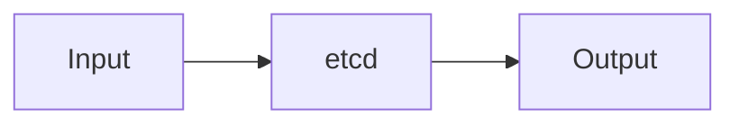

# etcd — A 2-Day Crash Course

etcd is a distributed key-value store — it is the brain of every Kubernetes cluster, the single source of truth for all cluster state.

**Prerequisite:** Work through `Kubernetes.md` first. You need a mental model of how the control plane fits together before etcd's role clicks into place.

---

## Part 0 — Why etcd Exists

Kubernetes needs somewhere to store everything: which pods should run, which nodes exist, what services are configured, what secrets are present. That somewhere is etcd.

The hard part is not storing data — any database can do that. The hard part is storing data reliably across multiple machines so that no single crash corrupts or loses it. etcd solves this with the **Raft consensus algorithm**.

### Raft in plain terms

Raft organizes a cluster of nodes into one leader and several followers. Every write goes to the leader. The leader only confirms a write as committed once a majority of nodes — the quorum — have acknowledged it. If the leader dies, the remaining nodes elect a new one, and nothing is lost because the new leader already has all committed entries.

This is why etcd underpins Kubernetes instead of a simpler store: you get strong consistency guarantees even when machines fail.

### What K8s actually writes

Every `kubectl apply` you run lands in etcd. The API server translates your YAML into an entry. Controllers watch etcd for changes and reconcile the real world toward the desired state. Without etcd, there is no desired state — the cluster has no memory.

---

## Vocabulary

| Term | What it means |
|---|---|
| **Key-Value** | The storage model. You PUT a key with a value, you GET a key to retrieve a value. Keys are UTF-8 strings, values are arbitrary bytes. |
| **Raft** | The consensus protocol that keeps all cluster members agreeing on the same data, even under failure. |
| **Leader** | The one node in the cluster that accepts writes. There is exactly one at any moment. |
| **Follower** | A node that replicates the leader's log. It can serve reads but not writes. |
| **Quorum** | The minimum number of nodes that must agree for a write to commit. For a 3-node cluster, quorum is 2. For a 5-node cluster, quorum is 3. |
| **Watch** | A long-lived connection that streams key change events to a client in real time. Kubernetes controllers live on Watches. |
| **Lease** | A TTL-bound grant attached to keys. When the lease expires, the keys vanish. Used for leader election and heartbeats. |
| **Revision** | A monotonically increasing global integer. Every write bumps it. You can GET the state of the store at any past revision. |
| **Compaction** | Discarding old revisions to reclaim storage. Without periodic compaction, etcd's database grows unboundedly. |
| **Snapshot** | A point-in-time dump of the entire database, used for backup and disaster recovery. |

---




## DAY 1 — Getting Your Hands Dirty

### Install etcd locally

The easiest path on macOS:

```bash
brew install etcd
```

On Linux, grab the release tarball directly:

```bash
ETCD_VER=v3.5.13
curl -L https://github.com/etcd-io/etcd/releases/download/${ETCD_VER}/etcd-${ETCD_VER}-linux-amd64.tar.gz \
  -o /tmp/etcd.tar.gz
tar xzf /tmp/etcd.tar.gz -C /usr/local/bin --strip-components=1 \
  etcd-${ETCD_VER}-linux-amd64/etcd \
  etcd-${ETCD_VER}-linux-amd64/etcdctl
```

Start a single-node cluster and confirm it is running:

```bash
etcd --data-dir=/tmp/etcd-data &
etcdctl endpoint health
```

### Basic operations with etcdctl

`etcdctl` is the CLI client. Set `ETCDCTL_API=3` — the v2 API is deprecated and you do not want to accidentally use it.

```bash
export ETCDCTL_API=3

# Write a key
etcdctl put /config/app/env production

# Read it back
etcdctl get /config/app/env

# List all keys under a prefix
etcdctl get /config/ --prefix

# Delete a key
etcdctl del /config/app/env

# Overwrite and observe the revision bump
etcdctl put /config/app/env staging
etcdctl get /config/app/env --write-out=json | jq '.kvs[0].mod_revision'
```

### Watch in action

In one terminal run `etcdctl watch /config/app/env`, then in another run `etcdctl put /config/app/env production`. The watch terminal prints the event immediately. This is exactly what Kubernetes controllers do at scale — they hold watches against etcd and react to every change.

### Transactions — compare-and-set

etcd supports atomic transactions. This is how distributed locking and leader election work:

```bash
etcdctl txn <<EOF
compares:
value("/lock/leader") = ""

success requests:
put /lock/leader "node-1"

failure requests:
get /lock/leader
EOF
```

If the key is empty, the write succeeds. If another node already holds the lock, you get the current value back instead.

### Understanding Raft — what to watch

Start a 3-node cluster locally to see Raft in practice:

```bash
# Node 1
etcd --name node1 --data-dir /tmp/etcd1 \
  --listen-peer-urls http://127.0.0.1:2380 \
  --listen-client-urls http://127.0.0.1:2379 \
  --initial-advertise-peer-urls http://127.0.0.1:2380 \
  --advertise-client-urls http://127.0.0.1:2379 \
  --initial-cluster node1=http://127.0.0.1:2380,node2=http://127.0.0.1:2382,node3=http://127.0.0.1:2384 \
  --initial-cluster-state new &
```

Node 2 and Node 3 follow the same pattern on ports 2381/2382 and 2383/2384.

Check cluster membership:

```bash
etcdctl --endpoints=127.0.0.1:2379 member list
```

Kill the leader and watch the remaining two nodes elect a new one in about 1–2 seconds. That election timeout is configurable — tighter means faster failover but more false positives on a slow network.

### Authentication

By default, etcd has no authentication. In any environment beyond your laptop, turn it on.

```bash
# Create the root user first — you need this to enable auth
etcdctl user add root
# Enter a password when prompted

# Enable authentication
etcdctl auth enable

# All subsequent commands need credentials
etcdctl --user root:yourpassword endpoint health

# Create a role with limited access
etcdctl --user root:yourpassword role add reader
etcdctl --user root:yourpassword role grant-permission reader read /config/ --prefix

# Create a non-root user and bind the role
etcdctl --user root:yourpassword user add app-reader
etcdctl --user root:yourpassword user grant-role app-reader reader
```

⚠️ If you enable auth without first setting a root password you will lock yourself out. Always create the root user before running `auth enable`.

---

## DAY 2 — Operations, Resilience, and Production

### Backup — etcd snapshot

A snapshot captures the full database state at a point in time. This is your recovery lifeline.

```bash
etcdctl snapshot save /backup/etcd-$(date +%Y%m%d%H%M%S).db
```

Verify the snapshot before relying on it:

```bash
etcdctl snapshot status /backup/etcd-20240601120000.db --write-out=table
```

The output shows revision, total keys, total size, and hash. The hash is what you want to check against the source to confirm integrity.

### Restore from snapshot

Restoration does not hot-reload a running cluster. You stop etcd, restore, then restart.

```bash
# Stop etcd first, then:
etcdctl snapshot restore /backup/etcd-20240601120000.db \
  --name node1 \
  --initial-cluster node1=http://127.0.0.1:2380 \
  --initial-cluster-token etcd-cluster-1 \
  --initial-advertise-peer-urls http://127.0.0.1:2380 \
  --data-dir /tmp/etcd-restored
```

Then start etcd pointing at the restored data directory. Each member in a multi-node cluster needs its own restore run with its own `--name` and peer URLs.

### Compaction

Every write creates a new revision. Old revisions accumulate. Compact them periodically:

```bash
# Get the current revision
REV=$(etcdctl endpoint status --write-out=json | jq '.[0].Status.header.revision')

# Compact everything older than the current revision
etcdctl compact $REV
```

In production, let etcd auto-compact by setting `--auto-compaction-mode=periodic` and `--auto-compaction-retention=1h` on startup. This keeps the last hour of history and discards everything older automatically.

### Defragmentation

Compaction marks space as free but does not return it to the OS. Defrag does. Run it during a maintenance window, one node at a time to avoid pausing the whole cluster:

```bash
etcdctl defrag --endpoints=http://node1:2379
etcdctl defrag --endpoints=http://node2:2379
etcdctl defrag --endpoints=http://node3:2379
```

### TLS

Production etcd should use mutual TLS — both client-to-server and peer-to-peer.

Generate a CA and certificates using `cfssl` or `openssl`. Then start etcd with:

```bash
etcd \
  --cert-file=/etc/etcd/tls/server.crt \
  --key-file=/etc/etcd/tls/server.key \
  --trusted-ca-file=/etc/etcd/tls/ca.crt \
  --client-cert-auth \
  --peer-cert-file=/etc/etcd/tls/peer.crt \
  --peer-key-file=/etc/etcd/tls/peer.key \
  --peer-trusted-ca-file=/etc/etcd/tls/ca.crt \
  --peer-client-cert-auth
```

Connect with:

```bash
etcdctl \
  --cacert=/etc/etcd/tls/ca.crt \
  --cert=/etc/etcd/tls/client.crt \
  --key=/etc/etcd/tls/client.key \
  endpoint health
```

⚠️ Kubernetes clusters created by kubeadm already have etcd TLS configured. Never overwrite those certificates without a full backup in hand.

### Monitoring

etcd exposes Prometheus metrics at `/metrics` on port 2381 by default.

Key metrics to watch:

| Metric | Alert threshold | What it means |
|---|---|---|
| `etcd_server_leader_changes_seen_total` | > 3 in 1 hour | Leader elections are happening too often — network or latency issue |
| `etcd_disk_wal_fsync_duration_seconds` | p99 > 10ms | Disk is too slow for etcd |
| `etcd_disk_backend_commit_duration_seconds` | p99 > 25ms | Database commits are lagging |
| `etcd_mvcc_db_total_size_in_bytes` | > 6 GB | Approaching the default 8 GB quota |
| `etcd_server_proposals_failed_total` | Any sustained increase | Cluster is losing quorum intermittently |

The `etcd_disk_wal_fsync_duration_seconds` metric is the most revealing signal of a misconfigured or underpowered host. etcd is designed for fast SSDs. Put it on spinning rust and every write suffers.

### Disaster recovery — lost quorum

If you lose more than half your nodes and have no healthy members:

1. Pick the most up-to-date surviving member (check `etcdctl endpoint status` if any member responds).
2. Force-create a new single-member cluster from that member's data:

```bash
etcd --force-new-cluster --data-dir=/var/lib/etcd
```

3. Verify the data looks correct, then add the other members back one by one.

⚠️ `--force-new-cluster` is destructive. It discards all peer information. Use it only when the cluster is completely unrecoverable and you have confirmed the data directory is the best available copy.

### Multi-member cluster operations

**Adding a member:**

```bash
etcdctl member add node4 --peer-urls=http://node4:2380
# Then start etcd on node4 with --initial-cluster-state=existing
```

**Removing a failed member:**

```bash
etcdctl member list
etcdctl member remove <member-id>
```

Remove before replacing. If you bring a replacement with the same name but a stale data directory into a live cluster, Raft will reject it.

**Cluster size rules:** Run 3 or 5 members, never 2 or 4. An even number gives you no advantage — a 4-node cluster tolerates the same 1 failure as a 3-node cluster but costs more. A 5-node cluster tolerates 2 simultaneous failures.

---

## Worked Example — Backing Up and Restoring a Kubernetes Cluster's etcd

This is the scenario you will face when a control plane goes wrong.

### Step 1 — Locate the etcd pod and its TLS paths

```bash
kubectl -n kube-system get pods | grep etcd
kubectl -n kube-system describe pod etcd-controlplane | grep -A5 "Command:"
```

Note the values of `--cert-file`, `--key-file`, and `--trusted-ca-file`. You need these to connect.

### Step 2 — Take the snapshot

```bash
ETCDCTL_API=3 etcdctl snapshot save /opt/backup/etcd.db \
  --endpoints=https://127.0.0.1:2379 \
  --cacert=/etc/kubernetes/pki/etcd/ca.crt \
  --cert=/etc/kubernetes/pki/etcd/server.crt \
  --key=/etc/kubernetes/pki/etcd/server.key
```

Verify:

```bash
ETCDCTL_API=3 etcdctl snapshot status /opt/backup/etcd.db --write-out=table
```

### Step 3 — Simulate a disaster (test environment only)

```bash
kubectl delete namespace staging
```

### Step 4 — Restore

Stop the API server by moving its static pod manifest out of the kubelet watch path:

```bash
mv /etc/kubernetes/manifests/kube-apiserver.yaml /tmp/
mv /etc/kubernetes/manifests/etcd.yaml /tmp/
```

Restore the snapshot:

```bash
ETCDCTL_API=3 etcdctl snapshot restore /opt/backup/etcd.db \
  --data-dir=/var/lib/etcd-restored \
  --name=controlplane \
  --initial-cluster=controlplane=https://127.0.0.1:2380 \
  --initial-cluster-token=etcd-cluster-1 \
  --initial-advertise-peer-urls=https://127.0.0.1:2380
```

Edit the etcd static pod manifest to point `--data-dir` at `/var/lib/etcd-restored`, then move both manifests back:

```bash
mv /tmp/etcd.yaml /etc/kubernetes/manifests/
mv /tmp/kube-apiserver.yaml /etc/kubernetes/manifests/
```

Wait for the API server and etcd to come back up, then confirm the staging namespace has returned.

---

## Pitfalls

**Disk latency kills clusters.** etcd writes to disk on every committed entry. P99 fsync latency above 10ms starts causing leader elections. Use NVMe SSDs on dedicated volumes. Never share a disk with high-write workloads.

**Forgetting to compact.** Without compaction the database grows until it hits the default 8 GB quota and etcd goes read-only — Kubernetes deployments stall and the API server errors. Set `--auto-compaction-mode=periodic --auto-compaction-retention=1h` from day one.

**Even-numbered clusters.** Two nodes is worse than one — if they disagree you have no quorum. Four gives the same fault tolerance as three at higher cost. Use odd numbers: 3 or 5.

**Not testing restores.** A backup you have never restored is a backup you do not trust. Restore into a throwaway environment quarterly.

**Restoring without stopping the API server.** If you restore etcd while the API server is still running, it may overwrite your restored state from its in-memory cache. Always stop the API server first.

**Watching from the wrong revision.** Without `--rev`, a watch delivers events from now onward only. If you need to catch up after a disconnect, pass `--rev` explicitly.

**etcd vs. application data.** etcd is not a general-purpose database. Store only control-plane state here — never bulk data, logs, or metrics.

---

## Quick Reference

```bash
# Health check
etcdctl endpoint health --endpoints=https://127.0.0.1:2379 \
  --cacert=ca.crt --cert=client.crt --key=client.key

# Cluster status — shows leader, revision, DB size
etcdctl endpoint status --write-out=table

# Member list
etcdctl member list

# Snapshot
etcdctl snapshot save /backup/snapshot.db

# Snapshot verify
etcdctl snapshot status /backup/snapshot.db --write-out=table

# Compact to current revision
REV=$(etcdctl endpoint status --write-out=json | jq '.[0].Status.header.revision')
etcdctl compact $REV

# Defrag one member at a time
etcdctl defrag --endpoints=https://node1:2379

# Watch a key
etcdctl watch /config/myapp

# List all keys
etcdctl get "" --prefix --keys-only

# Get a key with full metadata
etcdctl get /config/myapp --write-out=json | jq .

# Add a member
etcdctl member add node4 --peer-urls=http://node4:2380

# Remove a member
etcdctl member remove <member-id>

# Enable auth
etcdctl user add root
etcdctl auth enable
```

---


## Terminal Demo

```terminal-demo
# etcdctl@control-plane ~ %

$ etcdctl version
etcdctl version: 3.5.12
API version: 3.5

$ etcdctl endpoint status --cluster -w table
+---------------------------+------------------+---------+---------+-----------+
|         ENDPOINT          |        ID        | VERSION | DB SIZE | IS LEADER |
+---------------------------+------------------+---------+---------+-----------+
| https://10.0.1.10:2379    | 8e9e05c52164694d | 3.5.12  |  245 MB |     true  |
| https://10.0.1.11:2379    | 4aef52c8b2e3a1f0 | 3.5.12  |  245 MB |    false  |
| https://10.0.1.12:2379    | 92d5c2a7f1b8e4d3 | 3.5.12  |  244 MB |    false  |
+---------------------------+------------------+---------+---------+-----------+

$ etcdctl endpoint health --cluster -w table
+---------------------------+--------+------------+-------+
|         ENDPOINT          | HEALTH |    TOOK    | ERROR |
+---------------------------+--------+------------+-------+
| https://10.0.1.10:2379    |   true |  2.1234ms  |       |
| https://10.0.1.11:2379    |   true |  2.4567ms  |       |
| https://10.0.1.12:2379    |   true |  3.1234ms  |       |
+---------------------------+--------+------------+-------+

$ etcdctl get /registry/namespaces --prefix --keys-only | head -5
/registry/namespaces/default
/registry/namespaces/kube-system
/registry/namespaces/production
/registry/namespaces/monitoring

$ etcdctl snapshot save /backup/etcd-snapshot-20260602.db
Snapshot saved at /backup/etcd-snapshot-20260602.db

$ etcdctl snapshot status /backup/etcd-snapshot-20260602.db -w table
+---------+----------+------------+------------+
|  HASH   | REVISION | TOTAL KEYS | TOTAL SIZE |
+---------+----------+------------+------------+
| a1b2c3d |  4567890 |      12345 |     245 MB |
+---------+----------+------------+------------+

$ etcdctl compact 4567800
compacted revision 4567800

$ etcdctl defrag --cluster
Finished defragmenting etcd member[https://10.0.1.10:2379]
Finished defragmenting etcd member[https://10.0.1.11:2379]
Finished defragmenting etcd member[https://10.0.1.12:2379]
```

---

## Quick Quiz

Test your understanding with these rapid-fire questions (answers hidden):

<details>
<summary>1. What is the ONE core problem that etcd solves?</summary>
Re-read Part 0 — the mental model section. If you can explain the "why" in one sentence, you understand the foundation.
</details>

<details>
<summary>2. Name the 3 most important terms from the vocabulary section.</summary>
Review Part 1. These are the building blocks every conversation about etcd uses.
</details>

<details>
<summary>3. What is the first thing you would set up on Day 1?</summary>
Check the Day 1 section — the very first hands-on step that gets you a working result.
</details>

<details>
<summary>4. What is the most common production pitfall with etcd?</summary>
Review the Common Pitfalls section. The first item listed is typically the most frequently encountered.
</details>

<details>
<summary>5. How does etcd compare to its closest alternative?</summary>
Check the Comparison Matrix below — focus on the key differentiating row.
</details>


## Comparison Matrix

| Dimension | etcd | ZooKeeper | Consul KV |
|-----------|------|-----------|-----------|
| **Primary use case** | Core strength of etcd | Core strength of ZooKeeper | Core strength of Consul KV |
| **Learning curve** | Moderate | Varies | Varies |
| **Community/ecosystem** | Active | Active | Growing |
| **Operational complexity** | Medium | Varies | Varies |
| **Best for** | See Part 0 | Different tradeoffs | Different tradeoffs |

> **How to read this matrix:** no tool wins on every dimension. Pick based on your specific constraints — team expertise, existing infrastructure, scale requirements, and compliance needs. The right choice is the one that fits your context, not the one with the most checkmarks.

## Next Steps

- `Kubernetes.md` — now that you understand etcd, revisit the control plane components and trace how the API server, scheduler, and controllers all converge on etcd as their shared state.
- `Vault.md` — Kubernetes Secrets live in etcd in base64, which is not encryption. HashiCorp Vault integrates with Kubernetes to manage secrets properly and can also be backed by etcd.
- `PostgreSQL.md` — when you outgrow etcd's intentional constraints, PostgreSQL is the next store to reach for. Understanding both helps you choose the right tool for each layer of a system.

---

## Recommended learning resources

**YouTube channels & playlists:**
- [CNCF — etcd Deep Dive (KubeCon talks)](https://www.youtube.com/@caboread) — maintainer-led sessions on Raft consensus, compaction, defragmentation, and disaster recovery
- [Hussein Nasser — Consensus and Distributed Systems](https://www.youtube.com/@haboread) — explains Raft, leader election, and linearizable reads in the context etcd operates in
- [TechWorld with Nana — Kubernetes Architecture](https://www.youtube.com/@TechWorldwithNana) — covers etcd's role as the Kubernetes control plane backing store
- [Fireship — Distributed Systems in 100 Seconds](https://www.youtube.com/@Fireship) — quick conceptual grounding before diving into etcd specifics
- [CMU Database Group — Distributed Consensus](https://www.youtube.com/@CMUDatabaseGroup) — academic treatment of Raft and Paxos that deepens your understanding of etcd's guarantees

**Official docs & blogs:**
- [etcd Official Documentation](https://etcd.io/docs/) — operations guide, API reference, clustering, authentication, and disaster recovery procedures
- [etcd Learning Resources (etcd.io)](https://etcd.io/docs/v3.5/learning/) — visual explanations of Raft, data model, and client design

---

## The Mantra

Your cluster is only as healthy as its etcd. Back up before you touch the control plane. Compact before the quota bites. Test the restore before the incident forces you to. And when something goes wrong at 2 AM, remember: the data is almost certainly still there — you just need the last good snapshot and four commands to bring it back.

## Top 10 Interview Questions

<details>
<summary><strong>Q: What is etcd and why does Kubernetes depend on it?</strong></summary>

etcd is a distributed key-value store that provides strong consistency via the Raft consensus protocol. Kubernetes stores all cluster state in etcd — pods, services, deployments, secrets, configmaps, RBAC rules, everything. etcd's consistency guarantees ensure that all control plane components see the same cluster state. If etcd fails, the Kubernetes control plane cannot function — no new scheduling, no API responses, no updates. This makes etcd the most critical component in a Kubernetes cluster.

</details>

<details>
<summary><strong>Q: How does the Raft consensus protocol work in etcd?</strong></summary>

Raft elects a leader that handles all writes. The leader replicates writes to followers — once a majority (quorum) acknowledges, the write is committed. If the leader fails, followers hold an election to choose a new leader. This ensures consistency: a committed write is guaranteed to survive any single node failure. Key parameters: election timeout (how long a follower waits before starting an election) and heartbeat interval. The quorum formula: (N/2)+1 — a 3-node cluster tolerates 1 failure, 5-node tolerates 2.

</details>

<details>
<summary><strong>Q: How do you size an etcd cluster for production?</strong></summary>

Use 3 nodes for most production clusters (tolerates 1 failure) or 5 nodes for critical clusters (tolerates 2 failures). Never use even numbers (split-brain risk). Hardware: SSDs are mandatory (etcd is write-heavy with fsync), 8GB+ RAM, dedicated disks (not shared with other workloads). Network latency between nodes should be < 10ms. etcd performance degrades with large values (> 1MB) and many watchers. Monitor: wal_fsync_duration, backend_commit_duration, and database size.

</details>

<details>
<summary><strong>Q: What are the common failure modes of etcd and how do you handle them?</strong></summary>

Leader failure: Raft elects a new leader automatically (seconds of unavailability). Quorum loss: if majority of nodes are down, etcd is read-only — restore from backup or rejoin recovered nodes. Disk full: etcd stops accepting writes — compact and defrag, or expand disk. Slow disk: high fsync latency causes leader elections and instability — use SSDs, avoid shared disks. Database too large: compact old revisions, enable auto-compaction. Monitor: mvcc_db_total_size, leader changes, and failed proposals.

</details>

<details>
<summary><strong>Q: How do you backup and restore etcd?</strong></summary>

Use etcdctl snapshot save for point-in-time backups. Automate with a cron job or Kubernetes CronJob. Store backups in external storage (S3) encrypted at rest. For restore: stop all etcd members, restore the snapshot to each member using etcdctl snapshot restore (each member gets its own data directory), and restart. Important: after restore, all members must restore from the same snapshot. For Kubernetes, etcd backup = entire cluster state backup. Test restores regularly.

</details>

<details>
<summary><strong>Q: What is the difference between etcd v2 and v3 API?</strong></summary>

v3 is the current API with significant improvements: flat binary keyspace (instead of hierarchical), lease-based TTL (instead of per-key TTL), transactions (multi-key atomic operations), more efficient storage (boltdb backend), and gRPC-based protocol. v3 also supports range queries and pagination, essential for large clusters. Kubernetes uses v3 exclusively. v2 is deprecated and removed in etcd 3.6+. Always use v3 API (etcdctl with ETCDCTL_API=3 environment variable).

</details>

<details>
<summary><strong>Q: How does etcd's watch mechanism work?</strong></summary>

Watch lets clients subscribe to changes on specific keys or key ranges. When a watched key changes, etcd pushes an event (PUT or DELETE) to the client in real-time. Kubernetes uses watches extensively — the controller manager watches for resource changes and reconciles. Watches are multiplexed over a single gRPC stream for efficiency. If a client disconnects, it can resume watching from a specific revision number to avoid missing events. etcd stores a configurable history of revisions for this purpose.

</details>

<details>
<summary><strong>Q: How do you secure etcd in production?</strong></summary>

Enable TLS for all communication: client-to-server and peer-to-peer (server-to-server). Use client certificate authentication (mutual TLS) — only clients with valid certificates can access etcd. Enable RBAC for fine-grained access control (Kubernetes uses a single root user, but multi-tenant setups need role-based restrictions). Network isolation: etcd should be accessible only from the Kubernetes control plane, not from worker nodes or external networks. Encrypt secrets at rest using Kubernetes encryption providers.

</details>

<details>
<summary><strong>Q: What is compaction and defragmentation in etcd?</strong></summary>

etcd stores all key revisions (history of every change). Compaction removes revisions older than a specified revision number — freeing logical space but not physical disk. Defragmentation reclaims the physical disk space after compaction. Enable auto-compaction (--auto-compaction-retention=1h for Kubernetes). Run defrag during maintenance windows — it briefly blocks reads/writes. Without regular compaction, the database grows unboundedly. Monitor mvcc_db_total_size and compare to actual key count.

</details>

<details>
<summary><strong>Q: How does etcd perform under network partitions?</strong></summary>

During a network partition, the side with the majority (quorum) continues operating normally — reads and writes succeed. The minority side becomes read-only (can serve stale reads if configured, but cannot write). When the partition heals, the minority side syncs from the leader. Key behaviour: etcd prioritises consistency over availability (CP in CAP theorem). A 3-node cluster with a network partition isolating 1 node continues serving; a partition isolating 2 nodes causes complete unavailability.

</details>

---

