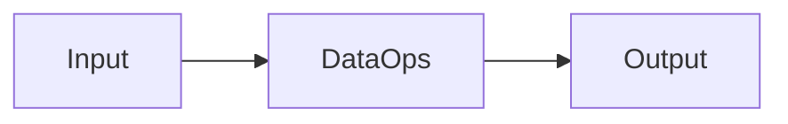

# DataOps — A 2-Day Crash Course

DataOps applies DevOps principles to data pipelines — version control, CI/CD, testing, monitoring, and automation for data engineering, so your pipelines are as reliable as your application deploys.

---

## Part 0 — Why DataOps Exists

Data pipelines break silently. Your application server throws a 500 and your alerting fires within seconds. Your ETL job fails at 2 AM, loads partial data, and nobody notices until a VP asks why Q3 revenue looks wrong three weeks later. That gap — between the reliability bar you hold your application code to and the reliability bar you actually hold your data to — is the problem DataOps solves.

The failure modes are specific and painful:

- **Stale dashboards.** A pipeline dependency changes upstream. Your transformation still runs, still writes rows, still looks healthy in your orchestrator. The numbers are just three days old and nobody knows.
- **Wrong ML predictions.** Your feature pipeline silently drops nulls differently than it did when you trained the model. The model is serving. The predictions degrade. You find out when a customer complains, not when the pipeline ran.
- **Regulatory violations.** GDPR, HIPAA, SOX — data lineage requirements mean you need to know exactly where a field came from, who transformed it, and when. Without DataOps practices, you cannot answer that question under audit.

The insight DataOps brings is simple: data pipelines are software. They deserve the same engineering discipline.

---

## Vocabulary

**Data Pipeline** — A sequence of steps that moves, transforms, or aggregates data from one or more sources to a destination. Can be batch (scheduled) or streaming (continuous).

**ETL / ELT** — Extract-Transform-Load versus Extract-Load-Transform. ETL transforms data before loading it into the warehouse; ELT loads raw data first and transforms it inside the warehouse using SQL. Modern cloud warehouses favor ELT because compute is cheap and raw data is valuable.

**Data Quality** — A measure of whether data is accurate, complete, consistent, timely, and valid for its intended use. Data quality is not binary — you define thresholds and test against them.

**Data Lineage** — The documented path of data from its origin through every transformation to its final destination. Answers: where did this field come from, and what touched it?

**Data Catalog** — A metadata repository that inventories your datasets, their schemas, owners, descriptions, lineage, and quality scores. Makes data discoverable and governed.

**Schema Evolution** — How you handle changes to the structure of your data over time — adding columns, renaming fields, changing types — without breaking downstream consumers.

**Idempotent Pipeline** — A pipeline that produces the same result regardless of how many times you run it for the same inputs. Essential for safe reruns and backfills.

**Data Contract** — A formal agreement between a data producer and a data consumer specifying the schema, semantics, SLAs, and quality guarantees of a dataset. Prevents unilateral breaking changes.

**SLA for Data** — A committed service level for a dataset: freshness (data updated within N minutes), completeness (at least X% of expected rows present), and accuracy (error rate below threshold).

**Orchestration** — Scheduling, sequencing, and monitoring pipeline execution. Handles dependencies between tasks, retries on failure, and alerting. Tools: Apache Airflow, Dagster, Prefect.

---




## DAY 1 — Foundations

### DataOps Principles

DataOps is not a tool — it is a set of practices. The core principles:

1. **Everything is code.** SQL transformations, pipeline definitions, schema declarations, quality checks — all in version control, all reviewed, all testable.
2. **Pipelines are deployable artifacts.** A data pipeline has a development environment, a staging environment, and a production environment. You do not deploy untested code directly to production data.
3. **Fail fast and visibly.** A pipeline that runs and writes bad data is worse than a pipeline that fails and alerts. Build quality gates that halt execution before bad data propagates.
4. **Idempotency by default.** Design every transformation so it can be safely rerun. Use `INSERT OVERWRITE` or `MERGE` patterns, not bare `INSERT`. This makes backfills and incident recovery tractable.
5. **Observability is not optional.** Instrument every pipeline for freshness, volume, schema shape, and anomalies. If you cannot tell in under five minutes whether your pipeline is healthy, you are flying blind.

### Pipeline Architecture — ELT vs ETL

**When to use ETL (transform before loading):**
- Legacy on-premises warehouses where compute is expensive
- Data that must be cleansed or masked before it touches the warehouse for compliance reasons
- Streaming pipelines where you process events in-flight (Kafka Streams, Flink)

**When to use ELT (transform inside the warehouse):**
- Cloud warehouses (Snowflake, BigQuery, Redshift, DuckDB) — this is the default today
- You want to preserve raw data for replay and auditing
- Your team knows SQL and wants transformations visible, version-controlled, and testable

The standard modern ELT stack:

```
Source Systems
    → Ingestion Layer (Fivetran, Airbyte, custom connectors)
    → Raw Layer (untouched source data, append-only, immutable)
    → Staging Layer (light cleaning, type casting, deduplication)
    → Intermediate Layer (business logic, joins, aggregations)
    → Mart Layer (wide tables optimized for reporting and ML features)
```

Each layer is materialized as tables or views in your warehouse. The transformation logic lives in SQL files managed by dbt or a similar tool.

### Orchestration — Airflow and Dagster

**Apache Airflow** is the industry default. You define pipelines as Directed Acyclic Graphs (DAGs) in Python. Each node is a task; edges define dependencies. Airflow handles scheduling, retries, and a UI for monitoring run history.

```python
from airflow import DAG
from airflow.operators.python import PythonOperator
from datetime import datetime

with DAG("ingest_orders", start_date=datetime(2024, 1, 1), schedule="@daily") as dag:
    extract = PythonOperator(task_id="extract", python_callable=extract_orders)
    transform = PythonOperator(task_id="transform", python_callable=transform_orders)
    load = PythonOperator(task_id="load", python_callable=load_to_warehouse)

    extract >> transform >> load
```

Airflow's weaknesses: it conflates orchestration with execution, the scheduler is a bottleneck at scale, and local development is painful.

**Dagster** addresses these. Pipelines are defined as assets (the data outputs) rather than tasks (the operations). This makes lineage first-class and makes it easy to understand what data a run produces.

```python
from dagster import asset

@asset
def raw_orders():
    return extract_orders_from_api()

@asset
def cleaned_orders(raw_orders):
    return clean_and_validate(raw_orders)
```

Dagster also has built-in data quality integration, software-defined assets, and a local development experience that matches production.

**Prefect** sits between the two — Python-native, easy to run locally, cloud-managed orchestration available. Good choice for smaller teams.

### Data Testing with Great Expectations

Great Expectations is the standard framework for defining and running data quality tests. You express expectations about your data — row counts, column types, value ranges, null rates, referential integrity — and run them as part of your pipeline.

```python
import great_expectations as gx

context = gx.get_context()
datasource = context.sources.add_pandas("orders_source")
asset = datasource.add_dataframe_asset("orders")
batch = asset.add_batch_definition_whole_dataframe("full").get_batch(
    batch_parameters={"dataframe": df}
)

suite = context.suites.add(gx.ExpectationSuite("orders_suite"))
suite.add_expectation(
    gx.expectations.ExpectColumnValuesToNotBeNull(column="order_id")
)
suite.add_expectation(
    gx.expectations.ExpectColumnValuesToBeBetween(column="amount", min_value=0, max_value=100000)
)

results = batch.validate(suite)
assert results.success, f"Data quality checks failed: {results}"
```

Run these checks between your raw and staging layers. If they fail, halt the pipeline. Do not let bad data silently propagate.

### Version Control for Data Transformations

Store all SQL and transformation logic in Git. This is non-negotiable. The practices are the same as application code:

- Feature branches for new transformations
- Pull request reviews before merging to main
- CI runs tests against a staging warehouse on every PR
- Tagged releases for production deploys

dbt makes this natural. A dbt project is a directory of `.sql` files with a `dbt_project.yml`. You run `dbt run` to materialize models, `dbt test` to run quality checks, and `dbt docs generate` to publish lineage documentation. It integrates with Git workflows directly.

---

## DAY 2 — Production DataOps

### Data Quality Monitoring

Static tests (run once per pipeline) catch known problems. Monitoring catches drift over time.

The three dimensions to watch:

**Freshness** — Is the data as recent as it should be? If your orders table is supposed to update every 15 minutes and it has not been written to in 45 minutes, you want to know now, not when someone checks the dashboard.

**Volume** — Is the row count within expected bounds? A table that normally receives 50,000 rows per day and today received 200 rows either means your ingestion broke or something dramatic happened upstream. Both require investigation.

**Schema** — Did the shape of the data change? A new column is usually fine. A renamed column, a type change, or a dropped column can silently break downstream transformations.

Tools: Monte Carlo, Soda, Datafold, and dbt's built-in testing cover most of these. For smaller setups, custom SQL checks scheduled in Airflow with alerting to Slack or PagerDuty work fine.

### Data Contracts Between Teams

A data contract is a machine-readable specification owned by the data producer that defines what consumers can depend on. It includes:

- Schema definition (columns, types, constraints)
- Semantics (what the fields mean, how they are calculated)
- SLAs (freshness, availability, completeness guarantees)
- Breaking change policy (how much notice producers give before changing the schema)

Without contracts, your analytics team discovers that the backend team renamed `user_id` to `account_id` when dashboards break on Monday morning. With contracts, that change goes through a review process, consumers are notified, and the migration is coordinated.

A minimal contract in YAML:

```yaml
name: orders
version: 1.2.0
owner: data-platform@company.com
sla:
  freshness_minutes: 30
  completeness_percent: 99.5
schema:
  - name: order_id
    type: string
    nullable: false
    unique: true
  - name: amount
    type: numeric
    nullable: false
    description: "Order total in USD cents"
breaking_change_policy: "30 days notice via Slack #data-contracts"
```

Tools like DataHub, OpenMetadata, and Schemata support contract management at scale.

### Schema Evolution Strategies

Schemas change. The question is whether they change in ways that break consumers.

**Safe changes (non-breaking):**
- Adding a nullable column
- Adding a new table
- Relaxing a constraint (increasing a varchar length)

**Breaking changes:**
- Renaming a column
- Changing a column's type
- Dropping a column
- Changing the semantics of a field (same name, different calculation)

**Strategies for managing evolution:**

*Expand-contract pattern:* Add the new column alongside the old one. Migrate consumers to the new column. Deprecate and drop the old column after a migration window. This is the safest approach.

*Schema versioning:* Maintain multiple versions of a dataset (e.g., `orders_v1`, `orders_v2`). Consumers opt in to migrations. Works well for major breaking changes.

*Schema registry:* For streaming data (Kafka, Kinesis), use a schema registry (Confluent Schema Registry, AWS Glue Schema Registry) to enforce compatibility rules on every message. Producers cannot publish a breaking schema without registry approval.

### CI/CD for Data Pipelines

A CI/CD pipeline for data engineering:

```
PR opened
  → Lint SQL (sqlfluff)
  → Run dbt compile (validate SQL syntax, resolve references)
  → Run dbt test against staging warehouse
  → Run Great Expectations checks against sample data
  → Review data lineage diff (Datafold or dbt Cloud)
  → Reviewer approves

Merge to main
  → Deploy to staging environment
  → Run full integration tests
  → Generate and publish dbt docs
  → Deploy to production on schedule or manual trigger
```

The key is having a staging warehouse that mirrors production structure so you can test transformations against real-like data before they touch production.

### Data Lineage and Cataloging

Lineage answers: for this dashboard number, what is the chain of transformations from raw source data to final output?

dbt generates lineage automatically from your SQL — it parses `ref()` calls and builds a DAG you can visualize. For cross-tool lineage (Airflow → dbt → BI tool), you need a metadata platform.

**DataHub** (open source, LinkedIn-origin) and **OpenMetadata** (open source) are the main options. They ingest metadata from your warehouse, dbt, Airflow, and BI tools and stitch together end-to-end lineage.

**Apache Atlas** is the enterprise option, often used in Hadoop/Cloudera environments.

A catalog serves double duty: lineage for debugging and governance, plus discovery for analysts. When someone asks "is there a table with customer lifetime value?", the catalog should answer that question without a Slack message to the data team.

### DataOps vs DevOps vs MLOps

|                    | DevOps                       | DataOps                            | MLOps                                    |
|--------------------|------------------------------|------------------------------------|------------------------------------------|
| Primary artifact   | Application code             | Data pipelines                     | ML models                                |
| Version controlled | Code                         | Code + data schemas                | Code + models + data                     |
| Testing target     | Functions, APIs              | Data quality, transformations      | Model performance, data drift            |
| Deploy target      | Services                     | Warehouse tables                   | Model serving endpoints                  |
| Key metric         | Deployment freq, MTTR        | Data freshness, quality score      | Model accuracy, prediction latency       |
| Failure mode       | Service outage (visible)     | Bad data (silent)                  | Model degradation (delayed)              |

DataOps and MLOps overlap heavily — MLOps depends on reliable feature pipelines, which is a DataOps problem. In practice, a data platform team owns DataOps, and the ML team owns the model training and serving layer on top of it.

### Observability for Data

The same three pillars — metrics, logs, traces — apply to data systems, adapted:

**Metrics** — Freshness lag, row counts, null rates, schema change frequency, pipeline duration, SLA breach rate. Emit these to your observability platform (Datadog, Grafana, CloudWatch).

**Logs** — Structured pipeline logs with job ID, dataset name, row count written, duration, and error details. Queryable logs let you answer "why did this table not update last Tuesday?" without guesswork.

**Traces** — End-to-end lineage of a specific pipeline run: what ran, in what order, how long each step took, where it failed. Dagster and Prefect surface this natively. Airflow requires more manual instrumentation.

**Alerting rules to implement first:**
- Table not updated within SLA window → page on-call
- Row count drops more than 20% day-over-day → page or Slack alert
- Schema column dropped or type changed → Slack alert, require human review
- Quality check failure rate exceeds threshold → block downstream pipelines

---

## Worked Example — DataOps Pipeline for an Analytics Warehouse

**Scenario:** You run an e-commerce company. You want a reliable daily `orders_mart` table in Snowflake that feeds your executive dashboard and the ML team's purchase prediction model.

**Stack:** Airbyte (ingestion) → Snowflake (warehouse) → dbt (transformation) → Great Expectations (quality) → Airflow (orchestration) → DataHub (catalog + lineage) → Grafana (observability).

**Pipeline structure:**

```
[Postgres: orders, customers, products]
    → Airbyte sync (every 15 min, append-only raw tables)
    → raw.orders, raw.customers, raw.products

[dbt DAG]
    staging.stg_orders           (deduplicate, cast types, filter test orders)
    staging.stg_customers        (normalize names, validate email format)
    intermediate.int_orders_enriched  (join orders + customers + products)
    marts.orders_mart            (aggregate metrics, add LTV, cohort fields)

[Great Expectations]
    After stg_orders: assert order_id unique, amount > 0, created_at not null
    After orders_mart: assert row count within 10% of yesterday's count
    On failure: stop DAG, alert #data-incidents

[Airflow DAG: orders_pipeline, schedule @daily 06:00 UTC]
    airbyte_sync >> dbt_run_staging >> ge_checks_staging
    >> dbt_run_intermediate >> dbt_run_mart >> ge_checks_mart
    >> update_data_catalog >> notify_success

[DataHub]
    Ingests dbt manifest on each run
    Publishes column-level lineage: postgres.orders.amount → orders_mart.total_revenue
    Tracks schema versions and change history

[Grafana: Data Pipeline Health dashboard]
    orders_mart freshness (last updated X minutes ago)
    daily row count trend
    GE check pass rate
    Pipeline duration p50/p95
```

**What DataOps practices this demonstrates:**
- Every transformation is in Git, reviewed via PR before deploy
- Quality gates halt the pipeline — bad data never reaches the mart
- Lineage is automatically published — you can trace any mart column back to the source table
- Freshness and volume metrics feed a dashboard the team checks daily
- The pipeline is idempotent — you can rerun any day's DAG and get the same result

---

## Pitfalls

**Treating data pipelines as scripts, not services.** A single Python file that runs as a cron job with no tests, no monitoring, and no version control is technical debt. The day it fails is the day you discover you cannot answer "what did this thing actually do?"

**Testing only the happy path.** Your quality checks pass when data looks normal. What happens when your upstream API returns an empty response? When a new product category appears with unexpected characters? Test for nulls, edge cases, and schema drift — not just valid data.

**No staging environment for pipelines.** Running untested transformations against production data is the data equivalent of deploying straight to prod. Set up a staging warehouse, even a small one.

**Ignoring schema evolution until it breaks something.** Schema changes in upstream systems are inevitable. Build the expand-contract pattern into your process before you need it, not after a breakage forces you to.

**Centralized bottleneck ownership.** If one person owns all pipelines, you have a bus factor of one and a review bottleneck. Distribute ownership with clear data contracts between teams.

**Alert fatigue from low-signal checks.** If every minor volume fluctuation pages the on-call, people stop responding. Calibrate thresholds on historical variance, not arbitrary round numbers.

⚠️ **Silent failure is the default.** A pipeline that errors and stops is safer than a pipeline that runs and writes wrong data. Design your error handling to be loud, not quiet.

---

## Quick Reference

### DataOps Checklist

**Pipeline Design**
- [ ] Pipeline is idempotent (safe to rerun for any date range)
- [ ] Raw data is preserved append-only before any transformation
- [ ] Each transformation layer has a clear, single responsibility
- [ ] Schema is declared and version-controlled

**Quality**
- [ ] Column-level expectations defined for each model
- [ ] Row count bounds established from historical data
- [ ] Quality checks halt the pipeline on failure (not just log a warning)
- [ ] Freshness SLA defined and monitored

**Versioning and CI/CD**
- [ ] All SQL and pipeline code in Git
- [ ] PR required to merge to main
- [ ] CI runs dbt compile + dbt test on every PR
- [ ] Staging environment exists and is tested before production deploy

**Observability**
- [ ] Freshness metric emitted and alerted on
- [ ] Volume metric emitted and alerted on
- [ ] Schema change events logged and alerted on
- [ ] Lineage published after each run

**Contracts**
- [ ] Data contract defined for each dataset consumed by multiple teams
- [ ] Breaking change process documented and followed
- [ ] Consumer impact assessed before any schema change

### Tool Comparison

| Category          | Tool               | Strengths                                | Weaknesses                               |
|-------------------|--------------------|------------------------------------------|------------------------------------------|
| Orchestration     | Airflow            | Mature, large ecosystem, widely known    | Complex setup, scheduler bottleneck      |
| Orchestration     | Dagster            | Asset-centric, great DX, built-in lineage | Smaller ecosystem, newer               |
| Orchestration     | Prefect            | Easy Python, good cloud offering         | Less mature for large-scale              |
| Transformation    | dbt                | SQL-native, version control, docs, tests | SQL only, no native Python transforms    |
| Ingestion         | Airbyte            | Open source, 300+ connectors             | Resource-heavy self-hosted               |
| Ingestion         | Fivetran           | Reliable, managed, easy setup            | Expensive at scale                       |
| Quality           | Great Expectations | Flexible, integrates anywhere            | Verbose setup, learning curve            |
| Quality           | Soda               | Simpler syntax, managed cloud option     | Smaller community                        |
| Catalog / Lineage | DataHub            | Open source, deep lineage, active OSS    | Complex to self-host                     |
| Catalog / Lineage | OpenMetadata       | Clean UI, active community               | Younger project                          |
| Monitoring        | Monte Carlo        | Anomaly detection, managed SaaS          | Expensive                                |
| Schema contracts  | Schemata / Atlan   | Contract-first, CI integration           | Newer category, tooling still maturing   |

---


## Quick Quiz

Test your understanding with these rapid-fire questions (answers hidden):

<details>
<summary>1. What is the ONE core problem that DataOps solves?</summary>
Re-read Part 0 — the mental model section. If you can explain the "why" in one sentence, you understand the foundation.
</details>

<details>
<summary>2. Name the 3 most important terms from the vocabulary section.</summary>
Review Part 1. These are the building blocks every conversation about DataOps uses.
</details>

<details>
<summary>3. What is the first thing you would set up on Day 1?</summary>
Check the Day 1 section — the very first hands-on step that gets you a working result.
</details>

<details>
<summary>4. What is the most common production pitfall with DataOps?</summary>
Review the Common Pitfalls section. The first item listed is typically the most frequently encountered.
</details>

<details>
<summary>5. How does DataOps compare to its closest alternative?</summary>
Check the Comparison Matrix below — focus on the key differentiating row.
</details>


## Comparison Matrix

| Dimension | DataOps | Traditional ETL | Ad-hoc Pipelines |
|-----------|---------|-----------------|------------------|
| **Primary use case** | Core strength of DataOps | Core strength of Traditional ETL | Core strength of Ad-hoc Pipelines |
| **Learning curve** | Moderate | Varies | Varies |
| **Community/ecosystem** | Active | Active | Growing |
| **Operational complexity** | Medium | Varies | Varies |
| **Best for** | See Part 0 | Different tradeoffs | Different tradeoffs |

> **How to read this matrix:** no tool wins on every dimension. Pick based on your specific constraints — team expertise, existing infrastructure, scale requirements, and compliance needs. The right choice is the one that fits your context, not the one with the most checkmarks.

## Next Steps

These topics build directly on DataOps foundations — each one is a natural next layer:

- `MLOps.md` — How to apply DataOps principles to model training pipelines, feature stores, and model deployment. DataOps is a prerequisite.
- `Kafka.md` — Streaming pipelines require different DataOps practices: schema registries, consumer group monitoring, and offset management instead of batch freshness checks.
- `PostgreSQL.md` — Many ingestion pipelines start with Postgres as the source. Understanding WAL-based CDC (Change Data Capture) is key to reliable near-real-time ingestion.
- `Airflow.md` — Deep dive into Airflow DAG design, XCom patterns, dynamic task mapping, and production deployment on Kubernetes or MWAA.

---

## Recommended learning resources

**YouTube channels & playlists:**
- [DataTalksClub — Data Engineering Zoomcamp](https://www.youtube.com/@DataTalksClub) — free, structured course covering ingestion, transformation, orchestration, and data quality
- [Astronomer — Airflow and DataOps](https://www.youtube.com/@astronomerio) — pipeline orchestration patterns, data contracts, and DataOps best practices
- [dbt Labs — Analytics Engineering](https://www.youtube.com/@daborsen) — how transformation fits into the broader DataOps lifecycle
- [Seattle Data Guy — Data Engineering](https://www.youtube.com/@SeattleDataGuy) — practical data pipeline design, testing, and observability
- [Databricks — Data Engineering](https://www.youtube.com/@Databricks) — lakehouse architecture, Delta Lake, and production data pipeline patterns

**Official docs & blogs:**
- [DataOps Manifesto](https://dataopsmanifesto.org/) — the foundational principles of DataOps as a discipline
- [dbt Blog — Analytics Engineering](https://www.getdbt.com/blog) — data quality, testing, documentation, and the modern data stack

---

## The Mantra

> Your data pipeline is production software. Version it, test it, monitor it, and deploy it — or eventually it will lie to you at the worst possible moment.

## Top 10 Interview Questions

<details>
<summary><strong>Q: What is DataOps and how does it differ from traditional data engineering?</strong></summary>

DataOps applies DevOps principles to data pipelines: version control for transformations, CI/CD for pipeline deployment, automated testing for data quality, monitoring for pipeline health, and collaboration between data engineers, analysts, and scientists. Traditional data engineering focuses on building pipelines; DataOps focuses on operating them reliably. The shift: from 'it works on my machine' to 'it works in production, is tested, monitored, and can be rolled back.'

</details>

<details>
<summary><strong>Q: How do you implement CI/CD for data pipelines?</strong></summary>

Version control all pipeline code (SQL transforms, DAG definitions, schema migrations). On PR: run linting, unit tests (transform logic against sample data), and schema validation. On merge: deploy to staging, run integration tests against staging data, then promote to production. For dbt: dbt test in CI, dbt run in CD. For Airflow: validate DAG parsing, test task logic, deploy DAGs to the scheduler. Use blue-green deployments for zero-downtime pipeline updates.

</details>

<details>
<summary><strong>Q: What is data quality and how do you automate quality checks?</strong></summary>

Data quality dimensions: completeness (no missing values where required), accuracy (values match reality), consistency (no contradictions across datasets), timeliness (data arrives on schedule), uniqueness (no unwanted duplicates). Automate with: schema validation (column types, nullable constraints), statistical tests (value ranges, distributions), referential integrity checks, freshness checks (data updated within expected window). Tools: Great Expectations, dbt tests, Soda, Monte Carlo.

</details>

<details>
<summary><strong>Q: How do you handle schema evolution in data pipelines?</strong></summary>

Treat schemas as contracts: define explicit schemas for each dataset, version them, and enforce compatibility rules (backward, forward, full). Use Schema Registry for streaming (Kafka/Avro). For data warehouses, use migration tools (dbt schema changes, Flyway). Key patterns: additive-only changes (add columns, never remove), explicit deprecation periods (mark columns as deprecated before removal), and consumer notification (alert downstream teams before breaking changes).

</details>

<details>
<summary><strong>Q: What is a data catalog and why is it important for DataOps?</strong></summary>

A data catalog indexes all datasets with metadata: schema, ownership, lineage (where data comes from and goes to), quality metrics, and documentation. It enables: discoverability (find the right dataset without asking around), trust (quality scores and lineage show data reliability), and governance (who owns what, who has access). Tools: DataHub, Amundsen, OpenMetadata, Atlan. Without a catalog, data teams waste 30-40% of time finding and understanding data.

</details>

<details>
<summary><strong>Q: How do you implement data lineage tracking?</strong></summary>

Lineage tracks data flow from source to consumption: which tables feed which dashboards, which transforms touch which columns. Implement at: pipeline level (Airflow DAG dependencies), transform level (dbt model refs), and column level (which input columns produce which output columns). Tools: dbt lineage graph, OpenLineage (open standard), DataHub, Marquez. Lineage enables: impact analysis (what breaks if I change this table?), root cause analysis (where did bad data enter?), and compliance (data subject access requests).

</details>

<details>
<summary><strong>Q: What is the difference between ETL and ELT and when do you choose each?</strong></summary>

ETL (Extract-Transform-Load): transform data before loading into the warehouse — used when the warehouse has limited compute or when transformations must happen outside for compliance. ELT (Extract-Load-Transform): load raw data into the warehouse, then transform using the warehouse's compute power — modern approach enabled by powerful cloud warehouses (BigQuery, Snowflake, Redshift). Choose ELT for: cloud warehouses (cheaper compute), iterative analysis (raw data is preserved), and dbt-based workflows.

</details>

<details>
<summary><strong>Q: How do you monitor data pipelines in production?</strong></summary>

Monitor: pipeline execution (DAG/task success/failure, duration, retries), data freshness (when was the table last updated), data quality (automated test results over time), resource usage (compute, storage, cost), and SLA compliance (did the data arrive by the committed time). Alert on: pipeline failure, data freshness breach, quality test failure, and cost anomaly. Tools: Airflow metrics to Prometheus/Grafana, Monte Carlo for data observability, or custom checks.

</details>

<details>
<summary><strong>Q: What is a data mesh and how does it relate to DataOps?</strong></summary>

Data mesh is an organisational paradigm where domain teams own and publish their data as products, rather than a centralised data team owning all pipelines. Each domain applies DataOps practices (CI/CD, quality, monitoring) to its data products. A platform team provides self-service infrastructure (compute, storage, catalog, governance). DataOps is the 'how' (practices and tooling); data mesh is the 'who' (organisational structure). Data mesh does not work without strong DataOps practices within each domain team.

</details>

<details>
<summary><strong>Q: How do you handle data pipeline testing at different levels?</strong></summary>

Unit tests: test individual transform functions with sample data (fast, run in CI). Integration tests: test pipeline end-to-end with test data in a staging environment (slower, run on merge). Contract tests: validate that upstream data matches expected schema and quality (run on data arrival). Smoke tests: after production deployment, verify key outputs are correct (run post-deploy). Regression tests: compare current outputs against known-good outputs for the same inputs. Layer all five for comprehensive coverage.

</details>

---

