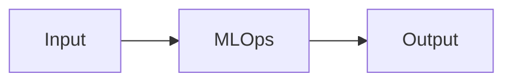

# MLOps — A 2-Day Crash Course

MLOps is DevOps for machine learning — versioning data and models, automating training pipelines, monitoring model drift, and deploying models reliably to production.

---

## Part 0 — Why MLOps Exists

ML in notebooks doesn't survive production — MLOps bridges the gap between data science experiments and reliable production systems.

You've trained a model. It works great on your laptop. You push it to production and three months later it's quietly giving wrong answers — no one noticed until customers complained. That's the world before MLOps.

The gap is real: data scientists optimize for accuracy; software engineers optimize for reliability; operations teams optimize for uptime. MLOps is the discipline that forces all three to speak the same language. Without it, you get:

- Models deployed once and never retrained as the world changes
- No way to reproduce last quarter's model when regulators ask
- Training code that works on one machine and silently fails on another
- No visibility into whether the production model is still performing

MLOps doesn't slow you down. Done right, it's the thing that lets you ship models faster and with more confidence.

---

## Vocabulary

**Feature Store** — A centralized repository for computed features. You compute a feature once (say, "30-day rolling average transaction amount") and reuse it across training and serving. Prevents training/serving skew — the silent killer of ML systems.

**Model Registry** — A versioned catalog of trained models with metadata: who trained it, on what data, with what hyperparameters, and what evaluation metrics. Think of it as Git for model artifacts.

**Training Pipeline** — An automated, reproducible workflow that takes raw data, runs preprocessing, trains a model, evaluates it, and registers it if it passes quality gates. Not a notebook. A pipeline.

**Serving — Batch** — Running predictions on a large dataset offline, writing results somewhere. Use this when you don't need real-time answers — fraud pre-screening, recommendation pre-computation, churn scoring overnight.

**Serving — Real-time** — Returning a prediction within milliseconds of receiving a request. Use this for fraud detection at checkout, content ranking, dynamic pricing. Latency becomes a first-class concern.

**Model Drift — Data Drift** — The statistical distribution of input features shifts. The model was trained on 2022 data; it's now 2024 and user behavior has changed. Input looks different from what the model expects.

**Model Drift — Concept Drift** — The relationship between features and the target changes. Same inputs, different correct outputs. "Spam" now means something different than it did five years ago.

**A/B Testing** — Routing a fraction of live traffic to a new model while the old model handles the rest. You compare outcomes — click-through rate, conversion, error rate — between the two groups before fully switching over.

**Experiment Tracking** — Logging every training run: parameters, metrics, code version, data version, artifacts. Lets you answer "why did last week's model outperform this week's?" without guessing.

**ML Pipeline** — The end-to-end directed acyclic graph of steps: ingest → preprocess → featurize → train → evaluate → register → deploy. Automating this is the core of MLOps.

**Feature Engineering** — Transforming raw data into inputs a model can use. Aggregations, encodings, embeddings, normalization. The quality of your features matters more than the choice of model.

**Shadow Deployment** — Running a new model alongside the production model, sending it the same traffic, but not using its predictions. You collect its outputs and compare them to the production model's before you commit to switching.

---




## DAY 1 — The MLOps Lifecycle

### The Lifecycle

```
Data → Features → Train → Evaluate → Register → Deploy → Monitor → (retrain)
```

Every arrow is a place where things can silently break. MLOps makes each arrow explicit, tested, and observable.

**Data** — Raw data ingestion with lineage tracking. You need to know exactly what data trained a model. Record the dataset version, the time range, any filters applied.

**Features** — Preprocessing and feature computation. Centralize this in a feature store so training and serving use identical transformations.

**Train** — Parameterized, reproducible training code. No hard-coded paths. No manual steps. Containerized environments so the model trains the same way everywhere.

**Evaluate** — Automated metric checks before a model is allowed to proceed. Define minimum thresholds. A model that doesn't clear them never reaches the registry.

**Register** — Versioned artifact storage with full provenance. Which code, which data, which parameters produced this model.

**Deploy** — Controlled rollout, not a one-time push.

**Monitor** — Ongoing observation of prediction distributions, input distributions, and business metrics. This is where most teams under-invest.

### Experiment Tracking

You need to be able to answer: "What combination of hyperparameters and data produced the model we deployed in March?"

**MLflow** is the most common open-source option. You instrument your training code with a few lines:

```python
import mlflow

mlflow.set_experiment("fraud-detection-v2")

with mlflow.start_run():
    mlflow.log_param("learning_rate", 0.01)
    mlflow.log_param("max_depth", 6)
    mlflow.log_metric("auc", 0.94)
    mlflow.log_metric("precision", 0.87)
    mlflow.sklearn.log_model(model, "model")
```

Every run is recorded. You can compare runs in the MLflow UI, filter by metric, and reproduce any run from its logged parameters.

**Weights & Biases (W&B)** offers richer visualization and is popular in deep learning. The API is similar but the dashboards are more capable — especially for tracking training curves across hundreds of runs.

Key principle: treat experiment tracking like version control. Log everything, even the runs that failed. Failed runs tell you what doesn't work.

### Model Versioning

A model version is not a filename. It's a combination of:

- Code version (Git commit hash)
- Data version (dataset snapshot or hash)
- Parameters (hyperparameter values)
- Evaluation metrics
- Environment (Python version, package versions)

MLflow's Model Registry gives each model version a stage: `Staging`, `Production`, `Archived`. You promote a version from Staging to Production after validation. You never delete old versions — you archive them.

```bash
# Register a model version via CLI
mlflow models register -m "runs:/abc123/model" -n "fraud-detector"

# Transition to production
mlflow models transition -n "fraud-detector" -v 3 --stage Production
```

### Feature Stores

Training/serving skew is insidious. You compute features one way in your training notebook and a slightly different way in your serving code. The model performs fine in evaluation and breaks in production. You don't notice for weeks.

**Feast** is the most widely adopted open-source feature store. You define features declaratively:

```python
from feast import FeatureStore, Entity, FeatureView, Field
from feast.types import Float64, Int64

transaction_features = FeatureView(
    name="transaction_features",
    entities=["user_id"],
    ttl=timedelta(days=30),
    schema=[
        Field(name="rolling_30d_avg", dtype=Float64),
        Field(name="transaction_count_7d", dtype=Int64),
    ],
    source=transaction_source,
)
```

Training pulls historical features. Serving pulls online features from a low-latency store (Redis, DynamoDB). The computation logic is identical — defined once.

### Basic Serving

For real-time serving, you wrap your model in an API. The minimal pattern:

```python
from fastapi import FastAPI
import mlflow.pyfunc
import pandas as pd

app = FastAPI()
model = mlflow.pyfunc.load_model("models:/fraud-detector/Production")

@app.post("/predict")
def predict(features: dict):
    df = pd.DataFrame([features])
    prediction = model.predict(df)
    return {"score": float(prediction[0])}
```

For batch serving, you run predictions as a scheduled job — Spark, dbt, or a simple Python script — writing results to a table that downstream systems query.

---

## DAY 2 — Production MLOps

### CI/CD for ML

ML CI/CD has two layers that most teams forget to separate.

**Code CI** — The standard software layer. Lint, unit tests, integration tests on every commit. Your training code is software; treat it that way.

**Model CI** — Training a model and validating it meets quality gates before deployment. This takes longer than code CI — minutes to hours — so you trigger it selectively, not on every commit.

A model validation gate checks:
- Performance metrics above baseline (AUC, F1, precision, recall — whatever matters for your use case)
- No significant degradation vs. the current production model
- Prediction distribution sanity checks (are scores in range? any NaN outputs?)
- Latency benchmarks for real-time models

```yaml
# GitHub Actions excerpt — model validation gate
- name: Train and validate model
  run: |
    python train.py --config config/fraud_v3.yaml
    python validate.py \
      --new-model outputs/model.pkl \
      --baseline-model registry/production/model.pkl \
      --min-auc 0.92 \
      --max-latency-ms 50
```

If validation fails, the pipeline stops. The current production model stays in place. No human has to catch it.

### Model Monitoring

Monitoring a model is not the same as monitoring a web service. CPU and memory matter, but they don't tell you if your model has gone stale.

**What to monitor:**

*Input drift* — Track the distribution of each feature. If the mean transaction amount shifts 30%, your model may be operating out-of-distribution. Use statistical tests: KS test for continuous features, chi-square for categorical.

*Prediction drift* — Track the distribution of your model's output scores. A sudden shift in the score distribution often signals something changed upstream before you see it in business metrics.

*Label drift / performance degradation* — When you have ground truth labels (fraud confirmed or not), track actual model performance over time. For high-stakes domains, get labels fast. For others, you may wait weeks.

*Business metrics* — The thing that actually matters. False negative rate on fraud. Click-through rate on recommendations. Tie model monitoring to the metric the business cares about.

**Tooling:** Evidently AI is a popular open-source option for drift reports. Grafana dashboards with Prometheus metrics work well for prediction distribution tracking. WhyLogs integrates into pipelines for continuous profiling.

⚠️ Don't wait for model performance to drop noticeably in business metrics before you investigate. By then, you've already paid the cost.

### A/B Testing and Shadow Deployments

Never cut over directly from model v1 to model v2 in production. You need a controlled transition.

**Shadow deployment** comes first. Route live traffic to both models. Model v1's predictions are returned to users. Model v2's predictions are logged but not acted on. You compare the two distributions. If model v2 looks sane, you proceed to A/B testing.

**A/B testing** routes a percentage of traffic — say 10% — to model v2. You measure the actual business impact: does the new model improve the metric you care about? Run it long enough to reach statistical significance. Common mistake: ending the test too early when early results look good.

**Canary deployment** is a variant: you roll out to a small slice of traffic (1–5%), monitor closely for errors and anomalies, then gradually increase the percentage. If anything looks wrong, you roll back immediately.

```python
# Pseudocode — traffic routing
def get_model(user_id: str):
    if is_in_shadow_group(user_id):
        run_shadow_model(user_id)  # async, result discarded
    if is_in_canary_group(user_id, fraction=0.05):
        return model_v2
    return model_v1
```

### Kubeflow vs. Vertex AI vs. SageMaker

You'll encounter one of these in any serious ML platform. Here's how they differ:

| | Kubeflow | Vertex AI | SageMaker |
|---|---|---|---|
| **Hosting** | Self-managed on Kubernetes | Google Cloud managed | AWS managed |
| **Pipeline DSL** | KFP (Python SDK) | KFP or custom | Step Functions / Python SDK |
| **Flexibility** | High — you control everything | Medium | Medium |
| **Operational burden** | High — you run the cluster | Low | Low |
| **Vendor lock-in** | Low | Medium (GCP) | High (AWS) |
| **Best for** | Teams with Kubernetes expertise | GCP-native shops | AWS-native shops |

All three give you the same primitives: pipeline orchestration, artifact tracking, model registry, and serving infrastructure. The choice usually comes down to what cloud you're already on and whether you have a team to run Kubernetes.

### MLOps vs. LLMOps

LLMs change several assumptions that classical MLOps is built on.

| | MLOps (classical) | LLMOps |
|---|---|---|
| **Training cost** | Hours to days, affordable to retrain | Millions of dollars — you almost never fully retrain |
| **Adaptation** | Retrain on new data | Fine-tune, RAG, or prompt engineering |
| **Evaluation** | Numerical metrics (AUC, RMSE) | Human eval, LLM-as-judge, task-specific benchmarks |
| **Drift** | Statistical drift in features/predictions | Prompt sensitivity, knowledge cutoff, hallucination rate |
| **Serving** | Stateless inference | Often stateful (conversation history), higher latency |
| **Versioning** | Model weights + code | Weights + prompts + retrieval index + system prompt |

The core principles carry over — reproducibility, monitoring, controlled deployment — but the tooling and evaluation strategies are different. See `LLMOps.md` for the full treatment.

### Infrastructure — GPU Management and Auto-scaling

Training workloads are bursty. You don't want to run GPU instances 24/7 if they're idle most of the time.

**GPU management:**
- Use spot/preemptible instances for training — they're 60–80% cheaper and training jobs can checkpoint and resume
- Tag GPU jobs with resource requests; don't let training jobs compete with serving jobs for the same nodes
- Profile GPU utilization — if you're at 30% utilization, you're overpaying or under-batching

**Auto-scaling for serving:**
- Scale on request queue depth and latency, not just CPU
- Keep a minimum number of warm instances to avoid cold-start latency
- For batch inference, use job queues — scale workers to match queue depth, scale to zero when idle

```yaml
# Kubernetes HPA for model serving
apiVersion: autoscaling/v2
kind: HorizontalPodAutoscaler
metadata:
  name: fraud-model-hpa
spec:
  minReplicas: 2
  maxReplicas: 20
  metrics:
  - type: Resource
    resource:
      name: cpu
      target:
        type: Utilization
        averageUtilization: 70
```

---

## Worked Example — Fraud Detection Pipeline

**Problem:** Classify transactions as fraudulent or legitimate in real time, with a target latency under 100ms.

**Step 1 — Feature Store setup (Feast)**

Define features: rolling transaction count, velocity metrics, merchant category risk score, device fingerprint history. Register them in Feast with a 30-day TTL. Online store backed by Redis for low-latency serving.

**Step 2 — Training Pipeline (Kubeflow)**

```
Ingest raw transactions (BigQuery)
    → Compute features (Feast historical store)
    → Train XGBoost classifier
    → Evaluate: AUC > 0.93, precision@0.5 > 0.85
    → Register to MLflow Model Registry if gates pass
```

Runs on a schedule (nightly) and on demand when upstream data changes significantly.

**Step 3 — Model Validation Gate**

Before promoting a new model version to Staging, the pipeline:
- Compares AUC against the current Production model
- Runs predictions on a held-out validation set from the past 7 days
- Checks prediction score distribution hasn't shifted by more than 5%

**Step 4 — Shadow Deployment (2 days)**

New model runs on all live traffic. Predictions are logged to a comparison table. Data science team reviews score distributions and edge cases.

**Step 5 — Canary (3 days at 5%)**

5% of transactions routed to the new model. Business metrics — false negative rate, false positive rate, dollar value of missed fraud — tracked in Grafana. Automated rollback triggers if false negative rate increases by more than 0.5 percentage points.

**Step 6 — Full rollout**

Traffic shifts to 100% on the new model. Old model archived in the registry.

**Step 7 — Monitoring**

Grafana dashboard tracks:
- Input feature distributions (daily KS test vs. training distribution)
- Prediction score distribution
- False negative rate (lagged 48 hours as fraud labels come in)
- p50/p95/p99 serving latency

Alerts fire if any metric crosses a threshold. On-call engineer investigates; retraining triggered if drift is confirmed.

---

## Pitfalls

**Training/serving skew** — You preprocessed data differently in training than you do at serving time. The model was evaluated on clean data and receives messy data in production. Use a feature store. Define preprocessing once.

**No baseline** — You deploy a new model but have nothing to compare it against. Always evaluate against the model currently in production, not just against a validation set.

**Skipping shadow deployment** — Going straight from staging to production. Shadow deployments catch problems that don't show up in offline evaluation — edge cases, latency issues, unexpected input distributions.

**Monitoring only infrastructure** — CPU and memory look fine. The model has silently degraded. Monitor prediction distributions and business metrics, not just system health.

**Retraining on all available data** — More data isn't always better. If your model predicts customer behavior, data from three years ago may hurt more than it helps. Use a training window appropriate to how fast the world changes for your problem.

**No rollback plan** — You deploy a new model and something goes wrong. If you can't roll back to the previous version in under five minutes, your deployment process is incomplete.

**Treating the model as a black box** — If you can't explain why a model is making a certain prediction, you can't debug it when it goes wrong. Invest in interpretability tools — SHAP, LIME, partial dependence plots — not as an afterthought but as part of the evaluation process.

⚠️ The most expensive MLOps mistake is deploying a model once, never retraining it, and assuming it will stay accurate forever. Models decay. Plan for it from day one.

---

## Quick Reference

### MLOps Maturity Model

| Level | Characteristics |
|---|---|
| **Level 0** | Manual, notebook-driven. No pipelines. Models deployed by hand. No monitoring. |
| **Level 1** | Automated training pipelines. Experiment tracking. Basic model registry. Manual deployment. |
| **Level 2** | CI/CD for models. Automated evaluation gates. Controlled rollout (canary/A/B). Basic drift monitoring. |
| **Level 3** | Automated retraining triggered by drift. Full observability. Shadow deployments standard. Feedback loops to training data. |

Most organizations are at Level 0 or 1. Level 2 is the practical target for teams with more than a few models in production.

### Tool Comparison

| Capability | Open Source | Cloud Managed |
|---|---|---|
| Experiment tracking | MLflow, W&B (free tier) | Vertex AI Experiments, SageMaker Experiments |
| Feature store | Feast, Hopsworks | Vertex AI Feature Store, SageMaker Feature Store |
| Pipeline orchestration | Kubeflow, Airflow, Prefect | Vertex AI Pipelines, SageMaker Pipelines |
| Model registry | MLflow Model Registry | Vertex AI Model Registry, SageMaker Model Registry |
| Serving | BentoML, Seldon, Ray Serve | Vertex AI Endpoints, SageMaker Endpoints |
| Monitoring | Evidently AI, WhyLogs | Vertex AI Model Monitoring, SageMaker Model Monitor |

---

## Next Steps

- `LLMOps.md` — How MLOps changes when your model is a large language model
- `DataOps.md` — The data engineering practices that feed your training pipelines
- `Kubernetes.md` — The infrastructure layer most ML platforms run on
- `Prometheus.md` — The metrics and alerting backbone for production monitoring

---

## Recommended learning resources

**YouTube channels & playlists:**
- [MLOps Community — Talks and Interviews](https://www.youtube.com/@MLOps) — practitioner discussions on model serving, feature stores, experiment tracking, and production ML
- [Weights & Biases — MLOps Tutorials](https://www.youtube.com/@WeightsBiases) — experiment tracking, model registry, and production monitoring walkthroughs
- [DataTalksClub — MLOps Zoomcamp](https://www.youtube.com/@DataTalksClub) — free, structured course covering the full MLOps lifecycle from training to deployment
- [Chip Huyen — ML Systems Design](https://www.youtube.com/results?search_query=chip+huyen+mlops+ml+systems) — practical ML engineering: data distribution shifts, feature engineering, and serving patterns
- [Full Stack Deep Learning](https://www.youtube.com/results?search_query=full+stack+deep+learning) — infrastructure, tooling, and deployment for production ML systems

**Official docs & blogs:**
- [MLflow Documentation](https://mlflow.org/docs/latest/index.html) — experiment tracking, model registry, and deployment APIs
- [neptune.ai Blog — MLOps](https://neptune.ai/blog) — in-depth articles on experiment tracking, model versioning, and production monitoring patterns

---


## Top 10 Interview Questions

<details>
<summary><strong>Q: What is MLOps and how does it extend DevOps for machine learning?</strong></summary>

MLOps adds ML-specific concerns to DevOps: data versioning (track which data trained which model), experiment tracking (compare hyperparameters and metrics across runs), model registry (version and stage models through dev/staging/prod), model serving (deploy models as APIs with autoscaling), and model monitoring (detect data drift, concept drift, and performance degradation). The key difference from DevOps: in traditional software, code changes behaviour; in ML, code AND data change behaviour.

</details>

<details>
<summary><strong>Q: What is data drift and how do you detect it in production?</strong></summary>

Data drift occurs when the distribution of input features in production diverges from the training data distribution. Detection: compare statistical properties (mean, variance, quantiles) of production features against training baselines using tests like KS-test, PSI (Population Stability Index), or Jensen-Shannon divergence. Monitor per-feature and flag when drift exceeds thresholds. Data drift often causes model performance degradation before the model's prediction quality visibly drops — it is a leading indicator.

</details>

<details>
<summary><strong>Q: How do you version ML experiments and ensure reproducibility?</strong></summary>

Track: code version (git commit), data version (DVC hash or data snapshot ID), hyperparameters, environment (Docker image or conda env), random seeds, and resulting metrics. Tools: MLflow, Weights & Biases, Neptune. Store artifacts (model weights, feature transformations) in a model registry. To reproduce: check out the code, fetch the data version, restore the environment, and run with recorded hyperparameters. Without this, 'it worked last week' is unresolvable.

</details>

<details>
<summary><strong>Q: What is a feature store and when do you need one?</strong></summary>

A feature store is a centralised repository for feature definitions and computed values, serving both training (batch) and inference (real-time) with consistent features. You need one when: multiple models share features (reuse instead of recompute), training-serving skew is a problem (same feature computation logic for both), or feature computation is expensive (precompute and cache). Tools: Feast (open-source), Tecton, SageMaker Feature Store. For small teams with 1-2 models, a feature store may be overkill.

</details>

<details>
<summary><strong>Q: How do you deploy ML models to production?</strong></summary>

Options: REST API (Flask/FastAPI wrapping the model — flexible, standard), managed services (SageMaker Endpoints, Vertex AI — less ops burden), batch inference (scheduled pipeline that scores a dataset — no real-time serving needed), and edge deployment (ONNX/TensorRT on device — latency-critical). For real-time: containerise the model, deploy behind a load balancer with autoscaling, canary-deploy new versions. Always separate model code from application code — deploy models independently of the application.

</details>

<details>
<summary><strong>Q: How do you implement A/B testing for ML models?</strong></summary>

Route traffic by percentage to model versions (e.g., 90% to model-v1, 10% to model-v2). Measure business metrics (conversion rate, revenue, engagement) not just ML metrics (accuracy, AUC). Run for sufficient duration to reach statistical significance — ML model differences are often subtle. Use shadow mode first (run the new model in parallel without serving its results) to verify it works correctly, then shift live traffic. Implement automatic rollback if the new model underperforms thresholds.

</details>

<details>
<summary><strong>Q: What is model monitoring and what metrics should you track?</strong></summary>

Track: prediction distribution (shift indicates model behaviour change), feature distributions (data drift detection), model performance metrics (accuracy, latency, throughput), business impact metrics (conversion, revenue tied to model decisions), and infrastructure metrics (GPU utilisation, memory, request queue depth). Alert on: prediction distribution shift, data drift above threshold, performance metric drop, latency SLO breach, and error rate increase. Monitoring is the most commonly neglected MLOps practice.

</details>

<details>
<summary><strong>Q: How do you handle model retraining — scheduled vs triggered?</strong></summary>

Scheduled: retrain on a fixed cadence (daily, weekly) regardless of performance — simple, predictable, but wastes compute when the model is still good and may be too slow when drift is rapid. Triggered: retrain when monitoring detects drift or performance degradation — efficient but requires good monitoring and automated pipelines. Best practice: combine both — scheduled as a baseline (weekly), triggered for urgent drift. Ensure the retraining pipeline is automated, tested, and can roll back if the new model is worse.

</details>

<details>
<summary><strong>Q: What is the difference between MLOps maturity levels?</strong></summary>

Level 0: Manual — notebooks, manual model training, no monitoring. Level 1: ML Pipeline — automated training pipeline, experiment tracking, but manual deployment. Level 2: CI/CD for ML — automated testing, deployment, and monitoring. Level 3: Continuous Training — automatic retraining triggered by drift detection, full automation from data to deployment. Most organisations are at Level 0-1. Aim for Level 2 minimum in production. Level 3 requires significant investment in monitoring and pipeline infrastructure.

</details>

<details>
<summary><strong>Q: How do you handle model governance and compliance in regulated industries?</strong></summary>

Maintain: model inventory (what models are deployed, where, by whom), model cards (documentation of purpose, performance, limitations, biases), approval workflows (human sign-off before production deployment), audit trails (who changed what, when — full lineage from data to prediction), and bias monitoring (fairness metrics across protected attributes). In BFSI: models affecting credit decisions must comply with regulations (ECOA, GDPR) requiring explainability and fairness. Tools: MLflow Model Registry with stage gates, custom governance workflows.

</details>

---

**The mantra:** A model that isn't monitored isn't deployed — it's abandoned.
