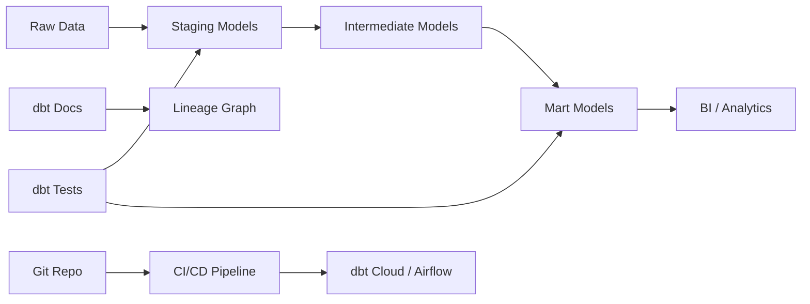

# dbt — A 2-Day Crash Course

dbt transforms data in your warehouse using SQL + software engineering practices — version control, testing, documentation, and CI/CD for your analytics code.

---

## Part 0 — Why dbt Exists

Your warehouse is full of raw data. It arrived via Fivetran, Airbyte, Kafka, or a custom pipeline. It's normalized, event-level, and completely useless to a business analyst who needs a clean `monthly_revenue` table.

Before dbt, you'd write a stored procedure, a Python script, or a one-off SQL file that nobody versioned and everyone was afraid to touch. When it broke at 2 AM, the person who wrote it had left the company. When the business logic changed, the transformation lived in five different places, all slightly different.

dbt brings what software engineers take for granted — version control, modular code, automated testing, documentation, and CI — to the people writing SQL. You define transformations as `.sql` files, declare dependencies between them, test the outputs, and deploy the whole thing with a single command. The warehouse does the compute. dbt does the orchestration.

The mental shift: you stop thinking of SQL as "queries you run" and start thinking of it as "code you ship."

---




## Part 1 — Vocabulary

Before you write a line, these terms need to be solid.

**Model** — A `.sql` file in your `models/` directory. Each file is a `SELECT` statement. dbt compiles it and runs it against your warehouse, materializing the result as a table, view, or something in between.

**Source** — A declaration (in YAML) that points to raw data already in your warehouse — the tables your ingestion tool loaded. You don't own the data; you document it, apply freshness checks to it, and reference it by name.

**ref()** — The function that wires models together. When model B needs model A, you write `FROM {{ ref('model_a') }}` instead of hardcoding the schema and table name. dbt resolves the actual relation and builds the dependency graph automatically.

**Seed** — A CSV file in your `seeds/` directory. dbt loads it into the warehouse as a table. Use it for static lookup tables — country codes, product categories, exchange rates — things that change rarely and need to be in version control.

**Snapshot** — A dbt mechanism for tracking slowly changing data. You point it at a source table and dbt captures row-level changes over time, giving you a full history. The result is a Type 2 SCD table with `dbt_valid_from` and `dbt_valid_to` columns.

**Test (schema)** — A built-in assertion declared in YAML. The four defaults: `not_null`, `unique`, `accepted_values`, `relationships`. When you run `dbt test`, dbt generates the SQL to check each assertion and fails loudly if it doesn't pass.

**Test (data / singular)** — A `.sql` file in your `tests/` directory that returns rows when something is wrong. Zero rows = pass. Any rows = fail. Use these for business-logic checks that don't fit a generic schema test.

**Macro** — A reusable block of Jinja + SQL, defined in your `macros/` directory. Think of it as a function. You call it with `{{ macro_name(arg) }}` inside any model or test.

**Jinja** — The templating language dbt uses to make SQL dynamic. It gives you variables (`{{ var('start_date') }}`), conditionals (``), loops, and macro calls inside `.sql` files.

**Profile** — A `~/.dbt/profiles.yml` file that holds your warehouse connection credentials. It lives outside your project so credentials never end up in version control. Each project references a profile by name.

**Target** — A named environment inside a profile. A profile named `my_project` might have targets `dev` (your personal schema) and `prod` (the production schema). You switch with `--target prod`.

**Materialization** — How dbt persists a model's result:
- `view` — Re-runs the SELECT every time someone queries it. No storage cost. Default.
- `table` — Drops and recreates the full table on every `dbt run`. Costs storage, faster to query.
- `incremental` — Appends or merges only new/changed rows. Efficient for large event tables.
- `ephemeral` — Not materialized at all. Injected as a CTE into dependent models. Useful for intermediate logic you don't want to expose as a table.

---

## DAY 1 — Core Mechanics

### Install

You need Python 3.8+. Install dbt-core and your adapter together.

```bash
pip install dbt-core dbt-postgres      # PostgreSQL / Redshift
pip install dbt-core dbt-bigquery      # BigQuery
pip install dbt-core dbt-snowflake     # Snowflake
pip install dbt-core dbt-duckdb        # DuckDB (great for local dev)
```

Verify:

```bash
dbt --version
```

### Initialize a project

```bash
dbt init analytics
cd analytics
```

This creates the scaffold: `dbt_project.yml`, `models/`, `tests/`, `macros/`, `seeds/`, `snapshots/`, `analyses/`.

Open `~/.dbt/profiles.yml` (created during init or manually) and configure your connection:

```yaml
analytics:
  target: dev
  outputs:
    dev:
      type: postgres
      host: localhost
      user: your_user
      password: your_password
      port: 5432
      dbname: your_db
      schema: dbt_dev
      threads: 4
    prod:
      type: postgres
      host: prod-host
      user: prod_user
      password: "{{ env_var('DBT_PROD_PASSWORD') }}"
      port: 5432
      dbname: prod_db
      schema: analytics
      threads: 8
```

Test the connection:

```bash
dbt debug
```

### Your first model

Create `models/staging/stg_orders.sql`:

```sql
select
    order_id,
    customer_id,
    order_date,
    status,
    amount
from {{ source('raw', 'orders') }}
where order_date is not null
```

Run it:

```bash
dbt run --select stg_orders
```

dbt compiles the Jinja, runs the SQL against your warehouse, and creates a view (or table, depending on config) in your dev schema.

### ref() — wiring models together

Create `models/marts/fct_orders.sql`:

```sql
select
    o.order_id,
    o.customer_id,
    o.order_date,
    o.status,
    o.amount,
    c.email,
    c.country
from {{ ref('stg_orders') }} o
left join {{ ref('stg_customers') }} c
    on o.customer_id = c.customer_id
```

dbt knows `fct_orders` depends on `stg_orders` and `stg_customers`. It builds the DAG and runs them in the right order. You never manage dependency order manually.

### Sources — declaring raw tables

Create `models/staging/sources.yml`:

```yaml
version: 2

sources:
  - name: raw
    schema: raw_data
    tables:
      - name: orders
        description: "Raw orders from the e-commerce platform"
        loaded_at_field: _loaded_at
        freshness:
          warn_after: {count: 6, period: hour}
          error_after: {count: 24, period: hour}
        columns:
          - name: order_id
            tests:
              - not_null
              - unique
      - name: customers
        description: "Raw customer records"
```

Check freshness:

```bash
dbt source freshness
```

### Schema tests

Add a `models/marts/schema.yml`:

```yaml
version: 2

models:
  - name: fct_orders
    description: "One row per order, enriched with customer data"
    columns:
      - name: order_id
        tests:
          - not_null
          - unique
      - name: status
        tests:
          - accepted_values:
              values: ['placed', 'shipped', 'delivered', 'cancelled']
      - name: customer_id
        tests:
          - relationships:
              to: ref('stg_customers')
              field: customer_id
```

Run tests:

```bash
dbt test
dbt test --select fct_orders   # test one model
```

### Documentation

Add descriptions to your YAML files — models, columns, sources. Then:

```bash
dbt docs generate
dbt docs serve
```

This builds a static site with a full DAG visualization, column-level lineage, and all your descriptions. Share it with your team. It is the living documentation of your data.

---

## DAY 2 — Production Patterns

### Incremental models

For large event tables you can't rebuild from scratch every run:

```sql
{{
  config(
    materialized='incremental',
    unique_key='event_id',
    on_schema_change='sync_all_columns'
  )
}}

select
    event_id,
    user_id,
    event_type,
    occurred_at
from {{ source('raw', 'events') }}


  where occurred_at > (select max(occurred_at) from {{ this }})

```

On the first run, dbt builds the full table. On subsequent runs, `is_incremental()` is true and dbt only processes new rows, merging on `unique_key`. For append-only data, drop `unique_key` and dbt simply inserts.

⚠️ Incremental models can silently accumulate bad data if your `where` clause is wrong. Add a lookback buffer (e.g., `occurred_at > (select max(...) - interval '3 hours')`) to handle late-arriving events.

### Snapshots — SCD Type 2

Create `snapshots/customers_snapshot.sql`:

```sql


{{
  config(
    target_schema='snapshots',
    unique_key='customer_id',
    strategy='timestamp',
    updated_at='updated_at',
  )
}}

select * from {{ source('raw', 'customers') }}


```

Run:

```bash
dbt snapshot
```

dbt inserts new rows with `dbt_valid_from = now()` and closes the previous version with `dbt_valid_to = now()`. You get the full history of every customer record. Use `strategy='check'` with `check_cols` when your source table has no `updated_at` column — dbt will compare column values instead.

### Custom (singular) tests

Create `tests/assert_revenue_positive.sql`:

```sql
-- Fails if any order has negative revenue
select
    order_id,
    amount
from {{ ref('fct_orders') }}
where amount < 0
```

Any rows returned = test failure. Name it clearly — the filename becomes the test name in output.

### Macros

Create `macros/cents_to_dollars.sql`:

```sql

    ({{ column_name }} / 100.0)::numeric(10,2)

```

Use it in any model:

```sql
select
    order_id,
    {{ cents_to_dollars('amount_cents') }} as amount
from {{ ref('stg_orders') }}
```

Macros are especially useful for date spine generation, pivot logic, and wrapping adapter-specific SQL (e.g., `QUALIFY` on Snowflake vs. a subquery on Postgres).

### Packages

dbt has a package ecosystem at hub.getdbt.com. The most widely used:

- **dbt-utils** — date spine, surrogate keys, pivot, union_relations
- **dbt-expectations** (Great Expectations port) — column-level statistical tests
- **dbt-audit-helper** — compare model results between environments
- **elementary** — observability and anomaly detection

Add to `packages.yml`:

```yaml
packages:
  - package: dbt-labs/dbt_utils
    version: [">=1.0.0", "<2.0.0"]
  - package: calogica/dbt_expectations
    version: [">=0.10.0", "<0.11.0"]
```

Install:

```bash
dbt deps
```

Use in models:

```sql
{{ dbt_utils.generate_surrogate_key(['order_id', 'line_item_id']) }}
```

### CI/CD integration

In a GitHub Actions workflow:

```yaml
name: dbt CI

on:
  pull_request:
    branches: [main]

jobs:
  dbt-run:
    runs-on: ubuntu-latest
    steps:
      - uses: actions/checkout@v4

      - name: Set up Python
        uses: actions/setup-python@v5
        with:
          python-version: '3.11'

      - name: Install dbt
        run: pip install dbt-core dbt-postgres

      - name: dbt deps
        run: dbt deps
        env:
          DBT_PROFILES_DIR: .

      - name: dbt run (slim CI)
        run: |
          dbt run --select state:modified+
        env:
          DBT_TARGET: ci
          DBT_DB_PASSWORD: ${{ secrets.DBT_DB_PASSWORD }}

      - name: dbt test
        run: dbt test --select state:modified+
```

`state:modified+` is slim CI — it only runs models that changed and their downstream dependents. This keeps CI fast on large projects. You need to provide a `manifest.json` from the previous production run as the comparison state.

### dbt Cloud vs dbt Core

**dbt Core** is the open-source CLI. Free. You own the infrastructure, orchestration, and IDE.

**dbt Cloud** is the managed platform. It gives you:
- A browser-based IDE
- Scheduled jobs with retries and alerting
- CI run environments spun up on PR
- Semantic layer (metrics definitions)
- Built-in observability (job history, model timing)

If your team is small and already has Airflow or Prefect, Core is sufficient. If you want to get productive fast and don't want to manage scheduling infrastructure, Cloud is worth the cost.

### dbt + Airflow

When you need dbt to be one step in a larger pipeline — e.g., run after your ingestion job finishes — use the `BashOperator` or the `DbtTaskGroup` from the Astronomer Cosmos package.

Basic pattern with BashOperator:

```python
from airflow.operators.bash import BashOperator

dbt_run = BashOperator(
    task_id='dbt_run',
    bash_command='dbt run --profiles-dir /profiles --target prod',
    env={'DBT_DB_PASSWORD': '{{ var("dbt_db_password") }}'},
)

dbt_test = BashOperator(
    task_id='dbt_test',
    bash_command='dbt test --profiles-dir /profiles --target prod',
)

ingest >> dbt_run >> dbt_test >> notify
```

With Cosmos, each dbt model becomes an individual Airflow task, giving you granular retries and task-level observability in the Airflow UI.

### Data contracts

dbt 1.5+ supports contracts on models. A contract enforces that the model's columns match the declared types exactly — dbt will fail the run if the schema diverges.

```yaml
models:
  - name: fct_orders
    config:
      contract:
        enforced: true
    columns:
      - name: order_id
        data_type: bigint
        constraints:
          - type: not_null
          - type: primary_key
      - name: amount
        data_type: numeric
```

Use contracts on models that other teams or downstream systems depend on. It shifts schema-change detection left — into the dbt run — rather than discovering breakage in production at query time.

---

## Worked Example — Analytics Pipeline

A canonical three-layer structure.

### Layer 1: Staging

One model per source table. Light transformations only — rename columns, cast types, filter obviously bad rows. No joins, no business logic.

```
models/staging/
  stg_orders.sql
  stg_customers.sql
  stg_products.sql
  stg_line_items.sql
  sources.yml
  schema.yml
```

`stg_orders.sql`:

```sql
select
    order_id::bigint,
    customer_id::bigint,
    order_date::date,
    lower(status) as status,
    amount_cents::integer
from {{ source('raw', 'orders') }}
where order_id is not null
```

### Layer 2: Intermediate

Reusable business logic. Joins, aggregations, and derived fields that don't belong in marts but are needed by multiple downstream models.

```
models/intermediate/
  int_orders_with_items.sql
  int_customer_order_history.sql
```

`int_orders_with_items.sql`:

```sql
select
    o.order_id,
    o.customer_id,
    o.order_date,
    o.status,
    sum(li.quantity * li.unit_price_cents) as total_cents,
    count(li.line_item_id) as item_count
from {{ ref('stg_orders') }} o
left join {{ ref('stg_line_items') }} li
    on o.order_id = li.order_id
group by 1, 2, 3, 4
```

### Layer 3: Marts

Business-facing output tables. Named for the consuming team or domain. Wide, denormalized, ready to query.

```
models/marts/
  finance/
    fct_orders.sql
    fct_revenue_daily.sql
  marketing/
    dim_customers.sql
    fct_customer_ltv.sql
```

`fct_orders.sql`:

```sql
{{
  config(
    materialized='table',
    tags=['finance', 'daily']
  )
}}

select
    o.order_id,
    o.customer_id,
    c.email,
    c.country,
    o.order_date,
    o.status,
    {{ cents_to_dollars('o.total_cents') }} as total_amount,
    o.item_count
from {{ ref('int_orders_with_items') }} o
left join {{ ref('stg_customers') }} c
    on o.customer_id = c.customer_id
```

Run the full pipeline:

```bash
dbt run --select staging+          # staging and everything downstream
dbt test --select marts            # test only mart models
dbt run --select tag:daily         # run everything tagged daily
```

---

## Pitfalls

**Circular references** — `ref()` builds a DAG. If model A depends on model B and model B depends on model A, dbt fails at compile time. Decompose the logic or use an intermediate model that neither depends on.

**Overusing incremental models** — Incremental models are harder to debug and can accumulate stale data. Start with `table` materialization. Move to incremental only when rebuild time becomes a real problem.

**Schema drift on incremental models** — If you add a column to the source, your incremental model won't pick it up unless you set `on_schema_change='sync_all_columns'` or do a full refresh: `dbt run --full-refresh --select model_name`.

**Putting credentials in dbt_project.yml** — Credentials belong in `profiles.yml`, which stays out of version control. Use `env_var()` for secrets in profiles.

**Skipping tests in development** — Run `dbt test` locally, not just in CI. Catching a `unique` violation in dev is free. Catching it after your mart table has been used in twelve dashboards is expensive.

**Overloading the staging layer** — Staging should be thin. If you find yourself writing multi-table joins in a staging model, move that logic to intermediate. The layer structure only pays off if you respect it.

**Forgetting `--full-refresh`** — After changing the schema of an incremental model (adding a column, changing a type), you must run with `--full-refresh` or the new column won't exist in the materialized table. Add this to your change review checklist.

---

## Quick Reference

```bash
# Project setup
dbt init <project_name>
dbt debug                              # test connection

# Run
dbt run                                # run all models
dbt run --select stg_orders            # run one model
dbt run --select staging+              # model + all downstream
dbt run --select +fct_orders           # model + all upstream
dbt run --select tag:daily             # run by tag
dbt run --full-refresh                 # rebuild incremental from scratch
dbt run --target prod                  # run against prod target

# Test
dbt test                               # all tests
dbt test --select fct_orders           # tests for one model
dbt source freshness                   # check source freshness

# Snapshot
dbt snapshot                           # run all snapshots

# Seeds
dbt seed                               # load all CSVs

# Dependencies
dbt deps                               # install packages

# Docs
dbt docs generate
dbt docs serve

# Compile (no execution)
dbt compile --select fct_orders        # see the rendered SQL

# State-based (slim CI)
dbt run --select state:modified+
dbt test --select state:modified+
```

**Selector syntax cheat sheet:**

| Selector | Meaning |
|---|---|
| `model_name` | One model |
| `+model_name` | Model + all ancestors |
| `model_name+` | Model + all descendants |
| `+model_name+` | Full lineage |
| `staging.*` | All models in a directory |
| `tag:daily` | All models with tag |
| `state:modified+` | Changed models + descendants |
| `source:raw.orders` | Models that use this source |

---

## Next Steps

Once you have dbt running in your warehouse, these are the natural continuations:

- **DataOps.md** — The broader practice: data quality, observability, and the pipeline lifecycle that dbt fits into.
- **Airflow.md** — Orchestrating dbt alongside ingestion, reverse ETL, and other data workflows.
- **PostgreSQL.md** — If you're running dbt on Postgres, understanding query planning and index strategy will help you optimize materialization performance.

---

## Recommended learning resources

**YouTube channels & playlists:**
- [dbt Labs — Official Channel](https://www.youtube.com/@daborsen) — Coalesce conference talks, feature deep dives, and best practices from the dbt team
- [DataTalksClub — Analytics Engineering](https://www.youtube.com/@DataTalksClub) — dbt in the context of the modern data stack, with hands-on zoomcamp modules
- [Seattle Data Guy — dbt Tutorials](https://www.youtube.com/@SeattleDataGuy) — practical dbt walkthroughs: models, tests, macros, and project structure
- [Astronomer — dbt and Airflow](https://www.youtube.com/@astronomerio) — orchestrating dbt runs inside Airflow DAGs
- [Kahan Data Solutions — dbt for Beginners](https://www.youtube.com/results?search_query=kahan+data+solutions+dbt) — step-by-step dbt tutorials from project setup to deployment

**Official docs & blogs:**
- [dbt Documentation](https://docs.getdbt.com/) — models, tests, seeds, snapshots, macros, and the full reference
- [dbt Blog](https://www.getdbt.com/blog) — analytics engineering practices, data modelling patterns, and community case studies

---

## The Mantra

> Raw data is a liability. Tested, documented, version-controlled transformations are an asset. dbt makes the difference.

You don't run dbt once and move on. You build models the way you build software — incrementally, with tests, with code review, with CI keeping production honest. Every model is a contract with the person querying it. Honor that contract and your warehouse becomes infrastructure people trust.

## Top 10 Interview Questions

<details>
<summary><strong>Q: What is dbt and why has it become essential for modern data teams?</strong></summary>

dbt (data build tool) transforms data inside the warehouse using SQL SELECT statements — you write the transformation logic, dbt handles the DDL (CREATE TABLE, INSERT). It brings software engineering practices to analytics: version-controlled SQL, modular models with refs, automated testing, documentation, and CI/CD. dbt is essential because it enables analysts (who know SQL) to build reliable, tested, documented data pipelines without writing Python or managing infrastructure.

</details>

<details>
<summary><strong>Q: What is the dbt model layering convention and why does it matter?</strong></summary>

The standard layers: staging (1:1 mapping to source tables — rename columns, cast types, basic cleaning), intermediate (business logic joins and transformations), and marts (final tables for specific business domains — finance mart, marketing mart). This layering matters because: it provides clear data lineage, makes models reusable (intermediate models feed multiple marts), isolates source changes (only staging models touch raw data), and makes testing targeted (test at each layer boundary).

</details>

<details>
<summary><strong>Q: How do dbt tests work and what types should you implement?</strong></summary>

Built-in tests: unique, not_null, accepted_values, relationships (referential integrity). Custom tests: SQL queries that return failing rows. dbt-expectations package adds statistical tests (column means, distributions). Implement: schema tests on every model (unique keys, not-null required columns), data tests on business rules (order amounts > 0, dates in valid ranges), and source freshness tests (data loaded within expected window). Run tests in CI on every PR and after every production run.

</details>

<details>
<summary><strong>Q: How do you handle incremental models in dbt?</strong></summary>

Incremental models process only new or changed data instead of rebuilding the full table. Use the is_incremental() macro to filter rows: typically filter by a timestamp column (WHERE updated_at > (SELECT MAX(updated_at) FROM {{ this }})). Key considerations: choose the right incremental strategy (append, merge, delete+insert), handle late-arriving data (use a lookback window), and periodically full-refresh to correct any accumulated inconsistencies (--full-refresh flag).

</details>

<details>
<summary><strong>Q: What is the difference between dbt Core and dbt Cloud?</strong></summary>

dbt Core is the open-source CLI — you run it locally or in your own infrastructure (Airflow, CI/CD). dbt Cloud is Anthropic's managed service adding: web IDE, job scheduling, CI on PRs, documentation hosting, and the Semantic Layer. Choose Core for: full control, cost-sensitive teams, existing orchestration (Airflow). Choose Cloud for: teams without strong DevOps, faster setup, built-in scheduling and CI. Many teams start with Cloud for convenience and move to Core as they mature.

</details>

<details>
<summary><strong>Q: How do you implement CI/CD for dbt projects?</strong></summary>

On PR: run dbt build --select state:modified+ (build and test only changed models and downstream dependencies) against a CI schema (separate from production). Post the test results and model changes as a PR comment. On merge to main: run dbt build in production. Use dbt Cloud's built-in CI or GitHub Actions with dbt Core. Key: the CI run must use a production-like environment (same warehouse, same source data) to catch real issues.

</details>

<details>
<summary><strong>Q: How do you manage dbt in a large organisation with multiple teams?</strong></summary>

Use dbt packages for shared logic (macros, generic tests, utility models). Organise models by domain/team in directories. Use dbt groups and access modifiers (public/protected/private) to enforce boundaries — teams can only reference public models from other teams. Implement a shared staging layer owned by the data platform team, with domain-specific marts owned by domain teams. Centralise source definitions to avoid duplicate source declarations.

</details>

<details>
<summary><strong>Q: What is the dbt Semantic Layer and why does it matter?</strong></summary>

The Semantic Layer defines metrics (revenue, active users, conversion rate) as code in dbt, creating a single source of truth for metric definitions. Instead of each BI tool calculating 'revenue' differently, they all query the Semantic Layer which computes it consistently. This solves the 'why do these two dashboards show different revenue numbers?' problem. MetricFlow (dbt's metrics engine) handles time-series aggregation, dimensional slicing, and joins — BI tools become thin presentation layers.

</details>

<details>
<summary><strong>Q: How do you handle source freshness monitoring in dbt?</strong></summary>

Define source freshness in sources.yml: specify the loaded_at_field (timestamp column) and warn_after/error_after thresholds. Run dbt source freshness to check whether sources have been updated within expected windows. Integrate into your orchestration: run freshness checks before dbt models to avoid processing stale data. Alert on freshness failures — in BFSI, stale data in a risk model can lead to incorrect credit decisions. Track freshness trends to identify degrading upstream pipelines.

</details>

<details>
<summary><strong>Q: How does dbt handle database-specific SQL differences?</strong></summary>

dbt uses Jinja macros and adapters to abstract database-specific SQL. The same model code works across Snowflake, BigQuery, Redshift, Databricks, and PostgreSQL (with minor adapter differences). Database-specific SQL goes in macros that dispatch to the correct implementation per adapter. Custom materializations handle database-specific DDL. However, not all SQL features are portable — window functions, JSON handling, and merge syntax vary. Test against your specific warehouse and avoid relying on adapter abstraction for complex SQL.

</details>

---

