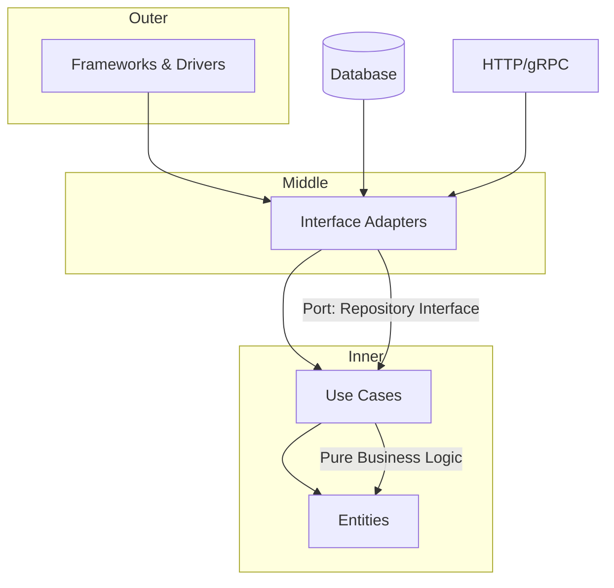

# Clean Architecture — A 2-Day Crash Course

Clean Architecture separates business logic from infrastructure — your core code doesn't know or care whether it's talking to PostgreSQL, Redis, or a mock.

**Prerequisite:** `Design-Principles.md`

---

## Part 0 — Why

Frameworks change. Databases change. APIs change. Third-party services get deprecated, replaced, or repriced. If your business logic is tangled with infrastructure, every one of those changes is a rewrite.

You've seen this. An ORM leaks into your service layer. A web framework's request object appears deep inside your validation logic. A test suite that can only run against a live database because the persistence logic is stitched directly into the business rules. These aren't style problems — they're structural problems, and they compound.

Clean Architecture is Robert Martin's formalization of an old idea: draw a hard boundary between what your system *does* and *how it does it*. The business rules are the core. Everything else — HTTP, SQL, message queues, file systems — is a detail. Details are replaceable. Core rules are not.

The payoff is testability, replaceability, and longevity. A system built this way lets you swap PostgreSQL for DynamoDB without touching a single business rule. It lets you test those rules without spinning up a database. It lets a new engineer understand what the system *does* without first understanding every infrastructure choice made three years ago.

---

## Vocabulary

**Entity** — An object that encapsulates enterprise-wide business rules. Entities are the most stable things in your system. They change only when the fundamental business rules change. An `Order`, a `User`, a `Transaction` — these are entities. They have no knowledge of databases, HTTP, or frameworks.

**Use Case** — Application-specific business logic. A use case orchestrates the flow of data to and from entities to achieve a specific goal: `PlaceOrder`, `TransferFunds`, `GenerateInvoice`. Use cases know about entities but nothing about how data is stored or how the user interface works.

**Interface Adapter** — Converts data between the form most convenient for use cases and entities, and the form most convenient for external systems. Controllers, presenters, and gateways live here. This layer knows about both the inner layers and the outer layers, but it translates — it does not contain business logic.

**Framework / Driver** — The outermost layer. Web frameworks, databases, UI toolkits, external APIs. This is where the details live. You plug things in here; you don't build your system around them.

**Dependency Rule** — The single rule that makes the architecture work: *source code dependencies can only point inward*. Nothing in an inner layer knows anything about an outer layer. Entities don't know about use cases. Use cases don't know about adapters. Adapters don't know about frameworks. You can add or change outer layers without touching inner ones.

**Port** — An interface defined by an inner layer, describing what it needs from the outside world. A `UserRepository` interface defined in the application layer is a port. The application layer depends on the abstraction, not the implementation.

**Adapter** — A concrete implementation of a port, living in the infrastructure layer. `PostgresUserRepository` implements `UserRepository`. The adapter knows about PostgreSQL; the application layer does not.

**Hexagonal Architecture** — Alistair Cockburn's version of the same idea. Ports and adapters. The "hexagon" is the application; ports are on the boundary; adapters plug into ports. Functionally equivalent to Clean Architecture.

**Onion Architecture** — Jeffrey Palermo's version. Same concentric-circles model, slightly different naming conventions. Domain model at the center, application services wrapping it, infrastructure on the outside.

These three names describe the same essential structure. The industry uses them interchangeably. When someone says "hexagonal," "onion," or "clean," they mean: put business logic at the center, make everything else depend on it, never the reverse.

---



## DAY 1 — The Concentric Circles

### The Layers

Visualize four concentric circles. Inner circles are higher-level policy. Outer circles are mechanisms.

**Entities (innermost)** — Pure business objects and rules. No framework imports. No database annotations. No HTTP concepts. If you're writing Java and your `Order` class imports `javax.persistence`, you've already broken the architecture.

**Use Cases** — Application logic. Each use case is a single operation the system can perform. `PlaceOrderUseCase` takes an input (a plain data structure), runs the business rules using entities, and produces an output (another plain data structure). It depends on repository interfaces (ports) but not on implementations.

**Interface Adapters** — Controllers receive HTTP requests and translate them into use case inputs. Presenters take use case outputs and format them for the view or API response. Repository implementations take database rows and map them to entities. All translation happens here.

**Frameworks and Drivers (outermost)** — Spring, Express, Django, Rails, PostgreSQL, Redis, S3, Kafka. These are configuration and wiring. You write as little custom code here as possible.

### The Dependency Rule in Practice

If you're in a use case and you feel the urge to import a database driver, stop. Define an interface (port) in the use case layer instead. Let infrastructure implement it. Pass the implementation in through dependency injection.

If you're in an entity and you feel the urge to import anything from your web framework, stop. Move that logic out. Entities are the most protected thing you have.

A quick check: can you run your entities and use cases with zero external dependencies? If yes, your architecture is working. If no, something in the outer layers has leaked inward.

### Project Structure

This is a concrete directory layout that maps to the conceptual layers:

```
src/
├── domain/              # Entities — pure business rules
│   ├── order.go
│   ├── product.go
│   └── errors.go
│
├── application/         # Use cases and port interfaces
│   ├── place_order.go
│   ├── cancel_order.go
│   └── ports/
│       ├── order_repository.go   # interface
│       └── payment_gateway.go    # interface
│
├── infrastructure/      # Adapters — implement the ports
│   ├── postgres/
│   │   └── order_repository.go   # implements ports.OrderRepository
│   ├── stripe/
│   │   └── payment_gateway.go    # implements ports.PaymentGateway
│   └── kafka/
│       └── event_publisher.go
│
└── presentation/        # Controllers, API handlers, CLI commands
    ├── http/
    │   └── order_handler.go
    └── cli/
        └── order_command.go
```

The `domain/` directory has zero imports from `application/`, `infrastructure/`, or `presentation/`. The `application/` directory imports `domain/` and its own `ports/` interfaces, nothing else. `infrastructure/` imports `application/ports/` so it can implement them. `presentation/` imports `application/` to call use cases.

### Dependency Injection

The wiring happens at the outermost layer — in `main.go`, in your application bootstrap, in your DI container. You build the concrete implementations first, then pass them inward.

```go
// main.go — the composition root
orderRepo := postgres.NewOrderRepository(db)
paymentGateway := stripe.NewPaymentGateway(apiKey)
placeOrder := application.NewPlaceOrderUseCase(orderRepo, paymentGateway)
handler := http.NewOrderHandler(placeOrder)
```

Nothing in `application.NewPlaceOrderUseCase` knows it received a Postgres repository. It received something that satisfies `ports.OrderRepository`. That's the entire point.

---

## DAY 2 — Ports and Adapters in Practice

### Testing Each Layer Independently

The architecture earns its keep at test time.

**Testing entities** — No mocks, no setup, no external dependencies. Pure functions, pure data. If your `Order` entity can calculate its total, you test that with a single function call and an assertion.

**Testing use cases** — Replace every port with an in-memory fake. Write a `FakeOrderRepository` that stores orders in a map. Write a `FakePaymentGateway` that returns success or failure on demand. Your use case tests run in milliseconds with zero I/O.

```go
func TestPlaceOrder_Success(t *testing.T) {
    repo := &FakeOrderRepository{}
    gateway := &FakePaymentGateway{ShouldSucceed: true}
    useCase := application.NewPlaceOrderUseCase(repo, gateway)

    result, err := useCase.Execute(PlaceOrderInput{...})

    assert.NoError(t, err)
    assert.Equal(t, "confirmed", result.Status)
}
```

**Testing adapters** — Test the Postgres implementation against a real test database (or a Dockerized one). These are integration tests. They're slower and have external dependencies, but they test the only part that should have those dependencies.

**Testing presentation** — Test your HTTP handlers with a fake use case. Verify that the handler correctly translates requests and formats responses. HTTP behavior, not business behavior.

This separation means your unit test suite — entities and use cases — runs in seconds. Your integration tests run in minutes. You know exactly what each test is covering.

### Clean Architecture for Microservices

Each microservice is its own Clean Architecture. The boundary of the service is the framework/driver layer — your service exposes an HTTP API or publishes to a message bus. Those are infrastructure details within the service.

Where it gets interesting: when service A calls service B, that call is infrastructure from service A's perspective. You define a port (`OrderServiceClient` interface), implement it against service B's actual API (`HttpOrderServiceClient`), and your use cases never know whether they're calling a local function or a remote service.

This also means you can test microservice interactions with fakes. Service A's tests don't require service B to be running.

⚠️ A common mistake is sharing domain models across microservices. Don't. Each service owns its own domain. If two services both have a concept of `Order`, they have their own separate `Order` objects. Sharing domain models creates tight coupling at the layer that should be most stable.

### Clean Architecture for CLI Tools

A CLI tool is just a different presentation layer. Your `PlaceOrderUseCase` doesn't know whether it's being called by an HTTP handler or a CLI command. The command parses flags, constructs the input struct, calls the use case, formats the output.

```
presentation/
└── cli/
    └── place_order_command.go   # parses args → calls use case → prints result
```

If you already have an HTTP service with properly layered architecture, adding a CLI is a presentation-layer change only. No business logic is touched.

### When It's Overkill

Clean Architecture adds structure. Structure has a cost — more files, more interfaces, more indirection. That cost is worth it when the system will live for years, be worked on by multiple people, or have infrastructure that's likely to change.

It is not worth it for:

- **Scripts** — A script that processes a CSV file and exits doesn't need ports and adapters. Write it procedurally.
- **Prototypes** — If you're validating whether an idea works, skip the architecture. Rewrite it properly once you know it's worth keeping.
- **Trivial CRUD services** — A service with three endpoints that maps directly to three tables isn't hiding complex business logic. A thin layer over your ORM is fine.
- **Solo short-term projects** — If you're building something you'll throw away in six months and you're the only person working on it, the overhead is real and the benefits are abstract.

The signal to reach for Clean Architecture: you have business rules complex enough to be worth protecting, and you expect the system to outlive the current technology choices.

### Clean Architecture vs MVC vs Layered

**MVC (Model-View-Controller)** organizes UI code. It doesn't say anything about where business logic lives. In a naive MVC Rails app, business logic ends up in models — which are ActiveRecord objects coupled to the database. Or it ends up in controllers. Either way, it's tangled with infrastructure. Clean Architecture is not an alternative to MVC; it's an answer to what goes *inside* the model.

**Traditional Layered Architecture** (presentation → business → data) is closer but still weaker. The typical three-tier architecture has the data layer at the bottom and the other layers depending on it. Clean Architecture inverts that — business rules are at the center, data access implements interfaces defined by business rules. The direction of dependency is the key difference.

**Clean Architecture** makes the dependency rule explicit and structural. It's not a convention; it's enforced by the direction of imports.

### Interview Notes

If asked about Clean Architecture in an interview, hit these points:

- Dependency Rule: dependencies point inward only
- Testability: use cases are testable without any infrastructure
- Replaceability: you can swap any outer-layer component without touching business rules
- Ports and adapters: the mechanism that enforces the boundary
- Trade-off: appropriate overhead for complex, long-lived systems; overkill for scripts and prototypes

---

## Worked Example — Structuring an Order Service

**Business requirement:** A customer can place an order. The system charges their payment method and saves the order.

### Domain layer

```go
// domain/order.go
type Order struct {
    ID     string
    Items  []LineItem
    Status string
    Total  Money
}

func NewOrder(items []LineItem) (*Order, error) {
    if len(items) == 0 {
        return nil, ErrEmptyOrder
    }
    total := calculateTotal(items)
    return &Order{Items: items, Total: total, Status: "pending"}, nil
}

func (o *Order) Confirm() {
    o.Status = "confirmed"
}
```

No database. No HTTP. No framework. Pure business logic.

### Application layer

```go
// application/ports/order_repository.go
type OrderRepository interface {
    Save(ctx context.Context, order *domain.Order) error
    FindByID(ctx context.Context, id string) (*domain.Order, error)
}

// application/ports/payment_gateway.go
type PaymentGateway interface {
    Charge(ctx context.Context, amount domain.Money, token string) error
}

// application/place_order.go
type PlaceOrderInput struct {
    Items        []domain.LineItem
    PaymentToken string
}

type PlaceOrderOutput struct {
    OrderID string
    Status  string
}

type PlaceOrderUseCase struct {
    orders  ports.OrderRepository
    payment ports.PaymentGateway
}

func (uc *PlaceOrderUseCase) Execute(ctx context.Context, input PlaceOrderInput) (*PlaceOrderOutput, error) {
    order, err := domain.NewOrder(input.Items)
    if err != nil {
        return nil, err
    }

    if err := uc.payment.Charge(ctx, order.Total, input.PaymentToken); err != nil {
        return nil, ErrPaymentFailed
    }

    order.Confirm()

    if err := uc.orders.Save(ctx, order); err != nil {
        return nil, err
    }

    return &PlaceOrderOutput{OrderID: order.ID, Status: order.Status}, nil
}
```

### Infrastructure layer

```go
// infrastructure/postgres/order_repository.go
type PostgresOrderRepository struct {
    db *sql.DB
}

func (r *PostgresOrderRepository) Save(ctx context.Context, order *domain.Order) error {
    // SQL here — the only place SQL appears in the entire codebase
    _, err := r.db.ExecContext(ctx, "INSERT INTO orders ...", order.ID, order.Status)
    return err
}
```

### Presentation layer

```go
// presentation/http/order_handler.go
type OrderHandler struct {
    placeOrder *application.PlaceOrderUseCase
}

func (h *OrderHandler) Handle(w http.ResponseWriter, r *http.Request) {
    var req PlaceOrderRequest
    json.NewDecoder(r.Body).Decode(&req)

    input := application.PlaceOrderInput{
        Items:        mapItems(req.Items),
        PaymentToken: req.PaymentToken,
    }

    output, err := h.placeOrder.Execute(r.Context(), input)
    if err != nil {
        writeError(w, err)
        return
    }

    writeJSON(w, output)
}
```

The handler knows about HTTP. The use case does not. The repository knows about PostgreSQL. The use case does not. The domain entity knows about order rules. Nothing else does.

---

## Pitfalls

**Over-abstraction** — Every interface, every mapping struct, every translation method is indirection. Indirection has a cognitive cost. If you find yourself writing `OrderDTOToOrderInputMapper` for a system with three fields, you've gone too far. Apply the architecture at the seams that actually matter.

**Too many layers for small projects** — The four-layer structure is a guideline, not a mandate. A small service might have just domain, application, and infrastructure, with presentation being a thin wrapper. Don't add layers because the diagram has them; add them because they solve a real problem.

**Anemic domain models** — A common failure mode is putting all logic in use cases and leaving entities as dumb data structs. If your `Order` entity has no behavior — if it's just a bag of fields — you've moved business logic into the application layer where it doesn't belong. Entities should enforce business invariants.

**Shared domain models across services** — Each service owns its own domain. Shared libraries for domain objects create coupling that defeats the purpose.

**Ignoring the boundary** — The dependency rule only works if you enforce it. Linters, module boundaries, and code review discipline are your enforcement mechanisms. A single `import infrastructure` in a use case file is a crack that tends to grow.

---

## Quick Reference

### Project Structure Template

```
src/
├── domain/              # Entities, value objects, domain errors
├── application/
│   ├── use_cases/       # One file per use case
│   └── ports/           # Interfaces (repository, gateway, service)
├── infrastructure/
│   ├── persistence/     # Database implementations
│   ├── messaging/       # Queue/event implementations
│   └── external/        # Third-party API clients
└── presentation/
    ├── http/            # REST handlers
    ├── grpc/            # gRPC handlers
    └── cli/             # CLI commands
```

### Layer Responsibility Table

| Layer | Knows About | Does Not Know About | Changes When |
|-------|-------------|---------------------|--------------|
| Domain | Business rules, domain concepts | Everything else | Business rules change |
| Application | Domain, port interfaces | Infrastructure, frameworks | Application logic changes |
| Infrastructure | Port interfaces, DB/APIs | Domain business rules | Technology choices change |
| Presentation | Use cases | Business rules, infrastructure | UI/API contract changes |

### Dependency Direction

```
Presentation  →  Application  →  Domain
Infrastructure  →  Application  →  Domain

Everything points inward. Domain points at nothing.
```

---

## Interview Questions

<details><summary><strong>Q: What is the Dependency Rule in Clean Architecture, and what happens when it is violated?</strong></summary>

The Dependency Rule states that source code dependencies can only point inward — outer layers depend on inner layers, never the reverse. Entities know nothing about use cases, use cases know nothing about adapters, and adapters know nothing about frameworks. When violated, inner layers become coupled to infrastructure details — for example, a use case importing a database driver means changing databases requires rewriting business logic. The violation typically manifests as untestable code that requires a live database or running framework to exercise.

</details>

<details><summary><strong>Q: How do Ports and Adapters enforce the boundary between business logic and infrastructure?</strong></summary>

A Port is an interface defined by an inner layer describing what it needs from the outside world — for example, a UserRepository interface in the application layer. An Adapter is a concrete implementation living in the infrastructure layer — for example, PostgresUserRepository. The application layer depends on the Port abstraction, not the Adapter. This means you can swap PostgreSQL for DynamoDB by writing a new Adapter without touching any business logic. Dependency injection wires the concrete Adapter to the Port at the composition root.

</details>

<details><summary><strong>Q: What is an anemic domain model, and why is it considered an anti-pattern in Clean Architecture?</strong></summary>

An anemic domain model is when entities are pure data structures with no behavior — all business logic lives in service classes that manipulate entity fields externally. This violates Clean Architecture because business invariants should be enforced by the entities themselves. An Order entity should know how to calculate its total and reject invalid state transitions, not just expose fields for a service to manipulate. Anemic models lead to scattered business rules, weaker encapsulation, and harder testing.

</details>

<details><summary><strong>Q: When is Clean Architecture overkill, and what alternatives would you suggest for simpler systems?</strong></summary>

Clean Architecture adds structural overhead — more files, more interfaces, more indirection. It is overkill for scripts, prototypes, trivial CRUD services with no complex business logic, and solo short-term projects. For a service that maps three endpoints directly to three database tables, a thin layer over your ORM is fine. The signal to reach for Clean Architecture is business rules complex enough to be worth protecting, and an expectation that the system will outlive current technology choices. For simpler systems, a straightforward layered architecture or even procedural code is appropriate.

</details>

<details><summary><strong>Q: How does Clean Architecture differ from traditional three-tier (layered) architecture?</strong></summary>

Traditional three-tier architecture (presentation, business, data) has the data layer at the bottom with other layers depending on it — business logic depends on the database layer. Clean Architecture inverts this: business rules are at the center, and the data access layer implements interfaces defined by the business rules. The direction of dependency is the key difference. In Clean Architecture, changing the database is an infrastructure concern that does not touch business logic. In three-tier, changing the database often requires changes throughout the business layer.

</details>

<details><summary><strong>Q: Explain how you would test each layer of a Clean Architecture application independently.</strong></summary>

Entities are tested with pure unit tests — no mocks, no setup, just function calls and assertions. Use cases are tested by replacing every Port with an in-memory fake (e.g., FakeOrderRepository backed by a map) — tests run in milliseconds with zero I/O. Adapters are integration-tested against real dependencies (Dockerized databases). Presentation handlers are tested with a fake use case to verify HTTP request/response translation. This separation means your unit test suite (entities + use cases) runs in seconds, integration tests in minutes.

</details>

<details><summary><strong>Q: How does Clean Architecture apply to microservices? What is the common mistake teams make with shared domain models?</strong></summary>

Each microservice is its own Clean Architecture with its own domain, use cases, and adapters. When Service A calls Service B, that call is infrastructure from A's perspective — defined as a Port (e.g., OrderServiceClient interface) with an Adapter implementing the HTTP call. The common mistake is sharing domain models across services via a shared library, which creates tight coupling at the layer meant to be most stable. Each service should own its own domain objects, even if they represent overlapping concepts.

</details>

<details><summary><strong>Q: What is the composition root in Clean Architecture, and why does wiring happen there?</strong></summary>

The composition root is the outermost point in the application — typically main.go, the application bootstrap, or the DI container configuration. This is where concrete implementations are instantiated and injected into inner layers. For example, you create PostgresOrderRepository, pass it to PlaceOrderUseCase, and pass that to the HTTP handler. Wiring happens here because it is the only place that knows about all layers simultaneously. Inner layers remain unaware of which concrete implementations they receive.

</details>

<details><summary><strong>Q: How would you add a CLI interface to an existing Clean Architecture HTTP service without touching business logic?</strong></summary>

A CLI tool is just another presentation layer. You create a new command handler in the presentation/cli directory that parses command-line flags, constructs the use case input struct, calls the same use case, and formats the output for terminal display. The use case does not know whether it is being called by an HTTP handler or a CLI command. If the architecture is properly layered, adding the CLI is purely a presentation-layer change — zero business logic is touched.

</details>

<details><summary><strong>Q: What is Hexagonal Architecture, and how does it relate to Clean Architecture and Onion Architecture?</strong></summary>

Hexagonal Architecture (Alistair Cockburn), Onion Architecture (Jeffrey Palermo), and Clean Architecture (Robert Martin) describe the same essential structure with different terminology. All three place business logic at the center with infrastructure on the outside, enforce inward-pointing dependencies, and use ports/interfaces to decouple inner and outer layers. Hexagonal emphasizes the hexagon shape with ports on the boundary and adapters plugging in. Onion emphasizes concentric rings. Clean Architecture adds explicit naming for entities, use cases, and interface adapters. The industry uses the terms interchangeably.

</details>

---


## Terminal Demo

```terminal-demo
# architect@clean-arch ~ %

$ tree src/ -L 2
src/
├── domain/
│   ├── entities/
│   ├── repositories/    (interfaces only)
│   └── value-objects/
├── application/
│   ├── use-cases/
│   └── dto/
├── infrastructure/
│   ├── persistence/     (repository implementations)
│   ├── http/            (controllers)
│   └── messaging/       (queue adapters)
└── main/
    ├── config/
    └── di/              (dependency injection)

$ cat src/domain/repositories/OrderRepository.ts
export interface OrderRepository {
  findById(id: string): Promise<Order | null>;
  save(order: Order): Promise<void>;
  findByUserId(userId: string): Promise<Order[]>;
}

$ cat src/application/use-cases/CreateOrder.ts | head -15
export class CreateOrder {
  constructor(
    private orderRepo: OrderRepository,
    private inventoryService: InventoryService,
    private eventBus: EventBus
  ) {}

  async execute(input: CreateOrderDTO): Promise<Order> {
    const order = Order.create(input.userId, input.items);
    await this.inventoryService.reserve(order.items);
    await this.orderRepo.save(order);
    await this.eventBus.publish(new OrderCreated(order));
    return order;
  }
}

$ npm test -- --coverage
PASS  src/domain/entities/Order.test.ts (12 tests)
PASS  src/application/use-cases/CreateOrder.test.ts (8 tests)
PASS  src/infrastructure/persistence/PostgresOrderRepo.test.ts (5 tests)
Test Suites: 15 passed, 15 total
Tests:       87 passed, 87 total
Coverage:    92.3%
```

---

## Quick Quiz

Test your understanding with these rapid-fire questions (answers hidden):

<details>
<summary>1. What is the ONE core problem that Clean Architecture solves?</summary>
Re-read Part 0 — the mental model section. If you can explain the "why" in one sentence, you understand the foundation.
</details>

<details>
<summary>2. Name the 3 most important terms from the vocabulary section.</summary>
Review Part 1. These are the building blocks every conversation about Clean Architecture uses.
</details>

<details>
<summary>3. What is the first thing you would set up on Day 1?</summary>
Check the Day 1 section — the very first hands-on step that gets you a working result.
</details>

<details>
<summary>4. What is the most common production pitfall with Clean Architecture?</summary>
Review the Common Pitfalls section. The first item listed is typically the most frequently encountered.
</details>

<details>
<summary>5. How does Clean Architecture compare to its closest alternative?</summary>
Check the Comparison Matrix below — focus on the key differentiating row.
</details>


## Comparison Matrix

| Dimension | Clean Architecture | Hexagonal | Layered |
|-----------|--------------------|-----------|---------|
| **Primary use case** | Core strength of Clean Architecture | Core strength of Hexagonal | Core strength of Layered |
| **Learning curve** | Moderate | Varies | Varies |
| **Community/ecosystem** | Active | Active | Growing |
| **Operational complexity** | Medium | Varies | Varies |
| **Best for** | See Part 0 | Different tradeoffs | Different tradeoffs |

> **How to read this matrix:** no tool wins on every dimension. Pick based on your specific constraints — team expertise, existing infrastructure, scale requirements, and compliance needs. The right choice is the one that fits your context, not the one with the most checkmarks.

## Next Steps

- `Design-Principles.md` — SOLID, DRY, YAGNI: the principles that motivate the architecture
- `Design-Patterns.md` — Patterns that appear frequently in adapters and use cases
- `Microservices-Patterns.md` — How Clean Architecture scales across service boundaries
- `DDD.md` — Domain-Driven Design: a richer model for complex domains, pairs naturally with Clean Architecture

---

## Recommended learning resources

**YouTube channels & playlists:**
- [Robert C. Martin (Uncle Bob) — Clean Architecture](https://www.youtube.com/results?search_query=uncle+bob+clean+architecture) — the original author explaining dependency rules, use cases, and why frameworks are details
- [CodeOpinion — Clean Architecture in Practice](https://www.youtube.com/@CodeOpinion) — practical implementation of ports and adapters, CQRS, and bounded contexts in real codebases
- [ArjanCodes — Clean Architecture in Python](https://www.youtube.com/@ArjanCodes) — layer-by-layer implementation showing how the dependency rule works in practice
- [Milan Jovanovic — Clean Architecture .NET](https://www.youtube.com/@MilanJovanovic) — detailed walkthroughs of domain layer, application layer, and infrastructure boundaries
- [Christopher Okhravi — Hexagonal Architecture](https://www.youtube.com/@ChristopherOkhravi) — the ports and adapters variant that maps directly to Clean Architecture's dependency inversion

**Official docs & blogs:**
- [Clean Code Blog — Architecture](https://blog.cleancoder.com/) — Uncle Bob's original essays on the screaming architecture, the dependency rule, and the clean architecture circle diagram
- [Alistair Cockburn — Hexagonal Architecture](https://alistair.cockburn.us/hexagonal-architecture/) — the original ports and adapters article that Clean Architecture builds upon

---

## The Mantra

> Business logic belongs to no framework.
> Infrastructure is a detail.
> Dependencies point inward, always.
> If you can't test it without a database, it's not clean.

## Top 10 Interview Questions

<details>
<summary><strong>Q: What is the dependency rule in Clean Architecture and why is it the most important concept?</strong></summary>

The dependency rule states that source code dependencies must point inward — outer layers depend on inner layers, never the reverse. Entities (innermost) know nothing about use cases, use cases know nothing about controllers, controllers know nothing about frameworks. This means your business logic is completely independent of the database, UI, or any framework — you can swap PostgreSQL for MongoDB without touching business rules. Violations of this rule are the #1 cause of untestable, rigid architectures.

</details>

<details>
<summary><strong>Q: How does Clean Architecture differ from Hexagonal Architecture and Onion Architecture?</strong></summary>

All three enforce the same core principle: business logic at the center, infrastructure at the edges, dependencies pointing inward. Hexagonal (Ports and Adapters) emphasises ports (interfaces) and adapters (implementations). Onion adds explicit layers (domain model, domain services, application services). Clean Architecture formalises the layers with specific names (entities, use cases, interface adapters, frameworks). In practice, they are nearly identical — the naming and emphasis differ, the result is the same.

</details>

<details>
<summary><strong>Q: How do you implement the repository pattern in Clean Architecture?</strong></summary>

The domain layer defines a repository interface (port): UserRepository with methods like findById, save. The infrastructure layer provides the implementation (adapter): PostgresUserRepository that uses SQL. The use case depends on the interface, not the implementation — injected via dependency injection. This means you can test use cases with an in-memory repository (fast unit tests) and swap databases without changing business logic. The interface belongs to the inner layer; the implementation belongs to the outer layer.

</details>

<details>
<summary><strong>Q: What are use cases in Clean Architecture and how granular should they be?</strong></summary>

A use case is an application-specific business rule — 'Create Order', 'Calculate Shipping Cost', 'Approve Loan Application'. Each use case orchestrates entities and repositories to fulfil a single business operation. Granularity: one use case per business operation, not per CRUD action. 'Create Order' (validates inventory, calculates total, creates order, sends notification) is one use case, not four separate ones. Use cases should be testable in isolation with mocked repositories.

</details>

<details>
<summary><strong>Q: When is Clean Architecture overkill and what alternatives exist?</strong></summary>

Clean Architecture adds indirection (interfaces, adapters, multiple layers) that is overkill for: simple CRUD applications, prototypes/MVPs, scripts, and small services with a short expected lifespan. Alternatives: vertical slice architecture (organise by feature, not layer), simple MVC with service classes, or framework-native patterns (Rails/Django conventions). Use Clean Architecture when: the domain logic is complex, the project will be maintained for years, multiple teams work on it, or you need to swap infrastructure components.

</details>

<details>
<summary><strong>Q: How do you handle cross-cutting concerns (logging, auth, caching) in Clean Architecture?</strong></summary>

Cross-cutting concerns should not leak into use cases. Implement them as: decorators (wrap use cases with logging/caching behaviour), middleware (HTTP middleware for auth, rate limiting), aspect-oriented patterns (interceptors), or infrastructure adapters (cache adapter wraps the repository adapter). The use case code remains pure business logic. For example: CachingUserRepository implements UserRepository, wraps PostgresUserRepository, and adds caching — the use case sees only UserRepository.

</details>

<details>
<summary><strong>Q: How do you test each layer of Clean Architecture?</strong></summary>

Entities: pure unit tests (no dependencies, no mocks). Use cases: unit tests with mocked repository interfaces (fast, isolated). Interface adapters: integration tests (test the actual adapter against the real database/API). Frameworks/drivers: end-to-end tests (test the full HTTP → controller → use case → database flow). The dependency rule makes inner layers easy to test — entities and use cases need zero infrastructure. This is the primary benefit of the architecture: fast, reliable, comprehensive tests.

</details>

<details>
<summary><strong>Q: How do you map data between layers in Clean Architecture?</strong></summary>

Each layer has its own data model: entities (domain model — business rules), DTOs (data transfer objects — API input/output), persistence models (database rows). Map between them at layer boundaries: controller maps DTO → use case input, use case maps input → entity, repository maps entity → persistence model (and reverse). This seems like boilerplate but prevents: domain model leaking database concerns (column names in entities), API changes breaking domain logic, and serialisation annotations polluting business objects.

</details>

<details>
<summary><strong>Q: How do you handle exceptions and error flows across layers?</strong></summary>

Domain exceptions (InsufficientFunds, OrderNotFound) are defined in the domain layer. Use cases throw domain exceptions when business rules are violated. Interface adapters catch domain exceptions and translate them to appropriate responses (HTTP 404, 422, etc.). Infrastructure exceptions (DatabaseConnectionError) are caught and wrapped at the adapter boundary — they should never leak into use cases. This keeps error handling clean: each layer handles errors at its own level of abstraction.

</details>

<details>
<summary><strong>Q: How does Clean Architecture apply to microservices?</strong></summary>

Each microservice can follow Clean Architecture internally — the service has its own entities, use cases, and infrastructure adapters. The key addition: inter-service communication becomes an infrastructure concern. Define a port (OrderService interface) in the use case layer, implement an adapter (HttpOrderServiceClient) in the infrastructure layer. This means the use case does not know or care whether the order service is an HTTP call, gRPC call, or message queue — you can change the communication pattern without touching business logic.

</details>

---

