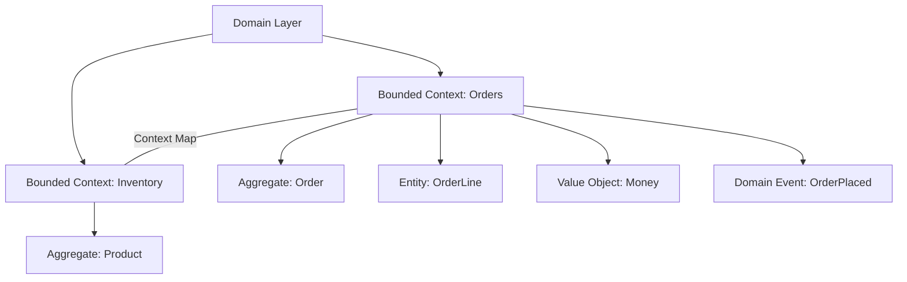

# Domain-Driven Design — A 2-Day Crash Course

DDD aligns your code structure with business domains — bounded contexts prevent teams from stepping on each other, ubiquitous language prevents miscommunication.

---

## Part 0 — Why DDD Exists

Technical architecture should mirror business architecture. That sounds obvious until you work on a codebase where an `Order` means three different things depending on which team wrote the file you're reading.

The core problem DDD solves is translation cost. Every time a developer talks to a product manager, or a backend service calls another backend service, meaning gets lost. A domain model that doesn't reflect how the business actually thinks is a liability — it creates drift between what the code does and what the business needs.

DDD is a design philosophy, not a framework. It gives you a vocabulary and a set of structural patterns for building software that stays honest to the problem it solves. Teams that do it well ship faster and break less because the code is the documentation.

Two levels exist: **strategic** (how you carve up the problem) and **tactical** (how you build within each piece). You need both. Strategic without tactical gives you a good whiteboard diagram and messy code. Tactical without strategic gives you beautiful code solving the wrong problem.

---

## Part 1 — Vocabulary

These terms have precise meanings in DDD. Use them precisely — imprecision here defeats the purpose.

**Domain**
The sphere of knowledge or activity your software operates in. An e-commerce company's domain includes catalog management, order fulfillment, payments, and customer identity. It's the totality of what the business does.

**Subdomain**
A distinct area within the domain. Subdomains come in three flavors:
- *Core* — your competitive advantage. Invest here. This is what makes you different from competitors.
- *Supporting* — necessary but not differentiating. Build it, but don't over-engineer it.
- *Generic* — commodity functionality. Email delivery, PDF generation, authentication. Buy or use open source. Do not build.

**Bounded Context**
An explicit boundary within which a particular domain model applies. Inside the boundary, terms are consistent and unambiguous. Outside it, other rules apply. A `Customer` in the Sales context has a name, a credit limit, and a preferred contact method. A `Customer` in the Shipping context has a delivery address and preferred carrier. These are not the same object — they shouldn't be forced into one.

**Ubiquitous Language**
A shared language between developers and domain experts that is used consistently in conversation, documentation, and — critically — code. When a business analyst says "claim," the code should have a `Claim` class. Not `Request`, not `Submission`, not `IncidentRecord`. The same word, everywhere.

**Entity**
An object defined by its identity, not its attributes. Two users with the same name are not the same user. An entity has a lifecycle — it can be created, modified, deleted. Its identity persists even as its state changes.

**Value Object**
An object defined entirely by its attributes. Two `Money` objects with the same currency and amount are identical — there's no meaningful concept of "which one." Value objects are immutable. You don't change a value object; you replace it with a new one.

**Aggregate**
A cluster of entities and value objects treated as a single unit for data changes. One entity is the *aggregate root* — the only entry point for external access. The root enforces invariants across the whole cluster. An `Order` aggregate might contain `OrderLines` and a `ShippingAddress`, but nothing outside touches `OrderLine` directly — it goes through `Order`.

**Repository**
An abstraction over persistence for aggregates. It looks like a collection in memory. You don't write SQL in your domain — you call `orderRepository.findById(id)` and get back a fully constructed aggregate. The repository handles the mapping between your domain model and whatever storage technology you use.

**Domain Event**
Something that happened in the domain that domain experts care about. `OrderPlaced`, `PaymentFailed`, `ItemShipped`. Domain events are named in the past tense and are facts — immutable records of something that occurred. They are the primary integration mechanism between bounded contexts.

**Context Map**
A diagram showing the relationships between bounded contexts and how they integrate. It captures political and technical relationships: which team owns what, who calls whom, and what the translation strategy is at each boundary.

---

## DAY 1 — Strategic DDD

### Identifying Domains and Subdomains

Start by talking to the people who understand the business. Your job on day one is not to write code — it's to understand what the company actually does and where it derives its value.

Ask: *What problems does this business solve that competitors don't solve as well?* The answer points to core subdomains. Everything that enables the core but isn't differentiating is supporting. Everything that could be bought off the shelf is generic.

Document the subdomains before drawing any technical boundaries. A common mistake is jumping to service decomposition without first understanding the business shape. The business shape drives the technical shape — not the other way around.

### Bounded Contexts

Once you have subdomains, identify bounded contexts. A bounded context is not always one-to-one with a subdomain. Sometimes a large subdomain contains multiple bounded contexts. Sometimes a small subdomain maps to one.

The test: can two team members consistently use the same term to mean the same thing, without needing to check which codebase they're in? If yes, they're likely in the same bounded context. If a term means different things to different teams, you've found a boundary.

Bounded contexts should be owned by teams, not shared across them. The Conway's Law implication is intentional — your system architecture should match your team structure, not fight it.

Signs a bounded context boundary is wrong:
- Teams step on each other's changes frequently
- The same concept appears in two places and drifts over time
- You need a meeting to agree on the definition of a core term

### Context Mapping

Once you have bounded contexts, you need to decide how they communicate. The context map captures these relationships. The main integration patterns:

**Partnership** — two contexts evolve together, coordinating changes. Teams are aligned. Rare in practice because it creates coupling.

**Shared Kernel** — two contexts share a subset of the model. Changes to the shared kernel require agreement from both teams. Use sparingly. The kernel stays small.

**Customer/Supplier** — one context (upstream) provides capabilities to another (downstream). The downstream is the customer and can influence the upstream's roadmap. Explicit contract, negotiated.

**Conformist** — the downstream conforms to the upstream's model with no influence over it. Common when integrating with third-party systems or legacy platforms you cannot change.

**Anti-Corruption Layer (ACL)** — the downstream builds a translation layer to protect its model from the upstream's concepts. This is your defense when the upstream's model is messy or misaligned with your domain. The ACL translates between worlds.

**Open Host Service** — the upstream publishes a well-defined protocol (usually an API) that multiple downstreams use. The upstream defines the contract; downstreams consume it.

**Published Language** — a shared, documented data exchange format (JSON schema, Protobuf, OpenAPI). Often combined with Open Host Service.

Draw the context map early, even if it's imprecise. Update it as your understanding improves. It is a living document.

### Ubiquitous Language in Practice

Building ubiquitous language is an active process. It doesn't emerge on its own.

Run event storming workshops: gather developers, product managers, and domain experts in a room (or a Miro board). Use sticky notes to surface domain events, commands, and concepts. The language that emerges from these sessions is your starting vocabulary.

Document the glossary per bounded context. The same word might mean different things in different contexts — that's fine and expected. What's not acceptable is ambiguity *within* a context.

The code enforces the language. If someone proposes renaming a concept in a meeting and the code still uses the old name a month later, the ubiquitous language has failed. Rename it in the code.

---

## DAY 2 — Tactical DDD

### Entities

An entity has identity that persists across time and state changes. Use a stable, generated identifier — UUID or similar — not a mutable business attribute like an email address.

Keep entities focused. An entity should represent one coherent concept, not a grab-bag of fields. If your `User` entity has 40 fields spanning billing, authentication, preferences, and shipping, you have a modeling problem, not an entity problem.

Entities contain behavior, not just data. A `Subscription` entity should know how to `cancel()` itself, not just expose a `status` field that a service mutates from the outside.

### Value Objects

A value object is immutable by definition. When you "change" an address, you replace the old `Address` value object with a new one. You never modify it in place.

Value objects are equality-compared by their attributes, not by reference. Two `Money(100, "USD")` objects are the same object for all practical purposes.

Good candidates for value objects: money, dates, addresses, email addresses, phone numbers, geographic coordinates, measurements. Anything where identity doesn't matter — only the value does.

The payoff: value objects are easy to reason about, easy to test, and safe to pass around without defensive copying.

### Aggregates

The aggregate is the most misunderstood pattern in DDD. Teams either make aggregates too large (one giant aggregate per subdomain) or too small (every entity is its own aggregate, defeating the purpose).

The rules:

1. Design aggregates around transactional consistency boundaries. Everything inside an aggregate is consistent at commit time.
2. Reference other aggregates by identity only, never by object reference.
3. Apply changes to an aggregate through the root only.
4. Keep aggregates small. If you find yourself loading a large object graph to change one field, the aggregate is probably too big.

The `Order` and `OrderLine` are a textbook aggregate. You always create, modify, and delete order lines through the `Order` root. `Order` enforces the invariant that total line items don't exceed a configured limit, or that you can't add items to a shipped order.

⚠️ The most common tactical mistake: one team puts a domain object inside another team's aggregate because it "feels related." This couples bounded contexts at the data model level — exactly what DDD is trying to prevent. Use domain events to communicate across aggregates instead.

### Domain Events

Domain events are facts about what happened. They are the primary way aggregates communicate changes to the rest of the system.

When an `Order` is placed, it raises an `OrderPlaced` event. The Payment context listens for this event and initiates a charge. The Inventory context listens and reserves stock. Neither the Payment context nor the Inventory context is coupled to the Order aggregate — they're coupled to the event.

Events should be named after what happened, past tense: `CustomerRegistered`, `PaymentAuthorized`, `ShipmentDispatched`. The event payload should contain everything a consumer needs to react — don't make consumers query back for data.

Store events as an audit trail when possible. Event sourcing (rebuilding aggregate state from events) is a separate and more complex pattern — you don't need to go that far to benefit from domain events.

### Repositories

A repository is the gateway between your domain model and your persistence layer. It speaks domain language, not SQL.

The interface lives in the domain layer. The implementation lives in the infrastructure layer. Your domain code depends on the interface — never on the implementation.

A repository handles one aggregate type. `OrderRepository` returns `Order` aggregates. It does not return `OrderLine` objects directly.

Keep repositories simple: `findById`, `findByCustomerId`, `save`, `delete`. Resist the temptation to add complex query methods to repositories — that leads to a "repository as query service" anti-pattern. For complex reads, use a separate query model (CQRS territory).

### DDD + Microservices

Bounded contexts are the natural decomposition unit for microservices. One bounded context maps to one service (or a small cluster of closely related services under one team).

Do not extract a microservice until you have a clear bounded context boundary. Premature extraction without domain clarity creates distributed monoliths — services that are physically separate but logically coupled through a shared database or excessive synchronous calls.

The ACL pattern becomes your service boundary contract. When Service A calls Service B, the response is translated into Service A's own domain concepts before use. Service A's domain model does not absorb Service B's model.

Use domain events for asynchronous integration between services. Use synchronous calls sparingly — only when the consumer genuinely needs an immediate response.

### DDD in Interviews

System design interviews reward DDD thinking even when they don't ask for it explicitly. When an interviewer says "design a ride-sharing app," your DDD-fluent response starts with: what are the core subdomains? (Matching is core. Payments is supporting. Notifications are generic.) What are the bounded contexts? (Matching, Pricing, Trip Management, Driver Management, Payments.)

Mentioning bounded contexts, aggregate consistency, and domain events signals seniority. It shows you think about decomposition in terms of business capability, not just technical layers.

Walk through: identify the core domain, draw the context map, define two or three key aggregates with their invariants, describe how domain events flow between contexts. That structure will carry you through most system design scenarios.

### When NOT to Use DDD

DDD has a cost. It requires investment in domain modeling, workshops, and discipline to maintain boundaries. It pays off when:

- The domain is genuinely complex with rich business rules
- Multiple teams work in the same product space
- The codebase needs to evolve over years

It does not pay off when:

- You're building a CRUD application with simple business rules
- The team is small and moves fast enough that explicit context boundaries create overhead without benefit
- You're building an internal tool with a short lifespan

Applying full tactical DDD to a simple content management system is over-engineering. Be honest about where you are on the complexity spectrum. Use the vocabulary and strategic patterns broadly — reserve the full tactical toolkit for the parts of the system that genuinely need it.

---

## Worked Example — Modeling an E-Commerce Platform

You're designing the backend for an e-commerce platform. Here's how DDD shapes the model.

**Identify subdomains**
- Core: Product Discovery, Order Fulfillment (your competitive advantage — fast, reliable, personalized)
- Supporting: Inventory Management, Customer Accounts, Returns Processing
- Generic: Email Notifications, Payment Processing (Stripe), Tax Calculation (Avalara)

**Define bounded contexts**
- Catalog — product listings, search, categories, pricing rules
- Orders — cart, checkout, order lifecycle
- Fulfillment — picking, packing, shipping
- Customer — registration, identity, preferences
- Payments — charge, refund, authorization (wraps Stripe with an ACL)

**Context map relationships**
- Orders → Payments: Customer/Supplier. Orders tells Payments what to charge; Payments reports authorization results via domain event.
- Orders → Fulfillment: Published Language. `OrderConfirmed` event triggers fulfillment workflow.
- Catalog → Orders: Conformist. Orders reads product data from Catalog's published API. Orders adapts to Catalog's model.
- Payments wraps Stripe with an Anti-Corruption Layer — Stripe's concepts (PaymentIntent, Charge) never appear in the Payments domain model directly.

**Key aggregates**
- `Order` aggregate root: contains `OrderLines`, `ShippingAddress`, `PaymentDetails`. Enforces invariants: minimum order value, maximum line item count, no modifications after shipment.
- `Product` aggregate in Catalog: contains `Variants`, `PricingRules`. Enforces that a product always has at least one active variant.

**Domain events flowing between contexts**
- `OrderPlaced` (Orders → Fulfillment, Payments, Inventory)
- `PaymentAuthorized` (Payments → Orders)
- `ShipmentDispatched` (Fulfillment → Orders, Customer notifications)
- `PaymentFailed` (Payments → Orders — triggers cancellation flow)

This structure lets the Orders team and the Fulfillment team deploy independently. A change to how Fulfillment handles returns has zero impact on the Orders codebase.

---

## Pitfalls

**The God Aggregate.** Everything ends up in one aggregate because "it's all related." The result is a massive object graph that locks a database row for every operation. Rule of thumb: if your aggregate has more than four or five entities, question it.

**Skipping the context map.** Teams build bounded contexts in isolation and discover integration problems late. Draw the context map before writing code, not after.

**Shared database across bounded contexts.** Two services share a schema because "it's just one join." This couples the models permanently. Each bounded context owns its data store. Period.

**Anemic domain model.** Entities and aggregates are pure data carriers. All business logic lives in service classes. This is not DDD — it's procedural code with domain-flavored naming. Behavior belongs on the aggregate.

**Ubiquitous language in docs only.** The glossary exists in Confluence. The code uses different names. Every translation between the language of the domain and the language of the code is a bug waiting to happen. If the domain expert says "policy," the code says `Policy`.

**Over-applying tactical patterns.** Not every object needs to be an entity or a value object. Not every service interaction needs a domain event. Use the patterns where they reduce complexity, not as a religious obligation.

---

## Quick Reference

| Concept | One-line definition |
|---|---|
| Domain | The sphere of knowledge the software operates in |
| Subdomain | A distinct area within the domain (core / supporting / generic) |
| Bounded Context | An explicit boundary where a model is consistent and unambiguous |
| Ubiquitous Language | Shared vocabulary used identically in conversation and code |
| Entity | Object defined by identity, not attributes |
| Value Object | Immutable object defined entirely by its attributes |
| Aggregate | Cluster of objects with a single root enforcing consistency invariants |
| Repository | Domain-language abstraction over persistence |
| Domain Event | Immutable fact about something that happened (past tense) |
| Context Map | Diagram of relationships and integration strategies between bounded contexts |
| ACL | Anti-Corruption Layer — translation layer protecting one model from another |

---

## Quick Quiz

Test your understanding with these rapid-fire questions (answers hidden):

1. What is the ONE core problem that DDD solves?

Re-read Part 0 — the mental model section. If you can explain the "why" in one sentence, you understand the foundation.

2. Name the 3 most important terms from the vocabulary section.

Review Part 1. These are the building blocks every conversation about DDD uses.

3. What is the first thing you would set up on Day 1?

Check the Day 1 section — the very first hands-on step that gets you a working result.

4. What is the most common production pitfall with DDD?

Review the Common Pitfalls section. The first item listed is typically the most frequently encountered.

5. How does DDD compare to its closest alternative?

Check the Comparison Matrix below — focus on the key differentiating row.

## Comparison Matrix

| Dimension | DDD | CRUD/Anemic | Event Sourcing |
|-----------|-----|-------------|----------------|
| **Primary use case** | Core strength of DDD | Core strength of CRUD/Anemic | Core strength of Event Sourcing |
| **Learning curve** | Moderate | Varies | Varies |
| **Community/ecosystem** | Active | Active | Growing |
| **Operational complexity** | Medium | Varies | Varies |
| **Best for** | See Part 0 | Different tradeoffs | Different tradeoffs |

> **How to read this matrix:** no tool wins on every dimension. Pick based on your specific constraints — team expertise, existing infrastructure, scale requirements, and compliance needs. The right choice is the one that fits your context, not the one with the most checkmarks.

## Next Steps

- `Microservices-Patterns.md` — bounded contexts in distributed systems, service mesh, event-driven integration
- `Clean-Architecture.md` — how DDD's layering maps to ports and adapters, dependency rules
- `System-Design.md` — applying domain decomposition in system design interviews at scale

---

## Recommended learning resources

**YouTube channels & playlists:**
- [Martin Fowler — Domain-Driven Design Talks](https://www.youtube.com/results?search_query=martin+fowler+domain+driven+design) — bounded contexts, aggregates, and the strategic patterns that matter most in practice
- [CodeOpinion — DDD in Practice](https://www.youtube.com/@CodeOpinion) — practical DDD: aggregate boundaries, domain events, and integration patterns in real systems
- [Vaughn Vernon — Implementing DDD](https://www.youtube.com/results?search_query=vaughn+vernon+domain+driven+design) — the author of "Implementing Domain-Driven Design" on aggregates, bounded contexts, and context mapping
- [GOTO Conferences — DDD Talks](https://www.youtube.com/results?search_query=GOTO+domain+driven+design) — practitioner talks on event storming, strategic design, and bounded context integration
- [Milan Jovanovic — DDD Building Blocks](https://www.youtube.com/@MilanJovanovic) — entities, value objects, domain events, and repository patterns with code examples

**Official docs & blogs:**
- [martinfowler.com — DDD](https://martinfowler.com/tags/domain%20driven%20design.html) — bounded context, ubiquitous language, aggregate, and event sourcing explained by Fowler
- [Domain Language (Eric Evans)](https://www.domainlanguage.com/) — resources from the creator of DDD, including the original reference material

---

## The Mantra

> Model the business, not the database. Own your language, own your boundaries, own your events. When the domain expert and the code agree on what a word means, you're doing it right.

## Top 10 Interview Questions

<strong>Q: What is a Bounded Context and why is it the most important concept in DDD?</strong>

A Bounded Context is a boundary within which a domain model is consistent and terms have specific meanings. 'Customer' in the Sales context has different attributes and behaviour than 'Customer' in the Billing context. Without bounded contexts, teams create one giant shared model where every change affects everyone — the Big Ball of Mud. Bounded contexts enable: independent team ownership, independent deployment, clear contracts between contexts, and models that accurately reflect their specific subdomain.

<strong>Q: What is the difference between an Entity and a Value Object?</strong>

An Entity has identity — two entities with the same attributes but different IDs are different (User #123 vs User #456). A Value Object has no identity — it is defined entirely by its attributes (Money(100, 'USD') equals any other Money(100, 'USD')). Value Objects should be immutable. Use Entities for things you track individually (orders, users, products). Use Value Objects for descriptors (addresses, money, date ranges, coordinates). Preferring Value Objects reduces complexity and bug surface.

<strong>Q: What is an Aggregate and what is the Aggregate Root?</strong>

An Aggregate is a cluster of related objects treated as a single unit for data changes — it enforces invariants (business rules). The Aggregate Root is the entry point — all modifications go through it. Example: Order (root) contains OrderLines. You cannot modify an OrderLine directly; you call Order.addItem() which validates the business rules (max items, inventory check). External objects hold references only to the Aggregate Root, never to internal entities. Aggregates are the unit of consistency and transaction boundary.

<strong>Q: How do Domain Events enable loose coupling between Bounded Contexts?</strong>

When something significant happens in one context (OrderPlaced in Sales), it publishes a domain event. Other contexts (Inventory, Shipping, Billing) subscribe to events they care about and react independently. This decouples contexts: Sales does not know or care what Inventory does when an order is placed. Implementation: in-process event bus for same-service events, message broker (Kafka, RabbitMQ) for cross-service events. Events should be immutable facts about what happened, not commands.

<strong>Q: What is the difference between a Domain Service and an Application Service?</strong>

A Domain Service encapsulates domain logic that does not naturally belong to any single Entity or Value Object — e.g., a pricing strategy that depends on multiple aggregates. An Application Service orchestrates the workflow: loads aggregates from repositories, calls domain services, persists changes, and publishes events. Application Services are thin — they delegate business logic to the domain layer. A common mistake: putting business logic in Application Services, which leads to an anaemic domain model.

<strong>Q: What is an Anaemic Domain Model and why is it considered an anti-pattern?</strong>

An anaemic model has entities with only getters and setters (data bags) and all business logic in service classes. This violates OOP encapsulation — the model does not protect its own invariants. Example: instead of Order.addItem() enforcing max-items-per-order, a service checks the rule externally, meaning any code can bypass it. A rich domain model puts behaviour where the data is: Order knows its own rules. The anaemic model is an anti-pattern because it leads to scattered, duplicated, and inconsistent business rule enforcement.

<strong>Q: How do you identify Bounded Contexts in a new project?</strong>

Listen to domain experts: when the same word means different things to different teams, you have found a context boundary. Event Storming is the best discovery technique: gather domain experts, map domain events on a timeline, group related events, and identify boundaries where language and models diverge. Also look at: organisational boundaries (Conway's Law), independently deployable units, and data ownership. Start with larger contexts and split as you learn — splitting too early creates unnecessary integration complexity.

<strong>Q: What is a Context Map and what are the common integration patterns?</strong>

A Context Map documents how Bounded Contexts relate to each other. Patterns: Shared Kernel (shared model subset — tight coupling, use sparingly), Customer-Supplier (upstream produces, downstream consumes — negotiate the contract), Conformist (downstream adopts upstream's model — no negotiation power), Anti-Corruption Layer (translate between models — protects your domain from external model changes), and Open Host Service (publish a well-defined API for multiple consumers). Choose based on team relationships and power dynamics.

<strong>Q: How does DDD apply to microservice architecture?</strong>

Each microservice typically maps to one Bounded Context (or a small number of closely related contexts). The microservice owns its data and domain model. Integration between microservices uses domain events (async via message broker) or API calls (sync, with Anti-Corruption Layers). DDD provides the strategic design (which services to build) while microservice architecture provides the technical implementation. Without DDD, microservices tend to become distributed monoliths — tightly coupled services with the wrong boundaries.

<strong>Q: What is Event Sourcing and how does it relate to DDD?</strong>

Event Sourcing stores the sequence of domain events (OrderPlaced, ItemAdded, OrderShipped) as the source of truth instead of the current state. The current state is derived by replaying events. Relationship to DDD: domain events are already a core DDD concept — Event Sourcing makes them the persistence mechanism. Benefits: complete audit trail, temporal queries (what was the state at time T?), easy debugging. Tradeoffs: complexity (event versioning, snapshots for performance), eventual consistency, and a different mental model for developers.

---

