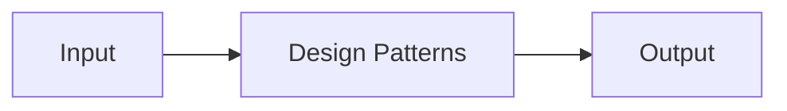

# Design Patterns — A 2-Day Crash Course

Design patterns are reusable solutions to common software problems — knowing them lets you recognize and solve structural issues instantly instead of reinventing the wheel every time.

---

## Part 0 — Why Bother

You've already used patterns without knowing their names. Every time you wrapped a class to add logging, every time you passed a function to switch behavior at runtime, every time you wrote a singleton config object — you were applying patterns informally. Naming them gives you a shared vocabulary with every engineer on your team and a mental shortcut that collapses hours of design work into seconds of recognition.

When someone says "use a Strategy here," you immediately understand the shape of the solution. When you say "this looks like a Proxy," your teammate knows exactly what to look for in the code. That compression is the real value.

Patterns also make you a better reader of other people's code. Frameworks, infrastructure tools, and open-source libraries are built on these ideas. Once you know the vocabulary, you stop feeling like a stranger in unfamiliar codebases.

---

## Vocabulary

**Pattern** — A named, repeatable solution to a recurring design problem. Not copy-paste code — a template for thinking.

**Creational** — Patterns that control how objects are created. They decouple the creation logic from the usage logic.

**Structural** — Patterns that define how classes and objects are composed into larger structures.

**Behavioral** — Patterns that define how objects communicate and distribute responsibility.

**Intent** — The one-sentence purpose of a pattern. Always start here when learning a new one.

**Applicability** — The conditions under which a pattern is the right tool. Knowing when NOT to use it matters as much as knowing what it does.

**Anti-pattern** — A commonly used solution that looks reasonable but causes more problems than it solves. Recognizing these is as valuable as knowing the good patterns.

---




## DAY 1 — Creational and Structural Patterns

---

### Creational Patterns

Creational patterns solve one core problem: your code should not care about how objects come into existence. The moment your business logic is littered with `new ConcreteCloudProvider()` calls, you've coupled yourself to an implementation detail that will hurt when requirements change.

---

#### Factory Method

**Intent:** Define an interface for creating an object, but let subclasses or configuration decide which class to instantiate.

**The problem it solves:** You need to create objects whose exact type is determined at runtime — by config, environment, or user input.

**SRE/ops example — cloud provider abstraction:**

You're building a tool that provisions infrastructure. It needs to work against AWS, GCP, and Azure. Instead of scattering `if cloud == "aws"` blocks everywhere, you define a `CloudProvider` interface and a factory that returns the right implementation based on config.

```python
class CloudProviderFactory:
    @staticmethod
    def create(provider_name: str) -> CloudProvider:
        providers = {
            "aws": AWSProvider,
            "gcp": GCPProvider,
            "azure": AzureProvider,
        }
        cls = providers.get(provider_name)
        if not cls:
            raise ValueError(f"Unknown provider: {provider_name}")
        return cls()
```

Your provisioning logic calls `factory.create(config.cloud)` and never references a concrete class again. Adding a new cloud provider means adding one entry — nothing else changes.

**When to use it:** The type of object you need to create is determined at runtime. You want to isolate creation logic. You're building plugin systems or extensible frameworks.

**When to skip it:** You only ever create one type of object and that will never change. Adding a factory here is noise.

---

#### Builder

**Intent:** Separate the construction of a complex object from its representation, so the same construction process can create different representations.

**The problem it solves:** Constructors with 8 parameters are a maintenance trap. Optional parameters with defaults become invisible to callers. Builder makes complex object construction readable and incremental.

**SRE/ops example — building a monitoring alert:**

```python
alert = (
    AlertBuilder()
    .for_metric("cpu_usage")
    .threshold(90)
    .window("5m")
    .severity("critical")
    .notify_channel("#oncall")
    .build()
)
```

Each method is self-documenting. You can't forget a required field — `.build()` validates and raises early. Adding a new optional field to `Alert` doesn't break every existing caller.

**When to use it:** Object construction involves many optional or ordered steps. You want immutable objects but need flexible construction. You find yourself writing telescoping constructors.

---

#### Singleton

**Intent:** Ensure a class has only one instance and provide a global access point to it.

⚠️ This is the most misused creational pattern. Use it only when a single shared instance is genuinely required — not for convenience.

**Legitimate uses:** A config loader that reads from disk once. A connection pool. A metrics registry. A logger.

```python
class Config:
    _instance = None

    def __new__(cls):
        if cls._instance is None:
            cls._instance = super().__new__(cls)
            cls._instance._load()
        return cls._instance
```

**What makes it dangerous:** It introduces hidden global state, makes testing hard, and creates tight coupling across modules. In most modern applications, dependency injection handles this better — you declare something as a singleton in the DI container and let the framework manage the lifecycle.

**Rule of thumb:** If you're reaching for Singleton to avoid passing a dependency through a call chain, reach for dependency injection instead.

---

### Structural Patterns

Structural patterns are about composition — how you combine simple objects and classes into larger, more capable structures without blowing up complexity.

---

#### Adapter

**Intent:** Convert the interface of a class into another interface that clients expect.

**The problem it solves:** You have two things that need to work together but speak different interfaces — typically when integrating a third-party library or legacy system.

**SRE/ops example:** Your monitoring system expects a `MetricsClient` with a `push(metric, value, tags)` method. You're integrating a new vendor whose SDK uses `record(name, data, labels)`. You write an adapter:

```python
class VendorMetricsAdapter:
    def __init__(self, vendor_client):
        self._client = vendor_client

    def push(self, metric: str, value: float, tags: dict):
        self._client.record(
            name=metric,
            data={"value": value},
            labels=tags,
        )
```

Your system never changes. The vendor SDK never changes. The adapter bridges them.

**When to use it:** Integrating third-party code you can't modify. Migrating from one library to another incrementally. Working with legacy interfaces that can't be refactored.

---

#### Decorator

**Intent:** Attach additional behavior to an object dynamically, as an alternative to subclassing for extending functionality.

**The problem it solves:** You want to add capabilities — logging, caching, auth checking, rate limiting — without modifying the original class or creating an explosion of subclasses.

**SRE/ops example — middleware chains:**

HTTP middleware in any modern framework is a Decorator chain. Each layer wraps the next:

```python
class LoggingHandler:
    def __init__(self, inner_handler):
        self._inner = inner_handler

    def handle(self, request):
        logger.info(f"Incoming: {request.path}")
        response = self._inner.handle(request)
        logger.info(f"Outgoing: {response.status}")
        return response

class RateLimitHandler:
    def __init__(self, inner_handler, limit):
        self._inner = inner_handler
        self._limit = limit

    def handle(self, request):
        if self._is_rate_limited(request):
            return Response(429)
        return self._inner.handle(request)
```

You compose them:

```python
handler = LoggingHandler(RateLimitHandler(CoreHandler(), limit=100))
```

Each decorator is independently testable and independently composable. Adding tracing means adding one more wrapper — no existing code changes.

**When to use it:** Adding cross-cutting concerns (logging, auth, caching, metrics). You need to mix and match capabilities at runtime. Inheritance would create too many subclasses.

---

#### Proxy

**Intent:** Provide a surrogate or placeholder for another object to control access to it.

**The problem it solves:** You want to add behavior when an object is accessed — without changing the object itself or its callers.

**SRE/ops example — caching proxy:**

```python
class CachingDatabaseProxy:
    def __init__(self, real_db, cache):
        self._db = real_db
        self._cache = cache

    def query(self, sql: str, params: tuple):
        key = (sql, params)
        if key in self._cache:
            return self._cache[key]
        result = self._db.query(sql, params)
        self._cache[key] = result
        return result
```

Callers talk to `CachingDatabaseProxy` with the same interface as the real database. The cache is invisible to them.

Other proxy uses: lazy initialization (don't load until needed), access control (check permissions before delegating), remote proxies (a local stand-in for a remote service — this is how gRPC stubs work).

**Decorator vs Proxy:** Decorator adds behavior. Proxy controls access. The distinction is about intent, not structure — they often look similar in code.

---

#### Facade

**Intent:** Provide a simplified interface to a complex subsystem.

**The problem it solves:** Your subsystem is correct and complete but complicated to use directly. Callers have to know about five different classes and call them in the right order.

**SRE/ops example — incident response facade:**

```python
class IncidentFacade:
    def __init__(self, pager, runbook, metrics, slack):
        self._pager = pager
        self._runbook = runbook
        self._metrics = metrics
        self._slack = slack

    def declare_incident(self, title: str, severity: str):
        incident_id = self._pager.create_incident(title, severity)
        runbook_url = self._runbook.get_for_severity(severity)
        self._slack.post_to_channel(
            "#incidents",
            f"Incident {incident_id} declared: {title}\nRunbook: {runbook_url}"
        )
        self._metrics.increment("incidents.opened", tags={"severity": severity})
        return incident_id
```

Callers invoke one method. The complexity of coordinating four systems is hidden.

**Facade vs Adapter:** Adapter makes incompatible interfaces compatible. Facade simplifies a complex interface. Adapter is about translation — Facade is about simplification.

---

## DAY 2 — Behavioral Patterns, Infrastructure, Anti-patterns

---

### Behavioral Patterns

Behavioral patterns are about the runtime communication between objects — who calls what, when, and how responsibility flows through a system.

---

#### Strategy

**Intent:** Define a family of algorithms, encapsulate each one, and make them interchangeable.

**The problem it solves:** You have a place in your code where the algorithm needs to vary independently of the clients that use it. Instead of if/else chains that grow forever, you extract each algorithm into its own class.

**Infrastructure example — deployment strategies:**

```python
class BlueGreenStrategy:
    def deploy(self, service, artifact):
        # spin up green, shift traffic, tear down blue
        ...

class CanaryStrategy:
    def deploy(self, service, artifact):
        # shift 5% traffic, watch metrics, increment
        ...

class RollingStrategy:
    def deploy(self, service, artifact):
        # replace instances one by one
        ...

class DeploymentPipeline:
    def __init__(self, strategy):
        self._strategy = strategy

    def run(self, service, artifact):
        self._strategy.deploy(service, artifact)
```

You pick the strategy from config. Adding a new deployment type — say, shadow traffic — means adding one new class, not touching `DeploymentPipeline`.

---

#### Observer

**Intent:** Define a one-to-many dependency so that when one object changes state, all its dependents are notified automatically.

**Infrastructure example — event systems:**

```python
class EventBus:
    def __init__(self):
        self._subscribers = {}

    def subscribe(self, event_type: str, handler):
        self._subscribers.setdefault(event_type, []).append(handler)

    def publish(self, event_type: str, payload):
        for handler in self._subscribers.get(event_type, []):
            handler(payload)
```

Your deployment system publishes `deployment.completed`. A Slack notification handler, a metrics recorder, and an audit logger all subscribe independently. The deployment system knows nothing about them. Adding a new reaction to a deployment event means adding a subscriber — not modifying the deployment code.

This is the foundation of event-driven architecture, pub/sub systems, and reactive programming.

---

#### Command

**Intent:** Encapsulate a request as an object, allowing you to parameterize clients with different requests, queue or log requests, and support undoable operations.

**The problem it solves:** You want to decouple the thing that issues an action from the thing that executes it. You may also need to queue, retry, log, or undo actions.

**Infrastructure example — runbook automation:**

```python
@dataclass
class ScaleServiceCommand:
    service_name: str
    replica_count: int

    def execute(self, k8s_client):
        k8s_client.scale(self.service_name, self.replica_count)

    def undo(self, k8s_client, original_count):
        k8s_client.scale(self.service_name, original_count)
```

Commands are serializable — you can queue them, replay them, audit them, and undo them. This is how database transactions work. It's also the basis for Terraform's plan/apply model.

---

#### State

**Intent:** Allow an object to alter its behavior when its internal state changes. The object will appear to change its class.

**Infrastructure example — circuit breakers:**

A circuit breaker has three states: Closed (passing requests), Open (blocking requests), Half-Open (testing recovery). The behavior in each state is completely different.

```python
class CircuitBreaker:
    def __init__(self):
        self._state = ClosedState(self)

    def call(self, fn):
        return self._state.call(fn)

    def on_success(self):
        self._state.on_success()

    def on_failure(self):
        self._state.on_failure()

    def transition_to(self, state):
        self._state = state
```

Each state class handles its own logic and triggers transitions. You don't need a single massive class with if/elif chains tracking state variables — each state is its own object with its own rules.

---

#### Template Method

**Intent:** Define the skeleton of an algorithm in a base class, deferring some steps to subclasses.

**The problem it solves:** You have a process where the overall structure is fixed but specific steps vary.

**Infrastructure example — health check framework:**

```python
class HealthCheck:
    def run(self):
        self._connect()
        result = self._check()
        self._disconnect()
        return result

    def _connect(self): raise NotImplementedError
    def _check(self): raise NotImplementedError
    def _disconnect(self): pass  # optional override
```

Every health check follows the same lifecycle. Subclasses provide only the parts that differ. You can't accidentally skip `_disconnect` — the template ensures it's always called.

---

### Anti-patterns to Avoid

**God Object** — A single class that knows too much and does too much. It accumulates responsibility over time until changing anything in the system requires touching it. Break it apart by responsibility.

**Lava Flow** — Dead code and obsolete designs that nobody dares delete because "we don't know what it does." It hardens over time and prevents refactoring. Delete with tests, not guesswork.

**Golden Hammer** — Applying your favorite pattern to every problem. If all you know is Singleton, everything looks like a global state problem. Learn multiple patterns so you can match the right tool to the right problem.

**Premature Abstraction** — Building a plugin system for a feature that will never have a second plugin. Patterns have a cost — indirection, extra files, more concepts to hold in your head. Pay that cost only when the benefit is real.

**Anemic Domain Model** — Objects that are nothing but data containers with no behavior. All the logic lives in service classes. This is not object-oriented design — it's procedural code wearing OOP clothes. Push behavior into the objects that own the data.

---

### Patterns in Interviews

System design interviews reward pattern recognition. When you see:

- "How do you support multiple payment providers?" → Factory + Strategy
- "How do you notify users across email, SMS, push?" → Observer + Factory
- "How do you add retry/logging to a service call?" → Decorator or Proxy
- "How do you handle configuration across environments?" → Singleton (or DI)
- "How do you support multiple deployment strategies?" → Strategy
- "How do you build an undo/redo system?" → Command
- "How do you model a state machine?" → State

Naming the pattern signals that you think structurally. Follow the name with the tradeoffs — that signals maturity.

---

## Worked Example — Refactoring a Notification System

**The before state:**

```python
def send_notification(user, message, channel):
    if channel == "email":
        smtp.send(user.email, message)
    elif channel == "sms":
        twilio.send(user.phone, message)
    elif channel == "slack":
        slack_api.post(user.slack_id, message)
    elif channel == "pagerduty":
        pd.trigger(user.pd_key, message)
```

This function grows every time you add a channel. It mixes creation, routing, and delivery. It's untestable in isolation. It violates the Open/Closed Principle — adding a channel requires modifying this function.

**Step 1 — Strategy for delivery:**

```python
class EmailNotifier:
    def send(self, user, message): smtp.send(user.email, message)

class SMSNotifier:
    def send(self, user, message): twilio.send(user.phone, message)

class SlackNotifier:
    def send(self, user, message): slack_api.post(user.slack_id, message)
```

Each notifier is independently testable. Adding PagerDuty means adding a class — nothing else changes.

**Step 2 — Factory for selection:**

```python
class NotifierFactory:
    _registry = {
        "email": EmailNotifier,
        "sms": SMSNotifier,
        "slack": SlackNotifier,
    }

    @classmethod
    def create(cls, channel: str) -> Notifier:
        klass = cls._registry.get(channel)
        if not klass:
            raise ValueError(f"Unknown channel: {channel}")
        return klass()
```

Selection logic is isolated. The factory can be extended without touching strategies.

**Step 3 — Observer for routing:**

```python
class NotificationBus:
    def __init__(self):
        self._handlers = []

    def register(self, handler):
        self._handlers.append(handler)

    def dispatch(self, event):
        for handler in self._handlers:
            handler.handle(event)
```

Each user's notification preferences subscribe different handlers. When an alert fires, the bus dispatches to all of them. Adding a new routing rule — "only page on-call between 22:00 and 06:00" — means adding a handler that wraps `PagerdutyNotifier`, not modifying the bus or the strategies.

**What you gained:** The original function was 10 lines that would grow to 50. The refactored system is more code in total but each piece is small, named, and independently changeable. You can test email delivery without SMS. You can mock the factory in integration tests. You can add `WebhookNotifier` without touching anything existing.

---

## Pitfalls

**Over-engineering** is the most common mistake when you first learn patterns. You see a Factory opportunity in code that creates exactly one type of object. You introduce an Observer where a simple function call would do. Patterns are tools for managing complexity — if the complexity isn't there yet, the pattern just adds indirection without benefit.

A useful test: if you removed the pattern and replaced it with the simplest possible code, would anything get harder? If the answer is no, remove it.

**Pattern forcing** is applying a pattern because you recognize the shape of the problem, not because the tradeoffs fit. Strategy is elegant — but if you only have two strategies and they'll never change, two functions and an if statement is cleaner. Don't pay the abstraction cost for a benefit you'll never collect.

**Naming without understanding** is a trap in interviews and code review. Saying "we should use a Facade here" when you mean "we should simplify this interface" is fine — that's the pattern. But if you can't explain what changes and what stays the same, you haven't understood it yet.

---

## Quick Reference — Pattern Decision Table

| Problem | Pattern |
|---|---|
| Creating objects without specifying exact class | Factory Method |
| Building complex objects step by step | Builder |
| One shared instance across the system | Singleton (prefer DI where possible) |
| Making incompatible interfaces work together | Adapter |
| Adding behavior without modifying a class | Decorator |
| Controlling access, caching, or logging transparently | Proxy |
| Simplifying a complex subsystem | Facade |
| Swapping algorithms at runtime | Strategy |
| Notifying multiple dependents of state changes | Observer |
| Encapsulating requests for queuing, logging, undo | Command |
| Object behavior varies by internal state | State |
| Fixed process with variable steps | Template Method |

---

## Top 10 Interview Questions

<details>
<summary><strong>Q: What is the difference between the Strategy and State patterns?</strong></summary>

Both encapsulate behavior behind an interface, but the intent differs. Strategy lets you swap algorithms from outside — the client picks which strategy to use. State lets an object change its own behavior when its internal state changes — transitions happen internally. A deployment pipeline picks a strategy (blue-green, canary). A circuit breaker transitions between states (closed, open, half-open) based on failure counts. Strategy is about choice; State is about lifecycle.

</details>

<details>
<summary><strong>Q: When would you use a Decorator over inheritance?</strong></summary>

Use Decorator when you need to add behavior dynamically and compose capabilities independently — logging, caching, rate limiting, auth. Inheritance creates a rigid hierarchy: `LoggingCachingAuthService` is a maintenance nightmare. With Decorator, each concern wraps the next and is independently testable and composable. Use inheritance only for true "is-a" relationships where the subclass honors the parent's contract completely.

</details>

<details>
<summary><strong>Q: How does the Factory Method pattern support the Open/Closed Principle?</strong></summary>

Factory Method centralizes object creation behind an interface. When a new type is added (a new cloud provider, a new notification channel), you add one entry to the factory — no existing code changes. Without a factory, every `if cloud == "aws"` block in your codebase needs updating. The system is open for extension (add a new class) and closed for modification (existing creation logic untouched).

</details>

<details>
<summary><strong>Q: What is the difference between Adapter, Proxy, and Decorator?</strong></summary>

Adapter converts one interface into another — bridging incompatible APIs (e.g., wrapping a vendor SDK). Proxy controls access to an object with the same interface — adding caching, lazy loading, or access control transparently. Decorator adds behavior to an object with the same interface — layering logging, metrics, or auth. The structural code often looks similar; the distinction is intent: translation (Adapter), control (Proxy), enhancement (Decorator).

</details>

<details>
<summary><strong>Q: Why is Singleton considered dangerous and what should you use instead?</strong></summary>

Singleton introduces hidden global state, makes testing hard because you cannot substitute the instance, and creates tight coupling across modules. In most modern applications, dependency injection handles the same need — you declare something as a singleton in the DI container and let the framework manage the lifecycle. Legitimate uses remain: config loaders, connection pools, metrics registries. But if you are reaching for Singleton to avoid passing a dependency, reach for DI instead.

</details>

<details>
<summary><strong>Q: How does the Observer pattern relate to event-driven architecture?</strong></summary>

Observer is the in-process foundation of event-driven architecture. A subject notifies registered observers of state changes. At the system level, this becomes pub/sub: a deployment system publishes `deployment.completed`, and Slack notification, metrics, and audit handlers subscribe independently. The publisher knows nothing about its consumers. Adding a reaction means adding a subscriber, not modifying the publisher. This decoupling is what makes event-driven systems extensible.

</details>

<details>
<summary><strong>Q: When is the Command pattern the right choice?</strong></summary>

Command encapsulates a request as an object, enabling queueing, logging, replay, and undo. Use it when you need audit trails (every action is a serializable record), undo/redo functionality, or deferred execution (queue commands for later processing). Terraform's plan/apply model is a Command pattern — the plan is a serialized command that can be reviewed before execution. It is overkill for simple direct method calls with no need for these capabilities.

</details>

<details>
<summary><strong>Q: What is an anti-pattern and can you name three common ones?</strong></summary>

An anti-pattern is a commonly used solution that looks reasonable but causes more problems than it solves. God Object: one class that knows and does too much, becoming a change bottleneck. Lava Flow: dead code nobody dares delete, preventing refactoring. Premature Abstraction: building plugin systems for features that will never have a second implementation. Recognizing anti-patterns is as valuable as knowing good patterns — it prevents you from creating problems while trying to solve them.

</details>

<details>
<summary><strong>Q: How would you refactor a growing if/else chain using design patterns?</strong></summary>

A growing if/else chain (notification channels, export formats, deployment types) is a Strategy + Factory opportunity. Extract each branch into its own class implementing a shared interface (Strategy). Create a factory that maps the selector (channel name, format type) to the correct class. The original if/else disappears entirely. Each strategy is independently testable. Adding a new option means adding one class and one factory entry — no existing code touched.

</details>

<details>
<summary><strong>Q: What does "over-engineering" look like when applying design patterns?</strong></summary>

Over-engineering is introducing a pattern where the complexity it solves does not exist yet. A Factory for code that creates exactly one type of object. An Observer where a simple function call would do. A Strategy for two options that will never grow. The test: if you removed the pattern and replaced it with the simplest code, would anything get harder? If the answer is no, the pattern is adding indirection without benefit. Patterns are tools for managing complexity — if the complexity is absent, the tool is waste.

</details>

---


## Quick Quiz

Test your understanding with these rapid-fire questions (answers hidden):

<details>
<summary>1. What is the ONE core problem that Design Patterns solves?</summary>
Re-read Part 0 — the mental model section. If you can explain the "why" in one sentence, you understand the foundation.
</details>

<details>
<summary>2. Name the 3 most important terms from the vocabulary section.</summary>
Review Part 1. These are the building blocks every conversation about Design Patterns uses.
</details>

<details>
<summary>3. What is the first thing you would set up on Day 1?</summary>
Check the Day 1 section — the very first hands-on step that gets you a working result.
</details>

<details>
<summary>4. What is the most common production pitfall with Design Patterns?</summary>
Review the Common Pitfalls section. The first item listed is typically the most frequently encountered.
</details>

<details>
<summary>5. How does Design Patterns compare to its closest alternative?</summary>
Check the Comparison Matrix below — focus on the key differentiating row.
</details>


## Comparison Matrix

| Dimension | GoF Patterns | Enterprise Patterns | Functional Patterns |
|-----------|--------------|---------------------|---------------------|
| **Primary use case** | Core strength of GoF Patterns | Core strength of Enterprise Patterns | Core strength of Functional Patterns |
| **Learning curve** | Moderate | Varies | Varies |
| **Community/ecosystem** | Active | Active | Growing |
| **Operational complexity** | Medium | Varies | Varies |
| **Best for** | See Part 0 | Different tradeoffs | Different tradeoffs |

> **How to read this matrix:** no tool wins on every dimension. Pick based on your specific constraints — team expertise, existing infrastructure, scale requirements, and compliance needs. The right choice is the one that fits your context, not the one with the most checkmarks.

## Next Steps

These files build on what you've just learned:

- `Design-Principles.md` — SOLID, DRY, YAGNI — the rules that tell you when to apply patterns and when to stop
- `LLD.md` — Low-level design — how patterns fit into class diagrams, system components, and interview questions
- `Clean-Architecture.md` — How patterns compose into layered architectures that stay maintainable at scale
- `Microservices-Patterns.md` — Patterns that operate at the service boundary — Sidecar, Saga, API Gateway, Circuit Breaker at the network level

---

## Recommended learning resources

**YouTube channels & playlists:**
- [Christopher Okhravi — Design Patterns](https://www.youtube.com/@ChristopherOkhravi) — the best video series on GoF patterns: clear UML, concrete examples, and honest discussion of when not to use each one
- [Derek Banas — Design Patterns](https://www.youtube.com/@deaborsen) — quick, dense walkthroughs of all 23 patterns with code examples
- [sudoCODE — Design Patterns in Practice](https://www.youtube.com/@sudocode) — how patterns show up in real systems, not just textbooks
- [Fireship — 10 Design Patterns Explained](https://www.youtube.com/@Fireship) — fast, visual introductions that help you recognise patterns before diving deep
- [Robert C. Martin (Uncle Bob) — SOLID and Design Principles](https://www.youtube.com/results?search_query=uncle+bob+clean+code+solid) — the principles that determine when to reach for a pattern

**Official docs & blogs:**
- [refactoring.guru — Design Patterns](https://refactoring.guru/design-patterns) — the definitive visual catalog: all 23 GoF patterns with UML, code in 8 languages, and real-world analogies
- [Source Making — Design Patterns](https://sourcemaking.com/design_patterns) — patterns, anti-patterns, and refactoring techniques with clear diagrams

---

## The Mantra

> Recognize the shape of the problem. Name the pattern. Apply only what the problem requires. Stop.

Patterns are not status symbols. They're compression — a shared shorthand for solutions that took decades to discover and name. Your job is to deploy them precisely, not prolifically.

The engineer who uses three patterns well is more effective than the one who uses ten patterns anxiously. Know the intent. Know the tradeoffs. Know when to stop.

---

*Reads: 0/4. Tier reached: PEAK. Lessons added: 0.*
