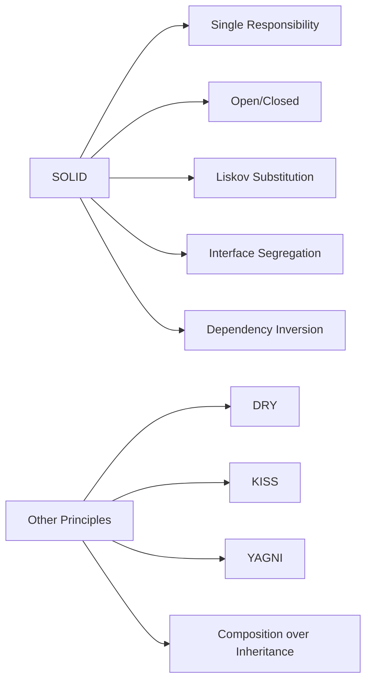

# Design Principles — A 2-Day Crash Course

SOLID, DRY, KISS, YAGNI — the principles that separate code that survives production from code that becomes legacy in 6 months.

---

## Part 0 — Why Principles?

Patterns are solutions. Principles are the reasoning behind when and whether to apply them.

You can memorize the Factory, Observer, Decorator patterns. But without understanding *why* they exist, you'll reach for them at the wrong time — over-engineering a two-file script or under-engineering a system that needs to scale across teams.

When code is hard to change, when adding a feature breaks something unrelated, when a codebase feels like it's fighting you — the answer is almost always a violated principle. Not a missing pattern.

Spend two days here. The rest of your design education will make more sense.

---

## Vocabulary

| Term | One-line definition |
|---|---|
| **SOLID** | Five object-oriented design principles (see Day 1) |
| **DRY** | Don't Repeat Yourself — every piece of knowledge should have one authoritative source |
| **KISS** | Keep It Simple, Stupid — prefer the simplest solution that works |
| **YAGNI** | You Aren't Gonna Need It — don't build what you don't currently need |
| **Separation of Concerns** | Each module should own one concern and not bleed into others |
| **Composition over Inheritance** | Build complex behavior by combining small pieces, not extending class hierarchies |
| **Law of Demeter** | A module should only talk to its immediate collaborators — not reach through them |
| **Principle of Least Surprise** | Code should behave the way a reader would expect it to |



---

## DAY 1 — SOLID Deep Dive

SOLID (Robert Martin) describes what well-structured object-oriented — and increasingly, service-oriented — code looks like. One principle per letter.

---

### S — Single Responsibility Principle

**One class, one reason to change.**

If a class has two responsibilities, it has two reasons to change. When one reason triggers a change, you risk accidentally breaking the other responsibility.

**Bad:**

```python
class UserService:
    def create_user(self, username, email):
        # validate
        if "@" not in email:
            raise ValueError("Invalid email")
        # persist
        db.execute("INSERT INTO users ...", username, email)
        # notify
        smtp.send(email, "Welcome to the platform")
```

This class owns validation, persistence, *and* notification. A change to how emails are sent touches the same class that handles database logic.

**Good:**

```python
class UserValidator:
    def validate(self, username, email):
        if "@" not in email:
            raise ValueError("Invalid email")

class UserRepository:
    def save(self, username, email):
        db.execute("INSERT INTO users ...", username, email)

class WelcomeMailer:
    def send(self, email):
        smtp.send(email, "Welcome to the platform")

class UserService:
    def __init__(self, validator, repo, mailer):
        self.validator = validator
        self.repo = repo
        self.mailer = mailer

    def create_user(self, username, email):
        self.validator.validate(username, email)
        self.repo.save(username, email)
        self.mailer.send(email)
```

Now each class changes for exactly one reason. You can swap the mailer without touching the repository.

---

### O — Open/Closed Principle

**Open for extension, closed for modification.**

When new requirements come in, you should be able to add behavior without editing existing, tested code. Editing existing code means re-testing it and risking regression.

**Bad:**

```python
class ReportExporter:
    def export(self, report, format):
        if format == "pdf":
            # ... pdf logic
        elif format == "csv":
            # ... csv logic
        elif format == "excel":
            # ... excel logic — added later, touching existing code
```

Every new format means editing this method. Every edit is a regression risk.

**Good:**

```python
class ReportExporter:
    def export(self, report, formatter):
        return formatter.format(report)

class PdfFormatter:
    def format(self, report): ...

class CsvFormatter:
    def format(self, report): ...

class ExcelFormatter:
    def format(self, report): ...
```

Adding a new format means writing a new class — no existing code touched.

---

### L — Liskov Substitution Principle

**Subtypes must be substitutable for their base types.**

If your code works with a `Bird`, it should work with a `Penguin` if `Penguin` extends `Bird` — without knowing it's a penguin. If subclasses break the contract of the parent, you have a violated LSP.

**Bad:**

```python
class Bird:
    def fly(self):
        return "flying"

class Penguin(Bird):
    def fly(self):
        raise NotImplementedError("Penguins can't fly")

def make_it_fly(bird: Bird):
    print(bird.fly())  # ⚠️ blows up if bird is a Penguin
```

**Good:**

```python
class Bird:
    def move(self): ...

class FlyingBird(Bird):
    def fly(self): ...

class Penguin(Bird):
    def swim(self): ...

class Eagle(FlyingBird):
    def fly(self):
        return "soaring"
```

Now the hierarchy reflects reality. Code that takes a `FlyingBird` knows it can fly. Code that takes a `Bird` makes no such assumption.

LSP violations often surface as `isinstance` checks or `if type(x) == ...` guards inside functions that are supposed to work generically.

---

### I — Interface Segregation Principle

**Clients should not be forced to depend on interfaces they don't use.**

Fat interfaces create unnecessary coupling. If you implement an interface, you're coupled to everything in it — even the parts you don't care about.

**Bad:**

```python
class WorkerInterface:
    def work(self): ...
    def eat(self): ...
    def sleep(self): ...

class Robot(WorkerInterface):
    def work(self): ...
    def eat(self): raise NotImplementedError  # robots don't eat
    def sleep(self): raise NotImplementedError  # robots don't sleep
```

**Good:**

```python
class Workable:
    def work(self): ...

class Feedable:
    def eat(self): ...

class Restable:
    def sleep(self): ...

class Human(Workable, Feedable, Restable): ...
class Robot(Workable): ...
```

Smaller interfaces are easier to implement, easier to mock in tests, and easier to evolve independently.

---

### D — Dependency Inversion Principle

**High-level modules should not depend on low-level modules. Both should depend on abstractions.**

When a high-level policy class directly instantiates a low-level detail class, changing the detail forces you to touch the policy. Invert the dependency — inject it.

**Bad:**

```python
class OrderService:
    def __init__(self):
        self.db = MySQLDatabase()  # hardwired to MySQL

    def place_order(self, order):
        self.db.save(order)
```

**Good:**

```python
class DatabasePort:
    def save(self, order): ...

class MySQLDatabase(DatabasePort):
    def save(self, order): ...

class InMemoryDatabase(DatabasePort):  # great for tests
    def save(self, order): ...

class OrderService:
    def __init__(self, db: DatabasePort):
        self.db = db

    def place_order(self, order):
        self.db.save(order)
```

`OrderService` no longer knows or cares whether it's talking to MySQL, Postgres, or an in-memory stub. Tests become trivial. Swapping databases becomes a config change.

---

## DAY 2 — Beyond SOLID

### DRY — But Don't Over-DRY

Every piece of *knowledge* has one canonical home. The test: if this rule changes, how many places need updating? More than one — DRY violation.

The over-DRY trap: two functions share three lines today, you extract a helper. Six months later one needs to change and the other doesn't. Your abstraction is now a constraint. The rule of three helps — tolerate duplication once, consider abstracting on the third occurrence, and only when it's the same *concept*, not just similar-looking code. Duplication is cheap. Wrong abstraction is expensive.

---

### KISS — Keep It Simple

The simplest solution that correctly solves the problem is almost always the right solution. Every abstraction, every indirection, every configurable parameter is something the next engineer has to understand before changing anything.

Before every abstraction ask: what is this simplifying? "It's more elegant" and "it could be useful someday" are not simplifications — they're speculation.

---

### YAGNI — You Aren't Gonna Need It

Don't build for requirements you don't have yet. "We might need multi-tenancy later" is not a requirement. "We need multi-tenancy by Q3" is.

YAGNI is not an argument against good architecture — it's an argument against *speculative* architecture. Build the right abstractions for the code you have today. When the new requirement arrives, refactor.

---

### Composition over Inheritance

Inheritance couples you to a parent's implementation — when that parent changes, all children change. Deep hierarchies become brittle. Composition gives you flexibility: combine behaviors at runtime, swap components, and avoid inheriting what you didn't ask for.

```python
# Inheritance — rigid
class FlyingSwimmingDuck(FlyingBird, SwimmingAnimal): ...

# Composition — flexible
class Duck:
    def __init__(self, flyer, swimmer):
        self.flyer, self.swimmer = flyer, swimmer
    def move_air(self): return self.flyer.fly()
    def move_water(self): return self.swimmer.swim()
```

Use inheritance for true "is-a" relationships that honor the parent's contract. Use composition when you want behavior, not identity.

---

### Separation of Concerns

Each module owns one concern. Classic separations: business logic vs. persistence, validation vs. transformation, policy vs. mechanism. In a web service — controller handles HTTP, service handles business logic, repository handles data access. None of these layers knows how the others are implemented.

This applies equally to infrastructure. Terraform provisions resources. Ansible configures them. The Terraform output feeds the Ansible inventory — clean handoff, no tangle. Don't write Ansible tasks that call the AWS API; that's Terraform's concern.

**Terraform:** each module provisions one resource group (SRP). A new environment is a new `tfvars` file, not a copy-pasted module (OCP/DRY). Don't add variables for options you don't need yet (YAGNI).

**Ansible:** each role does one thing — install nginx, configure TLS, manage users (SRP). Use role variables with defaults; don't hardcode the same value in ten task files (DRY).

---

### Principles in Code Review

Name the principle when you leave feedback — it makes comments clearer and less personal.

| Smell | Likely violation |
|---|---|
| Function does X, Y, and Z | SRP |
| Adding a feature required editing an existing class | OCP |
| Subclass raises `NotImplementedError` for parent methods | LSP |
| Interface has 12 methods but this class only uses 2 | ISP |
| Class instantiates its own dependencies with `new`/`()` | DIP |
| Same logic in three places | DRY |
| 200-line function doing "just one thing" | KISS |
| "Pluggable strategy" for a use case with one implementation | YAGNI |
| Service directly accessing another service's database table | Separation of Concerns |
| Deep inheritance tree (4+ levels) | Prefer Composition |

When you leave a review comment, cite the principle. "This violates SRP — this class now has two reasons to change: the notification logic and the persistence logic. Consider extracting `UserNotifier`." That's actionable. "This is messy" is not.

---

### Principles in Interviews

Interviews test whether you apply these under pressure. Separate concerns. Depend on abstractions. Don't over-engineer a two-channel system into a plugin framework.

Name principles as you use them. "I'm injecting the transport so the business logic doesn't know whether it's SMS or email — that's DIP." Candidates who say *why* stand out from candidates who only say *what*.

---

## Worked Example — Refactoring a Monolithic Deploy Script

You inherit this deploy script:

```python
class Deployer:
    def deploy(self, app, env):
        # build
        subprocess.run(["docker", "build", "-t", app, "."])
        # push
        subprocess.run(["docker", "push", f"registry/{app}"])
        # notify slack
        requests.post(SLACK_WEBHOOK, json={"text": f"Deploying {app} to {env}"})
        # update kubernetes
        subprocess.run(["kubectl", "set", "image", f"deployment/{app}", f"{app}=registry/{app}"])
        # notify slack again
        requests.post(SLACK_WEBHOOK, json={"text": f"Deployed {app} to {env}"})
        # write to audit log
        with open("audit.log", "a") as f:
            f.write(f"{datetime.now()} — deployed {app} to {env}\n")
```

**Violations:**
- SRP: build, push, notify, deploy, audit — five responsibilities in one method
- DRY: Slack notification duplicated
- DIP: hardwired to Docker, kubectl, Slack — no abstractions, no testability

**Refactored:**

```python
class ImageBuilder:
    def build(self, app): subprocess.run(["docker", "build", "-t", app, "."])

class ImagePusher:
    def push(self, app): subprocess.run(["docker", "push", f"registry/{app}"])

class KubernetesDeployer:
    def deploy(self, app):
        subprocess.run(["kubectl", "set", "image", f"deployment/{app}", f"{app}=registry/{app}"])

class SlackNotifier:
    def notify(self, message): requests.post(SLACK_WEBHOOK, json={"text": message})

class FileAuditLogger:
    def log(self, message):
        with open("audit.log", "a") as f: f.write(f"{datetime.now()} — {message}\n")

class DeployOrchestrator:
    def __init__(self, builder, pusher, deployer, notifier, logger):
        self.builder, self.pusher, self.deployer = builder, pusher, deployer
        self.notifier, self.logger = notifier, logger

    def deploy(self, app, env):
        self.notifier.notify(f"Deploying {app} to {env}")
        self.builder.build(app)
        self.pusher.push(app)
        self.deployer.deploy(app)
        self.notifier.notify(f"Deployed {app} to {env}")
        self.logger.log(f"deployed {app} to {env}")
```

Each class has one reason to change. Swap Docker for Podman — write a new `ImageBuilder`, nothing else changes. Swap Slack for PagerDuty — write a new `Notifier`. Testing is trivial: inject mocks for each collaborator.

---

## Pitfalls

**Premature abstraction** — the most common misapplication. You read OCP and start writing plugin systems for everything. You read DIP and create interfaces for classes that will never have a second implementation. Abstractions are indirections. Every indirection is a cost. Extract an abstraction when you feel the pain of not having it — not in anticipation of someday feeling that pain.

**DRY obsession** — chasing DRY at the level of syntax, not semantics. Two functions that look similar are not necessarily a DRY violation. If they represent different concepts that happen to share three lines today, extracting them couples two independent things. That coupling is invisible until one needs to change. Duplication is cheap. Wrong abstraction is expensive.

**Applying SOLID to everything** — SOLID was designed for object-oriented design. Don't torture functional code into SOLID shapes. A pure function that transforms data doesn't need SRP analysis. Know the domain of applicability.

---

## Quick Reference — Principle Decision Checklist

Before you finalize a design or submit a PR, run through this:

```
[ ] Does each class/function/module have one clear reason to change?     → SRP
[ ] Can I add behavior without editing existing code?                    → OCP
[ ] Can I substitute subtypes without breaking callers?                  → LSP
[ ] Are my interfaces minimal — no unused methods?                       → ISP
[ ] Do I inject dependencies rather than instantiate them?               → DIP
[ ] Is every piece of knowledge in exactly one place?                    → DRY
[ ] Is this the simplest solution that works?                            → KISS
[ ] Am I building this because I need it now?                            → YAGNI
[ ] Does each layer/module own exactly one concern?                      → SoC
[ ] Am I composing behavior rather than inheriting it?                   → Composition
[ ] Does my code do what a reader would expect it to do?                 → Least Surprise
```

If you answer no to any of these and you don't have a good reason, that's where to refactor.

---

## Top 10 Interview Questions

<details>
<summary><strong>Q: Explain the Single Responsibility Principle with a real-world example.</strong></summary>

SRP means a class has one reason to change. A `UserService` that handles validation, persistence, and email notification has three reasons to change — a change to validation rules, a database migration, or a switch from SMTP to SendGrid all touch the same class. Extract `UserValidator`, `UserRepository`, and `WelcomeMailer`. Now each class changes for exactly one reason, and you can swap the mailer without risking the persistence logic.

</details>

<details>
<summary><strong>Q: How does the Open/Closed Principle prevent regression?</strong></summary>

OCP says code should be open for extension but closed for modification. When new requirements arrive, you add behavior without editing existing, tested code. A `ReportExporter` with if/elif for PDF, CSV, and Excel must be modified for every new format — each edit is a regression risk. Extract a `Formatter` interface with one class per format. Adding Excel means adding a class, not touching existing exporters. Existing code stays tested and stable.

</details>

<details>
<summary><strong>Q: What is a Liskov Substitution Principle violation and how do you detect it?</strong></summary>

LSP is violated when a subclass breaks the contract of its parent. The classic example: `Penguin` extends `Bird` but throws `NotImplementedError` on `fly()`. Code that takes a `Bird` and calls `fly()` breaks silently. You detect violations by looking for `isinstance` checks or `if type(x) ==` guards in code that is supposed to work generically. The fix: restructure the hierarchy so `FlyingBird` is separate from `Bird`, and code that needs flight takes `FlyingBird`.

</details>

<details>
<summary><strong>Q: Why does Interface Segregation matter for testing?</strong></summary>

Fat interfaces force implementers to depend on methods they do not use. A `WorkerInterface` with `work()`, `eat()`, and `sleep()` forces a `Robot` to throw `NotImplementedError` on `eat()` and `sleep()`. Worse, tests for `Robot` must mock or stub methods that are irrelevant. Smaller interfaces (`Workable`, `Feedable`, `Restable`) mean each implementation and its tests focus only on what matters. Less coupling, fewer mocks, clearer tests.

</details>

<details>
<summary><strong>Q: How does Dependency Inversion enable testability?</strong></summary>

DIP says high-level modules should depend on abstractions, not concrete implementations. An `OrderService` that instantiates `MySQLDatabase()` directly cannot be tested without MySQL running. Inject a `DatabasePort` interface instead, and tests pass in an `InMemoryDatabase`. Swapping databases in production becomes a config change. The business logic never knows or cares what storage technology backs it. This is the principle that makes Clean Architecture possible.

</details>

<details>
<summary><strong>Q: What is the difference between DRY violation and accidental duplication?</strong></summary>

DRY says every piece of knowledge has one canonical home. But two functions that share three lines of similar-looking code are not necessarily a DRY violation — they may represent different concepts that happen to look similar today. Extracting a shared helper couples two independent things. When one needs to change, the abstraction becomes a constraint. The rule of three helps: tolerate duplication once, consider abstracting on the third occurrence, and only when it is the same concept, not just similar syntax.

</details>

<details>
<summary><strong>Q: When does YAGNI override good architecture?</strong></summary>

YAGNI says do not build for requirements you do not have yet. "We might need multi-tenancy later" is speculation, not a requirement. YAGNI is not an argument against good architecture — it is an argument against speculative architecture. Build the right abstractions for today's code. When the new requirement arrives, refactor. A pluggable strategy pattern for a use case with one implementation is YAGNI waste. Two concrete implementations justify the abstraction; one does not.

</details>

<details>
<summary><strong>Q: Why is Composition preferred over Inheritance in most cases?</strong></summary>

Inheritance couples you to a parent's implementation — when the parent changes, all children change. Deep hierarchies become brittle and force you to inherit behavior you did not ask for. Composition lets you combine behaviors at runtime, swap components, and keep each piece independently testable. Use inheritance only for true "is-a" relationships that fully honor the parent's contract. For behavior reuse, compose small, focused objects.

</details>

<details>
<summary><strong>Q: How do you apply Separation of Concerns to infrastructure code?</strong></summary>

Each tool owns one concern. Terraform provisions resources (infrastructure state). Ansible configures them (machine state). Terraform output feeds Ansible inventory — clean handoff, no overlap. Do not write Ansible tasks that call the AWS API; that is Terraform's concern. Each Terraform module provisions one resource group (SRP). Each Ansible role does one thing (SRP). This separation makes each layer independently testable, replaceable, and debuggable.

</details>

<details>
<summary><strong>Q: How do you use design principles in code review feedback?</strong></summary>

Name the principle when you leave feedback — it makes comments actionable and depersonalized. Instead of "this is messy," say "this violates SRP — this class has two reasons to change: notification logic and persistence logic. Consider extracting `UserNotifier`." A function doing X, Y, and Z is SRP. A subclass raising NotImplementedError is LSP. A class instantiating its own dependencies is DIP. Citing the principle gives the author a mental model, not just a correction.

</details>

---

## Next Steps

These principles are the foundation. Build on them:

- **`Design-Patterns.md`** — the recurring solutions that apply these principles in practice: Factory, Strategy, Observer, Decorator, and a dozen more
- **`Clean-Architecture.md`** — how to organize an entire codebase so the business rules never depend on frameworks, databases, or delivery mechanisms
- **`LLD.md`** — low-level design for interviews: class diagrams, sequence diagrams, and designing systems like parking lots, elevators, and chess under time pressure

---

## Recommended learning resources

**YouTube channels & playlists:**
- [Robert C. Martin (Uncle Bob) — SOLID Principles](https://www.youtube.com/results?search_query=uncle+bob+solid+principles+clean+code) — the original author on SRP, OCP, LSP, ISP, DIP with real-world reasoning
- [Christopher Okhravi — SOLID and Design Principles](https://www.youtube.com/@ChristopherOkhravi) — thoughtful, example-driven explanations of each principle with honest trade-off discussion
- [Fireship — SOLID in 100 Seconds](https://www.youtube.com/@Fireship) — fast visual primers that make each principle memorable before you dive deeper
- [CodeAesthetic — Naming, Abstraction, and Code Smells](https://www.youtube.com/@CodeAesthetic) — the practical side of principles: what good and bad design actually looks like
- [ArjanCodes — Software Design in Python](https://www.youtube.com/@ArjanCodes) — SOLID, DRY, KISS, and YAGNI applied in real codebases

**Official docs & blogs:**
- [martinfowler.com — Design](https://martinfowler.com/design.html) — coupling, cohesion, refactoring, and the thinking behind good design decisions
- [Clean Code Blog (Robert C. Martin)](https://blog.cleancoder.com/) — the original essays on SOLID, clean architecture, and software craftsmanship

---

## The Mantra

> Write code for the next engineer, not for the compiler.
> The compiler accepts anything. The next engineer has to understand it, change it, and trust it at 2 a.m. during an incident.
> Principles are how you make that possible.
