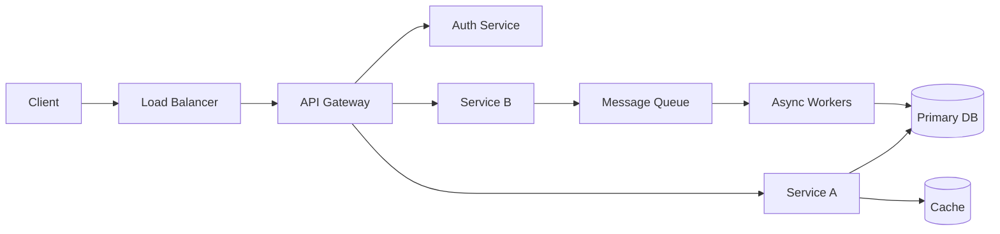

# High-Level Design (HLD) — A 2-Day Crash Course

HLD is the blueprint that shows how components connect — the 30,000-foot view of a system before anyone writes code.

**Prerequisite:** `System-Design.md`

---

## Part 0 — Why HLD Exists

Without HLD you get spaghetti architecture, teams building overlapping services, and production incidents from undocumented dependencies. You also get engineers who cannot explain their own system to a new hire — or to an interviewer.

HLD forces you to answer three questions before a single line of code is written:

1. What are the moving parts?
2. How do they communicate?
3. What happens when one of them fails?

In an ops context, HLD is the document you wish existed when you got paged at 3 a.m. about a cascading failure nobody could trace. In an interview context, HLD is the signal that separates candidates who can reason about systems from those who can only implement tickets.

---

## Vocabulary

You need these terms to be precise — in design docs, in interviews, and in post-mortems.

**Component** — A discrete, independently deployable or logically isolated unit of functionality. A payment service, an auth gateway, a message queue. If you can draw a box around it with a single responsibility label, it is a component.

**Service** — A component exposed over a network boundary. Every service is a component; not every component is a service. Your in-process cache is a component. Your Redis cluster is a service.

**API Contract** — The agreed interface between two components: what you send, what you get back, what errors are possible. Breaking an API contract without a versioning strategy is how you cause cascading failures across teams.

**Data Flow** — The path data takes through your system from ingestion to output. You need to know this to reason about latency, consistency, and blast radius.

**Dependency Graph** — A directed graph where each edge represents a runtime dependency. If Service A calls Service B, A depends on B. The graph exposes single points of failure, circular dependencies, and critical paths. Draw it early; it saves you from surprises late.

**SLA / SLO Mapping** — SLA (Service Level Agreement) is the contract with your customer. SLO (Service Level Objective) is the internal target that gives you a buffer. Mapping SLOs to individual components tells you which ones cannot afford downtime and which ones can tolerate degradation.

**Technology Selection** — The act of choosing a datastore, messaging system, framework, or protocol based on requirements rather than familiarity. At HLD time you choose categories (relational vs. document, sync vs. async) and justify them. You do not bikeshed library versions.

**Non-functional Requirements (NFRs)** — Everything that is not "what the system does." Latency, throughput, availability, durability, security posture, compliance constraints, operational complexity. NFRs shape architecture more than functional requirements do.

**Trade-off** — The conscious acceptance that optimizing for one property degrades another. Consistency vs. availability. Latency vs. durability. Operational simplicity vs. feature velocity. Good HLD makes trade-offs explicit. Bad HLD pretends they do not exist.



---

## DAY 1 — Building the HLD

### Step 1 — Requirements Gathering

Split requirements into two lists before you touch a whiteboard.

**Functional requirements** describe what the system must do:
- Accept payments from users
- Notify users of transaction outcomes
- Support idempotent retries

**Non-functional requirements** describe how well it must do it:
- 99.99% availability for the payment path
- p99 latency under 300 ms at peak load
- PCI DSS compliance for cardholder data
- Data retention for 7 years for audit purposes

A common mistake is to jump straight to components before pinning down NFRs. Your NFRs will invalidate half your component choices if you discover them late. Nail them first.

In interviews, ask clarifying questions before drawing anything. "What is the expected scale?" and "What are the consistency requirements?" signal that you know how to scope a design.

### Step 2 — Component Identification

Start with the data lifecycle. Ask: what enters the system, what transforms it, and what leaves the system?

Typical component categories you will encounter:

- **Ingress layer** — load balancer, API gateway, reverse proxy
- **Auth layer** — authentication service, token validation
- **Business logic layer** — the services that implement your domain
- **Persistence layer** — primary datastore, cache, search index
- **Async processing layer** — message queues, event streams, workers
- **Egress layer** — notification delivery, third-party integrations
- **Observability layer** — metrics collection, log aggregation, tracing

You do not need all of these in every system. Identify only what your requirements justify. Adding components that are not justified by requirements is over-engineering — and in an interview it is a red flag.

### Step 3 — API Design Between Components

For each pair of components that communicate, define the contract at HLD level. You are not writing OpenAPI specs — you are answering:

- Is this synchronous (request/response) or asynchronous (event/message)?
- What is the payload shape in broad strokes?
- Who owns the schema?
- What are the failure modes at this boundary?

Synchronous calls couple your latency budgets together. If Service A calls Service B synchronously, A's p99 latency is at least B's p99 latency. Model this early.

Asynchronous messaging decouples latency but introduces eventual consistency. Know which boundaries can tolerate that and which cannot.

### Step 4 — Data Flow Diagrams

Draw the happy path first. Then draw the error path. A data flow diagram at HLD level shows:

1. Where data enters
2. Which components touch it and in what order
3. Where it persists
4. Where it exits or triggers downstream effects

Keep it at component level — not code level. If your diagram has function calls on it, you have gone too deep.

Label flows with the protocol and rough data size where relevant. "REST over HTTPS, ~2 KB payload" on a synchronous edge. "Kafka topic, high-throughput event stream" on an async edge.

### Step 5 — Technology Selection Rationale

For each component, document the technology choice and the one-sentence rationale. You are not writing an essay — you are capturing the decision so future engineers do not have to reverse-engineer it.

Format: `[Component] → [Technology] — [Reason tied to a requirement or trade-off]`

Example:
- Payment ledger → PostgreSQL — strong consistency, ACID transactions, audit log requirements
- Transaction events → Kafka — durable, replayable, decouples payment service from downstream consumers
- Session cache → Redis — sub-millisecond reads, TTL-native, acceptable data loss on restart

Avoid selecting technology you cannot operate. A distributed database that requires a dedicated DBA team is not a good choice for a three-person startup. Operational complexity is a constraint.

### Step 6 — Capacity Estimation

Rough numbers prevent wrong architecture. You do not need precision — you need order of magnitude.

Work through:

- **Requests per second (RPS)** — peak, average, and ratio between them
- **Data volume per request** — how much is written or read per operation
- **Storage growth** — monthly and at 3-year horizon
- **Bandwidth** — inbound and outbound at peak RPS
- **Replication factor** — how many copies of your data you need for durability

These numbers tell you whether a single PostgreSQL instance is enough or whether you need sharding. They tell you whether your message queue needs to handle 1,000 messages/second or 1,000,000. They tell you whether your CDN budget is zero or non-trivial.

In an interview, show the math. Write it on the whiteboard. "10 million DAU, 5 transactions per user per day, that is 50 million transactions daily, roughly 580 per second average — assume 5x peak so 2,900 RPS at peak" is the kind of reasoning that earns points.

---

## DAY 2 — Hardening and Presenting the HLD

### Step 7 — Failure Mode Analysis

For each component, ask: what happens when this component is unavailable?

Document three things per component:
1. **Blast radius** — what breaks when this component fails
2. **Detection** — how you know it has failed
3. **Mitigation** — what the system does while it is degraded

The mitigation options at HLD level are: retry with backoff, circuit breaker, fallback to cached data, queue the work for later, return a graceful degradation response, or fail hard.

Systems that fail hard everywhere are operationally honest but user-hostile. Systems that silently degrade everywhere are user-friendly but operationally dangerous. Know where you stand on that spectrum and document it.

⚠️ The most common omission in HLD documents: no failure mode analysis. You will discover the gaps in production unless you discover them on paper first.

### Step 8 — Security Boundaries

Draw your trust boundaries. A trust boundary is any line where data crosses from a less-trusted to a more-trusted context, or vice versa.

At each boundary, document:
- Authentication mechanism (API key, mTLS, JWT, OAuth token)
- Authorization model (RBAC, ABAC, scope-based)
- Data classification of what crosses the boundary (PII, cardholder data, internal-only)
- Encryption in transit (TLS version, certificate management)
- Encryption at rest (key management, rotation policy)

In a payment system, the boundary between your API gateway and payment processor is a PCI boundary. The boundary between your internal services may be a softer boundary, but it still needs mutual authentication if you are operating a zero-trust network model.

Security at HLD is not about implementing controls — it is about identifying where controls are needed so the security review has a map.

### Step 9 — Deployment Topology

Your HLD should describe the deployment model at region and availability zone level.

Answer:
- Single region or multi-region?
- Active-active or active-passive failover?
- Which components are stateless (easy to scale horizontally)?
- Which components are stateful (require careful placement and failover)?
- What is your database replication topology?
- Where do your queues live relative to your consumers?

The deployment topology directly determines your blast radius for cloud provider outages. If all your components are in a single availability zone, a zone failure takes you down. Know this before it happens.

### Step 10 — Monitoring Strategy Per Component

For each component, identify three things:
1. **Golden signals** — latency, error rate, saturation, traffic (pick the two most relevant)
2. **Alert thresholds** — what triggers a page vs. what triggers a ticket
3. **Dashboard** — what an on-call engineer needs to see within 60 seconds of a page

At HLD level you are not writing alert queries — you are making sure every component has an owner and a monitoring plan. Unmonitored components become invisible failure points.

---

## HLD Review Checklist

Before you call your HLD done, confirm:

- [ ] All functional requirements are addressed by at least one component
- [ ] All NFRs have a corresponding architecture decision that satisfies them
- [ ] Every component has a defined API contract with its callers
- [ ] Data flow is traced end-to-end for at least the critical path
- [ ] Technology choices are justified against requirements
- [ ] Capacity numbers exist and are plausible
- [ ] Failure modes are documented for each component
- [ ] Security boundaries are drawn and annotated
- [ ] Deployment topology is specified to AZ level
- [ ] Each component has at least two golden signals identified
- [ ] No circular dependencies in the dependency graph
- [ ] Trade-offs are named explicitly — nothing is hidden

---

## HLD Document Template

```
# HLD — [System Name]

## Overview
[Two sentences: what the system does and who uses it]

## Requirements
### Functional
- [FR-1] ...
- [FR-2] ...

### Non-Functional
- [NFR-1] Availability: ...
- [NFR-2] Latency: ...
- [NFR-3] Throughput: ...
- [NFR-4] Compliance: ...

## Components
| Component | Responsibility | Technology | Justification |
|-----------|---------------|------------|---------------|

## API Contracts
| From | To | Protocol | Sync/Async | Notes |
|------|----|----------|-----------|-------|

## Data Flow
[Diagram or textual trace of critical path]

## Capacity Estimation
- Peak RPS: ...
- Storage growth: ...
- Bandwidth: ...

## Failure Modes
| Component | Blast Radius | Detection | Mitigation |
|-----------|-------------|-----------|-----------|

## Security Boundaries
| Boundary | Auth Mechanism | Data Classification | Encryption |
|----------|---------------|-------------------|-----------|

## Deployment Topology
[Region/AZ description, active-active vs active-passive, stateless vs stateful]

## Monitoring
| Component | Golden Signals | Alert Threshold | Dashboard Owner |
|-----------|---------------|-----------------|-----------------|

## Trade-offs
- [Trade-off 1]: Chose X over Y because Z
- [Trade-off 2]: ...

## Open Questions
- [OQ-1] ...
```

---

## Presenting HLD in Interviews

You have roughly 45 minutes. Spend them like this:

**Minutes 0–5 — Clarify requirements.** Ask about scale, consistency, and the most critical user-facing flows. Do not start drawing until you have NFRs.

**Minutes 5–15 — Sketch the happy path.** Draw the major components and the critical data flow. Name the protocols. Do not get lost in details yet.

**Minutes 15–25 — Justify your technology choices.** Your interviewer will probe these. Have a reason for each choice that ties back to a requirement or trade-off.

**Minutes 25–35 — Failure modes and scaling.** What breaks? How does it degrade? How do you scale the bottleneck? This is where most candidates lose points — they draw the happy path and stop.

**Minutes 35–45 — Depth where asked.** Your interviewer will pick one area to go deep. Follow their lead. If they ask about the database, go deep on sharding strategy or replication topology. If they ask about the queue, go deep on consumer group semantics and dead-letter handling.

Common mistakes:
- Jumping to implementation details before the high-level is clear
- Not asking about scale before choosing a datastore
- Treating every component the same — not every component needs the same availability tier
- Ignoring the async paths and only drawing synchronous flows
- Never naming a trade-off — it signals that you see only one way to do things

---

## Worked Example — HLD for a Payment Processing System

**Context:** You are designing the HLD for a payment processing system that handles card transactions for an e-commerce platform.

### Requirements

Functional:
- Accept card payments, validate, and authorize against a payment processor
- Record transactions in a ledger
- Notify users and merchants of payment outcomes
- Support refunds

Non-functional:
- 99.99% availability on the payment authorization path
- p99 latency under 500 ms for authorization
- PCI DSS compliance for all cardholder data
- Idempotent payment submissions (duplicate prevention)
- 5 years transaction data retention

**Ops lens:** These NFRs tell you immediately that the authorization path cannot share infrastructure with batch jobs, the datastore for cardholder data needs encryption at rest with key rotation, and the ledger needs point-in-time recovery.

**Interview lens:** State these NFRs out loud before drawing. It signals you understand that NFRs drive architecture.

### Components

| Component | Responsibility | Technology |
|-----------|---------------|------------|
| API Gateway | Rate limiting, TLS termination, auth token validation | Nginx / Kong |
| Payment Service | Orchestrate authorization flow, idempotency | Go service |
| Processor Adapter | Abstract payment processor API (Stripe, Adyen) | Go service |
| Transaction Ledger | Durable record of all transactions | PostgreSQL |
| Event Bus | Decouple payment outcomes from downstream consumers | Kafka |
| Notification Service | Deliver outcome emails and webhooks | Node.js worker |
| Fraud Service | Real-time fraud scoring (async enrichment) | Python service |
| Secrets Manager | Store processor API keys, encryption keys | HashiCorp Vault |

### Critical Data Flow (Authorization Path)

```
Client → API Gateway → Payment Service → Processor Adapter → Payment Processor (external)
                                ↓
                       Transaction Ledger (write)
                                ↓
                       Event Bus (publish PaymentCompleted or PaymentFailed)
                                ↓
               Notification Service          Fraud Service (async enrichment)
```

**Ops lens:** The sync path is Client through Payment Processor. Everything after the processor response is async. This means a Kafka outage does not block authorizations — notifications are delayed, not lost, if you have durable queuing.

**Interview lens:** Explicitly separate the sync and async paths. Explain why authorization is sync (customer is waiting) and notification is async (acceptable delivery delay).

### Key Trade-offs

**Sync vs. async for fraud scoring:** Fraud scoring is async in this design — it enriches the transaction record after authorization. The trade-off is that you accept the small risk of approving a fraudulent transaction in exchange for lower authorization latency. Alternatively, you could make fraud scoring sync and block on its response, but that couples your latency budget to the fraud model's response time. For a general-purpose payment processor, async is the right default. For high-risk industries, sync is worth the latency cost.

**PostgreSQL for the ledger:** A relational database gives you ACID guarantees, which you need for financial records. The trade-off is that horizontal write scaling requires sharding, which adds operational complexity. At the scale of most e-commerce platforms, a single primary with read replicas handles the write volume without sharding. Document this boundary explicitly — you will revisit it when write volume exceeds a defined threshold.

### Failure Mode Analysis (selected)

| Component | Blast Radius | Detection | Mitigation |
|-----------|-------------|-----------|-----------|
| Payment Processor (external) | No new authorizations | Error rate spike on processor adapter | Return 503, surface clear user error, retry with backoff |
| Transaction Ledger | Cannot persist authorizations | Latency/error alert | Circuit breaker — do not authorize if ledger write fails; money without a record is worse than a failed transaction |
| Kafka | Notifications delayed | Consumer lag alert | Notifications buffer in Kafka; no blast radius on auth path |
| Notification Service | No emails/webhooks delivered | Consumer lag + error rate | Dead-letter queue; replay after fix |

**Ops lens:** Notice the asymmetry — Kafka failure has zero blast radius on authorization but full blast radius on notifications. Ledger failure has full blast radius on authorization by design. These are conscious choices.

### Security Boundaries

| Boundary | Mechanism | Data Classification |
|----------|-----------|-------------------|
| Client → API Gateway | TLS 1.3, JWT auth | PII, payment intent |
| Payment Service → Processor Adapter | mTLS internal | Cardholder data (PCI scope) |
| Processor Adapter → Stripe/Adyen | TLS, API key from Vault | Cardholder data (PCI scope) |
| Event Bus messages | Tokenized — no raw card data in events | Transaction metadata |

---

## Pitfalls

**Over-specifying at HLD time.** HLD is not LLD. If your HLD has database schema columns or function signatures, you have gone too deep. Keep it at component and contract level.

**Under-specifying NFRs.** "High availability" is not a requirement. "99.99% availability on the payment path, measured monthly" is a requirement. Vague NFRs produce architectures that satisfy nothing specifically.

**Symmetry bias.** Not every component needs the same availability target. Designing your fraud scoring service to the same 99.99% SLO as your authorization path wastes resources and complexity.

**Ignoring the operational cost of your choices.** A Kubernetes operator for your message queue adds capability and adds toil. A managed service costs money and removes control. Neither is always correct. Document the operational model alongside the technology choice.

**Single failure mode analysis.** "What if this component goes down?" is the obvious question. "What if this component is slow?" is the harder one. A slow dependency in a synchronous call chain can exhaust your thread pool and cascade failures to callers that have nothing to do with the original slowness. Model latency failures, not just hard failures.

**No versioning strategy for API contracts.** If you do not define how you evolve contracts between components, you will face the choice between big-bang coordinated deployments and silent breaking changes. Neither is good. Address it at HLD time even if you only write "semver with backwards compatibility for N-1."

---

## Quick Reference

### HLD Component Checklist

For each component, confirm you have:
- [ ] Single clear responsibility defined
- [ ] Technology chosen with justification
- [ ] API contracts defined with all callers and callees
- [ ] SLO / availability target set
- [ ] Failure mode and mitigation documented
- [ ] Security boundary annotated
- [ ] At least two golden signals identified
- [ ] Capacity numbers scoped

### HLD One-Page Template

```
System: ________________
Scale: __ RPS peak | __ GB/day storage growth | __ regions

Components:
[Name] | [Responsibility] | [Technology] | [SLO]

Critical Path Data Flow:
[A] → [B] → [C] → [D]
       ↓
     [E] async

Key Trade-offs:
1. [X over Y because Z]
2. [X over Y because Z]

Failure Modes (critical path only):
[Component] fails → [effect] → [mitigation]

Security: [auth mechanism at each boundary]

Open Questions:
- [OQ-1]
```

---

## Top 10 Interview Questions

<details>
<summary><strong>Q: How do you approach requirements gathering before drawing an HLD?</strong></summary>

Split requirements into functional (what the system does) and non-functional (how well it does it). Pin down NFRs first — availability targets, latency budgets, compliance constraints, data retention — because they invalidate half your component choices if discovered late. In interviews, ask "what is the expected scale?" and "what are the consistency requirements?" before drawing anything. These questions signal you know that NFRs drive architecture.

</details>

<details>
<summary><strong>Q: What is a failure mode analysis and why is it the most commonly omitted part of HLD?</strong></summary>

For each component, document three things: blast radius (what breaks when it fails), detection (how you know it failed), and mitigation (what the system does while degraded). Most HLD documents skip this entirely because teams only think about the happy path. The result: you discover failure modes in production instead of on paper. Model both hard failures (component down) and latency failures (component slow) — a slow synchronous dependency can cascade worse than a dead one.

</details>

<details>
<summary><strong>Q: How do you decide between synchronous and asynchronous communication between components?</strong></summary>

Synchronous calls couple latency budgets — if Service A calls B synchronously, A's p99 is at least B's p99. Use sync when the caller genuinely needs an immediate response (user-facing queries, real-time validation). Asynchronous messaging decouples latency but introduces eventual consistency. Use async for state changes that other services react to (order placed, payment processed). The decision shapes your architecture's availability and latency characteristics.

</details>

<details>
<summary><strong>Q: How do you perform capacity estimation in an HLD interview?</strong></summary>

Work through: peak RPS (DAU times actions per user, divided by seconds, multiplied by a peak factor of 3-5x), data volume per request, storage growth at 3-year horizon, bandwidth at peak, and replication factor. Show the math explicitly. "10 million DAU, 5 transactions/user/day, 50 million daily, ~580 RPS average, 5x peak = 2,900 RPS." These numbers determine whether a single database suffices or you need sharding, and whether your queue handles thousands or millions per second.

</details>

<details>
<summary><strong>Q: What is the difference between SLA and SLO, and how do they map to components?</strong></summary>

SLA is the contractual commitment to customers — breaching it has financial or legal consequences. SLO is the internal target that gives you a safety buffer below the SLA. Mapping SLOs to individual components tells you which cannot afford downtime (payment authorization at 99.99%) and which can tolerate degradation (analytics dashboard at 99.9%). Not every component needs the same availability tier — designing them all to the highest SLO wastes resources and complexity.

</details>

<details>
<summary><strong>Q: How do you structure the first 45 minutes of an HLD interview?</strong></summary>

Minutes 0-5: clarify requirements and NFRs. Minutes 5-15: sketch the happy path with major components and data flow. Minutes 15-25: justify technology choices tied to requirements. Minutes 25-35: failure modes, scaling the bottleneck, degradation strategies. Minutes 35-45: go deep where the interviewer probes. The most common mistake is drawing the happy path and stopping — failure analysis and scaling are where most candidates lose points.

</details>

<details>
<summary><strong>Q: What are trust boundaries and why do they matter in HLD?</strong></summary>

A trust boundary is any line where data crosses from a less-trusted to a more-trusted context. At each boundary, document: authentication mechanism (mTLS, JWT, API key), authorization model (RBAC, ABAC), data classification crossing the boundary (PII, cardholder data), and encryption requirements. In a payment system, the boundary between your gateway and payment processor is a PCI boundary. Security at HLD is about identifying where controls are needed so the security review has a map.

</details>

<details>
<summary><strong>Q: How do you choose between a relational database and a NoSQL store in HLD?</strong></summary>

Choose relational (PostgreSQL) when you need ACID transactions, strong consistency, complex joins, and structured relationships — financial ledgers, audit records. Choose NoSQL (DynamoDB, MongoDB) when you need horizontal write scaling, flexible schema, or specific access patterns that relational handles poorly. The decision is driven by your NFRs: consistency requirements, write volume, query patterns, and operational complexity tolerance. Document the rationale so future engineers do not reverse-engineer it.

</details>

<details>
<summary><strong>Q: What is deployment topology and why does it affect blast radius?</strong></summary>

Deployment topology describes your system at region and availability zone level — single region vs multi-region, active-active vs active-passive, which components are stateless vs stateful, and your database replication model. If all components are in a single AZ, a zone failure takes you down. Multi-AZ within a region handles zone failures. Multi-region handles regional outages but adds complexity (data replication latency, conflict resolution). The topology directly determines your worst-case blast radius.

</details>

<details>
<summary><strong>Q: How do you avoid over-specifying or under-specifying an HLD?</strong></summary>

Over-specifying: if your HLD has database schema columns or function signatures, you have gone too deep — that is LLD territory. Keep it at component and contract level. Under-specifying: "high availability" is not a requirement — "99.99% availability on the payment path, measured monthly" is. Vague NFRs produce architectures that satisfy nothing specifically. The right level: components with clear responsibilities, justified technology choices, defined API contracts, capacity estimates, and explicit tradeoffs.

</details>

---

## Next Steps

- `LLD.md` — translate each component into class diagrams, sequence diagrams, and data schemas
- `System-Design.md` — the full system design process from requirements to production
- `API-Design-Patterns.md` — REST, gRPC, GraphQL, event contracts — when to use each

---

## Recommended learning resources

**YouTube channels & playlists:**
- [ByteByteGo — System Design Fundamentals](https://www.youtube.com/@ByteByteGo) — component diagrams, data flow walkthroughs, and capacity estimation for HLD interviews
- [Gaurav Sen — High Level Design](https://www.youtube.com/@gaborsen) — breaking down large systems into components with clear trade-off reasoning
- [sudoCODE — HLD and System Design](https://www.youtube.com/@sudocode) — practical HLD examples: payment systems, chat applications, notification services
- [Tech Dummies Narendra L — System Design](https://www.youtube.com/@TechDummiesNaworknowledge) — component-level design with database selection, caching layers, and queue placement
- [Martin Fowler — Software Architecture](https://www.youtube.com/results?search_query=martin+fowler+software+architecture) — the principles behind why certain component boundaries work and others do not

**Official docs & blogs:**
- [martinfowler.com — Application Architecture](https://martinfowler.com/tags/application%20architecture.html) — patterns for component decomposition, bounded contexts, and integration styles
- [Microsoft Azure Architecture Center](https://learn.microsoft.com/en-us/azure/architecture/) — reference architectures with component diagrams, decision trees, and failure mode analysis

---

## The Mantra

Design the failure modes before you design the happy path. The happy path is optimistic fiction. The failure modes are where your system actually lives.
