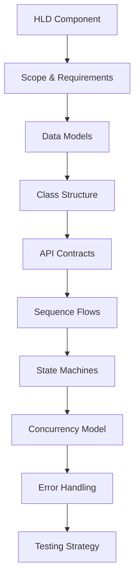

# Low-Level Design (LLD) — A 2-Day Crash Course

LLD zooms into a single component — class diagrams, data models, algorithms, and API contracts detailed enough that any engineer can implement it without guessing.

**Prerequisite:** Read `HLD.md` first. LLD only makes sense when you know which component you are designing and why it exists in the larger system.

---

## Part 0 — Why LLD Exists

HLD gives you the blueprint of a building. LLD gives you the electrical wiring diagram for a single room.

When HLD says "we need a cache," it stops there. LLD answers:

- What eviction policy? LRU, LFU, TTL-based?
- What data structure backs it — a doubly linked list + hash map, or a sorted set?
- What is the API? `get(key)`, `set(key, value, ttl)` — what do they return on miss, on error?
- What happens when two threads write the same key simultaneously?
- What gets logged, what gets metriced, what raises an alert?

Without LLD, engineers make different assumptions and the system breaks at the seams. With LLD, implementation is mostly mechanical. That is the point.

In interviews, LLD tests whether you can translate abstract intent into concrete structure — classes, interfaces, schemas, contracts — and whether you think about edge cases before writing a single line of code.

---

## Vocabulary

Before you can draw or discuss LLD, you need a shared language.

**Class Diagram**
A static view of the system. Shows classes or modules, their fields and methods, and the relationships between them — inheritance, composition, association, dependency. You use this to capture the structure of your code before writing it.

**Sequence Diagram**
A dynamic view of a single flow. Time moves downward. Actors or objects are vertical lifelines. Messages — method calls, API calls, async events — are horizontal arrows. Use this to show how components interact for a specific scenario: "what happens when a user requests a rate-limited endpoint."

**Data Model / Schema**
The shape of your data at rest. For a relational database, this is your table definitions, column types, indexes, and foreign keys. For a document store, it is your document shape and indexes. For an in-memory structure, it is the fields and types of your core objects.

**API Contract (REST / gRPC)**
The formal agreement between a component and its callers. For REST: HTTP method, path, request body shape, response body shape, status codes, and error format. For gRPC: the `.proto` definition — service name, RPC methods, request and response message types. A contract is not documentation written after the fact — it is the design artifact that drives both the implementation and the tests.

**State Machine**
A formal description of how something transitions between states. You define the states, the events that trigger transitions, and any actions taken on entry or exit. Use this whenever an entity has a lifecycle — an order, a payment, a connection, a job.

**Concurrency Model**
Your answer to: what runs in parallel, what is shared, and how do you prevent races and deadlocks? Covers thread pools, locks, lock-free structures, actor models, or event loops depending on your runtime.

**Error Handling Strategy**
Not just "catch exceptions." A strategy defines: what errors are recoverable vs. fatal, what gets retried with what backoff, what gets surfaced to the caller vs. logged internally, and how errors propagate across service boundaries.

**Interface / Abstract Class**
The contract without the implementation. Designing to interfaces keeps components loosely coupled and makes them independently testable. If you find yourself coupling to a concrete class, ask whether an interface would give you more flexibility.



---

## Day 1 — Building the LLD

### Step 1 — Pick One Component from HLD

LLD is not a system-wide exercise. You pick one box from your HLD and zoom in.

Good scoping questions:
- What is the single responsibility of this component?
- What does it consume (inputs) and produce (outputs)?
- What are its external dependencies — databases, caches, other services?
- What are the most critical flows through it?

If you try to LLD an entire system at once, you get a mess. One component. One document.

---

### Step 2 — Define Your Data Models

Start with data, not code. The shape of your data constrains everything else.

For each core entity, write out:
- Fields and types
- Which fields are required vs. optional
- Which fields are mutable after creation
- What uniquely identifies this entity (natural key vs. surrogate key)
- Relationships to other entities (one-to-one, one-to-many, many-to-many)

Example — a `RateLimitRule` entity:

```
RateLimitRule
  id:           UUID        (PK, immutable)
  client_id:    string      (indexed)
  endpoint:     string
  limit_count:  int         -- max requests
  window_ms:    int         -- window size in milliseconds
  algorithm:    enum { TOKEN_BUCKET, SLIDING_WINDOW }
  created_at:   timestamp
  updated_at:   timestamp
```

Thinking through data models first reveals ambiguities early — before you have code to refactor.

---

### Step 3 — Class / Module Structure

Now sketch the classes or modules that will hold behavior.

A useful heuristic: one class per noun in your data model, plus one class per major behavior. Then ask what each class knows and what it does, and whether those two things belong together.

Common structural patterns you will reach for:

**Repository pattern** — one class owns all data access for one entity. Your business logic never touches a database directly; it calls the repository.

**Service layer** — one class owns the business logic for one domain. It depends on repositories, not on raw storage.

**Strategy pattern** — when you have multiple algorithms for the same behavior (two rate limiting algorithms, for example), define an interface and create one concrete class per algorithm. The service holds a reference to the interface.

**Factory** — when object creation is complex or varies by configuration, extract it into a factory class.

Draw a simple class diagram — even on paper. Show:
- Class names
- Key fields (not all fields — the important ones)
- Key methods (public interface, not private helpers)
- Relationships — which class depends on which

---

### Step 4 — API Contracts

Define the public API of this component: what callers invoke and what they get back.

For a REST endpoint:

```
POST /rate-limit/check
Content-Type: application/json

Request:
{
  "client_id": "string",
  "endpoint":  "string"
}

Response 200 — allowed:
{
  "allowed":      true,
  "remaining":    int,
  "reset_at_ms":  int    -- epoch ms when window resets
}

Response 429 — denied:
{
  "allowed":        false,
  "retry_after_ms": int
}

Response 400 — bad request:
{
  "error": "string"
}
```

For an internal interface (Java / Go / TypeScript style):

```
interface RateLimiter {
  check(clientId: string, endpoint: string): CheckResult
  reset(clientId: string, endpoint: string): void
}

type CheckResult = {
  allowed:      boolean
  remaining:    number
  resetAtMs:    number
  retryAfterMs: number | null
}
```

Define contracts before implementation. A contract written after the fact is documentation. A contract written before is a design decision.

---

### Step 5 — Sequence Diagrams for Key Flows

Pick the two or three flows that matter most — the happy path, the most complex error path, and any async flow.

For each, draw a sequence diagram:

```
Client → RateLimitService: check(clientId, endpoint)
RateLimitService → RuleRepository: getRule(clientId, endpoint)
RuleRepository → Database: SELECT ...
Database → RuleRepository: RateLimitRule
RuleRepository → RateLimitService: rule
RateLimitService → CounterStore: increment(key, windowMs)
CounterStore → Redis: EVAL lua_script key window
Redis → CounterStore: {count, ttl}
CounterStore → RateLimitService: CounterResult
RateLimitService → Client: CheckResult
```

You do not need fancy tooling. A text-based sequence diagram or a whiteboard sketch is fine in an interview. The point is to show that you have thought through the call chain, the data that flows, and where things can fail.

---

### Step 6 — State Machines for Stateful Logic

If your component manages anything with a lifecycle, model it as a state machine.

Example — a job in a processing queue:

```
States: QUEUED → RUNNING → COMPLETED
                         → FAILED → RETRYING → RUNNING
                                              → DEAD_LETTER

Transitions:
  QUEUED      + worker picks up       → RUNNING
  RUNNING     + success               → COMPLETED
  RUNNING     + error, retries < max  → FAILED
  FAILED      + scheduler retries     → RETRYING
  RETRYING    + worker picks up       → RUNNING
  RUNNING     + error, retries = max  → DEAD_LETTER
```

Draw this as a table or a diagram. It forces you to handle every state and every transition — including the ones you would have otherwise forgotten.

---

## Day 2 — The Hard Parts

### Concurrency and Thread Safety

Every production component runs with concurrent requests. Before you finish your LLD, answer:

**What is shared state?**
List every field or external resource that multiple threads or goroutines can access simultaneously.

**What is your synchronization strategy?**
- Mutex / lock — simple but can cause contention under high load
- Read-write lock — better when reads far outnumber writes
- Atomic operations — for counters and flags, no lock needed
- Lock-free data structures — complex to get right, use tested libraries
- Single-writer pattern — route all writes to one thread, reads are safe
- Immutable data — if state never changes after creation, no synchronization needed

**What are your deadlock risks?**
If you take multiple locks, always acquire them in the same order. Document the order. If you find yourself designing code that needs locks in different orders depending on the path, redesign.

**Concurrency example — rate limiter counter:**

A naive in-memory counter breaks under concurrent requests. Two threads read the count (both see 99 of 100), both increment to 100, both write back — you have allowed 101 requests.

Fix: use an atomic integer. Or better, push the counter into Redis with a Lua script — Redis is single-threaded, so the script executes atomically.

---

### Error Handling Strategy

Define this before you implement. For your component:

**Classify errors by type:**
- Transient — network blip, temporary overload. Retry with exponential backoff.
- Client error — bad input, missing auth, rate limited. Return 4xx. Do not retry.
- Permanent server error — logic bug, data corruption. Log, alert, do not retry blindly.
- Dependency failure — downstream service is down. Fall back if you can; circuit break if you must.

**Define retry policy:**
- Max retries
- Initial delay
- Backoff multiplier (typically 2x)
- Jitter (add randomness to avoid thundering herd)
- Which operations are idempotent (safe to retry) vs. not

**Define fallback behavior:**
When the rate limiter's Redis is down, do you: fail open (allow all traffic), fail closed (block all traffic), or fall back to a local in-memory counter? There is no universally right answer — but you must make an explicit choice and document it.

**Define what gets surfaced vs. logged:**
Callers should get a meaningful error code and message. Internal stack traces and context go to your logs, not to the caller.

---

### Database Schema Design

Translate your data models into a concrete schema. Think through:

**Normalization vs. denormalization:**
Normalize to reduce duplication and maintain consistency. Denormalize when you need read performance and can tolerate update complexity.

**Indexes:**
Add an index for every column you filter or sort by in a query. But indexes slow writes and consume space — only add what you need.

**Index types:**
- B-tree — default, good for range queries and equality
- Hash — equality only, faster for exact lookups
- Composite — for queries that filter on multiple columns together; column order matters

**Schema example — rate limit rules:**

```sql
CREATE TABLE rate_limit_rules (
  id           UUID PRIMARY KEY DEFAULT gen_random_uuid(),
  client_id    VARCHAR(255) NOT NULL,
  endpoint     VARCHAR(255) NOT NULL,
  limit_count  INT NOT NULL CHECK (limit_count > 0),
  window_ms    INT NOT NULL CHECK (window_ms > 0),
  algorithm    VARCHAR(50) NOT NULL DEFAULT 'SLIDING_WINDOW',
  is_active    BOOLEAN NOT NULL DEFAULT true,
  created_at   TIMESTAMPTZ NOT NULL DEFAULT now(),
  updated_at   TIMESTAMPTZ NOT NULL DEFAULT now(),
  UNIQUE (client_id, endpoint)
);

CREATE INDEX idx_rules_lookup ON rate_limit_rules (client_id, endpoint)
  WHERE is_active = true;
```

Counters themselves belong in Redis, not Postgres — they are high-write, time-bounded, and can be reconstructed.

---

### Caching Strategy Within the Component

When you add a cache to a component, define:

**What gets cached:**
Read-heavy, infrequently-changing data. Rate limit rules are a good candidate. Request counters are not — they need to be authoritative.

**Cache key structure:**
Be explicit. `rl:rule:{client_id}:{endpoint}` is better than `rule_{client_id}`. Namespacing prevents collisions.

**TTL:**
Set a TTL on every cache entry. Unbounded caches are memory leaks waiting to happen.

**Invalidation strategy:**
- TTL-only — simplest, accept brief staleness
- Write-through — on update, invalidate the cache entry immediately
- Read-through — cache checks itself, loads from DB on miss

**Eviction policy:**
LRU is the default for most caches. LFU fits workloads where some keys are accessed far more than others.

---

### Testing Strategy

Your LLD is not complete without a test plan.

**Unit tests:**
Test each class in isolation. Mock all dependencies (repositories, external services). Aim for 80%+ coverage of business logic. Focus on edge cases: empty input, max input, error paths.

**Integration tests:**
Test the component against real dependencies (a test database, a local Redis). Verify that your SQL is correct, your Redis scripts are atomic, your retry logic actually retries.

**Contract tests:**
Verify that your component's API matches its contract. If you defined a REST contract, test that the actual response matches the defined shape and status codes.

**Load tests:**
For components with concurrency concerns — like a rate limiter — run a load test with concurrent requests to verify there are no race conditions at scale.

---

### LLD in Interviews — How You Are Evaluated

Interviewers scoring an LLD round are looking for several things. Knowing what they look for changes how you approach the exercise.

**Requirement clarification (first 5 minutes):**
Before drawing anything, ask questions. What scale? What latency requirement? What consistency requirement? What failure modes matter? Interviewers deduct points for candidates who jump into drawing without scoping.

**Structure — can you produce concrete artifacts:**
Can you draw a class diagram with meaningful relationships? Can you define an API contract with request/response shapes and status codes? Can you sketch a sequence diagram for the key flow? If you stay vague — "we have some classes that talk to a database" — you are not demonstrating LLD skill.

**Edge cases and failures:**
When you describe the happy path, interviewers will probe: "what if the database is down?" "what if two requests arrive simultaneously?" "what if the key doesn't exist?" Anticipate these. Address them before they ask.

**Trade-off awareness:**
Do not present one solution as "the answer." Present options with trade-offs. "We could use an in-memory LRU cache for the rules — fast, but we lose changes until TTL expires. Or we could use Redis with a short TTL — slightly slower but more consistent across replicas." Then recommend one and say why.

**Depth on the part they probe:**
Interviewers will pick one part of your design and go deep. If you said "we use a sliding window algorithm," be ready to explain the implementation in detail — the data structure, the complexity, the atomic operation. If you said "we use Postgres," be ready to write the schema and the key queries.

---

### LLD Document Template

Use this structure when producing a real LLD document:

```
# LLD: [Component Name]

## 1. Scope
What this component does. What it does not do.
Which HLD box this corresponds to.

## 2. Requirements
Functional requirements (what it must do).
Non-functional requirements (latency, throughput, availability, consistency).

## 3. Data Models
Entity definitions with fields, types, and relationships.

## 4. Class / Module Structure
Class diagram (embedded or described). Key responsibilities per class.

## 5. API Contracts
All public interfaces: REST endpoints, internal interfaces, gRPC protos.

## 6. Key Flows
Sequence diagrams for 2–3 critical scenarios.

## 7. State Machines
Any entity lifecycle that requires one.

## 8. Concurrency Model
What is shared. How it is protected. Deadlock risks and mitigations.

## 9. Error Handling
Error classification. Retry policy. Fallback behavior.

## 10. Schema
Database table definitions. Indexes. Rationale.

## 11. Caching
What is cached, TTL, eviction policy, invalidation strategy.

## 12. Testing Strategy
Unit, integration, contract, load test plan.

## 13. Open Questions
Decisions deferred. Assumptions made. Things to validate with stakeholders.
```

---

## Worked Example — LLD for a Rate Limiter

This is the canonical LLD interview question. Walk through it slowly.

### Scope

The rate limiter sits in front of an API gateway. It allows or denies requests based on per-client, per-endpoint rules. You are designing the rate limiter service itself — not the gateway.

### Requirements

Functional:
- Check whether a request from `client_id` to `endpoint` is within the allowed rate
- Return allow/deny with metadata (remaining requests, reset time)
- Support configurable rules per client and endpoint

Non-functional:
- p99 latency under 10ms
- Consistent across multiple instances (no per-instance counters)
- Graceful degradation if Redis is unavailable

---

### Two Algorithms — Know Both

**Token Bucket**

A bucket holds up to `capacity` tokens. Tokens refill at a fixed rate. Each request consumes one token. If the bucket is empty, the request is denied.

Good for: allowing bursts up to capacity while enforcing an average rate.

Data stored in Redis:
```
key:    rl:tb:{client_id}:{endpoint}
fields:
  tokens:       float   -- current token count
  last_refill:  int     -- epoch ms of last refill
```

On each request (atomic Lua script):
1. Compute elapsed time since last refill
2. Compute tokens to add: `elapsed_ms / refill_interval_ms * refill_amount`
3. Add tokens, cap at capacity
4. If tokens >= 1, decrement and allow
5. Else, deny

**Sliding Window Log**

Store a sorted set of timestamps of all requests in the current window. On each request, remove entries older than `window_ms`, count remaining entries. If count < limit, add the current timestamp and allow. Else deny.

Good for: precise enforcement with no burst allowance.

Data stored in Redis:
```
key:  rl:sw:{client_id}:{endpoint}
type: sorted set
member: request timestamp (microsecond precision for uniqueness)
score:  epoch ms
```

On each request (atomic Lua script):
1. `ZREMRANGEBYSCORE` to remove entries older than `now - window_ms`
2. `ZCARD` to count remaining entries
3. If count < limit: `ZADD` current timestamp, set expiry, return allowed
4. Else return denied

⚠️ Sliding window log is memory-intensive at high request rates — each request stores one entry. At 10,000 req/s per client, a 1-second window holds 10,000 entries per key.

---

### Class Structure

```
interface RateLimiter {
  check(request: RateLimitRequest): RateLimitResult
}

class TokenBucketRateLimiter implements RateLimiter {
  - redisClient: RedisClient
  - ruleRepository: RuleRepository
  + check(request): RateLimitResult
  - runLuaScript(key, capacity, refillRate): BucketState
}

class SlidingWindowRateLimiter implements RateLimiter {
  - redisClient: RedisClient
  - ruleRepository: RuleRepository
  + check(request): RateLimitResult
  - runLuaScript(key, windowMs, limit): WindowState
}

class RateLimiterFactory {
  + create(algorithm: Algorithm): RateLimiter
}

class RuleRepository {
  - db: DatabaseClient
  - cache: CacheClient
  + getRule(clientId, endpoint): RateLimitRule | null
}

class RateLimitService {
  - factory: RateLimiterFactory
  - ruleRepository: RuleRepository
  + check(clientId, endpoint): RateLimitResult
}
```

---

### Sequence — Check Request (Sliding Window)

```
Caller → RateLimitService: check(clientId, endpoint)
RateLimitService → RuleRepository: getRule(clientId, endpoint)
RuleRepository → LocalCache: get(key)
  [cache miss]
  RuleRepository → Postgres: SELECT rule WHERE client_id AND endpoint
  Postgres → RuleRepository: RateLimitRule
  RuleRepository → LocalCache: set(key, rule, ttl=60s)
RuleRepository → RateLimitService: RateLimitRule
RateLimitService → SlidingWindowRateLimiter: check(request, rule)
SlidingWindowRateLimiter → Redis: EVAL lua_script key windowMs limit nowMs
Redis → SlidingWindowRateLimiter: {allowed, count, resetAtMs}
SlidingWindowRateLimiter → RateLimitService: RateLimitResult
RateLimitService → Caller: RateLimitResult
```

---

### Error Handling — Fail Open vs. Fail Closed

When Redis is unavailable:

- **Fail open:** allow all requests. Risk: no rate limiting during outage.
- **Fail closed:** deny all requests. Risk: complete service disruption.
- **Fail to local:** fall back to a per-instance in-memory counter. Risk: limits are not enforced globally — each instance has its own counter. Acceptable for some workloads.

You must choose. Document the choice. The interviewer will ask.

---

## Pitfalls

**Designing the whole system instead of one component.**
LLD scope is one box. If you start drawing data flows between five services, stop. Pick one service. Go deep on it.

**Skipping data models.**
Classes without data models are hollow. Start with the shape of your data. Everything else follows from that.

**Forgetting concurrency.**
Every shared mutable variable is a bug waiting to happen in production. Name them. Protect them. Do it in the design, not after the fact.

**Over-engineering the class hierarchy.**
Five levels of inheritance for a rate limiter is a code smell, not a design. Prefer composition. Prefer flat hierarchies. Add abstraction only when you have two or more concrete things that genuinely need to behave differently.

**Defining a vague API contract.**
"Returns some information about the rate limit" is not a contract. Define the fields, the types, the status codes, and the error format. Make it implementable by someone who has never spoken to you.

**Not discussing trade-offs.**
A design with no alternatives is a design that has not been thought through. For every significant decision, name the alternative you considered and say why you chose what you chose.

**Treating the LLD as final.**
An LLD is a design artifact, not a commitment. When implementation reveals something the design missed, update the document. A stale LLD is worse than no LLD.

---

## Quick Reference

### LLD Template (Condensed)

```
Scope → Data Models → Class Structure → API Contracts
→ Key Flows (sequence diagrams) → State Machines
→ Concurrency Model → Error Handling
→ Schema → Caching → Testing Plan → Open Questions
```

### UML Cheatsheet

```
Class relationships:
  A ──────────>  B    Association  (A has a reference to B)
  A ◆─────────>  B    Composition  (A owns B; B cannot exist without A)
  A ◇─────────>  B    Aggregation  (A contains B; B can exist independently)
  A ─────────|>  B    Inheritance  (A extends B)
  A - - - - -|>  B    Realization  (A implements interface B)
  A - - - - ->   B    Dependency   (A uses B temporarily)

Multiplicity:
  1       exactly one
  0..1    zero or one
  *       zero or many
  1..*    one or many

Sequence diagram symbols:
  ──────────────>     synchronous call
  - - - - - - - >     return / response
  ──────────────>>    asynchronous message
  [  ]                activation box (object is active)
  X                   object destroyed
```

### Complexity Reference

| Data structure         | Access    | Search    | Insert    | Delete    |
|------------------------|-----------|-----------|-----------|-----------|
| Hash map               | O(1)      | O(1)      | O(1)      | O(1)      |
| Doubly linked list     | O(n)      | O(n)      | O(1)*     | O(1)*     |
| Sorted set (skip list) | O(log n)  | O(log n)  | O(log n)  | O(log n)  |
| Min/max heap           | O(1)**    | O(n)      | O(log n)  | O(log n)  |

\* given a pointer to the node
\*\* peek only; pop is O(log n)

---

## Top 10 Interview Questions

<details>
<summary><strong>Q: How do you start an LLD interview — what is the first thing you do?</strong></summary>

Clarify scope and requirements before drawing anything. Ask: what is the expected scale, what latency is acceptable, what consistency model, and what failure modes matter. Then pick one component — LLD is not system-wide. Define the data models first because the shape of your data constrains everything else. Interviewers deduct points for candidates who jump into class diagrams without understanding what they are designing.

</details>

<details>
<summary><strong>Q: Why should you design data models before class structure?</strong></summary>

Data is the most stable part of your design — it changes less frequently than behavior. Starting with data models reveals ambiguities early: which fields are required vs optional, which are mutable, what uniquely identifies an entity, and what relationships exist. Classes and their methods follow naturally from the data shape. If you start with classes, you often discover data model problems late when refactoring is expensive.

</details>

<details>
<summary><strong>Q: What is the difference between a class diagram and a sequence diagram, and when do you use each?</strong></summary>

A class diagram is a static view showing structure — classes, fields, methods, and relationships (inheritance, composition, dependency). Use it to capture your code's architecture. A sequence diagram is a dynamic view showing one specific flow over time — actors, method calls, and responses. Use it to show how components interact for a scenario like "user requests a rate-limited endpoint." Both are needed: class diagrams show what exists, sequence diagrams show how it behaves.

</details>

<details>
<summary><strong>Q: How do you handle concurrency in an LLD for a rate limiter?</strong></summary>

Identify shared state: the request counter is accessed by concurrent threads. A naive in-memory counter breaks — two threads read 99, both increment to 100, both write back, allowing 101 requests. Fix: use atomic integers for in-process counters, or push the counter to Redis with a Lua script (Redis is single-threaded, so the script executes atomically). Document which state is shared, your synchronization strategy, and deadlock risks. This is where most LLD candidates fail.

</details>

<details>
<summary><strong>Q: What is the difference between fail-open, fail-closed, and fail-to-local?</strong></summary>

When a dependency (like Redis for a rate limiter) is unavailable: fail-open allows all requests (risk: no rate limiting during outage). Fail-closed denies all requests (risk: complete service disruption). Fail-to-local falls back to a per-instance in-memory counter (risk: limits not enforced globally, each instance counts independently). There is no universally right answer — the choice depends on your business context. You must make an explicit decision and document the tradeoff.

</details>

<details>
<summary><strong>Q: How do you design an API contract at the LLD level?</strong></summary>

Define every public interface before implementation. For REST: HTTP method, path, request body shape with field types, response body shape for success and each error case, status codes, and error format. For internal interfaces: method signatures with typed parameters and return types. A contract is a design artifact, not after-the-fact documentation. It should be precise enough that someone who has never spoken to you can implement against it.

</details>

<details>
<summary><strong>Q: When should you model something as a state machine?</strong></summary>

Any entity with a lifecycle is a state machine candidate — orders (pending, confirmed, shipped, delivered), jobs (queued, running, completed, failed), connections (connecting, connected, disconnecting). Model it explicitly: list all states, all events that trigger transitions, and any actions on entry or exit. Draw it as a table or diagram. This forces you to handle every state and every transition — including the edge cases you would have otherwise forgotten.

</details>

<details>
<summary><strong>Q: How do you choose between Token Bucket and Sliding Window for rate limiting?</strong></summary>

Token Bucket allows bursts up to the bucket capacity while enforcing an average rate — good when occasional bursts are acceptable. Sliding Window Log provides precise enforcement with no burst allowance — good when strict per-window limits are required. The tradeoff: Sliding Window is memory-intensive at high request rates (one entry per request in a sorted set). Token Bucket stores only two values (current tokens, last refill time). Choose based on whether your use case tolerates bursts.

</details>

<details>
<summary><strong>Q: What makes a good error handling strategy in LLD?</strong></summary>

Classify errors by type: transient (retry with exponential backoff + jitter), client error (return 4xx, no retry), permanent server error (log, alert, no blind retry), dependency failure (fall back or circuit break). Define retry policy: max retries, initial delay, backoff multiplier, jitter, and which operations are idempotent. Define what gets surfaced to callers (meaningful error codes) vs logged internally (stack traces, context). An error strategy designed upfront prevents ad-hoc handling that diverges across the codebase.

</details>

<details>
<summary><strong>Q: How do you present tradeoffs in an LLD interview?</strong></summary>

Never present one solution as "the answer." Present options with tradeoffs, then recommend one with reasoning. "We could use an in-memory LRU cache — fast, but lose changes until TTL expires. Or Redis with a short TTL — slightly slower but consistent across replicas. I recommend Redis because the NFR requires consistency across instances." This structure — option A with tradeoff, option B with tradeoff, recommendation with justification — signals mature engineering thinking.

</details>

---


## Quick Quiz

Test your understanding with these rapid-fire questions (answers hidden):

<details>
<summary>1. What is the ONE core problem that LLD solves?</summary>
Re-read Part 0 — the mental model section. If you can explain the "why" in one sentence, you understand the foundation.
</details>

<details>
<summary>2. Name the 3 most important terms from the vocabulary section.</summary>
Review Part 1. These are the building blocks every conversation about LLD uses.
</details>

<details>
<summary>3. What is the first thing you would set up on Day 1?</summary>
Check the Day 1 section — the very first hands-on step that gets you a working result.
</details>

<details>
<summary>4. What is the most common production pitfall with LLD?</summary>
Review the Common Pitfalls section. The first item listed is typically the most frequently encountered.
</details>

<details>
<summary>5. How does LLD compare to its closest alternative?</summary>
Check the Comparison Matrix below — focus on the key differentiating row.
</details>


## Comparison Matrix

| Dimension | LLD | HLD | Code-Level Design |
|-----------|-----|-----|-------------------|
| **Primary use case** | Core strength of LLD | Core strength of HLD | Core strength of Code-Level Design |
| **Learning curve** | Moderate | Varies | Varies |
| **Community/ecosystem** | Active | Active | Growing |
| **Operational complexity** | Medium | Varies | Varies |
| **Best for** | See Part 0 | Different tradeoffs | Different tradeoffs |

> **How to read this matrix:** no tool wins on every dimension. Pick based on your specific constraints — team expertise, existing infrastructure, scale requirements, and compliance needs. The right choice is the one that fits your context, not the one with the most checkmarks.

## Next Steps

- `Design-Patterns.md` — the structural and behavioral patterns you reach for when building LLD components (Strategy, Factory, Observer, Repository, and more)
- `Design-Principles.md` — SOLID, DRY, YAGNI, and the principles that determine whether your LLD will survive contact with changing requirements
- `HLD.md` — revisit the system level; understanding both layers together is what lets you move fluidly between them in an interview

---

## Recommended learning resources

**YouTube channels & playlists:**
- [sudoCODE — Low Level Design Playlist](https://www.youtube.com/@sudocode) — class diagrams, design patterns in practice, and LLD interview walkthroughs
- [Christopher Okhravi — Design Patterns](https://www.youtube.com/@ChristopherOkhravi) — GoF patterns explained with clear UML and code, the building blocks of every LLD
- [Gaurav Sen — Object-Oriented Design](https://www.youtube.com/@gaborsen) — parking lot, elevator, chess, and other classic LLD interview problems
- [Concept and Coding — LLD Series](https://www.youtube.com/results?search_query=concept+and+coding+low+level+design) — step-by-step LLD solutions with class diagrams, SOLID principles, and implementations
- [Derek Banas — Design Patterns](https://www.youtube.com/@deaborsen) — rapid pattern overviews useful as quick refreshers before interviews

**Official docs & blogs:**
- [refactoring.guru — Design Patterns](https://refactoring.guru/design-patterns) — visual catalog of all 23 GoF patterns with code examples in multiple languages
- [Source Making — Design Patterns](https://sourcemaking.com/design_patterns) — patterns with UML diagrams, real-world analogies, and anti-pattern warnings

---

## The Mantra

> Design the data first. The classes follow. The API follows the classes. The tests follow the API.
>
> Start broad — scope, requirements, entities. Then go deep — one class, one contract, one sequence at a time.
>
> Every decision is a trade-off. Name both sides. Choose one. Be ready to defend it.
>
> LLD is not about being right. It is about being precise enough that someone else can implement it — and precise enough that you find the bugs before they do.
