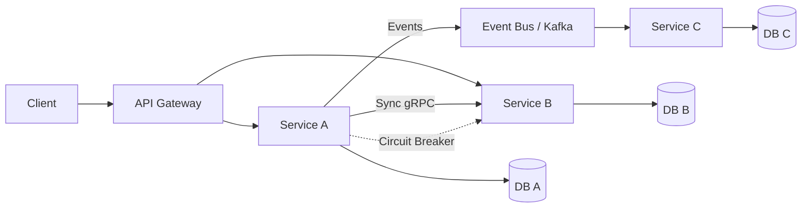

# Microservices Patterns — A 2-Day Crash Course

The architectural patterns that make microservices work in production — saga, CQRS, event sourcing, service discovery, API gateway, and the patterns that prevent distributed monoliths.

**Prerequisite:** `System-Design.md`

---

## Part 0 — Why Patterns Matter

You can decompose a monolith into ten services and still have a distributed monolith. The symptoms are unmistakable: every deployment requires coordinating six teams, a single slow service brings down the entire request chain, and your database is still shared across everything. You got the operational cost of distributed systems without the benefits.

Patterns are the answer to the recurring problems that appear at scale. They are not cargo cult — you should understand the problem each pattern solves before you reach for it. The goal of this crash course is to give you that understanding across two focused days.

---

## Vocabulary

**Saga** — a sequence of local transactions coordinated across services. Each step either succeeds and triggers the next, or fails and triggers compensating transactions to undo prior steps. Comes in two flavors: choreography and orchestration.

**CQRS (Command Query Responsibility Segregation)** — separating the write model (commands that change state) from the read model (queries that return data). They can be different data stores, different schemas, different services.

**Event Sourcing** — storing state as an immutable log of events rather than the current value. The current state is derived by replaying events. Often paired with CQRS.

**API Gateway** — a single entry point for all client requests. Handles routing, auth, rate limiting, SSL termination, and request aggregation. Clients talk to one endpoint; the gateway routes to the right services.

**Service Discovery** — the mechanism by which services find each other at runtime. Client-side discovery (the client queries a registry) and server-side discovery (a load balancer queries the registry on the client's behalf).

**Circuit Breaker** — wraps calls to a downstream service. After a threshold of failures, it "opens" and fast-fails instead of waiting, giving the downstream service time to recover.

**Sidecar** — a helper container or process deployed alongside your service container. Handles cross-cutting concerns: logging, metrics, mTLS, service mesh proxy. Your service code stays clean.

**Strangler Fig** — a migration pattern. You build the new system alongside the old one, route traffic incrementally to the new system, and eventually strangle the monolith out of existence.

**Bulkhead** — isolating components so a failure in one does not cascade. Named after ship compartments. In practice: separate thread pools, connection pools, or resource limits per downstream dependency.

**Outbox Pattern** — a solution to the dual-write problem. Instead of writing to your database and publishing an event atomically (which you cannot do across two systems), you write both the business data and the event to the same database transaction. A separate process reads the outbox table and publishes to the message broker.



---

## DAY 1 — Communication Patterns

### Synchronous vs Asynchronous

Synchronous communication (REST, gRPC) is simple to reason about: you send a request, you wait for a response. It works well when the caller needs the result immediately — fetching a user profile, checking inventory before showing a product page.

The problem is temporal coupling. Service A calls Service B, which calls Service C. If C is slow, B is slow, and A times out. You have created a latency chain. If C is down, A's request fails. You have created an availability dependency chain. This is how distributed monoliths are born.

Asynchronous communication (message queues, event streams) decouples services in time. Service A publishes an event and moves on. Service B consumes that event when it is ready. They do not need to be up simultaneously. The tradeoff is eventual consistency — B's state may lag A's.

**Rule of thumb:** use synchronous for queries where the caller needs the answer to proceed. Use asynchronous for state changes that other services need to react to.

**gRPC vs REST**

gRPC gives you strongly typed contracts via protobuf, bidirectional streaming, and better performance. It is the right choice for internal service-to-service communication at high throughput. REST is better for public APIs and external clients because tooling and debuggability are superior.

Pick gRPC internally, REST externally. Do not let the decision be arbitrary.

---

### API Gateway

Every client — web app, mobile app, third-party partner — should have one stable address. The API gateway is that address.

What it does:
- Routes `/api/users` to the user service, `/api/orders` to the order service
- Authenticates the JWT before the request reaches any service
- Rate limits by IP or API key
- Handles SSL termination so internal traffic can be plain HTTP
- Aggregates responses when a client needs data from multiple services (BFF pattern)

What it should not do: contain business logic. The moment your gateway knows about discount rules or order state machines, it becomes a distributed monolith's front door.

Common implementations: AWS API Gateway, Kong, NGINX, Envoy, Traefik.

**Interview framing:** "The API gateway lets services evolve independently behind a stable contract. It also keeps cross-cutting concerns out of application code."

---

### Service Discovery

Services start and stop on dynamic IP addresses. You cannot hardcode `http://10.0.1.42:8080` and call it done.

**Client-side discovery:** the service queries a service registry (Consul, Eureka) to get a list of available instances, then picks one using a load balancing algorithm. Your client code carries load balancing logic.

**Server-side discovery:** the client sends requests to a load balancer. The load balancer queries the registry and forwards to the right instance. The client knows nothing about discovery. This is how Kubernetes Services work — the kube-proxy handles it.

In Kubernetes, server-side discovery is the default. Your service gets a stable DNS name (`order-service.default.svc.cluster.local`). The rest is handled for you. Understanding the manual approach matters for legacy environments and interviews.

---

### Saga Pattern

Distributed transactions across services are the hardest problem in microservices. You cannot use a two-phase commit at scale — it creates tight coupling and degrades performance.

The saga pattern replaces a distributed transaction with a sequence of local transactions, each publishing an event or message. If any step fails, compensating transactions run in reverse order to undo the work.

**Choreography-based saga**

Each service listens for events and reacts by performing its local transaction and publishing the next event. There is no central coordinator.

Example — order creation:
1. `OrderService` creates an order in PENDING state, publishes `OrderCreated`
2. `InventoryService` listens for `OrderCreated`, reserves stock, publishes `StockReserved` or `StockFailed`
3. `PaymentService` listens for `StockReserved`, charges the card, publishes `PaymentProcessed` or `PaymentFailed`
4. `OrderService` listens for `PaymentProcessed`, marks the order CONFIRMED

If `PaymentFailed` fires, `InventoryService` listens and releases the reserved stock. If `StockFailed` fires, `OrderService` listens and marks the order CANCELLED.

**Pros:** loose coupling, no single point of failure, simple to add new participants.

**Cons:** the flow is implicit and spread across services. Debugging requires correlating events across multiple logs. It becomes hard to understand the overall workflow as complexity grows.

**Orchestration-based saga**

A central orchestrator explicitly tells each service what to do via commands. The orchestrator owns the state machine of the saga.

Example — same order creation:
1. `OrderOrchestrator` receives a `CreateOrder` command
2. It sends `ReserveStock` to `InventoryService`, waits for reply
3. On success, it sends `ChargePayment` to `PaymentService`, waits for reply
4. On success, it sends `ConfirmOrder` to `OrderService`
5. On any failure, it sends compensating commands in reverse: `ReleaseStock`, `RefundPayment`, `CancelOrder`

**Pros:** the workflow is explicit and visible in one place. Easier to debug — the orchestrator's state tells you exactly where a saga is. Easier to add error handling.

**Cons:** the orchestrator becomes a coordination bottleneck. Risk of it accumulating business logic and becoming a distributed monolith's brain.

⚠️ Compensating transactions must be idempotent. They may run more than once due to network retries.

**When to use which:** choreography works well for simple, linear flows with few participants. Orchestration is better for complex workflows with many conditional branches, long-running sagas, and when observability matters.

---

## DAY 2 — Data Patterns and Architecture

### Database per Service

Each service owns its data and exposes it only through its API. No shared databases.

This is the foundational rule. Shared databases create coupling at the data layer — schema changes in one service break another, deployment coordination is required, and you cannot independently scale or choose the right storage technology per service.

In practice, this means you will have eventual consistency across services. A user's balance in the payment service may not reflect in the analytics service for a few seconds. Design for it. Communicate it to stakeholders.

---

### CQRS

A single data model that handles both writes and complex reads becomes a compromise — optimized for neither. CQRS separates them.

**Write side (commands):** normalized, ACID, optimized for consistency. You write to a SQL database in normalized form.

**Read side (queries):** denormalized, optimized for the query patterns of your UI. Could be a separate table, a materialized view, a search index (Elasticsearch), or a cache (Redis).

The read model is updated asynchronously from the write model — typically via events or change data capture. This introduces eventual consistency on reads.

When to use CQRS:
- Your read patterns are fundamentally different from your write patterns
- You need to scale reads and writes independently
- You have complex reporting queries that would require many JOINs on a normalized write model

When not to use CQRS: simple CRUD services where the added complexity is not justified.

---

### Event Sourcing

Instead of storing `account.balance = 1000`, you store:
```
AccountOpened   { amount: 500 }
MoneyDeposited  { amount: 750 }
MoneyWithdrawn  { amount: 250 }
```

The current balance is 1000, derived by replaying the event log.

**What you gain:**
- Complete audit trail — you know every state transition and why
- Ability to reconstruct state at any point in time
- Projections — you can build any read model by replaying events
- Natural fit for event-driven architectures

**What you pay:**
- Querying current state requires replaying or maintaining snapshots
- Schema evolution is hard — old events must remain processable forever
- Operational complexity increases significantly

Event sourcing pairs naturally with CQRS: the write side appends events, the read side maintains projections updated from those events.

⚠️ Event sourcing is not for every service. Use it where audit history and temporal queries have real business value — financial transactions, inventory, legal records.

---

### Outbox Pattern

You have an order service that saves an order to PostgreSQL and publishes an `OrderCreated` event to Kafka. If the database write succeeds but Kafka publish fails, you have an order with no event. If Kafka publishes but the database rolls back, you have a phantom event. This is the dual-write problem.

The outbox pattern solves it:

1. In the same database transaction, write the order to the `orders` table and write the event to an `outbox` table
2. The transaction commits atomically — both writes succeed or both fail
3. A separate process (a relay or a change data capture tool like Debezium) reads the outbox table and publishes events to Kafka
4. Mark the outbox record as processed after successful publish

The relay guarantees at-least-once delivery. Your consumers must be idempotent.

This is the correct answer whenever someone asks "how do you guarantee an event is published when the database write succeeds?"

---

### Strangler Fig

You have a monolith. You cannot rewrite it all at once — that is the "big bang rewrite" and it fails more often than it succeeds.

The strangler fig pattern:
1. Deploy the new microservice alongside the monolith
2. Put a routing layer (usually the API gateway or a facade) in front of both
3. Route a subset of traffic to the new service — start with a feature flag, move to percentage-based routing
4. Expand the new service's scope, shrink the monolith's scope
5. When the monolith handles nothing, remove it

The key insight is that you can migrate incrementally, verify each step, and roll back if needed. No big bang. No freeze.

**Interview framing:** "The strangler fig lets you modernize without a risky cutover. You always have a working system. The risk is bounded at each step."

---

### Distributed Transactions — The Honest Assessment

Two-phase commit (2PC) creates tight coupling and is a distributed systems anti-pattern at scale. Avoid it.

Your options in order of preference:
1. **Redesign** — can you avoid needing atomicity across services? Often the business requirement is softer than it appears.
2. **Saga** — eventual consistency with compensating transactions (covered in Day 1)
3. **Outbox + event sourcing** — guarantee event delivery, let consumers handle idempotency
4. **Exactly-once semantics in Kafka** (transactions + idempotent producers) — for message-centric workflows

Accept that distributed systems are eventually consistent. Design your UX and your business processes to accommodate it.

---

### Testing Microservices

**Unit tests:** test business logic within a service in isolation. Mock all external dependencies.

**Contract tests:** the most important test category in microservices. A consumer defines what it expects from a provider's API (the "contract"). The provider runs those contracts in its own test suite. If the provider changes its API in a breaking way, the contract test fails before deployment. Pact is the standard tool.

**Component tests:** test a single service in isolation with real internal components but mocked external services. Validates that the service behaves correctly end-to-end within its own boundary.

**Integration tests:** test the interaction between two or three real services. Expensive and slow — keep them focused on critical paths.

**End-to-end tests:** test the full system. Keep minimal — they are brittle, slow, and expensive to maintain. Cover only the most critical user journeys.

The testing pyramid still applies. Most tests should be unit and contract. Few should be end-to-end.

---

### Monolith vs Microservices Decision Framework

Start with a monolith. Microservices are a solution to scale problems — organizational scale, team autonomy, independent deployment velocity, and technology heterogeneity. They are not a default architecture choice.

**Use microservices when:**
- You have multiple teams that need to deploy independently without coordination
- Different parts of the system have fundamentally different scaling requirements
- You need technology diversity — one service in Python, one in Go, one in Java
- The domain is well understood and bounded contexts are clear

**Stay with a monolith when:**
- The team is small (under 10 engineers)
- The domain is not yet understood — premature decomposition creates the wrong boundaries
- Deployment velocity is not constrained by team coordination
- You are early-stage and need to iterate quickly

The modular monolith is underrated. Strong module boundaries with enforced interfaces inside a single deployable unit gives you many benefits of microservices with far less operational overhead.

---

## Worked Example — Order Processing with Saga Orchestration

Domain: e-commerce order placement.

Services: `OrderService`, `InventoryService`, `PaymentService`, `NotificationService`.

**Flow:**

```
Client → API Gateway → OrderService
```

1. Client POSTs to `/api/orders` on the API gateway
2. Gateway authenticates JWT, routes to `OrderService`
3. `OrderService` creates an order with status `PENDING` in its database
4. `OrderService` starts a saga by publishing a `StartOrderSaga` command to the saga orchestrator
5. Orchestrator sends `ReserveInventory(orderId, items)` to `InventoryService`
6. `InventoryService` checks stock, reserves items, replies `InventoryReserved` or `InventoryInsufficient`
7. On `InventoryReserved`: orchestrator sends `ProcessPayment(orderId, amount)` to `PaymentService`
8. `PaymentService` charges the card, replies `PaymentSucceeded` or `PaymentFailed`
9. On `PaymentSucceeded`: orchestrator sends `ConfirmOrder(orderId)` to `OrderService` and `SendConfirmationEmail(orderId)` to `NotificationService`
10. `OrderService` updates status to `CONFIRMED`

**Failure path:**

If `PaymentFailed`:
- Orchestrator sends `ReleaseInventory(orderId)` to `InventoryService`
- Orchestrator sends `CancelOrder(orderId)` to `OrderService`
- Order status becomes `CANCELLED`

**Observability:**

Each step writes to a saga state table: `saga_id`, `step`, `status`, `timestamp`. When an order is stuck, you query this table to see exactly which step failed and why. This is why orchestration beats choreography for complex flows.

---

## Pitfalls

**Premature decomposition.** Splitting a monolith before you understand the domain boundaries creates services with wrong responsibilities. Wrong boundaries are worse than a monolith — you cannot query across services without API calls, and you cannot join across databases.

**Chatty services.** If Service A calls Service B ten times per request, the services are too granular. Reconsider boundaries or switch to async batch communication.

**Shared libraries with business logic.** A shared library that contains business rules couples all services to the same release. Use shared libraries only for truly generic concerns — logging, metrics, circuit breaker configuration.

**Distributed monolith.** You have microservices that must be deployed together because they share a database, or share a library with versioned contracts, or one service knows too much about another's internals.

**Synchronous chains.** Service A calls B calls C calls D. A single 200ms latency anywhere creates 800ms total. Redesign as async or flatten the call chain.

**No saga compensation.** Implementing saga without implementing compensating transactions. When payment fails, inventory stays reserved forever.

**Ignoring eventual consistency.** Building a UI that assumes read-your-writes consistency when your read model is updated asynchronously. Users see stale data after a write. Design the UX to handle this — show "order is being processed" rather than the final state immediately.

**Over-engineering with event sourcing.** Applying event sourcing to every service because it sounds sophisticated. It adds significant complexity. Use it where audit history is a genuine requirement.

---

## Quick Reference — Pattern Decision Matrix

| Problem | Pattern |
|---|---|
| Client needs one stable endpoint | API Gateway |
| Services need to find each other | Service Discovery |
| Prevent cascade failures | Circuit Breaker |
| Multi-service transaction | Saga (choreography or orchestration) |
| Guarantee event published with DB write | Outbox Pattern |
| Complex read vs write models | CQRS |
| Full audit trail, temporal queries | Event Sourcing |
| Migrate from monolith incrementally | Strangler Fig |
| Isolate failure domains | Bulkhead |
| Cross-cutting concerns (metrics, mTLS) | Sidecar |
| Simple linear workflow, loose coupling | Choreography Saga |
| Complex workflow, observability needed | Orchestration Saga |

---

## Top 10 Interview Questions

<details>
<summary><strong>Q: What is the difference between choreography and orchestration sagas, and when would you use each?</strong></summary>

In choreography, each service listens for events and reacts independently — no central coordinator. The workflow is implicit and distributed. In orchestration, a central orchestrator explicitly tells each service what to do via commands and owns the saga's state machine. Use choreography for simple, linear flows with few participants where loose coupling matters. Use orchestration for complex workflows with conditional branches, many participants, and when observability matters — the orchestrator's state table tells you exactly where a saga is stuck.

</details>

<details>
<summary><strong>Q: How does CQRS work and when is it justified?</strong></summary>

CQRS separates the write model (commands, normalized, ACID) from the read model (queries, denormalized, optimized for access patterns). The read model is updated asynchronously via events or CDC, introducing eventual consistency. It is justified when read patterns differ fundamentally from write patterns, you need to scale reads and writes independently, or complex reporting queries would require many JOINs on a normalized schema. For simple CRUD services, CQRS adds unjustified complexity.

</details>

<details>
<summary><strong>Q: What is the Outbox Pattern and what problem does it solve?</strong></summary>

The outbox pattern solves the dual-write problem: when you need to write to a database and publish an event atomically. If the DB write succeeds but Kafka fails, you have data without an event. The fix: write both the business data and the event to the same database transaction (outbox table). A separate relay (or Debezium via CDC) reads the outbox and publishes to Kafka. The relay guarantees at-least-once delivery, so consumers must be idempotent.

</details>

<details>
<summary><strong>Q: Why is "database per service" a foundational rule, and what tradeoffs does it create?</strong></summary>

Shared databases create coupling at the data layer — schema changes in one service break another, deployments must be coordinated, and you cannot independently scale or choose the right storage per service. The tradeoff is eventual consistency across services — a user's balance in the payment service may lag in analytics for seconds. Design for it, communicate it to stakeholders, and use domain events for cross-service data flow rather than shared database access.

</details>

<details>
<summary><strong>Q: What is a distributed monolith and how do you detect one?</strong></summary>

A distributed monolith has the operational cost of microservices without the benefits. Symptoms: every deployment requires coordinating multiple teams, a single slow service brings down the entire chain, services share a database, or one service knows too much about another's internals. You detect it by asking: can any service be deployed independently? If the answer is consistently no, you have a distributed monolith. The root cause is usually premature decomposition without clear bounded context boundaries.

</details>

<details>
<summary><strong>Q: How does the Strangler Fig pattern enable safe migration from a monolith?</strong></summary>

Deploy the new microservice alongside the monolith. Put a routing layer (API gateway or facade) in front of both. Route a subset of traffic to the new service — start with a feature flag, move to percentage-based routing. Expand the new service's scope, shrink the monolith's. The key insight: you migrate incrementally, verify each step, and can roll back if needed. No big bang rewrite. No freeze. The risk is bounded at each step.

</details>

<details>
<summary><strong>Q: What is a circuit breaker and how does it prevent cascade failures?</strong></summary>

A circuit breaker wraps calls to a downstream service. In the closed state, requests pass through normally. After a threshold of failures, it "opens" and fast-fails all requests without calling the downstream — giving it time to recover. After a timeout, it enters "half-open" and allows a probe request. If the probe succeeds, it closes; if it fails, it reopens. Without circuit breakers, a slow or failing dependency can exhaust thread pools and cascade failures to every upstream caller.

</details>

<details>
<summary><strong>Q: When should you start with a monolith instead of microservices?</strong></summary>

Start with a monolith when the team is small (under 10 engineers), the domain is not yet understood (premature decomposition creates wrong boundaries), deployment velocity is not constrained by team coordination, or you are early-stage and need to iterate quickly. Microservices solve organizational scale — multiple teams needing independent deployment, different scaling requirements, technology diversity. The modular monolith is underrated: strong module boundaries inside a single deployable gives many microservice benefits with far less operational overhead.

</details>

<details>
<summary><strong>Q: What are contract tests and why are they the most important test category in microservices?</strong></summary>

Contract tests verify that a provider's API matches what consumers expect. A consumer defines the expected request/response shapes (the "contract"). The provider runs those contracts in its test suite. If the provider changes its API in a breaking way, the contract test fails before deployment — not in production. This is more valuable than integration tests because it catches breaking changes early without requiring all services to be running. Pact is the standard tool.

</details>

<details>
<summary><strong>Q: What is Event Sourcing and when should you avoid it?</strong></summary>

Event Sourcing stores state as an immutable log of events rather than current values — `AccountOpened`, `MoneyDeposited`, `MoneyWithdrawn`. Current state is derived by replaying events. You gain a complete audit trail, ability to reconstruct state at any point in time, and natural fit for event-driven architectures. Avoid it when: you do not need audit history or temporal queries, the operational complexity is not justified, or schema evolution of old events would be painful. It is not for every service — reserve it for financial transactions, inventory, and legal records.

</details>

---


## Terminal Demo

```terminal-demo
# architect@microservices ~ %

$ kubectl get services -n production
NAME              TYPE           CLUSTER-IP      PORT(S)
api-gateway       LoadBalancer   172.20.10.1     443/TCP
product-service   ClusterIP      172.20.10.10    8080/TCP
order-service     ClusterIP      172.20.10.20    8080/TCP
payment-service   ClusterIP      172.20.10.30    8080/TCP
user-service      ClusterIP      172.20.10.40    8080/TCP
notification-svc  ClusterIP      172.20.10.50    8080/TCP

$ echo "Saga: Order Creation Flow"
1. order-service:    CREATE order (status=PENDING)
2. payment-service:  CHARGE payment
   -> if fails:      order-service COMPENSATE (status=CANCELLED)
3. inventory-service: RESERVE stock
   -> if fails:      payment-service REFUND, order-service COMPENSATE
4. order-service:    CONFIRM order (status=CONFIRMED)
5. notification-svc: SEND confirmation email

$ echo "Circuit Breaker: Payment Service"
State: CLOSED (healthy)
  Requests: 1000/1000 succeeded
  Failure rate: 0%

State: OPEN (failing - after 5 consecutive failures)
  Fallback: queue payment for retry
  Timeout: 30 seconds before HALF_OPEN

State: HALF_OPEN (testing)
  Allow 1 request through
  Success -> CLOSED
  Failure -> OPEN again

$ echo "Event-Driven Communication"
order-service --[OrderCreated]--> Kafka --> inventory-service
order-service --[OrderCreated]--> Kafka --> notification-service
order-service --[OrderCreated]--> Kafka --> analytics-service
// Each consumer independent, no coupling between services
```

---

## Quick Quiz

Test your understanding with these rapid-fire questions (answers hidden):

<details>
<summary>1. What is the ONE core problem that Microservices Patterns solves?</summary>
Re-read Part 0 — the mental model section. If you can explain the "why" in one sentence, you understand the foundation.
</details>

<details>
<summary>2. Name the 3 most important terms from the vocabulary section.</summary>
Review Part 1. These are the building blocks every conversation about Microservices Patterns uses.
</details>

<details>
<summary>3. What is the first thing you would set up on Day 1?</summary>
Check the Day 1 section — the very first hands-on step that gets you a working result.
</details>

<details>
<summary>4. What is the most common production pitfall with Microservices Patterns?</summary>
Review the Common Pitfalls section. The first item listed is typically the most frequently encountered.
</details>

<details>
<summary>5. How does Microservices Patterns compare to its closest alternative?</summary>
Check the Comparison Matrix below — focus on the key differentiating row.
</details>


## Comparison Matrix

| Dimension | Microservices | Monolith | Modular Monolith |
|-----------|---------------|----------|------------------|
| **Primary use case** | Core strength of Microservices | Core strength of Monolith | Core strength of Modular Monolith |
| **Learning curve** | Moderate | Varies | Varies |
| **Community/ecosystem** | Active | Active | Growing |
| **Operational complexity** | Medium | Varies | Varies |
| **Best for** | See Part 0 | Different tradeoffs | Different tradeoffs |

> **How to read this matrix:** no tool wins on every dimension. Pick based on your specific constraints — team expertise, existing infrastructure, scale requirements, and compliance needs. The right choice is the one that fits your context, not the one with the most checkmarks.

## Next Steps

- `System-Design.md` — foundational distributed systems concepts this builds on
- `Kafka.md` — the event backbone for most async patterns covered here
- `Kubernetes.md` — the operational platform that makes service discovery and sidecar patterns practical
- `Reliability-Patterns.md` — circuit breakers, retries, timeouts, and bulkheads in depth

---

## Recommended learning resources

**YouTube channels & playlists:**
- [ByteByteGo — Microservices](https://www.youtube.com/@ByteByteGo) — visual explanations of saga pattern, API gateway, service discovery, and event-driven architectures
- [CNCF — Microservices Talks](https://www.youtube.com/@cncf) — conference talks on service meshes, sidecar patterns, and production-grade microservices from practitioners
- [Gaurav Sen — Distributed Systems](https://www.youtube.com/@gaborsen) — intuition-first coverage of eventual consistency, circuit breakers, and decomposition strategies
- [Martin Fowler — Microservices](https://www.youtube.com/results?search_query=martin+fowler+microservices) — the measured perspective on when microservices help and when they hurt
- [CodeOpinion — Practical Microservices](https://www.youtube.com/@CodeOpinion) — real-world patterns: outbox, saga, CQRS, and messaging in practice

**Official docs & blogs:**
- [microservices.io (Chris Richardson)](https://microservices.io/patterns/) — the definitive pattern catalog: decomposition, data management, communication, observability
- [martinfowler.com — Microservices](https://martinfowler.com/microservices/) — the foundational articles on microservice trade-offs, prerequisites, and monolith-first strategy

---

## The Mantra

Microservices solve organizational scale, not technical complexity — decompose by team boundaries, accept eventual consistency as the default, and reach for a pattern only when you can name the problem it solves.
