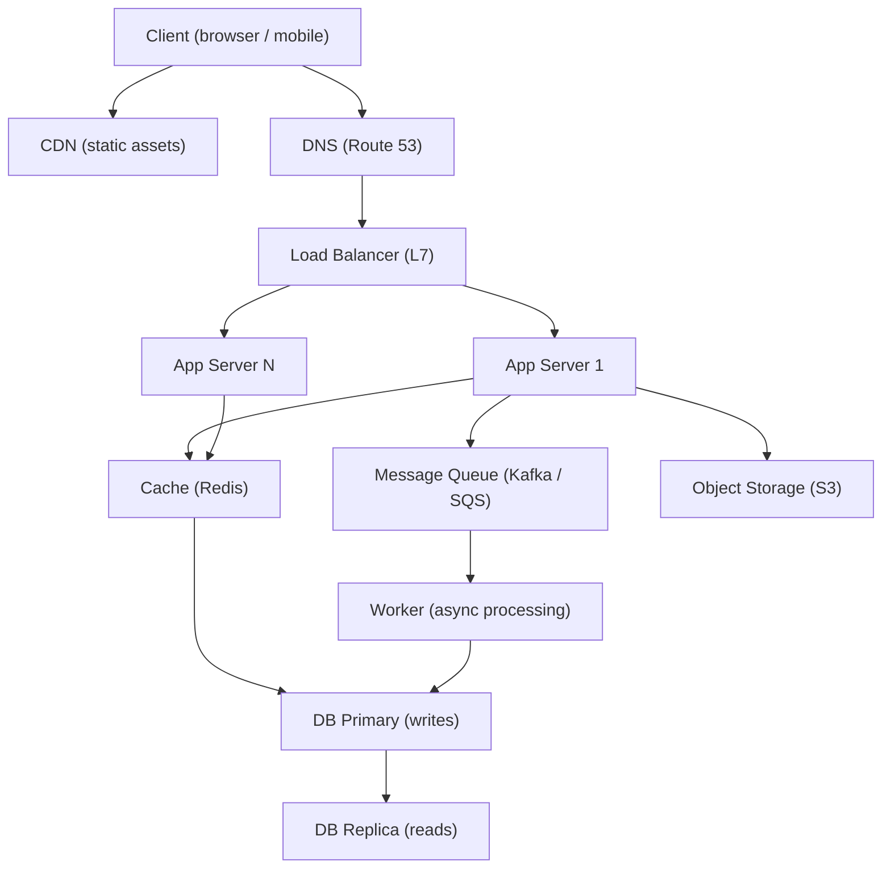

# System Design — A 2-Day Crash Course

> Build systems that survive the real world — then explain them clearly in the room.

---

## Part 0 — Why This Matters

Systems fail not because engineers are careless, but because they are designed without asking three questions: what happens when traffic doubles, what happens when a component dies, and who is responsible for knowing when either of those things occurs?

The 3am page is not random. It is almost always the result of a decision made months earlier — a single database node, no circuit breaker, a cache that was added as an afterthought, a deploy that went straight to production with no rollback plan. System design is the discipline of making those decisions deliberately, before production makes them for you.

This crash course serves two purposes. First, it gives you the mental model to design systems that actually hold up under load and failure. Second, it prepares you for the system design interview — where you are expected to translate that same thinking into a 45-minute structured conversation with a whiteboard.

Both require the same foundation.



---

## Vocabulary

Before anything else, align on the terms. Interviews fail when candidates use words loosely.

**Scalability** — the ability of a system to handle increased load. Vertical scaling means adding more resources to a single machine (bigger box). Horizontal scaling means adding more machines (more boxes). Horizontal is almost always the right long-term direction.

**Availability** — the percentage of time a system is operational. Expressed as nines: 99.9% means ~8.7 hours of downtime per year. 99.99% means ~52 minutes. Five nines (99.999%) is the bar for critical infrastructure.

**Consistency** — every read returns the most recent write. Strong consistency is expensive across distributed nodes. Eventual consistency means reads may lag behind writes by some bounded time.

**Partition Tolerance** — the system continues to operate despite network partitions (nodes unable to communicate). The CAP theorem states you can guarantee at most two of Consistency, Availability, and Partition Tolerance. In practice, partitions happen, so you are always choosing between C and A.

**Latency** — the time to complete a single operation. Usually measured in milliseconds at p50, p95, p99. p99 is the number that will bite you — it represents the worst 1% of your users' experience.

**Throughput** — the number of operations per unit of time. Requests per second (RPS) or queries per second (QPS). Latency and throughput are related but distinct: a system can have low latency at low throughput and still fall apart under load.

**Load Balancer** — distributes incoming traffic across multiple backend servers. Operates at Layer 4 (TCP) or Layer 7 (HTTP). Enables horizontal scaling and hides individual server failures from clients.

**CDN (Content Delivery Network)** — a geographically distributed network of proxy servers that cache static content close to users. Reduces latency for reads, offloads traffic from origin servers.

**Cache** — a faster, smaller data store that sits in front of a slower, larger one. Can live in-process (application memory), out-of-process (Redis, Memcached), or at the edge (CDN). Effective caching is the single highest-leverage performance optimization.

**Message Queue** — decouples producers from consumers. Producers write messages; consumers process them independently and asynchronously. Kafka, RabbitMQ, SQS. Enables buffering, retry, fan-out, and async processing.

**Database — SQL** — relational, schema-enforced, ACID-compliant. Excellent for structured data with complex relationships. PostgreSQL is the default choice for most workloads.

**Database — NoSQL** — document (MongoDB), key-value (DynamoDB, Redis), wide-column (Cassandra), graph (Neo4j). Trades some consistency or querying flexibility for horizontal scale or specific access patterns.

**Sharding** — partitioning data across multiple database nodes by a shard key. Enables horizontal scale for writes. Introduces complexity: cross-shard queries, rebalancing, hotspots.

**Replication** — copying data from a primary node to one or more replicas. Enables read scale-out and high availability. Leader-follower (one writer, many readers) is the most common topology.

---

## DAY 1 — Building Blocks

### The Core Pipeline

Every system, at its simplest, is a pipeline:

```
Client → DNS → Load Balancer → App Server → Cache → Database
                                           → Queue → Worker → Database
```

Understanding this pipeline deeply — and knowing where to add layers — is the foundation of system design.

**DNS** resolves your domain to an IP. At scale, DNS itself becomes a layer: GeoDNS routes users to the nearest data center. TTLs determine how quickly changes propagate.

**Load Balancer** is where horizontal scale becomes real. Algorithms: round-robin (simple, works for stateless services), least-connections (better for variable request times), IP hash (sticky sessions, use sparingly). The load balancer must not be a single point of failure — use active-active pairs or a managed service.

**App Server** should be stateless. If state lives in the application tier, you cannot freely route requests to any server. Push session state to Redis. Push file uploads to object storage. Stateless servers are replaceable; stateful servers are liabilities.

**Cache** sits between your app and your database. Rule of thumb: if a value is read more than it is written, it belongs in cache. More on cache strategies below.

**Database** is the hardest component to scale horizontally. Design your access patterns early. Indexes matter. Query plans matter. Migrations on large tables are dangerous.

**Queue** decouples time-sensitive request handling from slow background work. If a user action triggers an email, a thumbnail resize, and an audit log write — put all three on a queue. The HTTP response returns immediately. Workers process asynchronously.

---

### Scaling Patterns

**Stateless horizontal scaling** — add more app servers behind a load balancer. This is the first move for most traffic growth problems.

**Read replicas** — add read replicas to your database to offload read traffic from the primary. Works well when your read-to-write ratio is high (most transactional systems).

**Caching layer** — add Redis or Memcached. Hit rates above 90% dramatically reduce database load.

**Async processing** — move slow operations to background queues. Keeps p99 latency low for user-facing requests.

**Database sharding** — the last resort for write-heavy workloads that exceed the capacity of a single primary. Adds significant operational complexity. Exhaust all other options first.

**Microservices decomposition** — split a monolith by domain when independent scaling or deployment velocity justifies the cost. Not a default; a deliberate choice. See `Microservices-Patterns.md`.

---

### Caching Strategies

**Write-through** — on every write, update the cache and the database simultaneously. Cache is always consistent with the database. Write latency is higher because both must succeed. Good for read-heavy workloads where stale data is unacceptable.

**Write-back (write-behind)** — write to the cache first, persist to the database asynchronously. Write latency is very low. Risk: if the cache crashes before the async write completes, data is lost. Good for high-write workloads that can tolerate small data loss windows.

**Write-around** — bypass the cache on write; write directly to the database. Cache is populated lazily on read (cache-aside pattern). Good for data that is written once and rarely read, where caching would just pollute the cache.

**Cache-aside (lazy loading)** — the application checks the cache first. On a miss, it reads from the database and populates the cache. Simple, resilient, but first read after a miss is always slow. Watch for the thundering herd: many concurrent misses on the same key after an invalidation event.

**Cache eviction policies** — LRU (Least Recently Used) is the standard. LFU (Least Frequently Used) works better for access patterns with temporal locality. Set TTLs aggressively to prevent stale data from persisting indefinitely.

---

### Database Choices

The default is PostgreSQL. Use it unless you have a specific reason not to.

| Pattern | Database | Why |
|---|---|---|
| Relational data, ACID needed | PostgreSQL | Full SQL, extensions, battle-tested |
| High read throughput, key lookups | DynamoDB, Cassandra | Horizontal scale, low-latency reads |
| Flexible schema, rapid iteration | MongoDB | Document model, good for prototyping |
| Caching, sessions, leaderboards | Redis | In-memory, data structures, pub/sub |
| Time-series metrics | InfluxDB, TimescaleDB | Optimized for append-heavy, time-indexed data |
| Full-text search | Elasticsearch | Inverted index, relevance ranking |

Do not choose NoSQL because it sounds modern. Choose it because your access pattern does not fit a relational model, or because you genuinely need horizontal write scale.

---

### CDN

A CDN is not just for images. Use it for:

- Static assets (JS, CSS, images)
- HTML pages for mostly-static content
- API responses that are safe to cache (GET requests with appropriate Cache-Control headers)
- Video and large binary files

A CDN with a 95% cache hit rate means 95% of your traffic never reaches your origin servers. That is the highest-leverage infrastructure decision you can make for a read-heavy product.

---

### Back-of-Envelope Estimation

Interviewers expect this. Engineers need this before capacity planning decisions.

**Memory of useful numbers:**

- 1 million requests/day ≈ 12 requests/second
- 1 billion requests/day ≈ 12,000 requests/second
- Average web request: ~50KB payload
- 1GB of RAM holds roughly 10 million 100-byte records
- SSD random read: ~100 microseconds; network round trip: ~1ms; disk seek: ~10ms
- PostgreSQL: 1,000–10,000 QPS per instance (depends heavily on query complexity)
- Redis: 100,000+ ops/sec per instance

**Estimation formula for storage:**

```
Daily storage  = daily_events × avg_event_size_bytes
Annual storage = daily_storage × 365 × replication_factor
```

Practice this. Interviewers notice when candidates skip it.

---

## DAY 2 — Reliability, Observability, Operations

### Replication and Failover

**Leader-follower replication** — one primary accepts writes; replicas sync asynchronously. If the primary fails, a replica is promoted. There is a replication lag window; any writes not yet synced to the promoted replica are lost. This is the trade-off.

**Synchronous replication** — every write is acknowledged only after it lands on at least one replica. Zero data loss, but write latency increases. Use for financial transactions and audit logs.

**Multi-primary replication** — multiple nodes accept writes; conflicts must be resolved. Complex and rarely worth it. CockroachDB and Spanner handle this for you if you need it.

**Failover** — automated detection of a failed primary and promotion of a replica. Tools: Patroni for PostgreSQL, AWS RDS Multi-AZ, Kubernetes StatefulSet. Test your failover procedure quarterly. An untested failover is not a failover plan — it is a hope.

---

### Circuit Breakers

A circuit breaker sits between a caller and a dependency. When error rate from the dependency crosses a threshold, the circuit opens: calls fail immediately without attempting the dependency. After a timeout window, the circuit moves to half-open and allows a probe request through. If it succeeds, the circuit closes.

Without a circuit breaker, a slow downstream service will exhaust your thread pool or connection pool, bringing your entire service down. This is how cascading failures happen.

Implement with Resilience4j (Java), `pybreaker` (Python), or at the infrastructure layer with a service mesh (Istio, Linkerd).

---

### Consistency Models

**Strong consistency** — every read sees the most recent write. Requires coordination between replicas. Incurs latency cost. Use for: account balances, inventory counts, anything where stale reads cause harm.

**Eventual consistency** — replicas will converge to the same value, but there is a lag window. Reads may return stale data. Use for: social feed rankings, profile views, comment counts — anything where a slightly stale read is acceptable.

**Read-your-own-writes consistency** — a specific guarantee: after you write, your subsequent reads will see that write. Often implemented by routing your reads to the primary for a short window after a write. Critical for user-facing edit flows.

**Causal consistency** — if event A caused event B, any observer who sees B also sees A. Harder to implement, but often what you actually need when you say "strong consistency."

The choice is not strong vs. eventual in the abstract. It is: for this specific data, what is the cost of a stale read?

---

### Monitoring and Alerting Design

The four golden signals (from Google's SRE book):

1. **Latency** — how long requests take, at p50, p95, p99
2. **Traffic** — how many requests per second
3. **Errors** — error rate as a percentage of traffic
4. **Saturation** — how close to capacity: CPU, memory, connection pool, queue depth

Alert on symptoms, not causes. "p99 latency is above 500ms" is a symptom — it means users are suffering. "CPU is above 80%" is a cause — it may or may not be causing user-facing impact. Alert on symptoms first.

**SLOs (Service Level Objectives)** — define the threshold. "99.9% of requests complete in under 200ms." **Error budgets** are the inverse: you are allowed 0.1% of requests to violate the SLO. When the budget is consumed, stop shipping features and focus on reliability.

Use Prometheus for metrics, Grafana for dashboards. See `Grafana.md` and `Prometheus.md`.

For log aggregation and querying, Loki is the natural companion. See `Loki.md`.

---

### Capacity Planning

Do not wait for a page to do capacity planning. See `Capacity-Planning.md` for the full process.

The short version:

1. Measure current utilization at peak: CPU, memory, disk I/O, network, connection counts.
2. Project forward based on growth rate. If you are growing 10% per month, you hit 2x traffic in ~7 months.
3. Identify which resource you will exhaust first — that is your bottleneck.
4. Plan the mitigation before you hit 70% utilization, not after.

For databases specifically: measure query execution time trends, index hit rates, lock wait times. These degrade long before you hit raw CPU or disk limits.

---

### Deployment Strategies

**Blue-green deployment** — run two identical environments. Blue is live; green is the new version. When green passes validation, flip traffic. Rollback is instant: flip back. Cost: double infrastructure during the cutover window.

**Canary deployment** — route a small percentage of traffic (1%, 5%) to the new version. Monitor error rate and latency. Gradually increase if healthy. Roll back if metrics degrade. Lower blast radius than a full deploy. See `Kubernetes.md` for canary rollout implementation.

**Feature flags** — decouple deploy from release. Ship code to production in a dormant state. Enable it for internal users, then a percentage of users, then all. Allows instant rollback without a redeploy.

⚠️ Dark launches matter. Traffic patterns in production are not replicable in staging. Feature flags plus shadow traffic let you validate new code paths against real load before enabling them.

---

### Trade-off Analysis Framework

Every system design decision is a trade-off. In interviews and in production, the skill is naming the trade-off explicitly.

Use this structure:

```
Option A gives you X but costs you Y.
Option B gives you Y but costs you X.
Given our constraints (read-heavy / latency-sensitive / strong consistency required),
we choose Option A and accept the cost of Y.
```

Common trade-off axes:

- Consistency vs. availability (CAP)
- Latency vs. throughput
- Read performance vs. write performance
- Operational simplicity vs. horizontal scalability
- Strong guarantees vs. cost

Never say "it depends" in an interview without completing the sentence: "it depends on whether we prioritize X or Y, and given the requirements, we should prioritize X."

---

## Worked Example — Design a URL Shortener

### Interview Framing

**Step 1: Requirements (spend 5 minutes here)**

Functional:
- Given a long URL, produce a short URL (e.g., `short.ly/abc123`)
- Given a short URL, redirect to the original long URL
- Optional: custom aliases, expiry, analytics

Non-functional:
- 100 million URLs created per day (write-heavy at scale)
- 10 billion redirects per day (read-to-write ratio ≈ 100:1)
- Redirects must complete in < 10ms
- High availability (99.99%+)
- No data loss

**Step 2: Estimation**

```
Writes: 100M / day  ≈  1,200 writes/sec
Reads:  10B  / day  ≈ 115,000 reads/sec
Storage per URL: ~500 bytes (long URL + short code + metadata)
Daily storage:   100M × 500B = 50GB/day
5-year storage:  50GB × 365 × 5 ≈ 90TB
```

**Step 3: Component Design**

Short code generation: hash the long URL (MD5 or SHA-256), take the first 7 characters. Risk: collision. Alternative: auto-increment ID encoded in Base62. Base62 with 7 characters gives 3.5 trillion unique codes.

⚠️ If you use a single auto-increment sequence across distributed app servers, you have a coordination bottleneck. Use a ticket server or pre-allocated ID ranges per app server.

Components:
- Load balancer (Layer 7, Route 53 or Nginx)
- App servers (stateless, horizontally scaled)
- Redis (cache short-code → long URL mappings, TTL 24h)
- PostgreSQL (source of truth: id, short_code, long_url, created_at, expiry, user_id)
- CDN (cache redirect responses at edge for popular short codes)

**Step 4: Read Path**

```
Client → CDN → (cache hit: 302 redirect)
             → (cache miss) → Load Balancer → App Server
                                            → Redis (cache hit: 302 redirect)
                                            → (cache miss) → PostgreSQL → Redis (populate) → 302
```

Cache hit rate for redirects will be high — popular URLs are hit repeatedly. Target 95%+ Redis hit rate.

**Step 5: Write Path**

```
Client → Load Balancer → App Server → PostgreSQL (write short_code + long_url)
                                    → Redis (optionally pre-warm cache)
```

Writes are 1% of traffic. No special optimization needed at baseline.

**Step 6: Deep Dives (offer these proactively in the interview)**

- **Analytics** — use a Kafka topic. App server publishes a `click` event per redirect. Consumers aggregate by short code, by day. Do not write analytics synchronously on the read path — that doubles your write load. See `Kafka.md`.
- **Expiry** — add an `expires_at` column. Background job runs hourly, deletes expired records, invalidates cache entries.
- **Custom aliases** — check against existing short codes. Rate-limit custom alias creation to prevent abuse.
- **Abuse prevention** — URL blocklist, rate limiting per user/IP at the load balancer layer. See `Nginx.md`.

### Ops Perspective — How to Keep It Running

- Deploy app servers with a canary. The redirect logic is simple but any regression causes visible 404s.
- Redis is your availability bottleneck for the read path. Use Redis Sentinel or Redis Cluster. See `Redis.md`.
- PostgreSQL: single primary with two synchronous replicas. Short URL data is effectively user data — you do not want to lose it.
- Alert on: redirect error rate > 0.01%, Redis hit rate < 90%, p99 redirect latency > 50ms.
- Capacity: at 115K redirects/sec, Redis handles this comfortably on a single instance (500K+ ops/sec). PostgreSQL only sees the ~5K cache misses/sec — well within its range.

---

## Common Pitfalls

**No single point of failure analysis.** Draw your architecture. Circle every component. Ask: what happens if this one dies? If the answer is "the whole system goes down," that is a SPOF to eliminate.

**Premature sharding.** Engineers reach for sharding too early. It is operationally expensive and hard to undo. Exhaust read replicas, caching, vertical scaling, and query optimization first.

**Ignoring the thundering herd.** When a cache entry expires, many concurrent requests may miss and hit the database simultaneously. Use probabilistic early expiration or a mutex-style lock to prevent this.

**Stateful app servers.** If your app server stores session data in local memory, you cannot route requests freely. You will need sticky sessions, which defeats the purpose of load balancing. Store sessions in Redis.

**Forgetting the database connection pool.** At high concurrency, connections to PostgreSQL are the bottleneck before CPU or disk. Use PgBouncer as a connection pooler. See `PostgreSQL.md`.

**Designing in a vacuum.** System design is a conversation. In an interview, say your assumptions out loud. In production, write them down in your architecture decision records.

**Alerting on causes, not symptoms.** If you only alert on CPU and memory, you will miss user-facing degradation that does not manifest as resource exhaustion.

---

## Quick Reference

### Estimation Cheatsheet

| Metric | Value |
|---|---|
| Seconds in a day | 86,400 ≈ 100K |
| 1M req/day | ~12 req/sec |
| 1B req/day | ~12K req/sec |
| Redis throughput | ~100K–500K ops/sec |
| PostgreSQL throughput | ~1K–10K QPS |
| SSD latency | ~100 microseconds |
| Network round trip (same DC) | ~1ms |
| Network round trip (cross-region) | ~100ms |
| p99 target (interactive requests) | < 200ms |

### Component Selection Matrix

| Need | Tool | Notes |
|---|---|---|
| HTTP load balancing | Nginx, HAProxy, ALB | Layer 7, SSL termination |
| Caching | Redis | Data structures, pub/sub, persistence options |
| Relational store | PostgreSQL | Default choice; strong ecosystem |
| Event streaming | Kafka | High-throughput, durable, replay |
| Message queue (simple) | SQS, RabbitMQ | Lower ops overhead than Kafka |
| Search | Elasticsearch | Full-text, faceted search |
| Object storage | S3 | Binary files, backups, static assets |
| Container orchestration | Kubernetes | See `Kubernetes.md` |
| Secrets management | Vault, AWS Secrets Manager | Never hardcode credentials |

---

## Top 10 Interview Questions

<details>
<summary><strong>Q: How do you approach a system design interview? What is the structure?</strong></summary>

Spend the first 5 minutes clarifying functional and non-functional requirements — do not start drawing until you know what you are building. Then do a back-of-envelope estimation (requests/sec, storage, bandwidth). Next, design the high-level architecture: draw the core pipeline (client, DNS, load balancer, app, cache, database, queue). Finally, deep-dive into 1-2 components the interviewer cares about. Throughout, state trade-offs explicitly. The structure is: requirements, estimation, high-level design, deep dives.

</details>

<details>
<summary><strong>Q: Explain the CAP theorem and how it applies to real system decisions.</strong></summary>

The CAP theorem states that a distributed system can guarantee at most two of Consistency, Availability, and Partition Tolerance. Since network partitions are unavoidable in distributed systems, you are always choosing between consistency and availability during a partition. In practice: a banking ledger chooses consistency (reject writes during a partition rather than risk inconsistency), while a social media feed chooses availability (show potentially stale data rather than return errors).

</details>

<details>
<summary><strong>Q: What are the main caching strategies and when do you use each?</strong></summary>

Cache-aside (lazy loading): app checks cache, on miss reads from DB and populates cache. Simple and resilient but first read is always slow. Write-through: write to cache and DB simultaneously; cache is always fresh but write latency is higher. Write-back: write to cache first, async persist to DB; lowest write latency but risks data loss if cache crashes. Choose based on your read/write ratio and tolerance for stale data.

</details>

<details>
<summary><strong>Q: How do you estimate capacity for a system that handles 1 billion requests per day?</strong></summary>

1 billion requests per day is roughly 12,000 requests per second (divide by 86,400). Peak traffic is typically 2-3x average, so plan for ~30,000 RPS. If each request is 50KB, bandwidth is ~1.5 GB/sec at peak. For storage: multiply daily events by average event size by retention days by replication factor. These numbers tell you whether a single database can handle the load or whether you need sharding, caching layers, and CDN offloading.

</details>

<details>
<summary><strong>Q: When would you use a message queue, and what problems does it solve?</strong></summary>

Use a message queue when you need to decouple producers from consumers, buffer spikes in traffic, enable retry logic, or process work asynchronously. If a user action triggers an email, a thumbnail resize, and an audit log write, doing all three synchronously in the request path increases latency and couples unrelated systems. Put them on a queue — the HTTP response returns immediately, workers process independently, and if a consumer fails, the message is retried.

</details>

<details>
<summary><strong>Q: How do you handle a database that is becoming the bottleneck?</strong></summary>

Escalate through these options in order: add indexes and optimise queries first (free). Add a caching layer (Redis) to absorb read traffic. Add read replicas to scale reads horizontally. Vertically scale the primary (bigger machine). Partition the data by feature (separate databases per service). Shard the database as a last resort — it introduces cross-shard query complexity, rebalancing challenges, and operational burden. Exhaust every simpler option before sharding.

</details>

<details>
<summary><strong>Q: What is the thundering herd problem and how do you prevent it?</strong></summary>

When a popular cache entry expires, many concurrent requests simultaneously miss the cache and hit the database, potentially overwhelming it. Prevention strategies: use a mutex lock so only one request fetches from the database while others wait for the cache to be repopulated. Use probabilistic early expiration where each request has a small chance of refreshing the cache before TTL expires. Stagger TTLs with jitter to avoid many keys expiring at the same instant.

</details>

<details>
<summary><strong>Q: What is the difference between horizontal and vertical scaling, and when do you use each?</strong></summary>

Vertical scaling means adding more resources (CPU, RAM) to a single machine — simpler, no code changes, but has a ceiling. Horizontal scaling means adding more machines behind a load balancer — no ceiling, but requires stateless application design and adds complexity (load balancing, session management, data consistency). For app servers, horizontal scaling is almost always the right long-term choice. For databases, exhaust vertical scaling and read replicas before pursuing horizontal sharding.

</details>

<details>
<summary><strong>Q: How do you design a system for high availability (99.99% uptime)?</strong></summary>

Eliminate every single point of failure. Deploy across multiple availability zones. Use active-active or active-passive load balancers. Deploy stateless app servers behind auto-scaling groups. Use database replication with automated failover (tested quarterly). Implement circuit breakers to prevent cascading failures. Use health checks at every layer. Define SLOs with error budgets and alert on symptoms (latency, error rate) not causes (CPU). 99.99% means at most 52 minutes of downtime per year — every component and every failover path must be tested, not just designed.

</details>

<details>
<summary><strong>Q: How do you choose between SQL and NoSQL databases?</strong></summary>

Default to PostgreSQL (SQL) unless you have a specific reason not to. SQL gives you ACID transactions, flexible querying with JOINs, a mature ecosystem, and strong consistency. Choose NoSQL when your access pattern is simple key-value lookups at massive scale (DynamoDB), when you need horizontal write scalability beyond what a single primary can handle (Cassandra), when your schema is genuinely flexible and document-oriented (MongoDB), or when you need specialised functionality like time-series or graph queries.

</details>

---

## Next Steps

Once you have internalized this crash course:

- `HLD.md` — High-Level Design: translating requirements into component diagrams
- `LLD.md` — Low-Level Design: API contracts, data models, class diagrams
- `Microservices-Patterns.md` — when and how to decompose, plus service mesh, API gateway, saga pattern
- `Capacity-Planning.md` — full capacity planning workflow, traffic forecasting, SLO budgeting

---

## The Mantra

Design for failure. Scale for the next order of magnitude, not the current one. Alert on symptoms. Measure before you optimize. Make trade-offs explicit — never implicit.

The system that pages you at 3am was designed by someone who did not ask "what happens when this fails?"

Be the person who asked.

---

*Cross-references: `Kubernetes.md`, `Redis.md`, `Kafka.md`, `PostgreSQL.md`, `Nginx.md`, `Capacity-Planning.md`, `Reliability-Patterns.md`, `Grafana.md`, `Prometheus.md`, `Loki.md`*
