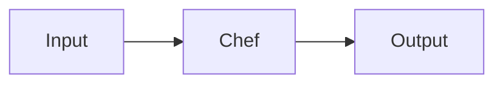

# Chef — A 2-Day Crash Course

Chef is a configuration management tool that uses Ruby-based recipes and cookbooks to define infrastructure as code — your servers converge to the desired state on every run.

**Prerequisite:** `Linux.md`

---

## Part 0 — Why Chef

Chef was one of the original configuration management tools, appearing in 2009 alongside Puppet. Even if you never write a Chef cookbook from scratch, you will encounter it in legacy environments and in shops that have been running it for a decade. Beyond the operational reality, Chef's mental model — the convergence loop, idempotent resources, the client-server architecture — influenced every tool that came after it. Understanding Chef sharpens the way you think about Ansible, Puppet, and Salt.

The core idea is simple: you describe *what* you want, not *how* to get there. Chef's resource model handles the "how." Run `chef-client` on a node and it reads its run list, pulls the latest cookbooks, compiles a resource collection, and applies only the changes needed to close the gap between current state and desired state. That gap-closing process is convergence.

---

## Vocabulary

| Term | What it is |
|---|---|
| **Recipe** | A Ruby file that declares resources. The unit of configuration logic. |
| **Cookbook** | A directory containing recipes, templates, files, attributes, and metadata. The unit of distribution. |
| **Resource** | A declaration of a desired state for a system component — package installed, service running, file containing certain content. |
| **Node** | Any machine managed by Chef. It has attributes describing its current state. |
| **Chef Server** | The central hub: stores cookbooks, node data, roles, environments, and data bags. Nodes pull from it. |
| **Chef Workstation** | Your laptop or CI box — where you develop cookbooks and run `knife` commands. |
| **Knife** | The CLI for interacting with Chef Server: upload cookbooks, manage nodes, bootstrap machines. |
| **Ohai** | A tool that runs on each node before `chef-client` and collects system attributes (OS, IP, memory, CPU). Those attributes are available inside your recipes. |
| **Run List** | The ordered list of recipes and roles applied to a node. |
| **Role** | A named grouping of a run list and attributes applied to a category of nodes (e.g., `webserver`, `database`). |
| **Environment** | A grouping (`production`, `staging`, `dev`) that can pin cookbook versions and override attributes. |
| **Data Bag** | A global JSON store on Chef Server for shared data — credentials, user lists, config values. Can be encrypted. |
| **Berkshelf** | A dependency manager for cookbooks — similar to Bundler for Ruby. Defined via `Berksfile`. |

---




## Day 1

### Install Chef Workstation

Chef Workstation bundles everything you need: `knife`, `chef-client`, `berks`, `cookstyle`, Test Kitchen, and InSpec.

```bash
# macOS
brew install --cask chef-workstation

# Ubuntu / Debian
curl -fsSL https://omnitruck.chef.io/install.sh | sudo bash -s -- -P chef-workstation

# Verify
chef --version
knife --version
```

After install, initialize your workstation:

```bash
chef generate repo ~/chef-repo
cd ~/chef-repo
```

The repo layout:

```
chef-repo/
  cookbooks/          # your cookbooks live here
  roles/              # JSON/Ruby role definitions
  environments/       # JSON/Ruby environment definitions
  data_bags/          # JSON data bags
  .chef/
    config.rb         # knife configuration
    credentials       # Chef Server API key path
```

### Your First Recipe

Run in local mode (no Chef Server required) using `chef-client --local-mode` or the shorter alias `chef-apply`.

```bash
# One-shot recipe file: hello.rb
cat > /tmp/hello.rb <<'EOF'
file '/tmp/hello.txt' do
  content 'Hello from Chef'
  mode    '0644'
  owner   'root'
  group   'root'
  action  :create
end
EOF

sudo chef-apply /tmp/hello.rb
```

Run it twice. The second run does nothing — that is idempotency in action.

### Core Resources

**package** — install or remove a system package:

```ruby
package 'nginx' do
  action :install
end

package 'telnet' do
  action :purge
end
```

**service** — manage a service:

```ruby
service 'nginx' do
  action [:enable, :start]
end
```

**file** — manage a plain file:

```ruby
file '/etc/motd' do
  content "Managed by Chef\n"
  mode    '0644'
  owner   'root'
  group   'root'
end
```

**template** — render an ERB template to a file (covered in depth on Day 2):

```ruby
template '/etc/nginx/nginx.conf' do
  source    'nginx.conf.erb'
  mode      '0644'
  owner     'root'
  group     'root'
  variables worker_processes: node['cpu']['total']
  notifies  :reload, 'service[nginx]', :delayed
end
```

**directory** — ensure a directory exists:

```ruby
directory '/var/app/releases' do
  owner     'deploy'
  group     'deploy'
  mode      '0755'
  recursive true
end
```

**execute** — run an arbitrary command (use sparingly; prefer a purpose-built resource when one exists):

```ruby
execute 'bundle install' do
  command 'bundle install --deployment'
  cwd     '/var/app/current'
  user    'deploy'
  not_if  { ::File.exist?('/var/app/current/vendor/bundle') }
end
```

### Chef-Client Local Mode

Local mode reads cookbooks and data from your local filesystem instead of a Chef Server. Use it for development and testing.

```bash
# Apply a cookbook's default recipe in local mode
sudo chef-client --local-mode --runlist 'recipe[myapp]' --cookbook-path ./cookbooks
```

Alternatively, create a minimal `client.rb`:

```ruby
# client.rb
local_mode  true
cookbook_path ['./cookbooks']
```

Then:

```bash
sudo chef-client -c client.rb -o 'recipe[myapp]'
```

### Knife Commands

```bash
# Bootstrap a node — installs chef-client and runs the initial converge
knife bootstrap 10.0.0.5 --ssh-user ubuntu --sudo --node-name web-01 \
  --run-list 'role[webserver]'

# List nodes registered with Chef Server
knife node list

# Show a node's attributes and run list
knife node show web-01

# Set or update a node's run list
knife node run_list set web-01 'role[webserver],recipe[myapp::deploy]'

# Upload a cookbook to Chef Server
knife cookbook upload myapp

# List cookbooks on Chef Server
knife cookbook list

# Search nodes — uses Solr syntax
knife search node 'role:webserver AND chef_environment:production'

# Delete a node and its client key
knife node delete web-01 -y
knife client delete web-01 -y
```

---

## Day 2

### Cookbook Structure

Generate a cookbook with the built-in generator:

```bash
chef generate cookbook cookbooks/myapp
```

The directory layout:

```
myapp/
  metadata.rb           # name, version, dependencies
  Berksfile             # external cookbook dependencies
  attributes/
    default.rb          # default attribute values
  recipes/
    default.rb          # default recipe (applied when you say recipe[myapp])
    deploy.rb           # additional recipe
  templates/
    default/
      nginx.conf.erb    # ERB templates
  files/
    default/
      app.conf          # static files, copied verbatim
  resources/            # custom resources (LWRP / HWRPs)
  test/
    integration/
      default/
        default_test.rb # InSpec tests
  spec/
    unit/               # ChefSpec unit tests
```

**metadata.rb:**

```ruby
name             'myapp'
maintainer       'Your Name'
maintainer_email 'you@example.com'
license          'Apache-2.0'
description      'Installs and configures myapp'
version          '1.0.0'
chef_version     '>= 16.0'

depends 'nginx', '~> 11.0'
depends 'mysql', '~> 8.0'
```

**attributes/default.rb:**

```ruby
default['myapp']['version']        = '2.3.1'
default['myapp']['port']           = 8080
default['myapp']['deploy_user']    = 'deploy'
default['myapp']['document_root']  = '/var/www/myapp'
```

Attributes have a priority hierarchy: `default < normal < override < automatic`. Automatic attributes come from Ohai and cannot be overridden by recipes.

### ERB Templates

Templates live in `templates/default/`. ERB uses `<%= %>` for output and `<% %>` for control flow.

`templates/default/vhost.conf.erb`:

```erb
<VirtualHost *:<%= @port %>>
  ServerName  <%= node['fqdn'] %>
  DocumentRoot <%= @document_root %>

  <Directory "<%= @document_root %>">
    AllowOverride All
    Require all granted
  </Directory>

  ErrorLog  /var/log/apache2/<%= @app_name %>-error.log
  CustomLog /var/log/apache2/<%= @app_name %>-access.log combined
</VirtualHost>
```

Using the template in a recipe:

```ruby
template '/etc/apache2/sites-available/myapp.conf' do
  source    'vhost.conf.erb'
  variables(
    port:          node['myapp']['port'],
    document_root: node['myapp']['document_root'],
    app_name:      'myapp'
  )
  notifies :restart, 'service[apache2]', :delayed
end
```

### Roles

Define a role in `roles/webserver.rb`:

```ruby
name 'webserver'
description 'Front-end web server'

run_list(
  'recipe[base]',
  'recipe[nginx]',
  'recipe[myapp]'
)

default_attributes(
  'nginx' => {
    'worker_processes' => 4
  }
)
```

Upload and assign:

```bash
knife role from file roles/webserver.rb
knife node run_list set web-01 'role[webserver]'
```

### Environments

Define an environment in `environments/production.rb`:

```ruby
name 'production'
description 'Production environment'

cookbook_versions(
  'nginx' => '~> 11.0',
  'myapp' => '= 1.2.0'
)

override_attributes(
  'myapp' => {
    'port' => 80
  }
)
```

```bash
knife environment from file environments/production.rb
knife node environment_set web-01 production
```

Environments let you pin cookbook versions per fleet — staging can run `myapp 1.3.0-rc1` while production stays on `1.2.0`.

### Data Bags

Data bags store global JSON on Chef Server.

```bash
# Create a data bag container
knife data bag create users

# Create an item
cat > /tmp/alice.json <<'EOF'
{
  "id": "alice",
  "uid": 2001,
  "shell": "/bin/bash",
  "groups": ["deploy", "sudo"]
}
EOF
knife data bag from file users /tmp/alice.json

# Read it in a recipe
alice = data_bag_item('users', 'alice')
user alice['id'] do
  uid   alice['uid']
  shell alice['shell']
end
```

For secrets, use encrypted data bags:

```bash
# Generate a shared secret
openssl rand -base64 512 > /etc/chef/encrypted_data_bag_secret

# Create encrypted item
knife data bag create secrets
knife data bag from file secrets db_creds.json \
  --secret-file /etc/chef/encrypted_data_bag_secret
```

In a recipe, decrypt with:

```ruby
secret = Chef::EncryptedDataBagItem.load_secret('/etc/chef/encrypted_data_bag_secret')
creds  = Chef::EncryptedDataBagItem.load('secrets', 'db_creds', secret)

template '/etc/myapp/database.yml' do
  variables db_password: creds['password']
end
```

⚠️ The shared secret must be distributed out-of-band to every node. Consider using Chef Vault or a dedicated secrets manager (HashiCorp Vault) instead of encrypted data bags for new projects.

### Chef Server Architecture

```
Workstation  --knife upload-->  Chef Server  <--pull--  Node (chef-client)
                                     |
                              Cookbook store
                              Node index (Solr)
                              Roles / Environments
                              Data Bags
```

The node runs `chef-client` on a schedule (typically via cron or systemd timer, every 30 minutes). It authenticates with an RSA key pair, pulls its run list and cookbooks, then converges. The Chef Server never pushes — nodes pull.

### Testing with Test Kitchen and InSpec

Test Kitchen orchestrates the full test cycle: create a VM (or container), converge it with your cookbook, run InSpec assertions, then destroy it.

`.kitchen.yml` in your cookbook root:

```yaml
driver:
  name: vagrant

provisioner:
  name: chef_zero

verifier:
  name: inspec

platforms:
  - name: ubuntu-22.04
  - name: centos-stream-9

suites:
  - name: default
    run_list:
      - recipe[myapp::default]
    attributes:
      myapp:
        port: 8080
```

Run the test cycle:

```bash
kitchen create    # spin up VM
kitchen converge  # run chef-client
kitchen verify    # run InSpec tests
kitchen destroy   # tear down VM

kitchen test      # all four steps in sequence
```

InSpec test (`test/integration/default/default_test.rb`):

```ruby
describe package('nginx') do
  it { should be_installed }
end

describe service('nginx') do
  it { should be_enabled }
  it { should be_running }
end

describe port(80) do
  it { should be_listening }
end

describe file('/etc/nginx/nginx.conf') do
  it { should be_file }
  its('content') { should match(/worker_processes/) }
end
```

For unit tests, use ChefSpec:

```ruby
# spec/unit/recipes/default_spec.rb
require 'chefspec'

describe 'myapp::default' do
  let(:chef_run) { ChefSpec::SoloRunner.new.converge(described_recipe) }

  it 'installs nginx' do
    expect(chef_run).to install_package('nginx')
  end

  it 'enables and starts nginx service' do
    expect(chef_run).to enable_service('nginx')
    expect(chef_run).to start_service('nginx')
  end
end
```

### Chef vs Ansible vs Puppet vs Salt

| Dimension | Chef | Ansible | Puppet | Salt |
|---|---|---|---|---|
| Language | Ruby DSL | YAML + Jinja2 | Puppet DSL | YAML + Jinja2 |
| Agent | Required (`chef-client`) | Agentless (SSH) | Required (`puppet agent`) | Agent optional |
| Architecture | Pull (client pulls from server) | Push (control node pushes) | Pull (agent pulls from master) | Push or pull |
| Learning curve | High — requires Ruby comfort | Low — YAML-first | Medium — Puppet DSL | Medium |
| Convergence model | Explicit resource model | Task execution model | Declarative catalog | State files |
| Community depth | Large (Supermarket) | Large (Galaxy) | Large (Forge) | Moderate |
| Best fit | Large orgs with Ruby teams, legacy estates | Ad-hoc automation, simpler orgs | Large enterprises, strict compliance | High-scale real-time orchestration |

Choose based on your team's skills and what is already in production. For greenfield, Ansible wins on approachability. For existing Chef estates, stay the course and migrate incrementally.

### Migration Strategies

**Chef to Ansible:**
1. Audit your cookbooks. Map each resource type to its Ansible module equivalent (`package` maps to `ansible.builtin.package`, `template` maps to `ansible.builtin.template`).
2. Start with leaf nodes — nodes with no dependents. Convert one role at a time.
3. Run both Chef and Ansible in parallel on a staging fleet. Compare converge outcomes.
4. Once stable, remove `chef-client` from nodes and deregister from Chef Server.

**Chef to Terraform + cloud-init:**
If you are moving to immutable infrastructure, the goal shifts from configuration management to image baking (Packer) and orchestration (Terraform). Your Chef cookbooks become Packer provisioners. Over time, if images are replaced frequently enough, the cookbooks shrink until they disappear.

---

## Worked Example — LAMP Stack Cookbook

```ruby
# cookbooks/lamp/recipes/default.rb

# Packages
%w[apache2 mysql-server php libapache2-mod-php php-mysql].each do |pkg|
  package pkg do
    action :install
  end
end

# Enable and start services
%w[apache2 mysql].each do |svc|
  service svc do
    action [:enable, :start]
  end
end

# Document root
directory node['lamp']['document_root'] do
  owner     'www-data'
  group     'www-data'
  mode      '0755'
  recursive true
end

# Virtual host configuration
template '/etc/apache2/sites-available/app.conf' do
  source    'vhost.conf.erb'
  variables(
    document_root: node['lamp']['document_root'],
    server_name:   node['fqdn']
  )
  notifies :restart, 'service[apache2]', :delayed
end

# Enable the site and disable the default
execute 'a2ensite app' do
  not_if { ::File.symlink?('/etc/apache2/sites-enabled/app.conf') }
  notifies :restart, 'service[apache2]', :delayed
end

execute 'a2dissite 000-default' do
  only_if { ::File.symlink?('/etc/apache2/sites-enabled/000-default.conf') }
  notifies :restart, 'service[apache2]', :delayed
end

# Retrieve DB credentials from encrypted data bag
secret = Chef::EncryptedDataBagItem.load_secret(node['lamp']['secret_file'])
db     = Chef::EncryptedDataBagItem.load('secrets', 'mysql', secret)

template '/var/www/app/config/database.php' do
  source    'database.php.erb'
  owner     'www-data'
  mode      '0640'
  variables(
    db_host:     '127.0.0.1',
    db_name:     db['name'],
    db_user:     db['user'],
    db_password: db['password']
  )
end
```

`attributes/default.rb`:

```ruby
default['lamp']['document_root'] = '/var/www/app/public'
default['lamp']['secret_file']   = '/etc/chef/encrypted_data_bag_secret'
```

---

## Pitfalls

**Attribute precedence surprises.** `normal` attributes set via `knife node edit` persist across runs and override cookbook `default` attributes. If a value is not changing when you expect it to, check `knife node show <node> -F json` to see what is actually set.

**Compile vs. converge phase confusion.** Chef executes recipes in two phases: compile (build the resource collection) and converge (apply it). Ruby code outside a resource block runs at compile time. Code inside a resource block runs at converge time. Mixing the two leads to ordering bugs. Use `lazy { }` blocks or `ruby_block` when you need runtime evaluation.

**Stale cookbook versions on Chef Server.** If you bump the version in `metadata.rb` but forget to `knife cookbook upload`, nodes converge against the old version. Pin versions in environments and automate uploads in CI.

**Ohai data not refreshed mid-run.** Ohai runs at the start of `chef-client`. If you install software in a recipe and then try to read Ohai data about that software in the same run, Ohai has not re-run yet. Use a subsequent converge or a `ruby_block` to re-invoke Ohai.

**Bootstrapping credentials in plain text.** `knife bootstrap` can accept passwords on the command line. Use SSH keys and avoid `--ssh-password` in automation scripts.

**Unbounded run lists.** A run list that includes dozens of recipes with no clear ownership becomes a maintenance burden. Prefer roles with clear names and keep individual cookbooks focused on a single concern.

---

## Quick Reference

```bash
# Workstation setup
chef generate repo chef-repo
chef generate cookbook cookbooks/myapp
chef generate recipe cookbooks/myapp deploy

# Local converge (no server)
sudo chef-client --local-mode -o 'recipe[myapp]' --cookbook-path ./cookbooks

# Chef Server — node management
knife bootstrap <ip> -N <name> --run-list 'role[<role>]' -x ubuntu --sudo
knife node list
knife node show <name>
knife node run_list set <name> 'role[webserver]'
knife node environment_set <name> production

# Cookbook management
knife cookbook upload myapp
knife cookbook list
knife cookbook show myapp

# Roles and environments
knife role from file roles/webserver.rb
knife role list
knife environment from file environments/production.rb

# Data bags
knife data bag create <bag>
knife data bag from file <bag> item.json
knife data bag show <bag> <item>

# Search
knife search node 'role:webserver'
knife search node 'chef_environment:production AND platform:ubuntu'

# Test Kitchen
kitchen test         # full cycle
kitchen converge     # converge only
kitchen verify       # InSpec only
kitchen login        # SSH into the test VM

# Linting
cookstyle .          # RuboCop with Chef-aware cops
```

---


## Terminal Demo

```terminal-demo
# chef@workstation ~ %

$ chef --version
Chef Workstation: 24.2.1058
Chef Infra Client: 18.4.2
Test Kitchen: 3.6.0

$ knife node list
prod-web-01
prod-web-02
prod-db-01
prod-worker-01

$ knife node show prod-web-01 -a run_list -a platform
prod-web-01:
  platform: ubuntu
  run_list:
    role[webserver]
    recipe[nginx]
    recipe[app-deploy]

$ kitchen test
-----> Starting Kitchen
-----> Creating <default-ubuntu-2204>...
       Finished creating <default-ubuntu-2204> (0m32.45s)
-----> Converging <default-ubuntu-2204>...
       Recipe: nginx::default - Installing nginx
       Recipe: app-deploy::default - Deploying v2.1.0
       Finished converging (1m12.34s)
-----> Verifying <default-ubuntu-2204>...
       System Package nginx should be installed
       Service nginx should be running
       Port 80 should be listening
       15 examples, 0 failures
-----> Destroying <default-ubuntu-2204>...
       Finished (0m15.23s)

$ knife cookbook upload app-deploy --freeze
Uploading app-deploy [2.1.0]
Uploaded 1 cookbook.
```

---

## Quick Quiz

Test your understanding with these rapid-fire questions (answers hidden):

<details>
<summary>1. What is the ONE core problem that Chef solves?</summary>
Re-read Part 0 — the mental model section. If you can explain the "why" in one sentence, you understand the foundation.
</details>

<details>
<summary>2. Name the 3 most important terms from the vocabulary section.</summary>
Review Part 1. These are the building blocks every conversation about Chef uses.
</details>

<details>
<summary>3. What is the first thing you would set up on Day 1?</summary>
Check the Day 1 section — the very first hands-on step that gets you a working result.
</details>

<details>
<summary>4. What is the most common production pitfall with Chef?</summary>
Review the Common Pitfalls section. The first item listed is typically the most frequently encountered.
</details>

<details>
<summary>5. How does Chef compare to its closest alternative?</summary>
Check the Comparison Matrix below — focus on the key differentiating row.
</details>


## Comparison Matrix

| Dimension | Chef | Ansible | Puppet |
|-----------|------|---------|--------|
| **Primary use case** | Core strength of Chef | Core strength of Ansible | Core strength of Puppet |
| **Learning curve** | Moderate | Varies | Varies |
| **Community/ecosystem** | Active | Active | Growing |
| **Operational complexity** | Medium | Varies | Varies |
| **Best for** | See Part 0 | Different tradeoffs | Different tradeoffs |

> **How to read this matrix:** no tool wins on every dimension. Pick based on your specific constraints — team expertise, existing infrastructure, scale requirements, and compliance needs. The right choice is the one that fits your context, not the one with the most checkmarks.

## Next Steps

- `Ansible.md` — agentless approach, YAML-first, easier onboarding
- `Puppet.md` — declarative catalog model, strong compliance story
- `SaltStack.md` — event-driven, high-scale real-time orchestration
- `Terraform.md` — provision infrastructure; pair with Chef or replace configuration management in immutable pipelines

---

## Recommended learning resources

**YouTube channels & playlists:**
- [Chef — Official Channel](https://www.youtube.com/@ChefSoftware) — ChefConf talks, InSpec tutorials, and cookbook development guides
- [TechWorld with Nana — Configuration Management](https://www.youtube.com/@TechWorldwithNana) — beginner-friendly comparison of Chef, Ansible, and Puppet
- [KodeKloud — Chef for Beginners](https://www.youtube.com/@KodeKloud) — hands-on labs covering recipes, cookbooks, and Test Kitchen
- [Learn Linux TV — Server Configuration](https://www.youtube.com/@LearnLinuxTV) — practical server automation patterns relevant to Chef workflows
- [DevOps Toolkit (Viktor Farcic) — Config Management Comparison](https://www.youtube.com/@DevOpsToolkit) — where Chef fits alongside Ansible, Puppet, and Salt

**Official docs & blogs:**
- [Chef Documentation](https://docs.chef.io/) — resource reference, cookbook development, and InSpec testing guide
- [Chef Blog](https://www.chef.io/blog) — release notes, compliance automation, and migration patterns
- [Chef Supermarket](https://supermarket.chef.io/) — community cookbooks with usage examples and version history

## The Mantra

> Write what you want, not how to get there.
> Run it twice — the second run should change nothing.
> If it does, your resource is not idempotent.
> Fix the resource, not the check.

## Top 10 Interview Questions

<details>
<summary><strong>Q: What is Chef and how does its convergence model work?</strong></summary>

Chef uses a pull-based model: the Chef Client runs on each managed node, pulls its desired state (run list of recipes) from the Chef Server, compares current state to desired state, and converges — making only the changes needed to reach the desired state. This is idempotent — running Chef multiple times produces the same result. The convergence model means Chef handles drift detection automatically: if someone manually changes a config, the next Chef run corrects it.

</details>

<details>
<summary><strong>Q: How do Chef Cookbooks, Recipes, and Resources relate to each other?</strong></summary>

A Resource is the smallest unit — it declares a desired state for one thing (a package installed, a file with specific content, a service running). A Recipe is a collection of resources executed in order. A Cookbook is a package containing recipes, attributes, templates, and files for managing a specific component (e.g., the nginx cookbook). Cookbooks are versioned and shared via Chef Supermarket. Think: Resource = a single instruction, Recipe = a procedure, Cookbook = a complete module.

</details>

<details>
<summary><strong>Q: How does Chef handle secrets and sensitive data?</strong></summary>

Chef provides encrypted data bags — JSON data encrypted with a shared key, stored on the Chef Server, decrypted on the node during convergence. For better security, integrate with Vault or AWS Secrets Manager using custom resources. Never store secrets in plain-text attributes or recipes. Chef Vault improves on data bags by encrypting to specific node public keys rather than a shared secret. In CI/CD, use environment-specific encrypted data bags and rotate keys regularly.

</details>

<details>
<summary><strong>Q: What is Test Kitchen and how do you test Chef cookbooks?</strong></summary>

Test Kitchen is Chef's integration testing framework: it provisions a VM or container, applies your cookbook, then runs InSpec tests to verify the result. Workflow: write a recipe, define a .kitchen.yml (platform, provisioner, verifier), run kitchen converge (apply), kitchen verify (test), kitchen destroy (cleanup). Use ChefSpec for unit tests (fast, mock the system, verify resource declarations) and Test Kitchen for integration tests (slow, real OS, verify actual system state). Both are essential for production cookbooks.

</details>

<details>
<summary><strong>Q: How does Chef compare to Ansible and Puppet?</strong></summary>

Chef: Ruby DSL, pull-based (client polls server), powerful but steeper learning curve, strong testing ecosystem. Ansible: YAML playbooks, push-based (agentless via SSH), simpler to start, weaker testing. Puppet: declarative DSL, pull-based (like Chef), strong at scale, less procedural flexibility. Choose Chef for: complex infrastructure requiring programmatic logic (Ruby power), strong testing requirements, and environments already using Ruby. Choose Ansible for: simpler setups, agentless requirements, and teams unfamiliar with Ruby.

</details>

<details>
<summary><strong>Q: What are Chef Attributes and how does attribute precedence work?</strong></summary>

Attributes are variables that customize cookbook behaviour (default port, package version, file paths). Precedence levels (lowest to highest): default, force_default, normal, override, force_override, automatic (Ohai facts). This enables: cookbooks define sensible defaults, roles override for environment-specific settings, and nodes can have unique overrides. The common mistake: using 'normal' precedence everywhere (it persists to the node object, causing confusion). Best practice: use 'default' in cookbooks and 'override' in roles/environments.

</details>

<details>
<summary><strong>Q: What are Chef Roles and Environments and how do they organize infrastructure?</strong></summary>

Roles group recipes and attributes for a server function: a 'web-server' role includes nginx, logging, and monitoring recipes. Environments separate stages (dev, staging, prod) with different attribute values and cookbook version constraints. Example: prod environment pins cookbook versions for stability, dev uses latest. Use Policyfiles (modern replacement) instead of roles/environments for: version-pinned, reproducible configurations that are tested as a unit.

</details>

<details>
<summary><strong>Q: What is Chef Infra Client vs Chef Workstation vs Chef Server?</strong></summary>

Chef Workstation is where you write and test cookbooks (developer's machine — includes knife CLI, Test Kitchen, ChefSpec). Chef Server is the central hub storing cookbooks, node data, and policies. Chef Infra Client runs on managed nodes, pulling configuration from the server and converging. For smaller setups, Chef Solo or Chef Zero allow running without a server (local mode). Chef Automate adds a dashboard for compliance, visibility, and workflow orchestration on top of the server.

</details>

<details>
<summary><strong>Q: How do you handle cookbook dependency management in Chef?</strong></summary>

Cookbooks declare dependencies in metadata.rb (depends 'nginx', '~> 7.0'). Berkshelf (or Policyfile) resolves and vendors dependencies — like a package manager for cookbooks. Pin versions to prevent unexpected changes. Use a private Chef Supermarket or Artifactory for internal cookbooks. Test dependency updates in a staging environment before production. The Policyfile approach (replacing Berkshelf + roles + environments) provides a single lock file with exact versions — more reproducible and easier to manage.

</details>

<details>
<summary><strong>Q: What are custom resources in Chef and when should you create them?</strong></summary>

Custom resources encapsulate complex configuration into a reusable, declarative interface. Instead of writing 50 lines of file, template, and service resources to configure a component, create a custom resource (e.g., my_app_config) that accepts parameters and handles the details internally. Create custom resources when: you repeat the same pattern across recipes, you want to share functionality across cookbooks, or you want a clean abstraction that hides implementation complexity. Custom resources are testable with ChefSpec and InSpec.

</details>

---

