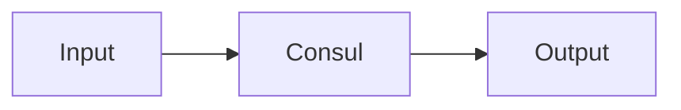

# Consul — A 2-Day Crash Course

Consul is a service mesh and service discovery tool — it tells your services where to find each other, health-checks them automatically, and can encrypt traffic between them.

**Prerequisite:** [`Kubernetes.md`](../containers/Kubernetes.md)

---

## Part 0 — Why Consul Exists

In a static world you hardcode IPs. In a dynamic world — containers rescheduled by Kubernetes, auto-scaled VMs, ephemeral tasks — the IP you hardcoded at deploy time is wrong by Tuesday. Load balancer configs become stale the moment a pod restarts on a new node.

Consul makes service discovery automatic. Every service registers itself. Every other service asks Consul "where is `payments`?" and gets a current, healthy address back. No manual updates. No stale DNS entries. No config files that drift from reality.

Beyond discovery, Consul adds:

- **Health checking** — unhealthy instances are removed from the pool automatically
- **Key-value storage** — lightweight config and feature flags, distributed across your cluster
- **Service mesh** — mutual TLS between services, with policy-based access control, without changing your application code

---

## Vocabulary

**Agent** — A long-running daemon you run on every node. It is either a server or a client. Everything talks to the local agent.

**Server** — An agent in server mode. Servers hold the authoritative state of the cluster, participate in Raft consensus, and are the source of truth. Run 3 or 5 in production.

**Client** — An agent in client mode. Clients forward requests to servers. They are lightweight and run on every compute node. They also execute health checks locally.

**Service** — A workload you have registered with Consul. Registration includes a name, address, port, tags, and optional health checks.

**Health Check** — A script, HTTP endpoint, TCP probe, or TTL that Consul runs repeatedly to determine whether a service instance is healthy. Unhealthy instances are excluded from DNS and API results.

**DNS Interface** — Consul exposes a DNS server on port 8600. Other services can resolve `payments.service.consul` to get healthy IPs without any Consul SDK.

**HTTP API** — Every Consul operation is available over REST. You can register services, query health, read/write the KV store, and manage intentions through the API.

**KV Store** — A hierarchical key-value store built into Consul. Useful for dynamic config, feature flags, and bootstrapping. Not a replacement for a proper secrets manager — use Vault for secrets.

**Connect (service mesh)** — Consul's built-in service mesh feature. It uses sidecar proxies (Envoy by default) to handle mTLS between services. Your application code stays unaware.

**Intention** — A policy that says whether service A is allowed to communicate with service B. Intentions are the authorization layer on top of Connect's encryption.

**Datacenter** — Consul's unit of geographic or logical isolation. Servers in one datacenter replicate via Raft. Multiple datacenters federate over WAN gossip.

**Gossip Protocol** — Consul uses Serf (a gossip library) for cluster membership and failure detection. Nodes share membership state peer-to-peer rather than through a central coordinator. Fast, resilient to partial failures.

**Raft** — The consensus algorithm Consul servers use to agree on state. Requires a quorum of `(n/2)+1` servers. With 3 servers you can lose 1. With 5 you can lose 2.

---




## DAY 1 — Service Discovery Fundamentals

### Install Consul

```bash
# macOS
brew tap hashicorp/tap
brew install hashicorp/tap/consul

# Linux (Debian/Ubuntu)
wget -O- https://apt.releases.hashicorp.com/gpg | gpg --dearmor | \
  sudo tee /usr/share/keyrings/hashicorp-archive-keyring.gpg
echo "deb [signed-by=/usr/share/keyrings/hashicorp-archive-keyring.gpg] \
  https://apt.releases.hashicorp.com $(lsb_release -cs) main" | \
  sudo tee /etc/apt/sources.list.d/hashicorp.list
sudo apt update && sudo apt install consul

consul version
```

### Start a Dev Agent

The dev mode agent runs in-memory, does not persist state, and is suitable for local experimentation only.

```bash
consul agent -dev -node=laptop

# In another terminal
consul members           # shows nodes in the cluster
consul catalog services  # lists registered services
```

### Register a Service

You register services two ways: via a config file or via the HTTP API.

**Config file approach** — create `/etc/consul.d/web.json` or `~/.consul.d/web.json`:

```json
{
  "service": {
    "name": "web",
    "port": 8080,
    "tags": ["v2", "frontend"],
    "check": {
      "http": "http://localhost:8080/health",
      "interval": "10s",
      "timeout": "2s"
    }
  }
}
```

```bash
# Reload Consul to pick up the new service definition
consul reload
```

**HTTP API approach:**

```bash
curl --request PUT \
  --data '{
    "Name": "payments",
    "Port": 9090,
    "Check": {
      "HTTP": "http://localhost:9090/health",
      "Interval": "10s"
    }
  }' \
  http://127.0.0.1:8500/v1/agent/service/register
```

### Health Checks

Consul supports four check types:

| Type   | How it works                                                              |
|--------|---------------------------------------------------------------------------|
| HTTP   | GET to a URL; 200-299 = passing                                           |
| TCP    | Opens a TCP connection; success = passing                                 |
| Script | Runs a command; exit 0 = passing, exit 1 = warning, exit 2 = critical    |
| TTL    | Your service must call `/v1/agent/check/pass/:id` within the TTL window   |

```json
{
  "check": {
    "id": "payments-db",
    "name": "PostgreSQL TCP",
    "tcp": "localhost:5432",
    "interval": "10s",
    "timeout": "1s"
  }
}
```

View health state:

```bash
consul watch -type checks
curl "http://127.0.0.1:8500/v1/health/service/payments?passing"
```

The `?passing` filter returns only healthy instances — this is what your service discovery client should use.

### DNS-Based Discovery

Consul's DNS interface is the lowest-friction integration path. No SDK required.

```bash
# Query healthy instances of the "payments" service
dig @127.0.0.1 -p 8600 payments.service.consul

# Query instances with a specific tag
dig @127.0.0.1 -p 8600 v2.payments.service.consul

# SRV record — includes port
dig @127.0.0.1 -p 8600 payments.service.consul SRV
```

To make this work without specifying the port, configure your system's DNS resolver to forward `*.consul` queries to port 8600. On Linux with systemd-resolved:

```ini
# /etc/systemd/resolved.conf.d/consul.conf
[Resolve]
DNS=127.0.0.1:8600
Domains=~consul
```

### HTTP API for Service Discovery

```bash
# List all services
curl http://127.0.0.1:8500/v1/catalog/services

# Get healthy instances of payments
curl "http://127.0.0.1:8500/v1/health/service/payments?passing=true"

# Blocking query — long-poll for changes (X-Consul-Index from previous response)
curl "http://127.0.0.1:8500/v1/health/service/payments?passing=true&index=12&wait=30s"
```

Blocking queries are the right way to watch for service changes. Your client holds the connection open; Consul responds only when the state changes or the wait expires. This is much more efficient than polling.

### KV Store for Configuration

```bash
# Write a value
consul kv put config/payments/db-pool-size 20

# Read it back
consul kv get config/payments/db-pool-size

# Read with metadata
consul kv get -detailed config/payments/db-pool-size

# List all keys under a prefix
consul kv get -recurse config/payments/

# Delete
consul kv delete config/payments/db-pool-size

# Via HTTP API
curl --request PUT --data "20" http://127.0.0.1:8500/v1/kv/config/payments/db-pool-size
curl http://127.0.0.1:8500/v1/kv/config/payments/db-pool-size
```

Values come back base64-encoded in the API response. Decode with `base64 -d` or your language's standard library.

---

## DAY 2 — Service Mesh, Kubernetes, and Production

### Consul Connect — mTLS Service Mesh

Connect provides automatic mutual TLS between services. A sidecar proxy (Envoy) handles the TLS handshake; your application listens on localhost and is unaware of encryption.

Enable Connect in your Consul agent config:

```json
{
  "connect": {
    "enabled": true
  }
}
```

Register a service with a sidecar:

```json
{
  "service": {
    "name": "payments",
    "port": 9090,
    "connect": {
      "sidecar_service": {}
    }
  }
}
```

Start the sidecar proxy:

```bash
consul connect proxy -sidecar-for payments
```

The proxy listens on a dynamically assigned port and forwards traffic to your service. Upstream services connect to the proxy, not directly to `payments`. Consul issues short-lived TLS certificates from its internal CA.

### Intentions — Authorization Between Services

Intentions control which services are allowed to call which other services. By default in a Connect-enabled cluster, all traffic is allowed. Lock it down:

```bash
# Deny all traffic by default
consul intention create -deny "*" "*"

# Allow web to call payments
consul intention create -allow web payments

# Allow orders to call payments
consul intention create -allow orders payments

# List intentions
consul intention list
```

Intentions are enforced at the proxy level. Your application code does not change. If `web` tries to call `inventory` and there is no allow intention, the proxy closes the connection before the request reaches your service.

Via the HTTP API:

```bash
curl --request PUT \
  --data '{"SourceName":"web","DestinationName":"payments","Action":"allow"}' \
  http://127.0.0.1:8500/v1/connect/intentions
```

### Consul on Kubernetes

The official Helm chart installs Consul server pods, client daemonsets, and optionally the Connect injector (which automatically injects Envoy sidecars into annotated pods).

```bash
helm repo add hashicorp https://helm.releases.hashicorp.com
helm repo update

helm install consul hashicorp/consul \
  --namespace consul \
  --create-namespace \
  --values consul-values.yaml
```

A minimal `consul-values.yaml`:

```yaml
global:
  name: consul
  datacenter: dc1

server:
  replicas: 3
  bootstrapExpect: 3

connectInject:
  enabled: true

dns:
  enabled: true
```

To make a Kubernetes pod participate in the service mesh, add the injection annotation:

```yaml
apiVersion: apps/v1
kind: Deployment
metadata:
  name: payments
spec:
  template:
    metadata:
      annotations:
        consul.hashicorp.com/connect-inject: "true"
    spec:
      containers:
        - name: payments
          image: payments:latest
          ports:
            - containerPort: 9090
```

Consul automatically registers the service, injects the Envoy sidecar, and manages certificates.

ServiceIntentions in Kubernetes use a CRD:

```yaml
apiVersion: consul.hashicorp.com/v1alpha1
kind: ServiceIntentions
metadata:
  name: payments
spec:
  destination:
    name: payments
  sources:
    - name: web
      action: allow
    - name: orders
      action: allow
    - name: "*"
      action: deny
```

### Consul Template

Consul Template watches Consul for changes and re-renders config files or scripts. It bridges Consul into applications that are not Consul-aware.

```bash
brew install consul-template
```

A template that writes an Nginx upstream block:

```hcl
# upstream.ctmpl
upstream payments {
  {{- range service "payments" }}
  server {{ .Address }}:{{ .Port }};
  {{- end }}
}
```

Run it:

```bash
consul-template \
  -template "upstream.ctmpl:/etc/nginx/conf.d/upstream.conf:nginx -s reload"
```

Every time a `payments` instance appears or disappears in Consul, the file is regenerated and Nginx is reloaded. No manual intervention.

### Multi-Datacenter Federation

Each datacenter runs its own server cluster. You link them via WAN gossip:

```hcl
# consul-dc2.hcl
datacenter   = "dc2"
retry_join_wan = ["dc1-server-ip:8302"]
```

Once federated, you can query services across datacenters:

```bash
# Query payments in dc2 from dc1
dig @127.0.0.1 -p 8600 payments.service.dc2.consul

# Via API
curl "http://127.0.0.1:8500/v1/health/service/payments?dc=dc2&passing=true"
```

Prepared queries let you express failover logic — prefer local DC, fall back to another:

```bash
curl --request POST \
  --data '{
    "Name": "payments-with-failover",
    "Service": {
      "Service": "payments",
      "Failover": {
        "Datacenters": ["dc1", "dc2"]
      }
    }
  }' \
  http://127.0.0.1:8500/v1/query
```

### ACLs — Access Control Lists

Enable ACLs to restrict what agents, services, and humans can do:

```hcl
# consul-acl.hcl
acl = {
  enabled                  = true
  default_policy           = "deny"
  enable_token_persistence = true
}
```

Bootstrap the ACL system (one-time):

```bash
consul acl bootstrap
# Returns a bootstrap token — store it in Vault, not in a file
```

Create a policy for a service:

```bash
consul acl policy create \
  -name "payments-policy" \
  -rules 'service "payments" { policy = "write" }
          service_prefix "" { policy = "read" }
          node_prefix ""    { policy = "read" }'

consul acl token create \
  -description "payments service token" \
  -policy-name "payments-policy"
```

Pass the token per-request or set it in agent config:

```bash
# Per-request header
curl -H "X-Consul-Token: <token>" http://127.0.0.1:8500/v1/catalog/services

# Agent config
acl {
  tokens {
    agent = "<agent-token>"
  }
}
```

### Monitoring Consul

Consul exposes metrics via its HTTP API and supports Prometheus natively:

```hcl
telemetry {
  prometheus_retention_time = "60s"
  disable_hostname          = true
}
```

Scrape at `http://consul-agent:8500/v1/agent/metrics?format=prometheus`.

Key metrics to watch:

| Metric | What it tells you |
|--------|-------------------|
| `consul.raft.leader` | Whether this server is the leader |
| `consul.raft.commitTime` | How long commits take — high values mean Raft pressure |
| `consul.catalog.service.query` | Query volume for service discovery |
| `consul.health.service.query` | Health check query volume |
| `consul.serf.memberFailed` | Nodes that have failed — should be 0 |
| `consul.rpc.request` | RPC request rate to servers |

### Consul vs etcd vs ZooKeeper

| Dimension | Consul | etcd | ZooKeeper |
|-----------|--------|------|-----------|
| Primary use | Service discovery, mesh | Key-value (Kubernetes uses it) | Coordination, distributed locks |
| Health checking | Built-in, agent-executed | External only | External only |
| Service mesh | Yes (Connect + Envoy) | No | No |
| DNS interface | Yes (built-in) | No | No |
| Multi-datacenter | Yes (WAN federation) | Requires external tooling | Requires external tooling |
| Consensus | Raft | Raft | ZAB (Zookeeper Atomic Broadcast) |
| Operational complexity | Medium | Low | High |
| Best fit | Microservices, hybrid cloud | Kubernetes backend, config store | JVM ecosystems, legacy Hadoop stacks |

Choose Consul when you need service discovery plus health checking plus optional service mesh in one tool. Choose etcd when you need a rock-solid distributed KV store and are already in Kubernetes. Avoid ZooKeeper for new systems unless you have a specific dependency on it.

---

## Worked Example — Microservice Discovery with Health Checks

You have three services: `api-gateway`, `orders`, and `payments`. You want `api-gateway` to always route to healthy `orders` instances without hardcoding addresses.

**Step 1 — Register orders with a health check:**

```json
{
  "service": {
    "name": "orders",
    "port": 8081,
    "tags": ["v1"],
    "check": {
      "http": "http://localhost:8081/healthz",
      "interval": "5s",
      "deregister_critical_service_after": "30s"
    }
  }
}
```

The `deregister_critical_service_after` field removes the service entirely if it stays critical for 30 seconds — useful for containers that crash and restart on a different IP.

**Step 2 — Register payments similarly on port 9090.**

**Step 3 — api-gateway discovers orders via blocking query:**

```python
import requests

CONSUL = "http://localhost:8500"
index = 0

def get_healthy_orders():
    global index
    resp = requests.get(
        f"{CONSUL}/v1/health/service/orders",
        params={"passing": "true", "index": index, "wait": "10s"}
    )
    index = int(resp.headers.get("X-Consul-Index", 0))
    services = resp.json()
    return [
        f"{s['Service']['Address']}:{s['Service']['Port']}"
        for s in services
    ]
```

The first call returns immediately. Subsequent calls block for up to 10 seconds, returning only when the service list changes or the wait expires. Your load-balancing list stays current with no polling overhead.

**Step 4 — Add Connect for mTLS between orders and payments.**

Annotate both services with `"connect": {"sidecar_service": {}}` in their definitions, start their sidecars, and create an intention:

```bash
consul intention create -deny  "*"     payments
consul intention create -allow orders  payments
```

Now only `orders` can reach `payments`. Any other service attempting to connect gets a refused connection at the proxy level before the request reaches your application.

---

## Pitfalls

**Running fewer than 3 servers in production.** With 1 server, any restart causes downtime. With 3 you can tolerate 1 failure. With 5 you can tolerate 2. Size your server cluster before you need it.

**Forgetting to enable ACLs.** A Consul cluster without ACLs lets any agent register any service and read all KV data. Enable ACLs from the start — retrofitting them later requires a careful bootstrap sequence.

**Using the KV store for secrets.** KV data is readable by anyone with a token that has read access. Store secrets in Vault and reference them via Vault's Consul integration, not directly in the KV store.

**Health check intervals that are too aggressive.** A 1-second HTTP health check against thousands of instances creates significant load on your services. 10–15 seconds is a reasonable default for most web services. Use TTL checks for long-running batch jobs.

**Ignoring Raft I/O requirements.** Consul servers need low-latency disk I/O for Raft log writes. Running servers on shared NFS or slow spinning disks causes leader election churn. Use local SSDs.

**Registering services without `deregister_critical_service_after`.** In containerized environments, crashed containers leave stale registrations until you manually deregister them or restart the agent. Always set this field.

**Not enabling gossip encryption.** By default gossip communication is unencrypted. Generate a gossip key and distribute it to all agents before you expose any node metadata.

```bash
consul keygen
# Add the returned key to all agent configs as:  "encrypt": "<key>"
```

⚠️ The bootstrap token is the root credential for your entire Consul cluster. Store it in Vault or a secrets manager immediately after bootstrapping. Do not put it in source control or a config file on disk.

---

## Quick Reference

```bash
# Start dev agent
consul agent -dev -node=mynode

# Cluster members
consul members
consul members -wan           # cross-datacenter view

# Services
consul catalog services
consul catalog nodes -service=payments

# Health
consul health service payments
consul health state critical

# KV
consul kv put   key value
consul kv get   key
consul kv get  -recurse prefix/
consul kv delete key

# Intentions
consul intention create -allow src dst
consul intention create -deny  src dst
consul intention list
consul intention delete src dst

# ACL
consul acl bootstrap
consul acl policy create -name my-policy -rules @policy.hcl
consul acl token create  -policy-name my-policy

# Reload config without restart
consul reload

# Force-leave a failed node
consul force-leave nodename

# Validate config files
consul validate /etc/consul.d/

# Snapshot (backup / restore)
consul snapshot save    backup.snap
consul snapshot restore backup.snap
```

---

## Next Steps

- [`Vault.md`](Vault.md) — secrets management that integrates tightly with Consul for dynamic credentials and certificate storage
- [`Terraform.md`](Terraform.md) — provision Consul clusters and manage service registrations as code with the Consul provider
- [`Kubernetes.md`](../containers/Kubernetes.md) — deepen your understanding of the environment where Consul Connect is most commonly deployed
- `Istio.md` — compare Consul Connect with Istio's service mesh; both use Envoy but differ significantly in operational model and feature surface

---

## Recommended learning resources

**YouTube channels & playlists:**
- [HashiCorp — HashiConf Consul Talks](https://www.youtube.com/@HashiCorp) — official sessions on service discovery, Connect mesh, and multi-datacenter patterns
- [Ned in the Cloud — Consul Deep Dives](https://www.youtube.com/@NedintheCloud) — practical walkthroughs of ACLs, intentions, and federation
- [TechWorld with Nana — Service Mesh & Discovery](https://www.youtube.com/@TechWorldwithNana) — beginner-friendly introduction to service discovery concepts
- [KodeKloud — Consul for Beginners](https://www.youtube.com/@KodeKloud) — hands-on labs covering agents, KV store, and health checks
- [DevOps Toolkit (Viktor Farcic) — Service Mesh Comparison](https://www.youtube.com/@DevOpsToolkit) — Consul Connect vs Istio and other mesh options

**Official docs & blogs:**
- [Consul Documentation](https://developer.hashicorp.com/consul/docs) — agent configuration, service mesh, and API reference
- [HashiCorp Blog — Consul](https://www.hashicorp.com/blog/products/consul) — release announcements, mesh gateway patterns, and production architecture
- [HashiCorp Learn — Consul Tutorials](https://developer.hashicorp.com/consul/tutorials) — step-by-step guides from dev agent to production clusters

## The Mantra

Your services do not know where each other live — Consul does. Register everything, health-check everything, and let the mesh handle encryption. Stop hardcoding IPs the moment you hardcode one.

## Top 10 Interview Questions

<details>
<summary><strong>Q: What is Consul and what are its core use cases?</strong></summary>

Consul provides four capabilities: service discovery (services register and find each other via DNS or HTTP API), health checking (monitors service health, removes unhealthy instances from discovery), key-value store (distributed config storage), and service mesh (Consul Connect — mutual TLS, traffic management, intentions). Primary use case: dynamic service discovery in microservice and multi-cloud environments where IP addresses change frequently. Unlike static config files, Consul reflects the real-time state of your infrastructure.

</details>

<details>
<summary><strong>Q: How does Consul's service discovery work?</strong></summary>

Services register with the local Consul agent (sidecar or API call) including their name, address, port, and health check. Other services query Consul to find healthy instances: via DNS (service-name.service.consul resolves to healthy IPs) or HTTP API (returns full service info). Consul's gossip protocol propagates service state across the cluster. Health checks (HTTP, TCP, script, TTL) run locally on the agent and mark instances as passing/warning/critical. Failed health checks remove the instance from DNS responses.

</details>

<details>
<summary><strong>Q: How does Consul Connect provide service mesh capabilities?</strong></summary>

Consul Connect enables service-to-service communication via mutual TLS — services communicate through sidecar proxies (Envoy) that handle encryption, identity verification, and traffic management. Intentions define which services can communicate (allow/deny rules based on service identity, not IP addresses). This provides: zero-trust networking (every connection is authenticated and encrypted), traffic management (routing, splitting, failover), and observability (L7 metrics per service pair). Consul Connect can run on VMs, not just Kubernetes.

</details>

<details>
<summary><strong>Q: How does Consul handle multi-datacenter deployments?</strong></summary>

Consul supports WAN federation: each datacenter runs its own Consul server cluster, and the clusters communicate over the WAN. Services can discover services in other datacenters (service-name.dc2.consul). Prepared queries enable automatic failover: if no healthy instances exist locally, route to another datacenter. WAN gossip is bandwidth-efficient (only server-to-server). For Kubernetes multi-cluster, Consul supports cluster peering (mesh gateway connectivity between K8s clusters). This is a key differentiator from simpler discovery systems like CoreDNS.

</details>

<details>
<summary><strong>Q: What is Consul's consensus protocol and how do you size the server cluster?</strong></summary>

Consul servers use Raft consensus for the KV store, service catalog, and ACL state. Raft requires a quorum (majority) for writes. Use 3 servers for most deployments (tolerates 1 failure) or 5 for critical environments (tolerates 2). Never use even numbers. Servers should be on dedicated, low-latency nodes. Consul agents (on every node) use Serf gossip (not Raft) for membership and health — lightweight and scales to thousands of nodes. Agents forward requests to servers.

</details>

<details>
<summary><strong>Q: How do you secure Consul in production?</strong></summary>

Enable ACLs (access control lists) to restrict who can register services, read the KV store, and manage the cluster. Use TLS for all communication (RPC between agents and servers, HTTP API, gossip encryption via a shared key). Enable Consul Connect for mutual TLS between services. Restrict network access (servers accessible only from agents, not from the internet). Rotate gossip encryption keys periodically. Use Vault integration for dynamic secret management. Audit API access via Consul's audit logging.

</details>

<details>
<summary><strong>Q: How do Consul intentions work for service-to-service authorization?</strong></summary>

Intentions are access control rules that define which services can communicate: 'web' can talk to 'api', 'api' can talk to 'database', but 'web' cannot talk to 'database' directly. Intentions are identity-based (service name), not network-based (IP/port). They are enforced by Consul Connect sidecar proxies. Default deny is recommended: explicitly allow required connections, deny everything else. Intentions can be managed via CLI, API, or UI, and support L7 attributes (HTTP path, method) for fine-grained control.

</details>

<details>
<summary><strong>Q: How does Consul's KV store compare to etcd and ZooKeeper?</strong></summary>

All three are distributed, consistent KV stores using consensus protocols. Consul's KV is a feature within a broader platform (service discovery, mesh, health checks) — good for configuration that needs to co-exist with service discovery. etcd is Kubernetes-native and optimised for the control plane workload. ZooKeeper is mature but operationally complex. Choose Consul KV for: service configuration in a Consul-managed environment. Choose etcd for: Kubernetes-specific state. Consul's KV is simpler but less performant than etcd for very high write loads.

</details>

<details>
<summary><strong>Q: How does Consul integrate with Kubernetes?</strong></summary>

Consul on Kubernetes runs as a Helm chart deploying: Consul servers, a connect-inject webhook (automatically adds sidecar proxies to pods), a sync-catalog controller (syncs K8s services to Consul and vice versa), and optionally a mesh gateway (for multi-cluster). Benefits: unified service discovery across K8s and VMs (a K8s service can discover a VM-based service), Consul intentions for cross-platform access control, and multi-cluster service mesh without requiring Istio. Use when you have a mixed K8s/VM environment.

</details>

<details>
<summary><strong>Q: When would you choose Consul over Istio for service mesh?</strong></summary>

Choose Consul when: you have a mixed environment (VMs + Kubernetes — Istio is K8s-only), you need service discovery and KV store alongside mesh (Consul is multi-feature), you want a simpler operational model (Consul Connect is lighter than Istio's control plane), or you need multi-datacenter federation out of the box. Choose Istio when: you are fully Kubernetes-native, need advanced traffic management (fault injection, traffic mirroring), or want deep integration with the K8s ecosystem (Gateway API, custom resources).

</details>

---

