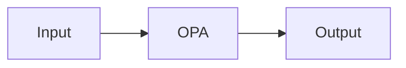

# OPA (Open Policy Agent) — A 2-Day Crash Course

OPA is a general-purpose policy engine — you define rules in Rego, and it enforces them everywhere: Kubernetes admission control, Terraform plan validation, API authorization, and beyond.

---

## Part 0 — Why OPA

Without OPA, your policies live in fragments: a bash script that checks image registries, a webhook that validates resource limits, a wiki page listing which labels are required, a comment in a Helm values file reminding someone to set `requests`. Nobody reads the wiki. The webhook gets outdated. The bash script only runs in CI.

OPA centralizes those scattered rules as code — versioned, testable, reviewable, and enforceable at multiple points in your stack simultaneously. The same policy that blocks a Terraform plan in CI can also block a Kubernetes admission request and protect an internal API endpoint.

The shift: policy stops being tribal knowledge and becomes a first-class artifact.

---

## Vocabulary

**Rego** — The declarative query language you write policies in. It looks like Datalog. You define rules that evaluate to `true`, `false`, or a value. Everything in OPA is Rego.

**Policy** — A Rego file (or collection of files) encoding your rules. Example: "all containers must set CPU and memory limits."

**Rule** — A single named expression in Rego. Rules can be complete (one result) or partial (a set of results).

**Data** — External context fed to OPA at evaluation time. Could be a list of approved image registries, team ownership data, or a Terraform plan document. Data is separate from policy.

**Input** — The thing being evaluated. In Kubernetes admission, input is the AdmissionReview object. In Terraform, input is the plan JSON. OPA evaluates your policy against this input.

**Decision** — The result OPA returns. Usually `allow: true/false`, a set of violations, or a structured object your system acts on.

**Bundle** — A tarball containing Rego files and optional data JSON. You distribute policy updates as bundles, pulling them from object storage (S3, GCS, etc.) or an OPA bundle server.

**Gatekeeper** — The Kubernetes-native OPA integration. It runs as an admission webhook and introduces CRDs for managing policies declaratively inside the cluster.

**Conftest** — A CLI tool that runs OPA policies against structured config files — Terraform plans, Kubernetes YAML, Dockerfiles, JSON, TOML. Ideal for CI.

**ConstraintTemplate** — A Gatekeeper CRD that wraps a Rego policy and defines a new CRD type (a "Constraint") that cluster operators use to instantiate the rule with parameters.

---




## DAY 1 — Install, Write Rego, Test with Conftest

### Install OPA

```bash
# macOS
brew install opa

# Linux
curl -L -o opa https://openpolicyagent.org/downloads/latest/opa_linux_amd64_static
chmod +x opa
sudo mv opa /usr/local/bin/

# Verify
opa version
```

### Install Conftest

```bash
brew install conftest
# or
curl -L https://github.com/open-policy-agent/conftest/releases/latest/download/conftest_Linux_x86_64.tar.gz | tar xz
sudo mv conftest /usr/local/bin/
```

### Your first Rego policy

Create `policy/deny_latest.rego`:

```rego
package main

deny[msg] {
  input.kind == "Deployment"
  container := input.spec.template.spec.containers[_]
  endswith(container.image, ":latest")
  msg := sprintf("container '%s' uses :latest tag — pin a specific version", [container.name])
}
```

Three things to notice:
- `package main` — Conftest looks for rules in the `main` package by default.
- `deny[msg]` — a partial rule that builds a set of denial messages.
- `input` — the document being evaluated. Here, a Kubernetes manifest.

### Test it with opa eval

Create `deployment.yaml` — a minimal Deployment with `image: myapp:latest`. Then:

```bash
opa eval --input deployment.yaml --data policy/ --format pretty 'data.main.deny'
```

You'll see the denial message. Change the image to `myapp:v1.2.3` and run again — empty set, policy passes.

### Writing a resource limits policy

```rego
package main

deny[msg] {
  input.kind == "Deployment"
  container := input.spec.template.spec.containers[_]
  not container.resources.limits.cpu
  msg := sprintf("container '%s' is missing cpu limit", [container.name])
}

deny[msg] {
  input.kind == "Deployment"
  container := input.spec.template.spec.containers[_]
  not container.resources.limits.memory
  msg := sprintf("container '%s' is missing memory limit", [container.name])
}
```

Rego evaluates each rule body independently. If any one path through the body is `true`, the rule fires and appends to the set.

### Testing Rego with opa test

Write unit tests alongside your policy. Create `policy/deny_latest_test.rego`:

```rego
package main_test

import data.main

test_deny_latest_image {
  violations := main.deny with input as {
    "kind": "Deployment",
    "spec": {"template": {"spec": {"containers": [
      {"name": "api", "image": "myapp:latest"}
    ]}}}
  }
  count(violations) == 1
}

test_allow_pinned_image {
  violations := main.deny with input as {
    "kind": "Deployment",
    "spec": {"template": {"spec": {"containers": [
      {"name": "api", "image": "myapp:v1.2.3"}
    ]}}}
  }
  count(violations) == 0
}
```

Run: `opa test policy/`

### Conftest for Kubernetes YAML

```bash
conftest test deployment.yaml --policy policy/
```

Conftest reads every `.yaml` in the directory, evaluates each manifest against your `main` package, and exits non-zero if any `deny` rules fire. Drop this in CI as a pre-deploy gate.

### Conftest for Terraform plans

Generate a plan JSON:

```bash
terraform plan -out=tfplan
terraform show -json tfplan > tfplan.json
```

Write `policy/terraform.rego`:

```rego
package main

deny[msg] {
  resource := input.resource_changes[_]
  resource.type == "aws_instance"
  not resource.change.after.tags.Environment
  msg := sprintf("aws_instance '%s' is missing the Environment tag", [resource.address])
}
```

Test it:

```bash
conftest test tfplan.json --policy policy/
```

You now have policy-as-code for your infrastructure — enforced before `terraform apply` ever runs.

---

## DAY 2 — Gatekeeper, Bundles, API Authorization, CI/CD

### Gatekeeper in Kubernetes

Gatekeeper is OPA running inside Kubernetes as a ValidatingAdmissionWebhook. Every resource creation or update passes through it. Policy violations block the request.

Install Gatekeeper:

```bash
kubectl apply -f https://raw.githubusercontent.com/open-policy-agent/gatekeeper/release-3.14/deploy/gatekeeper.yaml
```

Verify:

```bash
kubectl get pods -n gatekeeper-system
```

### ConstraintTemplates

A ConstraintTemplate defines the Rego logic and exposes a new CRD. Create `require-labels-template.yaml`:

```yaml
apiVersion: templates.gatekeeper.sh/v1
kind: ConstraintTemplate
metadata:
  name: requirelabels
spec:
  crd:
    spec:
      names:
        kind: RequireLabels
      validation:
        openAPIV3Schema:
          type: object
          properties:
            labels:
              type: array
              items:
                type: string
  targets:
    - target: admission.k8s.gatekeeper.sh
      rego: |
        package requirelabels

        violation[{"msg": msg}] {
          provided := {label | input.review.object.metadata.labels[label]}
          required := {label | label := input.parameters.labels[_]}
          missing := required - provided
          count(missing) > 0
          msg := sprintf("missing required labels: %v", [missing])
        }
```

Apply it: `kubectl apply -f require-labels-template.yaml`

### Instantiate a Constraint

The ConstraintTemplate created a new CRD called `RequireLabels`. Now instantiate it:

```yaml
apiVersion: constraints.gatekeeper.sh/v1beta1
kind: RequireLabels
metadata:
  name: require-team-and-env
spec:
  match:
    kinds:
      - apiGroups: ["apps"]
        kinds: ["Deployment"]
  parameters:
    labels: ["team", "env"]
```

Apply it. Now any Deployment missing `team` or `env` labels is rejected at admission time.

### Audit mode

Gatekeeper also audits existing resources and reports violations without blocking:

```bash
kubectl get requirelabels.constraints.gatekeeper.sh require-team-and-env -o yaml
# Look at .status.violations for existing resources that violate the constraint
```

This is how you migrate: enforce in audit first, fix existing resources, then switch to deny mode.

### Policy testing with Gatekeeper

Write unit tests for ConstraintTemplate Rego the same way you would for standalone OPA. Use `opa test` against the extracted Rego. Keep tests in the same repository as templates — they're code, treat them as such.

### OPA Bundles for distribution

When you have multiple clusters or services consuming OPA policy, bundles let you distribute updates without touching deployments.

Structure your bundle:

```
bundles/
  main/
    policy/
      k8s.rego
      terraform.rego
    data.json       # optional external data
```

Build: `opa build bundles/main -o bundle.tar.gz`

Upload to S3, GCS, or an HTTP server. In your OPA config, declare a `services` entry pointing at the bucket URL and a `bundles` entry with the resource path and a polling interval (60–120 seconds is typical). OPA hot-reloads the bundle when it detects a new version — policy changes propagate across all consumers within minutes without restarting anything.

### OPA as API authorization engine

OPA runs as a sidecar or standalone service. Your API POSTs an `input` document to `http://localhost:8181/v1/data/authz/allow` and acts on the boolean result. The policy in `authz.rego`:

```rego
package authz

default allow := false

allow {
  input.action == "read"
  input.user == data.roles[input.resource].readers[_]
}
```

`data.roles` is the external data document — roles loaded from a database or config, separate from the policy logic itself. This separation is the power of OPA: policy logic and data evolve independently.

### CI/CD integration

On every PR: run `opa test policy/` to validate unit tests, then `conftest test k8s/ --policy policy/` for manifests, then generate a Terraform plan JSON and run `conftest test tfplan.json --policy policy/`. Any failure exits non-zero and blocks merge. Wire these as three sequential steps in GitHub Actions, GitLab CI, or your pipeline of choice — the commands are identical regardless of CI platform.

---

## Worked Example — Enforce Resource Limits and Labels in K8s

**Goal:** All Deployments must have `team` and `env` labels and all containers must declare CPU and memory limits.

Apply the `RequireLabels` ConstraintTemplate and Constraint from Day 2 for label enforcement, then add this template for resource limits:

```yaml
apiVersion: templates.gatekeeper.sh/v1
kind: ConstraintTemplate
metadata:
  name: requireresourcelimits
spec:
  crd:
    spec:
      names:
        kind: RequireResourceLimits
  targets:
    - target: admission.k8s.gatekeeper.sh
      rego: |
        package requireresourcelimits
        violation[{"msg": msg}] {
          container := input.review.object.spec.template.spec.containers[_]
          not container.resources.limits.cpu
          msg := sprintf("container '%s' must set resources.limits.cpu", [container.name])
        }
        violation[{"msg": msg}] {
          container := input.review.object.spec.template.spec.containers[_]
          not container.resources.limits.memory
          msg := sprintf("container '%s' must set resources.limits.memory", [container.name])
        }
```

Instantiate it:

```yaml
apiVersion: constraints.gatekeeper.sh/v1beta1
kind: RequireResourceLimits
metadata:
  name: all-deployments
spec:
  match:
    kinds:
      - apiGroups: ["apps"]
        kinds: ["Deployment"]
```

Now apply a Deployment without limits:

```bash
kubectl apply -f bad-deployment.yaml
# Error: container 'api' must set resources.limits.cpu
```

Fix it — add `resources.limits.cpu` and `resources.limits.memory` plus `team` and `env` labels — and the admission succeeds. Both constraints enforce simultaneously; either can block independently.

---

## Pitfalls

**Rego evaluation is non-intuitive at first.** Rego is declarative and uses negation-as-failure (`not`). If a path doesn't exist in the input, `not` succeeds — which can cause false positives. Always test with realistic input documents, not minimal examples.

**`deny` vs `violation` naming.** Conftest uses `deny` (or `warn`). Gatekeeper uses `violation`. They are not interchangeable. If you copy policy between contexts, rename the rule head.

**Dry-run Gatekeeper constraints before enforcing.** Set `enforcementAction: dryrun` on new Constraints. Check `.status.violations` to understand blast radius before switching to `deny`.

**Input schema differs across contexts.** In Gatekeeper, the Kubernetes object is at `input.review.object`. In Conftest with raw YAML, it's at `input` directly. Write policies with explicit context in mind, or abstract the path into a helper rule.

**Bundle signing in production.** Anyone with write access to your bundle store can push malicious policy. Sign bundles with `opa build --signing-key` and configure OPA to verify signatures. Skip this in development, enforce it in production.

⚠️ **Gatekeeper blocks all matching resources if a ConstraintTemplate has a Rego error.** A syntax error in the template causes the webhook to return an error for every admission request that hits it. Test templates with `opa test` before applying them to the cluster.

**OPA is not a firewall.** It makes decisions; it doesn't enforce them. Your system must actually call OPA and act on the result. A policy that nobody queries does nothing.

---

## Quick Reference

```bash
# Install
brew install opa conftest

# Evaluate a policy against an input
opa eval --input input.json --data policy/ 'data.main.deny'

# Run unit tests
opa test policy/

# Run Conftest against YAML/JSON
conftest test manifest.yaml --policy policy/
conftest test tfplan.json --policy policy/

# Build a bundle
opa build policy/ -o bundle.tar.gz

# Run OPA as a server
opa run --server --addr :8181

# Query the OPA server
curl -X POST http://localhost:8181/v1/data/main/allow \
  -H 'Content-Type: application/json' \
  -d '{"input": {...}}'

# Check constraint violations in Gatekeeper
kubectl get constraints
kubectl describe <constrainttype> <constraintname>
```

| Concept | Conftest default | Gatekeeper default |
|---|---|---|
| Rule type | `deny[msg]` | `violation[{"msg": msg}]` |
| Input path (K8s) | `input` (raw manifest) | `input.review.object` |
| Policy entry | `package main` | any package |
| Distribution | CLI flags / `--policy` | ConstraintTemplate CRD |

---

## Next Steps

- `Kubernetes.md` — admission webhooks, RBAC, security contexts that OPA policies enforce
- `Terraform.md` — plan generation and JSON output that Conftest consumes
- `Trivy.md` — image and IaC scanning, complementary shift-left layer to OPA
- `Falco.md` — runtime policy enforcement (OPA governs admission; Falco governs runtime behavior)

---

## Recommended learning resources

**YouTube channels & playlists:**
- [CNCF — OPA and Gatekeeper Talks](https://www.youtube.com/@cncf) — KubeCon presentations on policy-as-code architecture and admission control
- [DevOps Toolkit (Viktor Farcic) — Policy as Code](https://www.youtube.com/@DevOpsToolkit) — practical OPA and Gatekeeper walkthroughs in Kubernetes contexts
- [Styra — OPA Tutorials](https://www.youtube.com/@Styra) — official OPA maintainer content on Rego, bundles, and enterprise patterns
- [TechWorld with Nana — Kubernetes Security](https://www.youtube.com/@TechWorldwithNana) — beginner-friendly overview of admission control and policy enforcement
- [Spacelift — Policy Enforcement in IaC](https://www.youtube.com/@spacelift-io) — OPA and Conftest in Terraform and CI/CD pipelines

**Official docs & blogs:**
- [OPA Documentation](https://www.openpolicyagent.org/docs/latest/) — Rego language reference, integration guides, and decision log format
- [Styra Blog](https://www.styra.com/blog/) — Rego patterns, Gatekeeper best practices, and policy management at scale
- [Gatekeeper Documentation](https://open-policy-agent.github.io/gatekeeper/website/docs/) — ConstraintTemplate reference and audit mode guide

## The Mantra

Policy as code. Tested, versioned, enforced at the boundary — not documented in a wiki nobody reads.

## Top 10 Interview Questions

<details>
<summary><strong>Q: What is OPA and what problem does it solve?</strong></summary>

OPA (Open Policy Agent) is a general-purpose policy engine that decouples policy decisions from policy enforcement. Instead of hardcoding authorization rules in application code (if user.role == 'admin'), you write policies in Rego (OPA's declarative language) and query OPA for decisions. OPA solves: scattered authorization logic (policies are centralised and auditable), inconsistent enforcement (same policy engine across all systems), and policy-as-code (version control, testing, CI/CD for policies).

</details>

<details>
<summary><strong>Q: How does the Rego language work and what makes it different from imperative languages?</strong></summary>

Rego is declarative and rule-based — you state what should be true, not how to compute it. Rules evaluate to true or false based on input data. Rego uses: logical AND (multiple expressions in a rule body), logical OR (multiple rules with the same name), iteration (implicit — Rego iterates over collections automatically), and negation (not keyword). The key mental shift: Rego rules are not if-then statements; they are logical assertions. If all assertions in a rule body are true, the rule is true. This is powerful for policy expression but has a learning curve.

</details>

<details>
<summary><strong>Q: How does OPA Gatekeeper enforce policies in Kubernetes?</strong></summary>

Gatekeeper runs as a Kubernetes admission controller: when a resource is created/updated, the API server sends the request to Gatekeeper, which evaluates OPA policies and returns allow/deny. Policies are defined as ConstraintTemplates (reusable policy logic in Rego) and Constraints (instantiate templates with parameters). Example: a template enforces 'container image must be from allowed registries' and a constraint specifies the allowed registries. Gatekeeper also provides audit mode: evaluate existing resources against policies without blocking.

</details>

<details>
<summary><strong>Q: How do you use OPA with Terraform for infrastructure policy?</strong></summary>

Use Conftest to evaluate Terraform plans against OPA policies. Workflow: terraform plan -out=tfplan, terraform show -json tfplan > plan.json, conftest test plan.json — Conftest runs Rego policies against the JSON plan. Example policies: 'no public S3 buckets', 'all RDS instances must have encryption enabled', 'no resources in unapproved regions'. Integrate into CI: fail the pipeline if policies are violated. This shifts policy enforcement left — catch violations before applying infrastructure changes.

</details>

<details>
<summary><strong>Q: What is the difference between OPA and Kubernetes RBAC?</strong></summary>

Kubernetes RBAC controls who can perform API operations (create pods, delete services) based on roles and role bindings. OPA/Gatekeeper controls what resources look like — the content of the resources. RBAC answers 'can user X create a Deployment?' OPA answers 'does this Deployment meet our standards (resource limits set, image from approved registry, no privileged containers)?' They complement each other: RBAC for identity-based access control, OPA for content-based policy enforcement.

</details>

<details>
<summary><strong>Q: How do you test OPA policies?</strong></summary>

Use OPA's built-in test framework: write test rules (prefixed with test_) that assert policy behaviour for specific inputs. Run with opa test. Test both allow and deny cases, edge cases, and error conditions. Use opa eval for interactive testing during development. For Gatekeeper: use gator test (Gatekeeper's CLI) to validate ConstraintTemplates and Constraints against sample resources. Integrate tests into CI — policies should be tested like code before deployment. Build a test suite of known-good and known-bad resource examples.

</details>

<details>
<summary><strong>Q: How do you manage and distribute OPA policies across an organisation?</strong></summary>

Store policies in Git repositories with CI/CD: lint, test, and review policies in PRs. Distribute via: OPA Bundles (package policies into tarballs, host on an HTTP server, OPA polls for updates), Gatekeeper ConstraintTemplates (deploy via Helm/Kustomize to K8s clusters), or Conftest policies (npm-like distribution with conftest pull). Maintain a policy library with shared, reusable policies. Version policies and communicate changes — policy updates can break deployments if not coordinated.

</details>

<details>
<summary><strong>Q: What are the performance considerations when running OPA at scale?</strong></summary>

OPA evaluates policies in-memory and is very fast (sub-millisecond for typical policies). Performance concerns: large external data sets loaded into OPA (keep data minimal — load only what policies need), complex Rego with deep iteration (avoid nested iterations over large collections), and high query rates in admission controllers (Gatekeeper caches decisions). Monitor: decision latency (should be < 5ms), policy compilation time, and data sync latency. OPA scales horizontally — run multiple instances behind a load balancer for high availability.

</details>

<details>
<summary><strong>Q: How does OPA handle data-driven policies?</strong></summary>

OPA separates policy logic (Rego rules) from data (JSON documents). Example: a policy says 'image must be from an allowed registry' — the list of allowed registries is data loaded separately (from a ConfigMap, API, or bundle). When registries change, update the data without changing the policy. This enables: dynamic policies (change behaviour without redeploying), environment-specific policies (same logic, different data per environment), and external data integration (load user attributes, resource metadata from APIs).

</details>

<details>
<summary><strong>Q: When should you use OPA versus built-in tools like Kyverno or Sentinel?</strong></summary>

OPA: general-purpose (works beyond K8s — APIs, CI/CD, microservices), powerful Rego language (steep learning curve but very expressive), large ecosystem. Kyverno: Kubernetes-native (policies as K8s resources in YAML, not Rego), simpler for K8s-only policies, easier to learn but less powerful. Sentinel: HashiCorp-specific (Terraform Cloud/Enterprise, Vault, Consul), tightly integrated with HashiCorp tools. Choose OPA for: multi-platform policy enforcement and complex policy logic. Choose Kyverno for: K8s-only with simpler policies. Choose Sentinel for: HashiCorp-stack environments.

</details>

---

