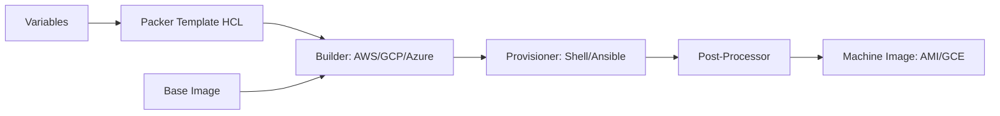

# Packer — A 2-Day Crash Course

> **In one sentence:** Packer bakes a fully-configured machine image (an AWS AMI, a Docker
> image, a VM template) from a definition file, so every server boots identical and ready —
> no configuration at launch time.

---

## Part 0 — Why Packer exists, and the idea of "immutable infrastructure"

There are two ways to get a configured server:
1. **Launch a blank server, then configure it** (run Ansible/scripts at boot). Every launch
   re-runs configuration, which is slow, can fail mid-way, and drifts over time as servers are
   patched in place. This is **mutable** infrastructure.
2. **Bake a complete image once, then launch identical copies of it.** Boot is instant (it's
   already configured), every instance is byte-identical, and you never modify a running
   server — you build a new image and replace it. This is **immutable** infrastructure.

Packer enables option 2. It's the "golden image" builder. Define what goes into the image once;
Packer spins up a temporary build instance, provisions it (installs your software), snapshots it
into a reusable image, and tears the build instance down.

**Why this matters for reliability:** immutable images make deployments predictable and
rollbacks trivial (just relaunch the previous image). No more "works on instance A but not B
because someone SSH'd in and changed it." It pairs perfectly with autoscaling (new instances
come up fully baked in seconds) and with Terraform (Packer builds the image, Terraform deploys
it).

**Mental model:** Packer is a factory that produces a *template*. The template (AMI, Docker
image, etc.) is then mass-produced into identical running instances by something else
(Terraform, an autoscaling group, Kubernetes). Packer's whole job is: take a base image + your
provisioning steps → output a finished, reusable image.

---




## Part 1 — The vocabulary

| Term | Meaning |
|------|---------|
| **Template** | The HCL file describing the build (`.pkr.hcl`) |
| **Builder / Source** | What kind of image to make + on which platform (amazon-ebs, docker, qemu) |
| **Provisioner** | How to configure the temporary instance (shell, ansible, file) |
| **Post-processor** | What to do with the artifact afterward (tag, push, compress) |
| **Artifact** | The finished image Packer produces (e.g. an AMI ID) |

Packer and Ansible are complementary, not competitors: Packer *builds the image*; Ansible (or
shell) is often the *provisioner inside* the Packer build that does the actual configuration.

---

## DAY 1 — Get it working

### 1. Install & the workflow shape
```bash
packer version
```
Every Packer run is three phases: pick a **source** (base image + platform) → run
**provisioners** (configure it) → optionally run **post-processors** (tag/push). The output is
an artifact you reference elsewhere.

### 2. Your first template
`web.pkr.hcl`:
```hcl
packer {
  required_plugins {
    amazon = { source = "github.com/hashicorp/amazon", version = "~> 1" }
  }
}

source "amazon-ebs" "web" {          # BUILDER: make an EBS-backed AMI on AWS
  region        = "us-east-1"
  instance_type = "t3.micro"
  source_ami_filter {                # base image to start from
    filters = { name = "ubuntu/images/*22.04*", virtualization-type = "hvm" }
    owners      = ["099720109477"]
    most_recent = true
  }
  ssh_username = "ubuntu"
  ami_name     = "web-{{timestamp}}"  # unique name per build
}

build {
  sources = ["source.amazon-ebs.web"]

  provisioner "shell" {              # configure the temporary instance
    inline = [
      "sudo apt-get update",
      "sudo apt-get install -y nginx",
      "sudo systemctl enable nginx",
    ]
  }
}
```

### 3. Validate and build
```bash
packer init web.pkr.hcl       # install the required plugins (once)
packer fmt web.pkr.hcl        # format
packer validate web.pkr.hcl  # check the template is valid
packer build web.pkr.hcl     # DO IT: launch temp instance, provision, snapshot, clean up
```
Watch the output: Packer launches an instance, SSHes in, runs your provisioners, creates the
AMI, and **terminates the temporary instance**. At the end it prints the artifact — your new
AMI ID. That AMI now boots with nginx already installed.

### 4. Understand what just happened (the lifecycle)
```
packer build
  1. Launches a temporary instance from the source/base image
  2. Waits for SSH/WinRM connectivity
  3. Runs provisioners in order (shell, file, ansible...) to configure it
  4. Stops the instance and snapshots it into an image (AMI / Docker image / etc.)
  5. Runs post-processors (tag, push, manifest)
  6. Terminates the temporary instance — you pay only for build time
  7. Outputs the artifact ID
```

**By end of Day 1 you can:** define a source, provision it with shell commands, and build a
reusable image. That alone replaces a lot of fragile boot-time scripting.

### 5. Useful provisioners
```hcl
provisioner "file" {                 # copy files into the image
  source      = "app/"
  destination = "/opt/app"
}
provisioner "shell" {
  scripts = ["scripts/install.sh", "scripts/harden.sh"]
}
provisioner "ansible" {              # run an Ansible playbook against the build instance
  playbook_file = "playbook.yml"
}
```

---

## DAY 2 — Make it real

### 1. Variables for reusable, parameterized templates
```hcl
variable "region"        { type = string  default = "us-east-1" }
variable "app_version"   { type = string }

source "amazon-ebs" "web" {
  region   = var.region
  ami_name = "web-${var.app_version}-{{timestamp}}"
  # ...
}
```
```bash
packer build -var "app_version=1.4.2" web.pkr.hcl
packer build -var-file="prod.pkrvars.hcl" web.pkr.hcl
```

### 2. Multiple parallel builds (multi-cloud / multi-arch)
One `build` block can list several sources, and Packer builds them **in parallel** — e.g. the
same configuration baked into an AWS AMI *and* a Docker image, or amd64 *and* arm64:
```hcl
build {
  sources = [
    "source.amazon-ebs.web",
    "source.docker.web",
  ]
  provisioner "shell" { inline = ["./install.sh"] }   # same provisioning for all
}
```

### 3. Post-processors — what to do with the artifact
```hcl
post-processor "docker-tag" {
  repository = "ghcr.io/org/web"
  tags       = ["latest", var.app_version]
}
post-processor "docker-push" {}
# or write a manifest of all built artifacts:
post-processor "manifest" { output = "manifest.json" }
```
The `manifest` post-processor is especially useful — it records the resulting AMI IDs so your
Terraform pipeline can pick them up automatically.

### 4. The golden-image pipeline (how this fits the bigger picture)
```text
Packer build  ->  new AMI/image  ->  manifest.json (the new image ID)
      |                                       |
   (CI runs on a schedule or                  v
    on app release)                  Terraform reads the AMI ID and
                                     rolls it out to an autoscaling group
                                     (instance refresh) — zero-touch servers
```
This is the standard, production-grade pattern: Packer produces immutable images, Terraform
deploys them, autoscaling replaces old instances with new ones. No SSH, no in-place patching.

### 5. Image hygiene & hardening (bake it in)
Because the image is immutable and reused, do security and cleanup in the build:
- Update packages, install only what's needed, then clean caches (`apt-get clean`).
- Remove SSH host keys, build credentials, and temp files before the snapshot.
- Run a hardening provisioner (CIS benchmarks) so every instance is secure by default.
- Tag images with the source commit/version for traceability.

---

## Worked example — versioned web AMI for an autoscaling group
```text
1. web.pkr.hcl: amazon-ebs source from Ubuntu 22.04, ami_name "web-${var.app_version}-{{timestamp}}".
2. provisioner "ansible" runs your existing webserver role (reuse Ansible — see Ansible.md).
3. post-processor "manifest" writes the new AMI ID to manifest.json.
4. CI: packer init && packer validate && packer build -var app_version=$TAG web.pkr.hcl
5. CI reads manifest.json -> updates a Terraform variable with the new AMI ID.
6. terraform apply -> launch template updated -> ASG instance refresh rolls in new instances.
7. Roll back? Point the launch template at the previous AMI and refresh again.
```

---

## Common pitfalls
- **Treating Packer as a deploy tool.** It only *builds images*. Deploying/launching them is
  Terraform's / the ASG's job. Don't conflate the two.
- **Not cleaning up before the snapshot.** Leftover credentials, SSH keys, package caches, and
  logs get baked into every instance forever. Clean up in a final provisioner.
- **Forgetting `packer init`.** New plugin-based templates need it before build, or you get
  "plugin not found."
- **No unique `ami_name`.** Builds collide. Use `{{timestamp}}` or a version in the name.
- **Slow builds from doing too much at boot still.** The point is to bake config *into* the
  image, not leave it for launch time. If instances still run heavy config at boot, move it
  into the Packer build.
- **Manual edits to running instances.** Immutable means immutable — change the template and
  rebuild, never SSH in to "fix" a live box.

---

## Quick command reference
```bash
packer version
packer init <template>.pkr.hcl       # install required plugins
packer fmt <template>.pkr.hcl        # format
packer validate <template>.pkr.hcl   # validate syntax/config
packer build <template>.pkr.hcl      # build the image(s)
packer build -var "k=v" <t>          # pass a variable
packer build -var-file=prod.pkrvars.hcl <t>
packer build -only="amazon-ebs.web" <t>   # build just one source
packer build -on-error=ask <t>       # pause on failure to debug the build instance
PACKER_LOG=1 packer build <t>        # verbose debug logging
packer inspect <template>.pkr.hcl    # show variables/builders/provisioners
```

### Block types
`packer {}` (config/plugins) · `source "<builder>" "<name>" {}` · `build { sources = [...] }` ·
`provisioner "<type>" {}` (shell, file, ansible, powershell) ·
`post-processor "<type>" {}` (docker-tag/push, manifest, compress) · `variable {}` · `locals {}`.

---


## Top 10 Interview Questions

<details>
<summary><strong>Q: What is Packer and why would you build custom machine images?</strong></summary>

Packer automates the creation of identical machine images (AMIs, GCE images, VirtualBox VMs) from a single configuration. Build custom images to: bake application code and dependencies into the image (faster boot — no post-launch provisioning), ensure consistency (every instance starts from the same tested image), improve security (pre-hardened images with patches applied), and reduce deployment time (AMI swap vs configuration management on launch). The tradeoff: image building takes minutes, but instance launch takes seconds.

</details>

<details>
<summary><strong>Q: How does the Packer build pipeline work?</strong></summary>

Packer reads a template (HCL or JSON), launches a temporary instance using a Builder (AWS, GCP, Docker, etc.), runs Provisioners (shell scripts, Ansible playbooks, Chef cookbooks) to install and configure software, then captures the instance as a machine image and terminates the temporary instance. Post-processors can compress, upload, or tag the resulting image. The key: the build happens once, and the resulting image is immutable — every instance launched from it is identical.

</details>

<details>
<summary><strong>Q: What is the immutable infrastructure pattern and how does Packer enable it?</strong></summary>

Immutable infrastructure means servers are never modified after deployment — instead of patching a running server, you build a new image with the patch, deploy new instances from the new image, and terminate the old instances. Packer enables this by making image creation fast, automated, and repeatable. Benefits: no configuration drift (images are identical), easy rollback (switch back to the previous image), and simpler debugging (the image on disk is the image that was tested). This pairs naturally with auto-scaling groups and blue-green deployments.

</details>

<details>
<summary><strong>Q: How do you test Packer images before deploying to production?</strong></summary>

Build the image in CI, launch a test instance from the new image, run automated tests: InSpec/ServerSpec (verify installed packages, running services, file permissions, security hardening), integration tests (start the application, hit health endpoints), and security scans (Trivy for vulnerabilities, CIS benchmarks). Only promote the image to production if all tests pass. Use a staging environment that mirrors production. Tag images with build metadata (git commit, build number) for traceability.

</details>

<details>
<summary><strong>Q: How do you manage Packer templates in a multi-cloud environment?</strong></summary>

Use HCL2 templates with multiple source blocks — one for AWS, one for GCP, one for Azure — sharing the same provisioner steps. Variables parameterize cloud-specific values (region, base image ID, instance type). Build all images in parallel with packer build . (Packer runs builders concurrently). Store templates in version control, run builds in CI, and publish images to each cloud's image registry. Use data sources to dynamically find the latest base image (e.g., latest Ubuntu AMI).

</details>

<details>
<summary><strong>Q: How does Packer integrate with configuration management tools?</strong></summary>

Packer provisioners can run: shell scripts (simplest), Ansible playbooks (most popular — ansible-local provisioner avoids SSH overhead), Chef cookbooks (chef-solo provisioner), Puppet manifests, or Salt states. The provisioner installs software and configures the image during build time. Best practice: use the same Ansible playbook that would configure a running server, but run it during image build instead. This lets you test the same configuration in both mutable (Ansible pull) and immutable (Packer bake) modes.

</details>

<details>
<summary><strong>Q: What are multi-build templates and when should you use them?</strong></summary>

HCL2 templates support multiple source blocks, allowing one template to build images for multiple platforms (AWS + GCP + Docker) in parallel. Use multi-build when: you deploy the same application to multiple clouds, you need Docker images for development and AMIs for production, or you build both x86 and ARM images. Each source can have its own builder config while sharing provisioner steps. This reduces duplication and ensures all image variants are consistent.

</details>

<details>
<summary><strong>Q: How do you handle secrets during Packer builds?</strong></summary>

Never bake secrets into images — they persist in the image and are extractable. Pass secrets at runtime via: environment variables (from CI secrets), EC2 instance metadata/IAM roles, or Vault integration. For build-time secrets (e.g., pulling packages from a private registry): use Packer's sensitive variable feature, pass credentials via environment variables, and ensure they are not logged. Use a post-processor to strip build artifacts (SSH keys, temp files) from the final image. Audit images with tools like Trivy to verify no secrets are embedded.

</details>

<details>
<summary><strong>Q: How do you optimise Packer build times?</strong></summary>

Start from a pre-configured base image (instead of a vanilla OS image — layer your builds), use the amazon-ebs builder with fast instance types for faster provisioning, parallelise builds (multi-source templates), use package caching (apt-cacher-ng or local mirrors), minimise provisioner steps (combine shell commands into a single script), and use spot instances for builds (cheaper, acceptable for ephemeral build instances). Cache frequently used AMIs as base images and rebuild incrementally.

</details>

<details>
<summary><strong>Q: What is the relationship between Packer and Terraform?</strong></summary>

Packer builds machine images; Terraform provisions infrastructure using those images. Workflow: Packer builds an AMI, outputs the AMI ID, Terraform references the AMI ID in an aws_instance resource. Automate: Packer build in CI produces a new AMI, updates a Terraform variable or SSM parameter, Terraform apply deploys instances with the new AMI. They complement each other: Packer handles what is inside the instance, Terraform handles everything around it (network, load balancer, database, DNS).

</details>

---

## Next steps after Day 2
- **HCP Packer** for image metadata, versioning, and tracking which images are in use.
- Multi-arch (arm64) and multi-cloud builds from one template.
- Integrate with **Terraform** (consume the manifest) and **Ansible** (as the provisioner).
- Schedule weekly rebuilds so security patches flow into images automatically.

## Recommended learning resources

**YouTube channels & playlists:**
- [HashiCorp — Packer Tutorials](https://www.youtube.com/@HashiCorp) — official walkthroughs of HCL2 templates, multi-cloud builds, and HCP Packer
- [Ned in the Cloud — Packer and Immutable Infrastructure](https://www.youtube.com/@NedintheCloud) — practical deep dives into image pipelines and Terraform integration
- [TechWorld with Nana — Packer Crash Course](https://www.youtube.com/@TechWorldwithNana) — beginner-friendly introduction to image baking concepts
- [KodeKloud — Packer](https://www.youtube.com/@KodeKloud) — hands-on labs covering builders, provisioners, and post-processors
- [Spacelift — Immutable Infrastructure Patterns](https://www.youtube.com/@spacelift-io) — Packer in the context of modern IaC workflows

**Official docs & blogs:**
- [Packer Documentation](https://developer.hashicorp.com/packer/docs) — builder, provisioner, and post-processor reference
- [HashiCorp Blog — Packer](https://www.hashicorp.com/blog/products/packer) — release notes, HCP Packer features, and image management patterns

**The mantra:** bake once, run many; never patch a running server. Packer builds the immutable
image; Terraform and autoscaling deploy and replace it.
