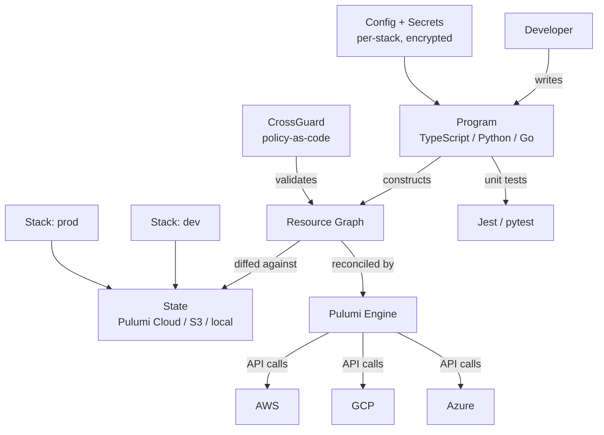

# Pulumi — A 2-Day Crash Course

> **In one sentence:** Pulumi is infrastructure as code like Terraform, but you write it in a
> real programming language (TypeScript, Python, Go, C#) instead of a custom config language —
> so you get loops, functions, classes, tests, and your IDE.

> Helpful prerequisite: read `Terraform.md` first. Pulumi shares Terraform's core model
> (declarative desired state + state + preview/up), so this focuses on what's different.

---

## Part 0 — Why Pulumi exists

Terraform's HCL is a purpose-built configuration language. It's great until you hit its limits:
complex conditionals get awkward, abstraction is limited, and you can't use the testing tools,
package managers, and IDE support you already know. Pulumi's bet is: **infrastructure is just
code, so use a real programming language.**

The payoff: you express infrastructure with normal language constructs — `for` loops, `if`,
functions, classes, async, your editor's autocomplete and type-checking, real unit tests, and
the npm/pip ecosystem. The same declarative, state-tracked, preview-before-apply model as
Terraform, but written in a language with full power.

**The crucial nuance — it's still declarative.** This trips people up. You're writing Python or
TypeScript, but you're *not* writing an imperative script that calls cloud APIs. Your program
*declares* a graph of resources by constructing objects; Pulumi's engine then diffs that graph
against state and reconciles. The code runs to *build the description*, then the engine does the
work. Think "the language is the templating engine," not "I'm scripting API calls."

**Mental model:** Same as Terraform (desired state vs state, preview then apply) — but the
desired state is produced by *running your program*, where each `new Resource(...)` you
construct becomes a node in the dependency graph.



---

## Part 1 — The vocabulary (and the Terraform translation)

| Pulumi term | Meaning | Terraform equivalent |
|-------------|---------|----------------------|
| **Project** | A directory with `Pulumi.yaml` + your code | A root module |
| **Stack** | An isolated instance/environment of a project (dev, prod) | Workspace / state |
| **Resource** | A cloud object you construct (`new aws.s3.Bucket(...)`) | `resource` block |
| **Input / Output** | Values flowing in/out of resources (Outputs are *async*) | argument / attribute |
| **`pulumi up`** | Preview + apply changes | `terraform plan` + `apply` |
| **Config** | Per-stack settings/secrets (`pulumi config set`) | variables / tfvars |

The one genuinely new concept is **Outputs**: a resource attribute (like a bucket's ARN) isn't
known until the resource is created, so Pulumi represents it as an async `Output<T>`, not a
plain string. You can't just concatenate it — you use `.apply()` or interpolation helpers
(covered Day 2). Understanding Outputs is the main learning curve.

---

## DAY 1 — Get it working (examples in TypeScript & Python)

### 1. Install & create a project
```bash
pulumi version
pulumi login                       # state backend: Pulumi Cloud (free tier) or self-managed (S3, etc.)
mkdir infra && cd infra
pulumi new aws-typescript          # scaffolds a project + first stack (also: aws-python, aws-go)
```
This creates `Pulumi.yaml` (project), `Pulumi.dev.yaml` (the `dev` stack's config), and an
entry file (`index.ts` / `__main__.py`) with a working example.

### 2. Your first resources
**TypeScript** (`index.ts`):
```typescript
import * as aws from "@pulumi/aws";

const bucket = new aws.s3.Bucket("demo", {
  tags: { Env: "dev" },
});

export const bucketName = bucket.id;   // a stack OUTPUT (shown after `up`)
```
**Python** (`__main__.py`):
```python
import pulumi
import pulumi_aws as aws

bucket = aws.s3.Bucket("demo", tags={"Env": "dev"})

pulumi.export("bucket_name", bucket.id)   # a stack output
```
Each `new aws.s3.Bucket(...)` / `aws.s3.Bucket(...)` *declares* a resource. The first argument
is Pulumi's logical name (must be unique in the stack); the second is the cloud properties.

### 3. The core loop
```bash
pulumi preview     # show what WILL change (like terraform plan)
pulumi up          # preview, then apply on confirmation
pulumi stack output bucket_name   # read an exported output
pulumi destroy     # tear down everything in the stack
```
`pulumi up` shows a colored diff (create/update/replace/delete) and asks before doing anything —
same safety model as Terraform. Run `pulumi up` again with no code change → "no changes."

**By end of Day 1 you can:** create a project/stack, declare resources in your language,
preview, deploy, read outputs, and destroy. The loop is `preview` → `up` → `destroy`.

---

## DAY 2 — Make it real

### 1. Use the language — this is the whole point
Loops and functions instead of `count`/`for_each` gymnastics:
```typescript
// create three buckets with a normal loop
const names = ["logs", "data", "backups"];
const buckets = names.map(n => new aws.s3.Bucket(n, {
  bucket: `myorg-${n}`,
}));

// a reusable function = your "module"
function makeBucket(name: string, versioned: boolean) {
  return new aws.s3.Bucket(name, {
    versioning: { enabled: versioned },
  });
}
```
Conditionals are just `if`. Abstractions are just functions/classes. No new DSL to learn.

### 2. Outputs — the async-value gotcha
A resource attribute is an `Output<T>` (not known until created). You can't use it like a
string directly:
```typescript
// WRONG: bucket.id is an Output, not a string
// const url = "https://" + bucket.id;   // gives "[object]"

// RIGHT: transform with .apply(), or interpolate with pulumi.interpolate
const url = pulumi.interpolate`https://${bucket.bucketDomainName}`;
const arnUpper = bucket.arn.apply(a => a.toUpperCase());

// combine multiple outputs
const combined = pulumi.all([bucket.id, bucket.arn])
  .apply(([id, arn]) => `${id} / ${arn}`);
```
**Rule:** to *use* a value that comes from a resource, go through `.apply()` (or
`pulumi.interpolate` / `pulumi.all`). This is the #1 thing newcomers stumble on.

### 3. Config & secrets per stack
```bash
pulumi config set region us-east-1
pulumi config set dbName checkout
pulumi config set --secret dbPassword s3cr3t   # ENCRYPTED in the stack state
```
```typescript
const config = new pulumi.Config();
const region = config.require("region");
const dbPassword = config.requireSecret("dbPassword");   // stays encrypted; an Output
```
Secrets are encrypted in state automatically — a genuine advantage over plain Terraform state.
(Relevant to your habit of pasting secrets in plaintext: `--secret` config keeps them encrypted.)

### 4. Stacks = environments
```bash
pulumi stack init staging       # new isolated environment
pulumi stack init prod
pulumi stack select prod
pulumi config set instanceSize large   # per-stack config
pulumi up                                # deploys to the selected stack only
pulumi stack ls
```
Each stack has its own config and state. Branch behavior in code on the stack name:
```typescript
const env = pulumi.getStack();           // "prod" / "staging"
const size = env === "prod" ? "large" : "small";
```

### 5. Componentize (real modules = classes)
Group related resources into a reusable `ComponentResource`:
```typescript
class WebService extends pulumi.ComponentResource {
  constructor(name: string, args: { replicas: number }, opts?: pulumi.ComponentResourceOptions) {
    super("myorg:web:WebService", name, {}, opts);
    // create child resources here, parented to this component
  }
}
const web = new WebService("checkout", { replicas: 3 });
```
This is Pulumi's equivalent of a Terraform module, but with constructors, typing, and methods.

### 6. Testing (a Pulumi superpower)
Because it's real code, you can unit-test infrastructure with your normal test framework
(Jest, pytest), mocking the cloud provider — assert "every bucket has encryption enabled"
*before* deploying. Plus policy-as-code via **CrossGuard** to enforce org rules in CI.

---

## Worked example — multi-env service
```text
1. pulumi new aws-typescript
2. Write a WebService ComponentResource (instances + SG + LB) parameterized by replicas/size.
3. pulumi config set --secret dbPassword ...   (encrypted)
4. pulumi stack init staging; pulumi up        # deploy to staging
5. Write a jest test asserting all buckets are encrypted; run it in CI before up.
6. pulumi stack init prod; pulumi config set size large; pulumi up   # promote to prod
7. pulumi destroy on a stack to tear that environment down.
```

---

## Common pitfalls
- **Treating it as a script.** It's declarative. Don't expect line-by-line API calls; you're
  *building a resource graph* that the engine reconciles. Side-effecting code at the top level
  (random values, timestamps) causes spurious diffs.
- **Using Outputs as plain values.** `bucket.id` is an `Output<T>`. Use `.apply()` /
  `pulumi.interpolate` / `pulumi.all`. This is the single biggest beginner trap.
- **Reusing logical names / renaming carelessly.** The first-arg name identifies the resource
  in state; changing it makes Pulumi destroy+recreate. Use `aliases` to rename safely.
- **One stack for all environments.** Use separate stacks (dev/staging/prod) for isolation.
- **Not committing the lockfile / pinning providers.** Pin provider plugin versions for
  reproducibility, same as Terraform.
- **Forgetting which stack is selected.** `pulumi up` hits the *selected* stack — check with
  `pulumi stack` before deploying (the prod-vs-staging accident).

---

## Quick command reference
```bash
# Project / stack
pulumi login                       pulumi new <template>      # e.g. aws-python, gcp-typescript
pulumi stack init <name>           pulumi stack select <name>
pulumi stack ls                    pulumi stack output [NAME]
pulumi stack rm <name>

# Config / secrets
pulumi config set k v              pulumi config set --secret k v
pulumi config get k                pulumi config

# Deploy loop
pulumi preview                     pulumi up [-y]
pulumi refresh                     # reconcile state with reality
pulumi destroy [-y]
pulumi cancel                      # release a stuck update lock

# Import / inspect
pulumi import <type> <name> <id>   # adopt existing infra
pulumi stack export > state.json   pulumi stack import < state.json
pulumi about                       # environment/plugin info
```

### Output handling cheat
`output.apply(v => ...)` transform one · `pulumi.all([a,b]).apply(([a,b]) => ...)` combine ·
`pulumi.interpolate\`...${out}...\`` string-build · `config.requireSecret("k")` encrypted input.

---

## Top 10 Interview Questions

<details>
<summary><strong>Q: How does Pulumi differ from Terraform fundamentally?</strong></summary>

Both use a declarative desired-state model with state tracking and preview-before-apply. The key difference is the authoring layer: Terraform uses HCL (a purpose-built config language), while Pulumi uses real programming languages (TypeScript, Python, Go, C#). This gives you loops, functions, classes, type checking, IDE support, and your language's testing and package ecosystem — but the underlying reconciliation model is the same.

</details>

<details>
<summary><strong>Q: What are Outputs in Pulumi and why do they trip people up?</strong></summary>

An Output is an async value representing a resource attribute that is not known until the resource is created (like a bucket ARN). You cannot use it as a plain string — concatenation produces `[object]`. You must use `.apply()`, `pulumi.interpolate`, or `pulumi.all()` to transform or combine Outputs. This is the single biggest source of beginner confusion.

</details>

<details>
<summary><strong>Q: How does Pulumi handle secrets compared to Terraform?</strong></summary>

Pulumi encrypts secrets in state automatically when you use `pulumi config set --secret` or `config.requireSecret()`. Terraform stores all values in state as plaintext by default, requiring you to encrypt the state file externally or use a backend with server-side encryption. Pulumi's approach is more secure out of the box for sensitive configuration values.

</details>

<details>
<summary><strong>Q: What is a Pulumi Stack and how do you use stacks for multi-environment deployments?</strong></summary>

A Stack is an isolated instance of a Pulumi project with its own config and state — analogous to a Terraform workspace. You create one stack per environment (dev, staging, prod), set per-stack config values, and select the target stack before deploying. Your code can branch on `pulumi.getStack()` to adjust behaviour per environment.

</details>

<details>
<summary><strong>Q: How do you create reusable infrastructure components in Pulumi?</strong></summary>

You create a class extending `ComponentResource`. This groups related resources under a single logical parent with its own inputs, outputs, and encapsulation — equivalent to a Terraform module but with full OOP capabilities. Components can be published as packages (npm, pip) and shared across teams, with strong typing and IDE autocomplete.

</details>

<details>
<summary><strong>Q: Can you test Pulumi infrastructure code? How?</strong></summary>

Yes — this is a major advantage over HCL. You write unit tests with your language's standard framework (Jest for TypeScript, pytest for Python) by mocking the cloud provider. You can assert properties like "every S3 bucket has encryption enabled" before any deployment happens. For policy enforcement, Pulumi offers CrossGuard, which runs policy-as-code checks in CI.

</details>

<details>
<summary><strong>Q: What happens if you rename a resource's logical name in Pulumi?</strong></summary>

The first argument to every resource constructor is its logical name, which identifies it in state. Changing it makes Pulumi think the old resource was deleted and a new one must be created — a destroy-and-recreate. To rename safely without replacement, use the `aliases` resource option to tell Pulumi about the old name.

</details>

<details>
<summary><strong>Q: How does Pulumi's state management work?</strong></summary>

State can be stored in Pulumi Cloud (free tier available), self-managed backends (S3, GCS, Azure Blob, local file), or Pulumi Enterprise. Each stack has its own state file. Pulumi diffs the resource graph your program produces against the stored state and applies only the delta. Unlike Terraform, secrets in state are encrypted by default.

</details>

<details>
<summary><strong>Q: How would you migrate existing Terraform infrastructure to Pulumi?</strong></summary>

Pulumi provides `pulumi convert --from terraform` to translate HCL to your target language. For existing cloud resources already managed by Terraform, you use `pulumi import` to adopt them into Pulumi state without recreating them. You can also consume existing Terraform modules directly from Pulumi using the Terraform bridge, allowing incremental migration.

</details>

<details>
<summary><strong>Q: What is the Automation API and when would you use it?</strong></summary>

The Automation API lets you drive Pulumi programmatically from your own application code — no CLI required. You can build self-service platforms, custom deployment pipelines, or infrastructure provisioning APIs where users request resources through a UI and your backend creates stacks, sets config, and runs `up` behind the scenes. It turns infrastructure deployment into a library call.

</details>

---


## Quick Quiz

Test your understanding with these rapid-fire questions (answers hidden):

<details>
<summary>1. What is the ONE core problem that Pulumi solves?</summary>
Re-read Part 0 — the mental model section. If you can explain the "why" in one sentence, you understand the foundation.
</details>

<details>
<summary>2. Name the 3 most important terms from the vocabulary section.</summary>
Review Part 1. These are the building blocks every conversation about Pulumi uses.
</details>

<details>
<summary>3. What is the first thing you would set up on Day 1?</summary>
Check the Day 1 section — the very first hands-on step that gets you a working result.
</details>

<details>
<summary>4. What is the most common production pitfall with Pulumi?</summary>
Review the Common Pitfalls section. The first item listed is typically the most frequently encountered.
</details>

<details>
<summary>5. How does Pulumi compare to its closest alternative?</summary>
Check the Comparison Matrix below — focus on the key differentiating row.
</details>


## Comparison Matrix

| Dimension | Pulumi | Terraform | CDK |
|-----------|--------|-----------|-----|
| **Primary use case** | Core strength of Pulumi | Core strength of Terraform | Core strength of CDK |
| **Learning curve** | Moderate | Varies | Varies |
| **Community/ecosystem** | Active | Active | Growing |
| **Operational complexity** | Medium | Varies | Varies |
| **Best for** | See Part 0 | Different tradeoffs | Different tradeoffs |

> **How to read this matrix:** no tool wins on every dimension. Pick based on your specific constraints — team expertise, existing infrastructure, scale requirements, and compliance needs. The right choice is the one that fits your context, not the one with the most checkmarks.

## Next steps after Day 2
- **Automation API** — drive Pulumi from your own programs (self-service platforms, no CLI).
- **CrossGuard** policy-as-code to enforce standards in CI.
- Convert existing Terraform with `pulumi convert --from terraform`, or consume TF modules.
- Decide Pulumi vs Terraform for your team: Pulumi if you want real languages/testing and your
  team are developers; Terraform if you want the larger ecosystem and ops-friendly HCL. Both
  are excellent; many orgs standardize on one.

## Recommended learning resources

**YouTube channels & playlists:**
- [Pulumi — Official Channel](https://www.youtube.com/@PulumiTV) — tutorials, PulumiUp talks, and Automation API walkthroughs
- [DevOps Toolkit (Viktor Farcic) — Pulumi vs Terraform](https://www.youtube.com/@DevOpsToolkit) — practical comparisons and real-world IaC decision-making
- [Spacelift — Pulumi Overview](https://www.youtube.com/@spacelift-io) — IaC tool comparisons including Pulumi positioning
- [TechWorld with Nana — Infrastructure as Code](https://www.youtube.com/@TechWorldwithNana) — beginner-friendly IaC concepts that apply to Pulumi

**Official docs & blogs:**
- [Pulumi Documentation](https://www.pulumi.com/docs/) — language guides, provider reference, and Automation API docs
- [Pulumi Blog](https://www.pulumi.com/blog/) — tutorials, migration guides, and CrossGuard policy examples
- [Pulumi Examples Repository](https://github.com/pulumi/examples) — production-ready code samples across languages and clouds

**The mantra:** real language, same declarative model. Resources are a graph you construct;
attributes are async Outputs you `.apply()`; stacks are environments. Preview, up, destroy.
