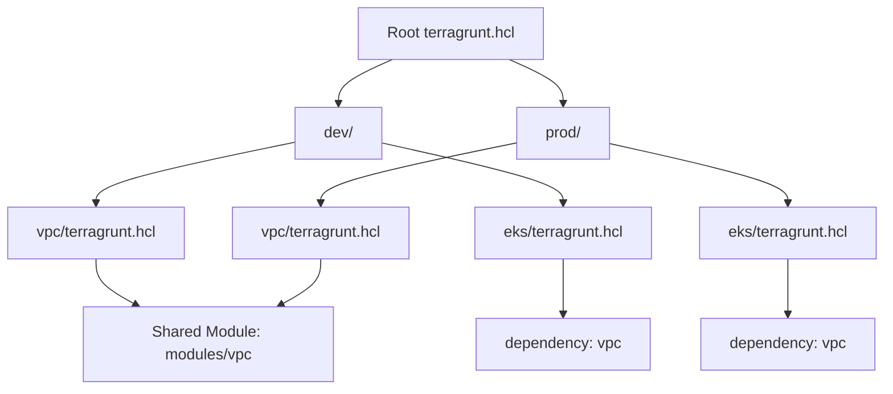

# Terragrunt — A 2-Day Crash Course

> **In one sentence:** Terragrunt is a thin wrapper around Terraform that keeps your configurations DRY, manages remote state automatically, and orchestrates multi-module deployments — it's the scaffolding that makes large-scale Terraform manageable. Prerequisite: know Terraform — see `Terraform.md`.

---

## Part 0 — Why Terragrunt exists

Terraform is powerful but its ergonomics break down at scale. The moment you have more than two environments, you run into the same three problems every time.

**Duplicated backend configuration.** Every module needs a `backend` block pointing to S3 (or GCS, or Azure Blob). That block contains a bucket name, a key path, a region, a DynamoDB table. Paste it into `dev/vpc`, `dev/eks`, `staging/vpc`, `staging/eks`, and you've already got eight copies of essentially the same config. Change the bucket name and you're doing find-and-replace archaeology.

**Copy-pasted module directories per environment.** The idiomatic solution is to have a directory per environment, each calling the same module. But those `main.tf` files end up being near-identical, differing only in a handful of variable values. You're maintaining boilerplate instead of infrastructure.

**No dependency ordering between modules.** Terraform doesn't know that your `eks` module depends on your `vpc` module unless they're in the same state file. Split them across state files for isolation, and you lose that guarantee. You end up running `terraform apply` in a specific order manually, or encoding it in a Makefile that nobody trusts.

Terragrunt solves all three. It generates backend config at apply time from a single root definition. It lets you write a `terragrunt.hcl` that's a few lines of `inputs = {}` with everything else inherited from a parent. And it reads explicit `dependency` blocks to build an apply order graph.

**Mental model:** if Terraform is a single Lego set, Terragrunt is the instruction manual for assembling multiple sets into a city — it tells you which set to build first, shares common settings, and keeps the pieces organized.

---




## Part 1 — The vocabulary

| Term | What it is |
|---|---|
| `terragrunt.hcl` | The config file Terragrunt reads. Lives alongside (or instead of) `terraform.tfvars`. One per module directory. |
| `include` | Merges a parent `terragrunt.hcl` into the current one. How hierarchy works — child inherits root remote_state, locals, and generate blocks. |
| `dependency` | Declares that the current module depends on another. Lets you read output values from the dependency's state. Drives `run_all` ordering. |
| `generate` | Writes a file to disk before running Terraform. Used to generate `backend.tf` or `provider.tf` dynamically. |
| `inputs` | A map of values passed as Terraform variables. Equivalent to `-var` or a `terraform.tfvars` file. |
| `run_all` | Terragrunt subcommand that walks a directory tree, respects `dependency` ordering, and runs a command across all modules. |
| `before_hook` / `after_hook` | Shell commands that run before or after a Terraform command. Useful for validation, linting, or notifications. |
| `remote_state` block | Declares the backend configuration. Terragrunt generates the `backend.tf` file from this. Defined once in the root, inherited everywhere. |
| `read_terragrunt_config` | Function that reads and parses another `terragrunt.hcl` at a given path. Used in root configs to pull in account-level or region-level variables. |

---

## DAY 1 — DRY Terraform

### 1. Install

```bash
# macOS
brew install terragrunt

# Linux — download binary directly
curl -Lo terragrunt https://github.com/gruntwork-io/terragrunt/releases/latest/download/terragrunt_linux_amd64
chmod +x terragrunt
sudo mv terragrunt /usr/local/bin/

# Verify
terragrunt --version
```

Terragrunt wraps Terraform. You still need Terraform installed. Terragrunt passes through every flag it doesn't own, so `terragrunt apply -var foo=bar` works exactly as you'd expect.

### 2. Wrapping a Terraform module

The simplest possible `terragrunt.hcl` is one line:

```hcl
terraform {
  source = "git::https://github.com/terraform-aws-modules/terraform-aws-vpc.git?ref=v5.1.0"
}
```

That `source` can be a registry module, a Git URL, or a relative local path:

```hcl
terraform {
  source = "../../../modules/vpc"
}
```

When you run `terragrunt plan`, Terragrunt copies the source into a `.terragrunt-cache` directory and runs `terraform plan` there. Your working directory stays clean.

### 3. Auto-generating backend config

Define the remote state once in a root `terragrunt.hcl`:

```hcl
# root terragrunt.hcl
remote_state {
  backend = "s3"

  config = {
    bucket         = "my-org-terraform-state"
    key            = "${path_relative_to_include()}/terraform.tfstate"
    region         = "us-east-1"
    encrypt        = true
    dynamodb_table = "terraform-locks"
  }

  generate = {
    path      = "backend.tf"
    if_exists = "overwrite_terragrunt"
  }
}
```

`path_relative_to_include()` resolves to the path of the calling module relative to the root. A module at `live/dev/vpc/terragrunt.hcl` gets the key `live/dev/vpc/terraform.tfstate`. Every module gets a unique state key automatically.

The `generate` block writes `backend.tf` into the Terraform working directory before `init`. You never write a `backend.tf` by hand again.

### 4. Inputs and variables

```hcl
# live/dev/vpc/terragrunt.hcl
include "root" {
  path = find_in_parent_folders()
}

terraform {
  source = "../../../modules/vpc"
}

inputs = {
  vpc_cidr           = "10.0.0.0/16"
  availability_zones = ["us-east-1a", "us-east-1b"]
  environment        = "dev"
}
```

`find_in_parent_folders()` walks up the directory tree until it finds a `terragrunt.hcl` — that's the root config. The `inputs` block maps directly to Terraform variables. No `terraform.tfvars` file needed.

### 5. Multi-environment layout

The canonical Terragrunt directory structure separates live infrastructure from reusable modules:

```
.
├── modules/
│   ├── vpc/
│   │   ├── main.tf
│   │   ├── variables.tf
│   │   └── outputs.tf
│   └── eks/
│       ├── main.tf
│       ├── variables.tf
│       └── outputs.tf
└── live/
    ├── terragrunt.hcl          ← root config: remote_state, generate provider
    ├── dev/
    │   ├── account.hcl         ← account-level locals (account_id, region)
    │   ├── vpc/
    │   │   └── terragrunt.hcl
    │   └── eks/
    │       └── terragrunt.hcl
    ├── staging/
    │   ├── account.hcl
    │   ├── vpc/
    │   │   └── terragrunt.hcl
    │   └── eks/
    │       └── terragrunt.hcl
    └── prod/
        ├── account.hcl
        ├── vpc/
        │   └── terragrunt.hcl
        └── eks/
            └── terragrunt.hcl
```

Each environment directory is identical in structure. The module-level `terragrunt.hcl` files differ only in their `inputs`. The backend state paths are generated automatically.

### 6. terragrunt plan/apply

```bash
# Single module
cd live/dev/vpc
terragrunt plan
terragrunt apply

# Destroy
terragrunt destroy

# Pass Terraform flags through
terragrunt apply -target=aws_vpc.main
```

Terragrunt runs `terraform init` for you on the first run. If you update the source ref, run `terragrunt init --upgrade`.

---

**By end of Day 1 you can:**
- Install Terragrunt and wrap an existing Terraform module
- Define remote state once and have it applied everywhere via `include`
- Structure a multi-environment directory tree
- Run plan and apply for a single module with auto-generated backend config

---

## DAY 2 — Make it real

### 1. Dependency blocks and run_all

`dependency` lets one module consume outputs from another:

```hcl
# live/dev/eks/terragrunt.hcl
include "root" {
  path = find_in_parent_folders()
}

terraform {
  source = "../../../modules/eks"
}

dependency "vpc" {
  config_path = "../vpc"

  mock_outputs = {
    vpc_id          = "vpc-00000000"
    private_subnets = ["subnet-00000000", "subnet-11111111"]
  }
  mock_outputs_allowed_terraform_commands = ["validate", "plan"]
}

inputs = {
  vpc_id          = dependency.vpc.outputs.vpc_id
  private_subnets = dependency.vpc.outputs.private_subnets
  cluster_version = "1.29"
}
```

`mock_outputs` lets `terragrunt validate` and `terragrunt plan` succeed even when the dependency hasn't been applied yet — useful in CI on feature branches.

`run_all` traverses a directory tree and runs a command across all modules, respecting `dependency` ordering:

```bash
# Apply all modules in dev, in dependency order
cd live/dev
terragrunt run-all apply

# Plan everything without applying
terragrunt run-all plan

# Destroy in reverse dependency order
terragrunt run-all destroy
```

`run_all` will error if it detects a cycle in your dependency graph.

### 2. Include and hierarchy — root, env, module

You can have multiple levels of `include`. A module can include a region-level config that itself uses root-level locals:

```hcl
# live/dev/us-east-1/vpc/terragrunt.hcl
include "root" {
  path   = find_in_parent_folders("root.hcl")
  expose = true
}

include "region" {
  path   = find_in_parent_folders("region.hcl")
  expose = true
}
```

`expose = true` makes the included config's locals accessible in the child via `include.root.locals.some_value`.

Keep the hierarchy shallow. Three levels (root → env → module) covers most real setups. Adding a fourth level (root → account → region → module) is warranted for multi-account AWS organizations.

### 3. Generating provider config

Rather than duplicating `provider "aws" {}` blocks, generate them:

```hcl
# root terragrunt.hcl
locals {
  account_vars = read_terragrunt_config(find_in_parent_folders("account.hcl"))
  account_id   = local.account_vars.locals.account_id
  aws_region   = local.account_vars.locals.aws_region
}

generate "provider" {
  path      = "provider.tf"
  if_exists = "overwrite_terragrunt"
  contents  = <<EOF
provider "aws" {
  region = "${local.aws_region}"

  assume_role {
    role_arn = "arn:aws:iam::${local.account_id}:role/TerraformRole"
  }
}
EOF
}
```

Every module that includes this root gets a provider configured to assume the correct role in the correct account. No provider block in any module directory.

### 4. Hooks

```hcl
terraform {
  source = "../../../modules/eks"

  before_hook "validate" {
    commands = ["apply", "plan"]
    execute  = ["terraform", "validate"]
  }

  after_hook "notify" {
    commands     = ["apply"]
    execute      = ["slack-notify", "apply complete: ${path_relative_to_include()}"]
    run_on_error = false
  }
}
```

Hooks run in the module's working directory (inside `.terragrunt-cache`). Use them sparingly — a hook that fails blocks the entire apply.

### 5. Working with monorepos

In a monorepo where infrastructure lives alongside application code, keep your `live/` tree at the repo root and your `modules/` tree nearby. Use `--terragrunt-working-dir` to target a specific path from CI without `cd`:

```bash
terragrunt run-all plan --terragrunt-working-dir live/dev
```

Use `.terragrunt-cache` in your `.gitignore`. It's regenerated on every run.

```
# .gitignore
**/.terragrunt-cache
**/.terraform
*.tfstate
*.tfstate.backup
```

### 6. CI/CD integration

A typical GitHub Actions job for Terragrunt (see `GitHub-Actions.md` for workflow fundamentals):

```yaml
- name: Terragrunt plan
  env:
    AWS_ACCESS_KEY_ID: ${{ secrets.AWS_ACCESS_KEY_ID }}
    AWS_SECRET_ACCESS_KEY: ${{ secrets.AWS_SECRET_ACCESS_KEY }}
  run: |
    cd live/${{ matrix.environment }}
    terragrunt run-all plan \
      --terragrunt-non-interactive \
      --terragrunt-parallelism 4
```

`--terragrunt-non-interactive` disables prompts. `--terragrunt-parallelism` controls how many modules run concurrently — keep it under 10 to avoid AWS API rate limits.

For apply, require manual approval between plan and apply steps. Never auto-apply `prod`.

### 7. Debugging — terragrunt render-json

When the config inheritance is hard to follow, render the fully-merged config for a module:

```bash
cd live/dev/vpc
terragrunt render-json
```

This writes `terragrunt-rendered.json` showing exactly what Terragrunt sees after all `include` merges and function evaluations. If your `inputs` aren't what you expect, start here.

For verbose logging:

```bash
terragrunt apply --terragrunt-log-level debug 2>&1 | less
```

### 8. Migration from plain Terraform

If you have existing Terraform state and want to adopt Terragrunt without disrupting anything:

1. Don't move state files. Terragrunt can target existing state — set `key` in `remote_state.config` to match the existing path exactly.
2. Add `terragrunt.hcl` files to each module directory. Use `inputs = {}` to replace `terraform.tfvars`.
3. Add a root `terragrunt.hcl` with `remote_state` and `generate "backend"`.
4. Run `terragrunt plan` in one module and verify the plan is empty (no changes).
5. Once confident, delete the hand-written `backend.tf` from each module.

Do not run `terragrunt run-all apply` during migration. Validate one module at a time.

---

## Worked example — Multi-account AWS setup

This is the structure you'll see in most mature AWS organizations using Terragrunt. Three accounts: management, dev, prod.

```
live/
├── root.hcl                    ← remote_state, generate provider, shared locals
├── management/
│   ├── account.hcl             ← account_id = "111111111111", region = "us-east-1"
│   └── us-east-1/
│       └── iam/
│           └── terragrunt.hcl
├── dev/
│   ├── account.hcl             ← account_id = "222222222222", region = "us-east-1"
│   └── us-east-1/
│       ├── vpc/
│       │   └── terragrunt.hcl
│       └── eks/
│           └── terragrunt.hcl
└── prod/
    ├── account.hcl             ← account_id = "333333333333", region = "us-east-1"
    └── us-east-1/
        ├── vpc/
        │   └── terragrunt.hcl
        └── eks/
            └── terragrunt.hcl
```

**root.hcl:**

```hcl
locals {
  account_vars = read_terragrunt_config(find_in_parent_folders("account.hcl"))
  account_id   = local.account_vars.locals.account_id
  aws_region   = local.account_vars.locals.aws_region
}

remote_state {
  backend = "s3"
  config = {
    bucket         = "my-org-tf-state-${local.account_id}"
    key            = "${path_relative_to_include()}/terraform.tfstate"
    region         = local.aws_region
    encrypt        = true
    dynamodb_table = "terraform-locks"
  }
  generate = {
    path      = "backend.tf"
    if_exists = "overwrite_terragrunt"
  }
}

generate "provider" {
  path      = "provider.tf"
  if_exists = "overwrite_terragrunt"
  contents  = <<EOF
provider "aws" {
  region = "${local.aws_region}"
  assume_role {
    role_arn = "arn:aws:iam::${local.account_id}:role/TerraformRole"
  }
}
EOF
}
```

**account.hcl** (per account, no `terragrunt {}` block — just locals):

```hcl
locals {
  account_id = "222222222222"
  aws_region = "us-east-1"
  env        = "dev"
}
```

**Module-level terragrunt.hcl** (dev eks):

```hcl
include "root" {
  path   = find_in_parent_folders("root.hcl")
  expose = true
}

terraform {
  source = "../../../../modules/eks"
}

dependency "vpc" {
  config_path = "../vpc"
  mock_outputs = {
    vpc_id          = "vpc-mock"
    private_subnets = ["subnet-mock-a", "subnet-mock-b"]
  }
  mock_outputs_allowed_terraform_commands = ["validate", "plan"]
}

inputs = {
  cluster_name    = "dev-cluster"
  cluster_version = "1.29"
  vpc_id          = dependency.vpc.outputs.vpc_id
  private_subnets = dependency.vpc.outputs.private_subnets
  environment     = include.root.locals.account_vars.locals.env
}
```

Each account has its own S3 bucket for state, its own DynamoDB table for locking, and its own IAM role that Terragrunt assumes. The module code is identical across environments — only the `inputs` and the assumed role differ.

For cross-account DNS or shared services, add a `dependency` that points to a path in a different account directory. Terragrunt will read that account's remote state to get the outputs.

---


## Terminal Demo

```terminal-demo
# terragrunt@infra ~ %

$ terragrunt --version
terragrunt version v0.55.13

$ tree environments/ -L 2
environments/
├── terragrunt.hcl          (root config: provider, backend)
├── production/
│   ├── vpc/terragrunt.hcl
│   ├── eks/terragrunt.hcl
│   ├── rds/terragrunt.hcl
│   └── redis/terragrunt.hcl
└── staging/
    ├── vpc/terragrunt.hcl
    ├── eks/terragrunt.hcl
    └── rds/terragrunt.hcl

$ cd environments/production && terragrunt run-all plan
INFO  Running command: terraform plan (vpc)
INFO  Running command: terraform plan (eks)
INFO  Running command: terraform plan (rds)
INFO  Running command: terraform plan (redis)

Group 1: vpc    — Plan: 0 to add, 0 to change, 0 to destroy.
Group 2: eks    — Plan: 0 to add, 1 to change, 0 to destroy.
Group 2: rds    — Plan: 0 to add, 0 to change, 0 to destroy.
Group 3: redis  — Plan: 1 to add, 0 to change, 0 to destroy.

$ terragrunt run-all apply --terragrunt-non-interactive
Group 1: vpc    — Apply complete! Resources: 0 added, 0 changed, 0 destroyed.
Group 2: eks    — Apply complete! Resources: 0 added, 1 changed, 0 destroyed.
Group 2: rds    — Apply complete! Resources: 0 added, 0 changed, 0 destroyed.
Group 3: redis  — Apply complete! Resources: 1 added, 0 changed, 0 destroyed.

$ cat environments/production/eks/terragrunt.hcl
include "root" {
  path = find_in_parent_folders()
}

dependency "vpc" {
  config_path = "../vpc"
}

inputs = {
  vpc_id     = dependency.vpc.outputs.vpc_id
  subnet_ids = dependency.vpc.outputs.private_subnet_ids
  cluster_version = "1.29"
  node_count = 5
}
```

---

## Common pitfalls

- **`.terragrunt-cache` in version control.** It's large, regenerated on every run, and will cause merge conflicts. Add it to `.gitignore` globally.

- **Circular dependencies in `run_all`.** If module A depends on B and B depends on A, `run_all` aborts. Break the cycle by extracting shared infrastructure into a third module that neither depends on.

- **`mock_outputs` masking real errors.** Mock outputs make `plan` succeed even when dependencies don't exist. If you ship a plan that used mocks and then apply it, the real outputs may differ. Always apply dependencies first in CI.

- **State key collisions.** If two modules generate the same `path_relative_to_include()` value, they share a state file — catastrophic. Keep your directory structure unique at every level.

- **`run_all apply` in production without review.** `run_all` applies modules in parallel up to `--terragrunt-parallelism`. In prod, run `run_all plan` first, review the output, then apply module by module or with explicit targeting.

- **Overwriting generated files.** If you manually create a `backend.tf` in a module directory and Terragrunt is set to `if_exists = "overwrite_terragrunt"`, your file wins — Terragrunt skips generation. Use `if_exists = "overwrite"` if you want Terragrunt to always win.

- **`find_in_parent_folders()` with no termination file.** If Terragrunt can't find a `terragrunt.hcl` in any parent, it errors. Keep your root config at the actual root of your live tree, not somewhere outside it.

- **Version drift between Terraform and Terragrunt.** Terragrunt releases track Terraform releases. Check the compatibility matrix — mismatches cause subtle, hard-to-diagnose errors. Pin both versions in CI.

---

## Quick command reference

```bash
# Single module operations
terragrunt init
terragrunt plan
terragrunt apply
terragrunt destroy
terragrunt output
terragrunt validate

# Pass Terraform flags through
terragrunt apply -target=aws_eks_cluster.main
terragrunt plan -var="cluster_version=1.30"

# Multi-module operations
terragrunt run-all init
terragrunt run-all plan
terragrunt run-all apply
terragrunt run-all destroy
terragrunt run-all output

# Scope run-all to a subtree
terragrunt run-all plan --terragrunt-working-dir live/dev

# Limit parallelism (default: 10)
terragrunt run-all apply --terragrunt-parallelism 3

# Non-interactive (CI)
terragrunt run-all apply --terragrunt-non-interactive

# Skip specific dependencies
terragrunt run-all apply --terragrunt-ignore-dependency-errors

# Debugging
terragrunt render-json
terragrunt plan --terragrunt-log-level debug

# Force re-init (after source change)
terragrunt init --upgrade

# Clear the cache
rm -rf .terragrunt-cache
```

⚠️ `run-all destroy` is irreversible. Always run `run-all plan` first and read the destroy plan carefully. In production, prefer targeted destroys.

---


## Top 10 Interview Questions

<details>
<summary><strong>Q: What is Terragrunt and what problems does it solve that Terraform alone cannot?</strong></summary>

Terragrunt is a thin wrapper around Terraform that provides: DRY configuration (share common settings across environments without copy-paste), remote state management (auto-configure S3 + DynamoDB backends), dependency management (define execution order between modules), and multi-environment support (dev/staging/prod from the same modules with different inputs). Terraform alone requires: duplicating backend configs across modules, manually ordering applies for dependent resources, and maintaining separate directories with copy-pasted provider/backend blocks.

</details>

<details>
<summary><strong>Q: How does Terragrunt keep Terraform configurations DRY?</strong></summary>

Terragrunt uses include blocks and generate blocks to share configuration. A root terragrunt.hcl defines common provider config, backend config, and shared inputs. Child directories include the root config and add only what is specific to their module. This eliminates: duplicated backend blocks (defined once in root), duplicated provider blocks (generated into each module), and duplicated input values (inherited from parent configs, overridden where needed). The result: each environment's terragrunt.hcl is 10-20 lines instead of 50-100 lines of duplicated Terraform.

</details>

<details>
<summary><strong>Q: How does Terragrunt handle cross-module dependencies?</strong></summary>

Use dependency blocks: eks/terragrunt.hcl declares dependency { config_path = '../vpc' } to depend on the VPC module. Terragrunt automatically runs vpc first when you run terragrunt run-all apply. Dependencies can read outputs: dependency.vpc.outputs.vpc_id passes the VPC ID from the vpc module to the eks module without hardcoding. This replaces: manual ordering of terraform apply commands, terraform_remote_state data sources (fragile, couples modules), and wrapper scripts for orchestration.

</details>

<details>
<summary><strong>Q: How do you structure a Terragrunt project for multiple environments?</strong></summary>

Recommended structure: root terragrunt.hcl (common config), environments as directories (dev/, staging/, prod/), each containing subdirectories per module (vpc/, eks/, rds/). Each module directory has a terragrunt.hcl that sources the shared Terraform module and provides environment-specific inputs. Shared Terraform modules live in a separate modules/ directory or Git repository. This structure gives: clear environment separation, minimal duplication, and independent state per module per environment.

</details>

<details>
<summary><strong>Q: How does Terragrunt manage remote state automatically?</strong></summary>

Define remote_state block in the root terragrunt.hcl with templated values: bucket name includes account ID and region, key uses path_relative_to_include() (auto-generates unique keys per module). Terragrunt automatically creates the S3 bucket and DynamoDB lock table if they do not exist. This eliminates: the chicken-and-egg problem (who creates the state bucket?), copy-pasted backend blocks, and manual state key management. Each module gets its own state file automatically, based on its directory path.

</details>

<details>
<summary><strong>Q: What is run-all and how do you use it safely?</strong></summary>

terragrunt run-all apply applies all modules in a directory tree respecting dependency order. terragrunt run-all plan previews all changes. Use --terragrunt-parallelism to control concurrency. Safety considerations: always run plan first and review the output, use --terragrunt-exclude-dir to skip specific modules, and be aware that run-all destroy processes modules in reverse dependency order. In production, run-all plan in CI for review, but consider applying critical modules individually for more control.

</details>

<details>
<summary><strong>Q: How does Terragrunt compare to Terraform workspaces for multi-environment management?</strong></summary>

Terraform workspaces use the same code with separate state files, switched via terraform workspace select. Limitations: all environments share the same directory (hard to have different module versions per environment), workspace name is the only differentiator (error-prone — applying to wrong workspace), and no dependency management between workspaces. Terragrunt uses separate directories per environment: different inputs, independent state, clear boundaries, and explicit dependency management. Most production teams prefer Terragrunt's directory-based approach for its clarity and safety.

</details>

<details>
<summary><strong>Q: How do you test Terragrunt configurations?</strong></summary>

Use Terratest (Go testing framework): write tests that run terragrunt apply, validate outputs, verify infrastructure, then terragrunt destroy. Test in a dedicated test account with unique resource naming (avoid collisions). Unit test individual modules with minimal inputs. Integration test the full stack (run-all apply on a test environment). Validate configuration without applying: terragrunt validate and terragrunt run-all validate. In CI: validate on every PR, apply to a test environment on merge, run Terratest periodically for regression.

</details>

<details>
<summary><strong>Q: How do you handle secrets and sensitive variables in Terragrunt?</strong></summary>

Never commit secret values to terragrunt.hcl files. Approaches: reference AWS SSM Parameter Store or Secrets Manager in inputs (data sources in the Terraform module fetch at plan time), use environment variables (TF_VAR_*), integrate with Vault via the Vault Terraform provider, or use sops-encrypted .yaml files decrypted at plan time. For the state backend: enable S3 bucket encryption and DynamoDB encryption at rest. Mark sensitive outputs with sensitive = true in Terraform to prevent logging.

</details>

<details>
<summary><strong>Q: When should you adopt Terragrunt versus native Terraform or Pulumi?</strong></summary>

Adopt Terragrunt when: you manage multiple environments with Terraform and are tired of duplication, you need cross-module dependency management, your team is already proficient in Terraform (Terragrunt adds minimal new concepts), or you want automated remote state management. Stick with native Terraform for: single-environment setups, small projects, or when you can use Terraform Cloud/Enterprise for state and workspace management. Choose Pulumi when: you prefer real programming languages over HCL and want richer abstractions than Terraform modules provide.

</details>

---


## Quick Quiz

Test your understanding with these rapid-fire questions (answers hidden):

<details>
<summary>1. What is the ONE core problem that Terragrunt solves?</summary>
Re-read Part 0 — the mental model section. If you can explain the "why" in one sentence, you understand the foundation.
</details>

<details>
<summary>2. Name the 3 most important terms from the vocabulary section.</summary>
Review Part 1. These are the building blocks every conversation about Terragrunt uses.
</details>

<details>
<summary>3. What is the first thing you would set up on Day 1?</summary>
Check the Day 1 section — the very first hands-on step that gets you a working result.
</details>

<details>
<summary>4. What is the most common production pitfall with Terragrunt?</summary>
Review the Common Pitfalls section. The first item listed is typically the most frequently encountered.
</details>

<details>
<summary>5. How does Terragrunt compare to its closest alternative?</summary>
Check the Comparison Matrix below — focus on the key differentiating row.
</details>


## Comparison Matrix

| Dimension | Terragrunt | TF Workspaces | Terramate |
|-----------|------------|---------------|-----------|
| **Primary use case** | Core strength of Terragrunt | Core strength of TF Workspaces | Core strength of Terramate |
| **Learning curve** | Moderate | Varies | Varies |
| **Community/ecosystem** | Active | Active | Growing |
| **Operational complexity** | Medium | Varies | Varies |
| **Best for** | See Part 0 | Different tradeoffs | Different tradeoffs |

> **How to read this matrix:** no tool wins on every dimension. Pick based on your specific constraints — team expertise, existing infrastructure, scale requirements, and compliance needs. The right choice is the one that fits your context, not the one with the most checkmarks.

## Next steps after Day 2

- `Terraform.md` — modules, state management, workspaces, and the primitives Terragrunt builds on
- `AWS.md` — IAM roles for Terraform, S3 backend setup, DynamoDB locking, multi-account organizations
- `GCP.md` — GCS backend config and service account authentication for Terragrunt on Google Cloud
- `GitHub-Actions.md` — CI/CD pipeline patterns: plan on PR, apply on merge, OIDC authentication to AWS/GCP/Azure without long-lived keys
- `Azure.md` — Azure Blob backend, service principal auth, and Terragrunt patterns for Azure subscriptions

---

## Recommended learning resources

**YouTube channels & playlists:**
- [Spacelift — Terragrunt Best Practices](https://www.youtube.com/@spacelift-io) — advanced patterns, DRY configurations, and Terragrunt vs plain Terraform
- [Ned in the Cloud — Terragrunt Deep Dives](https://www.youtube.com/@NedintheCloud) — practical walkthroughs of multi-account setups and dependency management
- [DevOps Toolkit (Viktor Farcic) — IaC at Scale](https://www.youtube.com/@DevOpsToolkit) — where Terragrunt fits in the broader IaC tooling landscape
- [TechWorld with Nana — Terraform Ecosystem](https://www.youtube.com/@TechWorldwithNana) — beginner-friendly Terraform concepts that Terragrunt builds on
- [HashiCorp — Terraform Patterns](https://www.youtube.com/@HashiCorp) — module design and state management patterns that inform Terragrunt usage

**Official docs & blogs:**
- [Terragrunt Documentation](https://terragrunt.gruntwork.io/docs/) — configuration reference, CLI commands, and migration guides
- [Gruntwork Blog](https://blog.gruntwork.io/) — IaC best practices, multi-account patterns, and Terragrunt architecture guides
- [Spacelift Blog — Terragrunt](https://spacelift.io/blog/terragrunt) — advanced Terragrunt patterns, CI/CD integration, and comparison guides

**The mantra:** One root config, many modules — Terragrunt's job is to make the hundredth environment as simple as the first.
