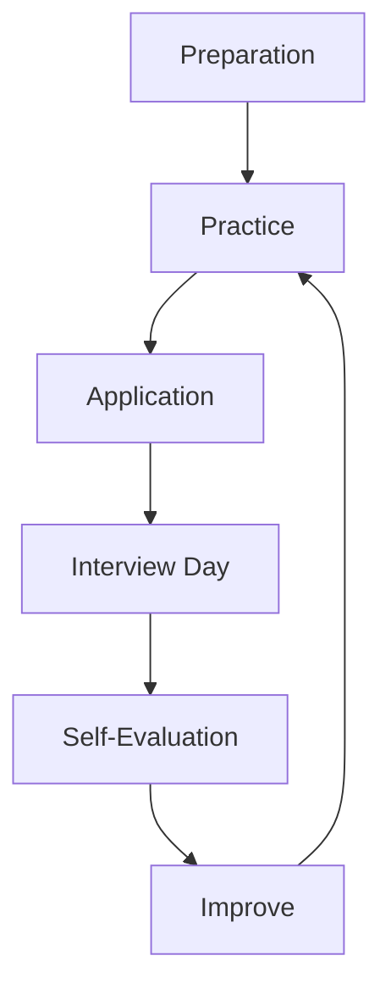

# Behavioral Interview — A 2-Day Crash Course

Behavioral interviews test how you've handled real situations — STAR method, leadership principles, conflict resolution, and the stories that prove you're the right hire.

---

## Part 0 — Why This Round Exists

Technical skills get you the interview. Behavioral answers get you the offer.

Every company at scale has made the same mistake: hired a brilliant engineer who couldn't communicate, couldn't work through conflict, or couldn't handle ambiguity without escalating. The behavioral round exists to filter for that. The interviewer isn't looking for perfection — they're looking for self-awareness, ownership, and evidence that you can work with other humans under pressure.

You are not being asked to be likable. You are being asked to be credible. The difference matters. Likable is vague; credible means your stories are specific, your impact is measurable, and your reflection is honest.

---

## Vocabulary

**STAR** — Situation, Task, Action, Result. The four-part structure every behavioral answer should follow. Situation sets context, Task clarifies your role, Action is where you spend most of your time, Result closes with measurable outcome and reflection.

**Leadership Principles (LP)** — Amazon's 16 named principles (Ownership, Bias for Action, Dive Deep, etc.) that interviewers map every question to. Other companies use different names but similar concepts.

**Conflict Resolution** — The ability to address disagreement directly, professionally, and early — without avoiding it or escalating unnecessarily.

**Growth Mindset** — Treating failure and setback as data, not identity. You learn from it, articulate what changed, and apply it forward.

**Impact** — The measurable downstream effect of your work: latency reduced by X%, revenue increased by $Y, team unblocked by Z days.

**Ownership** — Acting on problems that are technically outside your scope because they affect the outcome you're responsible for.

**Bias for Action** — Making a reasonable decision with 70% of the information rather than waiting for certainty that never arrives.

---




## DAY 1 — STAR Method + Story Bank

### The STAR Framework in Practice

Every behavioral answer has the same skeleton:

- **Situation** (10–15% of your answer): What was happening, who was involved, what was at stake. Be specific enough to be credible — vague context sounds fabricated.
- **Task** (5–10%): What were you personally responsible for. Distinguish between what the team owned and what you owned.
- **Action** (60–70%): This is the interview. Walk through what you specifically did — the decisions you made, the trade-offs you navigated, why you chose that path over alternatives. Use "I" not "we."
- **Result** (15–20%): What happened. Quantify where possible. Add a sentence of reflection — what you learned or would do differently.

The most common failure mode is spending too long on Situation and too little on Action. Interviewers want to see your reasoning process, not a project history.

### Building Your Story Bank

You need 8–10 distinct stories that you can adapt across multiple questions. Each story should be rich enough to answer 3–4 different question types. A story about leading a migration under a tight deadline can answer questions about leadership, handling ambiguity, working under pressure, and technical decision-making.

**Story Bank Template:**

| # | Project/Event | What happened | Themes it covers | Result (quantified) |
|---|---------------|---------------|-----------------|---------------------|
| 1 | | | | |
| 2 | | | | |
| 3 | | | | |
| 4 | | | | |
| 5 | | | | |
| 6 | | | | |
| 7 | | | | |
| 8 | | | | |

Choose stories that span:
- Different time periods (not all from the last 6 months)
- Different types of challenges (technical, interpersonal, organizational)
- Both successes and genuine failures
- Solo contributions and collaborative wins

### The Themes Interviewers Probe

**Leadership** — "Tell me about a time you led a project without formal authority." They want evidence you can influence, align, and unblock — not just manage.

**Conflict** — "Describe a time you disagreed with a teammate / manager / stakeholder." They want to see that you addressed it directly rather than passively or aggressively.

**Failure** — "Tell me about your biggest professional mistake." They want genuine ownership and demonstrable learning — not a humble-brag dressed as failure.

**Ambiguity** — "Describe a time you had to move forward without complete information." They want to see judgment, not paralysis.

**Impact** — "What's the most significant technical contribution you've made?" They want scale, specificity, and your role in it.

**Teamwork** — "Tell me about a time you helped a struggling teammate." They want empathy and concrete support, not platitudes.

**Ownership** — "Tell me about a time you went beyond your role." They want evidence that you treat organizational boundaries as flexible when the mission demands it.

### Quantifying Results

If you don't quantify, your story sounds like everyone else's. Work backward from the impact:

- Latency: "reduced p99 latency from 800ms to 120ms"
- Reliability: "brought error rate from 2.3% to 0.05%"
- Velocity: "cut deploy cycle from 3 days to 4 hours"
- Cost: "saved $180K/year by migrating to spot instances"
- People: "mentored 3 engineers who each shipped independently within 2 months"
- Scope: "coordinated across 5 teams and 3 time zones"

If you genuinely don't have a number, use a relative proxy: "went from being the team's highest-risk service to the one with the best uptime track record."

⚠️ Don't fabricate numbers. Interviewers at senior levels will probe the math.

---

## DAY 2 — Company-Specific Prep + Delivery

### Amazon — Leadership Principles

Amazon interviewers are explicitly trained to map every answer to an LP. Before your interview, review all 16 principles and mentally tag which of your stories maps to each one. Common ones probed:

- **Customer Obsession** — start with the customer, not the technology
- **Ownership** — "That's not my job" is not acceptable
- **Invent and Simplify** — not just novel, but simpler
- **Bias for Action** — decisive under ambiguity
- **Dive Deep** — leaders stay connected to detail
- **Disagree and Commit** — voice your disagreement, then execute fully once a decision is made
- **Deliver Results** — outcomes over effort

Amazon uses a bar raiser — an interviewer from outside the hiring team whose job is to maintain the caliber of hires. Prepare your best stories for them. Bar raisers probe harder on ownership, judgment under pressure, and whether you've operated above your level.

### Google — Googliness and Role-Related Knowledge

Google's behavioral questions often probe "Googliness" — a loose term for intellectual humility, comfort with ambiguity, doing the right thing even when no one is watching, and passion for the work. They also run a structured interview loop with role-related knowledge (RRK) questions that blur technical and behavioral. Prepare stories that show you reason from first principles rather than pattern-match from rules.

### Meta and Apple

Meta asks behavioral questions through the lens of impact and growth. They want to see that you default to measurable outcomes and that you actively invest in getting better. Apple's behavioral round emphasizes craft, attention to detail, and the ability to push back respectfully when quality is at risk. At Apple, a story about slowing down to get something right will land better than a story about moving fast and fixing later.

### The 90-Second Pitch — "Tell Me About Yourself"

This is the one question you will always get and the one most people waste. Structure it in three beats:

1. **Where you've been** (1–2 sentences): current role and what you own.
2. **What you've done** (2–3 sentences): the most relevant thread of your work — focused on the type of problem, not an exhaustive list.
3. **Why you're here** (1 sentence): what draws you to this role specifically — honest and specific, not "I admire your culture."

Practice this until it runs at exactly 90 seconds. It sets the frame for the entire interview.

### Handling "Tell Me About a Time You Failed"

This question has two failure modes:

1. Picking something trivial (a project ran two days late) — signals low self-awareness.
2. Picking something catastrophic without ownership — signals you haven't grown.

The right move: pick a real failure with real consequences, own your role in it without deflecting to external factors, and show specifically what changed in how you work as a result. The reflection is the whole point.

Bad version: "We had a production outage because infrastructure wasn't scaled. I alerted the team and we fixed it."

Better version: "I pushed a schema migration without a rollback plan because I was moving fast. It caused 40 minutes of data-layer downtime. I own the fact that I skipped the review checklist I helped write. After that, I built automated migration safety checks into our CI pipeline and ran a postmortem that became our standard process."

### Red Flags to Avoid

- Using "we" throughout — the interviewer wants to know what you did, not the team.
- No reflection — ending on the result without saying what you learned signals low growth orientation.
- Blame — attributing failure entirely to external forces or other people.
- Vague language — "things improved," "the team was happier," "it went well."
- Negativity about past employers — demonstrates poor judgment, not candor.
- Scripted-sounding answers — over-rehearsed answers feel hollow. Know your stories, not scripts.

### Questions to Ask the Interviewer

Good questions signal engagement, judgment, and genuine interest. Avoid questions whose answers are on the company's website.

Ask things like:
- "What does success look like in the first 6 months in this role?"
- "What's the hardest part of working on this team that doesn't show up in the job description?"
- "How does this team handle disagreement on technical direction?"
- "What's one thing you'd change about how this team operates if you could?"

These questions also give you real signal about whether you want to work there.

### Senior and Staff-Level Behavioral Expectations

At senior and staff level, the bar shifts. Individual contribution stories are necessary but not sufficient. Interviewers expect:

- **Scope**: your impact should span teams, systems, or the organization — not just your own service.
- **Influence without authority**: evidence that you shaped decisions, changed minds, or aligned stakeholders without a reporting line.
- **Technical and cultural leadership**: you raised the quality of those around you, not just the code you wrote.
- **Strategy alongside execution**: you can connect a technical decision to a business outcome.
- **Sponsoring others**: you've invested in the growth of junior engineers in a concrete, measurable way.

If you're interviewing at staff level or above, audit each story in your bank for whether it demonstrates these dimensions. Promote the ones that do; retire the ones that only show individual execution.

---

## Worked Example — "Tell Me About a Time You Disagreed With Your Manager"

This question is probing conflict resolution, psychological safety, and your ability to disagree and commit.

### Bad Version

"My manager wanted to use a message queue for an async workflow. I didn't think it was the right call. I raised it in a team meeting but the manager went with their decision anyway. We implemented it and it worked fine."

Why it fails: no specifics, no evidence of direct communication, no impact, passive framing, no learning.

---

### Good Version

**Situation:** We were designing a new notification pipeline that would handle roughly 50,000 events per hour. My manager had decided we should use RabbitMQ because we already had operational familiarity with it.

**Task:** I was the tech lead on the pipeline. I had serious reservations about choosing RabbitMQ given that our team had just committed to consolidating infrastructure on Kafka for all streaming use cases. This felt like it would create a second system to operate with different failure modes.

**Action:** I didn't raise it in the group design review because I wanted to be direct with her first. I asked for 30 minutes and prepared a one-page comparison — not to win an argument, but to surface the trade-offs clearly. I acknowledged the real upside of her position: the team knew RabbitMQ and we had a tight timeline. My case was about total cost of ownership and the 18-month operational complexity we'd take on. I asked if we could get one more team's input since they'd been operating Kafka at our scale for two years.

**Result:** She agreed to the additional consult. After a 45-minute call with the other team, she shifted her position. We went with Kafka. The pipeline shipped two weeks later and has been operationally stable for 14 months. More importantly, she told me afterward that she appreciated that I came to her directly and had done the work rather than just raising an objection.

**Reflection:** I learned that disagreement lands better when you do the work to understand the other person's position before presenting yours. It's not about being right — it's about making the best call together.

---

## Pitfalls

**Pitfall 1 — Reusing the same story for every question.** Interviewers compare notes. If every answer is the same migration project, it looks like your entire career consists of one event.

**Pitfall 2 — Answering the question you prepared instead of the one asked.** Listen carefully. A question about teamwork and a question about leadership can sound similar but require different framing.

**Pitfall 3 — Under-preparing for failure questions.** Most candidates rehearse wins thoroughly and stumble on failure. Spend equal time on both.

**Pitfall 4 — Not practicing out loud.** Stories that seem clear in your head become incoherent when spoken under pressure. Record yourself. Listen back. It is uncomfortable; it is also the fastest way to improve.

**Pitfall 5 — Skipping the "so what."** Every story needs a reflection sentence. Without it, you're just narrating events.

**Pitfall 6 — Too much humility on impact.** Especially for engineers from cultures where self-promotion is discouraged — the interview requires you to clearly claim your contribution. "We" where you mean "I" undersells you.

---

## Quick Reference

### STAR Template

```
Situation: [Context, stakes, who was involved — 2–3 sentences]
Task:      [Your specific responsibility — 1–2 sentences]
Action:    [What you did, the decisions you made, why — 5–8 sentences]
Result:    [Quantified outcome + reflection — 2–3 sentences]
```

### Story Bank Worksheet

For each story, capture:

1. Project name and approximate date
2. What the challenge was
3. Your specific role
4. The key decision you made and why
5. Measurable result
6. What you'd do differently
7. Themes it covers (leadership / conflict / failure / ambiguity / impact / teamwork / ownership)

### Common Questions by Theme

**Leadership**
- Tell me about a time you led a project without formal authority.
- Describe a time you had to motivate a team during a difficult period.
- Tell me about a time you influenced a decision you didn't own.

**Conflict**
- Describe a time you disagreed with a teammate or manager.
- Tell me about a time a stakeholder pushed back on your technical recommendation.
- Describe a time you had to navigate a difficult cross-team relationship.

**Failure**
- Tell me about your biggest professional mistake.
- Describe a project that didn't go as planned. What would you do differently?
- Tell me about a time you missed a deadline or expectation.

**Ambiguity**
- Describe a time you had to make a decision with incomplete information.
- Tell me about a time you had to define requirements that weren't clearly given to you.
- Describe a situation where the priorities were unclear and how you handled it.

**Impact**
- What's the most significant contribution you've made in the past 2 years?
- Describe a time your work had outsized impact relative to your scope.
- Tell me about a time you identified and fixed a high-impact problem proactively.

**Teamwork**
- Tell me about a time you helped a struggling colleague.
- Describe a time you had to work with a team that had very different working styles.
- Tell me about a time you built trust with a new team quickly.

**Ownership**
- Tell me about a time you went beyond your job description.
- Describe a time you saw a problem outside your area and took action anyway.
- Tell me about a time you took ownership of a failure and fixed it.

---


## Top 10 Interview Questions

<details>
<summary><strong>Q: What is Behavioral Interview and what problem does it solve?</strong></summary>

Behavioral Interview addresses a specific need in modern engineering workflows. Understanding the core problem it solves — and the alternatives it replaced — is the foundation for every subsequent interview question. Frame your answer around the pain point first, then the solution.

</details>

<details>
<summary><strong>Q: How does Behavioral Interview compare to its main alternatives?</strong></summary>

Every tool exists in an ecosystem of alternatives. Be prepared to articulate the specific tradeoffs: when Behavioral Interview is the right choice, when an alternative is better, and what factors drive the decision (scale, team expertise, existing infrastructure, compliance requirements).

</details>

<details>
<summary><strong>Q: What are the most common production pitfalls with Behavioral Interview?</strong></summary>

Production experience is what separates senior from junior engineers. Common pitfalls include: misconfiguration that works in dev but fails at scale, security oversights, inadequate monitoring, and operational procedures that are untested until an incident occurs. Cite specific examples from your experience.

</details>

<details>
<summary><strong>Q: How do you monitor and observe Behavioral Interview in production?</strong></summary>

Key metrics to track, alerting thresholds to set, dashboards to build, and log patterns to watch. Production monitoring should cover: health/liveness, performance (latency, throughput), capacity (resource utilisation), and business impact (error rates affecting users). Explain which metrics are leading indicators versus lagging.

</details>

<details>
<summary><strong>Q: How do you scale Behavioral Interview as load increases?</strong></summary>

Scaling strategies depend on the bottleneck: horizontal scaling (add more instances), vertical scaling (bigger instances), caching (reduce load), sharding (distribute data), and async processing (decouple components). Explain which approach applies to Behavioral Interview and at what scale each strategy becomes necessary.

</details>

<details>
<summary><strong>Q: How do you handle security and access control with Behavioral Interview?</strong></summary>

Security is non-negotiable in production. Cover: authentication and authorization mechanisms, secrets management (never in code), encryption (at rest and in transit), network security (firewalls, private networks), audit logging, and compliance requirements relevant to your industry.

</details>

<details>
<summary><strong>Q: How do you implement disaster recovery for Behavioral Interview?</strong></summary>

DR planning requires defining RTO (recovery time objective) and RPO (recovery point objective), implementing backup strategies, testing restore procedures, and documenting runbooks. Explain your backup strategy, how you test restores, and what your recovery procedure looks like.

</details>

<details>
<summary><strong>Q: How do you automate Behavioral Interview deployment and configuration management?</strong></summary>

Infrastructure as code, CI/CD pipelines, configuration management, and GitOps workflows. Explain how you version, test, deploy, and roll back changes. Cover: what is automated, what requires manual approval, and how you handle configuration drift.

</details>

<details>
<summary><strong>Q: How do you troubleshoot issues with Behavioral Interview in production?</strong></summary>

A systematic debugging approach: check health endpoints, review recent changes (deploys, config changes), examine logs and metrics, reproduce the issue, identify root cause, fix, verify, and write a postmortem. Explain your actual debugging workflow with concrete examples.

</details>

<details>
<summary><strong>Q: What are the best practices for Behavioral Interview that you have learned from experience?</strong></summary>

Best practices that go beyond documentation: lessons learned from production incidents, configuration patterns that prevent common issues, testing strategies that catch bugs before production, and operational procedures that reduce toil. Share specific examples where following (or not following) a best practice had measurable impact.

</details>

---


## Terminal Demo

```terminal-demo
# interview@behavioral ~ %

$ echo "STAR Method"
S — Situation: set the scene (team, project, timeline)
T — Task: what was YOUR specific responsibility
A — Action: what YOU did (not the team — use I, not we)
R — Result: measurable outcome (numbers, impact)

$ echo "Example Response"
S: Our payment service had 3 outages in 2 months affecting 50K users
T: I was asked to lead the reliability improvement initiative
A: I implemented circuit breakers, added retry logic with backoff,
   set up alerting on error budgets, and ran chaos experiments
R: Zero payment outages in the next 6 months,
   error budget consumption dropped from 180% to 12%
```

---

## Quick Quiz

Test your understanding with these rapid-fire questions (answers hidden):

<details>
<summary>1. What is the ONE core problem that Behavioral Interview solves?</summary>
Re-read Part 0 — the mental model section. If you can explain the "why" in one sentence, you understand the foundation.
</details>

<details>
<summary>2. Name the 3 most important terms from the vocabulary section.</summary>
Review Part 1. These are the building blocks every conversation about Behavioral Interview uses.
</details>

<details>
<summary>3. What is the first thing you would set up on Day 1?</summary>
Check the Day 1 section — the very first hands-on step that gets you a working result.
</details>

<details>
<summary>4. What is the most common production pitfall with Behavioral Interview?</summary>
Review the Common Pitfalls section. The first item listed is typically the most frequently encountered.
</details>

<details>
<summary>5. How does Behavioral Interview compare to its closest alternative?</summary>
Check the Comparison Matrix below — focus on the key differentiating row.
</details>


## Comparison Matrix

| Dimension | STAR Method | CAR Method | SOAR Method |
|-----------|-------------|------------|-------------|
| **Primary use case** | Core strength of STAR Method | Core strength of CAR Method | Core strength of SOAR Method |
| **Learning curve** | Moderate | Varies | Varies |
| **Community/ecosystem** | Active | Active | Growing |
| **Operational complexity** | Medium | Varies | Varies |
| **Best for** | See Part 0 | Different tradeoffs | Different tradeoffs |

> **How to read this matrix:** no tool wins on every dimension. Pick based on your specific constraints — team expertise, existing infrastructure, scale requirements, and compliance needs. The right choice is the one that fits your context, not the one with the most checkmarks.

## Next Steps

- `System-Design-Interview.md` — how to structure ambiguous system design problems, scale estimates, and trade-off conversations
- `Resume-Positioning.md` — how to write bullets that survive a recruiter screen and pass ATS systems
- `Engineering-Career-Path.md` — leveling expectations, promotion criteria, and how to build a case for advancement

---

## Recommended learning resources

**YouTube channels & playlists:**
- [Exponent — Behavioral Interview](https://www.youtube.com/@tryexponent) — mock behavioral interviews with STAR method breakdowns and real-time feedback
- [Rahul Pandey and Taro — Career Growth](https://www.youtube.com/@RahulPandeyrkp) — how to frame stories for impact, leadership, and conflict resolution questions
- [Jeff H Sipe — Interview Coach](https://www.youtube.com/results?search_query=jeff+h+sipe+behavioral+interview) — structured preparation for "tell me about a time" questions with common pitfalls
- [Dan Croitor — Amazon Leadership Principles](https://www.youtube.com/results?search_query=dan+croitor+amazon+behavioral+interview) — preparing behavioral answers mapped to leadership principle frameworks
- [A Life After Layoff — Interview Preparation](https://www.youtube.com/results?search_query=a+life+after+layoff+behavioral+interview) — practical tips for structuring answers, handling curveballs, and showing self-awareness

**Official docs & blogs:**
- [interviewing.io Blog — Behavioral Interviews](https://interviewing.io/blog) — data on what interviewers actually look for and the most common mistakes
- [levels.fyi — Interview Guides](https://www.levels.fyi/blog/) — leveling expectations and how behavioral signal maps to seniority

---

## The Mantra

**Your story is the proof. Specificity is credibility. Reflection is maturity. Own every outcome — good and bad — and let the interviewer see exactly how you think.**
